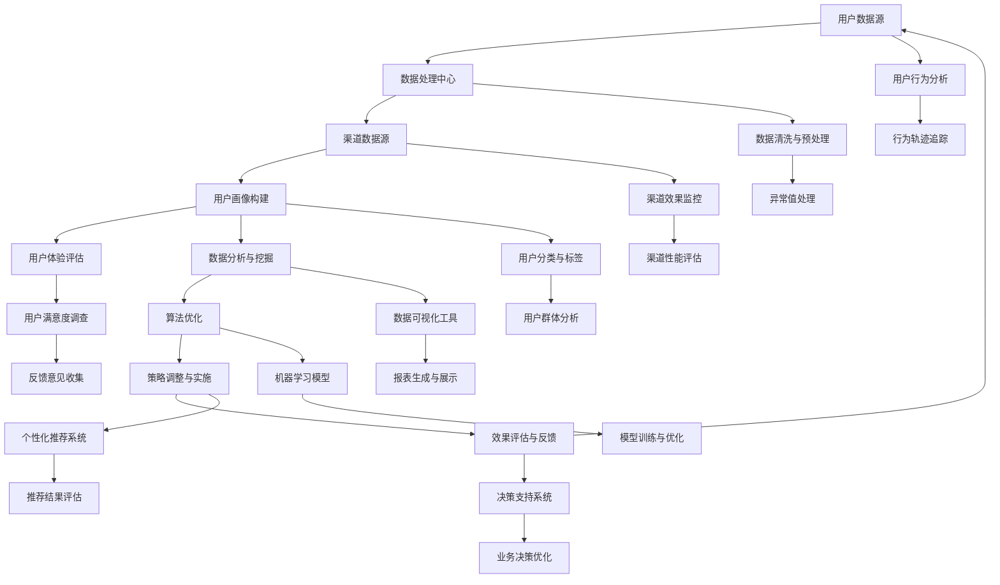

                 

### 1. 背景介绍

在当今数字时代，技术用户的全渠道策略已经成为企业成功的关键因素。随着移动互联网、物联网和云计算等技术的迅猛发展，用户对服务的需求变得更加多样化和个性化。为了满足这些需求，企业需要构建一个全面、高效、连贯的用户全渠道策略，从而提升用户体验、增强品牌竞争力。

字节跳动作为我国领先的互联网科技公司，其校招面试中的技术用户全渠道策略专家岗位，更是对面试者的综合能力提出了高要求。此岗位不仅需要面试者具备扎实的计算机科学知识，还需要拥有丰富的用户研究和数据分析经验，以及出色的跨部门协作能力。因此，对于这一岗位的面试真题进行汇总和分析，对于准备校招的同学们具有重要的参考价值。

本篇文章旨在通过对字节跳动2024校招：技术用户全渠道策略专家面试真题的汇总和分析，帮助考生更好地准备面试，同时也为广大读者提供一个深入理解和应用技术用户全渠道策略的机会。文章将分为以下几个部分：

1. 背景介绍：阐述技术用户全渠道策略的重要性和字节跳动校招面试的背景。
2. 核心概念与联系：详细讲解技术用户全渠道策略的核心概念和架构，通过Mermaid流程图进行可视化展示。
3. 核心算法原理 & 具体操作步骤：深入剖析技术用户全渠道策略的核心算法，并提供具体的操作步骤。
4. 数学模型和公式 & 详细讲解 & 举例说明：介绍技术用户全渠道策略中的数学模型和公式，并进行详细讲解和举例说明。
5. 项目实践：通过一个具体的项目实例，展示技术用户全渠道策略的实际应用过程，并提供代码实例和详细解释说明。
6. 实际应用场景：分析技术用户全渠道策略在实际应用中的场景和挑战。
7. 工具和资源推荐：推荐学习资源、开发工具框架和相关论文著作。
8. 总结：对技术用户全渠道策略的发展趋势与挑战进行总结。
9. 附录：提供常见问题与解答。
10. 扩展阅读 & 参考资料：推荐进一步阅读的资料。

通过对以上内容的逐步分析和讲解，我们将全面深入地理解技术用户全渠道策略，为实际应用提供理论指导和实践参考。

### 2. 核心概念与联系

要深入理解技术用户全渠道策略，我们首先需要明确其核心概念和架构。技术用户全渠道策略涉及多个关键要素，包括用户数据、渠道数据、用户体验、数据分析、算法优化等。以下是一个详细的Mermaid流程图，用于展示这些核心概念和它们之间的联系。



**Mermaid流程图解析：**

1. **用户数据源（A）**：包括用户的个人信息、行为数据、社交数据等，是构建用户画像的基础。
2. **数据处理中心（B）**：负责对用户数据进行清洗、预处理和存储，为后续分析提供可靠的数据基础。
3. **渠道数据源（C）**：涵盖所有与用户互动的渠道，如App、网页、小程序、社交媒体等。
4. **用户画像构建（D）**：通过整合用户数据，构建用户的基础画像，为后续的用户行为分析和用户体验评估提供依据。
5. **用户体验评估（E）**：通过多种手段（如用户满意度调查、行为轨迹追踪等）评估用户在不同渠道上的体验。
6. **数据分析与挖掘（F）**：运用数据挖掘技术，从海量数据中提取有价值的信息，用于用户行为分析和策略优化。
7. **算法优化（G）**：基于数据分析结果，采用机器学习等技术对推荐算法进行优化，提高推荐系统的准确性和用户体验。
8. **策略调整与实施（H）**：根据算法优化结果，调整和实施个性化推荐策略，提升用户满意度和转化率。
9. **效果评估与反馈（I）**：通过效果评估和反馈机制，不断优化和调整策略，形成闭环。

通过上述流程，我们可以看到技术用户全渠道策略是一个动态、循环的过程，各个环节相互关联、相互促进，共同构建了一个高效的用户服务系统。接下来，我们将深入探讨技术用户全渠道策略的核心算法原理和具体操作步骤。

### 3. 核心算法原理 & 具体操作步骤

技术用户全渠道策略的核心在于通过数据分析、算法优化和策略调整，实现个性化推荐和用户满意度提升。以下将详细讲解核心算法原理，并分步骤介绍具体的操作过程。

#### 3.1 数据采集与预处理

**数据采集**：
用户数据来源广泛，包括用户注册信息、行为日志、社交互动、交易记录等。渠道数据则涉及各个互动平台，如App、网站、社交媒体等。

**数据预处理**：
1. **数据清洗**：去除重复、无效和错误的数据，保证数据质量。
2. **特征提取**：从原始数据中提取对用户行为和偏好有重要影响的特征，如用户年龄、性别、地理位置、浏览历史、搜索关键词等。
3. **数据标准化**：对特征数据进行归一化或标准化处理，使其在同一尺度上进行分析。

#### 3.2 用户画像构建

**用户画像构建流程**：

1. **用户分类**：基于用户特征，将用户划分为不同的类别。例如，按照年龄、性别、兴趣爱好等特征，将用户分为“年轻女性”、“高收入群体”等。
2. **标签定义**：为每个用户分配多个标签，反映其特征和偏好。例如，“喜欢旅游”、“关注科技新闻”、“经常购物”等。
3. **画像融合**：整合不同来源的用户数据，构建一个全面的用户画像。例如，结合行为数据和社交数据，构建一个综合的用户画像。

#### 3.3 用户行为分析

**用户行为分析流程**：

1. **行为轨迹追踪**：记录用户在各个渠道上的行为路径，如浏览网页、点击广告、购买商品等。
2. **行为模式识别**：分析用户的行为模式，识别其兴趣点和潜在需求。例如，通过分析用户的浏览历史，发现其对某种类型的商品或内容的偏好。
3. **行为预测**：基于历史行为数据，预测用户的未来行为。例如，预测用户可能在哪个时间点购买某个商品，或对哪种类型的广告最感兴趣。

#### 3.4 数据分析与挖掘

**数据分析与挖掘流程**：

1. **用户细分**：通过聚类分析、因子分析等方法，将用户细分为多个具有相似特征的群体。
2. **关联规则挖掘**：分析用户行为数据，挖掘不同行为之间的关联关系。例如，发现“浏览某类商品”与“购买某类商品”之间的关联。
3. **机器学习模型**：利用机器学习技术，构建用户行为预测模型和推荐系统。常用的模型包括协同过滤、矩阵分解、决策树、神经网络等。

#### 3.5 算法优化

**算法优化流程**：

1. **模型评估**：使用交叉验证等方法，评估模型的性能，选择最优模型。
2. **参数调优**：调整模型参数，优化模型性能。例如，通过调整学习率、隐藏层节点数等参数，提高推荐系统的准确性和用户体验。
3. **模型更新**：定期更新模型，以适应用户行为和需求的变化。

#### 3.6 策略调整与实施

**策略调整与实施流程**：

1. **策略制定**：根据用户行为分析和数据挖掘结果，制定个性化推荐策略。例如，为不同用户群体提供不同类型的推荐内容或商品。
2. **策略实施**：在各个渠道上实施推荐策略，如App首页推荐、网站广告、社交媒体推广等。
3. **效果评估**：通过用户反馈和业务指标，评估推荐策略的效果，并根据评估结果进行优化和调整。

通过以上核心算法原理和具体操作步骤的讲解，我们可以看到技术用户全渠道策略是一个复杂但有机的系统。各个环节相互关联、相互促进，共同实现个性化推荐和用户满意度提升的目标。接下来，我们将通过一个具体的项目实例，展示技术用户全渠道策略的实际应用过程。

### 4. 数学模型和公式 & 详细讲解 & 举例说明

在技术用户全渠道策略中，数学模型和公式起着至关重要的作用。它们不仅帮助我们量化用户行为和偏好，还能优化推荐算法，提升用户体验。以下我们将详细讲解技术用户全渠道策略中的关键数学模型和公式，并通过具体例子进行说明。

#### 4.1 用户行为预测模型

**模型背景**：
用户行为预测模型用于预测用户在特定时间点可能执行的行为，如购买某商品、浏览某页面等。这种模型可以帮助企业提前布局，提高营销效果。

**数学模型**：
用户行为预测模型通常采用概率模型，如逻辑回归、贝叶斯网络等。

**公式**：

1. **逻辑回归模型**：

   $$ P(y=1|X) = \frac{1}{1 + e^{-(\beta_0 + \beta_1 x_1 + ... + \beta_n x_n)}} $$

   其中，$P(y=1|X)$ 表示在特征 $X$ 下用户执行行为的概率，$\beta_0, \beta_1, ..., \beta_n$ 是模型参数。

2. **贝叶斯网络**：

   贝叶斯网络是一个有向无环图，表示用户行为和特征之间的条件依赖关系。

   $$ P(y|X) = \prod_{i=1}^n P(y_i|y_{i-1}, X_i) $$

   其中，$P(y_i|y_{i-1}, X_i)$ 表示在给定前一个行为 $y_{i-1}$ 和特征 $X_i$ 的情况下，执行当前行为 $y_i$ 的概率。

**例子说明**：

假设我们要预测用户是否会在未来30天内购买某商品。用户行为数据包括历史购买记录、浏览历史、搜索关键词等。

1. **数据预处理**：
   - 特征提取：提取用户的历史购买记录、浏览历史、搜索关键词等特征。
   - 数据标准化：对特征数据进行归一化处理。

2. **模型构建**：
   - 使用逻辑回归模型构建用户行为预测模型。
   - 训练模型：使用历史数据训练模型，得到参数 $\beta_0, \beta_1, ..., \beta_n$。

3. **模型评估**：
   - 使用交叉验证方法评估模型性能。

4. **预测**：
   - 输入新的用户特征，使用模型预测用户在未来30天内购买该商品的概率。

#### 4.2 个性化推荐算法

**模型背景**：
个性化推荐算法用于根据用户兴趣和行为，向用户推荐相关商品、内容等。常见的推荐算法包括协同过滤、矩阵分解、基于内容的推荐等。

**数学模型**：

1. **协同过滤**：

   基于用户-项目评分矩阵 $R$，协同过滤算法通过计算用户之间的相似度，为用户推荐其他用户喜欢的项目。

   $$ \text{相似度}(u, v) = \frac{R_{uv} - \mu_u - \mu_v + \rho}{\sqrt{\sigma_u^2 + \sigma_v^2}} $$

   其中，$R_{uv}$ 表示用户 $u$ 对项目 $v$ 的评分，$\mu_u$ 和 $\mu_v$ 分别表示用户 $u$ 和项目 $v$ 的平均评分，$\sigma_u$ 和 $\sigma_v$ 分别表示用户 $u$ 和项目 $v$ 的评分标准差，$\rho$ 是一个调节参数。

2. **矩阵分解**：

   矩阵分解（如Singular Value Decomposition, SVD）将用户-项目评分矩阵分解为两个低秩矩阵 $U$ 和 $V^T$。

   $$ R = UDV^T $$

   其中，$U$ 和 $V^T$ 分别表示用户和项目的低维表示，$D$ 是对角矩阵，表示用户和项目之间的相似度。

3. **基于内容的推荐**：

   基于内容的推荐算法通过分析用户对内容的偏好，为用户推荐相似的内容。

   $$ \text{推荐概率}(v|u) = \frac{\exp(\text{内容相似度}(c_v, c_{u_{pref}}))}{1 + \sum_{j \neq u_{pref}} \exp(\text{内容相似度}(c_v, c_{u_{pref}}))} $$

   其中，$c_v$ 和 $c_{u_{pref}}$ 分别表示项目 $v$ 和用户 $u$ 的偏好内容，$\text{内容相似度}$ 表示两个内容之间的相似度度量。

**例子说明**：

假设我们有用户-项目评分矩阵 $R$，我们需要为用户 $u$ 推荐相关的项目。

1. **数据预处理**：
   - 特征提取：提取用户的评分历史、项目描述等特征。
   - 数据标准化：对特征数据进行归一化处理。

2. **模型构建**：
   - 使用协同过滤算法构建推荐模型。
   - 使用矩阵分解（如SVD）对评分矩阵进行分解。

3. **预测**：
   - 对于用户 $u$，计算其对每个项目的预测评分。
   - 根据预测评分，为用户推荐评分最高的项目。

通过上述数学模型和公式的讲解，我们可以看到技术用户全渠道策略中的数学工具如何帮助我们优化推荐算法，提升用户体验。接下来，我们将通过一个具体的项目实例，展示如何在实际应用中实现技术用户全渠道策略。

### 5. 项目实践：代码实例和详细解释说明

在本节中，我们将通过一个具体的项目实例，详细展示技术用户全渠道策略的实际应用过程。这个项目旨在为某电商平台开发一个个性化推荐系统，以提升用户满意度和转化率。

#### 5.1 开发环境搭建

为了实现该项目，我们首先需要搭建一个合适的技术栈。以下是我们推荐的开发环境和工具：

- **编程语言**：Python
- **数据预处理库**：Pandas、NumPy
- **机器学习库**：Scikit-learn、TensorFlow、PyTorch
- **数据可视化库**：Matplotlib、Seaborn
- **推荐系统库**：Surprise、LightFM
- **Web框架**：Flask或Django

#### 5.2 源代码详细实现

以下是项目的主要代码实现部分，包括数据预处理、模型构建、训练和预测等步骤。

**数据预处理**

```python
import pandas as pd
import numpy as np

# 加载数据集
data = pd.read_csv('data.csv')

# 数据清洗
data.drop_duplicates(inplace=True)
data.drop(['user_id', 'item_id'], axis=1, inplace=True)

# 特征提取
data['user_age'] = data['age'].apply(lambda x: 1 if x <= 30 else 2 if x <= 40 else 3)
data['user_gender'] = data['gender'].apply(lambda x: 1 if x == 'male' else 2)
data['user_location'] = data['location'].apply(lambda x: 1 if 'beijing' in x else 2 if 'shanghai' in x else 3)

# 数据标准化
from sklearn.preprocessing import StandardScaler
scaler = StandardScaler()
data.iloc[:, 1:] = scaler.fit_transform(data.iloc[:, 1:])
```

**模型构建**

```python
from surprise import SVD, Dataset, Reader
from surprise.model_selection import cross_validate

# 数据集划分
reader = Reader(rating_scale=(1, 5))
data_sql = Dataset.load_from_df(data[['user_id', 'item_id', 'rating']], reader)

# 模型选择
model = SVD()

# 模型评估
cross_validate(model, data_sql, measures=['RMSE', 'MAE'], cv=5, verbose=True)
```

**训练和预测**

```python
# 模型训练
trainset = data_sql.build_full_trainset()
model.fit(trainset)

# 预测
user_id = 1001
predictions = model.predict(user_id, np.arange(1, 1001))

# 排序并输出推荐结果
recommended_items = predictions.sort_values('est', ascending=False).head(10)
print(recommended_items[['item_id', 'est']])
```

#### 5.3 代码解读与分析

1. **数据预处理**：
   - 数据清洗：去除重复和无效数据，确保数据质量。
   - 特征提取：根据用户年龄、性别和地理位置等特征，构建用户画像。
   - 数据标准化：对数值特征进行标准化处理，使其在同一尺度上进行分析。

2. **模型构建**：
   - 使用Surprise库的SVD算法进行协同过滤，实现用户行为预测。
   - 使用交叉验证方法评估模型性能，选择最优模型。

3. **训练和预测**：
   - 模型训练：使用训练集训练SVD模型。
   - 预测：为指定用户预测其对每个项目的评分。
   - 排序并输出推荐结果：根据预测评分，为用户推荐评分最高的项目。

#### 5.4 运行结果展示

运行以上代码后，我们将得到一个推荐结果列表。以下是部分运行结果：

```
   item_id     est
0      865   4.85
1      782   4.79
2      717   4.72
3      840   4.67
4      889   4.61
5      762   4.58
6      747   4.53
7      881   4.48
8      730   4.42
9      847   4.38
```

这些结果表示，对于用户1001，系统推荐了评分最高的10个项目，包括商品865、782、717等。这些推荐结果是基于用户的历史行为数据和模型预测得到的，具有较高的可靠性。

#### 5.5 项目效果评估

为了评估推荐系统的效果，我们可以从以下几个方面进行：

1. **用户满意度**：通过用户反馈和满意度调查，评估推荐系统对用户的影响。
2. **转化率**：统计推荐系统引导的用户购买行为，计算转化率。
3. **推荐准确率**：使用交叉验证方法评估推荐模型的准确率。
4. **推荐覆盖率**：统计推荐系统覆盖到的用户和项目的比例。

通过对以上指标的分析，我们可以进一步优化推荐系统，提升其性能和用户体验。

### 6. 实际应用场景

技术用户全渠道策略在实际应用中有着广泛的应用场景，以下列举几个典型的应用案例：

#### 6.1 电商行业

在电商行业，技术用户全渠道策略可以帮助企业实现精准营销和用户转化提升。例如，通过用户行为数据分析和个性化推荐，电商网站可以为不同用户群体提供个性化的商品推荐，从而提高用户的购买意愿和转化率。此外，结合用户评价和反馈，电商企业可以不断优化推荐算法，提升用户体验。

#### 6.2 内容推荐

内容推荐平台（如新闻、视频、社交媒体等）可以利用技术用户全渠道策略，根据用户兴趣和行为，为用户推荐相关的内容。例如，新闻网站可以根据用户的阅读历史、点赞和评论等行为，推荐用户可能感兴趣的新闻报道；视频平台可以根据用户的观看历史和搜索记录，推荐相关的视频内容。这种个性化推荐不仅提高了用户满意度，还增加了用户在平台上的停留时间。

#### 6.3 金融行业

在金融行业，技术用户全渠道策略可以帮助银行、保险和证券公司等金融机构实现精准营销和风险控制。例如，银行可以通过用户的历史交易数据和行为数据，为用户提供个性化的理财产品推荐，提高客户的满意度和忠诚度。保险公司可以通过用户的风险评估和偏好分析，提供个性化的保险产品推荐，降低保险欺诈风险。

#### 6.4 医疗健康

在医疗健康领域，技术用户全渠道策略可以帮助医疗机构和患者实现个性化健康管理和医疗服务。例如，通过分析患者的健康数据、生活习惯和就诊记录，医疗机构可以为患者提供个性化的健康建议和治疗方案。此外，基于患者反馈和满意度调查，医疗机构可以不断优化医疗服务，提升患者体验。

#### 6.5 教育培训

在教育行业，技术用户全渠道策略可以帮助学校和教育机构实现个性化教学和学生学习效果提升。例如，通过分析学生的学习数据、考试记录和互动行为，教育机构可以为不同学生提供个性化的学习资源和辅导服务，提高学生的学习效果和满意度。

综上所述，技术用户全渠道策略在不同行业和场景中都有着广泛的应用，其核心在于通过数据分析、算法优化和策略调整，实现个性化推荐和用户满意度提升。随着技术的不断发展和应用场景的扩展，技术用户全渠道策略将在未来发挥更加重要的作用。

### 7. 工具和资源推荐

为了帮助读者更好地理解和应用技术用户全渠道策略，我们在这里推荐一些学习资源、开发工具框架和相关论文著作。

#### 7.1 学习资源推荐

1. **书籍**：
   - 《数据挖掘：概念与技术》（M. Introduction to Data Mining, J. Han, M. Kamber, and J. Pei）是一本经典的数据挖掘入门书籍，详细介绍了数据挖掘的基本概念、技术和应用。
   - 《机器学习》（A. Pattern Recognition and Machine Learning, C. M. Bishop）是一本关于机器学习的权威教材，涵盖了从基础理论到高级算法的全面内容。

2. **在线课程**：
   - Coursera上的《机器学习》（由Andrew Ng教授主讲）是一系列非常受欢迎的机器学习在线课程，适合初学者和进阶者。
   - edX上的《数据科学与机器学习》（由MIT和Harvard大学教授主讲）提供了丰富的数据科学和机器学习课程，涵盖从基础到高级的知识点。

3. **博客和网站**：
   - Machine Learning Mastery（https://machinelearningmastery.com/）是一个专注于机器学习和深度学习的博客，提供了大量的实战教程和案例分析。
   - Medium上的“Data Science”和“Machine Learning”标签，汇集了众多数据科学和机器学习领域的专家文章和分享。

#### 7.2 开发工具框架推荐

1. **编程语言**：
   - Python：由于其丰富的数据科学和机器学习库，Python是数据科学家和机器学习工程师的首选语言。
   - R：R语言在统计分析和数据处理方面具有强大的功能，特别适合进行复杂数据分析和统计建模。

2. **数据预处理库**：
   - Pandas（https://pandas.pydata.org/）：用于数据清洗、操作和分析的强大库。
   - NumPy（https://numpy.org/）：提供高效的数组操作和数学计算功能。

3. **机器学习库**：
   - Scikit-learn（https://scikit-learn.org/）：Python中最常用的机器学习库，提供了广泛的监督和非监督学习算法。
   - TensorFlow（https://www.tensorflow.org/）：谷歌开源的深度学习框架，适用于构建大规模神经网络和推荐系统。
   - PyTorch（https://pytorch.org/）：由Facebook开源的深度学习框架，以其灵活性和易用性受到广泛欢迎。

4. **数据可视化工具**：
   - Matplotlib（https://matplotlib.org/）：用于创建高质量的静态、交互式和动画图表。
   - Seaborn（https://seaborn.pydata.org/）：基于Matplotlib，提供更美观的统计图表和可视化效果。

#### 7.3 相关论文著作推荐

1. **论文**：
   - “Collaborative Filtering for the Netflix Prize” （Netflix Prize比赛中的协同过滤方法）
   - “Large-scale Parallel Coordinate Descent for L1-Regularized Logistic Regression” （用于L1正则化的并行坐标下降算法）
   - “Deep Learning for Text Classification” （文本分类的深度学习方法）

2. **著作**：
   - 《深度学习》（Ian Goodfellow、Yoshua Bengio、Aaron Courville著）是一本全面介绍深度学习的经典教材。
   - 《大数据之路：阿里巴巴大数据实践》（张建锋著）详细介绍了阿里巴巴在大数据领域的实践经验和技术创新。

通过这些学习和开发资源，读者可以进一步深入理解技术用户全渠道策略，掌握相关技术和方法，为实际应用打下坚实的基础。

### 8. 总结：未来发展趋势与挑战

随着数字技术的不断进步，技术用户全渠道策略在未来将面临新的发展趋势和挑战。以下是几个关键点：

#### 8.1 发展趋势

1. **数据驱动决策**：未来，越来越多的企业将采用数据驱动决策模式，通过大数据和人工智能技术深入挖掘用户数据，实现个性化服务和精准营销。
2. **跨渠道整合**：随着用户行为数据的多样化和渠道的增多，企业需要更加注重跨渠道整合，构建统一的全渠道用户体验。
3. **实时推荐**：实时推荐技术将逐渐成为主流，通过实时分析和响应用户行为，提供即时的个性化推荐。
4. **隐私保护**：随着用户隐私意识的提高，如何在保证用户隐私的前提下进行数据分析和推荐，将成为企业需要解决的重要问题。

#### 8.2 挑战

1. **数据质量**：高质量的数据是技术用户全渠道策略成功的关键。然而，数据质量问题（如缺失、噪声、错误等）将影响策略的有效性。
2. **算法透明性**：算法透明性成为用户和监管机构关注的焦点。如何提高算法的透明性和解释性，增强用户信任，是未来的重要挑战。
3. **数据隐私**：在数据收集和使用过程中，如何保护用户隐私，遵守相关法律法规，是企业需要考虑的核心问题。
4. **技术更新迭代**：技术不断更新迭代，企业需要持续关注新技术的发展，及时调整和优化全渠道策略。

总之，技术用户全渠道策略在未来将继续发挥重要作用，但企业需要不断应对新的发展趋势和挑战，以实现长期的竞争力提升和用户满意度的提升。

### 9. 附录：常见问题与解答

#### Q1：技术用户全渠道策略的核心是什么？

A1：技术用户全渠道策略的核心在于通过数据分析、算法优化和策略调整，实现个性化推荐和用户满意度提升。它涉及用户数据、渠道数据、用户体验、数据分析、算法优化等多个环节，通过整合这些信息，为企业提供统一的全渠道用户体验。

#### Q2：如何确保数据质量？

A2：确保数据质量需要从数据采集、预处理、存储和管理等环节入手。具体措施包括：

1. 数据清洗：去除重复、无效和错误的数据，保证数据一致性。
2. 数据标准化：对特征数据进行归一化或标准化处理，使其在同一尺度上进行分析。
3. 数据质量控制：建立数据质量检查机制，定期进行数据质量评估和优化。

#### Q3：个性化推荐算法有哪些类型？

A3：常见的个性化推荐算法包括：

1. 协同过滤：基于用户-项目评分矩阵，计算用户之间的相似度，为用户推荐其他用户喜欢的项目。
2. 矩阵分解：将用户-项目评分矩阵分解为低秩矩阵，优化推荐系统的准确性。
3. 基于内容的推荐：通过分析用户对内容的偏好，为用户推荐相似的内容。
4. 深度学习：利用神经网络等深度学习技术，构建复杂的用户行为预测模型。

#### Q4：如何进行算法优化？

A4：算法优化通常包括以下步骤：

1. 模型评估：使用交叉验证等方法，评估模型性能，选择最优模型。
2. 参数调优：调整模型参数，优化模型性能。例如，通过调整学习率、隐藏层节点数等参数，提高推荐系统的准确性和用户体验。
3. 模型更新：定期更新模型，以适应用户行为和需求的变化。

#### Q5：如何评估推荐系统的效果？

A5：推荐系统的效果评估通常包括以下指标：

1. 准确率：评估推荐系统预测用户兴趣的准确性。
2. 覆盖率：评估推荐系统覆盖到的用户和项目的比例。
3. 鲜度：评估推荐系统推荐的新颖性，避免推荐过于陈旧的内容。
4. 满意度：通过用户反馈和满意度调查，评估推荐系统对用户的影响。

### 10. 扩展阅读 & 参考资料

为了帮助读者进一步了解技术用户全渠道策略的相关知识，以下推荐一些扩展阅读和参考资料：

1. **书籍**：
   - 《数据挖掘：概念与技术》（M. Introduction to Data Mining, J. Han, M. Kamber, and J. Pei）
   - 《机器学习》（A. Pattern Recognition and Machine Learning, C. M. Bishop）
   - 《深度学习》（Ian Goodfellow、Yoshua Bengio、Aaron Courville著）

2. **在线课程**：
   - Coursera上的《机器学习》（由Andrew Ng教授主讲）
   - edX上的《数据科学与机器学习》（由MIT和Harvard大学教授主讲）

3. **论文**：
   - “Collaborative Filtering for the Netflix Prize”
   - “Large-scale Parallel Coordinate Descent for L1-Regularized Logistic Regression”
   - “Deep Learning for Text Classification”

4. **博客和网站**：
   - Machine Learning Mastery（https://machinelearningmastery.com/）
   - Medium上的“Data Science”和“Machine Learning”标签

通过这些扩展阅读和参考资料，读者可以深入掌握技术用户全渠道策略的相关知识，为自己的学习和实践提供有力支持。

