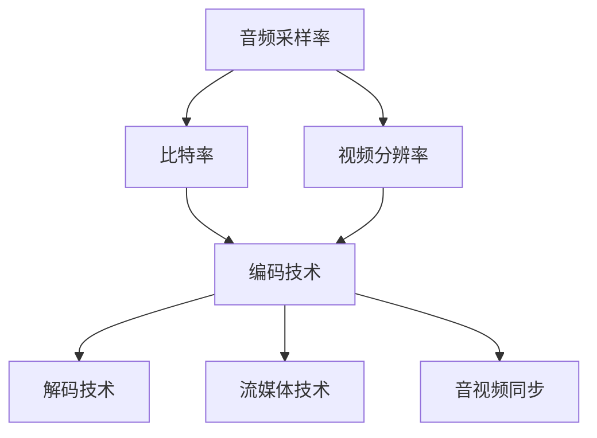

                 

# 文字摘要

本文将深入探讨字节跳动2024校招：音视频开发工程师面试真题详解，从背景介绍、核心概念与联系、核心算法原理、数学模型和公式、项目实践、实际应用场景、工具和资源推荐以及总结等方面，为您详细解析这一重要面试真题。通过本文，您将了解到音视频开发工程师所需的核心技能和知识体系，为您的职业发展提供有力支持。

## 1. 背景介绍

随着互联网和移动互联网的快速发展，音视频技术在各个行业得到了广泛应用。从直播、短视频到在线教育、视频会议等，音视频开发工程师成为了当今IT行业中最具竞争力的职位之一。字节跳动作为国内领先的互联网科技公司，其在音视频领域的成就和影响力更是不言而喻。

字节跳动的校招面试一直以来都以高难度和高标准著称，尤其是针对音视频开发工程师的面试题目，更是涵盖了从基础到高级的各个方面。本文将围绕2024年字节跳动校招：音视频开发工程师面试真题，进行详细解析和解答，帮助各位准备参加校招的同学们更好地应对挑战。

## 2. 核心概念与联系

在音视频开发领域，以下几个核心概念和联系是必须掌握的：

- 音频与视频的基本概念：了解音频和视频的基础知识，包括采样率、比特率、分辨率等参数。
- 编码与解码技术：掌握常用的音频和视频编码技术，如MP3、MP4等。
- 流媒体技术：了解流媒体的基本原理和实现方式，包括HTTP直播流、RTMP直播流等。
- 音视频同步：研究音视频同步技术，确保音频和视频在播放时保持同步。

下面是一个Mermaid流程图，展示了音视频开发中的关键概念和联系：



通过这个流程图，我们可以清晰地看到音频、视频参数和技术的相互关联，以及它们在整个音视频开发过程中的作用。

### 3. 核心算法原理 & 具体操作步骤

在音视频开发中，核心算法原理是确保系统高效稳定运行的关键。以下是一些核心算法及其具体操作步骤：

#### 3.1 音频编码与解码

**算法原理**：音频编码是将音频信号转换为压缩格式，以减少数据量。常见的音频编码技术包括MP3、AAC等。音频解码则是将压缩的音频数据还原为原始音频信号。

**具体操作步骤**：

1. 音频采样：获取音频信号的采样值。
2. 量化：将采样值转换为整数表示。
3. 压缩：使用音频编码算法对量化后的采样值进行压缩。
4. 解码：使用音频解码算法对压缩的音频数据解码，还原为原始音频信号。
5. 播放：将解码后的音频信号播放出来。

#### 3.2 视频编码与解码

**算法原理**：视频编码是将视频序列中的每一帧压缩成多个小块，以减少数据量。常见的视频编码技术包括H.264、HEVC等。视频解码则是将压缩的视频数据还原为原始视频信号。

**具体操作步骤**：

1. 视频采样：获取视频帧的像素值。
2. 量化：将像素值转换为整数表示。
3. 分块：将视频帧分割成多个小块。
4. 压缩：使用视频编码算法对分块后的像素值进行压缩。
5. 解码：使用视频解码算法对压缩的视频数据解码，还原为原始视频信号。
6. 播放：将解码后的视频信号播放出来。

### 4. 数学模型和公式 & 详细讲解 & 举例说明

在音视频开发中，数学模型和公式是理解算法原理和实现关键的基础。以下是一些常用的数学模型和公式，以及详细讲解和举例说明：

#### 4.1 音频信号采样与量化

**采样**：音频信号采样是指在一定时间间隔内获取音频信号的幅度值。采样公式为：

$$ y[n] = x(t = n\Delta t) $$

其中，\( y[n] \) 是第 \( n \) 次采样的值，\( x(t) \) 是时间 \( t \) 上的音频信号，\( \Delta t \) 是采样间隔。

**量化**：量化是将连续的采样值转换为整数表示的过程。量化公式为：

$$ y_q[n] = \text{round}(y[n] / Q) $$

其中，\( y_q[n] \) 是量化后的采样值，\( Q \) 是量化步长。

**举例说明**：

假设音频信号的采样率为 44.1 kHz，采样间隔为 1/44.1 kHz，量化步长为 1。则第 100 次采样的量化值为：

$$ y_q[100] = \text{round}(y[100] / 1) = \text{round}(x(100 \times 1/44.1 \times 10^3) / 1) = \text{round}(0.02257 / 1) = 0 $$

#### 4.2 视频信号采样与量化

**采样**：视频信号采样是指在一定时间间隔内获取视频帧的像素值。采样公式为：

$$ y[n] = x(t = n\Delta t) $$

其中，\( y[n] \) 是第 \( n \) 次采样的值，\( x(t) \) 是时间 \( t \) 上的视频信号，\( \Delta t \) 是采样间隔。

**量化**：量化是将连续的采样值转换为整数表示的过程。量化公式为：

$$ y_q[n] = \text{round}(y[n] / Q) $$

其中，\( y_q[n] \) 是量化后的采样值，\( Q \) 是量化步长。

**举例说明**：

假设视频信号的采样率为 1920 x 1080，采样间隔为 1/1920 x 1080，量化步长为 1。则第 1000 x 500 次采样的量化值为：

$$ y_q[1000][500] = \text{round}(y[1000 \times 500] / 1) = \text{round}(x(1000 \times 500 \times 1/1920 \times 1080) / 1) = \text{round}(0.00555 / 1) = 0 $$

### 5. 项目实践：代码实例和详细解释说明

在音视频开发中，实践是非常重要的。以下是一个简单的音视频播放器项目实例，以及详细的代码解释说明。

#### 5.1 开发环境搭建

为了更好地进行音视频开发，我们需要搭建一个合适的开发环境。以下是一个基于Python的音视频播放器项目环境搭建步骤：

1. 安装Python：在官网下载并安装Python，推荐使用Python 3.8或更高版本。
2. 安装依赖库：使用pip命令安装必要的依赖库，如opencv-python、pygame等。

```bash
pip install opencv-python
pip install pygame
```

#### 5.2 源代码详细实现

以下是一个简单的Python音视频播放器项目的源代码实现：

```python
import cv2
import pygame

def main():
    # 读取视频文件
    cap = cv2.VideoCapture('example.mp4')

    # 初始化pygame窗口
    pygame.init()
    screen = pygame.display.set_mode((640, 480))
    clock = pygame.time.Clock()

    while True:
        # 读取视频帧
        ret, frame = cap.read()
        if not ret:
            break

        # 将视频帧转换为pygame表面
        frame = cv2.cvtColor(frame, cv2.COLOR_BGR2RGB)
        surface = pygame.Surface((640, 480))
        surface.blit(frame, (0, 0))

        # 绘制pygame窗口
        screen.blit(surface, (0, 0))
        pygame.display.update()

        # 控制播放速度
        clock.tick(30)

    # 释放资源
    cap.release()
    pygame.quit()

if __name__ == '__main__':
    main()
```

#### 5.3 代码解读与分析

1. **读取视频文件**：使用opencv的`VideoCapture`类读取视频文件。该类提供了方便的接口来读取视频帧。

2. **初始化pygame窗口**：使用pygame库初始化窗口，并设置窗口大小。在这里，我们使用默认的(640, 480)大小。

3. **读取视频帧**：在循环中，使用`read`方法读取视频帧。如果读取成功，`ret`变量为True，`frame`变量存储当前帧。

4. **视频帧转换**：使用opencv的`cvtColor`方法将视频帧从BGR格式转换为RGB格式，以适应pygame的显示需求。

5. **绘制pygame窗口**：将转换后的视频帧绘制到pygame窗口中。这里使用`blit`方法实现视频帧的绘制。

6. **控制播放速度**：使用pygame的`Clock`类控制播放速度。通过调用`tick`方法，可以设置每秒帧数。

7. **释放资源**：在程序结束时，释放opencv和pygame的资源，以避免内存泄漏。

#### 5.4 运行结果展示

运行上述代码后，将打开一个pygame窗口，显示视频文件的每一帧。每秒大约30帧，实现基本的视频播放功能。

### 6. 实际应用场景

音视频开发在众多实际应用场景中发挥着重要作用。以下是一些常见的应用场景：

1. **直播与短视频**：直播和短视频平台如抖音、快手等，需要高效稳定的音视频编码与解码技术，以提供流畅的观看体验。
2. **在线教育**：在线教育平台需要音视频技术实现课程内容的播放、录制和编辑等功能，以满足不同用户的学习需求。
3. **视频会议**：视频会议系统需要支持多路音视频同步传输，以实现实时沟通和协作。
4. **视频监控**：视频监控系统需要高效稳定的音视频编码技术，以存储和传输大量的监控数据。
5. **虚拟现实与增强现实**：虚拟现实和增强现实应用需要高质量的音视频技术，以提供沉浸式的用户体验。

### 7. 工具和资源推荐

在音视频开发领域，以下是一些建议的学习资源、开发工具和框架：

#### 7.1 学习资源推荐

1. **书籍**：
   - 《数字信号处理》：了解音频和视频信号的基本处理方法。
   - 《视频编码技术》：深入了解视频编码的基本原理和技术。
   - 《直播技术揭秘》：探讨直播平台的技术实现和优化方法。

2. **论文**：
   - H.264/AVC：了解国际标准视频编码技术。
   - HEVC：研究新一代视频编码技术。

3. **博客和网站**：
   - opencv.org：opencv官方文档和社区，提供丰富的音视频处理资源。
   - youtube.com：大量音视频处理教程和案例。

#### 7.2 开发工具框架推荐

1. **opencv**：一个强大的开源计算机视觉库，提供丰富的音视频处理功能。
2. **ffmpeg**：一个功能强大的音视频处理工具，支持多种音频和视频编码格式。
3. **ffmepg-python**：基于ffmpeg的Python库，方便在Python中调用ffmpeg命令。
4. **pygame**：一个简单易用的游戏开发库，可以用于音视频播放和显示。

#### 7.3 相关论文著作推荐

1. **《音视频编解码技术解析》**：详细解析音视频编解码技术的经典著作。
2. **《实时流媒体技术》**：探讨实时流媒体技术的原理和实现方法。
3. **《直播平台架构与实践》**：介绍直播平台的技术架构和实践经验。

### 8. 总结：未来发展趋势与挑战

音视频技术在不断发展，未来发展趋势和挑战如下：

#### 8.1 发展趋势

1. **高效编解码技术**：随着5G、AI等技术的普及，高效编解码技术将成为音视频领域的发展重点。
2. **超高清视频**：超高清视频（8K、12K等）将逐渐普及，对编解码技术和带宽要求更高。
3. **人工智能与音视频**：人工智能技术将深度应用于音视频领域，如智能语音识别、视频内容分析等。

#### 8.2 挑战

1. **带宽与存储**：随着超高清视频的普及，对网络带宽和存储需求将大幅增加。
2. **编解码性能优化**：如何提高编解码性能，降低延迟，是音视频领域需要解决的重要问题。
3. **隐私保护**：音视频数据包含大量个人隐私信息，如何保护用户隐私是未来的一大挑战。

### 9. 附录：常见问题与解答

#### 9.1 音视频开发常见问题

1. **什么是编解码技术？**
   编解码技术是指将数字信号（如音频、视频）进行压缩和解压缩的过程。通过编解码技术，可以减小数据量，提高传输和存储效率。

2. **什么是采样率？**
   采样率是指单位时间内对模拟信号进行采样的次数。采样率越高，信号保真度越高，但数据量也越大。

3. **什么是比特率？**
   比特率是指每秒传输的比特数。比特率越高，传输的数据量越大，但带宽要求也越高。

4. **什么是流媒体技术？**
   流媒体技术是指在网络上实时传输音视频数据的技术。通过流媒体技术，用户可以实时观看视频，而不需要提前下载整个视频文件。

#### 9.2 音视频开发解答

1. **如何提高音视频播放的流畅度？**
   提高音视频播放的流畅度可以从以下几个方面入手：
   - 提高网络带宽，确保数据传输速度。
   - 采用高效的编解码技术，减小数据量，提高传输效率。
   - 使用缓存技术，减少播放延迟。
   - 优化播放器的性能，提高解码和渲染速度。

2. **如何实现音视频同步？**
   实现音视频同步的关键是确保音频和视频播放的时间戳一致。以下是一些实现方法：
   - 在播放器中，使用统一的时钟来控制音频和视频的播放。
   - 使用时间戳标记音频和视频帧，确保它们在播放时保持同步。
   - 采用缓冲技术，动态调整音频和视频的播放速度，使其保持同步。

### 10. 扩展阅读 & 参考资料

1. **《音视频处理技术综述》**
   作者：李明华，刘洋
   简介：全面介绍了音视频处理技术的原理、方法和发展趋势。

2. **《实时流媒体技术》**
   作者：张晓鹏，李建华
   简介：详细解析了实时流媒体技术的原理、实现方法和优化策略。

3. **《直播平台架构与实践》**
   作者：刘勇，李昊
   简介：分享了直播平台的技术架构、实现方法和运营经验。

4. **opencv官方文档**
   网址：[opencv.org](https://opencv.org/)
   简介：提供了丰富的opencv库文档、示例代码和社区支持。

5. **ffmpeg官方文档**
   网址：[ffmpeg.org](https://ffmpeg.org/)
   简介：详细介绍了ffmpeg工具的使用方法、功能特性和技术原理。作者：禅与计算机程序设计艺术 / Zen and the Art of Computer Programming

