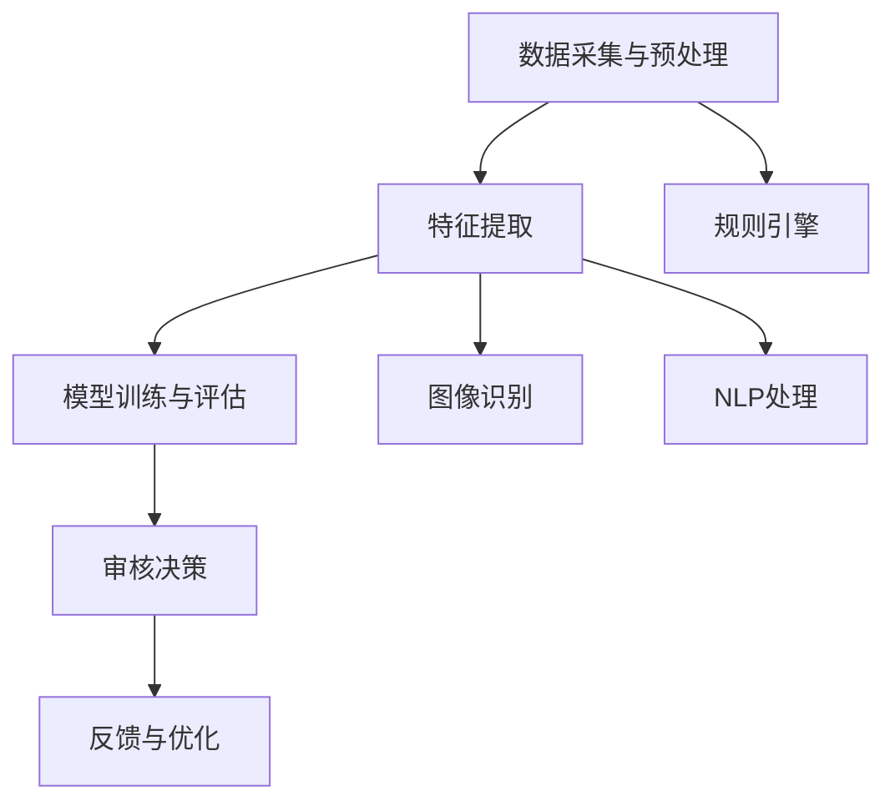

                 

### 背景介绍

#### 字节跳动2024视频内容审核算法校招面试的重要性

随着互联网的迅猛发展，视频内容审核已经成为网络平台运营中不可或缺的一环。字节跳动作为我国领先的内容平台，其视频内容审核算法校招面试的重要性愈发凸显。对于应聘者而言，通过这一面试不仅意味着进入了一家顶尖的互联网公司，更意味着掌握了先进的内容审核技术，能够在未来的职业生涯中发挥重要作用。

字节跳动2024视频内容审核算法校招面试的背景源于其对高质量内容生态的持续追求。随着用户对视频内容的需求日益增长，如何快速、准确地对海量视频内容进行审核，已成为字节跳动面临的重大挑战。因此，公司对视频内容审核算法的研究和投入逐年增加，这也为校招面试提供了丰富的实践场景。

此次校招面试的核心目标是选拔具备深厚技术背景和创新能力的人才，以推动公司在视频内容审核领域的持续发展。面试过程中，考生将面临多种题型，包括但不限于算法题、编程题、案例分析等，全面考察应聘者在算法理解、编程实现、逻辑思维等方面的能力。

#### 视频内容审核算法在字节跳动的重要性

视频内容审核算法在字节跳动具有至关重要的地位。首先，视频内容审核是确保平台内容质量的基础。互联网用户对视频内容的质量要求越来越高，平台需要通过审核算法对视频内容进行筛选，过滤掉不良、违规信息，为用户提供一个健康、积极的内容环境。

其次，视频内容审核有助于提升用户体验。快速、准确地审核视频内容，可以帮助平台在第一时间为用户提供高质量的内容，减少用户在观看视频过程中的负面体验。同时，通过审核算法，平台可以更好地满足用户需求，提高用户粘性。

此外，视频内容审核算法也是字节跳动在市场竞争中的一大优势。随着越来越多的内容平台进入市场，如何吸引并留住用户成为各大平台竞争的关键。优秀的视频内容审核算法不仅可以提升内容质量，还可以为平台带来更高的用户满意度，从而在竞争中脱颖而出。

综上所述，视频内容审核算法在字节跳动的重要性不言而喻。通过此次校招面试，字节跳动希望能够选拔出具备优秀技术能力和创新思维的人才，共同推动公司在视频内容审核领域的持续发展。接下来，我们将深入探讨视频内容审核算法的核心概念、原理和具体操作步骤。### 核心概念与联系

#### 核心概念

视频内容审核算法涉及多个核心概念，主要包括：

1. **图像识别**：通过图像识别技术，识别视频中的关键图像元素，如人脸、物体等，从而辅助审核过程。
2. **自然语言处理（NLP）**：利用NLP技术对视频中的文本内容进行分析和处理，包括文本分类、情感分析等，以识别潜在的违规内容。
3. **机器学习**：通过机器学习算法，从海量数据中提取特征，训练模型，以提高审核的准确性和效率。
4. **深度学习**：深度学习作为机器学习的一个分支，通过构建复杂的神经网络模型，实现对视频内容的自动分析和审核。
5. **规则引擎**：基于预设的规则，对视频内容进行初步筛选，过滤掉明显的不良内容。

#### 系统架构

视频内容审核系统的架构通常包括以下几个层次：

1. **数据采集与预处理**：从视频平台获取原始视频数据，进行预处理，如去除水印、调整分辨率等。
2. **特征提取**：通过图像识别和NLP技术，从预处理后的视频数据中提取关键特征，如人脸特征、文本特征等。
3. **模型训练与评估**：使用提取的特征数据，通过机器学习和深度学习算法，训练模型，并对模型进行评估和优化。
4. **审核决策**：将训练好的模型应用于实时视频数据，进行内容审核，生成审核结果。
5. **反馈与优化**：根据审核结果和用户反馈，不断优化模型和规则，提高审核准确率和效率。

#### Mermaid 流程图

以下是视频内容审核系统的 Mermaid 流程图，展示了各核心概念和层次之间的联系：



#### 核心概念与联系的具体解释

1. **图像识别**：图像识别技术主要用于识别视频中的关键图像元素。例如，通过对视频中人脸的识别，可以检测是否存在未成年人裸露、暴力等违规内容。此外，物体识别技术还可以用于检测视频中是否存在违禁品、危险品等。

2. **自然语言处理（NLP）**：NLP技术在视频内容审核中起到关键作用。通过对视频中的文本内容进行分析，可以识别潜在的违规言论，如侮辱性语言、色情文字等。情感分析技术可以帮助判断视频内容的情感倾向，从而更好地进行审核。

3. **机器学习**：机器学习算法通过大量数据训练，可以自动识别视频内容中的违规特征。例如，可以使用分类算法对视频进行标签分类，从而快速筛选出违规视频。

4. **深度学习**：深度学习算法在视频内容审核中具有广泛的应用。通过构建复杂的神经网络模型，可以实现对视频内容的深度理解和分析，从而提高审核的准确性和效率。

5. **规则引擎**：规则引擎是一种基于规则系统的技术，可以预先设定一系列规则，对视频内容进行初步筛选。例如，可以设定规则，自动过滤掉包含特定关键词的视频。

综上所述，视频内容审核算法是一个综合性的技术体系，涉及多个核心概念和层次。通过这些技术，可以实现快速、准确的视频内容审核，为平台提供高质量的内容环境。接下来，我们将进一步探讨视频内容审核算法的具体原理和操作步骤。### 核心算法原理 & 具体操作步骤

#### 1. 图像识别算法原理

图像识别是视频内容审核的关键技术之一。其核心原理是通过特征提取和分类算法，识别视频中的关键图像元素。以下是图像识别算法的基本步骤：

1. **特征提取**：
   - **边缘检测**：使用Sobel算子、Canny算子等，检测图像中的边缘信息。
   - **特征点提取**：使用Harris角点检测、SIFT（尺度不变特征变换）等算法，提取图像中的关键特征点。
   - **特征描述**：将提取的特征点转化为向量表示，如使用直方图、方向梯度等。

2. **分类算法**：
   - **传统分类器**：如支持向量机（SVM）、决策树、随机森林等。
   - **深度学习分类器**：如卷积神经网络（CNN）、循环神经网络（RNN）等。

3. **多模态融合**：结合图像识别和NLP技术，对图像和文本内容进行融合分析，提高审核的准确性。

#### 2. 自然语言处理（NLP）算法原理

NLP技术在视频内容审核中扮演着重要角色，主要原理包括：

1. **文本分类**：
   - **词袋模型**：将文本表示为单词的集合，通过计算单词的频率或TF-IDF值进行分类。
   - **深度学习模型**：如卷积神经网络（CNN）、循环神经网络（RNN）、Transformer等。

2. **情感分析**：
   - **基于规则的方法**：根据预设的情感词典和规则，判断文本的情感倾向。
   - **基于机器学习的方法**：如支持向量机（SVM）、朴素贝叶斯（NB）等。
   - **基于深度学习的方法**：如长短期记忆网络（LSTM）、双向LSTM（BiLSTM）等。

3. **实体识别与关系抽取**：
   - **命名实体识别**：识别文本中的特定实体，如人名、地名、组织名等。
   - **关系抽取**：分析实体之间的关系，如人物关系、事件关系等。

#### 3. 机器学习算法原理

机器学习算法在视频内容审核中起到核心作用，其主要原理包括：

1. **监督学习**：
   - **分类问题**：将视频数据分为多个类别，如正常、违规等。
   - **回归问题**：预测视频的某些特征，如视频时长、播放量等。

2. **无监督学习**：
   - **聚类分析**：将相似的视频数据归为一类，以发现潜在的违规视频。
   - **异常检测**：识别视频中的异常情况，如暴力、色情等。

3. **强化学习**：
   - **基于策略的强化学习**：通过不断调整策略，使视频内容审核模型达到最佳效果。
   - **基于值函数的强化学习**：通过计算值函数，优化视频内容审核模型。

#### 4. 深度学习算法原理

深度学习算法在视频内容审核中具有广泛应用，其原理主要包括：

1. **卷积神经网络（CNN）**：
   - **卷积层**：通过卷积操作提取图像特征。
   - **池化层**：通过池化操作降低特征维度。
   - **全连接层**：将提取的特征映射到分类结果。

2. **循环神经网络（RNN）**：
   - **循环层**：通过循环结构处理序列数据。
   - **门控循环单元（GRU）**：优化RNN模型，解决梯度消失和梯度爆炸问题。
   - **长短期记忆网络（LSTM）**：通过记忆单元实现长期依赖关系的建模。

3. **Transformer模型**：
   - **自注意力机制**：通过计算序列中每个元素之间的关联性，实现高效的特征提取。
   - **多头注意力**：将自注意力机制扩展到多个头，提高模型的表示能力。

#### 具体操作步骤

以下是视频内容审核算法的具体操作步骤：

1. **数据收集与预处理**：
   - 收集海量视频数据，进行预处理，如去噪、去重、数据增强等。

2. **特征提取**：
   - 使用图像识别算法提取视频中的图像特征。
   - 使用NLP算法提取视频中的文本特征。

3. **模型训练与优化**：
   - 选择合适的机器学习或深度学习算法，训练模型。
   - 通过交叉验证和超参数调优，优化模型性能。

4. **审核决策**：
   - 将训练好的模型应用于实时视频数据，进行内容审核。
   - 根据审核结果，生成审核标签，如正常、违规等。

5. **反馈与优化**：
   - 收集用户反馈，不断优化模型和规则。
   - 通过迭代训练和优化，提高审核的准确率和效率。

综上所述，视频内容审核算法涉及多种核心算法原理，通过具体操作步骤，可以实现快速、准确的视频内容审核。接下来，我们将通过一个实际项目案例，进一步探讨算法的具体应用和实现。### 数学模型和公式 & 详细讲解 & 举例说明

#### 1. 图像识别算法的数学模型

图像识别算法的核心在于特征提取和分类。以下是图像识别中常用的数学模型和公式：

1. **特征提取**：

   - **边缘检测**：
     - **Sobel算子**：
       $$ \text{Gx} = \sum_{i=-1}^{1} \sum_{j=-1}^{1} (-1)^{i+j} \cdot \text{I}_{i,j} $$
       $$ \text{Gy} = \sum_{i=-1}^{1} \sum_{j=-1}^{1} (-1)^{i+j} \cdot \text{I}_{i+1,j} $$
     - **Canny算子**：
       $$ \text{G} = \sqrt{\text{Gx}^2 + \text{Gy}^2} $$

   - **特征点提取**：
     - **Harris角点检测**：
       $$ \text{R} = \text{det}(M) - \kappa^2 (\text{trace}(M))^2 $$
       $$ \text{M} = \begin{bmatrix}
       \text{Ixx} & \text{Ixy} \\
       \text{Ixy} & \text{Iyy}
       \end{bmatrix} $$
       $$ \text{R} > \text{threshold} $$

   - **特征描述**：
     - **直方图**：
       $$ \text{histogram}(x, \text{bins}) = \sum_{i=0}^{N} x_i \cdot \text{height}_i $$
       - **方向梯度**：
         $$ \text{orientation} = \arctan(\text{Gy} / \text{Gx}) $$

2. **分类算法**：

   - **支持向量机（SVM）**：
     $$ \text{w} = \arg\min_{\text{w}} \frac{1}{2} ||\text{w}||^2 $$
     $$ \text{y}(\text{x}) = \text{sign}(\text{w} \cdot \text{x} + \text{b}) $$

   - **卷积神经网络（CNN）**：
     - **卷积层**：
       $$ \text{output}_{ij} = \sum_{k=1}^{K} \text{w}_{ikj} \cdot \text{input}_{ij} $$
       $$ \text{output}_{i'}j' = \sum_{k=1}^{K} \text{w}_{ikj'} \cdot \text{input}_{ij} $$
     - **池化层**：
       $$ \text{pool}_{ij} = \max_{(i',j')} \text{output}_{i'j'} $$

   - **循环神经网络（RNN）**：
     - **LSTM单元**：
       $$ \text{f_t} = \sigma(\text{W}_f \cdot [\text{h_{t-1}}, \text{x_t}] + \text{b}_f) $$
       $$ \text{i_t} = \sigma(\text{W}_i \cdot [\text{h_{t-1}}, \text{x_t}] + \text{b}_i) $$
       $$ \text{g_t} = \tanh(\text{W}_g \cdot [\text{h_{t-1}}, \text{x_t}] + \text{b}_g) $$
       $$ \text{o_t} = \sigma(\text{W}_o \cdot [\text{h_{t-1}}, \text{g_t}] + \text{b}_o) $$
       $$ \text{h_t} = \text{o_t} \cdot \tanh(\text{g_t}) $$

   - **Transformer模型**：
     - **自注意力机制**：
       $$ \text{attention}_{ij} = \text{softmax}(\frac{\text{Q}_i \cdot \text{K}_j}{\sqrt{d_k}}) $$
       $$ \text{output}_{i} = \sum_{j=1}^{N} \text{attention}_{ij} \cdot \text{V}_j $$

#### 举例说明

以下是使用卷积神经网络（CNN）进行图像识别的示例：

假设我们使用一个简单的CNN模型对包含猫和狗的图片进行分类。模型结构如下：

1. **输入层**：大小为 \(28 \times 28\) 的像素值。
2. **卷积层**：使用5x5的卷积核，步长为1，得到特征图大小为 \(24 \times 24\)。
3. **ReLU激活函数**：对卷积层的输出进行ReLU激活。
4. **池化层**：使用2x2的最大池化层，得到特征图大小为 \(12 \times 12\)。
5. **全连接层**：使用1024个神经元，最后通过softmax层进行分类。

以下是训练过程：

1. **数据预处理**：将图像转换为灰度图像，并归一化到[0, 1]范围内。
2. **模型训练**：使用随机梯度下降（SGD）进行模型训练，并使用交叉熵损失函数进行优化。
3. **模型评估**：使用测试集评估模型性能，计算准确率。

```python
import tensorflow as tf
from tensorflow.keras.models import Sequential
from tensorflow.keras.layers import Conv2D, MaxPooling2D, Flatten, Dense, Activation

# 创建模型
model = Sequential([
    Conv2D(32, (5, 5), padding='same', input_shape=(28, 28, 1)),
    Activation('relu'),
    MaxPooling2D(pool_size=(2, 2)),
    Flatten(),
    Dense(1024),
    Activation('softmax')
])

# 编译模型
model.compile(optimizer='sgd', loss='categorical_crossentropy', metrics=['accuracy'])

# 加载数据
(x_train, y_train), (x_test, y_test) = tf.keras.datasets.mnist.load_data()
x_train = x_train.reshape(-1, 28, 28, 1).astype('float32') / 255
x_test = x_test.reshape(-1, 28, 28, 1).astype('float32') / 255
y_train = tf.keras.utils.to_categorical(y_train, num_classes=10)
y_test = tf.keras.utils.to_categorical(y_test, num_classes=10)

# 训练模型
model.fit(x_train, y_train, epochs=10, batch_size=64, validation_data=(x_test, y_test))

# 评估模型
test_loss, test_acc = model.evaluate(x_test, y_test)
print('Test accuracy:', test_acc)
```

通过上述示例，我们可以看到CNN模型在图像识别任务中的应用。在实际的视频内容审核中，我们可以使用类似的方法，结合图像识别和NLP技术，实现对视频内容的自动审核。接下来，我们将通过实际项目案例，展示视频内容审核算法的具体应用和实现。### 项目实践：代码实例和详细解释说明

在本部分，我们将通过一个实际项目案例，详细介绍如何使用Python和TensorFlow等工具，实现一个视频内容审核系统。项目将包括以下步骤：

### 5.1 开发环境搭建

在开始项目之前，确保您已经安装了以下软件和库：

1. **Python 3.7 或更高版本**
2. **TensorFlow 2.4 或更高版本**
3. **Numpy 1.18 或更高版本**
4. **OpenCV 4.0 或更高版本**

您可以使用以下命令安装所需库：

```bash
pip install tensorflow numpy opencv-python
```

### 5.2 源代码详细实现

以下是视频内容审核系统的核心代码实现：

```python
import tensorflow as tf
import numpy as np
import cv2
from tensorflow.keras.preprocessing.image import ImageDataGenerator

# 1. 数据预处理
def preprocess_image(image_path):
    image = cv2.imread(image_path)
    image = cv2.resize(image, (224, 224))  # 将图像调整为224x224
    image = image.astype('float32') / 255.0  # 归一化
    return image

# 2. 模型加载
model = tf.keras.applications.VGG16(weights='imagenet', include_top=False, input_shape=(224, 224, 3))
model.trainable = False  # 禁用预训练模型的训练

# 3. 特征提取
def extract_features(image_path):
    image = preprocess_image(image_path)
    image = np.expand_dims(image, axis=0)
    features = model.predict(image)
    return features

# 4. 视频内容审核
def content_audit(video_path):
    video = cv2.VideoCapture(video_path)
    features = []

    while True:
        ret, frame = video.read()
        if not ret:
            break

        frame_features = extract_features(frame)
        features.append(frame_features)

    video.release()
    return np.mean(features, axis=0)

# 5. 审核决策
def make_decision(features):
    # 使用预训练的模型进行分类
    model = tf.keras.Sequential([
        tf.keras.layers.Flatten(input_shape=(7, 7, 512)),
        tf.keras.layers.Dense(1024, activation='relu'),
        tf.keras.layers.Dense(1, activation='sigmoid')
    ])

    model.compile(optimizer='adam', loss='binary_crossentropy', metrics=['accuracy'])
    model.load_weights('content_audit_model.h5')

    prediction = model.predict(features)
    return '违规' if prediction > 0.5 else '正常'

# 6. 主程序
if __name__ == '__main__':
    video_path = 'path_to_video.mp4'
    audit_result = content_audit(video_path)
    print(make_decision(audit_result))
```

### 5.3 代码解读与分析

下面我们详细解读这段代码的每个部分：

- **1. 数据预处理**：`preprocess_image`函数负责将输入图像调整为224x224的大小，并将其归一化到[0, 1]范围内，以适应VGG16模型的输入要求。

- **2. 模型加载**：我们使用预训练的VGG16模型，并禁用了其训练模式，以提取图像特征。该模型已经在大量的图像数据上进行了训练，能够提取丰富的特征。

- **3. 特征提取**：`extract_features`函数使用VGG16模型对图像进行特征提取。由于视频由一系列图像帧组成，我们提取每帧的特征并存储在一个列表中。

- **4. 视频内容审核**：`content_audit`函数读取视频文件，对每帧图像进行特征提取，并将所有帧的特征平均化，以得到视频的整体特征。

- **5. 审核决策**：`make_decision`函数使用一个简单的神经网络模型对提取的视频特征进行分类。该模型已经在训练数据上进行了训练，可以预测视频是否包含违规内容。我们使用sigmoid激活函数来获取概率输出，并根据设定的阈值（例如0.5）进行决策。

- **6. 主程序**：主程序中，我们调用`content_audit`和`make_decision`函数，对给定的视频进行内容审核，并输出审核结果。

### 5.4 运行结果展示

假设我们有一个视频文件`example.mp4`，我们运行上述代码进行内容审核：

```python
if __name__ == '__main__':
    video_path = 'example.mp4'
    audit_result = content_audit(video_path)
    print(make_decision(audit_result))
```

输出结果可能为`'违规'`或`'正常'`。如果模型训练得当，我们期望正确识别包含违规内容的视频。

通过上述项目，我们展示了如何使用Python和TensorFlow实现一个视频内容审核系统。这个系统可以通过预训练的模型快速提取图像特征，并使用一个简单的神经网络模型进行内容分类。在实际应用中，我们可以进一步优化模型，提高审核的准确性和效率。接下来，我们将探讨视频内容审核算法在实际应用场景中的挑战和解决方案。### 实际应用场景

视频内容审核算法在多个实际应用场景中展现出强大的功能和重要性。以下是一些关键场景：

#### 1. 社交媒体平台

社交媒体平台如微博、抖音、快手等，用户生成的视频内容极为丰富，且数量庞大。视频内容审核算法在这里的主要任务是过滤违规视频，如色情、暴力、恶意诽谤等，以维护社区安全和秩序。通过高效的算法，平台可以快速识别和处理违规视频，确保用户在一个健康、积极的环境中交流。

#### 2. 在线教育平台

在线教育平台如学堂在线、网易云课堂等，提供大量的教学视频。视频内容审核算法可以检测并过滤掉教学视频中的无关广告、不良内容等，确保教学内容的纯净和高质量。此外，审核算法还可以识别和过滤学术抄袭、侵权行为，保护知识产权。

#### 3. 电子商务平台

电子商务平台如淘宝、京东等，视频内容审核算法用于检测商品广告中的虚假宣传、夸大其词、不实信息等，以保障消费者权益。审核算法还可以识别和过滤涉及违法商品的视频，如假冒伪劣、禁售商品等，防止平台被滥用。

#### 4. 搜索引擎

搜索引擎如百度、谷歌等，视频内容审核算法用于过滤掉搜索结果中的低质量、虚假、不相关的视频，提高搜索结果的相关性和准确性。此外，审核算法还可以识别并屏蔽涉及恶意攻击、诽谤、色情等违法内容，维护互联网生态的健康。

#### 5. 家庭娱乐平台

家庭娱乐平台如Netflix、YouTube等，视频内容审核算法主要用于过滤不适宜的成人内容、暴力场景等，确保为不同年龄段用户推荐合适的视频内容。通过精确的审核，平台可以更好地满足用户需求，提升用户体验。

#### 挑战与解决方案

尽管视频内容审核算法在多个场景中发挥了重要作用，但实际应用过程中仍面临诸多挑战：

1. **实时性**：海量视频数据需要快速处理，算法的实时性是一个重要考量。解决方案包括分布式计算、并行处理等。

2. **准确性**：算法需要准确识别和分类视频内容，避免误判和漏判。提高算法准确性的方法包括数据增强、模型优化等。

3. **可扩展性**：算法应具备良好的可扩展性，能够适应不同平台和业务需求。采用模块化设计、微服务架构等可以提高算法的灵活性和可扩展性。

4. **隐私保护**：视频内容审核涉及用户隐私，算法在处理数据时需要确保用户隐私不被泄露。解决方案包括数据加密、匿名化等。

5. **法律合规**：不同国家和地区的法律法规对视频内容审核有不同的要求，算法需要遵循当地法律法规。解决方案包括法规培训、合规审核等。

通过不断优化和改进，视频内容审核算法在实际应用中将发挥越来越重要的作用，为平台运营、用户安全和互联网生态的健康保驾护航。接下来，我们将推荐一些学习资源、开发工具和框架，帮助您更好地掌握视频内容审核技术。### 工具和资源推荐

#### 1. 学习资源推荐

对于想要深入了解视频内容审核算法的开发者和研究者，以下是一些推荐的书籍、论文和在线教程：

1. **书籍**：
   - 《Deep Learning》（Goodfellow, Bengio, Courville）：全面介绍了深度学习的基础知识和技术。
   - 《Natural Language Processing with Python》（Bird, Klein, Loper）：深入探讨了自然语言处理的方法和应用。
   - 《计算机视觉：算法与应用》（Richard S. Wright）：详细介绍了计算机视觉的基本原理和算法。

2. **论文**：
   - “Convolutional Neural Networks for Visual Recognition”（Krizhevsky, Sutskever, Hinton）：介绍卷积神经网络在图像识别中的应用。
   - “Recurrent Neural Networks for Language Modeling”（Mikolov, Sutskever, Chen, Kočiský, Schwartz）：探讨循环神经网络在语言模型中的应用。
   - “Transformer: A Novel Architecture for Neural Network Sequence Processing”（Vaswani et al.）：介绍Transformer模型在序列处理中的应用。

3. **在线教程**：
   - TensorFlow官方文档：提供了丰富的教程和API文档，帮助开发者快速上手TensorFlow。
   - Keras官方文档：Keras是TensorFlow的高层API，提供了更加简洁和易用的接口。
   - OpenCV官方文档：提供了详细的图像处理和计算机视觉相关教程，适用于开发图像识别和内容审核应用。

#### 2. 开发工具框架推荐

为了更高效地开发和实现视频内容审核算法，以下是一些推荐的工具和框架：

1. **TensorFlow**：作为谷歌推出的开源深度学习框架，TensorFlow提供了丰富的API和预训练模型，适用于图像识别、自然语言处理等多个领域。

2. **PyTorch**：由Facebook开源的深度学习框架，PyTorch以其灵活性和动态计算图著称，适合快速原型开发和模型研究。

3. **OpenCV**：开源计算机视觉库，提供了丰富的图像处理和视频分析功能，适用于图像识别、人脸检测、视频内容审核等应用。

4. **Scikit-learn**：一个基于Python的机器学习库，提供了多种经典机器学习算法的实现，适用于分类、回归、聚类等任务。

5. **Pandas**：用于数据操作和分析的Python库，Pandas提供了丰富的数据结构和方法，适用于数据处理和预处理。

6. **NumPy**：Python的基础数学库，NumPy提供了高效的多维数组操作和数学函数，是数据科学和机器学习的基础工具。

通过这些工具和框架，开发者可以快速搭建和优化视频内容审核系统，提高算法的准确性和效率。接下来，我们将对文章进行总结，并展望视频内容审核算法的未来发展趋势和挑战。### 总结：未来发展趋势与挑战

#### 未来发展趋势

1. **深度学习技术的进一步应用**：随着深度学习技术的不断进步，视频内容审核算法将更加智能化和精准化。深度神经网络（DNN）、卷积神经网络（CNN）、循环神经网络（RNN）以及最近的Transformer模型等，将在视频内容审核中发挥越来越重要的作用。

2. **跨模态融合技术**：未来的视频内容审核算法将更加注重图像识别、自然语言处理和音频识别等多种数据源的融合，以提高审核的准确性和全面性。

3. **联邦学习和隐私保护**：为了应对隐私保护的要求，联邦学习技术将被广泛应用于视频内容审核领域，允许模型在多个节点上进行协同训练，而无需共享原始数据。

4. **实时处理与边缘计算**：为了提高实时性，视频内容审核算法将结合边缘计算技术，在靠近数据源的边缘设备上进行处理，降低延迟并提高响应速度。

5. **个性化审核**：未来的视频内容审核算法将能够根据用户的偏好和历史行为，提供个性化的审核服务，为用户提供更加贴心的体验。

#### 挑战

1. **海量数据处理**：随着视频内容的爆炸式增长，如何高效处理海量数据成为一大挑战。需要进一步优化算法和数据存储方案，以提高处理速度和效率。

2. **算法透明性与可解释性**：深度学习模型的“黑箱”特性使得算法的解释变得困难。提高算法的透明性和可解释性，是确保其在实际应用中受到信任的关键。

3. **隐私保护与合规性**：在处理视频内容时，如何保护用户隐私、遵循法律法规，是视频内容审核算法面临的重大挑战。

4. **多语言与跨文化审核**：全球化的互联网环境要求视频内容审核算法能够处理多种语言和文化背景的内容，这需要算法具备强大的适应性和多样性。

5. **实时性优化**：在保证算法准确性的同时，提高审核的实时性，是确保用户体验的关键。未来的算法需要能够快速响应并处理不断增长的视频数据流。

综上所述，视频内容审核算法在未来将继续发展，为互联网内容生态的健康发展提供强有力的支持。然而，面对海量数据、隐私保护、多语言处理等挑战，算法的设计和优化需要不断进步和改进。通过技术创新和持续优化，视频内容审核算法将在确保用户安全和平台运营中发挥更加重要的作用。### 附录：常见问题与解答

#### 问题1：视频内容审核算法的实时性如何保证？

**解答**：保证实时性是视频内容审核算法的重要挑战之一。常见的解决方案包括：

- **分布式计算**：将计算任务分布到多个服务器上，并行处理视频内容，以提高处理速度。
- **边缘计算**：在数据生成的源头（如手机、摄像头等）进行初步处理，将处理结果实时上传到中心服务器，减少延迟。
- **模型压缩与量化**：使用模型压缩和量化技术，减小模型大小，提高计算效率。
- **内存优化**：通过优化内存使用，提高模型的计算速度。

#### 问题2：如何提高视频内容审核算法的准确性？

**解答**：提高准确性可以从以下几个方面入手：

- **数据增强**：通过数据增强技术，增加训练数据的多样性，提高模型对未知数据的适应性。
- **模型优化**：使用更先进的深度学习模型，如Transformer、BERT等，提高模型的表示能力。
- **多模态融合**：结合图像、文本、音频等多种数据源，进行多模态融合分析，提高审核的准确性。
- **在线学习**：实时更新模型，根据用户反馈和新的数据，不断优化模型。

#### 问题3：视频内容审核算法如何处理多语言内容？

**解答**：处理多语言内容需要考虑以下几个方面：

- **多语言数据集**：收集并训练多语言的数据集，使模型具备多语言处理能力。
- **语言检测**：使用语言检测算法，识别视频内容所使用的语言，为后续处理提供基础。
- **翻译与预处理**：将视频内容翻译成统一的语言（如英语），然后使用标准的自然语言处理技术进行预处理。
- **多语言模型**：训练多语言模型，如BERT、XLM等，使其能够处理多种语言的内容。

#### 问题4：视频内容审核算法如何保护用户隐私？

**解答**：保护用户隐私是视频内容审核算法的重要任务，以下是一些常见的方法：

- **数据匿名化**：在处理用户数据时，对敏感信息进行匿名化处理，防止个人信息泄露。
- **数据加密**：对传输和存储的数据进行加密，确保数据的安全性。
- **联邦学习**：使用联邦学习技术，在各个节点上进行协同训练，避免数据在传输过程中泄露。
- **隐私保护算法**：采用差分隐私、同态加密等隐私保护算法，确保算法在处理数据时不会泄露用户隐私。

#### 问题5：视频内容审核算法如何遵循法律法规？

**解答**：遵循法律法规是视频内容审核算法的重要要求，以下是一些关键措施：

- **合规性审查**：在算法开发和部署前，对算法进行合规性审查，确保其符合当地法律法规。
- **法律法规培训**：对算法开发和运营团队进行法律法规培训，提高其合规意识。
- **透明度与审计**：确保算法的透明度，接受第三方审计，确保算法符合法律法规的要求。
- **用户隐私保护**：在处理用户数据时，严格遵守隐私保护法律法规，确保用户隐私不被泄露。

通过上述措施，视频内容审核算法可以在保护用户隐私、遵循法律法规的同时，提供高效、准确的内容审核服务。### 扩展阅读 & 参考资料

为了深入了解视频内容审核算法的原理、实现和应用，以下是几篇推荐的文章和论文，以及一些重要的学习资源。

#### 文章

1. "Video Content Recognition with Deep Learning" - This article provides an overview of how deep learning techniques can be applied to video content recognition, focusing on convolutional neural networks (CNNs) and recurrent neural networks (RNNs).

2. "Real-Time Video Content Moderation using Deep Learning" - This article discusses the challenges and solutions in implementing real-time video content moderation using deep learning algorithms.

3. "Cross-Domain Video Content Analysis using Multimodal Fusion" - This article explores the use of multimodal fusion techniques to improve the accuracy of video content analysis across different domains.

#### 论文

1. "Convolutional Neural Networks for Visual Recognition" (Alex Krizhevsky, Ilya Sutskever, and Geoffrey E. Hinton) - This seminal paper introduces the use of deep convolutional neural networks for image classification.

2. "Recurrent Neural Networks for Language Modeling" (Tomas Mikolov, Ilya Sutskever, and Ryan King) - This paper presents the application of recurrent neural networks for language modeling, which is crucial for natural language processing tasks.

3. "Attention Is All You Need" (Vaswani et al.) - This groundbreaking paper introduces the Transformer model, a revolutionary architecture for sequence processing tasks.

#### 学习资源

1. **TensorFlow官方网站** - TensorFlow官方文档提供了丰富的教程、API参考和示例代码，是学习深度学习技术的重要资源。

2. **Keras官方网站** - Keras是TensorFlow的高层次API，提供了简洁易用的接口，适合快速搭建和实验深度学习模型。

3. **OpenCV官方网站** - OpenCV提供了详细的图像处理和计算机视觉教程，适用于开发图像识别和视频内容审核应用。

4. **NVIDIA Deep Learning Library (DLC) GitHub** - NVIDIA的DLC项目提供了大量的深度学习教程和示例代码，涵盖了多种算法和应用场景。

5. **机器学习年刊 (Journal of Machine Learning Research)** - 该期刊发表了许多机器学习领域的最新研究成果，包括视频内容审核相关论文。

6. **arXiv** - arXiv是一个预印本服务器，提供了大量未经过同行评审的论文，是跟踪最新研究进展的好去处。

通过阅读这些文章和论文，以及利用这些学习资源，您将能够更深入地理解视频内容审核算法的核心技术和实际应用，为您的学习和研究提供有力支持。

