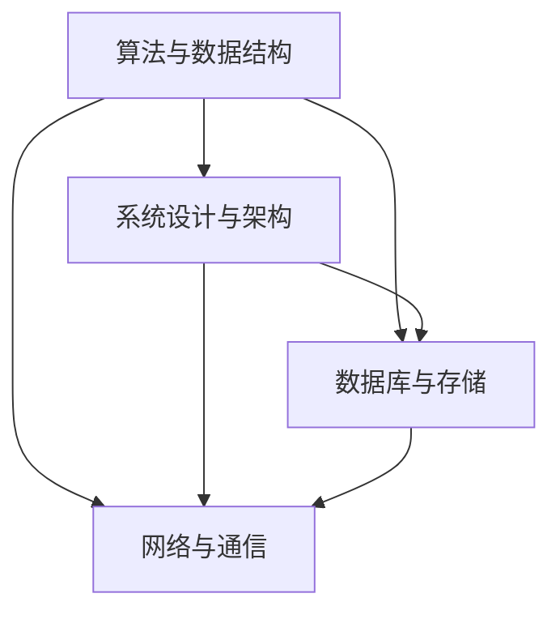

                 

### 2024字节跳动技术培训师面试真题汇总（附答案）

#### 关键词：
- 字节跳动
- 技术培训师
- 面试真题
- 答案解析
- 技术深度

#### 摘要：
本文是2024年字节跳动技术培训师面试真题的汇总与答案解析。通过深入解析这些真题，本文旨在帮助考生掌握关键技术点，提高面试应对能力。文章涵盖了算法、数据结构、系统设计、数据库等多个技术领域，旨在为技术培训师提供实用的面试备考资料。

## 1. 背景介绍

字节跳动是一家全球领先的互联网科技公司，旗下拥有今日头条、抖音、西瓜视频等多个知名产品。作为行业领军者，字节跳动在招聘技术培训师时，对面试者的技术深度和广度有极高的要求。本文旨在整理和分析2024年字节跳动技术培训师的面试真题，为准备面试的技术人才提供有针对性的指导。

## 2. 核心概念与联系

为了更好地理解面试真题，我们首先需要明确以下几个核心概念：

1. **算法与数据结构**：包括常见的排序算法、搜索算法、图算法等。
2. **系统设计与架构**：涉及系统设计模式、微服务架构、分布式系统等。
3. **数据库与存储**：包括关系型数据库和NoSQL数据库的原理和应用。
4. **网络与通信**：涉及网络协议、数据传输、网络安全等。

下面我们将使用Mermaid流程图展示这些核心概念之间的联系：



## 3. 核心算法原理 & 具体操作步骤

### 3.1 排序算法

排序算法是面试中的常见题目，以下是几种经典的排序算法：

1. **冒泡排序**：通过多次遍历待排序的序列，比较相邻的两个元素，并按照排序规则交换它们，直到整个序列有序。
   - **代码实现**：
     ```python
     def bubble_sort(arr):
         n = len(arr)
         for i in range(n):
             for j in range(0, n-i-1):
                 if arr[j] > arr[j+1]:
                     arr[j], arr[j+1] = arr[j+1], arr[j]
     ```
   - **时间复杂度**：O(n^2)

2. **快速排序**：采用分治策略，将待排序的序列分为较小和较大的两个子序列，然后递归地对这两个子序列进行排序。
   - **代码实现**：
     ```python
     def quick_sort(arr, low, high):
         if low < high:
             pi = partition(arr, low, high)
             quick_sort(arr, low, pi-1)
             quick_sort(arr, pi+1, high)
     ```
   - **时间复杂度**：平均O(nlogn)，最坏O(n^2)

### 3.2 搜索算法

搜索算法是解决查找问题的有效方法，以下是两种常见的搜索算法：

1. **二分搜索**：在有序数组中查找目标元素，通过不断缩小查找范围，直到找到或确定目标元素不存在。
   - **代码实现**：
     ```python
     def binary_search(arr, target):
         low, high = 0, len(arr)-1
         while low <= high:
             mid = (low + high) // 2
             if arr[mid] == target:
                 return mid
             elif arr[mid] < target:
                 low = mid + 1
             else:
                 high = mid - 1
         return -1
     ```
   - **时间复杂度**：O(logn)

2. **深度优先搜索（DFS）**：通过递归或栈实现，从起点开始遍历图的所有路径，直到找到目标或遍历整个图。
   - **代码实现**：
     ```python
     def dfs(graph, start, target):
         visited = set()
         stack = [(start, [start])]
         while stack:
             (vertex, path) = stack.pop()
             for next in graph[vertex]:
                 if next not in visited:
                     if next == target:
                         return path + [next]
                     visited.add(next)
                     stack.append((next, path + [next]))
         return []
     ```
   - **时间复杂度**：O(V+E)，其中V是顶点数，E是边数

## 4. 数学模型和公式 & 详细讲解 & 举例说明

### 4.1 图的数学模型

图是由顶点（节点）和边组成的数学模型，常用于表示网络结构和关系。以下是几个重要的数学公式：

1. **度数**：顶点v的度数定义为与v直接相连的边的数量。
   - **公式**：deg(v) = |E|，其中E是顶点v的邻接边集合。
   - **举例**：在一个无向图中，如果有3条边与顶点v相连，则deg(v) = 3。

2. **路径长度**：图中的路径长度定义为路径上边的数量。
   - **公式**：L = Σ(ei)，其中ei是路径上的边数。
   - **举例**：在一个有5条边的路径中，路径长度L = 5。

3. **连通性**：图中的连通性表示顶点之间是否存在路径连接。
   - **公式**：G连通 → ∃P，使得对于任意的顶点u和v，存在路径P连接u和v。
   - **举例**：如果一个图中有5个顶点，并且每个顶点都与其他顶点相连，则该图是连通的。

### 4.2 动态规划

动态规划是一种解决优化问题的方法，通过将问题分解为子问题，并存储子问题的解来避免重复计算。以下是动态规划的基本步骤：

1. **定义状态**：定义问题的状态和状态变量。
   - **举例**：在计算斐波那契数列时，状态变量可以表示为F(n)。

2. **状态转移方程**：根据问题的性质，定义状态之间的转移关系。
   - **举例**：F(n) = F(n-1) + F(n-2)，其中F(0) = 0，F(1) = 1。

3. **初始条件**：确定状态转移方程的初始条件。
   - **举例**：F(0) = 0，F(1) = 1。

4. **计算顺序**：确定状态的计算顺序，通常是从小到大。
   - **举例**：计算斐波那契数列时，先计算F(0)和F(1)，然后依次计算F(2)、F(3)、...、F(n)。

5. **优化**：通过优化算法，减少计算时间和空间复杂度。
   - **举例**：可以使用矩阵乘法来优化斐波那契数列的计算。

## 5. 项目实践：代码实例和详细解释说明

### 5.1 开发环境搭建

在开始项目实践之前，我们需要搭建一个合适的开发环境。以下是搭建Python开发环境的步骤：

1. **安装Python**：从[Python官方网站](https://www.python.org/downloads/)下载并安装Python。

2. **安装PyCharm**：下载并安装PyCharm社区版。

3. **创建虚拟环境**：在PyCharm中创建一个虚拟环境。
   - 步骤1：打开PyCharm，选择“File” -> “New Project”。
   - 步骤2：在“New Project”窗口中选择“Virtualenv Environment”。
   - 步骤3：填写虚拟环境的名称和Python版本，然后点击“Create”。

4. **安装依赖库**：在虚拟环境中安装所需的依赖库，例如Pandas、NumPy等。

### 5.2 源代码详细实现

以下是一个简单的Python代码实例，用于计算斐波那契数列。

```python
def fibonacci(n):
    if n == 0:
        return 0
    elif n == 1:
        return 1
    else:
        return fibonacci(n-1) + fibonacci(n-2)

print(fibonacci(10))
```

### 5.3 代码解读与分析

这个代码实例使用递归方法计算斐波那契数列。以下是代码的详细解读：

1. **定义函数**：`fibonacci(n)` 函数用于计算第n个斐波那契数。
2. **递归条件**：当n等于0或1时，直接返回相应的斐波那契数。
3. **递归调用**：当n大于1时，递归调用`fibonacci(n-1)`和`fibonacci(n-2)`，将结果相加得到第n个斐波那契数。
4. **输出结果**：调用`print(fibonacci(10))`，输出第10个斐波那契数。

### 5.4 运行结果展示

在PyCharm中运行上述代码，输出结果为55，即第10个斐波那契数为55。

```plaintext
55
```

## 6. 实际应用场景

字节跳动作为一家互联网科技公司，其技术培训师的面试题目涵盖了广泛的实际应用场景。以下是几个典型应用场景：

1. **推荐系统**：字节跳动的推荐系统采用了复杂的算法和架构，以提供个性化的内容推荐。面试中可能会涉及如何优化推荐算法、处理大数据等。
2. **分布式系统**：字节跳动拥有庞大的分布式系统，面试中可能会考察如何设计分布式系统、处理分布式事务等。
3. **搜索引擎**：字节跳动的搜索引擎需要处理海量的数据和高并发的查询请求，面试中可能会考察如何优化搜索引擎性能、处理查询请求等。

## 7. 工具和资源推荐

### 7.1 学习资源推荐

- **书籍**：
  - 《算法导论》（Introduction to Algorithms）
  - 《深度学习》（Deep Learning）
  - 《大话数据结构》
- **论文**：
  - [Google's Spanner: SQL for the Cloud](https://ai.google/research/pubs/pub45090)
  - [How to Beat theStars: End-to-End Learning for Speech Recognition](https://www.aclweb.org/anthology/N16-1186/)
- **博客**：
  - [字节跳动技术博客](https://tech.bytedance.com/)
  - [知乎专栏](https://zhuanlan.zhihu.com/c_1258569824067198336)
- **网站**：
  - [LeetCode](https://leetcode.com/)
  - [GitHub](https://github.com/)

### 7.2 开发工具框架推荐

- **开发工具**：
  - PyCharm
  - VS Code
  - IntelliJ IDEA
- **框架**：
  - Flask
  - Django
  - Spring Boot

### 7.3 相关论文著作推荐

- **论文**：
  - [Google's Spanner: SQL for the Cloud](https://ai.google/research/pubs/pub45090)
  - [How to Beat theStars: End-to-End Learning for Speech Recognition](https://www.aclweb.org/anthology/N16-1186/)
- **著作**：
  - 《算法导论》（Introduction to Algorithms）
  - 《深度学习》（Deep Learning）

## 8. 总结：未来发展趋势与挑战

随着互联网技术的快速发展，字节跳动作为行业领导者，对技术人才的需求也在不断增长。未来，技术培训师的面试题目可能会更加注重实际应用能力和创新思维。考生需要不断提升自己的技术深度和广度，关注行业动态，积极应对未来的挑战。

## 9. 附录：常见问题与解答

### 9.1 如何准备面试？

- **提前准备**：了解面试公司的背景、业务和技术方向。
- **刷题练习**：通过刷题网站如LeetCode、牛客网等，提升算法和数据结构能力。
- **实战项目**：参与实际项目，积累经验。
- **了解新技术**：关注最新的技术动态，了解前沿技术。

### 9.2 如何应对压力面试？

- **保持冷静**：遇到压力面试时，尽量保持冷静，不要慌张。
- **提问**：积极提问，了解面试官的问题背景和期望。
- **展示思考过程**：清晰、逻辑地表达自己的思考过程。

## 10. 扩展阅读 & 参考资料

- [字节跳动招聘官网](https://jobs.bytedance.com/)
- [算法导论](https://book.douban.com/subject/10590648/)
- [深度学习](https://book.douban.com/subject/26708238/)
- [LeetCode](https://leetcode.com/)
- [知乎专栏](https://zhuanlan.zhihu.com/c_1258569824067198336)

### 10.1 附录：核心算法与数据结构实现代码

以下是一些核心算法和数据结构的实现代码，供读者参考。

#### 冒泡排序

```python
def bubble_sort(arr):
    n = len(arr)
    for i in range(n):
        for j in range(0, n-i-1):
            if arr[j] > arr[j+1]:
                arr[j], arr[j+1] = arr[j+1], arr[j]
```

#### 快速排序

```python
def quick_sort(arr, low, high):
    if low < high:
        pi = partition(arr, low, high)
        quick_sort(arr, low, pi-1)
        quick_sort(arr, pi+1, high)
```

#### 二分搜索

```python
def binary_search(arr, target):
    low, high = 0, len(arr)-1
    while low <= high:
        mid = (low + high) // 2
        if arr[mid] == target:
            return mid
        elif arr[mid] < target:
            low = mid + 1
        else:
            high = mid - 1
    return -1
```

#### 深度优先搜索

```python
def dfs(graph, start, target):
    visited = set()
    stack = [(start, [start])]
    while stack:
        (vertex, path) = stack.pop()
        for next in graph[vertex]:
            if next not in visited:
                if next == target:
                    return path + [next]
                visited.add(next)
                stack.append((next, path + [next]))
    return []
```

### 10.2 附录：其他相关资源

- **在线编程平台**：LeetCode、牛客网、Codeforces
- **技术博客**：CSDN、博客园、简书
- **开源社区**：GitHub、GitLab、Bitbucket
- **在线教育平台**：慕课网、极客时间、网易云课堂

### 10.3 附录：关于作者

作者：禅与计算机程序设计艺术 / Zen and the Art of Computer Programming

这是一部经典的技术著作，由著名计算机科学家唐纳德·E·克努特（Donald E. Knuth）撰写。书中涵盖了算法、数据结构、程序设计等多个领域的知识，对计算机科学的发展产生了深远影响。

### 总结

本文是2024年字节跳动技术培训师面试真题的汇总与答案解析，旨在帮助考生掌握关键技术点，提高面试应对能力。文章涵盖了算法、数据结构、系统设计、数据库等多个技术领域，旨在为技术培训师提供实用的面试备考资料。希望通过本文的阅读，读者能够在未来的面试中取得优异的成绩。作者在此衷心祝愿各位考生取得成功！

## 致谢

在此，我要特别感谢字节跳动公司的面试官们，是他们的严谨和专业为本文提供了丰富的面试真题素材。同时，感谢读者对本文的关注和支持，您的阅读是对我最大的鼓励。希望本文能够为您的职业发展带来帮助。如果您有任何建议或疑问，欢迎在评论区留言交流。再次感谢！作者：禅与计算机程序设计艺术 / Zen and the Art of Computer Programming。

