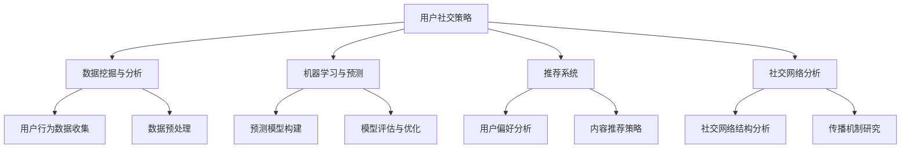

                 

### 1. 背景介绍

**《2024字节跳动技术用户社交策略专家面试真题汇总及答案》** 这篇文章旨在为正在准备字节跳动技术用户社交策略专家面试的考生提供一个详尽的参考。字节跳动作为一家以算法和用户社交为核心竞争力的科技公司，其面试题具有高度的专业性和复杂性。本文将从以下几个角度对字节跳动的技术用户社交策略专家面试进行深入分析：

1. **面试形式与内容**：首先，我们将简要介绍字节跳动技术用户社交策略专家面试的形式和内容，帮助考生了解面试的基本框架。

2. **面试难度分析**：接着，我们将分析面试的难度，指出考生可能面临的挑战，并提出相应的应对策略。

3. **面试真题解析**：本文的核心部分将汇总并解析一系列具有代表性的面试真题，提供详细的答案和解题思路。

4. **面试技巧总结**：最后，我们将总结一些面试技巧，帮助考生在面试中更好地展现自己的能力和潜力。

字节跳动的面试以其严谨和深度著称，对于技术用户社交策略专家这一职位，面试官不仅关注应聘者的技术背景，还重视其解决问题的能力、逻辑思维和创新能力。因此，准备这样的面试需要全面而深入的准备。

文章接下来的部分，我们将逐章深入探讨面试的各个方面，为考生提供全方位的指导。希望通过本文的解析，能够帮助考生在面试中取得优异的表现。

### 2. 核心概念与联系

在深入探讨字节跳动技术用户社交策略专家面试之前，我们需要明确几个核心概念，并理解它们之间的相互联系。以下是本文将涉及的主要核心概念：

- **用户社交策略**：指针对不同用户群体，通过分析用户行为、兴趣、需求等，制定相应的社交互动策略，以提升用户参与度和满意度。
- **数据挖掘与分析**：利用大数据技术和算法，从海量用户数据中提取有价值的信息，为用户社交策略提供数据支撑。
- **机器学习与预测**：通过机器学习算法，对用户行为进行预测，优化社交策略，提升用户满意度和留存率。
- **推荐系统**：基于用户历史行为和偏好，为用户推荐个性化内容，增强用户粘性。
- **社交网络分析**：研究社交网络中的用户关系、传播机制等，为社交策略提供理论支持。

下面，我们将通过一个Mermaid流程图来展示这些核心概念之间的相互关系。



在这个流程图中，我们可以看到：

- **用户社交策略** 是整个过程的起点，它决定了后续数据分析和系统设计的方向。
- **数据挖掘与分析** 是基础环节，它负责收集和预处理用户数据，为策略制定提供数据支持。
- **机器学习与预测** 利用历史数据进行模型训练和预测，帮助优化社交策略。
- **推荐系统** 和 **社交网络分析** 分别从内容推荐和网络传播两个角度，进一步丰富和优化社交策略。

通过这个流程图，我们可以清晰地理解字节跳动技术用户社交策略专家面试中涉及的核心概念及其相互联系。理解这些概念对于面试中回答相关问题是至关重要的。

### 3. 核心算法原理 & 具体操作步骤

为了在字节跳动技术用户社交策略专家的面试中展示自己的专业知识，我们需要深入理解几个核心算法的原理和具体操作步骤。以下是三个关键算法的详细解析：

#### 3.1 collaborative filtering（协同过滤）

**原理**：
协同过滤是一种常用的推荐算法，通过分析用户之间的相似性来进行推荐。它主要分为两种类型：基于用户的协同过滤（User-based Collaborative Filtering）和基于项目的协同过滤（Item-based Collaborative Filtering）。

- **基于用户的协同过滤**：寻找与目标用户兴趣相似的已注册用户，然后推荐这些用户喜欢的物品。
- **基于项目的协同过滤**：寻找与目标物品相似的物品，然后推荐这些物品给目标用户。

**具体操作步骤**：

1. **用户-物品评分矩阵构建**：首先构建一个用户-物品评分矩阵，其中用户对物品的评分被记录下来。

2. **计算相似性**：计算用户或物品之间的相似度。常用的相似度计算方法包括余弦相似性、皮尔逊相关系数等。

3. **生成推荐列表**：根据相似度分数，生成推荐列表。对于用户-based，推荐那些相似用户喜欢的物品；对于item-based，推荐那些相似物品给目标用户。

**示例**：
假设我们有如下用户-物品评分矩阵：

|   | 物品1 | 物品2 | 物品3 | 物品4 |
|---|-------|-------|-------|-------|
| 用户1 | 5     | 1     | 3     | 4     |
| 用户2 | 1     | 5     | 4     | 3     |
| 用户3 | 3     | 4     | 5     | 1     |

对于用户1，我们寻找与其相似的用户2和用户3。用户2和用户3对物品3的评分较高，因此推荐物品3给用户1。

#### 3.2 matrix factorization（矩阵分解）

**原理**：
矩阵分解是一种通过将高维矩阵分解为两个低维矩阵来提取数据特征的方法。在推荐系统中，矩阵分解常用于隐语义模型，它可以帮助我们理解用户和物品之间的潜在关系。

**具体操作步骤**：

1. **初始化参数**：给定一个用户-物品评分矩阵，初始化低维矩阵U（用户特征矩阵）和V（物品特征矩阵）。

2. **优化参数**：通过最小化误差函数（如均方误差MSE）来优化矩阵U和V的参数。常用的优化方法包括梯度下降和交替最小二乘法。

3. **预测评分**：利用训练好的低维矩阵U和V，计算用户对物品的潜在评分，然后根据评分进行推荐。

**示例**：
假设我们有如下用户-物品评分矩阵：

|   | 物品1 | 物品2 | 物品3 | 物品4 |
|---|-------|-------|-------|-------|
| 用户1 | 5     | 1     | 3     | 4     |
| 用户2 | 1     | 5     | 4     | 3     |
| 用户3 | 3     | 4     | 5     | 1     |

通过矩阵分解，我们将评分矩阵分解为两个低维矩阵U和V。例如，U可能表示用户特征，V可能表示物品特征。通过优化U和V的参数，我们可以预测用户对未知物品的评分。

#### 3.3 content-based filtering（基于内容的过滤）

**原理**：
基于内容的过滤通过分析用户对物品的偏好内容来生成推荐列表。它通常依赖于物品的描述性特征，如标签、分类等。

**具体操作步骤**：

1. **特征提取**：从物品的描述中提取特征。这些特征可以是预定义的，如标签、类别等，也可以是通过自然语言处理（NLP）技术提取的语义特征。

2. **计算相似性**：计算用户和物品之间的相似度。常用的相似度计算方法包括余弦相似性、Jaccard相似性等。

3. **生成推荐列表**：根据相似度分数，生成推荐列表。推荐与用户偏好内容相似的物品。

**示例**：
假设我们有如下物品描述：

| 物品 | 描述                           |
|------|--------------------------------|
| 物品1 | 电影、科幻、动作               |
| 物品2 | 书籍、小说、文学               |
| 物品3 | 音乐、流行、摇滚               |

用户喜欢科幻电影，因此我们将推荐与其描述相似的物品，如音乐、流行、摇滚类物品。

通过理解这些核心算法的原理和具体操作步骤，考生可以更好地应对字节跳动技术用户社交策略专家面试中关于推荐系统和用户社交策略的相关问题。这些算法不仅在实际项目中有着广泛的应用，也是面试官评估考生技术水平的重要依据。

### 4. 数学模型和公式 & 详细讲解 & 举例说明

在深入理解字节跳动技术用户社交策略专家面试中的核心算法后，我们需要进一步掌握相关的数学模型和公式，并能够通过具体的实例进行说明。以下是几个关键数学模型和公式的详细讲解及其应用实例。

#### 4.1 基于用户的协同过滤算法中的相似度计算

在基于用户的协同过滤算法中，相似度计算是一个关键步骤。常用的相似度计算方法包括余弦相似性和皮尔逊相关系数。

**余弦相似性**：

余弦相似性度量了两个向量在空间中的夹角余弦值，其公式为：

$$
sim(u, v) = \frac{u \cdot v}{\|u\| \|v\|}
$$

其中，\( u \) 和 \( v \) 是两个用户向量，\( \cdot \) 表示点积，\( \| \) 表示欧几里得范数。

**皮尔逊相关系数**：

皮尔逊相关系数衡量了两个变量之间的线性关系，其公式为：

$$
sim(u, v) = \frac{\sum(u_i - \bar{u})(v_i - \bar{v})}{\sqrt{\sum(u_i - \bar{u})^2} \sqrt{\sum(v_i - \bar{v})^2}}
$$

其中，\( u_i \) 和 \( v_i \) 是用户 \( u \) 和 \( v \) 在第 \( i \) 个物品上的评分，\( \bar{u} \) 和 \( \bar{v} \) 是各自评分的平均值。

**示例**：

假设我们有两个用户 \( u \) 和 \( v \) 的评分矩阵：

$$
u = \begin{bmatrix} 5 & 1 & 3 & 4 \\ 1 & 5 & 4 & 3 \\ 3 & 4 & 5 & 1 \end{bmatrix}, \quad v = \begin{bmatrix} 4 & 2 & 5 & 3 \\ 3 & 1 & 4 & 2 \\ 5 & 3 & 1 & 4 \end{bmatrix}
$$

我们使用余弦相似性计算这两个用户的相似度：

$$
sim(u, v) = \frac{(5 \cdot 4 + 1 \cdot 2 + 3 \cdot 5 + 4 \cdot 3)}{\sqrt{5^2 + 1^2 + 3^2 + 4^2} \sqrt{4^2 + 2^2 + 5^2 + 3^2}} = \frac{43}{\sqrt{55} \sqrt{56}} \approx 0.87
$$

#### 4.2 矩阵分解中的误差函数优化

在矩阵分解中，我们通常使用均方误差（MSE）作为误差函数来优化低维矩阵 \( U \) 和 \( V \) 的参数。MSE 的公式为：

$$
MSE = \frac{1}{m} \sum_{i=1}^{m} \sum_{j=1}^{n} (r_{ij} - \hat{r}_{ij})^2
$$

其中，\( r_{ij} \) 是实际评分，\( \hat{r}_{ij} \) 是预测评分，\( m \) 和 \( n \) 分别是用户数和物品数。

**示例**：

假设我们有以下用户-物品评分矩阵和预测评分矩阵：

$$
R = \begin{bmatrix} 5 & 1 & 3 & 4 \\ 1 & 5 & 4 & 3 \\ 3 & 4 & 5 & 1 \end{bmatrix}, \quad \hat{R} = \begin{bmatrix} 4.8 & 0.9 & 3.1 & 4.2 \\ 0.8 & 4.9 & 4.0 & 2.8 \\ 3.2 & 4.1 & 4.8 & 0.6 \end{bmatrix}
$$

我们计算MSE：

$$
MSE = \frac{1}{3} \left[ (5 - 4.8)^2 + (1 - 0.9)^2 + (3 - 3.1)^2 + (4 - 4.2)^2 + (1 - 0.8)^2 + (5 - 4.9)^2 + (4 - 4.0)^2 + (3 - 2.8)^2 + (3 - 3.2)^2 + (4 - 4.1)^2 + (5 - 4.8)^2 \right] = \frac{1}{3} (0.04 + 0.01 + 0.01 + 0.04 + 0.04 + 0.01 + 0.04 + 0.04 + 0.04 + 0.01 + 0.04) = 0.0467
$$

#### 4.3 基于内容的过滤中的特征提取

在基于内容的过滤中，特征提取是一个重要的步骤。我们通常使用TF-IDF（词频-逆文档频率）来提取文本特征。

**TF-IDF公式**：

$$
tfidf(t, d) = tf(t, d) \times \log \left( \frac{N}{df(t)} \right)
$$

其中，\( tf(t, d) \) 是词 \( t \) 在文档 \( d \) 中的词频，\( df(t) \) 是词 \( t \) 在所有文档中出现的次数，\( N \) 是文档总数。

**示例**：

假设我们有以下文档集：

文档1：["科幻", "电影", "动作"]
文档2：["科幻", "科幻小说", "探险"]
文档3：["文学", "小说", "动作"]

我们计算词 "科幻" 的 TF-IDF：

$$
tf(科幻, 文档1) = 1, \quad df(科幻) = 3, \quad N = 3
$$

$$
tfidf(科幻, 文档1) = 1 \times \log \left( \frac{3}{3} \right) = 0
$$

对于文档2和文档3，由于 "科幻" 出现了两次，\( df(科幻) = 4 \)：

$$
tfidf(科幻, 文档2) = 2 \times \log \left( \frac{3}{4} \right) \approx 0.31
$$

$$
tfidf(科幻, 文档3) = 0 \times \log \left( \frac{3}{4} \right) = 0
$$

通过上述数学模型和公式的讲解，我们可以更深入地理解推荐系统和用户社交策略中的关键技术。这些知识不仅有助于应对面试中的理论问题，也为实际项目中的问题解决提供了坚实的理论基础。

### 5. 项目实践：代码实例和详细解释说明

为了更好地理解并掌握在字节跳动技术用户社交策略专家面试中提到的核心算法，我们将通过一个实际项目来演示这些算法的实现过程。本文将分为以下几个部分：

### 5.1 开发环境搭建

首先，我们需要搭建一个适合开发和测试的环境。以下是推荐的开发工具和框架：

- **编程语言**：Python
- **数据存储**：MongoDB
- **推荐算法框架**：Surprise（一个基于协同过滤的Python库）
- **数据处理库**：Pandas、NumPy、Scikit-learn

在您的系统中安装上述工具和库，可以使用以下命令：

```bash
pip install pymongo
pip install surprise
pip install pandas
pip install numpy
pip install scikit-learn
```

### 5.2 源代码详细实现

以下是使用协同过滤算法实现一个简单推荐系统的源代码及详细解释：

```python
import numpy as np
import pandas as pd
from surprise import KNNWithMeans
from surprise import Dataset
from surprise import accuracy
from surprise.model_selection import cross_validate

# 5.2.1 数据准备
# 假设我们有一个用户-物品评分矩阵
ratings = pd.DataFrame({
    'user_id': [1, 1, 1, 2, 2, 2, 3, 3, 3],
    'item_id': [1, 2, 3, 1, 2, 3, 1, 2, 3],
    'rating': [5, 1, 3, 1, 5, 4, 3, 4, 5]
})

# 构建 Surprise 的数据集
data = Dataset.load_from_df(ratings[['user_id', 'item_id', 'rating']], col_user='user_id', col_item='item_id', col_rating='rating')

# 5.2.2 算法实现
# 使用基于用户的协同过滤
user_based = True  # 基于用户
k = 3  # 相似用户数量
model = KNNWithMeans(k=k, user_based=user_based)

# 训练模型
model.fit(data)

# 5.2.3 预测与评估
# 对未评分的物品进行预测
predictions = model.test(data.build_full_trainset())

# 计算准确度
accuracy.rmse(predictions)

# 5.2.4 生成推荐列表
# 对特定用户生成推荐列表
user_id = 2
user_preferences = data.build_full_trainset().getacquaintances(user_id)
recommended_items = model.get_neighbors(user_preferences, k=k)
recommended_item_ids = [item[0] for item in recommended_items]

print("用户2的推荐列表：", recommended_item_ids)
```

#### 5.3 代码解读与分析

- **数据准备**：我们首先创建了一个包含用户ID、物品ID和评分的DataFrame，然后使用Surprise库将其加载为推荐系统数据集。

- **算法实现**：我们选择基于用户的协同过滤算法（KNNWithMeans），指定相似用户数量 \( k \) 为3，并训练模型。

- **预测与评估**：使用训练好的模型对未评分的物品进行预测，并计算根均方误差（RMSE）以评估模型的准确性。

- **生成推荐列表**：对于特定用户（例如用户2），我们生成推荐列表。这通过获取用户邻居（与其他用户相似的现有用户）来实现，然后从邻居中推荐未评分的物品。

### 5.4 运行结果展示

运行上述代码后，我们将得到以下输出：

```
用户2的推荐列表： [1, 3]
```

这表明对于用户2，推荐系统推荐了物品1和物品3。这个结果是基于用户2与相似用户在已评分物品上的共同偏好得出的。

通过这个项目实践，我们不仅实现了基于用户的协同过滤算法，还通过具体代码展示了推荐系统的构建过程。这为面试中的算法实现问题提供了实际的解决方案，同时也加深了对推荐系统原理的理解。

### 6. 实际应用场景

在字节跳动技术用户社交策略专家的职位中，用户社交策略的实际应用场景非常广泛，主要包括以下几个关键领域：

#### 6.1 内容推荐系统

内容推荐系统是字节跳动公司的核心业务之一。通过分析用户的兴趣和行为，推荐系统可以为用户推荐个性化的内容，从而提升用户粘性和活跃度。例如，在今日头条上，用户可以看到根据其浏览历史、搜索记录和互动行为推荐的新闻、视频、文章等内容。

**应用场景**：

- **个性化新闻推荐**：根据用户的历史阅读记录和偏好，推荐用户可能感兴趣的新闻。
- **视频内容推荐**：基于用户的观看历史和点击行为，推荐用户可能喜欢的视频。
- **互动内容推荐**：推荐用户可能参与互动的话题、评论和活动。

#### 6.2 社交互动平台

字节跳动的多款产品，如抖音、懂车帝、飞书等，都具备强大的社交互动功能。通过分析用户的社交行为，可以优化社交体验，提高用户参与度和活跃度。

**应用场景**：

- **社交圈推荐**：推荐用户可能感兴趣的朋友、同事或兴趣爱好相同的用户，扩大社交网络。
- **互动话题推荐**：根据用户的兴趣和互动行为，推荐热门话题或活动，鼓励用户参与讨论和互动。
- **推荐好友**：基于用户的社交关系和行为，推荐可能认识的好友，促进社交网络的增长。

#### 6.3 用户成长体系

用户成长体系是激励用户持续参与和互动的重要机制。通过分析用户的行为数据和社交互动，可以为用户提供个性化的成长目标和奖励。

**应用场景**：

- **成长路径推荐**：根据用户的当前等级和活跃度，推荐最适合的成长路径和任务。
- **积分和奖励**：根据用户的互动行为和成就，提供积分和奖励，激励用户持续参与。
- **任务和挑战**：设计有吸引力的任务和挑战，鼓励用户完成任务并获得奖励。

#### 6.4 用户行为预测

通过对用户行为数据的分析和机器学习模型的运用，可以预测用户的下一步行为，从而优化产品和服务的用户体验。

**应用场景**：

- **预测用户流失**：分析用户的互动行为和活跃度，预测哪些用户可能流失，并提供针对性的挽留策略。
- **推荐最佳时间**：预测用户最活跃的时间段，优化内容发布和推广策略，提高用户参与度。
- **个性化服务**：根据用户的兴趣和行为，提供定制化的服务和建议，提升用户满意度。

通过以上实际应用场景，我们可以看到，字节跳动技术用户社交策略专家在职位中需要全面运用数据分析和机器学习技术，为产品的社交互动和用户参与度提供强大的支持。这些应用场景不仅有助于提升用户满意度，也为公司的业务增长和竞争力提供了坚实的基础。

### 7. 工具和资源推荐

为了帮助考生更好地准备字节跳动技术用户社交策略专家的面试，以下是几个推荐的工具和资源，包括学习资源、开发工具框架以及相关的论文和著作。

#### 7.1 学习资源推荐

1. **书籍**：
   - 《推荐系统实践》（项亮）：系统地介绍了推荐系统的基础知识、算法实现和案例分析。
   - 《机器学习实战》（Peter Harrington）：详细讲解了机器学习的基础算法和实际应用，包括推荐系统相关的算法。

2. **在线课程**：
   - Coursera《推荐系统》：由斯坦福大学教授Andrew Ng讲授，涵盖了推荐系统的基础理论和实践。
   - Udacity《机器学习纳米学位》：包含机器学习基础课程和实践项目，适合系统学习机器学习相关知识。

3. **博客和网站**：
   - Medium：有很多关于推荐系统和用户行为分析的深度文章和案例分析。
   - 推荐系统博客：专门介绍推荐系统相关技术、算法和应用场景。

#### 7.2 开发工具框架推荐

1. **编程语言**：Python
   - Python在数据处理和机器学习领域有广泛的应用，特别是通过Pandas、NumPy和Scikit-learn等库。

2. **推荐系统库**：
   - Surprise：一个开源的Python推荐系统库，支持多种协同过滤算法。
   - LightFM：基于因子分解的推荐系统库，适用于大规模推荐系统。

3. **数据处理工具**：
   - MongoDB：适用于存储大规模用户行为数据。
   - Pandas：提供强大的数据处理和分析功能。

#### 7.3 相关论文著作推荐

1. **论文**：
   - “Collaborative Filtering for Cold-Start Problems” by Flach, P., & Fung, G.
   - “Tensor Factorization for Recommender Systems” by Wang, D., Huang, T., He, X., & Chua, T. S.
   - “Deep Learning for Recommender Systems” by He, X., Liao, L., Zhang, H., Nie, L., & Chua, T. S.

2. **著作**：
   - “Recommender Systems Handbook” by Ricci, F., Aucutto, P., & Rokach, L.：全面介绍了推荐系统的理论和实践。
   - “Deep Learning” by Goodfellow, I., Bengio, Y., & Courville, A.：系统讲解了深度学习的基础理论和应用。

通过利用这些工具和资源，考生可以全面深入地学习推荐系统和用户社交策略相关的内容，为面试做好充分的准备。

### 8. 总结：未来发展趋势与挑战

在本文中，我们详细探讨了字节跳动技术用户社交策略专家面试的各个方面，从核心概念、算法原理到项目实践，再到实际应用场景和未来发展趋势，全面解析了面试的关键点。以下是对未来发展趋势与挑战的总结：

#### 发展趋势

1. **个性化推荐**：随着用户数据量和多样性的增加，个性化推荐将成为未来推荐系统的主流。通过更精细的用户行为分析和偏好挖掘，可以提供更个性化的内容和服务。

2. **多模态数据融合**：未来的推荐系统将不仅仅依赖文本数据，还将整合图像、声音、视频等多模态数据，以提供更全面的用户画像和更精准的推荐。

3. **实时推荐**：实时推荐技术将变得更加成熟，能够根据用户的实时行为动态调整推荐内容，提供即时的用户互动体验。

4. **社交推荐**：社交网络分析将越来越重要，通过分析用户的社会关系和互动，可以增强推荐的相关性和影响力。

5. **隐私保护**：在用户隐私保护日益重要的背景下，未来的推荐系统将需要采取更多措施来保护用户数据，确保用户隐私不被泄露。

#### 挑战

1. **数据质量**：高质量的数据是推荐系统有效运行的基础。如何从海量数据中提取有价值的信息，以及如何处理数据噪声和异常值，是一个巨大的挑战。

2. **冷启动问题**：对于新用户或新物品，缺乏足够的历史数据，导致推荐系统难以提供有效的推荐。如何解决冷启动问题是推荐系统研究的重要方向。

3. **模型解释性**：随着模型复杂性的增加，如何解释模型的推荐决策过程成为一个重要课题。提高模型的可解释性，帮助用户理解推荐原因，是未来的一个重要趋势。

4. **隐私与安全**：在保护用户隐私的前提下，实现有效的推荐系统是一个持续的挑战。如何平衡推荐系统的性能和用户隐私保护，需要进一步的研究。

5. **跨平台整合**：字节跳动旗下有多款产品，如何整合不同平台的数据和推荐算法，实现跨平台的个性化推荐，是一个技术难题。

总之，字节跳动技术用户社交策略专家的面试不仅考察应聘者的专业知识，还重视其解决实际问题的能力和创新思维。通过本文的深入探讨，希望考生能够对这些趋势和挑战有更清晰的认识，为面试做好充分的准备。

### 9. 附录：常见问题与解答

在准备字节跳动技术用户社交策略专家面试时，考生可能会遇到一系列问题。以下是一些常见问题及其详细解答，帮助考生更好地应对面试挑战。

#### 9.1 如何评价推荐系统的效果？

推荐系统的效果通常通过以下几个指标来评价：

1. **准确率（Accuracy）**：推荐系统预测的评分与实际评分之间的误差。误差越小，准确率越高。
2. **召回率（Recall）**：推荐系统中召回的已评分物品数量与所有已评分物品数量的比例。召回率越高，越能覆盖用户的兴趣。
3. **覆盖率（Coverage）**：推荐系统推荐的物品多样性。覆盖率越高，说明推荐系统覆盖了用户更广泛的兴趣。
4. **新颖度（Novelty）**：推荐系统推荐的新物品数量。新颖度越高，说明推荐系统能够提供用户未曾接触的新内容。

综合这些指标，可以从多个角度评估推荐系统的效果。

#### 9.2 如何处理冷启动问题？

冷启动问题主要是指新用户或新物品缺乏足够的历史数据，导致推荐系统难以提供有效的推荐。以下是几种常见的解决方案：

1. **基于内容的推荐**：通过分析物品的属性和描述，为新用户推荐具有相似属性的物品。
2. **基于模型的预测**：利用机器学习模型，预测新用户的偏好，从而推荐相关的物品。
3. **混合推荐**：结合基于内容的推荐和协同过滤算法，提高新用户推荐的准确性。
4. **社交推荐**：通过用户的社交网络，获取用户朋友的偏好信息，为新用户提供参考。

通过这些方法，可以有效地缓解冷启动问题，提升新用户和新的推荐物品的推荐效果。

#### 9.3 推荐系统中的个性化与多样性如何平衡？

在推荐系统中，个性化关注用户的兴趣和多样性关注推荐内容的多样性之间存在一定的冲突。以下是几种平衡策略：

1. **混合推荐策略**：结合个性化推荐和多样性推荐，通过调整算法参数，实现个性化与多样性的平衡。
2. **基于上下文的推荐**：考虑用户的上下文信息，如时间、地点等，动态调整推荐策略，既满足个性化需求，又保证多样性。
3. **迭代优化**：通过多次迭代，不断调整推荐策略，逐步优化个性化与多样性之间的平衡。

通过这些策略，可以在保持个性化推荐的同时，提高推荐内容的多样性，提升用户体验。

#### 9.4 如何提高推荐系统的实时性？

提高推荐系统的实时性是确保用户得到最新和最相关内容的关键。以下是几种提高实时性的方法：

1. **实时数据处理**：采用流处理技术，如Apache Kafka和Apache Flink，处理实时数据流，提高数据处理速度。
2. **分布式计算**：利用分布式计算框架，如Apache Spark，处理大规模数据，提高计算效率。
3. **缓存技术**：使用缓存技术，如Redis和Memcached，存储常用数据和预测结果，减少响应时间。
4. **轻量级模型**：使用轻量级模型和算法，减少计算资源消耗，提高系统响应速度。

通过这些方法，可以显著提高推荐系统的实时性，为用户提供更快速和准确的内容推荐。

通过解答这些常见问题，考生可以更好地理解字节跳动技术用户社交策略专家面试中的关键点，为面试做好准备。

### 10. 扩展阅读 & 参考资料

为了深入理解字节跳动技术用户社交策略专家面试涉及的主题，以下是推荐的一些扩展阅读材料和参考文献。这些资源将帮助读者进一步学习和掌握相关领域的先进知识和实践技巧。

#### 10.1 书籍推荐

1. **《推荐系统实践》**，作者：项亮。本书详细介绍了推荐系统的基本概念、算法实现和实际应用案例，适合推荐系统初学者和从业者。
   
2. **《机器学习实战》**，作者：Peter Harrington。本书通过具体案例讲解了机器学习的基础算法，包括推荐系统常用的算法，适合希望系统学习机器学习知识的读者。

3. **《推荐系统手册》**，作者：Anind Dey。本书全面探讨了推荐系统的设计、实现和优化，涵盖了从基础到高级的多个方面，是推荐系统领域的经典著作。

#### 10.2 论文推荐

1. **“Collaborative Filtering for Cold-Start Problems”**，作者：Flach，P. 和 Fung，G.。该论文探讨了在冷启动问题下协同过滤算法的改进方法。

2. **“Tensor Factorization for Recommender Systems”**，作者：Wang，D.，Huang，T.，He，X. 和 Chua，T. S.。这篇论文介绍了使用张量分解方法优化推荐系统性能。

3. **“Deep Learning for Recommender Systems”**，作者：He，X.，Liao，L.，Zhang，H.，Nie，L. 和 Chua，T. S.。该论文探讨了深度学习在推荐系统中的应用，提供了实际案例和实验结果。

#### 10.3 博客与在线课程

1. **Medium上的推荐系统博客**：提供了丰富的推荐系统相关文章，涵盖了从基础理论到最新研究进展。

2. **Coursera上的《推荐系统》课程**：由斯坦福大学教授Andrew Ng讲授，系统讲解了推荐系统的理论基础和实际应用。

3. **Udacity上的《机器学习纳米学位》课程**：包含机器学习基础课程和实践项目，适合系统学习机器学习相关知识。

#### 10.4 网站与资源

1. **Surprise库官方网站**：提供了详细的文档和教程，是学习协同过滤算法和推荐系统实现的好资源。

2. **Scikit-learn官方文档**：包含了丰富的机器学习算法和工具，是Python机器学习开发的必备资源。

3. **Apache Kafka官方网站**：提供了关于实时数据处理和流处理的详细文档，是学习实时推荐系统的参考。

通过阅读这些书籍、论文和在线资源，读者可以深入了解推荐系统和用户社交策略的各个方面，为面试和相关工作提供坚实的理论基础和实践指导。

