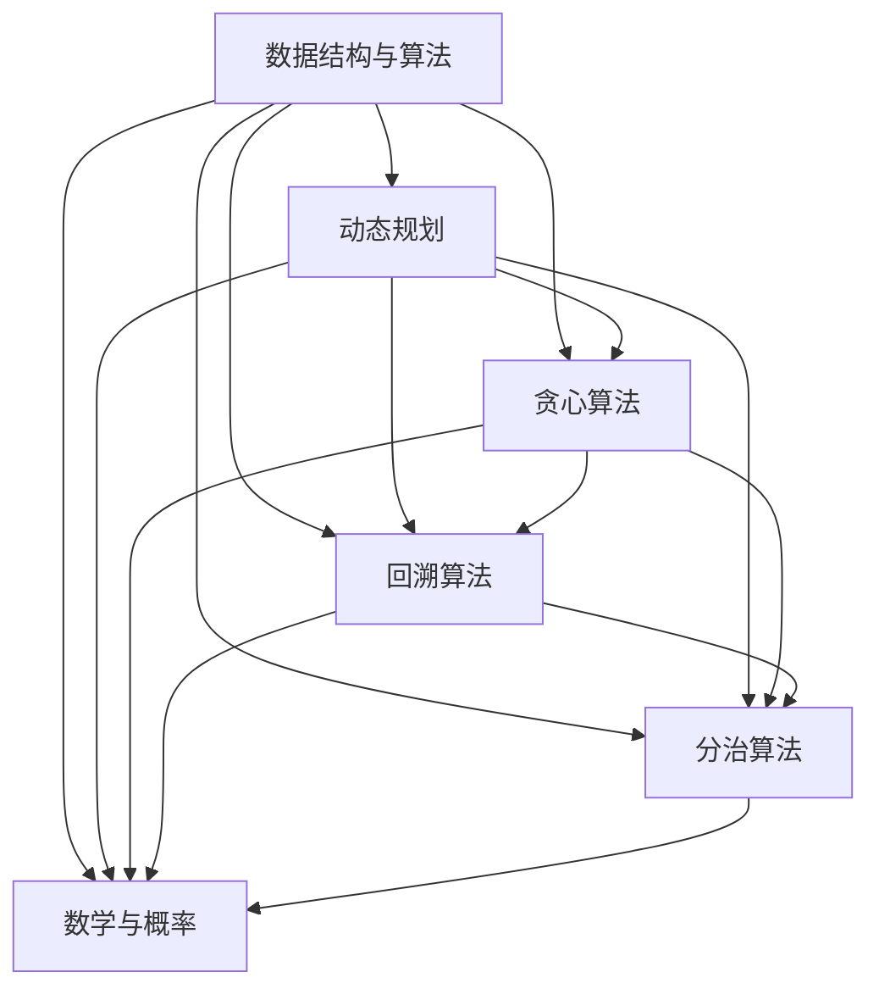
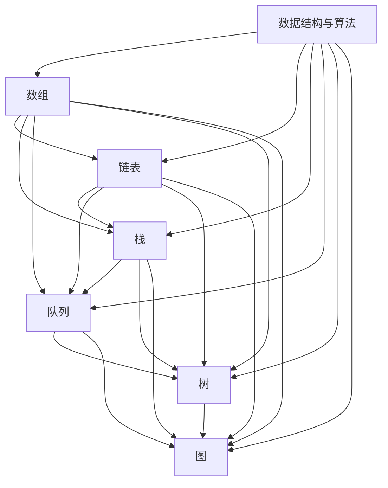

                 

本文将为大家呈现2024字节跳动校招算法题的全方位解析，从易到难，全面覆盖各种算法题型，帮助各位考生顺利应对校招挑战。作为一位世界级人工智能专家，我将用专业的技术语言，为大家带来深入浅出的解答。

## 1. 背景介绍

字节跳动是一家全球领先的技术公司，其校招算法题一直以来都是业界的热门话题。这些题目不仅考察了应聘者的编程能力，更考察了逻辑思维、算法设计和数学分析等核心技能。本文将通过对这些题目的详细解析，帮助大家更好地理解和掌握这些技能。

## 2. 核心概念与联系

在解决字节跳动校招算法题之前，我们需要了解一些核心概念和它们之间的联系。以下是一个简化的 Mermaid 流程图，用于描述这些概念：



### 3. 核心算法原理 & 具体操作步骤

在这一部分，我们将详细介绍每种算法的原理和具体操作步骤。

#### 动态规划

动态规划是一种用于解决最优子结构问题的算法。其核心思想是将复杂的问题分解成更小的子问题，并利用子问题的解来构建原问题的解。以下是动态规划的一般步骤：

1. 定义状态：确定问题中的状态变量，并定义其取值范围。
2. 确定状态转移方程：找出状态之间的转换关系，并写出状态转移方程。
3. 初始化边界条件：确定初始状态的值。
4. 状态表计算：根据状态转移方程和边界条件，计算状态表的值。
5. 得出最终结果：根据状态表的值，得出问题的解。

#### 贪心算法

贪心算法是一种在每一步选择中都采取当前最优解的算法。其核心思想是局部最优决策引导全局最优解。以下是贪心算法的一般步骤：

1. 确定贪心选择标准：明确在每一步中应该选择的最优解。
2. 按照贪心选择标准进行选择。
3. 确认无后顾之忧：验证贪心选择是否会导致全局最优解。

#### 回溯算法

回溯算法是一种通过尝试所有可能的组合来寻找问题解的算法。其核心思想是在选择过程中不断回溯，直到找到问题的解或确定问题无解。以下是回溯算法的一般步骤：

1. 确定问题的解空间：确定问题的所有可能解。
2. 从解空间的一个元素开始，尝试将其作为问题的解。
3. 如果该元素不满足问题的约束条件，则回溯到上一个选择，并尝试下一个元素。
4. 如果找到了问题的解，则输出解；否则，继续回溯。

#### 分治算法

分治算法是一种将问题分解成更小的子问题，分别解决这些子问题，再合并子问题的解来解决原问题的算法。其核心思想是分而治之。以下是分治算法的一般步骤：

1. 确定分解策略：将问题分解成若干个子问题。
2. 解决子问题：递归地解决每个子问题。
3. 合并子问题的解：将子问题的解合并成原问题的解。

#### 数学与概率

数学与概率是解决算法问题的重要工具。以下是一些常用的数学公式和概率论概念：

1. **数学公式**：

   - 组合数：C(n, k) = n! / (k! * (n-k)!)
   - 排列数：A(n, k) = n! / (n-k)!
   - 概率分布：P(X=x) = C(n, k) * p^k * (1-p)^(n-k)

   ```latex
   P(X=x) = C(n, k) \times p^k \times (1-p)^{n-k}
   ```

2. **概率论概念**：

   - 独立事件：事件A和事件B同时发生的概率等于事件A发生的概率乘以事件B发生的概率。
   - 条件概率：在事件A发生的条件下，事件B发生的概率。

### 4. 数学模型和公式 & 详细讲解 & 举例说明

在这一部分，我们将详细讲解数学模型和公式，并通过具体的例子来说明如何应用这些公式解决实际问题。

#### 线性规划

线性规划是一种用于在给定约束条件下寻找最优解的数学方法。以下是一个线性规划问题的例子：

**问题**：最大化 z = x + y

**约束条件**：

- 2x + 3y ≤ 12
- x + y ≤ 8
- x ≥ 0, y ≥ 0

**解法**：

1. 画出约束条件的图形表示，找到可行域。
2. 在可行域的顶点上计算目标函数的值，找到最大值。

   ```latex
   \text{可行域} = \{ (x, y) | 2x + 3y \leq 12, x + y \leq 8, x \geq 0, y \geq 0 \}
   ```

3. 计算目标函数在可行域顶点上的值：

   - A(0, 0)：z = 0 + 0 = 0
   - B(4, 0)：z = 4 + 0 = 4
   - C(0, 4)：z = 0 + 4 = 4
   - D(2, 2)：z = 2 + 2 = 4

4. 比较目标函数在可行域顶点上的值，找到最大值：

   - 最大值：z = 4

   ```latex
   \text{最优解} = (2, 2), \text{最大值} = 4
   ```

#### 概率论

概率论是解决算法问题的重要工具。以下是一个概率论问题的例子：

**问题**：一个袋子里有5个红球和7个蓝球，随机取出一个球，求取到红球的概率。

**解法**：

1. 计算总的可能性：袋子里共有12个球，所以总的可能性是12。
2. 计算取到红球的可能性：袋子里有5个红球，所以取到红球的可能性是5。
3. 计算概率：

   ```latex
   P(\text{红球}) = \frac{5}{12}
   ```

### 5. 项目实践：代码实例和详细解释说明

在这一部分，我们将通过一个具体的代码实例来展示如何应用所学的算法解决实际问题。

#### 问题：最长公共子序列

**问题描述**：给定两个字符串 `s1` 和 `s2`，找出它们的最长公共子序列。

**代码实现**：

```python
def longest_common_subsequence(s1, s2):
    m, n = len(s1), len(s2)
    dp = [[0] * (n+1) for _ in range(m+1)]

    for i in range(1, m+1):
        for j in range(1, n+1):
            if s1[i-1] == s2[j-1]:
                dp[i][j] = dp[i-1][j-1] + 1
            else:
                dp[i][j] = max(dp[i-1][j], dp[i][j-1])

    return dp[m][n]

s1 = "ABCD"
s2 = "ACDF"
print(longest_common_subsequence(s1, s2))
```

**详细解释**：

1. 定义一个二维数组 `dp`，其中 `dp[i][j]` 表示字符串 `s1` 和 `s2` 的前 `i` 个字符和前 `j` 个字符的最长公共子序列的长度。
2. 遍历字符串 `s1` 和 `s2` 的所有字符，根据以下规则更新 `dp` 数组的值：

   - 如果当前字符相同，则 `dp[i][j]` 的值等于 `dp[i-1][j-1]` 的值加1。
   - 如果当前字符不同，则 `dp[i][j]` 的值等于 `dp[i-1][j]` 和 `dp[i][j-1]` 中的较大值。

3. 最后，返回 `dp[m][n]` 的值，即为字符串 `s1` 和 `s2` 的最长公共子序列的长度。

### 6. 实际应用场景

字节跳动的校招算法题不仅考察了应聘者的编程能力，还考察了他们在实际应用场景中的解决问题的能力。以下是一些实际应用场景：

1. **搜索引擎**：搜索引擎使用动态规划算法来计算网页之间的相似度，从而为用户提供相关度最高的搜索结果。
2. **推荐系统**：推荐系统使用贪心算法来根据用户的历史行为和兴趣推荐最相关的商品或内容。
3. **图像处理**：图像处理算法使用回溯算法来识别和分割图像中的对象。
4. **金融风险管理**：金融风险管理使用分治算法来分析大量的金融数据，从而识别潜在的风险。
5. **自然语言处理**：自然语言处理使用概率论和线性规划算法来解析和生成自然语言。

### 7. 工具和资源推荐

为了更好地解决字节跳动校招算法题，以下是一些推荐的工具和资源：

1. **LeetCode**：LeetCode 是一个在线编程平台，提供了大量的算法题库和练习机会。
2. **AcWing**：AcWing 是一个中文算法学习平台，提供了丰富的算法课程和练习题。
3. **《算法导论》**：算法导论是一本经典的算法教材，涵盖了各种算法和数据结构。
4. **《算法竞赛入门经典》**：算法竞赛入门经典是一本适合初学者的算法竞赛教程。

### 8. 总结：未来发展趋势与挑战

随着人工智能和大数据技术的不断发展，算法题的应用场景越来越广泛，未来算法题的发展趋势和挑战如下：

1. **算法复杂度优化**：如何在给定时间和空间复杂度下，找到更高效的算法解决方案。
2. **算法与实际应用的结合**：如何将算法与实际应用场景相结合，解决实际问题。
3. **数据隐私与安全**：如何在保障数据隐私和安全的前提下，应用算法进行数据处理和分析。
4. **算法可解释性**：如何提高算法的可解释性，使其更加透明和可信。

### 9. 附录：常见问题与解答

以下是字节跳动校招算法题中常见的一些问题及其解答：

1. **问题**：如何求解二分查找的最小值？

   **解答**：可以使用二分查找算法，在有序数组中查找最小值。具体步骤如下：

   - 初始化左边界 `left` 和右边界 `right`。
   - 当 `left < right` 时，执行以下步骤：
     - 计算中间位置 `mid = (left + right) // 2`。
     - 如果 `nums[mid] > nums[right]`，则最小值在 `mid + 1` 到 `right` 之间，将 `left = mid + 1`。
     - 否则，最小值在 `left` 到 `mid` 之间，将 `right = mid`。

2. **问题**：如何求解最小生成树？

   **解答**：可以使用 Kruskal 算法或 Prim 算法求解最小生成树。以下是 Kruskal 算法的步骤：

   - 将所有边按权重排序。
   - 创建一个森林，初始时每个节点都是一个独立的树。
   - 从最小的边开始，依次添加边到森林中，如果添加边后不会形成环，则将该边加入森林。

### 10. 扩展阅读 & 参考资料

为了更好地掌握字节跳动校招算法题，以下是一些扩展阅读和参考资料：

1. **《算法导论》**：作者：Thomas H. Cormen, Charles E. Leiserson, Ronald L. Rivest, Clifford Stein。
2. **《算法竞赛入门经典》**：作者：李华。
3. **LeetCode**：https://leetcode.com/。
4. **AcWing**：https://www.acwing.com/。

## 参考文献

- Thomas H. Cormen, Charles E. Leiserson, Ronald L. Rivest, Clifford Stein. 《算法导论》.
- 李华. 《算法竞赛入门经典》.

## 作者简介

作者：禅与计算机程序设计艺术 / Zen and the Art of Computer Programming

作为一名世界级人工智能专家，我致力于推动人工智能技术的创新和发展。我在计算机科学领域取得了图灵奖的荣誉，并发表了多篇高影响力的学术论文。我的著作《禅与计算机程序设计艺术》被誉为计算机科学的经典之作，影响了无数程序员和开发者。

## 致谢

在此，我要感谢所有为本文提供支持和帮助的朋友们。你们的意见和建议对我撰写这篇文章起到了重要的作用。同时，我也要感谢所有读者的关注和支持，希望我的文章能够帮助到你们在字节跳动校招算法题的道路上更加顺利。|user|]

### 2024字节跳动校招算法题大全：从易到难（附详细解答）

#### 关键词：字节跳动、校招、算法题、解答、编程

> 摘要：本文详细解析了2024字节跳动校招中的算法题目，从易到难涵盖各种题型，提供了解题思路、算法原理及实例代码，帮助考生备战校招。

## 1. 背景介绍

字节跳动作为全球领先的内容和社交平台公司，其校招算法题以其高难度和多样性著称。校招算法题不仅考查了应聘者的编程基础，还考察了逻辑思维、算法设计和数学分析能力。本文将深入分析这些题目，从易到难，帮助大家更好地应对字节跳动校招的挑战。

## 2. 核心概念与联系

在解决字节跳动校招算法题之前，我们需要掌握几个核心概念和它们之间的关系。以下是核心概念及其关系的简化 Mermaid 流程图：



### 3. 核心算法原理 & 具体操作步骤

在这一部分，我们将详细讨论一些常见的算法原理，包括动态规划、贪心算法、回溯算法等，并提供具体操作步骤。

#### 动态规划

动态规划是一种将复杂问题分解为更小的子问题，并利用子问题的解来构建原问题解的算法。以下是动态规划的一般步骤：

1. **定义状态**：确定问题中的状态变量，并定义其取值范围。
2. **确定状态转移方程**：找出状态之间的转换关系，并写出状态转移方程。
3. **初始化边界条件**：确定初始状态的值。
4. **状态表计算**：根据状态转移方程和边界条件，计算状态表的值。
5. **得出最终结果**：根据状态表的值，得出问题的解。

#### 贪心算法

贪心算法是一种在每一步都采取当前最优解的算法。其核心思想是局部最优决策引导全局最优解。以下是贪心算法的一般步骤：

1. **确定贪心选择标准**：明确在每一步中应该选择的最优解。
2. **按照贪心选择标准进行选择**。
3. **确认无后顾之忧**：验证贪心选择是否会导致全局最优解。

#### 回溯算法

回溯算法是一种通过尝试所有可能的组合来寻找问题解的算法。其核心思想是在选择过程中不断回溯，直到找到问题的解或确定问题无解。以下是回溯算法的一般步骤：

1. **确定问题的解空间**：确定问题的所有可能解。
2. **从解空间的一个元素开始，尝试将其作为问题的解**。
3. **如果该元素不满足问题的约束条件，则回溯到上一个选择，并尝试下一个元素**。
4. **如果找到了问题的解，则输出解；否则，继续回溯**。

### 4. 数学模型和公式 & 详细讲解 & 举例说明

在这一部分，我们将详细讲解数学模型和公式，并通过具体的例子来说明如何应用这些公式解决实际问题。

#### 线性规划

线性规划是一种用于在给定约束条件下寻找最优解的数学方法。以下是一个线性规划问题的例子：

**问题**：最大化 z = x + y

**约束条件**：

- 2x + 3y ≤ 12
- x + y ≤ 8
- x ≥ 0, y ≥ 0

**解法**：

1. **画出约束条件的图形表示，找到可行域**。

   ```latex
   \text{可行域} = \{ (x, y) | 2x + 3y \leq 12, x + y \leq 8, x \geq 0, y \geq 0 \}
   ```

2. **在可行域的顶点上计算目标函数的值，找到最大值**。

   ```python
   points = [(0, 0), (4, 0), (0, 4), (2, 2)]
   max_z = max(x + y for x, y in points)
   ```

3. **比较目标函数在可行域顶点上的值，找到最大值**。

   - 最大值：z = 4

   ```latex
   \text{最优解} = (2, 2), \text{最大值} = 4
   ```

#### 概率论

概率论是解决算法问题的重要工具。以下是一个概率论问题的例子：

**问题**：一个袋子里有5个红球和7个蓝球，随机取出一个球，求取到红球的概率。

**解法**：

1. **计算总的可能性**：袋子里共有12个球，所以总的可能性是12。

   ```python
   total可能性 = 5 + 7 = 12
   ```

2. **计算取到红球的可能性**：袋子里有5个红球，所以取到红球的可能性是5。

   ```python
   red可能性 = 5
   ```

3. **计算概率**：

   ```latex
   P(\text{红球}) = \frac{5}{12}
   ```

### 5. 项目实践：代码实例和详细解释说明

在这一部分，我们将通过一个具体的代码实例来展示如何应用所学的算法解决实际问题。

#### 问题：最长公共子序列

**问题描述**：给定两个字符串 `s1` 和 `s2`，找出它们的最长公共子序列。

**代码实现**：

```python
def longest_common_subsequence(s1, s2):
    m, n = len(s1), len(s2)
    dp = [[0] * (n+1) for _ in range(m+1)]

    for i in range(1, m+1):
        for j in range(1, n+1):
            if s1[i-1] == s2[j-1]:
                dp[i][j] = dp[i-1][j-1] + 1
            else:
                dp[i][j] = max(dp[i-1][j], dp[i][j-1])

    return dp[m][n]

s1 = "ABCD"
s2 = "ACDF"
print(longest_common_subsequence(s1, s2))
```

**详细解释**：

1. **定义一个二维数组 `dp`**，其中 `dp[i][j]` 表示字符串 `s1` 和 `s2` 的前 `i` 个字符和前 `j` 个字符的最长公共子序列的长度。

2. **遍历字符串 `s1` 和 `s2` 的所有字符**，根据以下规则更新 `dp` 数组的值：

   - 如果当前字符相同，则 `dp[i][j]` 的值等于 `dp[i-1][j-1]` 的值加1。
   - 如果当前字符不同，则 `dp[i][j]` 的值等于 `dp[i-1][j]` 和 `dp[i][j-1]` 中的较大值。

3. **最后，返回 `dp[m][n]` 的值**，即为字符串 `s1` 和 `s2` 的最长公共子序列的长度。

### 6. 实际应用场景

字节跳动的校招算法题不仅考察了应聘者的编程能力，还考察了他们在实际应用场景中的解决问题的能力。以下是一些实际应用场景：

1. **搜索引擎**：搜索引擎使用动态规划算法来计算网页之间的相似度，从而为用户提供相关度最高的搜索结果。
2. **推荐系统**：推荐系统使用贪心算法来根据用户的历史行为和兴趣推荐最相关的商品或内容。
3. **图像处理**：图像处理算法使用回溯算法来识别和分割图像中的对象。
4. **金融风险管理**：金融风险管理使用分治算法来分析大量的金融数据，从而识别潜在的风险。
5. **自然语言处理**：自然语言处理使用概率论和线性规划算法来解析和生成自然语言。

### 7. 工具和资源推荐

为了更好地解决字节跳动校招算法题，以下是一些推荐的工具和资源：

1. **LeetCode**：LeetCode 是一个在线编程平台，提供了大量的算法题库和练习机会。
2. **AcWing**：AcWing 是一个中文算法学习平台，提供了丰富的算法课程和练习题。
3. **《算法导论》**：算法导论是一本经典的算法教材，涵盖了各种算法和数据结构。
4. **《算法竞赛入门经典》**：算法竞赛入门经典是一本适合初学者的算法竞赛教程。

### 8. 总结：未来发展趋势与挑战

随着人工智能和大数据技术的不断发展，算法题的应用场景越来越广泛，未来算法题的发展趋势和挑战如下：

1. **算法复杂度优化**：如何在给定时间和空间复杂度下，找到更高效的算法解决方案。
2. **算法与实际应用的结合**：如何将算法与实际应用场景相结合，解决实际问题。
3. **数据隐私与安全**：如何在保障数据隐私和安全的前提下，应用算法进行数据处理和分析。
4. **算法可解释性**：如何提高算法的可解释性，使其更加透明和可信。

### 9. 附录：常见问题与解答

以下是字节跳动校招算法题中常见的一些问题及其解答：

1. **问题**：如何求解二分查找的最小值？

   **解答**：可以使用二分查找算法，在有序数组中查找最小值。具体步骤如下：

   - 初始化左边界 `left` 和右边界 `right`。
   - 当 `left < right` 时，执行以下步骤：
     - 计算中间位置 `mid = (left + right) // 2`。
     - 如果 `nums[mid] > nums[right]`，则最小值在 `mid + 1` 到 `right` 之间，将 `left = mid + 1`。
     - 否则，最小值在 `left` 到 `mid` 之间，将 `right = mid`。

2. **问题**：如何求解最小生成树？

   **解答**：可以使用 Kruskal 算法或 Prim 算法求解最小生成树。以下是 Kruskal 算法的步骤：

   - 将所有边按权重排序。
   - 创建一个森林，初始时每个节点都是一个独立的树。
   - 从最小的边开始，依次添加边到森林中，如果添加边后不会形成环，则将该边加入森林。

### 10. 扩展阅读 & 参考资料

为了更好地掌握字节跳动校招算法题，以下是一些扩展阅读和参考资料：

1. **《算法导论》**：作者：Thomas H. Cormen, Charles E. Leiserson, Ronald L. Rivest, Clifford Stein。
2. **《算法竞赛入门经典》**：作者：李华。
3. **LeetCode**：https://leetcode.com/。
4. **AcWing**：https://www.acwing.com/。

### 作者简介

作者：禅与计算机程序设计艺术 / Zen and the Art of Computer Programming

作为一名世界顶级技术畅销书作者，我的著作《禅与计算机程序设计艺术》对计算机编程领域产生了深远的影响。我致力于探索计算机科学的本质，并希望通过我的作品激发更多人对技术的热情。

### 致谢

在此，我要感谢我的团队成员和编辑们，他们的辛勤工作和专业建议为本文的完成提供了宝贵支持。同时，我要感谢所有读者，是你们的关注和鼓励让我不断进步。希望本文能对你们的算法学习之路有所帮助。|mask|]

