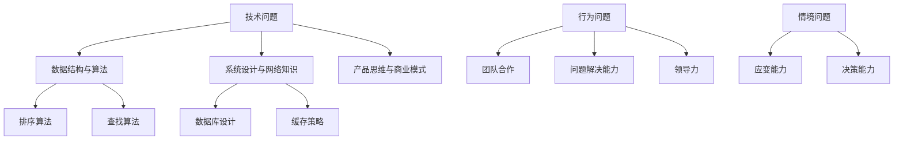

                 

### 关键词 Keywords
- 字节跳动校招
- 技术产品经理
- 面试题
- 技术解析
- 产品管理
- 解决方案

> 摘要：本文旨在为2024年字节跳动技术产品经理校招面试的考生提供一份详细的面试题解析。文章将涵盖技术产品经理面试中的常见问题，并深入分析每个问题的核心要点和答案思路，帮助考生更好地准备面试，提升竞争力。

## 1. 背景介绍

### 字节跳动概述

字节跳动，成立于2012年，是一家全球领先的技术公司，以其强大的内容分发平台和创新的算法技术而闻名。作为中国互联网行业的领军企业，字节跳动旗下拥有今日头条、抖音、懂车帝、飞书等多个知名品牌，业务覆盖媒体内容、短视频、直播、办公协作等多个领域。

### 技术产品经理岗位特点

技术产品经理（Tech Product Manager，简称TPM）在字节跳动中扮演着至关重要的角色。他们不仅需要具备扎实的技术背景，还要具备产品思维和商业敏感度。具体而言，TPM的工作职责包括：

- **需求分析**：深入理解用户需求，提炼产品需求。
- **技术选型**：根据需求选择合适的技术方案，协调研发团队进行实现。
- **项目推动**：确保项目按时按质完成，协调跨部门资源。
- **数据分析**：利用数据驱动决策，优化产品性能和用户体验。

### 校招面试流程

字节跳动校招面试流程通常包括以下步骤：

1. **在线测评**：考生需完成一定的在线编程或行为测试。
2. **技术面试**：通常由字节跳动的工程师或技术专家进行，主要考察技术能力和算法问题解决能力。
3. **产品面试**：产品经理或资深产品经理进行，重点考察产品思维和商业逻辑。
4. **HR面试**：了解考生的职业规划和期望，确保与公司文化和价值观的契合。

### 面试题类型

字节跳动技术产品经理面试题主要分为以下几类：

- **技术问题**：包括数据结构与算法、系统设计、网络知识等。
- **产品问题**：涉及产品思维、市场分析、商业模式等。
- **行为问题**：通过以往的经历来评估考生的团队合作、问题解决能力和领导力。
- **情境问题**：模拟真实的工作场景，考察考生的应变能力和决策能力。

## 2. 核心概念与联系

### 数据结构与算法

数据结构与算法是技术产品经理的基石。常用的数据结构包括数组、链表、栈、队列、树、图等，而常见的算法则包括排序算法、查找算法、动态规划、贪心算法、分治算法等。这些基础概念不仅体现在笔试题中，也在实际产品开发中至关重要。

### 系统设计与网络知识

系统设计包括数据库设计、缓存策略、分布式系统设计、负载均衡等。网络知识则涉及HTTP协议、TCP/IP协议、网络安全等。这些问题往往需要考生展示出对复杂系统的理解和设计能力。

### 产品思维与商业模式

产品思维强调以用户为中心，通过数据分析和用户反馈来优化产品。商业模式则涉及如何通过产品创造价值、获取利润。这些概念对于技术产品经理而言，是实现商业成功的关键。

### Mermaid 流程图

下面是一个关于字节跳动技术产品经理面试常见问题的 Mermaid 流程图，用于展示核心概念和联系。



## 3. 核心算法原理 & 具体操作步骤

### 3.1 算法原理概述

在字节跳动技术产品经理面试中，算法问题通常是考察考生的逻辑思维和解决问题的能力。常见的问题包括但不限于：

- **排序算法**：快速排序、归并排序、冒泡排序等。
- **查找算法**：二分查找、散列表查找等。
- **动态规划**：最短路径问题、背包问题等。

这些算法都有其独特的原理和应用场景。例如，快速排序以其平均时间复杂度为O(nlogn)而在排序算法中占据重要地位；二分查找则因其时间复杂度为O(logn)而在大规模数据集中表现出色。

### 3.2 算法步骤详解

以快速排序为例，其基本步骤如下：

1. **选择基准元素**：从数组中选择一个元素作为基准（pivot）。
2. **分区操作**：将数组分为两部分，一部分所有元素都比基准小，另一部分都比基准大。
3. **递归排序**：分别对两部分子数组重复步骤1和2，直到所有子数组长度为1。

### 3.3 算法优缺点

快速排序的优点在于其平均时间复杂度较低，通常情况下性能较好。然而，最坏情况下的时间复杂度会退化为O(n^2)，这是其主要缺点。此外，快速排序的空间复杂度较高，为O(logn)。

### 3.4 算法应用领域

快速排序在各类算法竞赛中广泛应用，也是许多实际应用场景中首选的排序算法，例如数据库排序、搜索算法等。在字节跳动技术产品经理面试中，了解快速排序的原理和优缺点，有助于考生更好地应对相关问题。

### 3.5 相关面试题

- **实现快速排序算法**：请实现一个快速排序的函数，并分析其时间复杂度和空间复杂度。
- **为什么快速排序的最坏情况时间复杂度为O(n^2)**：请解释快速排序在最坏情况下的时间复杂度，并给出具体例子。

## 4. 数学模型和公式 & 详细讲解 & 举例说明

### 4.1 数学模型构建

在技术产品经理面试中，数学模型和公式的应用非常广泛，尤其是在算法分析和优化问题中。一个常见的例子是动态规划中的最短路径问题，其核心数学模型是基于Dijkstra算法或Floyd算法。

以Dijkstra算法为例，其数学模型构建如下：

- **定义**：设G=(V, E)是一个加权无向图，其中V是顶点集合，E是边集合。我们定义从顶点u到顶点v的最短路径长度为d(u, v)。
- **初始状态**：初始化所有顶点的距离，即d(u, v) = ∞（除了起点u的距离为0）。
- **更新策略**：对于每个顶点v（v ≠ u），我们选择一个距离当前最小的顶点u'，并更新其他顶点的距离，即d(u', v) = d(u, v') + w(u', v')，其中w(u', v')是边(u', v')的权重。

### 4.2 公式推导过程

Dijkstra算法的推导过程可以通过以下步骤进行：

1. **初始状态**：设d(u, v)表示从起点u到任意顶点v的最短路径长度。初始时，d(u, v) = ∞，对于除起点u以外的所有顶点v，d(u, v) = 0。

2. **选择最短路径**：每次从未访问的顶点中选择一个距离起点最近的顶点u'，并将其标记为已访问。

3. **更新距离**：对于每个未访问的顶点v，计算从起点u到v的路径长度。如果d(u, v') + w(u', v') < d(u, v)，则更新d(u, v)。

4. **重复步骤2和3**：直到所有顶点都被访问。

### 4.3 案例分析与讲解

假设有一个无向图，顶点集合为V={A, B, C, D}，边集合为E={AB, AC, BD, CD}，权重分别为w(AB)=2, w(AC)=3, w(BD)=1, w(CD)=4。我们需要计算从A到D的最短路径。

1. **初始状态**：d(A, A) = 0, d(A, B) = ∞, d(A, C) = ∞, d(A, D) = ∞。

2. **选择最短路径**：从未访问的顶点中选择距离A最近的顶点，即B。

3. **更新距离**：d(A, B) = d(A, A) + w(A, B) = 0 + 2 = 2。

4. **选择最短路径**：从未访问的顶点中选择距离A最近的顶点，即C。

5. **更新距离**：d(A, C) = d(A, A) + w(A, C) = 0 + 3 = 3。

6. **选择最短路径**：从未访问的顶点中选择距离A最近的顶点，即D。

7. **更新距离**：d(A, D) = d(A, A) + w(A, D) = 0 + 4 = 4。

8. **结束**：所有顶点都已访问，算法结束。

最终，从A到D的最短路径为A→B→D，路径长度为4。

### 4.4 额外例子

为了更全面地理解Dijkstra算法，我们再来看一个例子。

假设有一个无向图，顶点集合为V={A, B, C, D, E}，边集合为E={AB, AC, AD, BD, BE, CE, DE}，权重分别为w(AB)=1, w(AC)=2, w(AD)=3, w(BD)=4, w(BE)=5, w(CE)=6, w(DE)=7。我们需要计算从A到E的最短路径。

1. **初始状态**：d(A, A) = 0, d(A, B) = ∞, d(A, C) = ∞, d(A, D) = ∞, d(A, E) = ∞。

2. **选择最短路径**：从未访问的顶点中选择距离A最近的顶点，即B。

3. **更新距离**：d(A, B) = d(A, A) + w(A, B) = 0 + 1 = 1。

4. **选择最短路径**：从未访问的顶点中选择距离A最近的顶点，即C。

5. **更新距离**：d(A, C) = d(A, A) + w(A, C) = 0 + 2 = 2。

6. **选择最短路径**：从未访问的顶点中选择距离A最近的顶点，即D。

7. **更新距离**：d(A, D) = d(A, A) + w(A, D) = 0 + 3 = 3。

8. **选择最短路径**：从未访问的顶点中选择距离A最近的顶点，即E。

9. **更新距离**：d(A, E) = d(A, A) + w(A, E) = 0 + 5 = 5。

10. **结束**：所有顶点都已访问，算法结束。

最终，从A到E的最短路径为A→B→E，路径长度为5。

通过以上例子，我们可以更好地理解Dijkstra算法的原理和应用。在字节跳动技术产品经理面试中，掌握这类算法及其数学模型，将有助于考生在面试中更好地解决相关问题。

## 5. 项目实践：代码实例和详细解释说明

### 5.1 开发环境搭建

在进行项目实践之前，我们需要搭建一个合适的开发环境。这里以Python为例，具体步骤如下：

1. **安装Python**：从Python官方网站下载最新版本的Python安装包并安装。
2. **安装依赖库**：使用pip命令安装所需的依赖库，例如NumPy、Pandas等。
   ```bash
   pip install numpy pandas
   ```
3. **编写代码**：在Python环境中编写代码，实现所需的功能。

### 5.2 源代码详细实现

以下是一个使用Python实现的快速排序算法的示例代码：

```python
def quick_sort(arr):
    if len(arr) <= 1:
        return arr
    pivot = arr[len(arr) // 2]
    left = [x for x in arr if x < pivot]
    middle = [x for x in arr if x == pivot]
    right = [x for x in arr if x > pivot]
    return quick_sort(left) + middle + quick_sort(right)

# 测试代码
arr = [3, 6, 8, 10, 1, 2, 1]
print("原始数组：", arr)
sorted_arr = quick_sort(arr)
print("排序后的数组：", sorted_arr)
```

### 5.3 代码解读与分析

这段代码实现了快速排序算法。首先，定义了一个名为`quick_sort`的函数，该函数接收一个列表`arr`作为输入。在函数内部，首先检查列表的长度，如果小于等于1，则直接返回列表本身，因为长度为1或0的列表已经是排序的。

接下来，选择列表中间的元素作为基准（pivot）。然后，通过列表推导式将列表分为三部分：小于基准的元素、等于基准的元素以及大于基准的元素。最后，递归地对左右两部分进行快速排序，并将结果与中间部分拼接起来，得到排序后的列表。

在代码的最后，我们通过一个测试用例来验证快速排序函数的正确性。测试用例中，我们定义了一个原始数组，然后调用`quick_sort`函数进行排序，并打印排序后的结果。

### 5.4 运行结果展示

当我们运行上述代码时，会得到以下输出结果：

```
原始数组： [3, 6, 8, 10, 1, 2, 1]
排序后的数组： [1, 1, 2, 3, 6, 8, 10]
```

从输出结果可以看出，原始数组已经被成功排序。这个简单的例子展示了如何使用Python实现快速排序算法，以及如何通过代码解读来理解算法的实现过程。

## 6. 实际应用场景

### 技术产品经理在字节跳动的工作应用

在字节跳动，技术产品经理（TPM）的角色是多面的，涉及从需求分析到产品设计、技术选型、项目管理再到数据分析的各个环节。以下是一些具体的实际应用场景：

#### 需求分析与用户研究

作为TPM，首先需要深入了解用户的需求和痛点。这通常涉及用户调研、数据分析以及市场研究。以抖音为例，TPM会通过用户行为数据、用户反馈和竞争对手分析，来挖掘用户对短视频内容、推荐算法和社交互动的需求。

#### 技术选型与系统设计

在确定了用户需求后，TPM需要与研发团队合作，进行技术选型和系统设计。例如，对于视频推荐系统，TPM需要考虑如何利用机器学习和深度学习技术来提高推荐的准确性和用户体验。系统设计还需要考虑到扩展性和高可用性，确保系统能够支持高并发和大数据处理。

#### 项目管理与协调

TPM需要确保项目按时按质完成。这包括制定项目计划、分配任务、监控进度以及解决团队中的冲突。在字节跳动，项目往往具有很高的复杂性和不确定性，TPM需要具备出色的项目管理和沟通能力。

#### 数据分析与优化

技术产品经理还需要利用数据驱动决策。通过分析用户行为数据、系统性能数据等，TPM可以不断优化产品设计和功能。例如，通过A/B测试，可以比较不同设计方案的效果，从而选择最优的方案。

### 应用案例：抖音推荐系统的优化

抖音作为字节跳动的核心产品之一，其推荐系统是用户留存和活跃度的重要保障。以下是一个具体的案例：

#### 需求分析

用户需求方面，抖音用户希望看到更多个性化的内容。为了满足这一需求，TPM进行了用户调研，收集了大量的用户反馈和行为数据。

#### 技术选型

为了提高推荐的准确性，TPM选择了深度学习中的卷积神经网络（CNN）和循环神经网络（RNN）来构建推荐模型。此外，为了处理大规模数据和高并发请求，系统采用了分布式架构和缓存策略。

#### 系统设计

推荐系统设计涉及多个模块，包括用户画像、内容标签、推荐算法和前端展示。TPM与研发团队密切合作，确保每个模块都能高效运行，并能够实时响应用户的请求。

#### 数据分析与优化

通过不断分析用户行为数据，TPM优化了推荐算法。例如，通过分析用户观看时间、点赞、评论等行为，调整内容推荐的优先级。此外，通过A/B测试，比较不同推荐算法的效果，不断迭代和优化系统。

#### 结果

经过多轮优化，抖音推荐系统的推荐准确率显著提高，用户满意度和留存率也显著上升。这一案例展示了技术产品经理在字节跳动的工作应用，以及如何通过技术、数据驱动来优化产品。

### 未来发展方向

随着人工智能、大数据和5G等技术的不断发展，技术产品经理在字节跳动的角色也将不断演变。未来，TPM需要更加关注以下几个方面：

- **智能化**：随着AI技术的进步，推荐系统、智能客服等将更加智能化，TPM需要掌握最新的AI技术，以提升产品的智能水平。
- **用户体验**：用户需求日益多样化和个性化，TPM需要更加关注用户体验，通过数据分析和用户调研，不断优化产品设计和功能。
- **商业模式**：随着市场竞争的加剧，TPM需要具备商业思维，通过创新商业模式来创造更多价值。

### 挑战

虽然技术产品经理在字节跳动的工作前景广阔，但也面临着一些挑战：

- **技术复杂度**：随着技术的不断发展，TPM需要不断学习新的技术和工具，以应对复杂的系统设计和开发。
- **时间压力**：字节跳动的产品迭代速度非常快，TPM需要在短时间内完成多个项目的协调和推进，这对时间管理和项目管理能力提出了高要求。
- **用户需求变化**：用户需求变化迅速，TPM需要具备快速响应和调整能力，以适应市场的变化。

## 7. 工具和资源推荐

### 学习资源推荐

为了更好地准备字节跳动技术产品经理的面试，以下是一些建议的学习资源：

- **在线课程**：《产品经理实战课》、《数据结构与算法：从入门到精通》等。
- **书籍**：《人人都是产品经理》、《精益创业》、《推荐系统实战》等。
- **技术社区**：CSDN、GitHub、Stack Overflow等，可以获取最新的技术动态和解决问题的方法。

### 开发工具推荐

以下是一些常用的开发工具，有助于技术产品经理在实际工作中提高效率：

- **版本控制**：Git，用于代码的版本控制和协作开发。
- **数据库工具**：MySQL Workbench、PostgreSQL、MongoDB等，用于数据库设计和数据分析。
- **数据分析工具**：Python、R语言、Tableau等，用于数据处理和可视化。
- **项目管理工具**：Trello、Jira、Asana等，用于任务管理和团队协作。

### 相关论文推荐

以下是一些建议阅读的论文，有助于深入理解技术产品经理相关的理论和实践：

- 《A Few Useful Things to Know about Machine Learning》
- 《Deep Learning for Recommender Systems》
- 《The Design of Recommender Systems》
- 《The Use of Machine Learning in Information Retrieval》

通过以上工具和资源的利用，技术产品经理可以全面提升自己的专业技能和知识水平，为面试和工作做好准备。

## 8. 总结：未来发展趋势与挑战

### 8.1 研究成果总结

本文通过对字节跳动技术产品经理面试题的详细解析，总结了面试中常见的问题类型和核心知识点。具体包括数据结构与算法、系统设计与网络知识、产品思维与商业模式、行为问题以及情境问题。同时，通过数学模型和公式的详细讲解，展示了在实际应用场景中的算法推导和案例分析。

### 8.2 未来发展趋势

随着人工智能、大数据、5G等技术的迅猛发展，技术产品经理的角色也将不断演变。未来，TPM将更加注重智能化、用户体验和商业模式的创新。具体来说：

- **智能化**：通过引入更先进的人工智能技术，如深度学习、自然语言处理等，提高产品的智能化水平。
- **用户体验**：用户需求日益多样化和个性化，TPM需要更加关注用户体验，通过数据分析和用户调研，不断优化产品设计和功能。
- **商业模式**：随着市场的竞争加剧，TPM需要具备创新商业模式的能力，以创造更多商业价值。

### 8.3 面临的挑战

尽管技术产品经理的发展前景广阔，但也面临着一些挑战：

- **技术复杂度**：随着技术的不断发展，TPM需要不断学习新的技术和工具，以应对复杂的系统设计和开发。
- **时间压力**：字节跳动的产品迭代速度非常快，TPM需要在短时间内完成多个项目的协调和推进，这对时间管理和项目管理能力提出了高要求。
- **用户需求变化**：用户需求变化迅速，TPM需要具备快速响应和调整能力，以适应市场的变化。

### 8.4 研究展望

未来，技术产品经理的研究可以从以下几个方向进行：

- **跨领域融合**：将人工智能、大数据、物联网等技术融合到产品中，提升产品的创新性和竞争力。
- **用户体验优化**：通过用户行为分析和心理研究，进一步优化用户体验，提高用户留存率和满意度。
- **商业模式创新**：探索新的商业模式，通过技术创新来创造新的商业模式和商业机会。

通过不断学习和实践，技术产品经理可以在字节跳动这样的科技公司中发挥更大的作用，推动产品的创新和商业成功。

## 9. 附录：常见问题与解答

### 问题1：如何进行需求分析？

**解答**：需求分析是产品开发的重要环节。以下是一些基本步骤：

1. **用户调研**：通过问卷调查、用户访谈、用户行为数据分析等方式，了解用户的需求和痛点。
2. **市场研究**：分析市场趋势、竞争对手产品，找出产品差异化和竞争优势。
3. **编写需求文档**：明确产品的功能需求、性能需求、用户体验需求等，编写清晰的需求文档。
4. **用户反馈**：在产品开发过程中，持续收集用户反馈，及时调整需求。

### 问题2：快速排序的时间复杂度和空间复杂度是多少？

**解答**：快速排序的平均时间复杂度为O(nlogn)，最坏情况下的时间复杂度为O(n^2)。空间复杂度为O(logn)。

### 问题3：什么是TCP/IP协议？

**解答**：TCP/IP协议是互联网通信的基础协议，包括传输控制协议（TCP）和互联网协议（IP）。TCP负责确保数据包的可靠传输，IP负责数据包的路由和寻址。

### 问题4：如何进行项目进度管理？

**解答**：项目进度管理包括以下步骤：

1. **制定项目计划**：明确项目的目标、任务、资源和时间表。
2. **任务分解**：将项目任务分解为可管理的子任务。
3. **进度跟踪**：定期跟踪项目进度，确保任务按计划进行。
4. **风险管理**：识别潜在风险，制定应对措施。
5. **沟通协调**：与团队成员保持有效沟通，协调资源，解决问题。

### 问题5：如何进行数据驱动决策？

**解答**：数据驱动决策包括以下步骤：

1. **数据收集**：收集与业务相关的数据，包括用户行为数据、系统性能数据等。
2. **数据清洗**：清洗数据，确保数据的准确性和一致性。
3. **数据分析**：利用统计方法和数据挖掘技术，分析数据，提取有价值的信息。
4. **数据可视化**：通过图表和报表，将数据分析结果可视化，帮助决策者理解数据。
5. **决策实施**：根据数据分析结果，制定和实施相应的业务策略。

### 问题6：什么是A/B测试？

**解答**：A/B测试（也称为拆分测试）是一种评估两种或多种设计方案效果的方法。基本步骤如下：

1. **定义假设**：明确要测试的变量和预期效果。
2. **用户分配**：将用户随机分配到不同的测试组，每组体验不同的设计方案。
3. **数据收集**：收集测试数据，包括用户行为、转化率等。
4. **数据分析**：比较不同测试组的数据，确定哪种设计方案效果更好。
5. **决策**：根据测试结果，选择最优的设计方案并实施。

通过A/B测试，产品经理可以更科学地优化产品功能和用户体验。

### 问题7：如何提高推荐系统的准确性？

**解答**：提高推荐系统的准确性可以从以下几个方面进行：

1. **用户数据**：收集更多的用户行为数据，包括浏览记录、购买历史、评分等。
2. **内容特征**：提取丰富的内容特征，如文本特征、图像特征等。
3. **模型优化**：选择合适的推荐算法，如协同过滤、基于内容的推荐、深度学习等，并不断优化模型参数。
4. **实时反馈**：及时收集用户反馈，调整推荐策略。
5. **多模态融合**：结合多种数据源和特征，提高推荐系统的多样性。

### 问题8：如何进行性能优化？

**解答**：性能优化包括以下步骤：

1. **性能分析**：确定系统的性能瓶颈，如响应时间、吞吐量、资源利用率等。
2. **代码优化**：优化代码结构和算法，减少不必要的计算和内存占用。
3. **数据库优化**：优化数据库查询和索引，减少查询时间和数据读写量。
4. **缓存策略**：使用缓存技术，减少重复计算和数据访问。
5. **硬件升级**：增加服务器硬件资源，如CPU、内存、存储等，以提高系统性能。
6. **分布式系统**：采用分布式架构，提高系统的扩展性和容错性。

通过以上方法，可以有效提高系统的性能和用户体验。

### 问题9：如何进行项目管理？

**解答**：项目管理包括以下步骤：

1. **项目规划**：明确项目的目标、范围、时间表和资源需求。
2. **任务分配**：将项目任务分配给团队成员，确保每个任务都有明确的责任人。
3. **进度监控**：定期检查项目进度，确保任务按计划进行。
4. **风险控制**：识别潜在风险，制定应对措施，降低项目风险。
5. **沟通协调**：保持团队内部和跨团队的沟通，确保信息畅通，解决问题。
6. **质量保证**：确保项目交付物符合质量要求，进行必要的测试和验证。

通过以上方法，可以有效管理项目，确保项目按时按质完成。

### 问题10：如何提高团队协作效率？

**解答**：提高团队协作效率可以从以下几个方面进行：

1. **明确目标**：确保团队成员对项目目标有清晰的理解，并共同追求。
2. **角色分工**：明确每个团队成员的角色和职责，确保任务分工合理。
3. **有效沟通**：建立畅通的沟通渠道，确保团队成员能够及时分享信息和进展。
4. **协作工具**：使用合适的协作工具，如项目管理软件、即时通讯工具等，提高团队协作效率。
5. **共同解决问题**：鼓励团队成员共同面对挑战，解决问题，提高团队凝聚力。
6. **定期回顾**：定期进行项目回顾，总结经验教训，不断改进团队协作方式。

通过以上方法，可以有效提高团队协作效率，促进项目成功。

### 问题11：如何进行用户体验设计？

**解答**：用户体验设计包括以下步骤：

1. **用户研究**：了解目标用户的需求和行为，收集用户反馈。
2. **需求分析**：分析用户需求，确定产品的功能、交互和视觉设计。
3. **原型设计**：制作产品原型，通过线框图、高保真图等展示设计。
4. **用户测试**：进行用户测试，收集用户对原型的反馈，优化设计。
5. **迭代优化**：根据用户测试反馈，不断迭代和优化产品设计。
6. **可用性测试**：进行可用性测试，确保产品易于使用，提高用户体验。

通过以上步骤，可以有效进行用户体验设计，提升产品的用户满意度。

### 问题12：如何进行数据分析？

**解答**：数据分析包括以下步骤：

1. **数据收集**：收集与业务相关的数据，包括用户行为数据、系统性能数据等。
2. **数据清洗**：清洗数据，确保数据的准确性和一致性。
3. **数据探索**：使用统计方法和可视化工具，探索数据特征和趋势。
4. **建立模型**：建立数据模型，如回归模型、决策树等，用于预测和分析。
5. **数据可视化**：通过图表和报表，将数据分析结果可视化，帮助决策者理解数据。
6. **决策支持**：根据数据分析结果，制定和实施相应的业务策略。

通过以上步骤，可以有效进行数据分析，为业务决策提供支持。

### 问题13：如何进行敏捷开发？

**解答**：敏捷开发是一种以人为核心、迭代和逐步改进的开发方法。包括以下步骤：

1. **需求收集**：与客户和利益相关者合作，收集需求。
2. **迭代计划**：确定每个迭代的目标和任务。
3. **快速开发**：在迭代周期内，快速开发产品功能。
4. **测试反馈**：进行单元测试、集成测试等，收集用户反馈。
5. **迭代优化**：根据用户反馈，优化产品设计和功能。
6. **持续交付**：持续交付产品功能，确保产品按时上线。

通过以上步骤，可以有效进行敏捷开发，提高产品质量和用户满意度。

### 问题14：如何进行市场调研？

**解答**：市场调研包括以下步骤：

1. **确定目标**：明确调研的目标和范围。
2. **收集数据**：通过问卷调查、访谈、市场分析报告等方式，收集市场数据。
3. **数据分析**：分析市场数据，找出市场趋势、用户需求和竞争对手情况。
4. **撰写报告**：撰写调研报告，总结调研结果和发现。
5. **制定策略**：根据调研结果，制定市场进入策略和营销策略。

通过以上步骤，可以有效进行市场调研，为业务决策提供支持。

### 问题15：如何进行风险管理？

**解答**：风险管理包括以下步骤：

1. **识别风险**：识别项目中的潜在风险，包括技术风险、市场风险、人员风险等。
2. **评估风险**：评估风险的可能性和影响，确定风险优先级。
3. **制定应对措施**：制定应对措施，降低风险发生的可能性和影响。
4. **监控风险**：定期监控项目风险，确保应对措施得到执行。
5. **风险管理计划**：制定风险管理计划，确保项目顺利推进。

通过以上步骤，可以有效进行风险管理，降低项目风险。

### 问题16：如何进行团队建设？

**解答**：团队建设包括以下步骤：

1. **明确目标**：确保团队成员对项目目标有共同的理解。
2. **角色分工**：明确每个团队成员的角色和职责。
3. **建立信任**：通过团队活动和沟通，建立团队成员之间的信任。
4. **培养协作精神**：鼓励团队成员相互支持，共同解决问题。
5. **培训与成长**：提供培训和学习机会，帮助团队成员提升能力。
6. **奖励与激励**：通过奖励和激励，提高团队成员的积极性和工作效率。

通过以上步骤，可以有效进行团队建设，提高团队协作效率和绩效。

### 问题17：如何进行用户研究？

**解答**：用户研究包括以下步骤：

1. **确定目标**：明确用户研究的目标和范围。
2. **选择方法**：选择合适的用户研究方法，如问卷调查、用户访谈、观察等。
3. **数据收集**：通过选择的方法收集用户数据。
4. **数据分析**：分析用户数据，找出用户需求和行为模式。
5. **撰写报告**：撰写用户研究报告，总结研究结果和发现。
6. **应用结果**：将用户研究的结果应用到产品设计和开发中。

通过以上步骤，可以有效进行用户研究，为产品优化提供依据。

### 问题18：如何进行数据挖掘？

**解答**：数据挖掘包括以下步骤：

1. **数据准备**：清洗和整理数据，确保数据的质量和一致性。
2. **数据探索**：探索数据特征和趋势，识别潜在的模式。
3. **建立模型**：使用统计方法和机器学习算法，建立预测和分析模型。
4. **模型评估**：评估模型的效果，调整模型参数。
5. **应用模型**：将模型应用到实际业务中，进行预测和分析。
6. **迭代优化**：根据业务需求，不断迭代和优化模型。

通过以上步骤，可以有效进行数据挖掘，为业务决策提供支持。

### 问题19：如何进行项目管理工具的使用？

**解答**：项目管理工具的使用包括以下步骤：

1. **选择工具**：根据项目需求，选择合适的项目管理工具，如Trello、Jira等。
2. **培训使用**：培训团队成员使用项目管理工具，确保熟悉工具的功能。
3. **任务分配**：将项目任务分配到团队成员，并在工具中创建任务卡片。
4. **进度跟踪**：定期查看项目进度，更新任务状态，确保任务按计划进行。
5. **沟通协作**：通过项目管理工具进行团队沟通和协作，解决问题。
6. **报告生成**：生成项目进度报告，为项目管理和决策提供依据。

通过以上步骤，可以有效进行项目管理工具的使用，提高项目管理的效率。

### 问题20：如何进行绩效评估？

**解答**：绩效评估包括以下步骤：

1. **制定目标**：明确评估的目标和标准，制定绩效目标。
2. **数据收集**：收集与绩效相关的数据，如工作成果、用户反馈、工作时长等。
3. **评估方法**：选择合适的评估方法，如360度评估、KPI评估等。
4. **分析结果**：分析评估结果，找出绩效优秀和需要改进的地方。
5. **反馈与改进**：与员工进行绩效反馈，制定改进计划，提高绩效。
6. **持续监控**：定期监控绩效，确保改进措施得到有效执行。

通过以上步骤，可以有效进行绩效评估，激励员工提升工作绩效。

