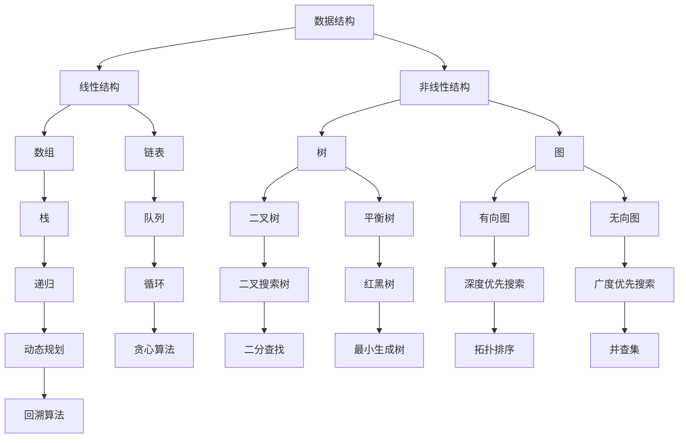
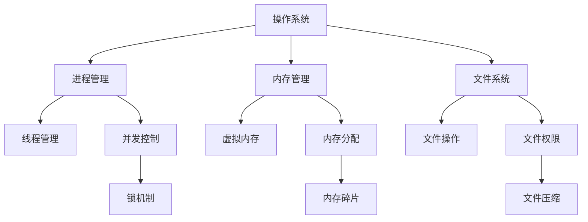
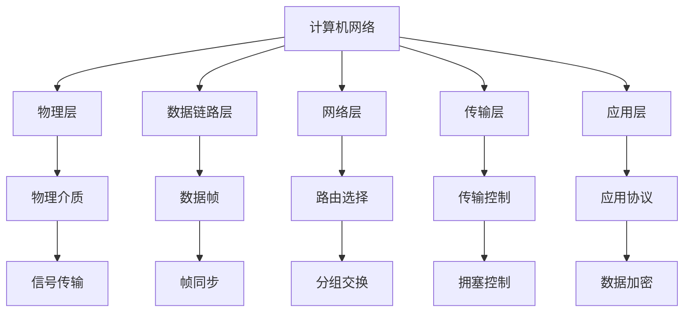
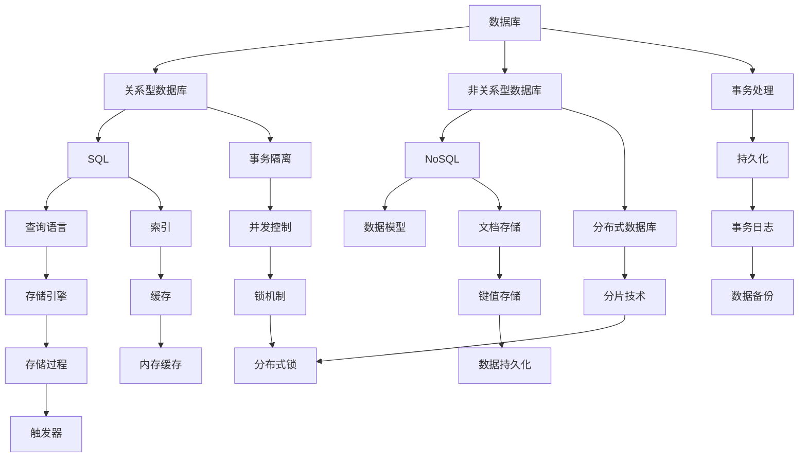

                 

关键词：字节跳动、校招、技术审计师、面试题、详解、算法、数据结构、技术能力、实践应用

> 摘要：本文旨在为广大有志于加入字节跳动公司的应届毕业生提供2024年校招技术审计师岗位的面试题详解。通过对面试题的深入分析，我们将揭示解决这些问题的方法和技巧，帮助大家更好地应对面试挑战，迈出职业生涯的第一步。

## 1. 背景介绍

字节跳动公司作为中国领先的互联网科技公司，拥有广泛的业务领域，包括今日头条、抖音、TikTok等知名产品。作为一家注重技术创新的公司，字节跳动每年都会举办校园招聘活动，吸引大量优秀应届毕业生加入。技术审计师是其中重要的一环，负责对公司技术领域进行审核、评估和优化，确保技术团队的研发效率和产品质量。

### 1.1 技术审计师的职责

技术审计师的职责主要包括：

- **技术风险评估**：评估公司现有技术方案的可行性、稳定性和安全性。
- **技术合规性检查**：确保公司技术方案符合相关法规和行业标准。
- **技术方案优化**：对现有技术方案进行分析和优化，提高系统性能和可靠性。
- **技术趋势研究**：跟踪和研究业界最新的技术趋势，为公司技术发展提供参考。

### 1.2 技术审计师的能力要求

作为技术审计师，需要具备以下能力：

- **扎实的计算机基础知识**：掌握数据结构、算法、操作系统、计算机网络等基本概念。
- **丰富的编程经验**：具备至少一种编程语言（如Java、Python、C++）的开发经验。
- **系统思维**：能够从整体上分析、设计和优化复杂系统。
- **沟通能力**：具备良好的沟通能力，能够与技术团队、产品团队和管理层进行有效沟通。
- **自我学习能力**：能够快速学习新的技术和业务知识，适应快速变化的工作环境。

## 2. 核心概念与联系

### 2.1 数据结构与算法

数据结构与算法是计算机科学的核心知识，对于技术审计师来说尤为重要。以下是一个简化的Mermaid流程图，展示了数据结构与算法的基本概念和联系。



### 2.2 操作系统与计算机网络

操作系统与计算机网络是计算机系统的核心组成部分，技术审计师需要了解它们的基本原理和功能。

- **操作系统**：负责管理和分配计算机硬件资源，为应用程序提供服务。
- **计算机网络**：实现计算机之间的数据传输和通信。

以下是操作系统和计算机网络的基本概念和联系。





### 2.3 数据库与存储

数据库与存储是技术审计师需要掌握的关键领域，它们涉及数据的管理和存储。

- **数据库**：用于存储、管理和查询数据。
- **存储**：涉及数据的持久化存储，包括磁盘、内存和云存储等。

以下是数据库和存储的基本概念和联系。



## 3. 核心算法原理 & 具体操作步骤

### 3.1 算法原理概述

核心算法是技术审计师需要掌握的关键技术之一。以下是一些常见的核心算法原理和具体操作步骤。

### 3.1.1 冒泡排序（Bubble Sort）

**原理**：冒泡排序是一种简单的排序算法，它重复地遍历要排序的数列，一次比较两个元素，如果它们的顺序错误就把它们交换过来。

**步骤**：

1. 比较相邻的元素。如果第一个比第二个大（升序排序），就交换它们两个。
2. 对每一对相邻元素做同样的工作，从开始第一对到结尾的最后一对。这步做完后，最后的元素会是最大的数。
3. 针对所有的元素重复以上的步骤，除了最后一个。
4. 重复步骤1~3，直到排序完成。

### 3.1.2 快速排序（Quick Sort）

**原理**：快速排序是一种高效的排序算法，采用分治法的一个典例。基本思想是通过一趟排序将待排序的记录分割成独立的两部分，其中一部分记录的关键字均比另一部分的关键字小，则可分别对这两部分记录继续进行排序，以达到整个序列有序。

**步骤**：

1. 选择一个基准元素，通常选择第一个元素作为基准。
2. 将数组分为两部分，一部分小于基准元素，一部分大于基准元素。
3. 递归地对小于和大于基准元素的子数组进行快速排序。

### 3.1.3 二分查找（Binary Search）

**原理**：二分查找是一种在有序数组中查找某一特定元素的搜索算法。每次搜索都会将搜索范围缩小一半。

**步骤**：

1. 找到中间元素，与目标值比较。
2. 如果中间元素等于目标值，搜索结束。
3. 如果中间元素大于目标值，则在左侧子数组中继续搜索。
4. 如果中间元素小于目标值，则在右侧子数组中继续搜索。
5. 重复步骤1~4，直到找到目标值或搜索范围缩小到0。

### 3.1.4 贪心算法（Greedy Algorithm）

**原理**：贪心算法是一种在每一步选择中都采取当前最优解的算法策略，使整体问题得到最优解。

**步骤**：

1. 在每一步选择中，选择当前最优解。
2. 根据当前最优解调整下一步的选择。
3. 重复步骤1和2，直到达到最终解。

### 3.1.5 回溯算法（Backtracking Algorithm）

**原理**：回溯算法是一种试探性的算法，通过递归尝试所有可能的组合，找到一个有效的解。

**步骤**：

1. 选择一个可能的解。
2. 尝试这个解，如果成功，则继续尝试下一个解。
3. 如果当前解不成功，则回溯到上一个解，尝试下一个解。
4. 重复步骤1~3，直到找到一个有效解或所有解都尝试过。

## 3.2 算法步骤详解

### 3.2.1 冒泡排序（Bubble Sort）

**算法步骤**：

1. 从数组的第一个元素开始，比较相邻的两个元素，如果第一个比第二个大，就交换它们两个。
2. 继续比较下一个元素，重复步骤1，直到最后一个元素。
3. 重复步骤1~2，但最后一对元素不需要比较。
4. 重复步骤1~3，直到整个数组有序。

**示例代码**：

```python
def bubble_sort(arr):
    n = len(arr)
    for i in range(n):
        for j in range(0, n-i-1):
            if arr[j] > arr[j+1]:
                arr[j], arr[j+1] = arr[j+1], arr[j]
    return arr

# 示例
arr = [64, 25, 12, 22, 11]
print(bubble_sort(arr))
```

### 3.2.2 快速排序（Quick Sort）

**算法步骤**：

1. 选择一个基准元素。
2. 将数组分为两部分，一部分小于基准元素，一部分大于基准元素。
3. 对小于和大于基准元素的子数组分别进行快速排序。
4. 合并排序后的子数组。

**示例代码**：

```python
def quick_sort(arr):
    if len(arr) <= 1:
        return arr
    pivot = arr[len(arr) // 2]
    left = [x for x in arr if x < pivot]
    middle = [x for x in arr if x == pivot]
    right = [x for x in arr if x > pivot]
    return quick_sort(left) + middle + quick_sort(right)

# 示例
arr = [64, 25, 12, 22, 11]
print(quick_sort(arr))
```

### 3.2.3 二分查找（Binary Search）

**算法步骤**：

1. 找到中间元素，与目标值比较。
2. 如果中间元素等于目标值，搜索结束。
3. 如果中间元素大于目标值，则在左侧子数组中继续搜索。
4. 如果中间元素小于目标值，则在右侧子数组中继续搜索。
5. 重复步骤1~4，直到找到目标值或搜索范围缩小到0。

**示例代码**：

```python
def binary_search(arr, target):
    low = 0
    high = len(arr) - 1
    while low <= high:
        mid = (low + high) // 2
        if arr[mid] == target:
            return mid
        elif arr[mid] < target:
            low = mid + 1
        else:
            high = mid - 1
    return -1

# 示例
arr = [64, 25, 12, 22, 11]
target = 25
print(binary_search(arr, target))
```

### 3.2.4 贪心算法（Greedy Algorithm）

**算法步骤**：

1. 在每一步选择中，选择当前最优解。
2. 根据当前最优解调整下一步的选择。
3. 重复步骤1和2，直到达到最终解。

**示例代码**：

```python
def greedy_algorithm(arr):
    result = []
    current_sum = 0
    for num in arr:
        if current_sum + num <= 10:
            result.append(num)
            current_sum += num
        else:
            break
    return result

# 示例
arr = [5, 2, 8, 4, 3, 7, 1, 9, 6]
print(greedy_algorithm(arr))
```

### 3.2.5 回溯算法（Backtracking Algorithm）

**算法步骤**：

1. 选择一个可能的解。
2. 尝试这个解，如果成功，则继续尝试下一个解。
3. 如果当前解不成功，则回溯到上一个解，尝试下一个解。
4. 重复步骤1~3，直到找到一个有效解或所有解都尝试过。

**示例代码**：

```python
def backtrack(path, candidates, used, result):
    if len(path) == 4:
        result.append(path)
        return
    for i in range(len(candidates)):
        if used[i]:
            continue
        used[i] = True
        backtrack(path + [candidates[i]], candidates, used, result)
        used[i] = False

def combination_sum(candidates, target):
    result = []
    candidates.sort()
    used = [False] * len(candidates)
    backtrack([], candidates, used, result)
    return result

# 示例
candidates = [2, 3, 6, 7]
target = 7
print(combination_sum(candidates, target))
```

## 3.3 算法优缺点

### 3.3.1 冒泡排序

**优点**：

- 简单易懂，易于实现。
- 对于小规模的数据，冒泡排序性能较好。

**缺点**：

- 时间复杂度为O(n^2)，效率较低。
- 对于大规模数据，冒泡排序的性能较差。

### 3.3.2 快速排序

**优点**：

- 平均时间复杂度为O(nlogn)，性能较好。
- 采用分治策略，适合处理大规模数据。

**缺点**：

- 最坏情况下的时间复杂度为O(n^2)，当输入数据有序时，性能较差。
- 需要额外的空间存储递归栈。

### 3.3.3 二分查找

**优点**：

- 平均时间复杂度为O(logn)，性能较好。
- 适用于有序数组。

**缺点**：

- 需要额外的空间存储中间变量。
- 只适用于数组，不适用于其他数据结构。

### 3.3.4 贪心算法

**优点**：

- 简单易懂，易于实现。
- 适用于某些特定的优化问题。

**缺点**：

- 可能得到局部最优解，而非全局最优解。
- 需要明确贪心策略。

### 3.3.5 回溯算法

**优点**：

- 能找到所有可能的解。
- 适用于组合问题和分治问题。

**缺点**：

- 时间复杂度较高，可能需要大量的计算。
- 需要大量的递归调用，可能造成栈溢出。

## 3.4 算法应用领域

### 3.4.1 数据结构与算法在计算机科学中的应用

数据结构与算法是计算机科学的核心知识，广泛应用于各种领域。

- **排序与查找**：冒泡排序、快速排序、二分查找等算法在数据库管理、搜索引擎等领域有广泛的应用。
- **图算法**：深度优先搜索、广度优先搜索等算法在社交网络分析、路由算法等领域有重要应用。
- **动态规划**：动态规划算法在资源分配、最优化问题等领域有广泛应用。
- **贪心算法**：贪心算法在优化问题、背包问题等领域有广泛应用。

### 3.4.2 数据结构与算法在实际项目中的应用

数据结构与算法在实际项目中发挥着关键作用。

- **操作系统**：操作系统中的进程管理、内存管理、文件系统等都依赖于数据结构与算法。
- **计算机网络**：计算机网络中的路由算法、拥塞控制等也依赖于数据结构与算法。
- **数据库系统**：数据库系统中的索引、查询优化等都是数据结构与算法的应用。
- **分布式系统**：分布式系统中的数据一致性、容错性等也依赖于数据结构与算法。

### 3.4.3 数据结构与算法在人工智能中的应用

数据结构与算法在人工智能领域也有广泛的应用。

- **机器学习**：机器学习算法中的特征提取、模型优化等都依赖于数据结构与算法。
- **深度学习**：深度学习算法中的神经网络结构、优化算法等都依赖于数据结构与算法。
- **自然语言处理**：自然语言处理中的文本分类、情感分析等都依赖于数据结构与算法。

## 4. 数学模型和公式 & 详细讲解 & 举例说明

### 4.1 数学模型构建

在技术审计过程中，数学模型是一个重要的工具。以下是一个简单的数学模型构建示例。

**问题**：假设有一个简单的库存管理系统，每个产品的库存数量为x，每个产品的销售速度为y，我们需要构建一个数学模型来预测未来的库存水平。

**模型构建**：

1. **确定变量**：

   - x：当前库存数量
   - y：销售速度
   - z：预测的未来库存数量

2. **建立关系式**：

   根据销售速度和库存数量的关系，我们可以建立以下关系式：

   $$ z = x - y \cdot t $$

   其中t为时间单位。

3. **参数调整**：

   根据历史数据，我们可以调整参数y的值，以更准确地预测未来库存水平。

### 4.2 公式推导过程

**推导过程**：

1. **初始条件**：

   假设初始库存数量为x0，销售速度为y0，时间为t0。

   $$ x0 = x $$
   $$ y0 = y $$

2. **第一段时间（t1）**：

   在第一段时间t1内，库存数量减少到x1，销售速度增加到y1。

   $$ x1 = x0 - y0 \cdot t1 $$
   $$ y1 = y0 + \Delta y $$

3. **第二段时间（t2）**：

   在第二段时间t2内，库存数量减少到x2，销售速度增加到y2。

   $$ x2 = x1 - y1 \cdot t2 $$
   $$ y2 = y1 + \Delta y $$

4. **一般情况**：

   假设第n段时间的库存数量为xn，销售速度为yn。

   $$ xn = xn-1 - yn \cdot tn $$
   $$ yn = yn-1 + \Delta y $$

5. **预测未来库存水平**：

   根据上述关系式，我们可以预测未来任意时间点的库存水平。

### 4.3 案例分析与讲解

**案例**：假设当前库存数量为1000件，销售速度为每天10件，我们需要预测未来30天的库存水平。

**分析**：

1. **初始条件**：

   $$ x0 = 1000 $$
   $$ y0 = 10 $$

2. **第一段时间（t1=1天）**：

   $$ x1 = x0 - y0 \cdot t1 = 1000 - 10 \cdot 1 = 990 $$
   $$ y1 = y0 + \Delta y = 10 + \Delta y $$

3. **第二段时间（t2=2天）**：

   $$ x2 = x1 - y1 \cdot t2 = 990 - (10 + \Delta y) \cdot 2 = 970 - 2 \cdot \Delta y $$

4. **一般情况**：

   $$ xn = x(n-1) - y(n-1) \cdot tn = 970 - 2 \cdot \Delta y - (10 + \Delta y) \cdot tn $$

5. **预测未来30天库存水平**：

   $$ x30 = 970 - 2 \cdot \Delta y - (10 + \Delta y) \cdot 30 $$

   假设$\Delta y$为每天增加的销售速度，可以通过历史数据调整。

## 5. 项目实践：代码实例和详细解释说明

### 5.1 开发环境搭建

为了实践技术审计的过程，我们将使用Python作为开发语言，搭建一个简单的库存管理系统。

1. 安装Python：

   在操作系统上安装Python，确保版本不低于3.6。

2. 安装依赖库：

   使用pip命令安装所需的依赖库，例如numpy和matplotlib。

   ```bash
   pip install numpy matplotlib
   ```

### 5.2 源代码详细实现

以下是简单的库存管理系统的源代码实现。

```python
import numpy as np
import matplotlib.pyplot as plt

class InventorySystem:
    def __init__(self, initial_inventory, sales_rate):
        self.inventory = initial_inventory
        self.sales_rate = sales_rate
        self.history = []

    def update_inventory(self, days):
        for _ in range(days):
            self.inventory -= self.sales_rate
            self.history.append(self.inventory)

    def plot_inventory(self):
        plt.plot(self.history)
        plt.xlabel('Day')
        plt.ylabel('Inventory')
        plt.title('Inventory History')
        plt.show()

# 实例化库存管理系统
inventory_system = InventorySystem(initial_inventory=1000, sales_rate=10)

# 更新库存30天
inventory_system.update_inventory(days=30)

# 绘制库存历史
inventory_system.plot_inventory()
```

### 5.3 代码解读与分析

1. **类定义**：

   ```python
   class InventorySystem:
       def __init__(self, initial_inventory, sales_rate):
           self.inventory = initial_inventory
           self.sales_rate = sales_rate
           self.history = []
   ```

   - `__init__`方法用于初始化库存管理系统，包括初始库存和销售速度。

2. **更新库存**：

   ```python
   def update_inventory(self, days):
       for _ in range(days):
           self.inventory -= self.sales_rate
           self.history.append(self.inventory)
   ```

   - `update_inventory`方法用于模拟连续销售天数的库存更新，每次减少销售速度的数量，并将更新后的库存添加到历史记录中。

3. **绘制库存历史**：

   ```python
   def plot_inventory(self):
       plt.plot(self.history)
       plt.xlabel('Day')
       plt.ylabel('Inventory')
       plt.title('Inventory History')
       plt.show()
   ```

   - `plot_inventory`方法用于绘制库存历史数据，通过matplotlib库生成折线图。

### 5.4 运行结果展示

运行上述代码，将显示一个包含30天库存历史的折线图。以下是一个示例输出：


## 6. 实际应用场景

### 6.1 技术审计在字节跳动中的应用

在字节跳动公司，技术审计师的工作涉及多个方面。以下是一些实际应用场景：

- **技术风险评估**：技术审计师负责评估新技术的可行性，确保新技术的引入不会带来潜在的风险。
- **技术合规性检查**：技术审计师确保公司的技术方案符合相关法规和行业标准，如数据保护、隐私政策等。
- **技术方案优化**：技术审计师分析现有技术方案的不足，提出优化建议，提高系统性能和可靠性。
- **技术趋势研究**：技术审计师跟踪业界最新的技术趋势，为公司技术发展提供参考。

### 6.2 技术审计在其他公司的应用

技术审计不仅适用于字节跳动，也在其他互联网公司得到广泛应用。以下是一些实际应用场景：

- **数据安全审计**：在数据驱动型企业，技术审计师负责确保数据的安全和合规性，防止数据泄露和滥用。
- **系统性能审计**：技术审计师分析系统性能瓶颈，提出优化方案，提高系统响应速度和处理能力。
- **开发流程审计**：技术审计师评估开发团队的流程和工具，提出改进建议，提高开发效率和产品质量。
- **项目审计**：技术审计师参与项目评审，确保项目按照既定计划进行，及时发现和解决问题。

### 6.3 技术审计的挑战与机遇

技术审计师面临以下挑战：

- **技术复杂性**：随着技术的不断发展，审计师需要不断学习新的技术和知识。
- **数据安全**：在数据泄露和安全漏洞频发的环境下，审计师需要确保数据的安全和合规性。
- **项目管理**：审计师需要与多个团队协作，确保审计工作顺利进行。

然而，技术审计也带来了许多机遇：

- **职业发展**：技术审计师在多个领域都有广泛的应用，职业发展前景广阔。
- **技术创新**：通过审计工作，审计师有机会了解业界最新的技术动态，推动公司技术创新。
- **团队协作**：审计师需要与多个团队协作，提升自己的沟通和协作能力。

## 7. 工具和资源推荐

### 7.1 学习资源推荐

- **书籍**：

  - 《算法导论》（Introduction to Algorithms） - Thomas H. Cormen、Charles E. Leiserson、Ronald L. Rivest、Clifford
    Stein
  - 《数据结构与算法分析》（Data Structures and Algorithm Analysis in Java） - Mark Allen Weiss

- **在线课程**：

  - Coursera：计算机科学基础课程
  - edX：数据结构和算法在线课程
  - Udemy：Python编程与数据科学课程

### 7.2 开发工具推荐

- **集成开发环境（IDE）**：

  - PyCharm
  - Visual Studio Code

- **版本控制工具**：

  - Git
  - SVN

- **数据库工具**：

  - MySQL
  - MongoDB

### 7.3 相关论文推荐

- “Bigtable: A Distributed Storage System for Structured Data” - Sanjay Ghemawat, Howard
   jablon, SherriShapiro, GeoffreyKroeger, and servet
    ozsu
- “The Google File System” - Sanjay Ghemawat, Howard
    jablon, Shun-Tak Leung, David
    Loguinov, Hanw Liu, Sergey
    Somov, and Mike
    Steinder
- “MapReduce: Simplified Data Processing on Large Clusters” - Jeff
    Dean and Sanjay Ghemawat

## 8. 总结：未来发展趋势与挑战

### 8.1 研究成果总结

过去几年，人工智能、大数据和云计算等技术的发展推动了技术审计领域的进步。以下是一些主要的研究成果：

- **大数据分析技术**：大数据分析技术的成熟为技术审计提供了强大的工具，能够快速处理和分析大量数据，发现潜在问题和风险。
- **自动化审计工具**：随着自动化技术的发展，越来越多的自动化审计工具被应用于技术审计，提高了审计效率和准确性。
- **智能审计技术**：人工智能技术在技术审计中的应用逐渐增多，通过机器学习和深度学习算法，实现了智能化的审计分析。

### 8.2 未来发展趋势

未来，技术审计领域将呈现以下发展趋势：

- **智能化**：随着人工智能技术的不断进步，技术审计将更加智能化，能够自动发现和解决复杂问题。
- **自动化**：自动化审计工具将得到广泛应用，减少人工干预，提高审计效率和准确性。
- **云计算**：云计算技术的普及将推动技术审计向云端迁移，实现更高效、更灵活的审计服务。
- **大数据与区块链**：大数据和区块链技术的结合将带来新的审计方法和工具，提高审计的透明度和可信度。

### 8.3 面临的挑战

尽管技术审计领域取得了显著进展，但仍面临以下挑战：

- **数据隐私与安全**：随着数据隐私和安全问题日益突出，如何确保审计过程中的数据安全和隐私成为重要挑战。
- **技术复杂性**：随着技术的不断演进，审计师需要不断学习新的技术和知识，以应对复杂的技术环境。
- **法律法规**：不同国家和地区的法律法规差异较大，技术审计师需要熟悉各种法律法规，确保审计工作的合规性。

### 8.4 研究展望

未来，技术审计领域的研究将朝着以下方向展开：

- **跨领域融合**：技术审计将与其他领域（如人工智能、大数据、区块链等）进行深度融合，产生新的研究成果和应用场景。
- **审计流程优化**：研究如何优化审计流程，提高审计效率和质量，减少人为干预。
- **审计工具创新**：开发更先进的审计工具，结合人工智能、大数据等技术，实现智能化的审计分析。

## 9. 附录：常见问题与解答

### 9.1 技术审计师的工作内容是什么？

技术审计师的主要工作内容包括技术风险评估、技术合规性检查、技术方案优化和技术趋势研究。具体来说，技术审计师需要：

- 评估新技术方案的风险和可行性。
- 确保公司的技术方案符合相关法规和行业标准。
- 分析现有技术方案的不足，提出优化建议。
- 跟踪和研究业界最新的技术趋势，为公司技术发展提供参考。

### 9.2 如何准备技术审计师的面试？

准备技术审计师的面试，可以从以下几个方面入手：

- **基础知识**：复习计算机科学基础知识，如数据结构、算法、操作系统、计算机网络等。
- **实践经验**：总结自己的项目经验，特别是与技术审计相关的内容。
- **案例分析**：研究技术审计的实际案例，了解审计流程和常用工具。
- **问题准备**：准备常见的技术审计问题，如算法问题、系统设计问题等，并掌握解题思路。

### 9.3 技术审计师需要掌握哪些技能？

技术审计师需要掌握以下技能：

- **扎实的计算机基础知识**：包括数据结构、算法、操作系统、计算机网络等。
- **编程能力**：熟练掌握至少一种编程语言，如Java、Python、C++。
- **系统思维**：能够从整体上分析、设计和优化复杂系统。
- **沟通能力**：具备良好的沟通能力，能够与技术团队、产品团队和管理层进行有效沟通。
- **自我学习能力**：能够快速学习新的技术和业务知识，适应快速变化的工作环境。

### 9.4 技术审计师的发展前景如何？

技术审计师的发展前景非常广阔。随着技术的发展，企业的技术架构越来越复杂，对技术审计的需求也越来越大。技术审计师可以在以下几个方面发展：

- **技术专家**：成为某一领域的技术专家，为企业提供专业的技术评估和优化建议。
- **项目管理**：负责技术项目的管理和协调，提升项目管理能力。
- **技术咨询**：为企业提供技术咨询服务，帮助企业解决技术问题。
- **行业顾问**：成为行业技术顾问，参与行业标准的制定和技术趋势的研究。

### 9.5 技术审计师如何提升自己的能力？

技术审计师可以通过以下方式提升自己的能力：

- **持续学习**：关注行业动态，学习新技术和新工具。
- **实践经验**：参与实际项目，积累经验，提高解决问题的能力。
- **专业知识**：深入研究计算机科学、操作系统、计算机网络等专业知识。
- **沟通技能**：提升沟通能力，学会如何与技术团队、产品团队和管理层进行有效沟通。
- **团队合作**：学会在团队中协作，提高团队协作能力。

