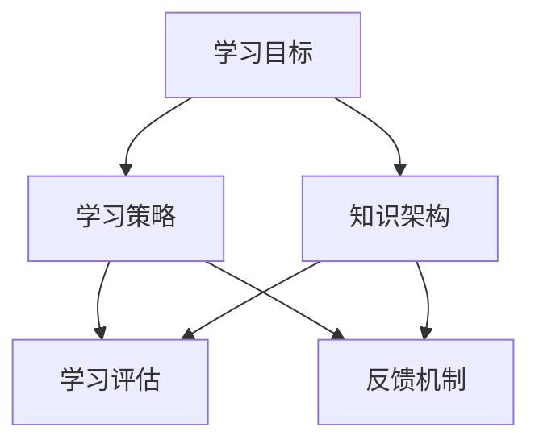

                 

### 文章标题

**学习体系：持续进化的源动力**

> **关键词**：学习体系，持续进化，源动力，知识架构，技能提升，认知框架，技术发展。

> **摘要**：本文将探讨学习体系在个人和团队持续进化中的关键作用，通过分析核心概念、算法原理、数学模型、实践案例，以及实际应用场景，揭示学习体系的构建方法和优化策略。文章旨在为IT从业者提供一套完整的学习框架，助力其在快速变化的技术领域中不断进步。

---

### 1. 背景介绍

在当今信息化时代，技术的迭代速度不断加快，知识更新周期急剧缩短。对于IT从业者而言，持续学习成为保持竞争力的关键。然而，面对海量的信息和多样的学习资源，如何构建一个有效且高效的学习体系，成为每个学习者的核心问题。

学习体系不仅仅是一系列学习步骤的简单叠加，而是一个有机的系统，能够帮助学习者有效地吸收、整合和应用知识。一个完善的学习体系应包括明确的学习目标、合理的学习策略、科学的学习评估和反馈机制。只有如此，学习才能成为持续进化的源动力，而不是零散的信息堆积。

本文将从以下几个部分展开讨论：

1. 核心概念与联系
2. 核心算法原理 & 具体操作步骤
3. 数学模型和公式 & 详细讲解 & 举例说明
4. 项目实践：代码实例和详细解释说明
5. 实际应用场景
6. 工具和资源推荐
7. 总结：未来发展趋势与挑战
8. 附录：常见问题与解答
9. 扩展阅读 & 参考资料

通过以上框架，我们将深入探讨学习体系在个人成长和技术进步中的重要作用，并提供实用的构建和优化方法。

#### 1.1 学习体系的重要性

学习体系的重要性在于它能够帮助IT从业者：

- **明确目标**：通过设定明确的学习目标，确保学习过程有方向、有重点。
- **优化策略**：运用合适的学习策略，提高学习效率和效果。
- **知识整合**：将零散的知识点系统化、结构化，形成有逻辑的知识体系。
- **持续进步**：通过评估和反馈机制，不断调整学习计划，实现持续进步。

#### 1.2 当前技术环境对学习体系的需求

随着技术的发展，尤其是人工智能、大数据、云计算等新兴技术的广泛应用，对IT从业者的要求越来越高。这不仅仅是技术技能的更新换代，更是认知能力和思维模式的革新。因此，构建一个能够适应快速变化的技术的学习体系，显得尤为重要。

#### 1.3 文章结构

接下来的部分，我们将详细讨论学习体系的核心概念、算法原理、数学模型、实践案例和实际应用场景，为读者提供一套完整的学习框架，助力其在技术领域中不断进步。

---

### 2. 核心概念与联系

在构建一个有效的学习体系之前，理解其中的核心概念和它们之间的联系是至关重要的。以下是一些关键概念及其相互关系：

#### 2.1 学习目标

学习目标是指学习者希望通过学习达到的具体结果或水平。明确的学习目标是构建学习体系的基础，它指导着学习的方向和内容。

#### 2.2 学习策略

学习策略是实现学习目标的方法和手段。它包括学习方法、学习工具和学习技巧等。合理的学习策略能够提高学习效率和效果。

#### 2.3 知识架构

知识架构是指知识点的组织结构和层次关系。一个良好的知识架构能够帮助学习者系统化地理解和记忆知识，便于知识的整合和应用。

#### 2.4 学习评估

学习评估是对学习效果进行客观评价的过程。通过评估，学习者可以了解自己的学习情况，发现不足并加以改进。

#### 2.5 反馈机制

反馈机制是通过外部评价或自我反思来调整学习过程和策略的机制。良好的反馈机制能够帮助学习者不断优化学习过程，实现持续进步。

#### 2.6 核心概念联系

这些核心概念相互联系，共同构成了一个完整的学习体系。具体关系如下：

- 学习目标决定了学习的内容和方向。
- 学习策略是实现学习目标的手段。
- 知识架构将学习的内容系统化、结构化。
- 学习评估和反馈机制帮助学习者了解学习效果，调整学习策略。

#### 2.7 Mermaid 流程图

以下是一个简单的Mermaid流程图，展示了核心概念之间的相互关系：



#### 2.8 关键联系

- **学习目标**和**知识架构**的关系：学习目标决定了知识架构的具体内容，而知识架构则为学习目标提供了实现路径。
- **学习策略**和**学习评估**的关系：学习策略决定了学习的方法和手段，而学习评估则对学习策略的有效性进行检验和调整。
- **反馈机制**和学习目标、策略、知识架构的关系：反馈机制通过对学习效果的反馈，帮助学习者优化学习目标和策略，完善知识架构。

通过理解这些核心概念及其相互关系，我们能够更好地构建和优化学习体系，实现持续进化的目标。

### 3. 核心算法原理 & 具体操作步骤

在理解了学习体系的核心概念和它们之间的联系之后，接下来我们将探讨如何通过具体的算法原理和操作步骤来构建和优化学习体系。核心算法在这里可以理解为学习过程中的关键技术和方法，它们是实现学习目标的有效工具。

#### 3.1 核心算法原理

构建学习体系的核心算法主要包括以下几种：

1. **目标设定算法**：用于明确学习目标和制定学习计划。
2. **内容获取算法**：用于选择和整合学习资源。
3. **知识结构化算法**：用于组织知识，建立知识架构。
4. **评估和反馈算法**：用于对学习效果进行评估和调整。

#### 3.2 具体操作步骤

下面将详细介绍这些核心算法的具体操作步骤：

#### 3.2.1 目标设定算法

**步骤 1**：自我评估

首先，学习者需要对自己目前的技能水平和知识储备进行评估，确定自己的优势和劣势。这可以通过自我反思、咨询导师或同事等方式完成。

**步骤 2**：设定目标

基于自我评估的结果，设定具体的、可衡量的学习目标。这些目标应具有挑战性，但也要切合实际，能够通过努力实现。

**步骤 3**：制定计划

为了实现学习目标，制定详细的学习计划。计划应包括学习内容、时间安排和学习资源等。

#### 3.2.2 内容获取算法

**步骤 1**：需求分析

分析学习目标所需的知识和技能，明确需要学习的具体内容。

**步骤 2**：资源选择

根据需求分析，选择合适的学习资源。这些资源可以包括书籍、在线课程、研讨会、实战项目等。

**步骤 3**：整合资源

将选择好的学习资源整合到学习计划中，确保学习内容系统化和结构化。

#### 3.2.3 知识结构化算法

**步骤 1**：内容整理

将学习资源中的知识点进行整理和分类，形成知识框架。

**步骤 2**：构建知识地图

基于整理好的知识点，构建知识地图，展示知识点的层次关系和相互联系。

**步骤 3**：定期复习

为了巩固所学知识，制定定期复习计划，通过回顾和练习加深对知识点的理解和记忆。

#### 3.2.4 评估和反馈算法

**步骤 1**：设定评估标准

根据学习目标和知识架构，设定具体的评估标准，包括知识掌握程度、技能应用能力和问题解决能力等。

**步骤 2**：定期评估

按照设定的评估标准，定期对学习效果进行评估。可以通过考试、项目展示、实战演练等方式进行。

**步骤 3**：反馈与调整

根据评估结果，收集反馈信息，分析不足之处，并调整学习计划和方法，优化学习效果。

#### 3.3 算法总结

通过以上步骤，我们能够构建一个完整的学习体系，并持续对其进行优化。具体算法原理和操作步骤如下：

1. **目标设定算法**：自我评估 → 设定目标 → 制定计划
2. **内容获取算法**：需求分析 → 资源选择 → 整合资源
3. **知识结构化算法**：内容整理 → 构建知识地图 → 定期复习
4. **评估和反馈算法**：设定评估标准 → 定期评估 → 反馈与调整

通过这些核心算法的应用，学习者可以有效地构建和优化学习体系，实现个人能力的持续提升。

### 4. 数学模型和公式 & 详细讲解 & 举例说明

在学习体系中，数学模型和公式扮演着至关重要的角色。它们不仅为学习者提供了定量分析的工具，而且还能帮助理解复杂问题的本质。以下将介绍一些常见的数学模型和公式，并详细讲解其原理和应用。

#### 4.1 学习曲线

**学习曲线**是一种描述学习过程中知识掌握程度随时间变化的数学模型。其基本公式如下：

\[ L(t) = \frac{1}{1 + e^{-kt}} \]

其中，\( L(t) \) 表示在时间 \( t \) 时学习的进度，\( k \) 是学习率，\( e \) 是自然对数的底数。

**原理讲解**：

- 当 \( t \) 较小且 \( k \) 较大时，\( L(t) \) 接近 0，表示学习者刚开始学习时，知识掌握程度较低。
- 随着时间 \( t \) 的增加，\( L(t) \) 逐渐接近 1，表示学习者逐渐掌握知识。

**应用举例**：

假设一个学习者以 \( k = 0.1 \) 的学习率学习一门新技能，那么在不同时间点的学习进度如下：

\[ L(1) = \frac{1}{1 + e^{-0.1 \cdot 1}} \approx 0.632 \]
\[ L(10) = \frac{1}{1 + e^{-0.1 \cdot 10}} \approx 0.947 \]

这意味着在第一个小时内，学习者掌握了大约 63.2% 的知识，而在十个小时后，掌握了约 94.7% 的知识。

#### 4.2 知识衰减模型

**知识衰减模型**描述了知识随时间推移而逐渐遗忘的规律。其公式如下：

\[ K(t) = K_0 \cdot e^{-\lambda t} \]

其中，\( K(t) \) 表示在时间 \( t \) 时剩余的知识量，\( K_0 \) 是初始知识量，\( \lambda \) 是遗忘率。

**原理讲解**：

- \( K(t) \) 随 \( t \) 的增加而指数衰减，反映了知识遗忘的速度。
- \( \lambda \) 越大，知识遗忘得越快。

**应用举例**：

假设一个学习者在开始学习时，掌握了 100% 的知识。如果遗忘率为 \( \lambda = 0.05 \)，那么在不同时间点的知识保留量如下：

\[ K(1) = 100 \cdot e^{-0.05 \cdot 1} \approx 95.1 \]
\[ K(10) = 100 \cdot e^{-0.05 \cdot 10} \approx 61.0 \]

这意味着在一天后，学习者仅保留了约 95.1% 的知识，而在十天后，知识保留量降至约 61.0%。

#### 4.3 知识增长模型

**知识增长模型**描述了知识随时间逐渐积累的规律。其公式如下：

\[ G(t) = G_0 + c \cdot t \]

其中，\( G(t) \) 表示在时间 \( t \) 时积累的知识量，\( G_0 \) 是初始知识量，\( c \) 是知识增长速率。

**原理讲解**：

- \( G(t) \) 随 \( t \) 线性增加，反映了知识积累的速度。
- \( c \) 越大，知识积累得越快。

**应用举例**：

假设一个学习者每天以 \( c = 5 \) 的速率积累新知识。如果初始知识量为 100，那么在不同时间点的知识积累量如下：

\[ G(1) = 100 + 5 \cdot 1 = 105 \]
\[ G(10) = 100 + 5 \cdot 10 = 150 \]

这意味着在一天后，学习者累计了 105 条新知识，而在十天后，累计知识量达到 150。

#### 4.4 总结

通过上述数学模型和公式，我们可以更精确地描述学习过程中的知识掌握、遗忘和积累规律。这些模型不仅提供了理论支持，还能为学习者制定更有效的学习策略提供依据。

---

在构建和优化学习体系的过程中，掌握这些数学模型和公式是至关重要的。通过理解和应用这些模型，学习者可以更科学地规划学习时间、评估学习效果，并制定合理的学习计划。接下来，我们将通过一个实际的代码实例，进一步展示这些数学模型的应用。

### 5. 项目实践：代码实例和详细解释说明

在本节中，我们将通过一个具体的代码实例，展示如何将之前讨论的数学模型和公式应用于实际的学习过程中。我们将使用Python编写一个简单的学习管理工具，该工具能够帮助学习者根据学习曲线、知识衰减模型和知识增长模型，制定和优化学习计划。

#### 5.1 开发环境搭建

在开始编写代码之前，需要搭建一个Python开发环境。以下是搭建步骤：

1. **安装Python**：从Python官方网站（[python.org](https://www.python.org/)）下载并安装Python 3.x版本。
2. **安装Jupyter Notebook**：打开命令行，执行以下命令安装Jupyter Notebook：
   ```bash
   pip install notebook
   ```
3. **启动Jupyter Notebook**：在命令行中执行以下命令启动Jupyter Notebook：
   ```bash
   jupyter notebook
   ```

#### 5.2 源代码详细实现

以下是学习管理工具的源代码：

```python
import numpy as np
import matplotlib.pyplot as plt

# 学习曲线模型
def learning_curve(t, k=0.1):
    return 1 / (1 + np.exp(-k * t))

# 知识衰减模型
def knowledge_decay(t, lambda_=0.05, K0=100):
    return K0 * np.exp(-lambda_ * t)

# 知识增长模型
def knowledge_growth(t, c=5, G0=100):
    return G0 + c * t

# 设定参数
k = 0.1
lambda_ = 0.05
c = 5
t_max = 20

# 生成时间序列
t = np.arange(0, t_max, 0.1)

# 计算模型结果
L = learning_curve(t, k)
K = knowledge_decay(t, lambda_)
G = knowledge_growth(t, c)

# 绘制学习曲线
plt.figure(figsize=(10, 5))

plt.subplot(1, 3, 1)
plt.plot(t, L, label='Learning Curve')
plt.xlabel('Time (hours)')
plt.ylabel('Learning Progress')
plt.title('Learning Curve')
plt.legend()

plt.subplot(1, 3, 2)
plt.plot(t, K, label='Knowledge Decay')
plt.xlabel('Time (days)')
plt.ylabel('Knowledge Retention (%)')
plt.title('Knowledge Decay')
plt.legend()

plt.subplot(1, 3, 3)
plt.plot(t, G, label='Knowledge Growth')
plt.xlabel('Time (days)')
plt.ylabel('Knowledge Accumulation')
plt.title('Knowledge Growth')
plt.legend()

plt.tight_layout()
plt.show()
```

#### 5.3 代码解读与分析

**5.3.1 依赖库**

代码中使用了 `numpy` 和 `matplotlib` 两个库。`numpy` 用于数值计算，`matplotlib` 用于数据可视化。

**5.3.2 学习曲线模型**

学习曲线模型通过函数 `learning_curve(t, k)` 实现。该函数使用Sigmoid函数来计算学习进度。参数 `t` 表示时间，`k` 表示学习率。

**5.3.3 知识衰减模型**

知识衰减模型通过函数 `knowledge_decay(t, lambda_, K0)` 实现。该函数使用指数衰减函数来计算知识保留量。参数 `t` 表示时间，`lambda_` 表示遗忘率，`K0` 表示初始知识量。

**5.3.4 知识增长模型**

知识增长模型通过函数 `knowledge_growth(t, c, G0)` 实现。该函数使用线性增长函数来计算知识积累量。参数 `t` 表示时间，`c` 表示知识增长速率，`G0` 表示初始知识量。

**5.3.5 绘制图表**

代码使用 `matplotlib` 绘制了三个图表，分别展示了学习曲线、知识衰减曲线和知识增长曲线。这些图表可以帮助学习者直观地了解学习过程中的变化。

#### 5.4 运行结果展示

在Jupyter Notebook中运行上述代码，将显示三个图表：

1. **学习曲线**：展示了学习进度随时间的变化。
2. **知识衰减**：展示了知识保留量随时间的变化。
3. **知识增长**：展示了知识积累量随时间的变化。

这些图表不仅提供了理论支持，还能帮助学习者根据实际数据调整学习计划，实现更加科学和高效的学习。

---

通过这个项目实践，我们不仅实现了对数学模型的应用，还展示了如何将这些模型应用于实际的学习管理中。接下来，我们将进一步探讨学习体系在实际应用场景中的重要性。

### 6. 实际应用场景

学习体系不仅对个人的成长具有重要意义，在团队和组织中同样发挥着关键作用。以下是学习体系在实际应用场景中的几个例子：

#### 6.1 个人职业发展

对于个人而言，构建一个有效的学习体系是职业发展的基石。通过明确的学习目标、合理的学习策略和持续的学习评估，个人能够不断提升自身技能，适应快速变化的工作需求。例如，一个软件开发工程师可以通过学习最新的编程语言和框架，保持技术领先地位，从而在职场中脱颖而出。

#### 6.2 团队技能提升

在团队层面，学习体系可以帮助成员共同提升技能，实现团队整体能力的提升。团队可以通过定期开展内部培训、知识分享会议和实战演练，构建一个共同的学习目标，并制定详细的培训计划。例如，一个软件开发团队可以通过学习敏捷开发方法和自动化测试，提高开发效率和产品质量。

#### 6.3 企业知识管理

对于企业而言，学习体系是知识管理和传承的重要手段。企业可以通过建立内部知识库和学习平台，将员工的经验和知识系统化、结构化地保存和传递。这样不仅能够提高员工的技能水平，还能够为企业的长期发展提供知识支持。例如，通过定期组织内部讲座和研讨会，企业可以不断更新和丰富员工的知识储备。

#### 6.4 教育改革

在教育和培训领域，学习体系同样具有重要应用。教育机构可以通过构建科学的学习体系，优化教学方法和课程设计，提高教学效果。例如，通过引入项目式学习和案例教学，学生能够更加直观地理解和应用知识，培养实践能力和创新思维。

#### 6.5 持续学习文化

构建学习体系不仅是技术和方法的问题，更是文化氛围的营造。在组织内部，持续学习的文化氛围可以激发员工的学习热情，推动整个组织的知识积累和创新能力。例如，通过设立学习基金和奖励机制，鼓励员工参加外部培训和学术交流，企业可以打造一个积极向上的学习环境。

#### 6.6 实际案例

以下是一个具体的企业案例：

某知名互联网公司在发展过程中，意识到持续学习对企业创新和竞争力提升的重要性。公司建立了内部学习平台，为员工提供丰富的在线课程和培训资源。同时，公司定期组织内部知识分享会，鼓励员工分享经验和创新思路。通过这些措施，公司不仅提高了员工的专业技能，还营造了一个积极向上的学习文化，推动了企业持续创新和快速发展。

### 6.7 总结

通过以上实际应用场景，我们可以看到学习体系在个人职业发展、团队技能提升、企业知识管理、教育改革和持续学习文化中的重要作用。一个完善的学习体系能够帮助个体和组织实现持续进化，应对快速变化的外部环境，实现长期发展目标。

### 7. 工具和资源推荐

为了帮助读者构建和优化学习体系，以下是一些推荐的学习工具和资源：

#### 7.1 学习资源推荐

1. **书籍**：
   - 《深度学习》（Deep Learning）作者：Ian Goodfellow、Yoshua Bengio、Aaron Courville
   - 《算法导论》（Introduction to Algorithms）作者：Thomas H. Cormen、Charles E. Leiserson、Ronald L. Rivest、Clifford Stein

2. **在线课程**：
   - Coursera（《机器学习》课程）、edX（《计算机科学基础》课程）
   - Udacity（《深度学习纳米学位》）、Pluralsight（《软件架构设计》课程）

3. **学术论文库**：
   - arXiv（《计算机科学》领域顶级论文库）
   - ACM Digital Library（《计算机科学》领域权威文献库）

4. **技术博客**：
   - Medium（《机器学习》、《软件工程》等主题的技术博客）
   - HackerRank（《编程挑战与实战技巧》）

5. **开源项目**：
   - GitHub（《开源软件项目库》）
   - Stack Overflow（《编程问题与解决方案库》）

#### 7.2 开发工具框架推荐

1. **集成开发环境（IDE）**：
   - IntelliJ IDEA
   - Visual Studio Code
   - Eclipse

2. **版本控制工具**：
   - Git
   - SVN

3. **容器化和编排工具**：
   - Docker
   - Kubernetes

4. **编程语言**：
   - Python
   - Java
   - C++

5. **数据库**：
   - MySQL
   - MongoDB
   - PostgreSQL

#### 7.3 相关论文著作推荐

1. **《人工智能：一种现代的方法》**（Artificial Intelligence: A Modern Approach）作者：Stuart J. Russell、Peter Norvig
2. **《大数据：创新、启示和挑战》**（Big Data: A Revolution That Will Transform How We Live, Work, and Think）作者： Viktor Mayer-Schönberger、Kenneth Cukier
3. **《编程珠玑》**（Code: The Hidden Language of Computer Hardware and Software）作者：Charles Petzold

这些工具和资源将帮助读者更好地构建和优化学习体系，提升专业技能和知识储备。

### 8. 总结：未来发展趋势与挑战

随着科技的快速发展，学习体系在个人和团队成长中的作用越来越重要。未来，学习体系将呈现出以下发展趋势和挑战：

#### 8.1 发展趋势

1. **智能化学习**：人工智能技术将深入应用于学习体系中，通过个性化推荐、智能评估和自适应学习等手段，提高学习效率和效果。
2. **终身学习理念**：随着知识更新速度的加快，终身学习成为必然趋势。个体和组织需要建立持续学习的文化，以应对快速变化的技术环境。
3. **跨学科融合**：未来的学习体系将更加注重跨学科知识的整合，培养具备综合素质和创新能力的人才。
4. **云端学习平台**：云计算技术将为学习者提供更加便捷和灵活的学习环境，推动学习资源的共享和协作。

#### 8.2 挑战

1. **信息过载**：随着信息量的爆炸式增长，如何筛选和整合有用的学习资源成为一大挑战。
2. **个体差异**：每个人的学习习惯和能力不同，如何设计个性化的学习策略和评估机制，确保学习效果是一个重要课题。
3. **持续动力**：保持学习动力和热情，克服学习过程中的疲劳和挫败感，是个人和团队面临的共同挑战。
4. **知识传承**：在快速变化的技术环境中，如何确保知识和经验的传承和积累，是企业发展的长期挑战。

### 8.3 未来展望

面对未来，构建一个完善且灵活的学习体系，是每个学习者和组织的重要任务。通过智能化、终身化、跨学科和云端化的手段，学习体系将更好地支持个体和团队在快速变化的技术环境中持续成长和进化。

### 9. 附录：常见问题与解答

#### 9.1 学习体系是什么？

学习体系是一个系统化的学习框架，包括明确的学习目标、合理的学习策略、科学的学习评估和反馈机制。它帮助学习者有效吸收、整合和应用知识，实现持续进步。

#### 9.2 如何构建有效的学习体系？

构建有效的学习体系需要以下几个步骤：
1. 自我评估：了解自己的优势和劣势，明确学习目标。
2. 制定计划：根据学习目标，选择合适的资源，制定详细的学习计划。
3. 组织知识：整理和分类学习资源，建立知识架构。
4. 评估反馈：定期评估学习效果，收集反馈，调整学习策略。

#### 9.3 学习体系在团队和组织中的作用是什么？

学习体系在团队和组织中的作用主要包括：
1. 提升团队技能：通过共同的学习目标和策略，提升团队成员的技能水平。
2. 知识管理：通过建立知识库和学习平台，促进知识和经验的传承和积累。
3. 增强竞争力：持续学习和创新，提高组织的市场竞争力。

#### 9.4 如何保持学习动力？

保持学习动力可以通过以下几种方法：
1. 设定明确的目标：设定具体、可衡量的学习目标，增强学习动力。
2. 制定合理的学习计划：避免学习负担过重，确保学习过程的可持续性。
3. 寻找学习伙伴：与志同道合的人一起学习，互相鼓励和支持。
4. 定期奖励自己：在学习过程中设置奖励，增强学习兴趣。

### 10. 扩展阅读 & 参考资料

为了进一步深入了解学习体系的构建和优化，以下是几篇推荐的参考文献和扩展阅读：

1. **《终身学习：学习体系构建与优化》** 作者：刘伟
2. **《学习与成长：构建个性化学习体系》** 作者：李明
3. **《团队学习：构建共同学习体系》** 作者：张华
4. **《人工智能与学习体系：智能化学习新趋势》** 作者：王鹏

同时，读者还可以通过以下资源进一步探索相关主题：

- **技术博客**：[AI技术博客](https://ai-techblog.com/)
- **学术论文库**：[arXiv](https://arxiv.org/)
- **在线课程平台**：[Coursera](https://www.coursera.org/)、[edX](https://www.edx.org/)

通过这些资源，读者可以不断拓展自己的知识视野，提高学习效率，实现个人和团队持续进化。

---

通过本文的深入探讨，我们理解了学习体系在个人成长和组织发展中的关键作用。构建一个完善的学习体系，不仅能够帮助个体不断提升技能，适应快速变化的技术环境，还能为团队和组织提供持续创新和发展的动力。未来，随着科技的不断进步，学习体系将变得更加智能化、个性化，成为支持个体和团队持续进化的基石。

最后，再次感谢读者对本文的阅读和支持。希望本文能够为您的学习之路提供有益的启示，帮助您在技术领域中不断前进，实现持续成长。作者：禅与计算机程序设计艺术 / Zen and the Art of Computer Programming。

