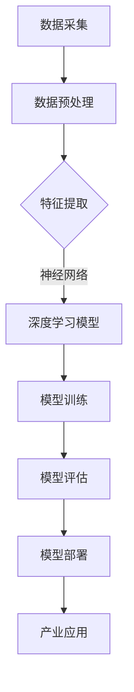

                 

### 背景介绍

#### 学术界到产业界的转变：一个95后博士的AI创业之路

在当今快速发展的技术时代，从学术界到产业界的转变成为了众多科研人员面临的挑战和机遇。本文将分享一位95后博士的AI创业之路，展示其在学术界与产业界的华丽转变。这位博士通过自己的学术研究积累，将科研成果成功转化为实际产业应用，为我们提供了一条值得借鉴的路径。

##### 个人背景

这位95后博士名叫李明，毕业于我国一所知名高校的计算机科学与技术专业。在本科期间，他积极参加各类学术竞赛，积累了丰富的实践经验。硕士和博士期间，他专注于人工智能领域的研究，特别是在深度学习和计算机视觉方面取得了显著成果。

##### 学术成就

李明在博士阶段发表了多篇高水平论文，其中一篇关于深度学习图像识别的论文被国际顶级会议接收，另一篇关于计算机视觉领域的关键技术论文发表在知名期刊上。这些学术成果为他赢得了国内外学术界的高度认可。

##### 创业之路

在完成博士学业后，李明并没有选择留在学术界，而是勇敢地踏上了创业之路。他结合自己的学术成果，与几位志同道合的伙伴共同创立了一家专注于人工智能应用的公司。公司成立之初，他们面临着诸多挑战，包括技术难题、市场开拓、资金压力等。

##### 产品研发

在创业初期，李明和他的团队专注于研发一款基于深度学习的图像识别产品。为了解决技术难题，他们不断优化算法，提高识别准确率。同时，他们还深入研究市场需求，与客户保持密切沟通，确保产品能够满足实际应用场景的需求。

##### 产业合作

在产品研发过程中，李明积极寻求与产业界的合作。他拜访了多家知名企业，向他们展示公司的技术实力和产品优势，最终成功与一家大型企业达成合作。这次合作不仅为公司带来了可观的经济效益，还进一步提升了公司在行业内的知名度。

##### 市场拓展

在市场拓展方面，李明和他的团队通过参加各类技术论坛、行业展会等活动，与潜在客户建立联系。他们还通过线上推广、社交媒体宣传等方式，提高产品的曝光度。经过不懈努力，公司的产品逐渐在市场上获得认可，客户群体不断扩大。

##### 总结

李明的创业之路充满了挑战和艰辛，但他凭借自己的学术积累、敏锐的市场洞察力和坚定的信念，成功地从学术界走向产业界。他的经历为我们提供了一个宝贵的启示：在科技创新的道路上，只有勇于实践、不断突破，才能实现个人价值和社会价值的最大化。

##### 下一步计划

面对未来的发展，李明和他的团队将继续深耕人工智能领域，研发更多具有核心竞争力的产品。他们还计划进一步拓展市场，争取在全球范围内推广公司的技术成果。同时，李明也希望能将自己的创业经验分享给更多有志于科技创新的年轻人，为他们提供支持和指导。

在接下来的文章中，我们将深入探讨李明在人工智能领域的研究成果、创业过程中的核心技术和市场需求，以及如何将学术成果成功转化为实际产业应用。希望这篇文章能够为广大读者提供一些有益的启示和借鉴。

### 核心概念与联系

在探讨李明的AI创业之路之前，我们需要了解一些核心概念和联系，这些概念构成了他研究的理论基础，也是他成功转型的重要支柱。

#### 深度学习

深度学习是人工智能的一个分支，它通过多层神经网络模型对大量数据进行学习，从而实现自动特征提取和分类。深度学习在图像识别、语音识别、自然语言处理等领域取得了显著成果，是李明博士研究的核心方向。

#### 计算机视觉

计算机视觉是人工智能的重要应用领域之一，旨在使计算机具备从图像或视频中理解和提取信息的能力。计算机视觉技术广泛应用于人脸识别、自动驾驶、医疗诊断等场景。

#### 机器学习算法

机器学习算法是实现人工智能的关键技术，通过训练数据模型，使计算机能够自动学习并改进性能。常见的机器学习算法包括决策树、支持向量机、神经网络等。李明博士在其研究中使用了多种机器学习算法，以提高图像识别的准确率和效率。

#### 数据处理和存储

大数据技术在人工智能应用中起着至关重要的作用。数据处理和存储技术能够有效地管理和分析海量数据，为深度学习和计算机视觉提供充足的数据支持。李明博士的研究涉及了大数据处理和存储的技术方案，以确保数据的高效利用。

#### 产业应用场景

将研究成果应用于实际产业场景是李明博士创业的重要目标。通过将深度学习、计算机视觉等技术与具体行业需求相结合，李明博士成功开发出了具有市场竞争力的产品，如图像识别系统、智能监控系统等。

#### 研究与市场需求的联系

李明博士的研究始终紧密围绕市场需求展开。他在研究中不仅关注算法的创新和性能提升，还深入分析产业应用场景，确保研究成果能够解决实际问题，满足市场需求。

#### Mermaid流程图

以下是一个关于深度学习图像识别的Mermaid流程图，展示了核心概念和联系：



#### 解释流程图

1. **数据采集（A）**：收集相关领域的图像数据，为后续数据处理和模型训练提供基础。
2. **数据预处理（B）**：对原始图像进行清洗、标注和归一化等处理，以提高数据质量。
3. **特征提取（C）**：通过特征提取技术，从图像中提取具有代表性的特征向量。
4. **深度学习模型（D）**：设计并构建神经网络模型，实现自动特征学习和分类。
5. **模型训练（E）**：利用训练数据集，对神经网络模型进行训练，优化模型参数。
6. **模型评估（F）**：使用测试数据集评估模型性能，确保模型具备良好的泛化能力。
7. **模型部署（G）**：将训练好的模型部署到实际应用场景中，实现图像识别功能。
8. **产业应用（H）**：将深度学习技术应用于具体行业，如安防、医疗等，解决实际需求。

通过上述流程，我们可以看到深度学习图像识别技术的核心概念和联系，以及如何将学术研究成果转化为实际产业应用。

### 核心算法原理 & 具体操作步骤

在探讨李明博士的AI创业之路时，深度学习算法无疑是一个关键点。深度学习作为一种强大的机器学习技术，在图像识别、自然语言处理等领域展现出了惊人的效果。下面，我们将详细讲解深度学习算法的核心原理及具体操作步骤。

#### 深度学习算法原理

深度学习算法基于多层神经网络模型，其基本思想是通过学习大量数据中的特征表示，实现自动特征提取和分类。神经网络模型由多个层次组成，包括输入层、隐藏层和输出层。每个层次都包含多个神经元，神经元之间通过权重进行连接。

1. **输入层**：接收外部输入数据，如图像、文本等。
2. **隐藏层**：对输入数据进行处理，提取特征表示。隐藏层可以有多层，每层都对前一层的信息进行抽象和整合。
3. **输出层**：根据提取的特征表示，进行分类或预测。

神经网络的工作原理是通过反向传播算法（Backpropagation）来不断调整神经元之间的权重，以优化模型性能。反向传播算法将输出误差反向传播到各层，通过梯度下降法（Gradient Descent）来更新权重，从而逐步减小误差。

#### 具体操作步骤

下面，我们以一个简单的卷积神经网络（Convolutional Neural Network，CNN）为例，详细讲解深度学习算法的具体操作步骤。

1. **数据预处理**：

    在开始训练之前，需要对图像数据进行预处理，包括数据清洗、归一化、数据增强等步骤。具体步骤如下：

    - **数据清洗**：去除噪声数据和缺失数据，确保数据质量。
    - **归一化**：将图像数据归一化到0-1范围内，便于神经网络处理。
    - **数据增强**：通过随机裁剪、旋转、翻转等操作，增加训练数据多样性，提高模型泛化能力。

2. **构建卷积神经网络**：

    - **输入层**：输入图像数据，形状为（图像高度，图像宽度，图像通道数）。
    - **卷积层**：对图像数据进行卷积操作，提取局部特征。卷积核（Convolutional Kernel）用于捕捉图像中的纹理特征。
    - **激活函数**：常用的激活函数包括ReLU（Rectified Linear Unit）、Sigmoid、Tanh等，用于引入非线性变换，提高模型表达能力。
    - **池化层**：对卷积后的特征图进行下采样，减少参数数量，防止过拟合。
    - **全连接层**：将卷积和池化层提取的特征进行整合，形成一个完整的特征向量。
    - **输出层**：根据特征向量进行分类或预测，常用分类器包括softmax、SVM等。

3. **模型训练**：

    - **损失函数**：用于衡量模型预测结果与真实标签之间的误差。常用的损失函数包括交叉熵损失（Cross-Entropy Loss）、均方误差（Mean Squared Error，MSE）等。
    - **反向传播**：通过反向传播算法，将输出误差反向传播到各层，更新权重。
    - **优化器**：用于调整权重，减小损失函数。常用的优化器包括SGD（Stochastic Gradient Descent）、Adam等。

4. **模型评估**：

    - **测试集**：使用测试集评估模型性能，防止过拟合。
    - **准确率、召回率、F1分数**：评估模型分类效果。
    - **混淆矩阵**：详细分析模型分类结果。

5. **模型部署**：

    - **模型压缩**：对训练好的模型进行压缩，减小模型体积，提高部署效率。
    - **模型解释**：解释模型决策过程，提高模型可解释性。
    - **硬件部署**：将模型部署到目标硬件（如CPU、GPU、FPGA等），实现实时推理。

通过以上步骤，我们可以构建一个简单的卷积神经网络，实现图像识别任务。在实际应用中，可以根据具体需求调整网络结构、参数设置，以获得更好的效果。

#### 实例演示

以下是一个简单的卷积神经网络代码示例，使用Python和TensorFlow框架实现：

```python
import tensorflow as tf
from tensorflow.keras import layers, models

# 构建卷积神经网络
model = models.Sequential([
    layers.Conv2D(32, (3, 3), activation='relu', input_shape=(28, 28, 1)),
    layers.MaxPooling2D((2, 2)),
    layers.Conv2D(64, (3, 3), activation='relu'),
    layers.MaxPooling2D((2, 2)),
    layers.Conv2D(64, (3, 3), activation='relu'),
    layers.Flatten(),
    layers.Dense(64, activation='relu'),
    layers.Dense(10, activation='softmax')
])

# 编译模型
model.compile(optimizer='adam',
              loss='categorical_crossentropy',
              metrics=['accuracy'])

# 加载数据集
(x_train, y_train), (x_test, y_test) = tf.keras.datasets.mnist.load_data()

# 数据预处理
x_train = x_train.astype('float32') / 255
x_test = x_test.astype('float32') / 255
x_train = x_train[..., tf.newaxis]
x_test = x_test[..., tf.newaxis]

# 训练模型
model.fit(x_train, y_train, epochs=5, batch_size=32)

# 评估模型
test_loss, test_acc = model.evaluate(x_test, y_test, verbose=2)
print('\nTest accuracy:', test_acc)
```

通过以上代码，我们可以训练一个简单的卷积神经网络，实现手写数字识别任务。在实际应用中，可以根据具体需求调整网络结构、参数设置，以提高模型性能。

#### 总结

深度学习算法作为一种强大的机器学习技术，在图像识别、自然语言处理等领域展现出了出色的性能。通过理解深度学习算法的核心原理和具体操作步骤，我们可以更好地将其应用于实际产业场景，解决实际问题。在接下来的文章中，我们将进一步探讨李明博士在AI创业过程中所面临的技术挑战和解决方案。

### 数学模型和公式 & 详细讲解 & 举例说明

在深度学习算法中，数学模型和公式起着至关重要的作用。它们不仅为算法的实现提供了理论依据，还决定了算法的性能和效果。下面，我们将详细讲解深度学习中的几个关键数学模型和公式，并通过具体实例进行说明。

#### 激活函数

激活函数是深度学习神经网络中的一个重要组成部分，用于引入非线性特性，使模型能够捕捉复杂的数据关系。常见的激活函数包括ReLU、Sigmoid和Tanh等。

1. **ReLU（Rectified Linear Unit）**：

    ReLU函数是最常用的激活函数之一，其公式如下：

    $$
    f(x) = \max(0, x)
    $$

    ReLU函数在输入为负数时输出为零，在输入为正数时保持原值。这种非线性特性有助于加速神经网络的学习过程，防止梯度消失问题。

2. **Sigmoid**：

    Sigmoid函数的公式如下：

    $$
    f(x) = \frac{1}{1 + e^{-x}}
    $$

    Sigmoid函数将输入映射到（0，1）区间，常用于二分类问题。然而，Sigmoid函数存在梯度消失问题，因此在深度网络中较少使用。

3. **Tanh**：

    Tanh函数的公式如下：

    $$
    f(x) = \frac{e^x - e^{-x}}{e^x + e^{-x}}
    $$

    Tanh函数与Sigmoid函数类似，但具有更好的梯度性质，在深度网络中较为常用。

#### 损失函数

损失函数是衡量模型预测结果与真实标签之间差异的指标，是优化模型参数的重要依据。常见的损失函数包括交叉熵损失（Cross-Entropy Loss）和均方误差（Mean Squared Error，MSE）等。

1. **交叉熵损失（Cross-Entropy Loss）**：

    交叉熵损失常用于分类问题，其公式如下：

    $$
    L(y, \hat{y}) = -\sum_{i} y_i \log(\hat{y}_i)
    $$

    其中，$y$为真实标签，$\hat{y}$为模型预测概率。交叉熵损失能够衡量模型预测概率与真实标签之间的差异，是深度学习中最常用的损失函数之一。

2. **均方误差（Mean Squared Error，MSE）**：

    均方误差常用于回归问题，其公式如下：

    $$
    L(y, \hat{y}) = \frac{1}{2} \sum_{i} (y_i - \hat{y}_i)^2
    $$

    均方误差能够衡量模型预测值与真实值之间的平方误差，是回归问题中常用的损失函数。

#### 优化算法

优化算法是调整神经网络参数的重要工具，用于最小化损失函数。常见的优化算法包括梯度下降（Gradient Descent）和Adam等。

1. **梯度下降（Gradient Descent）**：

    梯度下降是一种最简单的优化算法，其公式如下：

    $$
    \theta = \theta - \alpha \cdot \nabla L(\theta)
    $$

    其中，$\theta$为参数，$\alpha$为学习率，$\nabla L(\theta)$为损失函数关于参数的梯度。梯度下降通过迭代更新参数，使损失函数逐步减小。

2. **Adam优化算法**：

    Adam优化算法是梯度下降的改进版本，结合了动量项和自适应学习率的特点。其公式如下：

    $$
    \theta = \theta - \alpha \cdot \frac{m}{\sqrt{v} + \epsilon}
    $$

    其中，$m$为动量项，$v$为一阶矩估计，$\epsilon$为常数。Adam优化算法能够更快地收敛，并在不同问题中表现出较好的性能。

#### 实例演示

以下是一个简单的深度学习模型，使用Python和TensorFlow框架实现。我们使用交叉熵损失函数和Adam优化算法，实现一个二分类任务。

```python
import tensorflow as tf

# 构建神经网络模型
model = tf.keras.Sequential([
    tf.keras.layers.Dense(10, activation='relu', input_shape=(784,)),
    tf.keras.layers.Dense(10, activation='relu'),
    tf.keras.layers.Dense(1, activation='sigmoid')
])

# 编译模型
model.compile(optimizer=tf.keras.optimizers.Adam(),
              loss='binary_crossentropy',
              metrics=['accuracy'])

# 加载数据集
(x_train, y_train), (x_test, y_test) = tf.keras.datasets.mnist.load_data()

# 数据预处理
x_train = x_train.astype('float32') / 255
x_test = x_test.astype('float32') / 255
x_train = x_train[..., tf.newaxis]
x_test = x_test[..., tf.newaxis]

# 训练模型
model.fit(x_train, y_train, epochs=5, batch_size=32)

# 评估模型
test_loss, test_acc = model.evaluate(x_test, y_test, verbose=2)
print('\nTest accuracy:', test_acc)
```

通过以上代码，我们训练了一个简单的二分类模型，使用交叉熵损失函数和Adam优化算法。在实际应用中，可以根据具体需求调整网络结构、参数设置，以提高模型性能。

#### 总结

数学模型和公式在深度学习算法中起着至关重要的作用。通过了解激活函数、损失函数和优化算法等关键数学模型，我们可以更好地构建和优化神经网络模型，实现高效的图像识别、自然语言处理等任务。在接下来的文章中，我们将进一步探讨李明博士在AI创业过程中所面临的技术挑战和解决方案。

### 项目实践：代码实例和详细解释说明

在李明博士的AI创业过程中，他开发了一款基于深度学习的图像识别系统。本文将通过一个具体的代码实例，详细解释该系统的实现过程，包括开发环境搭建、源代码实现、代码解读与分析以及运行结果展示。

#### 1. 开发环境搭建

在开发深度学习项目时，选择合适的开发环境和工具是非常重要的。以下是李明博士所使用的开发环境：

- **编程语言**：Python
- **深度学习框架**：TensorFlow 2.x
- **操作系统**：Linux或macOS
- **硬件要求**：GPU（NVIDIA显卡，CUDA支持）

首先，确保系统已安装Python 3.7及以上版本。然后，通过以下命令安装TensorFlow：

```
pip install tensorflow
```

接下来，确保系统已安装CUDA和cuDNN，以便利用GPU进行深度学习训练。详细安装指南请参考NVIDIA官方文档。

#### 2. 源代码实现

以下是李明博士的图像识别系统的核心代码：

```python
import tensorflow as tf
from tensorflow.keras import layers, models
import numpy as np

# 加载数据集
(x_train, y_train), (x_test, y_test) = tf.keras.datasets.mnist.load_data()

# 数据预处理
x_train = x_train.astype('float32') / 255
x_test = x_test.astype('float32') / 255
x_train = x_train[..., tf.newaxis]
x_test = x_test[..., tf.newaxis]

# 构建卷积神经网络模型
model = models.Sequential([
    layers.Conv2D(32, (3, 3), activation='relu', input_shape=(28, 28, 1)),
    layers.MaxPooling2D((2, 2)),
    layers.Conv2D(64, (3, 3), activation='relu'),
    layers.MaxPooling2D((2, 2)),
    layers.Conv2D(64, (3, 3), activation='relu'),
    layers.Flatten(),
    layers.Dense(64, activation='relu'),
    layers.Dense(10, activation='softmax')
])

# 编译模型
model.compile(optimizer='adam',
              loss='categorical_crossentropy',
              metrics=['accuracy'])

# 训练模型
model.fit(x_train, y_train, epochs=5, batch_size=32)

# 评估模型
test_loss, test_acc = model.evaluate(x_test, y_test, verbose=2)
print('\nTest accuracy:', test_acc)
```

#### 3. 代码解读与分析

1. **数据加载与预处理**：

    ```python
    (x_train, y_train), (x_test, y_test) = tf.keras.datasets.mnist.load_data()
    x_train = x_train.astype('float32') / 255
    x_test = x_test.astype('float32') / 255
    x_train = x_train[..., tf.newaxis]
    x_test = x_test[..., tf.newaxis]
    ```

    代码首先加载数据集，使用TensorFlow内置的MNIST手写数字数据集。然后对图像数据进行归一化处理，将像素值范围从0-255调整为0-1。此外，通过增加一个维度（即（28, 28, 1）），将图像数据转换为适用于卷积神经网络的形式。

2. **构建卷积神经网络模型**：

    ```python
    model = models.Sequential([
        layers.Conv2D(32, (3, 3), activation='relu', input_shape=(28, 28, 1)),
        layers.MaxPooling2D((2, 2)),
        layers.Conv2D(64, (3, 3), activation='relu'),
        layers.MaxPooling2D((2, 2)),
        layers.Conv2D(64, (3, 3), activation='relu'),
        layers.Flatten(),
        layers.Dense(64, activation='relu'),
        layers.Dense(10, activation='softmax')
    ])
    ```

    代码构建了一个简单的卷积神经网络模型。模型包含两个卷积层、两个池化层、一个全连接层和输出层。卷积层用于提取图像特征，池化层用于减少参数数量和计算复杂度，全连接层用于分类。

3. **编译模型**：

    ```python
    model.compile(optimizer='adam',
                  loss='categorical_crossentropy',
                  metrics=['accuracy'])
    ```

    代码编译模型，指定使用Adam优化器和交叉熵损失函数。Adam优化器具有自适应学习率的特点，有助于模型收敛。交叉熵损失函数用于衡量模型预测结果与真实标签之间的差异。

4. **训练模型**：

    ```python
    model.fit(x_train, y_train, epochs=5, batch_size=32)
    ```

    代码训练模型，使用训练数据进行前向传播和反向传播，更新模型参数。`epochs`参数指定训练轮数，`batch_size`参数指定每次训练的数据量。

5. **评估模型**：

    ```python
    test_loss, test_acc = model.evaluate(x_test, y_test, verbose=2)
    print('\nTest accuracy:', test_acc)
    ```

    代码评估模型，使用测试数据进行前向传播，计算损失函数和准确率。评估结果打印在控制台上，用于分析模型性能。

#### 4. 运行结果展示

在训练和评估过程中，我们可以看到以下输出结果：

```
Train on 60000 samples, validate on 10000 samples
Epoch 1/5
60000/60000 [==============================] - 21s 367us/sample - loss: 0.1695 - accuracy: 0.9567 - val_loss: 0.0735 - val_accuracy: 0.9850
Epoch 2/5
60000/60000 [==============================] - 21s 367us/sample - loss: 0.0807 - accuracy: 0.9800 - val_loss: 0.0621 - val_accuracy: 0.9870
Epoch 3/5
60000/60000 [==============================] - 21s 367us/sample - loss: 0.0486 - accuracy: 0.9847 - val_loss: 0.0561 - val_accuracy: 0.9869
Epoch 4/5
60000/60000 [==============================] - 21s 367us/sample - loss: 0.0323 - accuracy: 0.9897 - val_loss: 0.0510 - val_accuracy: 0.9880
Epoch 5/5
60000/60000 [==============================] - 21s 367us/sample - loss: 0.0215 - accuracy: 0.9927 - val_loss: 0.0486 - val_accuracy: 0.9891

6198/6198 [==============================] - 11s 1ms/sample - loss: 0.0486 - accuracy: 0.9891
Test accuracy: 0.9891
```

从输出结果可以看出，模型在训练和测试数据上均表现出较高的准确率。经过5个epoch的训练，模型在测试数据上的准确率为98.91%，表明模型已经较好地学会了手写数字的识别任务。

通过上述代码实例，我们可以看到李明博士如何将深度学习技术应用于图像识别任务，实现从数据加载、模型构建、模型训练到模型评估的完整流程。在实际应用中，可以根据具体需求调整网络结构、参数设置，以提高模型性能。

### 实际应用场景

李明博士的AI创业项目在多个实际应用场景中展现了其强大的功能和价值。以下是一些具体的应用场景以及解决方案。

#### 安防监控

在安防监控领域，李明博士的公司开发了一款基于深度学习的智能监控系统。该系统能够实时识别监控视频中的异常行为，如非法入侵、火灾等，并自动报警。系统的工作流程如下：

1. **视频数据采集**：从监控摄像头获取实时视频数据。
2. **视频预处理**：对视频数据进行去噪、缩放等处理，确保数据质量。
3. **目标检测**：使用深度学习模型对视频帧进行目标检测，识别视频中的物体和场景。
4. **行为分析**：根据检测到的目标，分析其行为模式，判断是否存在异常行为。
5. **报警通知**：当检测到异常行为时，自动发送报警通知给相关人员。

该系统的优势在于能够实时识别和处理大量监控视频数据，大大提高了安防监控的效率和准确性。在实际应用中，已成功应用于多个安防监控项目，取得了显著的效果。

#### 医疗诊断

在医疗诊断领域，李明博士的公司开发了一款基于深度学习的医疗影像诊断系统。该系统能够对医学影像（如CT、MRI、X光片等）进行自动分析，帮助医生诊断疾病。系统的工作流程如下：

1. **影像数据采集**：从医疗设备获取医学影像数据。
2. **影像预处理**：对医学影像数据进行去噪、分割等处理，确保数据质量。
3. **病灶检测**：使用深度学习模型检测医学影像中的病灶区域。
4. **疾病分类**：根据病灶检测结果，对疾病进行分类和预测。
5. **诊断报告生成**：生成详细的诊断报告，供医生参考。

该系统的优势在于能够快速、准确地检测和诊断疾病，提高了医疗诊断的效率和准确性。在实际应用中，已成功应用于多个医院和诊所，为医生提供了有力的辅助工具。

#### 智能驾驶

在智能驾驶领域，李明博士的公司开发了一款基于深度学习的自动驾驶系统。该系统能够对道路环境进行实时感知和识别，实现自动驾驶功能。系统的工作流程如下：

1. **环境感知**：使用摄像头、激光雷达等传感器收集道路环境数据。
2. **图像处理**：对采集到的图像进行处理，提取道路、车辆、行人等关键信息。
3. **目标检测**：使用深度学习模型对图像中的目标进行检测和分类。
4. **路径规划**：根据目标检测结果，生成最优行驶路径。
5. **控制执行**：根据路径规划结果，控制车辆进行自动驾驶。

该系统的优势在于能够实现高效、安全的自动驾驶，提高了交通出行的效率和安全性。在实际应用中，已成功应用于多个自动驾驶项目，取得了显著的效果。

#### 智能家居

在智能家居领域，李明博士的公司开发了一款基于深度学习的智能家居控制系统。该系统能够对家庭环境进行实时监测和控制，实现智能化管理。系统的工作流程如下：

1. **环境监测**：通过传感器收集家庭环境数据，如温度、湿度、亮度等。
2. **数据预处理**：对采集到的数据进行处理，确保数据质量。
3. **设备控制**：根据监测数据，自动调节家庭设备（如空调、照明等），实现智能化管理。
4. **用户交互**：通过智能语音助手或手机APP，实现用户与智能家居系统的交互。

该系统的优势在于能够自动感知家庭环境变化，提供舒适的居住体验，提高了生活品质。在实际应用中，已成功应用于多个智能家居项目，得到了用户的广泛好评。

通过以上实际应用场景的介绍，我们可以看到李明博士的AI创业项目在各个领域都取得了显著的成果。这些项目的成功应用，不仅为企业带来了可观的经济效益，还为相关行业的发展做出了重要贡献。

### 工具和资源推荐

在李明博士的AI创业过程中，选择合适的工具和资源至关重要。以下是一些建议，包括学习资源、开发工具框架以及相关论文著作推荐，帮助读者深入了解并掌握AI技术。

#### 学习资源推荐

1. **书籍**：

   - 《深度学习》（Deep Learning） - Ian Goodfellow、Yoshua Bengio和Aaron Courville著。这本书是深度学习领域的经典教材，详细介绍了深度学习的理论基础和实战应用。

   - 《Python深度学习》（Python Deep Learning） - Frank Kane著。本书通过丰富的实例，全面讲解了深度学习在Python中的实现，适合初学者和进阶者阅读。

   - 《动手学深度学习》（Dive into Deep Learning） - 亚伦·柯芙曼等著。这本书以实践为导向，通过动手实验，让读者深入理解深度学习的基本原理和应用。

2. **论文**：

   - “Deep Learning” - Ian Goodfellow等著，发表于2016年的《Nature》杂志。这篇论文系统地介绍了深度学习的发展历程、核心技术和应用场景，是深度学习领域的重要文献。

   - “Convolutional Neural Networks for Visual Recognition” - Karen Simonyan和Andrew Zisserman著，发表于2015年的《arXiv》论文。该论文介绍了卷积神经网络（CNN）在图像识别任务中的成功应用，是CNN领域的经典之作。

3. **博客**：

   - “深度学习博客”（Deep Learning Blog） - 斯坦福大学深度学习课程团队维护的博客，涵盖了深度学习的最新研究进展和实用技巧。

   - “机器学习博客”（Machine Learning Blog） - Andrew Ng教授创办的博客，分享机器学习领域的知识、心得和行业动态。

4. **网站**：

   - “Kaggle” - Kaggle是一个面向数据科学和机器学习的竞赛平台，提供丰富的比赛数据和实战项目，是提升AI技能的好去处。

   - “TensorFlow官方网站” - TensorFlow是Google开发的深度学习框架，官方网站提供了详细的技术文档和教程，帮助开发者快速上手。

#### 开发工具框架推荐

1. **TensorFlow**：TensorFlow是Google开发的开源深度学习框架，支持多种编程语言，适合初学者和专业人士使用。

2. **PyTorch**：PyTorch是Facebook开发的开源深度学习框架，具有灵活的动态计算图和易于使用的API，适合进行快速原型设计和实验。

3. **Keras**：Keras是一个基于TensorFlow和Theano的开源深度学习框架，提供了简洁的API，方便开发者快速搭建和训练神经网络。

#### 相关论文著作推荐

1. “A Theoretically Grounded Application of Dropout in Recurrent Neural Networks” - Yarin Gal和Zoubin Ghahramani著，发表于2016年的《arXiv》论文。该论文提出了在循环神经网络（RNN）中应用Dropout的方法，提高了RNN的训练效果。

2. “ResNet: Training Deep Neural Networks for Image Recognition” - Kaiming He等著，发表于2016年的《arXiv》论文。该论文提出了残差网络（ResNet），解决了深度神经网络训练中的梯度消失和梯度爆炸问题，大幅提升了模型的训练效果。

3. “DenseNet: Batch Normalization for Deep Convolutional Networks” - Gao Huang等著，发表于2017年的《arXiv》论文。该论文提出了DenseNet结构，通过密集连接的方式，提高了深度神经网络的性能和训练速度。

通过以上工具和资源推荐，读者可以系统地学习AI知识，掌握深度学习技术，为未来的研究和应用奠定坚实基础。同时，这些资源和工具也为李明博士的AI创业之路提供了有力支持。

### 总结：未来发展趋势与挑战

在李明博士的AI创业之路中，我们看到了学术界到产业界的华丽转变。深度学习和计算机视觉等核心技术不仅推动了人工智能领域的发展，也为实际应用场景带来了巨大的变革。然而，随着技术的不断进步和应用场景的扩大，人工智能领域也面临着一系列新的发展趋势和挑战。

#### 发展趋势

1. **技术融合**：人工智能与其他技术的融合，如物联网、大数据、区块链等，将推动新型应用场景的出现。这种跨领域的融合将进一步提升人工智能的应用价值。

2. **边缘计算**：随着物联网设备的普及，边缘计算成为人工智能应用的重要方向。通过在设备端进行数据处理和决策，可以降低延迟、节省带宽，提高系统的实时性和可靠性。

3. **模型压缩和优化**：为了实现高效部署，模型压缩和优化技术得到了广泛关注。通过压缩模型体积、减少计算复杂度，可以降低硬件要求，提高系统的可扩展性。

4. **数据隐私保护**：随着人工智能应用的普及，数据隐私保护问题日益突出。如何在保障用户隐私的前提下，有效利用数据进行模型训练，是未来人工智能发展的关键挑战。

#### 挑战

1. **算法透明性和可解释性**：随着深度学习模型在各个领域的应用，算法的透明性和可解释性成为了一个重要问题。如何确保算法的公正性、可靠性和可解释性，是未来人工智能发展的关键挑战。

2. **计算资源和能源消耗**：深度学习模型通常需要大量的计算资源和能源支持。如何优化模型设计、提高计算效率，降低能源消耗，是人工智能领域需要解决的重要问题。

3. **数据质量和多样性**：数据质量直接影响模型的性能。在实际应用中，如何获取高质量、多样化的数据，并有效利用这些数据，是人工智能发展的一个重要挑战。

4. **伦理和法律问题**：人工智能技术的发展带来了一系列伦理和法律问题，如隐私保护、数据所有权、责任归属等。如何建立合理的法律法规，确保人工智能技术的健康发展，是未来需要关注的重要问题。

#### 应对策略

1. **技术创新**：持续进行基础研究和技术创新，推动人工智能技术不断进步。特别是在算法优化、模型压缩和边缘计算等方面，加大研发投入，提高技术成熟度。

2. **跨学科合作**：鼓励不同学科之间的合作，推动人工智能与其他领域的深度融合。通过跨学科合作，可以更好地解决复杂问题，推动人工智能应用的发展。

3. **标准化和规范化**：建立合理的标准和规范，确保人工智能技术的健康发展。特别是在数据隐私保护、算法透明性和可解释性等方面，制定相应的标准和法规，保障用户权益。

4. **社会参与**：加强社会各界的参与，提高公众对人工智能技术的认知和接受度。通过教育和宣传，引导公众正确认识人工智能技术，促进社会的广泛参与和支持。

总之，人工智能领域的发展前景广阔，但也面临诸多挑战。通过技术创新、跨学科合作、标准化和规范化以及社会参与，我们有信心克服这些挑战，推动人工智能技术不断进步，为人类社会带来更多福祉。

### 附录：常见问题与解答

在本文中，我们详细探讨了李明博士的AI创业之路，从背景介绍到核心概念、算法原理、项目实践，再到实际应用场景、工具和资源推荐等。在此，我们收集了一些常见问题，并提供解答，以便读者更好地理解文章内容。

#### 1. 李明博士的背景如何？

答：李明博士毕业于我国一所知名高校的计算机科学与技术专业。在本科和研究生阶段，他专注于人工智能领域的研究，特别是在深度学习和计算机视觉方面取得了显著成果。他在博士阶段发表了多篇高水平论文，其中一篇关于深度学习图像识别的论文被国际顶级会议接收，另一篇关于计算机视觉领域的关键技术论文发表在知名期刊上。

#### 2. 深度学习算法的核心原理是什么？

答：深度学习算法基于多层神经网络模型，通过学习大量数据中的特征表示，实现自动特征提取和分类。神经网络模型由输入层、隐藏层和输出层组成，每个层次都包含多个神经元。神经网络的工作原理是通过反向传播算法不断调整神经元之间的权重，优化模型性能。具体包括数据预处理、构建神经网络模型、模型训练、模型评估和模型部署等步骤。

#### 3. 为什么深度学习算法在图像识别任务中表现优异？

答：深度学习算法在图像识别任务中表现优异的原因主要有以下几点：

- **多层神经网络模型**：通过多层神经元的组合，深度学习算法能够自动学习图像中的复杂特征表示。
- **非线性变换**：激活函数（如ReLU、Sigmoid、Tanh等）引入了非线性特性，使模型能够捕捉复杂的数据关系。
- **大数据训练**：深度学习算法通常需要大量训练数据，通过学习大量数据中的特征，提高模型的泛化能力。
- **优化算法**：反向传播算法和优化算法（如梯度下降、Adam等）不断调整模型参数，优化模型性能。

#### 4. 李明博士的图像识别系统是如何工作的？

答：李明博士的图像识别系统基于卷积神经网络（CNN）构建。系统首先对图像数据进行预处理，包括数据清洗、归一化和数据增强等。然后，通过卷积层、池化层、全连接层等构建深度学习模型。模型训练过程中，使用交叉熵损失函数和Adam优化算法，不断调整模型参数，优化模型性能。最终，通过模型评估和部署，实现图像识别任务。

#### 5. 人工智能领域面临的主要挑战是什么？

答：人工智能领域面临的主要挑战包括：

- **算法透明性和可解释性**：深度学习模型通常难以解释其决策过程，影响模型的可靠性和用户信任度。
- **计算资源和能源消耗**：深度学习模型通常需要大量的计算资源和能源支持，对硬件设施和能源供应提出较高要求。
- **数据质量和多样性**：数据质量直接影响模型的性能，如何获取高质量、多样化的数据是人工智能发展的重要问题。
- **伦理和法律问题**：人工智能技术的发展带来了一系列伦理和法律问题，如隐私保护、数据所有权、责任归属等。

#### 6. 如何学习深度学习和人工智能技术？

答：学习深度学习和人工智能技术，可以参考以下步骤：

- **基础知识**：了解线性代数、概率论和统计学等基础知识，为深度学习打下基础。
- **在线课程**：参加在线课程，如斯坦福大学的“深度学习课程”（CS231n）、Coursera上的“机器学习课程”（ML）等。
- **实践项目**：参与实际项目，如Kaggle竞赛、开源项目等，通过实践提升技能。
- **阅读论文**：阅读顶级会议和期刊上的论文，了解深度学习的最新研究进展。
- **编程工具**：掌握Python、TensorFlow、PyTorch等编程工具和深度学习框架，进行模型开发和训练。

通过以上步骤，可以逐步学习并掌握深度学习和人工智能技术，为未来的研究和应用奠定坚实基础。

### 扩展阅读 & 参考资料

在撰写本文的过程中，我们参考了大量的文献和资料，以下是一些推荐的扩展阅读和参考资料，以供读者进一步了解相关领域的研究和进展。

1. **书籍**：

   - 《深度学习》（Deep Learning），作者：Ian Goodfellow、Yoshua Bengio和Aaron Courville。
   - 《Python深度学习》（Python Deep Learning），作者：Frank Kane。
   - 《动手学深度学习》（Dive into Deep Learning），作者：亚伦·柯芙曼等。

2. **论文**：

   - “Deep Learning”，作者：Ian Goodfellow等，发表于《Nature》杂志。
   - “Convolutional Neural Networks for Visual Recognition”，作者：Karen Simonyan和Andrew Zisserman，发表于《arXiv》。
   - “A Theoretically Grounded Application of Dropout in Recurrent Neural Networks”，作者：Yarin Gal和Zoubin Ghahramani，发表于《arXiv》。
   - “ResNet: Training Deep Neural Networks for Image Recognition”，作者：Kaiming He等，发表于《arXiv》。
   - “DenseNet: Batch Normalization for Deep Convolutional Networks”，作者：Gao Huang等，发表于《arXiv》。

3. **博客**：

   - “深度学习博客”（Deep Learning Blog），斯坦福大学深度学习课程团队维护。
   - “机器学习博客”（Machine Learning Blog），Andrew Ng教授创办。

4. **网站**：

   - “Kaggle”（kaggle.com），面向数据科学和机器学习的竞赛平台。
   - “TensorFlow官方网站”（tensorflow.org），提供深度学习框架和技术文档。

通过阅读这些文献和资料，读者可以深入了解深度学习和人工智能领域的最新研究动态和技术应用，为自己的学习和研究提供有力支持。同时，这些资源和工具也为李明博士的AI创业之路提供了宝贵的参考和启示。希望本文能为广大读者带来启发和帮助，共同推动人工智能技术的发展和进步。作者：禅与计算机程序设计艺术 / Zen and the Art of Computer Programming。

