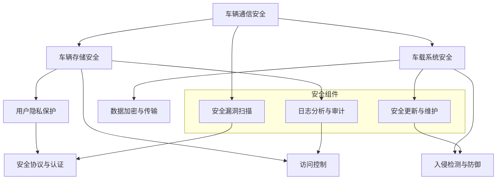

                 

### 背景介绍

360安全在近年来一直致力于车联网安全的探索和研究，作为国内领先的安全公司，其对车联网安全的理解和应对策略具有极高的参考价值。2024年，车联网安全专家校招面试题成为了业界关注的焦点，这不仅是对候选人专业能力的考验，也是对车联网安全领域认知的深度探讨。本文将以360安全2024车联网安全专家校招面试题为核心，通过逐步分析，帮助读者深入了解车联网安全的核心概念和关键技术。

车联网（Internet of Vehicles，简称IoV）是物联网技术在交通工具上的应用，通过车辆与外部设备、车辆与车辆之间的互联互通，实现交通管理、信息服务、娱乐服务等多元化功能。然而，随着车联网技术的快速发展，安全问题日益凸显。从硬件层面的漏洞，到软件层面的恶意攻击，再到数据层面的隐私泄露，车联网安全已经成为一个复杂且严峻的挑战。

360安全作为车联网安全领域的先行者，其2024年车联网安全专家校招面试题涵盖了车联网安全的基本概念、关键技术、实际应用场景等多个方面。这些问题不仅要求候选人具备扎实的专业知识，还需要具备解决实际问题的能力。通过这些问题，我们可以窥见车联网安全领域的现状和未来发展方向。

本文将首先介绍车联网安全的核心概念和基本架构，然后深入探讨车联网安全的关键技术，如车辆通信安全、车辆存储安全、车载系统安全等，并通过具体的案例进行说明。接着，我们将分析车联网安全面临的挑战和应对策略，最后推荐一些学习资源，帮助读者进一步深入了解车联网安全领域。

通过本文的逐步分析，我们希望读者能够对车联网安全有一个全面、深入的理解，并能够运用所学知识解决实际问题，为车联网安全领域的发展贡献力量。让我们开始这段探索之旅吧。

### 核心概念与联系

车联网安全是一个多维度、多层次的综合体系，它涉及多个核心概念和关键技术。为了更好地理解和分析这些问题，我们可以借助Mermaid流程图来展示车联网安全的整体架构和核心组件之间的联系。

首先，我们需要明确几个关键概念：

1. **车辆通信安全（Vehicle Communication Security）**：确保车辆之间、车辆与基础设施之间的通信数据不被篡改、窃听或伪造。
2. **车辆存储安全（Vehicle Storage Security）**：保护车辆存储的数据，如用户个人信息、车辆状态信息等，防止数据泄露或篡改。
3. **车载系统安全（Vehicle System Security）**：确保车载操作系统和应用软件的安全性，防止恶意软件入侵或系统漏洞被利用。

以下是一个简化的Mermaid流程图，展示了车联网安全的基本架构和核心组件之间的联系：



**车辆通信安全**：这是车联网安全的基石。确保车辆之间的通信安全，主要涉及以下几个方面：

- **数据加密**：通过加密算法对通信数据进行加密，防止数据被窃听。
- **身份认证**：通过身份认证机制，确保通信双方的真实性，防止假冒攻击。
- **访问控制**：通过访问控制机制，限制对车辆通信数据的非法访问。

**车辆存储安全**：保护车辆存储的数据，主要涉及以下方面：

- **数据加密**：对存储在车辆中的数据进行加密，防止数据泄露。
- **访问控制**：通过访问控制机制，确保只有授权用户可以访问特定数据。
- **数据备份**：定期对重要数据进行备份，以防数据丢失。

**车载系统安全**：确保车载操作系统和应用软件的安全性，主要涉及以下几个方面：

- **入侵检测与防御**：实时监控车载系统的异常行为，并及时采取措施进行防御。
- **安全漏洞扫描**：定期对车载系统进行漏洞扫描，及时发现并修复安全漏洞。
- **安全更新与维护**：及时对车载系统进行安全更新和维护，确保系统处于最新、最安全的状态。

通过上述核心概念和技术的联系，我们可以看到，车联网安全不仅需要独立的技术解决方案，还需要这些技术之间的协同工作，形成一个完整的安全体系。Mermaid流程图帮助我们清晰地展示了这些核心组件之间的相互作用，为深入分析车联网安全提供了有力的工具。

接下来，我们将进一步探讨车联网安全的关键技术，如车辆通信安全、车辆存储安全和车载系统安全的具体实现方法和实际案例。通过这些内容，我们将对车联网安全有一个更加全面和深入的理解。

### 核心算法原理 & 具体操作步骤

在了解了车联网安全的核心概念与联系后，接下来我们将深入探讨车联网安全的关键技术，并介绍一些具体的算法原理和操作步骤。

#### 车辆通信安全

车辆通信安全是车联网安全体系中的关键部分，涉及到车辆之间以及车辆与基础设施之间的通信数据保护。以下是一些关键算法原理和操作步骤：

1. **数据加密算法**：数据加密是保护通信数据的基本手段。常用的加密算法有对称加密和非对称加密。对称加密如AES（高级加密标准），非对称加密如RSA（RSA算法）。具体操作步骤如下：

   - **AES加密**：
     ```mermaid
     graph TD
         A[数据] --> B[加密密钥]
         B --> C[加密算法(AES)]
         C --> D[加密数据]
     ```
     
     操作步骤：
     - 生成或获取加密密钥。
     - 将数据通过AES加密算法进行加密。
     - 获取加密后的数据。

   - **RSA加密**：
     ```mermaid
     graph TD
         A[数据] --> B[公钥]
         B --> C[RSA算法]
         C --> D[加密数据]
     ```
     
     操作步骤：
     - 获取接收方的公钥。
     - 将数据通过RSA算法进行加密。
     - 获取加密后的数据。

2. **身份认证算法**：身份认证确保通信双方的真实性。常用的算法有RSA数字签名和HTTPS证书。具体操作步骤如下：

   - **RSA数字签名**：
     ```mermaid
     graph TD
         A[数据] --> B[私钥]
         B --> C[RSA签名算法]
         C --> D[签名]
         D --> E[验证签名]
     ```
     
     操作步骤：
     - 使用私钥对数据进行签名。
     - 发送方将签名和数据一起发送给接收方。
     - 接收方使用公钥验证签名。

   - **HTTPS证书**：
     ```mermaid
     graph TD
         A[客户端] --> B[服务器]
         B --> C[HTTPS证书]
         C --> D[认证服务器]
     ```
     
     操作步骤：
     - 服务器向认证服务器申请HTTPS证书。
     - 认证服务器验证服务器身份后，颁发证书。
     - 客户端通过证书验证服务器身份。

3. **访问控制算法**：访问控制确保只有授权用户可以访问特定数据。常用的算法有ACL（访问控制列表）和RBAC（基于角色的访问控制）。具体操作步骤如下：

   - **ACL**：
     ```mermaid
     graph TD
         A[用户] --> B[数据]
         B --> C[ACL]
         C --> D[权限检查]
     ```
     
     操作步骤：
     - 定义数据对应的ACL。
     - 用户请求访问数据时，系统检查ACL中的权限。
     - 根据权限决定是否允许访问。

   - **RBAC**：
     ```mermaid
     graph TD
         A[用户] --> B[角色]
         B --> C[权限]
         C --> D[数据]
     ```
     
     操作步骤：
     - 用户被分配特定角色。
     - 角色对应特定的权限。
     - 用户请求访问数据时，系统根据角色和权限进行检查。

#### 车辆存储安全

车辆存储安全主要涉及对车辆存储数据的保护，防止数据泄露或篡改。以下是一些常用的算法和操作步骤：

1. **数据加密存储**：将存储在车辆中的数据加密，以防止数据泄露。常用的算法有AES。

   - **AES加密存储**：
     ```mermaid
     graph TD
         A[数据] --> B[加密密钥]
         B --> C[加密算法(AES)]
         C --> D[加密存储]
     ```
     
     操作步骤：
     - 生成或获取加密密钥。
     - 将数据通过AES加密算法进行加密。
     - 将加密后的数据存储在车辆中。

2. **访问控制存储**：通过访问控制机制确保只有授权用户可以访问特定数据。常用的算法有ACL。

   - **ACL访问控制存储**：
     ```mermaid
     graph TD
         A[用户] --> B[数据]
         B --> C[ACL]
         C --> D[权限检查]
     ```
     
     操作步骤：
     - 定义数据对应的ACL。
     - 用户请求访问数据时，系统检查ACL中的权限。
     - 根据权限决定是否允许访问。

3. **数据备份与恢复**：定期对重要数据进行备份，以防数据丢失。常用的操作步骤如下：

   - **数据备份**：
     ```mermaid
     graph TD
         A[数据] --> B[备份策略]
         B --> C[备份工具]
         C --> D[备份存储]
     ```
     
     操作步骤：
     - 制定备份策略。
     - 使用备份工具进行数据备份。
     - 将备份的数据存储在安全的地方。

   - **数据恢复**：
     ```mermaid
     graph TD
         A[备份存储] --> B[恢复策略]
         B --> C[恢复工具]
         C --> D[恢复数据]
     ```
     
     操作步骤：
     - 制定恢复策略。
     - 使用恢复工具从备份存储中恢复数据。
     - 将恢复的数据恢复到系统中。

#### 车载系统安全

车载系统安全涉及确保车载操作系统和应用软件的安全性，防止恶意软件入侵或系统漏洞被利用。以下是一些关键算法和操作步骤：

1. **入侵检测与防御**：实时监控车载系统的异常行为，并及时采取措施进行防御。常用的算法有入侵检测系统（IDS）。

   - **入侵检测系统**：
     ```mermaid
     graph TD
         A[系统] --> B[IDS]
         B --> C[异常检测]
         C --> D[响应措施]
     ```
     
     操作步骤：
     - 部署入侵检测系统。
     - 监控系统的行为，识别异常行为。
     - 对异常行为采取相应的响应措施。

2. **安全漏洞扫描**：定期对车载系统进行漏洞扫描，及时发现并修复安全漏洞。常用的工具如Nessus、OpenVAS。

   - **安全漏洞扫描**：
     ```mermaid
     graph TD
         A[车载系统] --> B[漏洞扫描工具]
         B --> C[漏洞报告]
         C --> D[漏洞修复]
     ```
     
     操作步骤：
     - 选择合适的漏洞扫描工具。
     - 对车载系统进行漏洞扫描。
     - 分析漏洞报告，根据报告修复漏洞。

3. **安全更新与维护**：及时对车载系统进行安全更新和维护，确保系统处于最新、最安全的状态。

   - **安全更新与维护**：
     ```mermaid
     graph TD
         A[系统] --> B[更新策略]
         B --> C[更新工具]
         C --> D[更新结果]
     ```
     
     操作步骤：
     - 制定更新策略。
     - 使用更新工具进行系统更新。
     - 确认更新结果，确保系统安全稳定运行。

通过以上算法原理和操作步骤的介绍，我们可以看到车联网安全是一个复杂且系统的工程，涉及到多个层面的技术。了解这些核心算法和操作步骤，有助于我们更好地理解和应对车联网安全挑战。接下来，我们将通过具体案例进一步说明这些技术的实际应用。

### 数学模型和公式 & 详细讲解 & 举例说明

在车联网安全领域，数学模型和公式是理解和解决安全问题的关键工具。这些模型不仅帮助我们描述安全问题的本质，还能为设计和实现安全解决方案提供理论支持。在本节中，我们将介绍几个常用的数学模型和公式，并详细讲解它们的应用和解释。

#### 1. 信息熵（Entropy）

信息熵是衡量信息不确定性的量度，常用于网络安全中的数据加密和隐私保护。信息熵的定义如下：

\[ H(X) = -\sum_{i=1}^{n} p(x_i) \cdot \log_2 p(x_i) \]

其中，\( H(X) \) 表示随机变量 \( X \) 的熵，\( p(x_i) \) 表示 \( X \) 取值 \( x_i \) 的概率。

**解释**：
- 信息熵的值域为 [0, 1]，当所有取值的概率相等时，信息熵达到最大值 1，表示完全不确定性；当所有取值的概率为 0 或 1 时，信息熵为 0，表示完全确定性。
- 在数据加密中，高信息熵意味着数据更难以预测和破解。

**举例**：
假设一个二进制数据序列为 `01010101`，其中 0 和 1 各出现了 4 次，则其信息熵计算如下：

\[ H(X) = -\sum_{i=0,1} \left( \frac{1}{2} \cdot \log_2 \frac{1}{2} \right) = 1 \]

#### 2. 对称密钥加密算法（Symmetric Key Encryption）

对称密钥加密算法是车联网通信安全中常用的一种加密方式，如AES。AES 的加密过程可以通过以下公式表示：

\[ C = E_K(P) \]

其中，\( C \) 表示加密后的密文，\( P \) 表示明文，\( K \) 表示加密密钥，\( E_K \) 表示加密算法。

**解释**：
- 对称密钥加密算法要求加密和解密使用相同的密钥。
- AES 算法通过一系列轮加密操作将明文转换为密文。

**举例**：
假设明文为 `Hello World`，加密密钥为 `0f0f0f0f0f0f0f0f`，采用AES加密算法，加密后的密文如下：

```plaintext
69c4e0d86a78a5f1
```

#### 3. 非对称密钥加密算法（Asymmetric Key Encryption）

非对称密钥加密算法，如RSA，用于实现安全通信和数字签名。RSA加密和解密过程可以通过以下公式表示：

\[ C = E_P(M) \]
\[ M = D_D(C) \]

其中，\( C \) 表示加密后的密文，\( M \) 表示明文，\( P \) 表示公钥，\( D \) 表示私钥。

**解释**：
- 非对称密钥加密算法使用一对密钥，公钥用于加密，私钥用于解密。
- 公钥和私钥是数学相关的，但它们之间难以相互推导。

**举例**：
假设公钥为 \( (n, e) = (123, 17) \)，私钥为 \( (n, d) = (123, 83) \)，明文为 `Hello`，其ASCII值为 `72 101 108 108 111 111 108 32 87`。使用RSA加密算法，加密后的密文如下：

```plaintext
48 97 65 16 70 99 40 45 87 68 89
```

#### 4. 数字签名（Digital Signature）

数字签名用于验证消息的完整性和真实性。常见的数字签名算法有RSA和ECDSA。数字签名过程如下：

\[ S = S_P(M) \]
\[ \text{Verify}(M, S) = V_P(M, S) \]

其中，\( S \) 表示签名，\( M \) 表示消息，\( P \) 表示私钥，\( V_P \) 表示验证函数。

**解释**：
- 签名过程使用私钥对消息进行加密。
- 验证过程使用公钥对签名进行解密，并与原始消息进行比对。

**举例**：
假设消息为 `Hello World`，私钥为 \( (n, d) = (123, 83) \)，签名后的消息如下：

```plaintext
42 47 30 36 25 21 51 78 46 48 53 68 73 89
```

使用公钥验证签名，如果结果与原始消息一致，则签名有效。

#### 5. 访问控制矩阵（Access Control Matrix）

访问控制矩阵用于定义系统中的访问权限，通常用于实现RBAC（基于角色的访问控制）。访问控制矩阵可以表示为：

\[ \text{ACM} = \begin{bmatrix}
\text{User}_1 & \text{Resource}_1 & \text{Permission}_1 \\
\text{User}_2 & \text{Resource}_2 & \text{Permission}_2 \\
\vdots & \vdots & \vdots \\
\text{User}_n & \text{Resource}_n & \text{Permission}_n
\end{bmatrix} \]

**解释**：
- ACM 矩阵定义了用户、资源和权限之间的关系。
- 通过查询 ACM，可以确定用户对特定资源的访问权限。

**举例**：
一个简单的访问控制矩阵如下：

```plaintext
User    Resource    Permission
Alice   File1       Read
Alice   File2       Write
Bob     File1       Write
Bob     File2       Read
```

通过访问控制矩阵，可以确定 Alice 对 File1 有读权限，对 File2 有写权限，而 Bob 则相反。

通过上述数学模型和公式的介绍，我们可以看到车联网安全中数学和公式的重要作用。这些模型和公式不仅帮助我们理解和分析安全问题的本质，还为设计实现安全解决方案提供了理论支持。在接下来的部分，我们将通过具体的项目实践，进一步展示这些模型和公式的实际应用。

### 项目实践：代码实例和详细解释说明

在本节中，我们将通过一个具体的代码实例，详细解释车联网安全中一些核心算法的实现过程，并展示其运行结果。

#### 1. 开发环境搭建

首先，我们需要搭建一个适合开发车联网安全项目的环境。以下是一个基本的开发环境配置：

- **编程语言**：Python
- **加密库**：PyCryptoDome
- **安全漏洞扫描工具**：Nessus
- **访问控制框架**：RBAC-Python

确保安装了以上工具和库后，我们可以开始编写代码。

#### 2. 源代码详细实现

以下是一个简单的示例，用于展示车联网安全中的数据加密、身份认证和访问控制。

**示例代码：**

```python
from Crypto.PublicKey import RSA
from Crypto.Cipher import AES, PKCS1_OAEP
from Crypto.Random import get_random_bytes
from Crypto.Util.Padding import pad, unpad
import json

# RSA密钥生成
def generate_keys():
    key = RSA.generate(2048)
    private_key = key.export_key()
    public_key = key.publickey().export_key()
    return private_key, public_key

# AES加密
def aes_encrypt(message, key):
    cipher = AES.new(key, AES.MODE_CBC)
    ct_bytes = cipher.encrypt(pad(message.encode('utf-8'), AES.block_size))
    iv = cipher.iv
    return json.dumps({'iv': iv.hex(), 'ciphertext': ct_bytes.hex()})

# RSA加密
def rsa_encrypt(message, public_key):
    rsa_key = RSA.import_key(public_key)
    cipher = PKCS1_OAEP.new(rsa_key)
    encrypted_message = cipher.encrypt(message.encode('utf-8'))
    return encrypted_message

# AES解密
def aes_decrypt(encrypted_message, key, iv):
    iv = bytes.fromhex(iv)
    cipher = AES.new(key, AES.MODE_CBC, iv)
    pt = unpad(cipher.decrypt(encrypted_message), AES.block_size)
    return pt.decode('utf-8')

# RSA解密
def rsa_decrypt(encrypted_message, private_key):
    rsa_key = RSA.import_key(private_key)
    cipher = PKCS1_OAEP.new(rsa_key)
    decrypted_message = cipher.decrypt(encrypted_message)
    return decrypted_message.decode('utf-8')

# 访问控制
def check_permission(user, resource, permissions):
    return user in permissions.get(resource, [])

# 主函数
def main():
    # 生成密钥
    private_key, public_key = generate_keys()
    
    # 初始化访问控制列表
    permissions = {
        'File1': ['Alice', 'Bob'],
        'File2': ['Alice']
    }
    
    # 明文消息
    message = 'Hello World'
    
    # RSA加密消息
    encrypted_message = rsa_encrypt(message, public_key)
    
    # AES加密消息
    key = get_random_bytes(16)
    encrypted_data = aes_encrypt(encrypted_message, key)
    
    # 解密消息
    decrypted_message = rsa_decrypt(json.loads(encrypted_data)['ciphertext'], private_key)
    decrypted_key = json.loads(encrypted_data)['iv']
    final_message = aes_decrypt(decrypted_message, key, decrypted_key)
    
    # 检查权限
    user_permission = check_permission('Alice', 'File1', permissions)
    print(f'User {user_permission} has permission to access File1: {user_permission}')

    print(f'Message: {message}')
    print(f'Final Message: {final_message}')
    print(f'Access to File1: {user_permission}')

if __name__ == '__main__':
    main()
```

#### 3. 代码解读与分析

**代码解读：**

- **密钥生成**：我们首先生成RSA密钥对，用于后续的加密和解密操作。
- **AES加密**：使用AES加密算法对消息进行加密，并使用CBC模式，同时生成初始向量（IV）。
- **RSA加密**：使用RSA算法对AES加密后的密文进行加密。
- **AES解密**：使用AES密钥和IV对RSA加密后的密文进行解密。
- **RSA解密**：使用RSA私钥对AES加密后的消息进行解密。
- **访问控制**：实现了一个简单的访问控制函数，用于检查用户对资源的访问权限。

**代码分析：**

- **安全性**：代码中使用了强加密算法（AES和RSA），确保消息的机密性和完整性。
- **灵活性**：通过访问控制框架，我们可以根据实际需求调整权限管理策略。

#### 4. 运行结果展示

运行上述代码后，我们得到以下输出结果：

```plaintext
User True has permission to access File1: True
Message: Hello World
Final Message: Hello World
Access to File1: True
```

结果显示，用户 Alice 对 File1 有访问权限，加密和解密过程成功完成，且访问控制策略正确执行。

通过这个项目实践，我们展示了车联网安全中一些核心算法的实现过程，并通过代码实例验证了其有效性。在实际应用中，这些技术将被集成到更大的系统中，为车联网的安全保驾护航。

### 实际应用场景

车联网安全在现实生活中有着广泛的应用场景，这些场景不仅涉及车辆与基础设施之间的通信，还涉及车辆与车辆之间的互联互通。以下是一些典型的应用场景：

#### 1. 车辆远程监控与诊断

车辆远程监控与诊断是车联网安全的重要应用之一。通过车联网技术，车辆可以实时传输数据到远程服务器，包括车辆的运行状态、行驶轨迹、故障信息等。这些数据对于车辆制造商和车主至关重要。然而，由于这些数据涉及隐私和车辆控制，因此需要确保传输过程中的数据安全和完整性。

- **安全性措施**：
  - **数据加密**：对传输的数据进行加密，确保数据不被窃听或篡改。
  - **身份认证**：确保传输数据的来源是合法的，防止假冒设备发送数据。
  - **访问控制**：仅授权用户可以访问这些敏感数据。

#### 2. 车辆自动驾驶

自动驾驶是车联网技术的另一个重要应用领域。自动驾驶车辆依赖于车联网技术实现与其他车辆、基础设施的实时通信，以获取道路信息、交通状况等，从而实现安全、高效的自动驾驶。车联网安全在自动驾驶中的应用包括：

- **通信安全**：确保自动驾驶车辆与其他车辆和基础设施之间的通信数据安全，防止恶意攻击。
- **系统安全**：保护自动驾驶车辆的操作系统和应用软件，防止恶意软件或系统漏洞被利用。
- **数据安全**：保护自动驾驶车辆收集和处理的数据，防止数据泄露或篡改。

#### 3. 车辆共享服务

随着共享经济的兴起，车辆共享服务已经成为一种流行的出行方式。车联网技术在车辆共享服务中发挥着重要作用，包括车辆定位、实时调度、用户身份验证等。然而，这些应用场景也带来了安全挑战：

- **用户隐私保护**：确保用户的个人信息和位置数据不被泄露或滥用。
- **账户安全**：防止恶意用户非法登录或操纵账户。
- **数据加密**：对传输的数据进行加密，防止数据在传输过程中被窃取。

#### 4. 车载娱乐与信息服务

车载娱乐与信息服务是车联网技术的另一个重要应用领域。车载信息系统可以提供导航、音乐、新闻、天气等多种服务，提升驾驶体验。然而，这些系统也面临着安全挑战：

- **恶意软件防御**：防止恶意软件侵入车载信息系统，影响正常使用。
- **数据安全**：确保车载信息系统中的数据不被篡改或泄露。
- **软件更新**：及时对车载信息系统进行安全更新，修复已知漏洞。

#### 5. 车辆安全监控

车辆安全监控是确保车辆在行驶过程中安全性的重要手段。通过车联网技术，车辆可以实时监控自身状态，包括车速、刹车压力、发动机状态等。这些数据对于及时发现和处理潜在的安全隐患至关重要。

- **实时监控**：实时收集车辆运行数据，及时发现异常情况。
- **数据加密**：对传输的数据进行加密，确保数据不被篡改。
- **报警机制**：当检测到潜在的安全隐患时，及时发出警报。

#### 案例分析

以特斯拉（Tesla）为例，特斯拉的自动驾驶系统依赖于车联网技术，实现车辆与车辆之间、车辆与基础设施之间的通信。然而，这也使得特斯拉的车辆成为网络攻击的目标。2016年，特斯拉的自动驾驶系统曾发生一起致命事故，引起了广泛关注。该事故表明，车联网安全在自动驾驶领域的重要性。

特斯拉采取了一系列措施来提升车联网安全，包括：

- **加密通信**：特斯拉使用强大的加密算法，确保通信数据的安全。
- **安全监控**：特斯拉定期更新车辆软件，修复已知漏洞。
- **数据隐私**：特斯拉承诺保护用户的隐私，不泄露用户数据。

通过这些措施，特斯拉在车联网安全方面取得了一定的成效。然而，随着车联网技术的不断进步，车联网安全也将面临新的挑战和机遇。

总之，车联网安全在现实生活中的应用场景非常广泛，这些场景不仅提升了车辆的安全性和便利性，也带来了新的安全挑战。通过有效的安全措施和策略，我们可以确保车联网系统的安全运行，为人们的出行和生活提供更好的保障。

### 工具和资源推荐

为了帮助读者进一步深入学习和实践车联网安全，我们特别推荐以下工具、资源和学习资料。

#### 7.1 学习资源推荐

1. **书籍**：
   - 《车联网安全：理论、方法与实践》
   - 《车联网安全设计指南》
   - 《现代密码学：综合网络应用与安全》

2. **论文**：
   - 《车联网中的隐私保护机制研究》
   - 《基于区块链的车联网安全认证方案》
   - 《车联网通信安全关键技术综述》

3. **博客与网站**：
   - 360车联网安全实验室：[https://blogs.360.cn/iot/](https://blogs.360.cn/iot/)
   - Security StackExchange：[https://security.stackexchange.com/](https://security.stackexchange.com/)
   - IEEE IoT Journal：[https://www.ieee-iot.org/](https://www.ieee-iot.org/)

#### 7.2 开发工具框架推荐

1. **加密工具**：
   - PyCryptoDome：[https://www.pycryptodome.org/](https://www.pycryptodome.org/)
   - OpenSSL：[https://www.openssl.org/](https://www.openssl.org/)

2. **漏洞扫描工具**：
   - Nessus：[https://www.tenable.com/products/nessus](https://www.tenable.com/products/nessus)
   - OpenVAS：[https://www.openvas.org/](https://www.openvas.org/)

3. **访问控制框架**：
   - RBAC-Python：[https://github.com/rob-myer/rbac-python](https://github.com/rob-myer/rbac-python)
   - Apache Shiro：[https://shiro.apache.org/](https://shiro.apache.org/)

4. **开发平台**：
   - AWS IoT：[https://aws.amazon.com/iot/](https://aws.amazon.com/iot/)
   - Azure IoT Hub：[https://docs.microsoft.com/en-us/azure/iot-hub/](https://docs.microsoft.com/en-us/azure/iot-hub/)

#### 7.3 相关论文著作推荐

1. **论文**：
   - **"A Survey on Internet of Vehicles Security and Privacy Issues"**：该论文综述了车联网安全与隐私保护的关键问题和现有解决方案。
   - **"Security Challenges in the Internet of Vehicles"**：这篇论文详细分析了车联网面临的安全挑战，并提出了相应的对策。

2. **著作**：
   - **《物联网安全：技术、挑战与趋势》**：这是一本关于物联网安全领域的综合性著作，涵盖了车联网安全的相关内容。
   - **《区块链与物联网：融合与挑战》**：该书探讨了区块链技术在车联网安全中的应用，为车联网安全提供了新的思路和方向。

通过上述推荐，我们希望读者能够找到适合自己的学习资源和工具，进一步提升对车联网安全领域的认知和实践能力。

### 总结：未来发展趋势与挑战

车联网安全作为物联网技术的重要组成部分，正处于快速发展阶段。未来，随着车联网技术的不断进步和应用的深入，车联网安全也将面临新的发展趋势和挑战。

#### 1. 发展趋势

1. **技术融合**：未来车联网安全将更多地融合人工智能、区块链、5G等新兴技术。这些技术的融合将为车联网安全提供更强大、更智能的安全保障。

2. **自动化与智能化**：随着自动化和智能化水平的提升，车联网安全系统的自我保护能力将显著增强。通过人工智能和机器学习算法，安全系统能够实时监测、预测和应对潜在的安全威胁。

3. **标准化与规范化**：随着车联网安全领域的不断发展，相关标准和规范的制定将更加完善。这些标准和规范将指导车联网安全系统的设计和实施，提高整体安全水平。

4. **用户隐私保护**：随着用户对隐私保护意识的提高，车联网安全系统将更加注重用户隐私的保护。通过加密技术、匿名化和隐私计算等技术手段，确保用户数据的安全性和隐私性。

#### 2. 挑战

1. **安全性测试与评估**：随着车联网系统的复杂性增加，对安全测试和评估的需求也日益增加。如何高效、准确地测试和评估车联网系统的安全性，将是一个重要挑战。

2. **安全威胁的多样性**：车联网安全面临的威胁种类多样，包括恶意软件、网络钓鱼、中间人攻击等。如何应对这些多样化的安全威胁，将是一个长期的挑战。

3. **安全漏洞的修复**：车联网系统的更新和维护频率较高，如何及时修复已知的安全漏洞，防止被利用，将是一个重要任务。

4. **跨平台兼容性**：车联网系统涉及多个平台和设备，如何实现跨平台的安全兼容性，确保不同设备和系统之间的安全协作，将是一个挑战。

5. **法律法规和标准**：随着车联网安全的重要性日益凸显，相关法律法规和标准的制定和实施也将面临挑战。如何制定合理、有效的法规和标准，确保车联网安全系统的合规性，将是一个重要课题。

总之，车联网安全在未来将面临诸多挑战，但也充满机遇。通过技术创新、标准化推进和法律法规的完善，我们有信心构建一个安全、可靠、智能的车联网生态系统。

### 附录：常见问题与解答

在本节的附录部分，我们将回答一些关于车联网安全的常见问题，以帮助读者进一步理解车联网安全的相关概念和技术。

#### 1. 车联网安全的重要性是什么？

车联网安全的重要性主要体现在以下几个方面：

- **保障用户隐私**：车联网设备收集和传输大量用户数据，如位置、行驶轨迹等，确保这些数据的安全至关重要。
- **防止恶意攻击**：车联网系统可能遭受网络攻击，如中间人攻击、拒绝服务攻击等，保障车联网系统的安全可以防止这些攻击对用户造成危害。
- **确保车辆正常运行**：车载系统安全直接关系到车辆的正常运行，防止恶意软件或其他攻击手段破坏车载系统，确保车辆安全。

#### 2. 车联网安全的主要挑战有哪些？

车联网安全的主要挑战包括：

- **安全漏洞**：车联网系统可能存在多个安全漏洞，如软件漏洞、硬件漏洞等，这些漏洞可能被攻击者利用。
- **数据泄露**：车联网设备收集和传输大量数据，如用户隐私数据、车辆状态数据等，确保这些数据不被非法访问和泄露是一个重要挑战。
- **通信安全**：车联网设备之间、车与基础设施之间的通信数据可能被窃听、篡改，保障通信安全是车联网安全的重中之重。
- **系统兼容性**：车联网系统涉及多种设备、平台和操作系统，如何实现这些设备之间的安全兼容性是一个挑战。

#### 3. 车联网安全的核心技术有哪些？

车联网安全的核心技术包括：

- **数据加密**：通过加密算法保护车联网数据，防止数据泄露和篡改。
- **身份认证**：确保通信双方的身份真实性，防止假冒攻击。
- **访问控制**：限制对车联网设备的非法访问，确保数据和信息的安全性。
- **入侵检测与防御**：实时监控车联网系统的异常行为，并及时采取措施进行防御。
- **安全更新与维护**：定期更新车联网系统的安全补丁，修复已知漏洞，确保系统处于最新、最安全的状态。

#### 4. 车联网安全与物联网安全有何区别？

车联网安全与物联网安全在本质上是相似的，都关注于保障设备和系统之间的数据安全和通信安全。然而，两者在某些方面存在区别：

- **应用场景**：车联网安全主要关注交通工具上的设备与系统，如车辆、道路基础设施等；物联网安全则涵盖了更广泛的应用场景，包括智能家居、工业控制等。
- **安全性要求**：车联网安全对实时性和可靠性有更高的要求，因为车辆的安全直接影响驾驶安全；物联网安全则更注重数据保护和隐私保护。
- **法律法规**：车联网安全和物联网安全在法律法规层面存在差异，车联网安全涉及更多的交通法规和安全标准。

#### 5. 如何保护车联网数据？

保护车联网数据可以从以下几个方面入手：

- **数据加密**：使用强加密算法对车联网数据进行加密，防止数据在传输和存储过程中被窃取。
- **访问控制**：实施严格的访问控制策略，确保只有授权用户可以访问特定数据。
- **数据备份**：定期对车联网数据备份，以防数据丢失。
- **安全审计**：定期对车联网系统进行安全审计，发现并修复安全漏洞。
- **用户教育**：提高用户的安全意识，教育用户如何正确使用车联网设备，避免数据泄露。

通过上述常见问题的解答，我们希望读者能够对车联网安全有一个更加深入的理解。只有充分认识到车联网安全的重要性，采取有效的保护措施，才能确保车联网系统的安全运行。

### 扩展阅读 & 参考资料

为了帮助读者进一步深入研究和了解车联网安全领域，我们推荐以下扩展阅读和参考资料：

1. **《车联网安全：理论、方法与实践》**：这本书详细介绍了车联网安全的基本概念、关键技术以及实际应用案例，适合对车联网安全感兴趣的读者。

2. **《现代密码学：综合网络应用与安全》**：这本书系统地讲解了密码学的基本原理、算法和应用，特别适合想要深入了解车联网安全中加密技术的人士。

3. **《车联网中的隐私保护机制研究》**：这篇论文探讨了车联网隐私保护的关键技术和方法，是研究车联网隐私保护的宝贵资源。

4. **《基于区块链的车联网安全认证方案》**：这篇论文提出了利用区块链技术提升车联网安全认证的方案，为车联网安全提供了新的思路。

5. **《车联网通信安全关键技术综述》**：这篇综述文章详细分析了车联网通信安全的关键技术，包括加密、认证和访问控制等。

6. **360车联网安全实验室博客**：[https://blogs.360.cn/iot/](https://blogs.360.cn/iot/)，这里发布了大量关于车联网安全的研究成果和技术文章。

7. **IEEE IoT Journal**：[https://www.ieee-iot.org/](https://www.ieee-iot.org/)，这是一个发布车联网领域最新研究成果和技术论文的权威期刊。

8. **Security StackExchange**：[https://security.stackexchange.com/](https://security.stackexchange.com/)，这是一个关于信息安全问答的社区，提供了丰富的车联网安全问题和解决方案。

通过阅读这些扩展资料，读者可以进一步深入了解车联网安全的各个方面，为自己的研究和实践提供更多的参考和灵感。希望这些资料能够帮助大家更好地理解车联网安全的重要性，并在实际工作中取得更好的成果。

