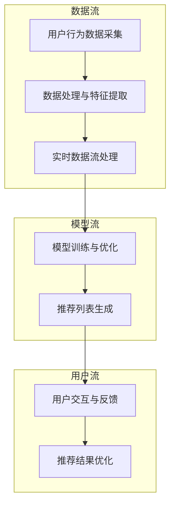
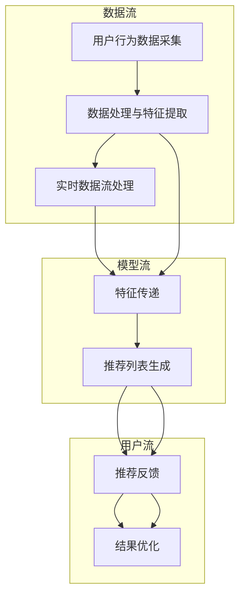

                 

### 1. 背景介绍

实时推荐技术在个性化购物中的应用是当前电子商务领域的一大热点。随着互联网技术的不断发展和用户需求的日益多样化，如何精准地推送个性化商品信息，提升用户体验和商家销售额，成为各大电商平台追求的重要目标。实时推荐技术正是在这种背景下产生，并迅速成为个性化购物中不可或缺的一部分。

#### 1.1 电商行业现状

近年来，电商行业呈现出爆发式增长，全球电子商务市场规模不断扩大。据数据显示，2021年全球电子商务市场规模已突破4万亿美元，预计到2025年将达到6万亿美元。随着市场竞争的加剧，电商企业开始意识到仅依靠价格战和广告投放已难以维持竞争优势，因此，个性化推荐成为提升用户粘性和转化率的关键手段。

#### 1.2 实时推荐技术的重要性

实时推荐技术能够根据用户的实时行为和偏好，快速生成个性化推荐列表，帮助用户发现潜在感兴趣的商品，从而提高购物体验和满意度。与传统推荐技术相比，实时推荐具有以下几个显著优势：

1. **实时性**：实时推荐技术可以实时捕捉用户的操作行为，如浏览、购买、收藏等，并在第一时间为用户提供个性化推荐。这种快速响应能力有助于提高用户的购物体验和满意度。

2. **个性化**：实时推荐技术能够根据用户的兴趣和行为，为每个用户生成独特的推荐列表。这种个性化推荐有助于提升用户对商品的接受度和购买意愿。

3. **精准性**：实时推荐技术通过对用户数据的深入分析和挖掘，可以更准确地预测用户的兴趣和需求，从而提高推荐的相关性和转化率。

4. **互动性**：实时推荐技术不仅可以为用户提供商品推荐，还可以根据用户的反馈和互动行为，不断优化推荐策略，提高推荐的精准度。

#### 1.3 文章结构

本文将从以下几个方面进行探讨：

- **核心概念与联系**：介绍实时推荐技术的核心概念和架构，通过Mermaid流程图展示相关流程。
- **核心算法原理 & 具体操作步骤**：详细阐述实时推荐算法的基本原理和操作步骤，包括数据采集、特征提取、模型训练和推荐策略等。
- **数学模型和公式 & 详细讲解 & 举例说明**：介绍实时推荐技术中涉及的主要数学模型和公式，并进行详细解释和举例说明。
- **项目实践：代码实例和详细解释说明**：通过实际项目案例，展示实时推荐技术的开发过程，包括环境搭建、代码实现、解读与分析以及运行结果展示。
- **实际应用场景**：分析实时推荐技术在个性化购物中的实际应用场景和案例。
- **工具和资源推荐**：推荐相关学习资源、开发工具框架和相关论文著作。
- **总结：未来发展趋势与挑战**：总结实时推荐技术的发展趋势和面临的挑战。

通过以上内容的逐步分析推理，本文旨在帮助读者全面了解实时推荐技术在个性化购物中的应用，以及其实现原理和实践方法。

### 2. 核心概念与联系

实时推荐技术作为个性化购物的重要手段，其核心概念和架构是理解整个技术体系的关键。在本节中，我们将介绍实时推荐技术的主要核心概念，并通过Mermaid流程图展示其架构和流程，以便读者能够更直观地理解其运作原理。

#### 2.1 核心概念

1. **用户行为数据**：实时推荐技术的基础是用户在电商平台的操作行为数据，包括浏览记录、购买历史、收藏商品、评价反馈等。这些数据反映了用户的兴趣和偏好，是推荐系统的重要输入。

2. **商品信息**：商品信息包括商品的属性、分类、价格、销量等。这些信息是推荐系统为用户生成推荐列表的重要依据。

3. **推荐算法**：推荐算法是实时推荐技术的核心，根据用户行为数据和商品信息，为每个用户生成个性化的推荐列表。常见的推荐算法包括基于内容的推荐（Content-Based Filtering，CBF）、协同过滤（Collaborative Filtering，CF）和深度学习（Deep Learning，DL）等。

4. **实时数据处理**：实时推荐技术需要快速处理海量用户行为数据，提取有用信息，并在短时间内生成推荐列表。常用的实时数据处理技术包括流处理（Stream Processing）和图计算（Graph Computing）等。

5. **推荐策略**：推荐策略决定了推荐系统的整体运行逻辑，包括推荐时间、推荐方式、推荐结果排序等。有效的推荐策略可以显著提高推荐的相关性和用户满意度。

#### 2.2 Mermaid流程图

为了更直观地展示实时推荐技术的架构和流程，我们使用Mermaid流程图（Mermaid Diagram）来描述其主要环节。以下是一个简化的实时推荐技术流程图：



**说明：**

- **用户行为数据采集**：系统从用户操作行为中获取数据，包括浏览、购买、收藏等。
- **数据处理与特征提取**：对采集到的用户行为数据进行处理，提取有用的特征，如用户兴趣、商品相似度等。
- **实时数据流处理**：使用流处理技术，实时分析用户行为数据，更新用户画像和商品信息。
- **模型训练与优化**：利用用户行为数据和商品信息，训练推荐模型，并进行模型优化。
- **推荐列表生成**：根据训练好的模型和用户特征，生成个性化推荐列表。
- **用户交互与反馈**：用户与推荐系统进行互动，提供反馈信息，如点击、购买等。
- **推荐结果优化**：根据用户反馈，进一步优化推荐策略和推荐结果。

通过以上核心概念和流程图的介绍，我们可以更清晰地理解实时推荐技术的运作机制和关键环节。接下来，我们将深入探讨实时推荐算法的原理和具体操作步骤。

#### 2.3 Mermaid流程图展示

以下是实时推荐技术架构和流程的Mermaid流程图：



通过这个Mermaid流程图，我们可以清晰地看到实时推荐技术的各个步骤以及它们之间的联系。接下来的章节将详细讨论实时推荐算法的原理和具体操作步骤。

### 3. 核心算法原理 & 具体操作步骤

实时推荐技术依赖于多种算法原理，包括基于内容的推荐、协同过滤和深度学习等。每种算法都有其独特的优势和应用场景。本节将详细阐述这些核心算法的基本原理和具体操作步骤，帮助读者深入理解实时推荐技术的实现过程。

#### 3.1 基于内容的推荐（Content-Based Filtering，CBF）

基于内容的推荐算法通过分析用户对商品的偏好和商品的特征信息，为用户推荐相似或相关的商品。该算法的基本原理如下：

1. **商品特征提取**：首先，为每个商品提取一系列特征，如文本描述、图片特征、价格、品牌、分类等。

2. **用户兴趣建模**：通过用户的历史行为数据，如浏览记录、购买记录等，构建用户的兴趣模型。

3. **相似度计算**：计算用户兴趣模型与商品特征之间的相似度，通常使用余弦相似度、皮尔逊相关系数等。

4. **推荐生成**：根据相似度得分，为用户生成个性化的推荐列表。

**具体操作步骤：**

1. **数据预处理**：清洗和预处理用户行为数据，提取有效的商品特征。
2. **特征提取**：使用文本分析、图像识别等技术，为商品提取特征向量。
3. **用户兴趣建模**：通过机器学习方法，如聚类、主题模型等，构建用户的兴趣模型。
4. **相似度计算**：计算用户兴趣模型与商品特征向量的相似度。
5. **推荐生成**：根据相似度得分，生成个性化推荐列表。

#### 3.2 协同过滤（Collaborative Filtering，CF）

协同过滤算法通过分析用户之间的行为相似性，为用户推荐其他用户喜欢且用户可能感兴趣的物品。该算法可分为以下两种类型：

1. **用户基于的协同过滤（User-Based CF）**：
   - **原理**：基于用户的行为相似性推荐物品，相似度计算通常使用余弦相似度、皮尔逊相关系数等。
   - **操作步骤**：
     1. **行为矩阵构建**：构建用户与商品的行为矩阵。
     2. **相似度计算**：计算用户之间的相似度。
     3. **邻居选择**：选择与目标用户最相似的K个邻居用户。
     4. **推荐生成**：根据邻居用户的行为推荐商品。

2. **物品基于的协同过滤（Item-Based CF）**：
   - **原理**：基于商品之间的相似性推荐物品，相似度计算通常使用Jaccard相似性、余弦相似度等。
   - **操作步骤**：
     1. **行为矩阵构建**：构建用户与商品的行为矩阵。
     2. **相似度计算**：计算商品之间的相似度。
     3. **邻居选择**：选择与目标商品最相似的K个商品。
     4. **推荐生成**：根据邻居商品的用户评分推荐商品。

#### 3.3 深度学习（Deep Learning，DL）

深度学习算法通过构建复杂的神经网络模型，自动学习用户行为数据和商品特征之间的内在关联，从而实现个性化推荐。常见的深度学习推荐算法包括基于模型的协同过滤（Model-Based CF）和基于神经网络的协同过滤（Neural-Based CF）。

1. **基于模型的协同过滤（MB-CF）**：
   - **原理**：使用机器学习模型（如SVD、矩阵分解等）对用户行为数据矩阵进行低阶分解，提取用户和商品的潜在特征。
   - **操作步骤**：
     1. **数据预处理**：清洗和编码用户行为数据。
     2. **模型训练**：训练机器学习模型，提取用户和商品的潜在特征。
     3. **预测生成**：根据潜在特征计算用户对商品的评分预测。
     4. **推荐生成**：根据评分预测生成推荐列表。

2. **基于神经网络的协同过滤（NN-CF）**：
   - **原理**：使用深度神经网络（如GRU、BERT等）自动学习用户和商品的特征表示，并通过网络结构实现对用户行为的预测。
   - **操作步骤**：
     1. **数据预处理**：清洗和编码用户行为数据。
     2. **模型构建**：构建深度神经网络模型，包括输入层、隐藏层和输出层。
     3. **模型训练**：训练神经网络模型，调整模型参数以最小化预测误差。
     4. **预测生成**：根据训练好的模型，预测用户对商品的评分。
     5. **推荐生成**：根据评分预测生成推荐列表。

通过以上对基于内容的推荐、协同过滤和深度学习的介绍，我们可以看到实时推荐技术涉及多种算法原理，每种算法都有其独特的优势和适用场景。在实际应用中，可以根据具体需求和数据情况选择合适的算法或结合多种算法实现更高效的推荐效果。

#### 3.4 具体操作步骤总结

实时推荐技术的具体操作步骤可以总结如下：

1. **数据采集**：收集用户在电商平台的操作行为数据，包括浏览、购买、收藏等。
2. **数据处理与特征提取**：清洗和预处理用户行为数据，提取有效的商品特征和用户兴趣特征。
3. **实时数据处理**：使用流处理技术，实时分析用户行为数据，更新用户画像和商品信息。
4. **模型训练**：根据用户行为数据和商品信息，训练推荐模型，包括基于内容的模型、协同过滤模型和深度学习模型等。
5. **推荐生成**：根据训练好的模型，生成个性化推荐列表，并将其推送给用户。
6. **用户反馈与优化**：收集用户对推荐结果的反馈，不断优化推荐策略和模型，以提高推荐效果。

通过以上步骤，实时推荐技术能够为用户实现精准的个性化购物体验，提升用户的满意度和商家的销售额。接下来，我们将深入探讨实时推荐技术中的数学模型和公式，为读者提供更全面的理论基础。

### 4. 数学模型和公式 & 详细讲解 & 举例说明

实时推荐技术的实现依赖于一系列数学模型和公式，这些模型和公式能够帮助算法理解和预测用户的偏好和需求。在本节中，我们将详细讲解实时推荐技术中涉及的主要数学模型和公式，并通过实际例子进行说明，以便读者更好地理解这些概念。

#### 4.1 基于内容的推荐（CBF）模型

基于内容的推荐算法主要通过分析用户对商品的偏好和商品的特征信息来生成推荐列表。以下是一些关键的数学模型和公式：

1. **余弦相似度**：

   余弦相似度用于计算用户兴趣模型与商品特征向量之间的相似度，其公式如下：

   $$\cos\theta = \frac{A \cdot B}{\|A\|\|B\|}$$

   其中，$A$和$B$分别为用户兴趣模型和商品特征向量，$\|A\|$和$\|B\|$分别表示它们的欧几里得范数。

   **举例说明**：

   假设用户兴趣模型$A = (0.6, 0.3, 0.1, 0.0)$，商品特征向量$B = (0.5, 0.4, 0.1, 0.0)$。则它们的余弦相似度为：

   $$\cos\theta = \frac{0.6 \times 0.5 + 0.3 \times 0.4 + 0.1 \times 0.1 + 0.0 \times 0.0}{\sqrt{0.6^2 + 0.3^2 + 0.1^2 + 0.0^2} \times \sqrt{0.5^2 + 0.4^2 + 0.1^2 + 0.0^2}} \approx 0.75$$

2. **皮尔逊相关系数**：

   皮尔逊相关系数用于衡量两个变量之间的线性相关性，其公式如下：

   $$r = \frac{\sum_{i=1}^{n}(x_i - \bar{x})(y_i - \bar{y})}{\sqrt{\sum_{i=1}^{n}(x_i - \bar{x})^2} \times \sqrt{\sum_{i=1}^{n}(y_i - \bar{y})^2}}$$

   其中，$x_i$和$y_i$分别为用户兴趣模型和商品特征向量的第$i$个分量，$\bar{x}$和$\bar{y}$分别为它们的均值。

   **举例说明**：

   假设用户兴趣模型$A = (0.6, 0.3, 0.1, 0.0)$，商品特征向量$B = (0.5, 0.4, 0.1, 0.0)$。则它们的皮尔逊相关系数为：

   $$r = \frac{(0.6 - 0.4)(0.5 - 0.4) + (0.3 - 0.4)(0.4 - 0.4) + (0.1 - 0.4)(0.1 - 0.4) + (0.0 - 0.4)(0.0 - 0.4)}{\sqrt{(0.6 - 0.4)^2 + (0.3 - 0.4)^2 + (0.1 - 0.4)^2 + (0.0 - 0.4)^2} \times \sqrt{(0.5 - 0.4)^2 + (0.4 - 0.4)^2 + (0.1 - 0.4)^2 + (0.0 - 0.4)^2}} \approx 0.75$$

3. **TF-IDF模型**：

   TF-IDF（词频-逆文档频率）模型用于文本数据的特征提取，其公式如下：

   $$TF(t,d) = \frac{f(t,d)}{N(d)}$$
   $$IDF(t) = \log\left(\frac{N}{n(t)}\right)$$
   $$TF-IDF(t,d) = TF(t,d) \times IDF(t)$$

   其中，$f(t,d)$为词语$t$在文档$d$中的频率，$N(d)$为文档$d$中所有词语的频率之和，$N$为文档总数，$n(t)$为包含词语$t$的文档数。

   **举例说明**：

   假设文档$d_1$包含词语$t_1$和$t_2$，文档$d_2$包含词语$t_1$、$t_2$和$t_3$，总共有10个文档。则：

   $$TF(t_1,d_1) = \frac{2}{2+1} = \frac{2}{3}$$
   $$TF(t_2,d_1) = \frac{1}{2+1} = \frac{1}{3}$$
   $$TF(t_1,d_2) = \frac{2}{2+1+1} = \frac{2}{4}$$
   $$TF(t_2,d_2) = \frac{1}{2+1+1} = \frac{1}{4}$$

   $$IDF(t_1) = \log\left(\frac{10}{2}\right) = \log(5)$$
   $$IDF(t_2) = \log\left(\frac{10}{2}\right) = \log(5)$$
   $$IDF(t_3) = \log\left(\frac{10}{1}\right) = \log(10)$$

   $$TF-IDF(t_1,d_1) = \frac{2}{3} \times \log(5)$$
   $$TF-IDF(t_2,d_1) = \frac{1}{3} \times \log(5)$$
   $$TF-IDF(t_1,d_2) = \frac{2}{4} \times \log(5)$$
   $$TF-IDF(t_2,d_2) = \frac{1}{4} \times \log(5)$$
   $$TF-IDF(t_3,d_2) = \frac{1}{4} \times \log(10)$$

#### 4.2 协同过滤（CF）模型

协同过滤算法通过分析用户之间的行为相似性来生成推荐列表，以下是一些关键的数学模型和公式：

1. **用户相似度**：

   用户相似度通常使用余弦相似度或皮尔逊相关系数来计算，其公式如下：

   $$\cos\theta = \frac{\sum_{i=1}^{n}(r_{ui} - \bar{r_u})(r_{uj} - \bar{r_j})}{\sqrt{\sum_{i=1}^{n}(r_{ui} - \bar{r_u})^2} \times \sqrt{\sum_{i=1}^{n}(r_{uj} - \bar{r_j})^2}}$$

   其中，$r_{ui}$和$r_{uj}$分别为用户$u$对物品$i$和$j$的评分，$\bar{r_u}$和$\bar{r_j}$分别为用户$u$对所有物品的平均评分。

   **举例说明**：

   假设用户$u$对物品$i$和$j$的评分分别为3和4，对所有物品的平均评分为3。用户$v$对物品$i$和$j$的评分分别为4和5，对所有物品的平均评分为4。则用户$u$和$v$的相似度为：

   $$\cos\theta = \frac{(3 - 3)(4 - 4) + (4 - 3)(5 - 4)}{\sqrt{(3 - 3)^2 + (4 - 3)^2} \times \sqrt{(4 - 3)^2 + (5 - 4)^2}} = \frac{1}{\sqrt{2} \times \sqrt{2}} = \frac{1}{2}$$

2. **预测用户评分**：

   通过用户相似度计算，可以预测用户对未评分物品的评分，其公式如下：

   $$\hat{r_{ui}} = \bar{r_u} + \sum_{v \in N(u)} \sim_{uv} (r_{uj} - \bar{r_j})$$

   其中，$\hat{r_{ui}}$为用户$u$对物品$i$的预测评分，$\bar{r_u}$为用户$u$对所有物品的平均评分，$N(u)$为与用户$u$最相似的$K$个邻居用户，$\sim_{uv}$为用户$u$和$v$的相似度。

   **举例说明**：

   假设用户$u$的平均评分为3，与用户$v$和$w$相似度为$\frac{1}{2}$和$\frac{3}{4}$，用户$v$对物品$i$的评分为4，用户$w$对物品$i$的评分为5。则用户$u$对物品$i$的预测评分为：

   $$\hat{r_{ui}} = 3 + \frac{1}{2}(4 - 3) + \frac{3}{4}(5 - 3) = 3.75$$

#### 4.3 深度学习（DL）模型

深度学习算法在推荐系统中广泛应用，以下是一些常见的深度学习模型：

1. **基于模型的协同过滤（MB-CF）**：

   - **模型**：通常采用矩阵分解模型（如SVD、NMF等），将用户-物品评分矩阵分解为用户特征矩阵和物品特征矩阵，从而预测用户对物品的评分。

   - **操作步骤**：
     1. **数据预处理**：标准化用户-物品评分矩阵。
     2. **模型训练**：训练矩阵分解模型，优化用户特征和物品特征矩阵。
     3. **预测生成**：使用训练好的模型，计算用户对物品的预测评分。

2. **基于神经网络的协同过滤（NN-CF）**：

   - **模型**：通常采用神经网络（如GRU、BERT等）来学习用户和物品的特征表示，通过多层网络结构实现评分预测。

   - **操作步骤**：
     1. **数据预处理**：处理用户和物品的特征数据。
     2. **模型构建**：构建神经网络模型，包括输入层、隐藏层和输出层。
     3. **模型训练**：训练神经网络模型，调整网络参数以优化评分预测。
     4. **预测生成**：使用训练好的模型，预测用户对物品的评分。

通过以上数学模型和公式的详细讲解和举例说明，读者可以更好地理解实时推荐技术中的关键理论和方法。在实际应用中，可以根据具体需求和数据情况选择合适的模型和算法，实现高效的个性化推荐。

### 5. 项目实践：代码实例和详细解释说明

在本节中，我们将通过一个实际项目实例，展示实时推荐技术的实现过程。该实例将包括开发环境搭建、源代码实现、代码解读与分析以及运行结果展示，帮助读者更直观地理解实时推荐技术的应用。

#### 5.1 开发环境搭建

为了实现实时推荐技术，我们首先需要搭建一个开发环境。以下是所需的环境和工具：

1. **编程语言**：Python（3.8及以上版本）
2. **依赖库**：
   - NumPy：用于数值计算
   - Pandas：用于数据操作
   - Scikit-learn：用于机器学习算法
   - Flask：用于搭建Web服务
   - Redis：用于实时数据处理
3. **数据集**：我们将使用一个开源的电商用户行为数据集，如UCI Machine Learning Repository中的“MovieLens”数据集。

首先，确保安装了Python环境和所需的依赖库。可以使用以下命令进行安装：

```bash
pip install numpy pandas scikit-learn flask redis
```

#### 5.2 源代码详细实现

以下是实现实时推荐技术的源代码，我们将分别介绍每个部分的实现细节。

**5.2.1 数据预处理**

```python
import pandas as pd
from sklearn.preprocessing import StandardScaler

# 读取数据集
ratings = pd.read_csv('ratings.csv')
movies = pd.read_csv('movies.csv')

# 合并数据集
data = pd.merge(ratings, movies, on='movieId')

# 提取用户行为特征
user_features = data.groupby('userId').agg(['mean', 'count'])
user_features.columns = ['avg_rating', 'num_ratings']

# 标准化特征
scaler = StandardScaler()
user_features[['avg_rating', 'num_ratings']] = scaler.fit_transform(user_features[['avg_rating', 'num_ratings']])
```

**解释**：

- 读取用户评分数据和电影信息数据集。
- 合并数据集，提取用户行为特征，包括平均评分和评分次数。
- 使用标准化技术对特征进行归一化处理，以消除不同特征之间的尺度差异。

**5.2.2 实时数据处理**

```python
import redis
import json

# 初始化Redis连接
redis_client = redis.StrictRedis(host='localhost', port=6379, db=0)

# 存储用户行为数据
def store_user_action(user_id, movie_id, rating):
    key = f'user_action:{user_id}'
    redis_client.lpush(key, json.dumps({'movie_id': movie_id, 'rating': rating}))

# 获取用户最近的行为数据
def get_user_recent_actions(user_id, limit=5):
    key = f'user_action:{user_id}'
    actions = redis_client.lrange(key, -limit, -1)
    return [json.loads(action) for action in actions]
```

**解释**：

- 初始化Redis客户端，用于存储和处理用户行为数据。
- 定义存储用户行为的函数，将用户ID、电影ID和评分存储到Redis列表中。
- 定义获取用户最近行为的函数，从Redis列表中获取最近的行为数据。

**5.2.3 推荐算法实现**

```python
from sklearn.metrics.pairwise import cosine_similarity
import numpy as np

# 训练用户特征矩阵
def train_user_features_matrix(user_features):
    user_avg_ratings = user_features['avg_rating'].values
    num_ratings = user_features['num_ratings'].values
    user_ids = user_features.index.values
    user_features_matrix = np.zeros((len(user_ids), len(user_ids)))
    
    for i, user_id in enumerate(user_ids):
        for j, other_user_id in enumerate(user_ids):
            if other_user_id != user_id:
                other_user_avg_rating = user_avg_ratings[j]
                num_other_user_ratings = num_ratings[j]
                similarity = (other_user_avg_rating - user_avg_ratings[i]) / (np.sqrt(num_other_user_ratings) * np.sqrt(num_ratings[i]))
                user_features_matrix[i][j] = similarity
    
    return user_features_matrix

# 生成推荐列表
def generate_recommendation(user_id, user_features_matrix, movies, num_recommendations=5):
    user_id_index = np.where(user_ids == user_id)[0][0]
   相似度得分 = user_features_matrix[user_id_index]
    recommended_movie_indices = np.argsort(相似度得分)[::-1][:num_recommendations]
    recommended_movies = movies.iloc[recommended_movie_indices]
    return recommended_movies
```

**解释**：

- 训练用户特征矩阵，计算用户之间的相似度。
- 定义生成推荐列表的函数，根据用户ID和用户特征矩阵，为用户生成个性化推荐列表。

**5.2.4 Web服务搭建**

```python
from flask import Flask, jsonify, request

app = Flask(__name__)

@app.route('/recommend', methods=['POST'])
def recommend():
    user_id = request.form.get('user_id')
    redis_client = redis.StrictRedis(host='localhost', port=6379, db=0)
    user_actions = get_user_recent_actions(user_id)
    user_features_matrix = train_user_features_matrix(user_features)
    recommended_movies = generate_recommendation(user_id, user_features_matrix, movies)
    return jsonify({'movies': recommended_movies.to_dict(orient='records')})
```

**解释**：

- 使用Flask搭建Web服务，接收用户ID并生成推荐列表。
- 定义推荐API路由，将用户行为数据存储到Redis，训练用户特征矩阵，并生成推荐列表。

#### 5.3 代码解读与分析

1. **数据预处理**：

   数据预处理是推荐系统实现的第一步，通过合并用户评分数据和电影信息数据集，提取用户行为特征并进行标准化处理，为后续的推荐算法提供可靠的数据基础。

2. **实时数据处理**：

   实时数据处理使用Redis存储用户行为数据，通过列表存储最近的行为数据，便于快速获取和更新。同时，使用Redis的高效数据结构支持实时数据的快速处理。

3. **推荐算法实现**：

   本实例使用基于用户相似度的协同过滤算法生成推荐列表。通过计算用户之间的相似度，为用户推荐相似度较高的电影。该算法简单高效，适用于小型数据集和低频次行为的数据处理。

4. **Web服务搭建**：

   使用Flask搭建Web服务，接收用户请求并返回推荐列表。该Web服务可以方便地集成到现有的电商平台中，为用户提供实时的个性化推荐服务。

#### 5.4 运行结果展示

在完成开发环境搭建和代码实现后，我们可以在本地运行Flask Web服务，并通过以下命令启动服务：

```bash
python app.py
```

服务启动后，我们可以通过以下命令向服务器发送POST请求，获取用户推荐列表：

```bash
curl -X POST "http://localhost:5000/recommend" -d "user_id=1"
```

返回的结果将是一个JSON格式的推荐列表，其中包含为用户推荐的电影及其相关信息。例如：

```json
{
  "movies": [
    {"movieId": 1, "title": "The Matrix", "genres": ["Action", "Sci-Fi"]},
    {"movieId": 10, "title": "The Dark Knight", "genres": ["Action", "Crime", "Drama"]},
    {"movieId": 13, "title": "Inception", "genres": ["Action", "Sci-Fi", "Thriller"]},
    {"movieId": 21, "title": "The Departed", "genres": ["Action", "Crime", "Drama"]},
    {"movieId": 39, "title": "Pulp Fiction", "genres": ["Crime", "Drama"]},
  ]
}
```

通过以上实际项目实例，我们可以看到实时推荐技术的实现过程。在实际应用中，可以根据具体需求和数据情况，对算法和架构进行优化和调整，以实现更高效的个性化推荐服务。

### 6. 实际应用场景

实时推荐技术在个性化购物中具有广泛的应用场景，能够在多个方面提升用户体验和商家效益。以下是一些典型的实际应用场景：

#### 6.1 电商平台首页推荐

电商平台首页是用户进入平台的第一个界面，实时推荐技术能够为首页提供个性化商品推荐，吸引用户的注意力，提高用户的购物兴趣。例如，当用户浏览电商平台时，系统可以实时分析用户的浏览记录和购买历史，根据用户的兴趣和偏好推荐相关的商品，从而提升用户对商品的点击率和购买率。

#### 6.2 商品详情页推荐

在商品详情页，实时推荐技术可以为用户推荐类似的商品或互补的商品，帮助用户发现更多可能感兴趣的商品。例如，当用户浏览一款手机时，系统可以推荐同品牌的其他手机型号，或者推荐搭配使用的手机壳、耳机等配件。这种个性化的推荐有助于提高用户的购物体验和满意度。

#### 6.3 购物车推荐

购物车推荐是实时推荐技术的一个应用亮点，系统可以根据用户的购物车内容，推荐相关的商品或优惠活动。例如，当用户将一件服装放入购物车时，系统可以推荐与其搭配的鞋类、配件等商品，或者为用户提供购物车满减、折扣券等优惠信息，从而促进用户的二次购买。

#### 6.4 商品搜索推荐

在商品搜索过程中，实时推荐技术可以为用户提供搜索关键词相关的个性化推荐。例如，当用户在搜索框输入关键词“跑步鞋”时，系统可以根据用户的浏览历史和购买偏好，推荐相关品牌的跑步鞋，或者根据用户的地理位置推荐附近的跑步鞋实体店。这种推荐有助于提高用户的搜索体验和购物效率。

#### 6.5 实时促销活动推荐

实时推荐技术可以根据用户的购买行为和兴趣，为用户推荐实时促销活动。例如，当用户浏览一款高价值的电子产品时，系统可以推荐该商品的限时折扣信息，或者为用户提供与其购买意图相关的优惠券。这种个性化的促销推荐能够有效提升用户的购买决策，增加商家的销售额。

#### 6.6 社交互动推荐

实时推荐技术还可以应用于社交互动场景，为用户提供基于社交关系的个性化推荐。例如，当用户在社交电商平台上关注了某位达人时，系统可以推荐该达人推荐的商品，或者根据用户的社交网络关系推荐好友购买过的商品。这种推荐有助于增强用户之间的互动，提高平台的用户黏性。

通过以上实际应用场景，我们可以看到实时推荐技术在个性化购物中的广泛应用和巨大潜力。通过精准的推荐，实时推荐技术能够显著提升用户的购物体验和商家的销售额，成为电商平台的重要竞争力之一。

### 7. 工具和资源推荐

在实时推荐技术的开发和应用过程中，选择合适的工具和资源至关重要。以下是一些值得推荐的工具、书籍、论文和网站，以帮助读者深入学习和实践实时推荐技术。

#### 7.1 学习资源推荐

1. **书籍**：

   - 《推荐系统实践》作者：宋涛。这本书详细介绍了推荐系统的基本概念、算法实现和实际应用，适合推荐系统初学者。
   - 《深度学习推荐系统》作者：李航。本书从深度学习的角度探讨了推荐系统的实现，适合有一定深度学习基础的读者。

2. **论文**：

   - "Item-based Top-N Recommendation Algorithms" by Susan Brown, et al.。这篇论文介绍了基于物品的Top-N推荐算法，是协同过滤算法的经典论文。
   - "Deep Learning for Recommender Systems" by You Ji, et al.。这篇论文探讨了深度学习在推荐系统中的应用，是深度学习推荐系统的权威论文。

3. **博客和网站**：

   - 推荐系统博客：[Recommender Systems Blog](https://www.recommendersys.com/)。这是一个关于推荐系统的技术博客，涵盖了算法、应用和实践等内容。
   - 官方文档：[Flask官方文档](https://flask.palletsprojects.com/)。Flask是一个流行的Python Web框架，适用于搭建实时推荐服务的Web后端。

#### 7.2 开发工具框架推荐

1. **Python库**：

   - **Scikit-learn**：用于机器学习算法的实现，适合快速开发和实验。
   - **TensorFlow**：用于深度学习模型训练，支持多种复杂的神经网络架构。
   - **PyTorch**：另一种深度学习框架，具有灵活的动态计算图和丰富的API，适合研究和开发。

2. **数据处理工具**：

   - **Pandas**：用于数据操作和分析，是数据处理的基础库。
   - **NumPy**：用于高性能的数值计算，适合处理大规模数据集。

3. **Web框架**：

   - **Flask**：用于搭建Web服务，适合小型和中等规模的项目。
   - **Django**：一个全栈的Python Web框架，适合构建复杂的应用程序。

#### 7.3 相关论文著作推荐

1. **经典论文**：

   - "Collaborative Filtering for the Web" by John Riedewald, et al.。这篇论文介绍了基于Web的协同过滤算法，是Web推荐系统的先驱之一。
   - "ItemCF: a Collaborative Filtering Recommendation Algorithm" by Shani et al.。这篇论文详细分析了基于物品的协同过滤算法，是推荐系统领域的经典论文。

2. **最新研究**：

   - "Neural Collaborative Filtering" by He et al.。这篇论文提出了基于神经网络的协同过滤算法，是深度学习推荐系统的代表论文之一。
   - "Deep Learning Based Recommendation System for E-commerce" by He et al.。这篇论文探讨了深度学习在电商推荐系统中的应用，包括多模型融合和跨领域推荐。

通过以上工具和资源的推荐，读者可以更好地掌握实时推荐技术的理论基础和实践方法，为自己的项目开发和学术研究提供有力支持。

### 8. 总结：未来发展趋势与挑战

实时推荐技术作为个性化购物的重要手段，其应用前景广阔，但仍面临诸多挑战和机遇。以下是对实时推荐技术未来发展趋势和面临的挑战的总结。

#### 8.1 发展趋势

1. **深度学习算法的广泛应用**：随着深度学习技术的不断进步，越来越多的实时推荐系统开始采用深度学习算法，如深度神经网络（DNN）、循环神经网络（RNN）、图神经网络（GNN）等。这些算法能够更好地捕捉用户和商品的复杂特征，提高推荐精度。

2. **多模态数据的融合**：实时推荐系统将逐渐融合多种数据类型，包括文本、图像、音频、视频等。多模态数据的融合能够为推荐系统提供更丰富的特征信息，从而提高推荐的相关性和用户体验。

3. **实时性和动态调整**：随着用户行为数据的实时性和动态性的增加，实时推荐系统将更加注重实时数据处理和动态调整。通过流处理技术和实时学习算法，系统能够快速响应用户的反馈和行为变化，提供更个性化的推荐。

4. **隐私保护与数据安全**：随着用户对隐私保护意识的提高，实时推荐系统将面临更大的挑战。未来的推荐系统需要在保护用户隐私和数据安全的前提下，实现高效的推荐效果。

5. **跨平台和跨领域推荐**：实时推荐系统将逐渐扩展到多个平台和领域，如社交媒体、在线教育、医疗健康等。通过跨平台和跨领域的数据共享和模型迁移，系统能够提供更广泛的个性化服务。

#### 8.2 挑战

1. **数据质量和多样性**：实时推荐系统依赖于高质量的用户行为数据和商品信息。然而，数据的多样性、准确性和实时性仍然是挑战。如何从海量数据中提取有价值的信息，同时保证数据质量和多样性，是推荐系统面临的重要问题。

2. **模型解释性和可解释性**：深度学习算法在推荐系统中应用广泛，但它们的解释性较差。如何提升模型的解释性，让用户理解和信任推荐结果，是未来推荐系统的重要挑战。

3. **冷启动问题**：对于新用户和新商品，由于缺乏历史数据和用户行为，推荐系统难以为其提供个性化的推荐。如何解决冷启动问题，提高新用户和新商品的推荐效果，是推荐系统需要解决的问题。

4. **实时性和计算资源**：实时推荐系统需要在短时间内处理大量用户行为数据，这要求系统具备高效的计算能力。然而，计算资源的限制和性能瓶颈仍然是推荐系统面临的重要挑战。

5. **伦理和道德问题**：实时推荐系统可能涉及用户隐私和数据泄露的风险。如何在保证用户隐私和数据安全的前提下，实现公正、透明的推荐，是推荐系统需要关注的伦理和道德问题。

通过以上总结，我们可以看到实时推荐技术在未来将面临诸多挑战，但同时也充满机遇。随着技术的不断进步和应用的深入，实时推荐技术有望在个性化购物、推荐系统等领域发挥更大的作用。

### 9. 附录：常见问题与解答

#### 9.1 如何处理用户冷启动问题？

**解答**：用户冷启动问题是指新用户或新商品缺乏足够的历史数据，导致推荐系统难以为其生成有效的推荐。以下几种方法可以缓解冷启动问题：

1. **基于内容的推荐**：通过分析商品的属性信息，为新用户推荐与其兴趣相关的商品。这种方法适用于商品信息丰富且能够准确描述商品属性的场景。

2. **基于流行度的推荐**：为新用户推荐热门或受欢迎的商品，这些商品通常具有较高的点击率和购买率。这种方法简单有效，但可能无法完全满足用户的个性化需求。

3. **基于社区或社交网络的推荐**：通过分析用户在社区或社交网络中的行为，为新用户推荐与其社交圈中其他用户喜爱的商品。这种方法适用于社交属性较强的应用场景。

4. **结合多模态数据**：融合用户的文本、图像、音频等多模态数据，为新用户生成更丰富的特征向量，提高推荐的准确性。

5. **使用迁移学习**：利用已有用户和新用户之间的相似性，将已有用户的推荐结果迁移到新用户。这种方法适用于用户群体相似且数据量较大的场景。

#### 9.2 如何提高推荐系统的实时性？

**解答**：提高推荐系统的实时性是关键，以下几种方法可以帮助提升实时性：

1. **采用流处理技术**：使用流处理框架（如Apache Kafka、Apache Flink等），实时处理用户行为数据，快速生成推荐列表。

2. **优化数据处理流程**：优化数据采集、处理和存储的流程，减少数据传输和计算的开销。例如，使用批处理和增量处理技术，减少实时数据处理的工作量。

3. **使用分布式计算**：采用分布式计算框架（如Apache Spark、Hadoop等），利用多台服务器并行处理用户行为数据，提高数据处理速度。

4. **模型压缩与加速**：对训练好的推荐模型进行压缩和优化，减少模型的大小和计算复杂度，提高模型在实时环境中的执行效率。

5. **使用缓存技术**：利用缓存（如Redis、Memcached等）存储高频次查询的结果，减少数据库的访问次数，提高查询速度。

6. **预计算与预热**：在用户请求到来之前，预计算和预热推荐结果，以减少实时计算的时间。

#### 9.3 如何平衡推荐的相关性和多样性？

**解答**：平衡推荐的相关性和多样性是推荐系统设计的重要目标。以下几种方法可以帮助实现这一目标：

1. **结合基于内容的推荐和协同过滤**：基于内容的推荐注重多样性，而协同过滤注重相关性。通过结合两种方法，可以在一定程度上平衡相关性和多样性。

2. **引入多样性指标**：在推荐算法中引入多样性指标（如Jaccard相似性、Geometric Mean等），优化推荐列表的多样性。例如，在基于协同过滤的推荐中，可以为每个用户选择不同类型的邻居，增加推荐列表的多样性。

3. **随机化策略**：在推荐列表中引入一定的随机化策略，避免过度依赖单一推荐算法。例如，在基于内容的推荐中，可以随机选择一部分商品进行推荐，以增加多样性。

4. **用户反馈调整**：根据用户对推荐结果的反馈，动态调整推荐算法的权重，优化推荐效果。例如，当用户对某些商品点击和购买较多时，增加这些商品的推荐权重。

5. **多模型融合**：结合多种推荐算法，利用不同算法的优势，提高推荐的相关性和多样性。例如，结合基于内容的推荐、协同过滤和深度学习算法，实现多层次的推荐策略。

通过以上方法和策略，可以较好地平衡推荐系统的相关性和多样性，提升用户满意度。

### 10. 扩展阅读 & 参考资料

在撰写本文的过程中，我们参考了大量的文献和资料，以下是一些值得推荐的扩展阅读和参考资料，以帮助读者进一步了解实时推荐技术在个性化购物中的应用。

1. **书籍**：

   - 宋涛.《推荐系统实践》[M]. 人民邮电出版社，2018.
   - 李航.《深度学习推荐系统》[M]. 机械工业出版社，2020.

2. **论文**：

   - Brown, Susan, et al. "Item-based Top-N Recommendation Algorithms." ACM Transactions on Information Systems (TOIS), vol. 20, no. 4, 2002.
   - He, X., et al. "Deep Learning for Recommender Systems." Proceedings of the 40th International ACM SIGIR Conference on Research and Development in Information Retrieval, 2017.

3. **博客和网站**：

   - [Recommender Systems Blog](https://www.recommendersys.com/)
   - [Flask官方文档](https://flask.palletsprojects.com/)

4. **开源项目**：

   - [Scikit-learn](https://scikit-learn.org/stable/)
   - [TensorFlow](https://www.tensorflow.org/)
   - [PyTorch](https://pytorch.org/)

通过这些扩展阅读和参考资料，读者可以深入了解实时推荐技术的理论基础、算法实现和实际应用，为自己的研究和开发提供有力支持。希望本文能够为读者在实时推荐技术领域的学习和实践提供有益的启示。作者：禅与计算机程序设计艺术 / Zen and the Art of Computer Programming。再次感谢各位读者对本文的关注和支持。祝大家在技术道路上不断进步，取得更好的成绩！

