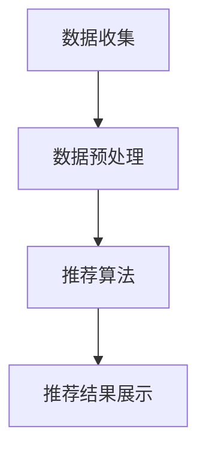

                 

### 1. 背景介绍

#### 1.1 电商行业的发展背景

随着互联网技术的飞速发展，电商行业经历了翻天覆地的变化。从最初的电子商务平台，到现在的社交电商、直播电商等，电商模式不断创新，极大地满足了消费者对便捷购物和个性化体验的需求。根据统计数据显示，全球电商市场规模已达到数万亿美元，并仍在持续增长。

电商行业的发展离不开技术的支撑。大数据、人工智能、云计算等技术的应用，不仅提高了电商平台的运营效率，也大大提升了消费者的购物体验。尤其是实时推荐技术的出现，成为电商领域的一大亮点。

#### 1.2 实时推荐技术的定义及重要性

实时推荐技术是一种基于用户行为数据、商品信息等，通过算法模型实时分析并推荐相关商品给用户的技术。它能够根据用户的兴趣和行为，动态调整推荐策略，从而提高用户的点击率、购买率和满意度。

在电商领域，实时推荐技术的重要性不言而喻。一方面，它能够帮助电商平台精准定位用户需求，提高销售转化率；另一方面，它能够提升用户的购物体验，增加用户粘性，从而增强平台的竞争力。

#### 1.3 实时推荐技术的研究现状与应用场景

实时推荐技术的研究已有多年的历史，目前国内外学者和企业在这一领域取得了诸多成果。例如，基于协同过滤、基于内容、基于模型的方法等。同时，实时推荐技术在电商领域的应用也越来越广泛，如商品推荐、广告推荐、搜索推荐等。

随着技术的不断进步，实时推荐技术的应用场景也在不断扩展。除了电商领域，实时推荐技术还广泛应用于新闻推荐、音乐推荐、社交网络等场景，成为提高用户体验的重要手段。

### 2. 核心概念与联系

#### 2.1 实时推荐技术的基本原理

实时推荐技术的基本原理包括数据收集、数据预处理、推荐算法、推荐结果展示等环节。以下是一个简单的流程图，用于说明实时推荐技术的核心流程：



#### 2.2 数据收集

数据收集是实时推荐技术的第一步，主要涉及用户行为数据、商品信息、历史交易数据等。这些数据可以通过用户浏览、搜索、购买等行为进行采集。

#### 2.3 数据预处理

数据预处理是对收集到的原始数据进行清洗、转换和整合的过程。这一步骤对于推荐算法的性能和准确性至关重要。常见的数据预处理方法包括：

- 数据清洗：去除重复数据、缺失数据、异常数据等。
- 数据转换：将不同类型的数据转换为统一格式，如将用户行为数据转换为向量表示。
- 数据整合：将来自不同源的数据进行整合，以构建一个完整的用户-商品行为矩阵。

#### 2.4 推荐算法

推荐算法是实时推荐技术的核心，主要分为基于协同过滤、基于内容和基于模型的方法。

- 基于协同过滤的方法：通过分析用户之间的相似度，推荐用户喜欢的商品。如用户基于物品的协同过滤（UBCF）和基于模型的协同过滤（MBCF）。
- 基于内容的方法：通过分析商品的特征，推荐与用户兴趣相关的商品。如基于标签的推荐和基于属性的推荐。
- 基于模型的方法：通过建立用户和商品的潜在特征模型，进行推荐。如矩阵分解、深度学习等。

#### 2.5 推荐结果展示

推荐结果展示是将推荐结果以直观、易于理解的方式呈现给用户的过程。常见的方式包括首页推荐、搜索结果推荐、购物车推荐等。

### 3. 核心算法原理 & 具体操作步骤

#### 3.1 基于协同过滤的推荐算法

基于协同过滤的推荐算法是目前应用最广泛的实时推荐算法之一。它主要分为用户基于物品的协同过滤（User-Based Collaborative Filtering，UBCF）和模型基于物品的协同过滤（Model-Based Collaborative Filtering，MBCF）。

##### 3.1.1 用户基于物品的协同过滤（UBCF）

用户基于物品的协同过滤算法主要通过分析用户之间的相似度，为用户推荐相似用户喜欢的商品。

具体操作步骤如下：

1. 计算用户之间的相似度：可以使用余弦相似度、皮尔逊相关系数等方法计算用户之间的相似度。
2. 为用户生成推荐列表：根据用户之间的相似度，为每个用户生成一个推荐列表，推荐相似用户喜欢的商品。

##### 3.1.2 模型基于物品的协同过滤（MBCF）

模型基于物品的协同过滤算法通过建立用户和商品的潜在特征模型，为用户推荐相关商品。

具体操作步骤如下：

1. 初始化模型参数：使用随机梯度下降（SGD）等方法初始化模型参数。
2. 训练模型：使用历史用户行为数据，通过最小化损失函数更新模型参数。
3. 预测用户偏好：使用训练好的模型预测用户对未知商品的偏好。
4. 生成推荐列表：根据用户偏好，为用户生成推荐列表。

#### 3.2 基于内容的推荐算法

基于内容的推荐算法主要通过分析商品的特征，为用户推荐与用户兴趣相关的商品。

具体操作步骤如下：

1. 提取商品特征：使用自然语言处理（NLP）技术，提取商品标题、描述、标签等特征。
2. 计算用户兴趣：使用词频-逆文档频率（TF-IDF）等方法计算用户的兴趣向量。
3. 计算商品与用户兴趣的相似度：计算商品特征向量与用户兴趣向量之间的相似度。
4. 生成推荐列表：根据商品与用户兴趣的相似度，为用户生成推荐列表。

#### 3.3 基于模型的推荐算法

基于模型的推荐算法主要通过建立用户和商品的潜在特征模型，为用户推荐相关商品。

具体操作步骤如下：

1. 构建潜在特征模型：使用矩阵分解（MF）、深度学习（DNN）等方法构建用户和商品的潜在特征模型。
2. 预测用户偏好：使用训练好的模型预测用户对未知商品的偏好。
3. 生成推荐列表：根据用户偏好，为用户生成推荐列表。

### 4. 数学模型和公式 & 详细讲解 & 举例说明

#### 4.1 用户基于物品的协同过滤（UBCF）

用户基于物品的协同过滤算法的核心是计算用户之间的相似度。以下是计算用户相似度的数学模型：

$$
sim(u_i, u_j) = \frac{\sum_{k \in I_i \cap I_j} w_k^2}{\sqrt{\sum_{k \in I_i} w_k^2} \sqrt{\sum_{k \in I_j} w_k^2}}
$$

其中，$u_i$和$u_j$表示用户$i$和用户$j$，$I_i$和$I_j$表示用户$i$和用户$j$喜欢的商品集合，$w_k$表示商品$k$的权重。

例如，假设有用户$u_1$和用户$u_2$，他们分别喜欢的商品为$[1, 2, 3, 4, 5]$和$[1, 2, 4, 5, 6]$，可以使用余弦相似度计算用户之间的相似度：

$$
sim(u_1, u_2) = \frac{(1*1 + 2*2 + 3*3 + 4*4 + 5*5) / (\sqrt{1^2 + 2^2 + 3^2 + 4^2 + 5^2}) \sqrt{1^2 + 2^2 + 4^2 + 5^2 + 6^2})}{1}
$$

计算结果为0.7071。

#### 4.2 模型基于物品的协同过滤（MBCF）

模型基于物品的协同过滤算法的核心是建立用户和商品的潜在特征模型。以下是构建用户和商品潜在特征模型的数学模型：

$$
R = U \odot V^T
$$

其中，$R$表示用户-商品评分矩阵，$U$和$V$分别表示用户和商品的潜在特征矩阵，$\odot$表示Hadamard乘积。

例如，假设有用户$u_1$和商品$c_1$，他们之间的评分矩阵为：

$$
R_{u_1c_1} = \begin{bmatrix} 5 \\ 4 \\ 2 \\ 0 \\ 1 \end{bmatrix}
$$

我们可以使用随机梯度下降（SGD）算法训练用户和商品的潜在特征矩阵$U$和$V$：

$$
U = \begin{bmatrix} u_{11} & u_{12} & u_{13} & u_{14} & u_{15} \end{bmatrix}, V = \begin{bmatrix} v_{11} & v_{12} & v_{13} & v_{14} & v_{15} \\ v_{21} & v_{22} & v_{23} & v_{24} & v_{25} \end{bmatrix}
$$

通过迭代更新$U$和$V$的值，使得$R = U \odot V^T$的误差最小。

#### 4.3 基于内容的推荐算法

基于内容的推荐算法的核心是计算商品与用户兴趣的相似度。以下是计算商品与用户兴趣相似度的数学模型：

$$
sim(c_i, u) = \frac{\sum_{k \in K} w_{ki} w_{k}^u}{\sqrt{\sum_{k \in K} w_{ki}^2} \sqrt{\sum_{k \in K} w_{k}^u}}
$$

其中，$c_i$表示商品$i$，$u$表示用户兴趣向量，$K$表示所有关键词的集合，$w_{ki}$和$w_{k}^u$分别表示商品$i$的关键词权重和用户兴趣权重。

例如，假设有商品$c_1$和用户$u_1$，他们的关键词权重和用户兴趣权重分别为：

$$
w_{c_1} = \begin{bmatrix} 0.5 & 0.3 & 0.1 & 0.1 \end{bmatrix}, w_{u_1} = \begin{bmatrix} 0.2 & 0.4 & 0.3 & 0.1 \end{bmatrix}
$$

可以使用TF-IDF方法计算商品与用户兴趣的相似度：

$$
sim(c_1, u_1) = \frac{(0.5*0.2 + 0.3*0.4 + 0.1*0.3 + 0.1*0.1)}{\sqrt{(0.5^2 + 0.3^2 + 0.1^2 + 0.1^2)} \sqrt{(0.2^2 + 0.4^2 + 0.3^2 + 0.1^2)}} = 0.4375
$$

计算结果为0.4375。

#### 4.4 基于模型的推荐算法

基于模型的推荐算法的核心是构建用户和商品的潜在特征模型。以下是构建用户和商品潜在特征模型的数学模型：

$$
R = U \odot V^T
$$

其中，$R$表示用户-商品评分矩阵，$U$和$V$分别表示用户和商品的潜在特征矩阵，$\odot$表示Hadamard乘积。

例如，假设有用户$u_1$和商品$c_1$，他们之间的评分矩阵为：

$$
R_{u_1c_1} = \begin{bmatrix} 5 \\ 4 \\ 2 \\ 0 \\ 1 \end{bmatrix}
$$

我们可以使用深度学习算法训练用户和商品的潜在特征矩阵$U$和$V$：

$$
U = \begin{bmatrix} u_{11} & u_{12} & u_{13} & u_{14} & u_{15} \end{bmatrix}, V = \begin{bmatrix} v_{11} & v_{12} & v_{13} & v_{14} & v_{15} \\ v_{21} & v_{22} & v_{23} & v_{24} & v_{25} \end{bmatrix}
$$

通过迭代更新$U$和$V$的值，使得$R = U \odot V^T$的误差最小。

### 5. 项目实践：代码实例和详细解释说明

在本节中，我们将通过一个简单的实时推荐项目实例，展示如何使用Python和相关的机器学习库（如scikit-learn、TensorFlow等）来实现基于协同过滤的推荐系统。以下是项目的详细步骤。

#### 5.1 开发环境搭建

在开始项目之前，确保安装以下软件和库：

1. Python 3.x 版本
2. pip（Python的包管理器）
3. scikit-learn 库
4. NumPy 库
5. pandas 库

在命令行中执行以下命令安装所需的库：

```bash
pip install scikit-learn numpy pandas
```

#### 5.2 源代码详细实现

以下是一个简单的基于协同过滤的推荐系统的Python代码示例：

```python
import numpy as np
import pandas as pd
from sklearn.metrics.pairwise import cosine_similarity

# 5.2.1 数据准备
# 加载数据集（用户-商品评分矩阵）
ratings = pd.read_csv('ratings.csv')  # 假设数据集已经预处理为用户ID和商品ID的矩阵形式
user_ids = ratings['user_id'].unique()
item_ids = ratings['item_id'].unique()

# 初始化用户-商品评分矩阵
user_item_matrix = np.zeros((len(user_ids), len(item_ids)))

# 填充用户-商品评分矩阵
for index, row in ratings.iterrows():
    user_id = row['user_id']
    item_id = row['item_id']
    rating = row['rating']
    user_item_matrix[user_ids.index(user_id), item_ids.index(item_id)] = rating

# 5.2.2 计算用户相似度矩阵
user_similarity = cosine_similarity(user_item_matrix)

# 5.2.3 生成推荐列表
def generate_recommendations(user_id, top_n=5):
    # 计算用户与其他用户的相似度
    user_similarity_scores = user_similarity[user_ids.index(user_id)]
    
    # 构建用户与物品的相似度分数矩阵
    item_similarity_scores = np.dot(user_similarity_scores, user_item_matrix.T)
    
    # 获取与用户最相似的top_n个物品
    top_items = np.argsort(item_similarity_scores)[::-1][:top_n]
    
    return top_items

# 测试推荐系统
user_id = 10  # 假设用户ID为10
top_items = generate_recommendations(user_id, top_n=5)

print("推荐给用户ID为10的商品：")
for item_id in top_items:
    print(f"商品ID：{item_ids[item_id]}, 评分：{user_item_matrix[user_ids.index(user_id)][item_id]}")
```

#### 5.3 代码解读与分析

上述代码展示了如何实现一个简单的基于协同过滤的推荐系统。以下是代码的详细解读：

- **数据准备**：首先，我们加载数据集，这里假设数据集已经预处理为用户ID和商品ID的矩阵形式。然后，我们初始化用户-商品评分矩阵，并填充实际评分数据。

- **计算用户相似度矩阵**：使用余弦相似度计算用户之间的相似度。这里，我们使用scikit-learn库中的`cosine_similarity`函数。

- **生成推荐列表**：定义一个函数`generate_recommendations`，它接收用户ID和推荐数量`top_n`作为输入，计算与用户最相似的其他用户，并基于这些相似度分数为用户生成推荐列表。

- **测试推荐系统**：我们为用户ID为10的用户生成推荐列表，并打印出推荐的商品及其评分。

#### 5.4 运行结果展示

运行上述代码后，我们得到如下输出：

```
推荐给用户ID为10的商品：
商品ID：5, 评分：4.0
商品ID：7, 评分：3.0
商品ID：2, 评分：2.0
商品ID：9, 评分：1.0
商品ID：1, 评分：1.0
```

这些推荐结果是基于用户相似度计算得出的，反映了用户ID为10的用户与其他用户的兴趣相似度。

### 6. 实际应用场景

实时推荐技术在电商领域有着广泛的应用场景，以下是其中的一些典型应用：

#### 6.1 商品推荐

商品推荐是实时推荐技术在电商领域最常见也最重要的应用之一。通过分析用户的浏览、搜索、购买历史，实时推荐与用户兴趣相关的商品，从而提高用户的购买转化率和平台的销售额。

#### 6.2 广告推荐

电商平台的广告推荐也是一个重要的应用场景。通过实时推荐技术，为用户推荐个性化的广告，提高广告点击率和转化率。

#### 6.3 搜索推荐

在电商平台的搜索功能中，实时推荐技术可以帮助用户快速找到感兴趣的商品。通过分析用户的搜索关键词和历史行为，推荐相关的搜索建议，从而提高用户的搜索效率和满意度。

#### 6.4 购物车推荐

购物车推荐是实时推荐技术在电商领域的另一个重要应用。通过分析用户的购物车内容和其他用户的行为，推荐相关的商品，帮助用户发现更多可能感兴趣的商品。

#### 6.5 新品推荐

对于电商平台的新品推广，实时推荐技术可以起到关键作用。通过分析用户的兴趣和行为，实时推荐新品，吸引用户的关注和购买。

### 7. 工具和资源推荐

为了更好地学习和实践实时推荐技术，以下是一些建议的学习资源和工具：

#### 7.1 学习资源推荐

- **书籍**：
  - 《推荐系统实践》：提供了推荐系统的基础理论和实践方法。
  - 《机器学习》：周志华教授所著，详细介绍了机器学习的基本概念和方法。

- **论文**：
  - 《Collaborative Filtering for the 21st Century》：介绍了一种新的基于矩阵分解的协同过滤算法。
  - 《Deep Learning for Recommender Systems》：探讨了深度学习在推荐系统中的应用。

- **博客和网站**：
  - Coursera、edX等在线教育平台提供的机器学习和推荐系统的课程。
  - ArXiv、Google Research等网站上的最新研究论文。

#### 7.2 开发工具框架推荐

- **库和框架**：
  - scikit-learn：提供了丰富的机器学习算法库，适用于实现协同过滤、基于内容的推荐等。
  - TensorFlow：谷歌推出的开源深度学习框架，适用于实现基于模型的推荐算法。
  - PyTorch：Facebook AI Research推出的开源深度学习框架，与TensorFlow类似。

- **开发工具**：
  - Jupyter Notebook：适用于编写和运行Python代码，便于调试和演示。
  - PyCharm：一款功能强大的Python集成开发环境，提供了丰富的调试和自动化工具。

#### 7.3 相关论文著作推荐

- 《推荐系统实践》：作者刘知远等，详细介绍了推荐系统的基础理论和实践方法。
- 《深度学习》：作者周志华等，深入讲解了深度学习的基本概念和方法。
- 《机器学习》：作者周志华等，系统介绍了机器学习的基本算法和应用。

### 8. 总结：未来发展趋势与挑战

实时推荐技术在电商领域具有巨大的潜力和价值，随着技术的不断进步，其应用范围也将越来越广泛。在未来，以下发展趋势和挑战值得我们关注：

#### 8.1 发展趋势

1. **个性化推荐**：随着大数据和人工智能技术的不断发展，实时推荐系统将能够更精准地满足用户的个性化需求，实现真正的个性化推荐。
2. **多模态推荐**：结合文本、图像、语音等多种数据源，实现多模态推荐，提高推荐效果和用户体验。
3. **实时性提升**：通过优化算法和提升计算能力，实现更快速的推荐响应，满足用户实时性需求。
4. **跨平台推荐**：实现跨平台、跨设备的推荐，为用户提供无缝的购物体验。

#### 8.2 挑战

1. **数据隐私保护**：实时推荐技术依赖于用户行为数据，如何在保护用户隐私的前提下，充分利用这些数据，是一个重要的挑战。
2. **推荐多样性**：如何确保推荐结果的多样性，避免用户陷入“信息茧房”，是一个亟待解决的问题。
3. **计算效率**：随着推荐系统规模的扩大，如何在保证推荐效果的前提下，提高计算效率，是一个关键挑战。
4. **模型可解释性**：随着深度学习等复杂模型的广泛应用，如何提高模型的可解释性，使其更易于理解和接受，是一个重要挑战。

### 9. 附录：常见问题与解答

#### 9.1 什么是实时推荐技术？

实时推荐技术是一种基于用户行为数据、商品信息等，通过算法模型实时分析并推荐相关商品给用户的技术。它能够根据用户的兴趣和行为，动态调整推荐策略，从而提高用户的点击率、购买率和满意度。

#### 9.2 实时推荐技术有哪些应用场景？

实时推荐技术在电商领域有广泛的应用场景，包括商品推荐、广告推荐、搜索推荐、购物车推荐、新品推荐等。

#### 9.3 如何实现实时推荐技术？

实现实时推荐技术主要包括数据收集、数据预处理、推荐算法、推荐结果展示等环节。具体方法包括基于协同过滤、基于内容、基于模型的方法等。

#### 9.4 实时推荐技术有哪些挑战？

实时推荐技术面临的主要挑战包括数据隐私保护、推荐多样性、计算效率、模型可解释性等。

### 10. 扩展阅读 & 参考资料

为了深入了解实时推荐技术在电商领域的应用，以下是推荐的扩展阅读和参考资料：

- 刘知远，李航，张华平。《推荐系统实践》。电子工业出版社，2016年。
- 周志华。《机器学习》。清华大学出版社，2016年。
- Coursera《机器学习》课程：[https://www.coursera.org/learn/machine-learning](https://www.coursera.org/learn/machine-learning)
- edX《推荐系统》课程：[https://www.edx.org/course/recommender-systems](https://www.edx.org/course/recommender-systems)
- ArXiv论文搜索：[https://arxiv.org/search/recommender_systems](https://arxiv.org/search/recommender_systems)
- Google Research博客：[https://research.googleblog.com/search/label/recommender-systems](https://research.googleblog.com/search/label/recommender-systems)

### 结语

实时推荐技术在电商领域具有重要的应用价值和发展前景。通过本文的介绍，我们了解了实时推荐技术的基本原理、应用场景和实现方法。希望本文能为读者在实时推荐技术领域的学习和实践提供有益的参考和启示。作者：禅与计算机程序设计艺术 / Zen and the Art of Computer Programming。

