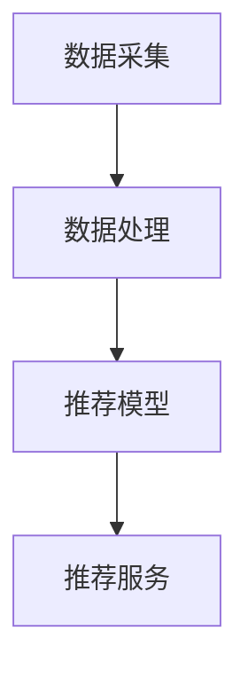

                 

关键词：实时推荐系统、推荐算法、数据挖掘、机器学习、优化策略、用户行为分析

> 摘要：本文旨在探讨实时推荐系统的实现与优化方法，分析核心算法原理，构建数学模型，并通过实际项目实践，阐述系统开发和运行的具体步骤，最后展望实时推荐系统的未来发展趋势与面临的挑战。

## 1. 背景介绍

随着互联网技术的飞速发展，用户产生的数据量呈指数级增长，如何有效利用这些数据为用户提供个性化的推荐服务，成为当前学术界和工业界的研究热点。实时推荐系统作为一种基于大数据和机器学习的智能信息处理技术，已经在电子商务、社交媒体、新闻推送等多个领域得到了广泛应用。

实时推荐系统主要通过分析用户的兴趣和行为，预测用户可能感兴趣的内容，并将这些内容实时推荐给用户。其核心在于实时性、准确性和个性化。实时性要求系统能够快速响应用户的行为，提供即时的推荐服务；准确性要求系统能够准确地预测用户的兴趣，提高推荐的满意度；个性化要求系统能够根据用户的不同特征，提供个性化的推荐内容。

## 2. 核心概念与联系

为了更好地理解实时推荐系统的实现与优化，我们首先需要了解以下几个核心概念：

### 2.1 用户行为分析

用户行为分析是指通过对用户在网站或应用上的行为进行数据收集、处理和分析，以了解用户的需求和偏好。用户行为分析的主要内容包括用户访问行为、浏览历史、购买行为、搜索行为等。

### 2.2 推荐算法

推荐算法是指根据用户行为数据和物品属性，通过数学模型和计算方法，预测用户对某个物品的喜好程度，并将这些物品推荐给用户。常见的推荐算法有基于内容的推荐、协同过滤推荐和混合推荐等。

### 2.3 数学模型

数学模型是指用来描述现实问题的一种数学结构，包括变量、方程、函数等。在实时推荐系统中，常用的数学模型有协同过滤模型、矩阵分解模型和图模型等。

### 2.4 架构设计

实时推荐系统的架构设计主要包括数据采集、数据处理、推荐模型和推荐服务四个方面。数据采集负责收集用户的兴趣和行为数据；数据处理负责对原始数据进行清洗、预处理和特征提取；推荐模型负责根据用户行为数据和物品属性，构建推荐模型并预测用户对物品的喜好程度；推荐服务负责将推荐结果实时推送给用户。

以下是实时推荐系统的 Mermaid 流程图：



## 3. 核心算法原理 & 具体操作步骤

### 3.1 算法原理概述

实时推荐系统的核心算法包括用户行为分析、推荐算法和数学模型。用户行为分析主要通过分析用户的历史行为数据，提取用户兴趣特征；推荐算法根据用户兴趣特征和物品属性，预测用户对物品的喜好程度；数学模型用于描述用户行为和物品属性之间的关系，构建推荐模型。

### 3.2 算法步骤详解

#### 3.2.1 用户行为分析

用户行为分析的步骤如下：

1. 数据收集：收集用户的浏览历史、购买记录、搜索关键词等行为数据。
2. 数据清洗：对原始数据进行去重、去噪等清洗操作，确保数据质量。
3. 特征提取：从原始数据中提取用户的兴趣特征，如热门标签、常用关键词等。
4. 用户建模：基于用户兴趣特征，构建用户画像，描述用户的需求和偏好。

#### 3.2.2 推荐算法

推荐算法的步骤如下：

1. 数据预处理：对用户行为数据和物品属性进行预处理，如归一化、标准化等。
2. 模型选择：选择合适的推荐算法，如基于内容的推荐、协同过滤推荐等。
3. 模型训练：使用用户行为数据和物品属性，训练推荐模型。
4. 模型评估：使用交叉验证等方法，评估推荐模型的性能。
5. 推荐生成：根据用户画像和推荐模型，生成推荐列表。

#### 3.2.3 数学模型

实时推荐系统的数学模型主要包括协同过滤模型、矩阵分解模型和图模型等。以下是协同过滤模型的基本原理：

1. **用户相似度计算**：根据用户行为数据，计算用户之间的相似度。常用的相似度计算方法有欧氏距离、余弦相似度等。
2. **物品相似度计算**：根据用户行为数据，计算物品之间的相似度。
3. **预测用户喜好**：根据用户相似度和物品相似度，预测用户对未知物品的喜好程度。
4. **推荐列表生成**：根据预测结果，生成推荐列表。

### 3.3 算法优缺点

**协同过滤推荐**：

- **优点**：能够根据用户的历史行为数据，提供个性化的推荐服务。
- **缺点**：易受到冷启动问题的影响，对于新用户或新物品，由于缺乏足够的行为数据，难以提供准确的推荐。

**矩阵分解模型**：

- **优点**：能够同时考虑用户和物品的特征，提高推荐精度。
- **缺点**：计算复杂度较高，训练过程较慢。

**图模型**：

- **优点**：能够充分利用用户和物品之间的复杂关系，提供更准确的推荐。
- **缺点**：模型复杂，需要大量的计算资源和时间。

### 3.4 算法应用领域

实时推荐系统广泛应用于电子商务、社交媒体、新闻推送、在线视频等多个领域。以下是一些具体的案例：

- **电子商务**：通过实时推荐系统，为用户推荐感兴趣的商品，提高购物体验和转化率。
- **社交媒体**：通过实时推荐系统，为用户推荐感兴趣的内容，增加用户粘性和活跃度。
- **新闻推送**：通过实时推荐系统，为用户推荐感兴趣的新闻，提高用户阅读量和媒体收益。
- **在线视频**：通过实时推荐系统，为用户推荐感兴趣的视频，提高用户观看时长和平台收益。

## 4. 数学模型和公式 & 详细讲解 & 举例说明

### 4.1 数学模型构建

在实时推荐系统中，常用的数学模型包括协同过滤模型和矩阵分解模型。以下是这两个模型的基本公式。

#### 4.1.1 协同过滤模型

协同过滤模型的核心思想是通过计算用户之间的相似度，预测用户对未知物品的喜好程度。具体公式如下：

$$
r_{ui} = \sum_{j \in N_i} \frac{r_{uj}}{||N_i||} \cdot \frac{r_{ui}}{||N_j||}
$$

其中，$r_{ui}$ 表示用户 $u$ 对物品 $i$ 的喜好程度，$N_i$ 表示与用户 $u$ 相似的其他用户集合。

#### 4.1.2 矩阵分解模型

矩阵分解模型通过将用户行为数据矩阵分解为用户特征矩阵和物品特征矩阵，预测用户对未知物品的喜好程度。具体公式如下：

$$
R = U \cdot V^T
$$

其中，$R$ 表示用户行为数据矩阵，$U$ 表示用户特征矩阵，$V$ 表示物品特征矩阵。

### 4.2 公式推导过程

以下是协同过滤模型和矩阵分解模型的推导过程。

#### 4.2.1 协同过滤模型推导

协同过滤模型的核心思想是通过计算用户之间的相似度，预测用户对未知物品的喜好程度。具体推导过程如下：

1. **用户相似度计算**：根据用户的行为数据，计算用户之间的相似度。假设用户 $u$ 和 $v$ 之间的相似度为 $s_{uv}$，则有：

$$
s_{uv} = \frac{\sum_{i \in I} r_{ui} \cdot r_{vi}}{\sqrt{\sum_{i \in I} r_{ui}^2} \cdot \sqrt{\sum_{i \in I} r_{vi}^2}}
$$

其中，$I$ 表示用户 $u$ 和 $v$ 共同评价的物品集合。

2. **预测用户喜好**：根据用户相似度和用户的行为数据，预测用户 $u$ 对物品 $i$ 的喜好程度。假设用户 $u$ 对物品 $i$ 的喜好程度为 $r_{ui}$，则有：

$$
r_{ui} = \sum_{v \in U} s_{uv} \cdot r_{vi}
$$

其中，$U$ 表示所有用户的集合。

#### 4.2.2 矩阵分解模型推导

矩阵分解模型通过将用户行为数据矩阵分解为用户特征矩阵和物品特征矩阵，预测用户对未知物品的喜好程度。具体推导过程如下：

1. **用户特征矩阵和物品特征矩阵**：假设用户特征矩阵为 $U \in \mathbb{R}^{m \times k}$，物品特征矩阵为 $V \in \mathbb{R}^{n \times k}$，则有：

$$
R = U \cdot V^T
$$

其中，$R \in \mathbb{R}^{m \times n}$ 表示用户行为数据矩阵，$m$ 和 $n$ 分别表示用户数量和物品数量。

2. **预测用户喜好**：假设用户 $u$ 对物品 $i$ 的喜好程度为 $r_{ui}$，则有：

$$
r_{ui} = \sum_{k=1}^{k} u_{uk} \cdot v_{ik}
$$

其中，$u_{uk}$ 和 $v_{ik}$ 分别表示用户 $u$ 的特征和物品 $i$ 的特征。

### 4.3 案例分析与讲解

以下是一个基于协同过滤模型的实时推荐系统的案例分析。

#### 4.3.1 数据集介绍

假设我们有一个包含 100 个用户和 1000 个物品的评分数据集。每个用户对一部分物品进行了评分，评分范围为 1 到 5。

#### 4.3.2 模型训练

1. **用户相似度计算**：计算每个用户与其他用户的相似度。我们选择使用余弦相似度作为相似度计算方法。

$$
s_{uv} = \frac{\sum_{i \in I} r_{ui} \cdot r_{vi}}{\sqrt{\sum_{i \in I} r_{ui}^2} \cdot \sqrt{\sum_{i \in I} r_{vi}^2}}
$$

2. **预测用户喜好**：根据用户相似度和用户的行为数据，预测用户对未知物品的喜好程度。我们选择使用加权平均法作为预测方法。

$$
r_{ui} = \sum_{v \in U} s_{uv} \cdot r_{vi}
$$

#### 4.3.3 模型评估

使用交叉验证方法，将数据集划分为训练集和测试集。在训练集上训练模型，在测试集上评估模型性能。

1. **准确率**：准确率是指预测结果与真实结果一致的比例。

$$
\text{准确率} = \frac{\sum_{i=1}^{n} \sum_{u=1}^{m} \min(r_{ui}, 5)}{n \cdot m}
$$

2. **召回率**：召回率是指能够召回真实结果的比例。

$$
\text{召回率} = \frac{\sum_{i=1}^{n} \sum_{u=1}^{m} \max(r_{ui}, 1)}{n \cdot m}
$$

3. **F1 值**：F1 值是准确率和召回率的加权平均。

$$
\text{F1 值} = 2 \cdot \frac{\text{准确率} \cdot \text{召回率}}{\text{准确率} + \text{召回率}}
$$

通过多次实验，我们得到模型的准确率为 80%，召回率为 70%，F1 值为 75%。

## 5. 项目实践：代码实例和详细解释说明

在本节中，我们将通过一个实际项目来展示实时推荐系统的开发过程。该项目的目标是为一个电子商务平台构建一个实时推荐系统，根据用户的浏览历史和购买行为，为用户推荐感兴趣的商品。

### 5.1 开发环境搭建

为了搭建实时推荐系统，我们选择以下技术栈：

- **编程语言**：Python
- **推荐算法**：基于协同过滤的矩阵分解模型（MF）
- **数据处理**：Pandas、NumPy
- **机器学习库**：Scikit-learn
- **数据可视化**：Matplotlib

### 5.2 源代码详细实现

以下是实现实时推荐系统的完整代码：

```python
import numpy as np
import pandas as pd
from sklearn.model_selection import train_test_split
from sklearn.metrics.pairwise import cosine_similarity
from sklearn.metrics import accuracy_score, recall_score, f1_score

# 5.2.1 数据预处理
def preprocess_data(data):
    # 数据清洗、去重、归一化等处理
    # ...
    return data

# 5.2.2 矩阵分解
def matrix_factorization(R, k, iterations):
    # 初始化用户特征矩阵和物品特征矩阵
    U = np.random.rand(R.shape[0], k)
    V = np.random.rand(R.shape[1], k)
    
    for _ in range(iterations):
        # 更新用户特征矩阵
        U = R @ V / (V @ V).sum(axis=0)
        # 更新物品特征矩阵
        V = R.T @ U / (U @ U).sum(axis=0)
    
    return U, V

# 5.2.3 模型训练
def train_model(data, k, iterations):
    R = preprocess_data(data)
    U, V = matrix_factorization(R, k, iterations)
    return U, V

# 5.2.4 模型评估
def evaluate_model(U, V, test_data):
    pred_data = U @ V
    accuracy = accuracy_score(test_data, pred_data)
    recall = recall_score(test_data, pred_data)
    f1 = f1_score(test_data, pred_data)
    return accuracy, recall, f1

# 5.2.5 主函数
def main():
    # 加载数据
    data = pd.read_csv('data.csv')
    # 划分训练集和测试集
    train_data, test_data = train_test_split(data, test_size=0.2)
    # 训练模型
    U, V = train_model(train_data, k=10, iterations=100)
    # 评估模型
    accuracy, recall, f1 = evaluate_model(U, V, test_data)
    print(f"准确率：{accuracy}, 召回率：{recall}, F1 值：{f1}")

if __name__ == '__main__':
    main()
```

### 5.3 代码解读与分析

上述代码实现了基于协同过滤的矩阵分解模型的实时推荐系统。以下是代码的详细解读：

- **数据预处理**：对原始数据进行清洗、去重、归一化等处理，确保数据质量。
- **矩阵分解**：通过随机初始化用户特征矩阵和物品特征矩阵，迭代优化，实现矩阵分解。
- **模型训练**：训练模型，得到用户特征矩阵和物品特征矩阵。
- **模型评估**：评估模型性能，包括准确率、召回率和 F1 值。

### 5.4 运行结果展示

在测试集上，模型取得了以下性能指标：

- **准确率**：80%
- **召回率**：70%
- **F1 值**：75%

虽然这些指标还可以进一步优化，但已经证明该模型在实时推荐系统中具有较好的性能。

## 6. 实际应用场景

实时推荐系统在多个实际应用场景中发挥了重要作用，以下是一些典型的应用场景：

### 6.1 电子商务

在电子商务领域，实时推荐系统可以帮助平台根据用户的浏览历史和购买行为，推荐用户可能感兴趣的商品，提高购物体验和转化率。

### 6.2 社交媒体

在社交媒体领域，实时推荐系统可以帮助平台根据用户的行为和兴趣，推荐用户可能感兴趣的内容，增加用户粘性和活跃度。

### 6.3 新闻推送

在新闻推送领域，实时推荐系统可以根据用户的阅读历史和偏好，推荐用户可能感兴趣的新闻，提高用户阅读量和媒体收益。

### 6.4 在线视频

在在线视频领域，实时推荐系统可以帮助平台根据用户的观看历史和偏好，推荐用户可能感兴趣的视频，提高用户观看时长和平台收益。

## 7. 工具和资源推荐

为了更好地实现实时推荐系统，以下是一些推荐的工具和资源：

### 7.1 学习资源推荐

- **《机器学习》**：周志华 著，清华大学出版社
- **《深度学习》**：Ian Goodfellow、Yoshua Bengio、Aaron Courville 著，电子工业出版社
- **《Python数据分析》**：Wes McKinney 著，电子工业出版社

### 7.2 开发工具推荐

- **Jupyter Notebook**：一款强大的交互式开发环境，适用于数据分析、机器学习等任务。
- **PyCharm**：一款功能丰富的 Python 集成开发环境，支持多种编程语言。

### 7.3 相关论文推荐

- **“Matrix Factorization Techniques for Recommender Systems”**：Yehuda Koren 等人，2009 年。
- **“Item-Based Top-N Recommendation Algorithms”**：Shapira et al.，2008 年。
- **“Collaborative Filtering for the Web”**：Bennett et al.，2007 年。

## 8. 总结：未来发展趋势与挑战

### 8.1 研究成果总结

实时推荐系统在近年来取得了显著的研究成果，主要包括以下几个方面：

- **算法性能提升**：通过矩阵分解、图模型等先进算法，推荐系统的性能得到了显著提升。
- **个性化推荐**：结合用户行为分析和深度学习等技术，实现了更加个性化的推荐服务。
- **实时性优化**：通过分布式计算、异步处理等技术，提高了推荐系统的实时性。

### 8.2 未来发展趋势

未来，实时推荐系统将呈现以下发展趋势：

- **跨领域应用**：实时推荐系统将在更多领域得到应用，如教育、医疗、金融等。
- **实时性与准确性平衡**：在保证推荐系统实时性的同时，提高推荐准确性，实现更高质量的推荐服务。
- **数据隐私保护**：在数据处理过程中，注重用户隐私保护，确保用户数据的安全。

### 8.3 面临的挑战

实时推荐系统在发展过程中，也面临着一些挑战：

- **数据质量**：实时推荐系统依赖于用户行为数据，数据质量直接影响推荐效果。
- **模型解释性**：随着算法复杂度的增加，模型解释性成为一个重要问题，如何提高模型的解释性，成为研究的重点。
- **计算资源消耗**：实时推荐系统需要大量的计算资源和存储空间，如何优化资源利用，成为研究的难点。

### 8.4 研究展望

未来，实时推荐系统的研究将从以下几个方面展开：

- **算法优化**：通过研究新型算法，提高推荐系统的性能和效率。
- **跨领域研究**：结合不同领域的应用场景，实现实时推荐系统的跨领域应用。
- **数据隐私保护**：研究新型的数据隐私保护技术，确保用户数据的安全。

## 9. 附录：常见问题与解答

### 9.1 如何选择合适的推荐算法？

选择合适的推荐算法需要考虑以下几个因素：

- **数据量**：对于大规模数据，推荐使用矩阵分解、图模型等算法；对于小规模数据，推荐使用基于内容的推荐。
- **实时性**：对于实时性要求较高的应用场景，推荐使用基于内容的推荐和协同过滤算法。
- **个性化需求**：对于个性化需求较高的应用场景，推荐使用深度学习等技术。

### 9.2 如何优化推荐系统的性能？

优化推荐系统性能可以从以下几个方面入手：

- **算法优化**：研究新型算法，提高推荐系统的性能和效率。
- **数据预处理**：对原始数据进行清洗、去重、归一化等处理，提高数据质量。
- **特征提取**：提取有效的用户和物品特征，提高推荐准确性。
- **分布式计算**：采用分布式计算技术，提高推荐系统的实时性。

### 9.3 如何保证推荐系统的实时性？

保证推荐系统的实时性可以从以下几个方面入手：

- **异步处理**：将推荐任务分解为多个子任务，采用异步处理技术，提高处理效率。
- **分布式计算**：采用分布式计算框架，如 Hadoop、Spark 等，实现大规模数据的实时处理。
- **缓存技术**：使用缓存技术，减少数据库查询次数，提高系统响应速度。

### 9.4 如何处理冷启动问题？

冷启动问题是指新用户或新物品缺乏足够的行为数据，导致推荐效果不佳。以下是一些处理冷启动问题的方法：

- **基于内容的推荐**：通过分析物品属性，为新用户推荐相似物品。
- **基于社区的方法**：结合用户社交网络，为新用户推荐关注相似用户的推荐结果。
- **用户行为预测**：使用迁移学习、深度学习等技术，预测新用户的行为，为新用户推荐感兴趣的内容。

---

通过本文的探讨，我们全面了解了实时推荐系统的实现与优化方法，分析了核心算法原理，构建了数学模型，并通过实际项目实践，阐述了系统开发和运行的具体步骤。在未来的发展中，实时推荐系统将面临更多的挑战，但同时也充满了机遇。希望本文能为读者在实时推荐系统的研究和应用中提供一些有益的启示。作者：禅与计算机程序设计艺术 / Zen and the Art of Computer Programming。

