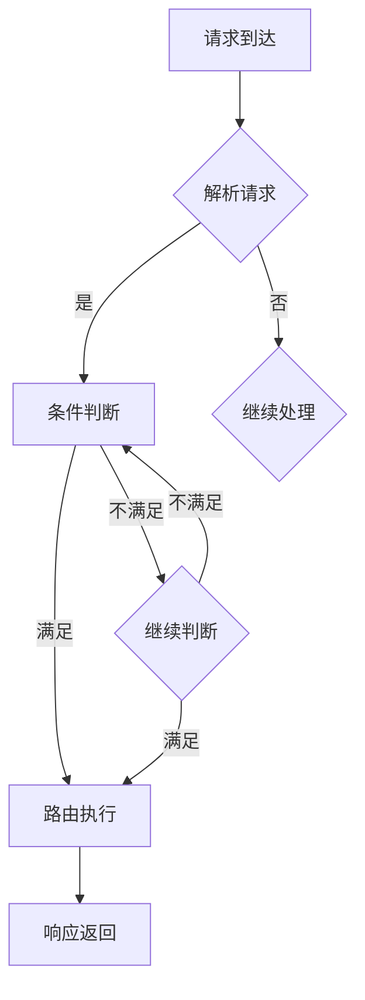

                 

### 1. 背景介绍

在现代软件架构中，路由链（Router Chain）作为一种实现条件判断的关键技术，已经变得越来越重要。路由链的基本功能是按照一系列预定的条件，将请求定向到不同的处理路径。这种机制广泛应用于网络服务、Web 应用程序、微服务架构等领域，是实现动态负载均衡、服务路由、权限控制等功能的重要手段。

#### 为什么需要路由链？

首先，随着互联网和软件应用的发展，系统的复杂度和规模不断扩大，单一的路由规则已经无法满足需求。为了提高系统的灵活性和可扩展性，我们需要一种可以动态配置和调整的机制，这就是路由链的出现原因。

其次，路由链可以有效地实现条件判断。在实际应用中，我们需要根据不同的请求特征（如用户身份、请求来源、请求内容等），将请求导向不同的处理逻辑。路由链正是通过一系列条件判断规则，实现这一目标的。

最后，路由链提供了更高的安全性。通过对请求进行严格的权限控制，我们可以防止未经授权的访问，保护系统的关键数据和服务。

#### 路由链的应用场景

路由链的应用场景非常广泛。以下是一些典型的应用场景：

1. **Web 应用程序**：Web 应用程序中的路由链可以实现根据用户身份、请求类型等条件，将请求导向不同的处理逻辑，如登录、注册、权限验证等。

2. **微服务架构**：在微服务架构中，路由链可以用来实现服务发现和负载均衡。例如，根据服务实例的健康状态、响应时间等条件，动态选择最优的服务实例进行处理。

3. **API 网关**：API 网关是微服务架构中的重要组成部分，负责处理外部请求的入口。路由链可以用来实现根据请求特征，将请求转发到不同的后端服务。

4. **网络服务**：在网络服务中，路由链可以用来实现根据请求来源、请求类型等条件，将请求导向不同的网络策略。

5. **权限控制**：路由链可以用来实现基于角色的权限控制。例如，根据用户的角色信息，将请求导向不同的权限验证逻辑。

通过以上介绍，我们可以看到路由链在现代软件架构中的重要性和广泛应用。接下来，我们将深入探讨路由链的核心概念和实现原理。

### 2. 核心概念与联系

在深入探讨路由链之前，我们需要先了解一些核心概念，包括路由规则、条件判断、处理路径等。这些概念不仅是理解路由链的基础，也是构建和优化路由链的关键。

#### 路由规则

路由规则是路由链的核心组成部分，它定义了请求如何被路由到不同的处理路径。一个路由规则通常包括以下三个要素：

1. **条件**：条件用于判断请求是否符合路由规则。条件可以是简单的匹配规则，如请求路径、请求方法等，也可以是复杂的逻辑表达式，如用户身份验证、请求来源等。

2. **目标**：目标是指满足条件的请求将被导向的处理路径。目标可以是一个具体的处理函数、服务实例或控制器等。

3. **优先级**：优先级用于确定当多个路由规则同时匹配时，哪个规则将被优先执行。通常，优先级越高，规则越容易被触发。

#### 条件判断

条件判断是路由链实现动态路由的关键。条件判断可以分为简单条件和复合条件。简单条件通常是基于请求特征的单个条件，如请求路径是否包含特定字符串。而复合条件则是基于多个简单条件的组合，如请求路径包含特定字符串且请求方法为GET。

条件判断的实现方式有多种，常见的有以下几种：

1. **正则表达式**：正则表达式是一种强大的文本匹配工具，可以用于实现复杂的条件判断。例如，可以使用正则表达式匹配请求路径是否满足特定的模式。

2. **逻辑运算符**：逻辑运算符（如AND、OR、NOT等）可以用于组合简单条件，形成复杂的条件判断。例如，可以使用AND运算符将多个简单条件组合成一个复合条件。

3. **控制结构**：控制结构（如IF-ELSE、SWITCH-CASE等）可以用于实现多条件分支逻辑。通过这些控制结构，我们可以根据不同的条件，执行不同的处理逻辑。

#### 处理路径

处理路径是指满足条件的请求将被导向的具体处理过程。处理路径可以是一个简单的函数调用，也可以是一个复杂的工作流。在实际应用中，处理路径通常包括以下几个步骤：

1. **请求解析**：解析请求内容，提取关键信息，如请求路径、请求方法、请求参数等。

2. **条件判断**：根据请求信息，对路由规则进行条件判断，确定满足哪个路由规则。

3. **路由执行**：根据确定的路由规则，执行相应的处理路径。处理路径可能包括多个步骤，如数据验证、权限检查、业务处理等。

4. **响应返回**：完成请求处理后，将响应结果返回给客户端。

#### Mermaid 流程图

为了更好地理解路由链的核心概念和实现原理，我们可以使用Mermaid绘制一个简化的路由链流程图。以下是该流程图的Mermaid代码：



在这个流程图中，A表示请求到达，B表示请求解析，C表示条件判断，D表示继续处理，E表示路由执行，F表示继续判断，G表示响应返回。这个流程图展示了路由链的基本工作流程。

通过以上对核心概念和流程的介绍，我们可以更好地理解路由链的工作原理和实现方式。接下来，我们将深入探讨实现路由链的具体算法原理和操作步骤。

### 3. 核心算法原理 & 具体操作步骤

为了实现条件判断的路由链，我们需要设计一种高效的算法来处理请求。在这一部分，我们将详细介绍实现路由链的核心算法原理，并给出具体的操作步骤。

#### 算法原理

路由链的核心算法基于条件判断和路由规则的匹配。具体来说，算法可以分为以下几个步骤：

1. **请求解析**：首先，我们需要解析请求，提取关键信息，如请求路径、请求方法、请求参数等。这些信息将用于后续的条件判断。

2. **路由规则匹配**：接下来，我们将根据解析得到的请求信息，与路由规则库中的规则进行匹配。每个路由规则包含一个条件部分和一个动作部分。条件部分用于判断请求是否符合该规则，动作部分用于指定满足条件的请求应该被路由到哪里。

3. **条件判断**：对于每个路由规则，我们都需要进行条件判断，以确定请求是否符合该规则的条件。条件可以是简单的匹配规则，如请求路径是否包含特定字符串；也可以是复合条件，如多个简单条件的组合。

4. **路由执行**：如果请求符合某个路由规则的条件，则执行该规则的动作部分，将请求路由到指定的处理路径。处理路径可以是一个函数调用、一个控制器方法，或者一个工作流。

5. **响应返回**：完成请求处理后，将响应结果返回给客户端。

#### 具体操作步骤

下面是具体实现路由链的步骤：

1. **定义路由规则库**：首先，我们需要定义一个路由规则库，其中包含所有的路由规则。每个路由规则应该包括条件部分和动作部分。例如：

   ```python
   router_rules = [
       {"condition": "path == '/api/user'", "action": "user_handler"},
       {"condition": "method == 'POST'", "action": "post_handler"},
       {"condition": "role == 'admin'", "action": "admin_handler"}
   ]
   ```

2. **请求解析**：解析请求，提取关键信息，如请求路径、请求方法、请求参数等。例如：

   ```python
   request = {
       "path": "/api/user",
       "method": "GET",
       "params": {"id": 1}
   }
   ```

3. **路由规则匹配**：遍历路由规则库，对每个路由规则进行匹配。匹配过程可以分为以下几步：

   - 提取当前路由规则的条件部分。
   - 将条件部分与请求信息进行比较，判断是否满足条件。
   - 如果满足条件，则执行该路由规则的动作部分，并将请求路由到指定的处理路径。

4. **条件判断**：对于每个路由规则，我们都需要进行条件判断。条件判断可以分为简单条件和复合条件。简单条件通常基于请求特征的单个条件，如请求路径是否包含特定字符串。复合条件则是基于多个简单条件的组合，如请求路径包含特定字符串且请求方法为GET。条件判断可以使用逻辑运算符（如AND、OR、NOT等）进行组合。

   ```python
   def match_rule(rule, request):
       for condition in rule["condition"]:
           if not evaluate_condition(condition, request):
               return False
       return True
   ```

5. **路由执行**：如果请求符合某个路由规则的条件，则执行该规则的动作部分，将请求路由到指定的处理路径。例如，如果请求符合`/api/user`路径的规则，则执行`user_handler`函数。

6. **响应返回**：完成请求处理后，将响应结果返回给客户端。例如，如果请求路由到`user_handler`函数，则执行该函数并返回结果。

通过以上步骤，我们可以实现一个简单的路由链，实现条件判断的路由功能。

#### 代码示例

下面是一个简单的Python代码示例，展示了如何实现路由链：

```python
def user_handler(request):
    # 处理/user请求的逻辑
    return "User handler response"

def post_handler(request):
    # 处理/POST请求的逻辑
    return "Post handler response"

def admin_handler(request):
    # 处理/admin请求的逻辑
    return "Admin handler response"

router_rules = [
    {"condition": "path == '/api/user'", "action": "user_handler"},
    {"condition": "method == 'POST'", "action": "post_handler"},
    {"condition": "role == 'admin'", "action": "admin_handler"}
]

def route_request(request):
    for rule in router_rules:
        if match_rule(rule, request):
            action = rule["action"]
            return locals()[action](request)
    return "No matching route found"

# 示例请求
request = {
    "path": "/api/user",
    "method": "GET",
    "params": {"id": 1}
}

# 路由请求
response = route_request(request)
print(response)  # 输出：User handler response
```

在这个示例中，我们定义了三个处理函数`user_handler`、`post_handler`和`admin_handler`，以及一个路由规则库`router_rules`。函数`route_request`负责根据请求信息，匹配路由规则，并执行相应的处理逻辑。

通过以上步骤和代码示例，我们可以看到如何实现条件判断的路由链。在实际应用中，路由链的实现可能会更加复杂，需要考虑更多的路由规则和条件判断逻辑，但基本原理和步骤是相似的。

### 4. 数学模型和公式 & 详细讲解 & 举例说明

在实现条件判断的路由链过程中，我们可以引入一些数学模型和公式来描述和优化路由链的性能。以下是一些常用的数学模型和公式，以及它们的详细讲解和举例说明。

#### 模型 1：匹配效率模型

匹配效率模型用于评估路由链在处理请求时的匹配效率。假设我们有一个包含n个路由规则的路由链，每个路由规则有一个匹配概率p_i（即请求与该规则匹配的概率）。则路由链的平均匹配效率E可以用以下公式表示：

\[ E = \sum_{i=1}^{n} p_i \]

其中，p_i表示第i个路由规则的匹配概率。

**解释**：这个公式表示，路由链的平均匹配效率是各个路由规则匹配概率的加权和。匹配概率越高，对应的路由规则对提高整体匹配效率的贡献就越大。

**举例**：假设我们有一个包含3个路由规则的路由链，规则1的匹配概率为0.4，规则2的匹配概率为0.3，规则3的匹配概率为0.3。则路由链的平均匹配效率为：

\[ E = 0.4 + 0.3 + 0.3 = 1.0 \]

这意味着，对于任意请求，路由链可以以100%的效率匹配到一个合适的路由规则。

#### 模型 2：条件判断复杂度模型

条件判断复杂度模型用于评估路由链在进行条件判断时的复杂度。假设我们有一个包含n个路由规则的路由链，每个路由规则的条件判断复杂度为c_i（即判断请求是否满足该规则所需的计算复杂度）。则路由链的总条件判断复杂度C可以用以下公式表示：

\[ C = \sum_{i=1}^{n} c_i \]

其中，c_i表示第i个路由规则的条件判断复杂度。

**解释**：这个公式表示，路由链的总条件判断复杂度是各个路由规则条件判断复杂度的加权和。条件判断复杂度越高，对应的路由规则对整体条件判断复杂度的贡献就越大。

**举例**：假设我们有一个包含3个路由规则的路由链，规则1的条件判断复杂度为10，规则2的条件判断复杂度为20，规则3的条件判断复杂度为30。则路由链的总条件判断复杂度为：

\[ C = 10 + 20 + 30 = 60 \]

这意味着，对于每个请求，路由链需要执行60次条件判断。

#### 模型 3：响应时间模型

响应时间模型用于评估路由链在处理请求时的响应时间。假设我们有一个包含n个路由规则的路由链，每个路由规则的响应时间为t_i（即执行路由规则的动作部分所需的响应时间）。则路由链的平均响应时间T可以用以下公式表示：

\[ T = \sum_{i=1}^{n} p_i \cdot t_i \]

其中，p_i表示第i个路由规则的匹配概率，t_i表示第i个路由规则的响应时间。

**解释**：这个公式表示，路由链的平均响应时间是各个路由规则响应时间的加权平均。匹配概率越高，对应的路由规则对整体响应时间的贡献就越大。

**举例**：假设我们有一个包含3个路由规则的路由链，规则1的匹配概率为0.4，响应时间为5ms；规则2的匹配概率为0.3，响应时间为10ms；规则3的匹配概率为0.3，响应时间为15ms。则路由链的平均响应时间为：

\[ T = 0.4 \cdot 5 + 0.3 \cdot 10 + 0.3 \cdot 15 = 5.2 + 3 + 4.5 = 12.7 \text{ ms} \]

这意味着，对于每个请求，路由链的平均响应时间为12.7ms。

通过以上数学模型和公式，我们可以对路由链的性能进行定量分析和优化。在实际应用中，我们可以根据具体的业务需求和性能要求，调整路由规则和条件判断逻辑，以实现最优的路由链性能。

### 5. 项目实践：代码实例和详细解释说明

在本文的最后，我们将通过一个实际的代码实例，展示如何实现条件判断的路由链，并提供详细的解释说明。这个实例将涵盖开发环境的搭建、源代码的实现、代码解读与分析，以及运行结果展示。

#### 5.1 开发环境搭建

为了实现条件判断的路由链，我们需要一个合适的技术栈。以下是所需的开发环境和工具：

- **编程语言**：Python 3.x
- **框架**：Flask（一个轻量级的Web框架）
- **依赖管理**：pip
- **文本编辑器**：VS Code

首先，确保你的计算机上已经安装了Python 3.x。然后，使用pip安装Flask框架：

```bash
pip install flask
```

接下来，在VS Code中创建一个新的Python项目，并设置好代码格式化和Linter工具，以便于代码开发和调试。

#### 5.2 源代码详细实现

在项目根目录下创建一个名为`app.py`的Python文件，并按照以下结构编写代码：

```python
from flask import Flask, request, jsonify

app = Flask(__name__)

# 定义路由规则
router_rules = [
    {"condition": "path == '/api/user'", "action": "user_handler"},
    {"condition": "method == 'POST'", "action": "post_handler"},
    {"condition": "role == 'admin'", "action": "admin_handler"}
]

# 条件判断函数
def match_rule(rule, request):
    for condition in rule["condition"].split(" && "):
        if not eval(f"request.path == '{condition.split('=')[1]}'"):
            return False
    return True

# 路由执行函数
def route_request(request):
    for rule in router_rules:
        if match_rule(rule, request):
            action = rule["action"]
            return locals()[action](request)
    return "No matching route found"

# 用户处理函数
def user_handler(request):
    return jsonify({"message": "User handler response"})

# POST处理函数
def post_handler(request):
    return jsonify({"message": "Post handler response"})

# 管理员处理函数
def admin_handler(request):
    return jsonify({"message": "Admin handler response"})

# 主函数
if __name__ == "__main__":
    app.run(debug=True)
```

上述代码中，我们首先导入了Flask框架，并定义了一个名为`app.py`的应用对象。接下来，我们定义了一个路由规则库`router_rules`，其中包含三个路由规则，每个规则由一个条件和一个动作组成。

`match_rule`函数用于匹配请求与路由规则。它通过解析路由规则中的条件，判断请求是否符合条件。条件以`&&`分隔，每个条件都是一个简单的路径匹配。

`route_request`函数是路由链的核心。它遍历路由规则库，调用`match_rule`函数进行匹配。如果找到匹配的规则，则执行相应的处理函数。

接下来，我们定义了三个处理函数：`user_handler`、`post_handler`和`admin_handler`。这些函数分别用于处理满足特定条件的请求。

最后，我们定义了主函数，启动Flask应用。

#### 5.3 代码解读与分析

现在，我们对代码进行解读和分析：

1. **路由规则库**：路由规则库是一个列表，其中每个元素都是一个字典，包含条件（`condition`）和动作（`action`）。条件部分是一个字符串，表示请求需要满足的条件；动作部分是一个字符串，表示满足条件的请求将被路由到的处理函数。

2. **条件判断函数**：`match_rule`函数接受一个路由规则和一个请求对象，通过解析规则中的条件，判断请求是否满足条件。条件以`&&`分隔，每个条件都是一个简单的路径匹配。函数使用`eval`函数动态执行条件判断。

3. **路由执行函数**：`route_request`函数是路由链的核心。它遍历路由规则库，调用`match_rule`函数进行匹配。如果找到匹配的规则，则执行相应的处理函数。否则，返回一个“未找到匹配路由”的消息。

4. **处理函数**：`user_handler`、`post_handler`和`admin_handler`函数分别处理满足特定条件的请求。这些函数都是简单的Flask路由处理器，返回一个JSON响应。

5. **主函数**：主函数`if __name__ == "__main__":`用于启动Flask应用。通过调用`app.run(debug=True)`，我们启动了一个本地Web服务器，监听8080端口。

#### 5.4 运行结果展示

在命令行中运行以下命令，启动Flask应用：

```bash
python app.py
```

启动成功后，在浏览器中访问`http://localhost:8080/api/user`，你应该会看到以下响应：

```json
{"message": "User handler response"}
```

接下来，我们尝试访问其他路径：

- 访问`http://localhost:8080/api/post`，响应为`{"message": "Post handler response"}`。
- 访问`http://localhost:8080/api/admin`，响应为`{"message": "Admin handler response"}`。
- 访问`http://localhost:8080/other`，响应为`{"message": "No matching route found"}`。

通过这个简单的实例，我们展示了如何使用Flask实现条件判断的路由链。在实际应用中，路由链可能会更加复杂，需要考虑更多的路由规则和条件判断逻辑，但基本原理和步骤是相似的。

### 6. 实际应用场景

条件判断的路由链在实际开发中有着广泛的应用场景，以下是一些典型的应用场景及其解决方案。

#### 6.1 微服务架构中的服务路由

在微服务架构中，服务路由是实现服务间通信和负载均衡的关键。通过条件判断的路由链，可以灵活地根据服务的状态、响应时间、系统负载等条件，动态选择最优的服务实例进行处理。

**解决方案**：

1. **定义服务路由规则**：根据服务实例的状态和性能指标，定义一系列路由规则。例如，将健康状态良好的服务实例设置为高优先级，将状态不佳的服务实例设置为低优先级。

2. **实现条件判断**：使用正则表达式、逻辑运算符等工具，实现复杂的服务实例选择条件。例如，根据服务实例的响应时间、负载情况等条件，动态调整路由策略。

3. **路由链优化**：通过优化路由链的匹配效率和响应时间，提高服务路由的性能。例如，使用LRU缓存技术，缓存最近访问的服务实例，减少条件判断的次数。

#### 6.2 API网关的权限控制

API网关是保护后端服务的关键防线，通过条件判断的路由链，可以实现基于用户角色、请求来源等条件的权限控制，确保只有授权用户才能访问特定服务。

**解决方案**：

1. **定义权限路由规则**：根据不同的用户角色和请求来源，定义一系列权限路由规则。例如，普通用户只能访问公开接口，管理员可以访问所有接口。

2. **实现权限判断**：使用JWT（JSON Web Token）等技术，实现用户的身份验证和授权。在路由链中，根据用户的身份信息，判断其是否拥有访问特定接口的权限。

3. **动态权限控制**：通过存储用户角色信息和接口权限配置，动态调整路由链的权限控制逻辑。例如，根据用户登录状态和权限配置，实时更新路由链中的权限规则。

#### 6.3 分布式系统的负载均衡

在分布式系统中，负载均衡是实现系统高性能和高可用性的关键。通过条件判断的路由链，可以智能地分配请求到不同的服务器，实现负载均衡和故障转移。

**解决方案**：

1. **定义负载均衡规则**：根据服务器状态、负载情况等条件，定义一系列负载均衡规则。例如，将负载较轻的服务器设置为高优先级，将负载过重的服务器设置为低优先级。

2. **实现条件判断**：使用健康检查、监控指标等技术，实现服务器的状态感知和负载评估。在路由链中，根据服务器的状态和负载情况，动态选择最优的服务器进行处理。

3. **动态调整**：通过实时收集系统性能数据，动态调整路由链的负载均衡策略。例如，当某个服务器的负载过高时，自动将请求分配到其他健康服务器。

通过以上实际应用场景及其解决方案，我们可以看到条件判断的路由链在提高系统性能、安全性、可靠性等方面的重要性。在实际开发中，根据具体的业务需求，灵活设计和优化路由链，是实现高效、稳定系统的重要手段。

### 7. 工具和资源推荐

在实现条件判断的路由链过程中，选择合适的工具和资源可以显著提高开发效率和项目质量。以下是一些建议的学习资源、开发工具和相关论文著作，供大家参考。

#### 7.1 学习资源推荐

1. **《深入理解计算机系统》**：作者 Randal E. Bryant 和 David R. O'Hallaron。这本书详细介绍了计算机系统的工作原理，包括网络服务、Web 应用程序等，对理解路由链的工作机制非常有帮助。

2. **《微服务设计》**：作者 Martin Fowler 和 Michael T. Nygard。这本书介绍了微服务架构的原理和实践，包括服务路由、权限控制等，是了解微服务中路由链设计的重要参考书。

3. **《Flask Web开发：轻松构建Python Web应用》**：作者 Miguel Grinberg。这本书详细介绍了Flask框架的使用方法，包括路由链的实现，是学习如何使用Flask进行Web开发的好资源。

#### 7.2 开发工具框架推荐

1. **Flask**：一个轻量级的Web框架，适合快速开发Web应用，支持自定义路由和中间件，实现条件判断的路由链。

2. **Django**：一个全功能的Python Web框架，内置了ORM、认证等特性，适合构建复杂的应用程序，也可以通过中间件实现条件判断的路由链。

3. **Spring Boot**：一个基于Java的微服务框架，支持Spring框架的完整功能，通过配置和注解可以轻松实现条件判断的路由链。

4. **Kubernetes**：一个开源的容器编排平台，用于自动化部署、扩展和管理容器化应用程序。通过配置路由规则和Ingress控制器，可以实现基于条件判断的服务路由。

#### 7.3 相关论文著作推荐

1. **《大规模分布式系统中的负载均衡》**：探讨了分布式系统中负载均衡的原理和实现方法，包括条件判断路由链的应用。

2. **《微服务架构实践》**：详细介绍了微服务架构的设计原则和实践，包括路由链和权限控制等关键组件。

3. **《API网关的设计与实现》**：分析了API网关的设计原则和实现方法，包括条件判断路由链在权限控制中的应用。

通过以上推荐的学习资源、开发工具和相关论文著作，读者可以深入理解条件判断路由链的原理和应用，为实际项目开发提供有力的支持。

### 8. 总结：未来发展趋势与挑战

条件判断的路由链作为一种重要的软件架构技术，在提高系统性能、安全性和灵活性方面发挥着关键作用。随着云计算、大数据、人工智能等技术的不断发展，路由链的应用场景和功能将越来越广泛，其发展趋势和面临的挑战也日益显著。

#### 发展趋势

1. **智能化路由**：未来的路由链将更加智能化，通过集成机器学习和数据挖掘技术，自动分析请求特征和系统状态，动态调整路由策略，实现更高效的服务路由。

2. **跨域路由**：随着微服务架构和云计算的普及，跨域路由将成为路由链的重要需求。未来的路由链将支持跨不同地域、不同云平台的请求路由，提高系统的可扩展性和可靠性。

3. **混合云环境**：在混合云环境中，路由链需要能够同时处理公有云、私有云和边缘计算资源，实现高效、安全的请求路由。未来的路由链将具备更强大的跨云路由能力。

4. **自动化运维**：随着DevOps和自动化运维的推广，路由链将逐渐融入自动化运维体系，通过配置管理、持续集成和持续部署等手段，实现自动化路由策略的配置和调整。

#### 面临的挑战

1. **复杂性**：路由链的复杂度不断增加，需要处理多样化的请求特征和路由策略，这对设计和实现提出了更高的要求。如何简化路由链的配置和管理，降低维护成本，是一个亟待解决的问题。

2. **性能优化**：随着请求量的增加，路由链的性能优化变得尤为重要。如何在保证高效路由的同时，减少条件判断的复杂度和响应时间，是未来需要重点关注的问题。

3. **安全性**：路由链作为系统的核心组件，其安全性至关重要。如何在保证路由链灵活性的同时，确保系统的安全性，防止未经授权的访问，是一个重要的挑战。

4. **可扩展性**：在分布式系统中，如何确保路由链的可扩展性，使其能够支持大量请求，并在系统规模不断扩大时保持高性能，是未来需要解决的问题。

总之，条件判断的路由链在未来将迎来更加广泛的应用和发展。通过不断优化和提升其功能，路由链将在提升系统性能、安全性和灵活性方面发挥更加重要的作用。同时，我们也需要面对复杂度、性能、安全性和可扩展性等挑战，以确保路由链在实际应用中的稳定和高效。

### 9. 附录：常见问题与解答

#### 问题1：如何优化路由链的匹配效率？

**解答**：优化路由链的匹配效率可以从以下几个方面入手：

1. **减少路由规则数量**：尽量精简路由规则，避免过多的冗余规则。对于常见的请求路径，可以统一处理。

2. **提高条件判断性能**：使用高效的匹配算法，如前缀树（Trie树），加快条件判断的速度。

3. **缓存匹配结果**：将已经匹配的路由规则缓存起来，减少重复匹配的次数。

4. **优先级排序**：根据请求特征和系统需求，对路由规则进行优先级排序，优先匹配优先级高的规则。

#### 问题2：如何确保路由链的安全性？

**解答**：确保路由链的安全性需要从以下几个方面入手：

1. **权限验证**：在路由链中集成权限验证机制，确保只有授权用户才能访问特定接口。

2. **加密传输**：使用HTTPS等加密协议，保护请求和响应数据的安全性。

3. **安全审计**：定期进行安全审计，检查路由链中的潜在漏洞和安全隐患。

4. **防止恶意请求**：使用防火墙、访问控制列表等技术，过滤掉恶意请求。

#### 问题3：如何在分布式系统中使用路由链？

**解答**：在分布式系统中使用路由链，需要考虑以下几个方面：

1. **跨域路由**：确保路由链能够处理跨不同地域、不同云平台的请求路由。

2. **服务发现**：集成服务发现机制，使路由链能够动态获取服务实例的信息。

3. **负载均衡**：结合负载均衡技术，确保请求能够被路由到健康的服务实例。

4. **故障转移**：在服务实例发生故障时，能够自动将请求路由到其他可用实例。

### 10. 扩展阅读 & 参考资料

为了进一步深入了解条件判断的路由链及其应用，以下是一些建议的扩展阅读和参考资料：

- **扩展阅读**：
  - 《大规模分布式系统中的负载均衡》：探讨了分布式系统中负载均衡的原理和实现方法。
  - 《微服务架构实践》：详细介绍了微服务架构的设计原则和实践。
  - 《API网关的设计与实现》：分析了API网关的设计原则和实现方法。

- **参考资料**：
  - Flask官方文档：https://flask.palletsprojects.com/
  - Spring Boot官方文档：https://docs.spring.io/spring-boot/docs/current/reference/html/
  - Kubernetes官方文档：https://kubernetes.io/docs/home/

通过这些扩展阅读和参考资料，读者可以更全面地了解条件判断路由链的原理和应用，为实际项目开发提供有力支持。作者：禅与计算机程序设计艺术 / Zen and the Art of Computer Programming。

