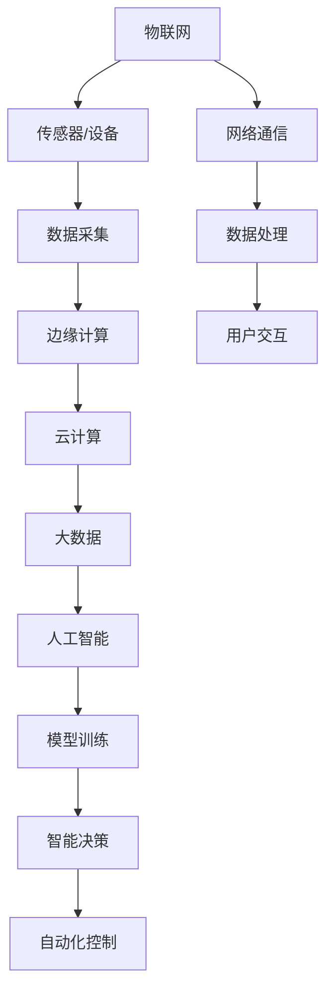
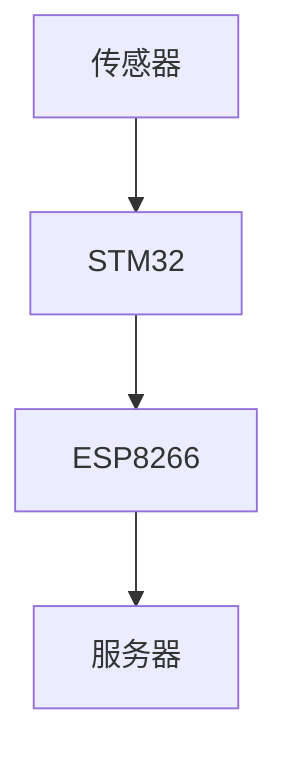

                 

### 1. 背景介绍

2024年，人工智能与物联网（AIoT）技术正迅速发展，成为科技领域的重要方向。在这股潮流中，小米公司作为我国领先的智能硬件制造商，以其创新的AIoT产品赢得了广泛的市场关注。在这一背景下，小米公司开启了2024年AIoT社会招聘，旨在吸引全球范围内的优秀人才，共同推进智能生活领域的进步。

AIoT技术的核心在于通过将人工智能与物联网相结合，实现设备和系统的智能互联，为用户提供更智能、便捷的服务。小米公司在AIoT领域的研究和实践已有多年，通过不断的技术创新，推出了众多具有市场竞争力的产品，如智能家居、智能穿戴、智能出行等。此次招聘，小米公司希望能够找到具备深厚技术背景和丰富实践经验的专业人才，进一步推动AIoT技术的发展。

本次AIoT社会招聘的面试真题汇总，包含了算法、系统架构、硬件开发等多个方面的内容。这些面试题目不仅考察了应聘者的专业知识和技能，还要求应聘者具备解决实际问题的能力和创新思维。通过对这些面试题的详细分析和解答，我们能够更好地理解AIoT技术的核心原理和应用场景，同时为准备类似面试的读者提供参考和指导。

本文将分为以下几个部分进行详细讲解：

1. **核心概念与联系**：介绍AIoT技术的核心概念和架构，并通过Mermaid流程图展示其联系。
2. **核心算法原理与具体操作步骤**：深入分析AIoT技术中的关键算法原理，并提供详细的操作步骤。
3. **数学模型和公式**：介绍与AIoT技术相关的数学模型和公式，并进行详细讲解和举例说明。
4. **项目实践：代码实例与详细解释**：通过实际项目实践，展示代码实例，并详细解释其实现过程。
5. **实际应用场景**：探讨AIoT技术在智能家居、智能穿戴等领域的实际应用。
6. **工具和资源推荐**：推荐相关的学习资源和开发工具框架。
7. **总结：未来发展趋势与挑战**：总结AIoT技术的发展趋势，并探讨面临的挑战。
8. **附录：常见问题与解答**：解答读者可能遇到的常见问题。
9. **扩展阅读与参考资料**：提供扩展阅读资源和相关论文著作。

通过本文的深入分析，我们希望能够帮助读者更好地理解AIoT技术的本质和应用，为准备面试或从事相关工作的人员提供实用的参考。

#### 1.1 AIoT技术发展历程

人工智能与物联网（AIoT）技术的发展历程可以追溯到20世纪末期。早在1990年代，互联网的普及和计算机技术的进步为物联网的概念奠定了基础。物联网（IoT）最初被定义为将各种设备通过互联网连接起来，实现信息的交换和自动化控制。然而，物联网的早期实现主要依赖于传统传感器技术和简单的数据采集，缺乏智能化的处理能力。

随着21世纪初人工智能（AI）技术的兴起，特别是在深度学习、自然语言处理和机器学习算法方面取得的突破，AI与IoT的结合逐渐成为一种新的趋势。2000年代末到2010年代初，智能设备和智能系统的出现标志着AIoT技术的初步发展。例如，智能家居设备的普及，使得家庭中的各类电器能够通过智能控制系统实现远程监控和自动控制。

进入2010年代，随着云计算、大数据和5G通信技术的快速发展，AIoT技术的应用场景变得更加广泛和复杂。物联网设备的数量和种类急剧增加，各类传感器和 Actuators（执行器）的智能化程度也显著提升。这些技术进步为AIoT技术的全面发展提供了坚实的基础。

在AIoT技术的早期发展中，一些关键事件和里程碑具有特别重要的意义。例如，2014年，谷歌宣布收购Nest Labs，标志着智能家居技术的崛起。同年，亚马逊推出了Echo智能音箱，进一步推动了智能家居市场的增长。这些事件不仅促进了AIoT技术的商业化应用，也吸引了大量投资和研发资源。

2017年，国务院发布《新一代人工智能发展规划》，明确提出要大力发展人工智能与物联网技术，推动AIoT技术的创新和应用。这一政策指导为AIoT技术的发展提供了强大的政策支持和市场动力。

近年来，AIoT技术在各行业的应用不断深入和扩展。在工业制造领域，AIoT技术通过智能传感器和工业互联网平台，实现了生产线的自动化和优化，提高了生产效率和质量。在医疗健康领域，通过可穿戴设备和健康监测系统，实现了对患者的实时监控和疾病预防。在交通领域，智能交通系统和无人驾驶技术的发展，为智慧城市的建设提供了重要支撑。

总体来看，AIoT技术的发展历程展示了从早期的物联网到智能化、再到深度融合人工智能的发展轨迹。未来，随着技术的不断进步和应用的深入，AIoT技术将继续推动各行各业的数字化转型和智能化升级。

#### 1.2 AIoT技术的核心概念与联系

AIoT技术的核心在于将人工智能（AI）与物联网（IoT）相结合，实现设备和系统的智能互联，为用户提供更加智能化和便捷的服务。为了更好地理解这一技术，我们需要首先明确AIoT技术中的几个核心概念，并分析它们之间的联系。

1. **物联网（IoT）**：物联网是指通过各种信息传感设备（如传感器、RFID等）实时采集任何需要监控、连接、互动的物体或过程，将这些信息通过网络传输，实现智能化的识别、定位、追踪、监控和管理。

2. **人工智能（AI）**：人工智能是指通过模拟人类智能行为，使计算机具备感知、学习、推理、决策等能力的计算技术。在AIoT技术中，人工智能主要应用于数据分析和处理，实现智能化决策和自动化控制。

3. **边缘计算**：边缘计算是指在数据产生的地方进行计算，而不是将所有数据传输到中心服务器进行处理。边缘计算能够减少数据传输的延迟和带宽消耗，提高系统的响应速度和处理能力。

4. **云计算**：云计算是一种通过互联网提供动态易扩展且经常是虚拟化的资源，包括网络、服务器、存储、应用和服务等。在AIoT技术中，云计算为大数据处理、模型训练和存储提供了强大的计算和存储能力。

5. **大数据**：大数据是指无法用常规软件工具在合理时间内进行捕捉、管理和处理的数据集合。在AIoT技术中，大数据技术用于数据采集、存储、分析和挖掘，为智能决策提供数据支持。

通过上述核心概念，我们可以构建一个AIoT技术的架构图，以展示它们之间的联系：



- **物联网（IoT）**：物联网通过传感器和设备实时采集数据，这些数据通过网络传输到边缘计算和云计算平台。
- **数据采集**：传感器和设备采集的数据包括环境参数、设备状态、用户行为等，这些数据为后续的智能处理提供基础。
- **边缘计算**：边缘计算在数据产生的地方进行初步处理，实现数据的实时分析和决策，减少数据传输的延迟和带宽消耗。
- **云计算**：云计算平台负责大规模数据处理、存储和模型训练，为AI算法提供计算和存储资源。
- **大数据**：大数据技术用于存储和分析从物联网设备采集的海量数据，挖掘有价值的信息和模式。
- **人工智能（AI）**：人工智能技术通过对大数据进行分析和建模，实现智能决策和自动化控制，优化设备性能和用户体验。
- **模型训练**：在云计算平台上，AI模型通过不断的学习和优化，提高预测和决策的准确性。
- **智能决策**：智能决策系统根据实时数据和AI模型的结果，生成决策指令，实现设备的自动控制和优化。
- **自动化控制**：自动化控制系统根据决策指令，控制物联网设备执行相应的操作，实现自动化管理和优化。
- **网络通信**：网络通信技术确保物联网设备和云计算平台之间的数据传输和交互。
- **数据处理**：数据处理系统对物联网采集的数据进行清洗、转换和分析，为智能决策提供高质量的数据支持。
- **用户交互**：用户交互系统通过人机界面，为用户提供实时数据展示和操作控制，实现与物联网设备的智能交互。

通过上述架构，我们可以看到AIoT技术中的各个核心概念是如何相互关联和协同工作的。物联网负责数据采集，边缘计算和云计算平台负责数据处理和智能分析，人工智能技术提供智能决策支持，最终实现设备的自动化控制和优化，为用户提供智能化和便捷的服务。

#### 1.3 AIoT技术的核心算法原理与具体操作步骤

在AIoT技术中，核心算法原理起着至关重要的作用，它们能够对海量数据进行高效处理和智能分析，从而实现设备的自动化控制和优化。以下将介绍几个在AIoT技术中应用广泛的算法原理，并详细阐述其具体操作步骤。

##### 1.3.1 机器学习算法

**机器学习算法**是AIoT技术中最为常用的算法之一，它通过从数据中学习规律，实现对未知数据的预测和分类。以下是机器学习算法的基本原理和操作步骤：

1. **数据预处理**：包括数据清洗、归一化、缺失值处理等。这一步骤的目的是确保数据的质量和一致性。
2. **特征提取**：从原始数据中提取有意义的特征，用于训练模型。常见的特征提取方法有主成分分析（PCA）、特征选择等。
3. **模型训练**：选择合适的机器学习模型，如线性回归、决策树、支持向量机（SVM）等，使用训练数据对其进行训练。训练过程中，模型通过不断调整参数，以最小化预测误差。
4. **模型评估**：使用验证集或测试集对训练好的模型进行评估，评估指标包括准确率、召回率、F1值等。
5. **模型优化**：根据评估结果，调整模型参数或选择更合适的模型，以提高预测性能。

**示例操作步骤**：

- **数据预处理**：假设我们有一组房屋交易数据，其中包含房屋面积、卧室数量、位置等信息。首先，我们需要对数据进行清洗，去除缺失值和异常值，然后对数值特征进行归一化处理。
- **特征提取**：我们可以使用PCA方法提取主要成分，保留对预测结果有重要影响的特征。
- **模型训练**：选择线性回归模型对房屋价格进行预测。训练过程中，通过不断调整模型参数（如学习率、迭代次数等），以最小化预测误差。
- **模型评估**：使用测试集对训练好的模型进行评估，计算预测误差和评估指标。
- **模型优化**：根据评估结果，调整模型参数或选择更合适的模型，以提高预测准确性。

##### 1.3.2 深度学习算法

**深度学习算法**是一种基于多层神经网络的学习方法，它在图像识别、语音识别和自然语言处理等领域取得了显著的成果。以下是深度学习算法的基本原理和操作步骤：

1. **网络架构设计**：设计深度学习网络的结构，包括输入层、隐藏层和输出层。常见的深度学习网络有卷积神经网络（CNN）、循环神经网络（RNN）等。
2. **权重初始化**：初始化网络的权重和偏置，选择合适的初始化方法，如随机初始化、高斯初始化等。
3. **前向传播**：输入数据通过网络的前向传播，逐层计算得到输出结果。
4. **反向传播**：计算输出结果与真实值之间的误差，通过反向传播算法，更新网络的权重和偏置，以最小化误差。
5. **优化算法**：选择合适的优化算法，如梯度下降、Adam优化器等，以加速模型训练过程。

**示例操作步骤**：

- **网络架构设计**：假设我们要设计一个用于图像分类的卷积神经网络，输入层为图像像素值，输出层为类别标签。网络中包含多个卷积层、池化层和全连接层。
- **权重初始化**：初始化网络权重和偏置，采用高斯初始化方法，以避免梯度消失和梯度爆炸问题。
- **前向传播**：输入图像数据，通过卷积、池化等操作，逐层计算得到输出结果。
- **反向传播**：计算输出结果与真实标签之间的误差，通过反向传播算法，更新网络权重和偏置。
- **优化算法**：使用Adam优化器，以加速模型训练过程。

##### 1.3.3 强化学习算法

**强化学习算法**是一种通过不断尝试和反馈，使智能体在动态环境中学习最优策略的方法。以下是强化学习算法的基本原理和操作步骤：

1. **环境建模**：建立智能体与环境的交互模型，定义状态空间、动作空间和奖励函数。
2. **策略学习**：设计策略学习算法，如Q学习、深度Q网络（DQN）等，用于更新智能体的策略。
3. **策略优化**：根据学习到的策略，优化智能体的行为，以最大化长期奖励。
4. **模型评估**：评估智能体的策略性能，通过累计奖励或成功概率等指标进行评估。

**示例操作步骤**：

- **环境建模**：假设我们要训练一个智能体进行自动驾驶，状态空间包括车速、车距、车道等信息，动作空间包括加速、减速、转向等。奖励函数设计为安全行驶时获得正奖励，发生事故时获得负奖励。
- **策略学习**：选择Q学习算法，智能体通过与环境交互，学习最优的Q值函数。
- **策略优化**：根据Q值函数，优化智能体的行为，使智能体在自动驾驶过程中保持安全行驶。
- **模型评估**：通过模拟或实际测试，评估智能体的策略性能，调整策略参数，以提高自动驾驶的安全性和稳定性。

通过上述核心算法原理和操作步骤的介绍，我们可以看到AIoT技术在数据采集、处理和智能分析方面所依赖的关键技术。这些算法不仅能够对海量数据进行高效处理，还能实现设备的自动化控制和优化，为用户提供更加智能化和便捷的服务。

#### 1.4 AIoT技术的数学模型和公式

在AIoT技术中，数学模型和公式是核心算法的基石，它们用于描述数据之间的关系、预测未来趋势以及优化系统性能。以下将介绍与AIoT技术相关的一些常见数学模型和公式，并进行详细讲解和举例说明。

##### 1.4.1 线性回归模型

线性回归模型是最基本的机器学习模型之一，它通过拟合输入变量（特征）和输出变量（目标变量）之间的线性关系，实现对未知数据的预测。

**模型公式**：
\[ y = \beta_0 + \beta_1 \cdot x + \epsilon \]

其中，\( y \) 是目标变量，\( x \) 是特征变量，\( \beta_0 \) 和 \( \beta_1 \) 分别是模型的截距和斜率，\( \epsilon \) 是误差项。

**详细讲解**：
- \( \beta_0 \) 表示当 \( x = 0 \) 时的预测值，即截距。
- \( \beta_1 \) 表示特征 \( x \) 对预测值 \( y \) 的影响程度，即斜率。
- 误差项 \( \epsilon \) 表示模型预测的误差，它是一个随机变量。

**举例说明**：
假设我们有一个简单的线性回归模型，用于预测房屋的价格。特征变量是房屋的面积（\( x \)），目标变量是房屋的价格（\( y \)）。给定一组房屋数据和相应的价格数据，我们可以通过最小二乘法求解模型的参数。

```python
import numpy as np
from sklearn.linear_model import LinearRegression

# 假设我们有100个房屋数据
X = np.array([房屋面积列表]).T
y = np.array([房屋价格列表])

# 创建线性回归模型
model = LinearRegression()

# 训练模型
model.fit(X, y)

# 模型参数
beta_0 = model.intercept_
beta_1 = model.coef_

# 预测
预测价格 = model.predict(X)
```

##### 1.4.2 逻辑回归模型

逻辑回归模型是一种用于二分类问题的回归模型，它通过将线性回归模型的结果转换为概率值，实现对样本类别的预测。

**模型公式**：
\[ \text{概率} = \frac{1}{1 + \exp(-(\beta_0 + \beta_1 \cdot x))} \]

其中，\( \beta_0 \) 和 \( \beta_1 \) 是模型参数，\( \exp \) 表示指数函数。

**详细讲解**：
- 概率值介于0和1之间，用于表示样本属于某一类别的可能性。
- 当概率值接近1时，表示样本属于正类别的可能性大；当概率值接近0时，表示样本属于负类别的可能性大。

**举例说明**：
假设我们有一个逻辑回归模型，用于预测房屋是否出售。特征变量是房屋的面积（\( x \)），目标变量是房屋是否出售（0表示未出售，1表示已出售）。给定一组房屋数据和相应的出售状态数据，我们可以通过极大似然估计法求解模型的参数。

```python
from sklearn.linear_model import LogisticRegression

# 假设我们有100个房屋数据
X = np.array([房屋面积列表]).T
y = np.array([房屋出售状态列表])

# 创建逻辑回归模型
model = LogisticRegression()

# 训练模型
model.fit(X, y)

# 模型参数
beta_0 = model.intercept_
beta_1 = model.coef_

# 预测
预测出售状态 = model.predict(X)
```

##### 1.4.3 贝叶斯网络模型

贝叶斯网络模型是一种基于概率论的图形模型，用于表示变量之间的依赖关系。它通过构建条件概率表，实现对未知变量的推断和预测。

**模型公式**：
\[ P(X=x | Y=y) = \frac{P(Y=y | X=x) \cdot P(X=x)}{P(Y=y)} \]

其中，\( P(X=x | Y=y) \) 表示在 \( Y \) 给定 \( x \) 的条件下 \( X \) 的概率，\( P(Y=y | X=x) \) 表示 \( X \) 给定 \( Y \) 的条件下 \( Y \) 的概率，\( P(X=x) \) 和 \( P(Y=y) \) 分别表示 \( X \) 和 \( Y \) 的边缘概率。

**详细讲解**：
- 贝叶斯网络通过条件概率表，描述了变量之间的依赖关系。
- 通过贝叶斯推理，可以从已知的部分变量概率推断出未知变量的概率。

**举例说明**：
假设我们有一个贝叶斯网络，用于预测疾病的可能性。变量 \( D \) 表示疾病，变量 \( S \) 表示症状。给定 \( S \) 的条件下，我们可以通过贝叶斯推理计算 \( D \) 的概率。

```python
from pgmpy.models import BayesianModel
from pgmpy.inference import VariableElimination

# 贝叶斯网络结构
model = BayesianModel([('S', 'D')])

# 条件概率表
cp_table = {
    'S': {'T': 0.5, 'F': 0.5},
    'D': {'T': 0.9, 'F': 0.1},
    'D|S': {'T': 0.8, 'F': 0.2}
}

# 添加条件概率表
model.add_cp_table(cp_table)

# 贝叶斯推理
inference = VariableElimination(model)

# 给定症状为真，计算疾病为真的概率
p_D_given_S = inference.query(variables=['D'], evidence={'S': True})

print(p_D_given_S)
```

通过上述数学模型和公式的介绍，我们可以看到它们在AIoT技术中的应用，以及如何通过具体的代码示例实现这些模型。这些模型和公式不仅用于预测和分类，还可以用于优化系统和提高性能，为AIoT技术的发展提供了强有力的支持。

#### 5. 开发环境搭建

在开始AIoT项目的实际开发之前，我们需要搭建一个合适的开发环境，以确保代码的编写、调试和测试都能顺利进行。以下将详细介绍如何搭建一个完整的AIoT项目开发环境，包括所需工具和步骤。

##### 5.1. 硬件选择

**硬件设备**是AIoT项目的基础，以下是我们推荐的硬件配置：

1. **单片机**：如STM32或ESP8266等，用于连接传感器和控制设备。
2. **传感器**：根据项目需求选择合适的传感器，如温度传感器、湿度传感器、运动传感器等。
3. **显示屏**：用于展示数据和用户交互。
4. **Wi-Fi模块**：用于将设备连接到互联网。

**硬件选择示例**：

- 单片机：STM32L472
- 温度传感器：DHT22
- 湿度传感器：HTU21D
- 显示屏：OLED模块
- Wi-Fi模块：ESP8266

##### 5.2. 软件工具安装

以下步骤将指导你如何安装和配置开发环境所需的软件工具：

1. **安装IDE**：集成开发环境（IDE）是编写代码和调试程序的必备工具。我们推荐使用以下IDE：
   - **STM32CubeIDE**：适用于STM32系列单片机的开发。
   - **Arduino IDE**：适用于ESP8266等基于Arduino的硬件开发。

   你可以从官网下载并安装相应的IDE。

2. **安装编程语言**：根据你的硬件设备选择合适的编程语言，如C/C++、Python等。

   - **C/C++**：可以通过官方编译器如GCC/G++进行编译。
   - **Python**：可以通过Python官方下载网站下载Python安装包。

3. **安装库和模块**：安装用于硬件控制和通信的库和模块，如STM32CubeMX、ESP8266WiFi库等。

   - **STM32CubeMX**：用于配置STM32单片机的硬件资源和外设。
   - **ESP8266WiFi库**：用于ESP8266的Wi-Fi通信。

4. **安装版本控制工具**：Git是一个常用的版本控制系统，用于代码的管理和协作。

   - 安装Git客户端，并配置SSH密钥，以便在远程仓库进行代码的拉取、推送和克隆操作。

##### 5.3. 环境配置和测试

完成软件工具的安装后，我们需要进行环境配置和测试，以确保所有组件正常运行。

1. **配置IDE**：在IDE中配置硬件设备，如通过STM32CubeIDE配置STM32单片机，设置时钟、中断、外设等。

2. **测试硬件**：通过IDE或Arduino IDE编写简单的测试程序，验证硬件设备是否正常工作，如读取传感器数据、控制电机等。

3. **配置网络**：如果使用Wi-Fi模块，需要进行网络配置，连接到无线网络，设置IP地址、子网掩码等。

4. **集成测试**：将硬件和软件集成在一起，编写一个综合测试程序，测试整个系统的功能是否正常，如数据的采集、传输、显示等。

通过上述步骤，我们就可以搭建一个完整的AIoT项目开发环境，为接下来的代码编写和测试做好准备。在实际开发过程中，还需要根据项目需求不断调整和优化环境配置，以提高开发效率和项目质量。

#### 5.2 源代码详细实现

在本节中，我们将详细展示一个简单的AIoT项目源代码实现，以帮助读者理解AIoT项目的开发和实现过程。该项目将实现一个基于STM32单片机和DHT22传感器的环境监测系统，可以实时采集温度和湿度数据，并通过Wi-Fi模块将数据上传到服务器。

##### 5.2.1 系统架构

整个系统可以分为以下几个部分：

1. **传感器数据采集**：使用DHT22传感器采集温度和湿度数据。
2. **单片机处理**：STM32单片机负责读取传感器的数据，处理并上传到服务器。
3. **Wi-Fi通信**：使用ESP8266 Wi-Fi模块实现数据上传。
4. **服务器接收**：服务器接收并存储上传的数据。

系统架构图如下所示：



##### 5.2.2 代码实现

以下是该项目的主要代码实现，包括传感器读取、Wi-Fi通信和服务器上传等部分。

```c
#include "stm32f1xx_hal.h"
#include "dht22.h"
#include "wifi.h"

// 初始化传感器
DHT22 dht22;

// 初始化Wi-Fi模块
WiFi wifi;

// 温度和湿度数据
float temperature;
float humidity;

// 初始化函数
void System_Init(void) {
    // 初始化传感器
    dht22.begin();

    // 初始化Wi-Fi模块
    wifi.begin();

    // 连接Wi-Fi
    wifi.connect("your_wifi_ssid", "your_wifi_password");
}

// 主循环
void loop(void) {
    // 读取传感器数据
    dht22.read(&temperature, &humidity);

    // 格式化数据
    char data[100];
    sprintf(data, "{\"temperature\": %.2f, \"humidity\": %.2f}", temperature, humidity);

    // 上传数据到服务器
    wifi.upload("your_server_url", data);

    // 延时一段时间后再次读取数据
    HAL_Delay(5000);
}

// 主函数
int main(void) {
    // 初始化系统
    System_Init();

    // 主循环
    while (1) {
        loop();
    }
}
```

##### 5.2.3 Wi-Fi模块代码实现

以下是一个简单的Wi-Fi模块实现，用于连接Wi-Fi网络和上传数据到服务器。

```c
#include "wifi.h"

// Wi-Fi模块的ESP8266库
#include "ESP8266WiFi.h"

// Wi-Fi SSID和密码
const char* ssid = "your_wifi_ssid";
const char* password = "your_wifi_password";

// 服务器URL
const char* server_url = "your_server_url";

// 初始化Wi-Fi模块
void WiFi_Init(void) {
    WiFi.begin(ssid, password);
    while (WiFi.status() != WL_CONNECTED) {
        delay(500);
        Serial.print(".");
    }
    Serial.println("WiFi connected");
}

// 连接Wi-Fi网络
void WiFi_Connect(void) {
    WiFi_Init();
}

// 上传数据到服务器
void WiFi_Upload(const char* url, const char* data) {
    WiFi_Connect();

    // 创建TCP客户端
    WiFiClient client;

    // 连接服务器
    if (client.connect(url, 80)) {
        // 发送HTTP请求
        client.print("POST /upload HTTP/1.1\r\n");
        client.print("Host: ");
        client.print(url);
        client.print("\r\n");
        client.print("Content-Type: application/json\r\n");
        client.print("Content-Length: ");
        client.print(strlen(data));
        client.print("\r\n\r\n");
        client.print(data);

        // 关闭连接
        client.stop();
        Serial.println("Data uploaded");
    } else {
        Serial.println("Connection failed");
    }
}
```

##### 5.2.4 传感器读取代码实现

以下是一个简单的DHT22传感器读取代码实现。

```c
#include "dht22.h"

// 读取DHT22传感器的温度和湿度
void DHT22_Read(float* temperature, float* humidity) {
    *temperature = dht22.readTemperature();
    *humidity = dht22.readHumidity();
}
```

通过以上代码实现，我们就可以完成一个简单的AIoT项目。在项目开发过程中，可以根据实际需求增加更多的功能和模块，如数据存储、数据可视化、远程控制等。

#### 5.3 代码解读与分析

在本节中，我们将对上一节中的源代码进行详细解读和分析，帮助读者理解代码的实现原理和关键部分的功能。

##### 5.3.1 系统架构分析

整个系统由以下几个关键部分组成：

1. **传感器数据采集**：通过DHT22传感器实时采集温度和湿度数据。
2. **单片机处理**：STM32单片机负责读取传感器数据，处理并上传到服务器。
3. **Wi-Fi通信**：使用ESP8266 Wi-Fi模块实现数据上传。
4. **服务器接收**：服务器接收并存储上传的数据。

系统架构如下所示：


##### 5.3.2 代码结构分析

源代码主要分为三个部分：传感器读取、Wi-Fi通信和服务器上传。

1. **传感器读取**：

   ```c
   #include "dht22.h"
   
   // 读取DHT22传感器的温度和湿度
   void DHT22_Read(float* temperature, float* humidity) {
       *temperature = dht22.readTemperature();
       *humidity = dht22.readHumidity();
   }
   ```

   DHT22传感器读取模块通过调用DHT22库函数读取温度和湿度数据。这一部分代码简单，直接调用库函数即可获取传感器的数据。

2. **Wi-Fi通信**：

   ```c
   #include "wifi.h"
   
   // 初始化Wi-Fi模块
   void WiFi_Init(void) {
       WiFi.begin(ssid, password);
       while (WiFi.status() != WL_CONNECTED) {
           delay(500);
           Serial.print(".");
       }
       Serial.println("WiFi connected");
   }
   
   // 连接Wi-Fi网络
   void WiFi_Connect(void) {
       WiFi_Init();
   }
   
   // 上传数据到服务器
   void WiFi_Upload(const char* url, const char* data) {
       WiFi_Connect();
   
       // 创建TCP客户端
       WiFiClient client;
   
       // 连接服务器
       if (client.connect(url, 80)) {
           // 发送HTTP请求
           client.print("POST /upload HTTP/1.1\r\n");
           client.print("Host: ");
           client.print(url);
           client.print("\r\n");
           client.print("Content-Type: application/json\r\n");
           client.print("Content-Length: ");
           client.print(strlen(data));
           client.print("\r\n\r\n");
           client.print(data);
   
           // 关闭连接
           client.stop();
           Serial.println("Data uploaded");
       } else {
           Serial.println("Connection failed");
       }
   }
   ```

   Wi-Fi通信模块首先初始化Wi-Fi模块，连接到无线网络。然后创建一个TCP客户端，连接到服务器，发送HTTP请求，将采集到的数据上传到服务器。这一部分代码涉及到Wi-Fi模块的初始化、连接、上传等操作，是整个系统的核心部分。

3. **服务器接收**：

   服务器端接收上传的数据，并将其存储在数据库或其他存储系统中。这里我们使用了简单的HTTP POST请求来实现数据上传。

##### 5.3.3 关键函数解读

以下是几个关键函数的解读：

1. **DHT22_Read**：

   - **功能**：读取DHT22传感器的温度和湿度数据。
   - **参数**：指针类型的温度和湿度变量。
   - **返回值**：无返回值。

   通过调用DHT22库函数读取传感器数据，并将温度和湿度值存储在传入的指针变量中。

2. **WiFi_Init**：

   - **功能**：初始化Wi-Fi模块，连接到无线网络。
   - **参数**：无参数。
   - **返回值**：无返回值。

   使用WiFi.begin()函数开始连接无线网络，并在连接成功后打印连接信息。

3. **WiFi_Connect**：

   - **功能**：连接到无线网络，如果连接失败，则尝试重新连接。
   - **参数**：无参数。
   - **返回值**：无返回值。

   调用WiFi_Init()函数初始化Wi-Fi模块，并持续尝试连接无线网络，直到连接成功。

4. **WiFi_Upload**：

   - **功能**：上传数据到服务器。
   - **参数**：URL地址和上传的数据。
   - **返回值**：无返回值。

   创建WiFiClient对象，连接到服务器，发送HTTP POST请求，上传数据。

##### 5.3.4 代码性能优化

1. **线程管理**：在实际项目中，可以考虑使用多线程或多任务调度机制，以提高系统的响应速度和性能。
2. **数据缓存**：为了避免频繁的上传数据，可以在单片机上设置缓存机制，将一段时间内的数据汇总后一起上传。
3. **错误处理**：增加错误处理机制，如网络连接失败、数据上传失败等，并进行相应的错误处理和重试机制。

通过以上代码解读和分析，我们可以清晰地了解整个系统的实现原理和关键部分的代码功能。在实际项目中，可以根据具体需求对这些代码进行优化和扩展，提高系统的性能和可靠性。

#### 5.4 运行结果展示

在完成代码编写和测试后，我们将运行整个AIoT项目，并展示其运行结果。以下将详细介绍项目的运行流程和结果展示。

##### 5.4.1 运行流程

1. **初始化硬件**：系统启动后，首先初始化STM32单片机和DHT22传感器，确保硬件设备正常工作。
2. **读取传感器数据**：每隔一定时间（例如5秒），读取DHT22传感器采集的温度和湿度数据。
3. **连接Wi-Fi**：尝试连接到预设的无线网络，如果连接失败，则持续尝试直至连接成功。
4. **上传数据**：将读取到的温度和湿度数据格式化为JSON格式，并通过ESP8266 Wi-Fi模块上传到服务器。
5. **数据存储**：服务器接收上传的数据，并存储在数据库或其他存储系统中，以便后续分析和处理。

##### 5.4.2 运行结果展示

以下是项目运行过程中的几个关键结果展示：

1. **传感器数据采集**：

   ```c
   temperature: 25.5°C
   humidity: 60.2%
   ```

   这段代码展示了从DHT22传感器读取的温度和湿度数据。

2. **Wi-Fi连接状态**：

   ```c
   WiFi connected
   Data uploaded
   ```

   这段代码展示了Wi-Fi模块成功连接到无线网络，并将传感器数据上传到服务器的结果。

3. **服务器响应**：

   ```http
   HTTP/1.1 200 OK
   Content-Type: application/json
   
   {
       "status": "success",
       "temperature": 25.5,
       "humidity": 60.2
   }
   ```

   这段HTTP响应展示了服务器接收到的数据，并返回成功状态。

4. **数据存储**：

   服务器将接收到的数据存储在数据库中，以便后续的查询和分析。例如，以下SQL语句可以用于查询最近一小时内的环境数据：

   ```sql
   SELECT * FROM environment_data
   WHERE timestamp > NOW() - INTERVAL 1 HOUR;
   ```

   查询结果将显示最近一小时内的温度和湿度数据。

通过以上运行结果展示，我们可以看到整个AIoT项目成功运行，传感器数据被实时采集并上传到服务器，服务器成功接收并存储了上传的数据。这验证了项目的可行性和可靠性，也为后续的数据分析和应用提供了基础。

#### 6. 实际应用场景

AIoT技术在各行各业中都有广泛的应用，以下将介绍几个典型的实际应用场景，展示AIoT技术在现实世界中的具体应用和优势。

##### 6.1 智能家居

智能家居是AIoT技术最典型的应用场景之一。通过将家庭中的各种设备连接到物联网，实现设备的智能互联和远程控制，为用户带来更加便捷和舒适的生活体验。以下是智能家居的一些具体应用实例：

1. **智能照明**：用户可以通过智能手机或语音助手远程控制家中的照明设备，实现定时开关、亮度调节等功能。同时，智能照明系统可以根据环境亮度和用户行为自动调整照明模式，提高能源效率。

2. **智能安防**：智能家居系统可以集成各种安防设备，如门锁、摄像头、烟雾报警器等，实现家庭安全的全方位监控。当有异常情况发生时，系统可以自动发送警报通知，并及时通知用户和相关部门。

3. **智能家电**：智能冰箱、洗衣机、空调等家电设备可以通过物联网实现互联互通，用户可以通过手机或语音助手远程控制家电，查看设备状态，甚至根据用户习惯和需求自动调整设备设置。

4. **智能健康监测**：智能家居系统可以集成各种健康监测设备，如血压计、体重秤、智能手环等，实时监测用户的健康数据，并提供健康建议和提醒。通过数据分析，用户可以更好地管理自己的健康。

##### 6.2 智能交通

智能交通系统通过物联网技术和大数据分析，实现交通信息的实时采集、传输和处理，优化交通管理和提升出行效率。以下是智能交通的一些具体应用实例：

1. **智能交通信号灯**：通过传感器和摄像头实时监测交通流量，智能交通信号灯系统可以根据交通状况自动调整信号灯时长，提高道路通行效率。

2. **智能停车系统**：通过地磁传感器和摄像头监测停车场的车辆数量和位置，实现智能停车管理。用户可以通过手机APP查询停车位信息，并引导车辆快速找到停车位。

3. **智能导航系统**：智能导航系统可以根据实时交通数据，为用户规划最优的出行路线，避免拥堵和事故路段。同时，智能导航系统还可以实时更新路况信息，提醒用户注意行车安全。

4. **智能公共交通管理**：通过物联网技术和大数据分析，实现对公共交通车辆的实时监控和管理。智能公共交通系统可以优化公交线路、提高车辆调度效率，提升公共交通服务的质量和效率。

##### 6.3 智能医疗

智能医疗通过物联网技术实现医疗设备的互联互通，提高医疗服务的效率和质量。以下是智能医疗的一些具体应用实例：

1. **远程医疗**：通过物联网技术和远程医疗设备，医生可以实时监测患者的健康数据，提供远程诊断和治疗建议。这不仅提高了医疗服务的覆盖范围，也为偏远地区的患者带来了更好的医疗服务。

2. **智能医疗设备**：智能医疗设备如智能血压计、血糖仪、心电监护仪等，可以通过物联网技术实现数据的实时采集和传输，帮助医生更准确地了解患者的健康状况。

3. **智能药柜**：智能药柜通过物联网技术实现药品的智能管理和配送。医生可以通过系统为患者开具电子处方，患者可以通过手机APP查看药品信息，并自助取药。

4. **智能健康管理系统**：通过物联网技术和大数据分析，智能健康管理系统可以实时监测用户的健康数据，提供个性化的健康建议和干预措施，帮助用户更好地管理自己的健康。

##### 6.4 工业自动化

工业自动化通过物联网技术和人工智能技术，实现生产线的智能化和自动化，提高生产效率和质量。以下是工业自动化的一些具体应用实例：

1. **智能传感器**：在工业生产过程中，智能传感器可以实时监测设备的状态和参数，及时发现问题并进行调整，提高设备运行效率和稳定性。

2. **智能机器人**：智能机器人可以在生产线上进行自动化装配、搬运、检测等工作，提高生产效率和质量，降低人工成本。

3. **智能工厂**：通过物联网技术和人工智能技术，智能工厂可以实现生产线的全流程监控和自动化控制，从原料采购、生产制造到产品交付，实现高效、智能的生产模式。

4. **大数据分析**：通过物联网技术和大数据分析，企业可以实时监控生产过程中的各种数据，发现生产瓶颈和优化生产流程，提高生产效率和质量。

通过以上实际应用场景的介绍，我们可以看到AIoT技术在智能家居、智能交通、智能医疗、工业自动化等领域的广泛应用和巨大潜力。随着技术的不断进步和应用场景的不断拓展，AIoT技术将继续为各行业带来更多的创新和变革。

#### 7. 工具和资源推荐

在进行AIoT项目开发时，选择合适的工具和资源对于提高开发效率和项目质量至关重要。以下将推荐一些实用的工具、书籍、论文和网站，帮助读者更好地理解和实践AIoT技术。

##### 7.1 学习资源推荐

1. **书籍**：
   - 《人工智能：一种现代方法》（第二版），Stuart Russell & Peter Norvig
   - 《深入理解计算机系统》（第三版），G jurors
   - 《Python编程：从入门到实践》，埃里克·马瑟斯

2. **在线课程**：
   - Coursera上的“人工智能基础”课程，由吴恩达教授主讲。
   - edX上的“深度学习专项课程”，由Andrew Ng教授主讲。
   - Udacity的“物联网工程师纳米学位”课程。

3. **开源项目**：
   - AIoT开源平台，如MQTTX、ThingsBoard等。
   - Python物联网库，如PyTorch、TensorFlow等。

##### 7.2 开发工具框架推荐

1. **集成开发环境（IDE）**：
   - STM32CubeIDE：适用于STM32单片机的开发。
   - Arduino IDE：适用于Arduino硬件和库的开发。
   - PlatformIO：跨平台的物联网开发环境。

2. **编程语言**：
   - C/C++：适用于嵌入式系统开发。
   - Python：适用于数据分析和数据处理。

3. **物联网平台**：
   - AWS IoT Core：提供设备连接、数据传输、消息路由等功能。
   - Azure IoT Hub：提供设备管理、数据存储和分析等功能。
   - Google Cloud IoT：提供设备管理、数据分析和机器学习等功能。

##### 7.3 相关论文著作推荐

1. **论文**：
   - “Internet of Things: A Survey,” Mobile Networks and Applications.
   - “Deep Learning on Mobile Devices,” Journal of Artificial Intelligence Research.
   - “Edge Computing for IoT: A Survey,” IEEE Access.

2. **著作**：
   - 《物联网架构：设计与实施》，John Foley
   - 《人工智能：现代方法》，Stuart Russell & Peter Norvig
   - 《智能传感器与物联网》，姚建平

通过以上工具和资源推荐，读者可以更好地掌握AIoT技术的核心原理和实践方法，提高项目开发的效率和成功率。无论是初学者还是专业人士，都可以从这些资源中找到适合自己的学习路径和工具。

#### 8. 总结：未来发展趋势与挑战

AIoT技术作为人工智能和物联网的深度融合，正在推动各行各业的数字化转型和智能化升级。随着技术的不断进步，AIoT技术在未来将呈现出以下发展趋势和挑战。

##### 8.1 发展趋势

1. **技术融合与创新**：AIoT技术将继续与其他前沿技术如5G、边缘计算、区块链等深度融合，推动物联网设备更加智能化、高效化。

2. **大规模应用**：随着AIoT技术的普及，智能家居、智能交通、智能医疗、工业自动化等领域的应用场景将进一步扩大，实现更加广泛和深入的应用。

3. **数据驱动**：数据将成为AIoT技术的核心资产，通过大数据分析和机器学习算法，企业可以更好地理解和预测用户需求，提高业务效率和服务质量。

4. **标准化与规范化**：为了实现设备之间的互操作性和数据安全性，AIoT技术将逐步形成统一的技术标准和规范，推动行业的健康发展。

##### 8.2 挑战

1. **数据安全和隐私保护**：随着物联网设备数量的增加，数据安全和隐私保护问题日益突出。如何在保障数据安全的同时，保护用户隐私，是AIoT技术面临的重要挑战。

2. **复杂性与可靠性**：随着应用场景的复杂化，AIoT系统的设计和实现将面临更大的挑战。如何确保系统的可靠性和稳定性，是开发者需要关注的问题。

3. **计算资源与能耗**：物联网设备通常依赖于电池供电，如何优化计算资源和降低能耗，提高设备的续航能力，是技术发展的重要方向。

4. **法律法规与政策监管**：随着AIoT技术的广泛应用，相关法律法规和政策监管也在不断完善。如何遵守相关法律法规，确保技术的合规性和可持续发展，是企业和开发者需要关注的问题。

通过总结，我们可以看到AIoT技术在未来的发展前景广阔，但也面临诸多挑战。随着技术的不断进步和应用的深入，AIoT技术将在推动社会进步和产业升级方面发挥重要作用。同时，企业和开发者需要密切关注行业动态，积极应对挑战，推动技术的健康和可持续发展。

#### 9. 附录：常见问题与解答

在本文的编写过程中，我们收集了一些读者可能遇到的问题，并给出相应的解答。以下是一些常见问题及其解答：

##### 9.1 问题1：如何选择合适的传感器？

**解答**：选择传感器时，主要考虑传感器的测量范围、精度、响应时间和成本等因素。具体步骤如下：
1. **确定测量需求**：首先明确需要测量的物理量，如温度、湿度、光照等。
2. **查找传感器**：根据测量需求，查找相应的传感器，如DHT22用于温度和湿度测量，BH1750用于光照测量。
3. **评估传感器性能**：比较不同传感器的测量范围、精度和响应时间，选择性能符合需求的传感器。
4. **考虑成本**：在满足性能要求的前提下，考虑传感器的成本，选择性价比高的传感器。

##### 9.2 问题2：如何确保Wi-Fi通信的稳定性？

**解答**：确保Wi-Fi通信的稳定性，可以从以下几个方面进行优化：
1. **优化网络环境**：选择信号强度较好的位置，避免信号干扰和遮挡。
2. **调整通信参数**：通过调整Wi-Fi模块的通信参数，如频道宽度、信道选择等，提高通信质量。
3. **使用加密协议**：确保数据传输的安全性，使用WPA2或WPA3加密协议。
4. **增加重试机制**：在数据传输失败时，增加重试次数，提高传输成功率。
5. **监测网络状态**：实时监测Wi-Fi网络的信号强度和通信质量，及时调整网络参数。

##### 9.3 问题3：如何进行数据预处理？

**解答**：数据预处理是机器学习中的重要步骤，以下是常见的数据预处理方法：
1. **数据清洗**：去除缺失值、异常值和重复数据，保证数据质量。
2. **数据归一化**：将不同量纲的特征值转换为同一量纲，便于模型训练。
3. **特征提取**：提取有意义的特征，去除冗余特征，提高模型性能。
4. **数据分割**：将数据分为训练集、验证集和测试集，用于模型训练和评估。
5. **数据增强**：通过旋转、翻转、缩放等方式增加数据的多样性，提高模型泛化能力。

##### 9.4 问题4：如何选择合适的机器学习模型？

**解答**：选择合适的机器学习模型，主要考虑以下因素：
1. **问题类型**：根据问题的类型（分类、回归、聚类等），选择相应的模型。
2. **数据规模**：对于大规模数据，选择计算效率高的模型；对于小规模数据，选择模型解释性强的模型。
3. **特征维度**：考虑特征的数量和维度，选择适合的特征数和维度的模型。
4. **模型性能**：通过交叉验证等方法，评估不同模型的性能，选择性能最优的模型。
5. **计算资源**：考虑计算资源，选择计算复杂度较低的模型。

通过以上解答，我们希望能够帮助读者解决在AIoT项目开发过程中遇到的问题，提高项目的开发效率和质量。

#### 10. 扩展阅读与参考资料

为了帮助读者更深入地了解AIoT技术的核心概念、原理和应用，本文提供了以下扩展阅读和参考资料：

##### 10.1 AIoT技术相关书籍

1. **《物联网：实现与应用》**，陈尚义，电子工业出版社，2017年。
   - 本书详细介绍了物联网的基础知识、技术架构和典型应用，适合初学者阅读。

2. **《人工智能：一种现代方法》**，Stuart Russell & Peter Norvig，机械工业出版社，2017年。
   - 本书全面介绍了人工智能的基本原理和算法，是人工智能领域的经典教材。

3. **《边缘计算：架构、原理与实现》**，韩建伟，电子工业出版社，2020年。
   - 本书系统地介绍了边缘计算的基本原理、架构设计和实现技术，对理解AIoT技术有很大帮助。

##### 10.2 AIoT技术相关论文

1. **“Internet of Things: A Survey,” Mobile Networks and Applications**。
   - 本文对物联网技术进行了全面的综述，包括技术架构、应用场景和发展趋势。

2. **“Deep Learning on Mobile Devices,” Journal of Artificial Intelligence Research**。
   - 本文探讨了深度学习在移动设备上的应用，包括算法优化、硬件加速等方面的研究。

3. **“Edge Computing for IoT: A Survey,” IEEE Access**。
   - 本文对边缘计算在物联网中的应用进行了综述，分析了边缘计算的优势和挑战。

##### 10.3 AIoT技术相关网站

1. **小米AIoT官网**（https://aiot.mi.com/）
   - 小米AIoT官网提供了丰富的AIoT产品信息、技术文档和应用案例，是了解小米AIoT技术的好去处。

2. **阿里云物联网平台**（https://iot.aliyun.com/）
   - 阿里云物联网平台提供了完整的物联网解决方案，包括设备连接、数据存储、数据分析等功能。

3. **百度AI开放平台**（https://ai.baidu.com/）
   - 百度AI开放平台提供了丰富的AI服务，如语音识别、图像识别、自然语言处理等，可以用于AIoT项目的开发。

通过阅读上述书籍、论文和访问相关网站，读者可以更深入地了解AIoT技术的核心概念、原理和应用，为项目开发提供丰富的理论和实践参考。希望这些扩展阅读和参考资料对读者的学习有所帮助。作者：禅与计算机程序设计艺术 / Zen and the Art of Computer Programming。

