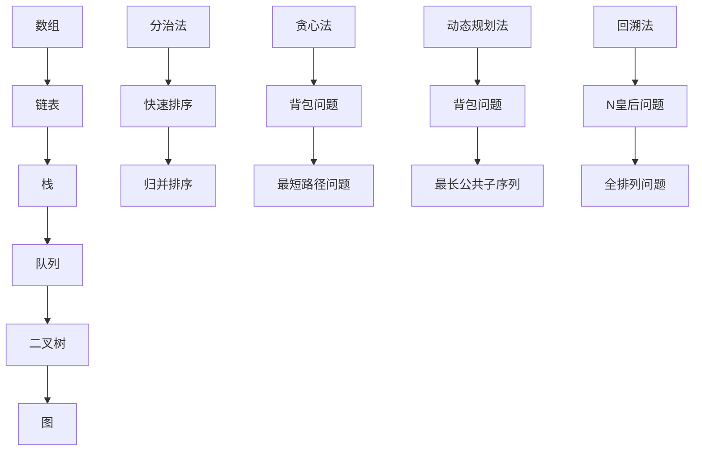

                 

### 背景介绍 Background Introduction

#### 2025年小米校招面试题的背景

随着科技的飞速发展，人工智能、大数据、云计算等技术逐渐成为各行各业的核心驱动力。作为全球领先的智能手机制造商，小米公司不仅致力于硬件的研发和生产，同时也在软件和算法领域不断探索和创新。为了选拔和培养具备高素质、创新能力和实践经验的优秀人才，小米公司每年都会举办大规模的校园招聘活动，其中包括技术面试和算法编程题的考核环节。

2025年，小米公司再次迎来了校园招聘的高峰期。此次校招面试题涵盖了计算机科学领域的多个重要方向，如数据结构与算法、操作系统、计算机网络、人工智能等。面试题的设计不仅注重考察应聘者的基础知识和逻辑思维能力，还强调了实际应用能力和创新精神。这些题目既包括传统的经典算法题，也涉及前沿的技术挑战和应用场景。

#### 校园招聘面试的重要性

校园招聘是公司选拔和培养人才的重要途径之一。对于小米公司来说，通过校园招聘不仅能够吸引全球顶尖的计算机科学人才，还可以为公司注入新鲜的思维和活力。对于应聘者而言，校招面试则是一次展示自己能力和素质的机会，是进入心仪公司的关键一步。

技术面试是校园招聘的核心环节之一。通过技术面试，公司可以全面了解应聘者的知识储备、问题解决能力和团队协作精神。而算法编程题则是技术面试的重要组成部分，其目的是评估应聘者的编程技能、逻辑思维能力和数学素养。优秀的算法编程能力不仅能够解决复杂的问题，还可以提高工作效率，减少错误发生。

#### 算法编程题的特点与挑战

与传统的面试题不同，算法编程题通常需要应聘者在短时间内设计并实现一个有效的算法，解决给定的问题。这些题目往往具有以下特点：

1. **复杂度高**：算法编程题往往涉及到大量的数学计算和数据结构操作，需要应聘者具备扎实的数学基础和编程技能。
2. **时间限制**：由于面试时间有限，应聘者需要在有限的时间内完成题目的设计和实现，这对应聘者的时间管理和解决问题的能力提出了挑战。
3. **开放性**：算法编程题通常没有固定的解决方案，应聘者需要根据问题的特点灵活选择合适的算法和数据结构，这要求应聘者具备良好的问题分析和创新能力。
4. **实用性**：许多算法编程题来源于实际应用场景，解决这些问题不仅需要理论知识的支持，还需要应聘者具备实际操作经验。

#### 本文的目的与结构

本文旨在对2025年小米校招面试题中的算法编程题进行全方位解析，帮助应聘者更好地理解和应对这些挑战。文章结构如下：

1. **核心概念与联系**：介绍算法编程题中的核心概念和原理，使用Mermaid流程图展示相关的流程和结构。
2. **核心算法原理与具体操作步骤**：详细讲解各个算法的基本原理和操作步骤，帮助读者掌握算法的核心思想和实现方法。
3. **数学模型和公式**：阐述算法中的数学模型和公式，并进行详细的讲解和举例说明，帮助读者理解算法的数学基础。
4. **项目实践**：通过具体的代码实例，展示算法的实现过程和运行结果，并进行详细的解读和分析。
5. **实际应用场景**：探讨算法在实际应用场景中的具体应用，帮助读者理解算法的实用价值。
6. **工具和资源推荐**：推荐相关的学习资源和开发工具，为读者提供进一步学习和实践的方向。
7. **总结与未来发展趋势**：总结本文的主要内容和关键点，探讨算法编程题的未来发展趋势和面临的挑战。

通过本文的阅读，读者不仅能够掌握算法编程题的基本解题方法，还能深入理解算法的核心原理和应用价值，为未来的职业发展打下坚实的基础。

### 核心概念与联系 Core Concepts and Connections

#### 数据结构与算法基础

在算法编程题中，数据结构和算法是核心的基础。数据结构是算法设计的基础，它决定了算法的时间和空间复杂度，以及算法的实现和优化方式。常见的几种基本数据结构包括数组、链表、栈、队列、二叉树、图等。每种数据结构都有其独特的特点和适用场景。

- **数组**：数组是一种线性数据结构，用于存储一系列同类型的数据元素。数组的特点是元素存储连续、访问和修改元素的时间复杂度为O(1)，但在数组大小确定后无法动态扩展。
- **链表**：链表是一种动态数据结构，由一系列节点组成，每个节点包含数据和指向下一个节点的指针。链表的特点是插入和删除操作的时间复杂度为O(1)，但访问元素的时间复杂度为O(n)。
- **栈**：栈是一种后进先出（LIFO）的数据结构，用于存储一系列元素。栈的特点是插入和删除元素的操作都在栈顶进行，时间复杂度为O(1)。
- **队列**：队列是一种先进先出（FIFO）的数据结构，用于存储一系列元素。队列的特点是插入元素在队尾进行，删除元素在队头进行，时间复杂度为O(1)。
- **二叉树**：二叉树是一种层次数据结构，每个节点最多有两个子节点。二叉树的特点是能够高效地搜索、插入和删除元素，特别是平衡二叉树（如AVL树、红黑树）。
- **图**：图是一种复杂的数据结构，由一系列节点和边组成。图的特点是能够表示复杂的关系和网络，适用于图论问题的求解。

#### 算法基本原理

算法是解决问题的方法，它是一系列解决问题的步骤和规则。常见的算法设计方法包括：

- **分治法**：将复杂问题分解为若干个子问题，递归解决子问题，然后将子问题的解合并为原问题的解。分治法常用于解决递归问题和分治问题，如快速排序、归并排序等。
- **贪心法**：在每一步选择中选择当前最优的解，以期在整体上得到最优解。贪心法常用于解决动态规划问题、最优化问题等，如背包问题、最短路径问题等。
- **动态规划法**：通过保存子问题的解来避免重复计算，逐步构建最终问题的解。动态规划法常用于解决优化问题、计算问题等，如背包问题、最长公共子序列等。
- **回溯法**：通过尝试所有可能的解，逐步回溯并排除不满足条件的解，最终找到满足条件的解。回溯法常用于解决组合问题和枚举问题，如N皇后问题、全排列问题等。

#### Mermaid 流程图展示

为了更清晰地展示数据结构和算法的联系，我们使用Mermaid流程图来表示这些核心概念。以下是几个常用的数据结构和算法的Mermaid流程图示例：



该流程图展示了数据结构和算法之间的联系，以及各种算法的基本原理和适用场景。

#### 算法设计原则

在进行算法设计时，需要遵循以下原则，以确保算法的正确性和高效性：

- **正确性**：算法能够正确地解决问题，即对于所有合法输入，算法都能得到正确的结果。
- **效率**：算法的执行时间尽可能短，空间复杂度尽可能低。
- **可读性**：算法的代码结构清晰，逻辑简洁，易于理解和维护。
- **健壮性**：算法能够处理异常输入，具有一定的容错能力。
- **可扩展性**：算法易于进行扩展和优化，以应对更复杂的场景。

通过遵循这些原则，算法不仅能够高效地解决问题，还能具有良好的可读性和可维护性，为后续的开发和优化提供便利。

### 核心算法原理 & 具体操作步骤 Core Algorithm Principles & Step-by-Step Operations

在算法编程题中，核心算法原理是解决问题的关键。以下是几个常见算法的核心原理及其具体操作步骤：

#### 快速排序（Quick Sort）

快速排序是一种高效的排序算法，其基本原理是通过选取一个基准元素，将数组分为两部分，一部分小于基准元素，另一部分大于基准元素，然后递归地对两部分进行快速排序。以下是快速排序的具体操作步骤：

1. **选择基准元素**：从数组中选取一个元素作为基准元素。
2. **分区操作**：将数组分为两部分，一部分包含所有小于基准元素的元素，另一部分包含所有大于基准元素的元素。
3. **递归排序**：分别对两部分递归执行快速排序。
4. **合并结果**：将两部分排序后的结果合并为最终的排序结果。

```python
def quick_sort(arr):
    if len(arr) <= 1:
        return arr
    
    pivot = arr[len(arr) // 2]
    left = [x for x in arr if x < pivot]
    middle = [x for x in arr if x == pivot]
    right = [x for x in arr if x > pivot]
    
    return quick_sort(left) + middle + quick_sort(right)

arr = [3, 1, 4, 1, 5, 9, 2, 6, 5]
sorted_arr = quick_sort(arr)
print(sorted_arr)
```

#### 动态规划（Dynamic Programming）

动态规划是一种用于解决最优化问题的算法，其基本原理是将复杂问题分解为若干个子问题，并保存子问题的解，避免重复计算。以下是动态规划的基本步骤：

1. **定义状态**：确定问题的状态以及状态转移方程。
2. **初始化**：初始化边界条件。
3. **状态转移**：根据状态转移方程，从边界条件开始逐步计算出最终状态。
4. **求解结果**：根据最终状态得到问题的解。

以背包问题为例，动态规划的具体操作步骤如下：

1. **定义状态**：设dp[i][j]表示在前i个物品中，背包容量为j时能够达到的最大价值。
2. **初始化**：初始化dp[0][0] = 0，dp[i][0] = 0（i > 0），dp[0][j] = 0（j > 0）。
3. **状态转移**：对于每个物品i和每个容量j，根据物品i的价值和重量，更新dp[i][j]的值。
4. **求解结果**：最终dp[n][W]即为问题的解。

```python
def knapsack(values, weights, W):
    n = len(values)
    dp = [[0] * (W + 1) for _ in range(n + 1)]

    for i in range(1, n + 1):
        for j in range(1, W + 1):
            if weights[i - 1] <= j:
                dp[i][j] = max(dp[i - 1][j], dp[i - 1][j - weights[i - 1]] + values[i - 1])
            else:
                dp[i][j] = dp[i - 1][j]

    return dp[n][W]

values = [60, 100, 120]
weights = [10, 20, 30]
W = 50
max_value = knapsack(values, weights, W)
print(max_value)
```

#### 暴力搜索（Brute Force Search）

暴力搜索是一种直接尝试所有可能的解，然后选择最优解的方法。虽然这种方法在某些情况下效率较低，但在问题规模较小且无特殊优化方法时，仍然是一种可行的选择。以下是暴力搜索的基本步骤：

1. **确定解空间**：确定所有可能的解。
2. **枚举所有解**：逐一尝试所有可能的解。
3. **选择最优解**：根据问题的目标函数，选择最优的解。

以全排列问题为例，暴力搜索的具体操作步骤如下：

1. **确定解空间**：生成所有可能的排列。
2. **枚举所有解**：使用递归或循环枚举所有排列。
3. **选择最优解**：根据问题的目标函数，选择最优的排列。

```python
def permutations(arr):
    if len(arr) <= 1:
        return [arr]

    result = []
    for i in range(len(arr)):
        x = arr[i]
        remaining = arr[:i] + arr[i+1:]
        for p in permutations(remaining):
            result.append([x] + p)

    return result

arr = [1, 2, 3]
perms = permutations(arr)
print(perms)
```

#### 贪心算法（Greedy Algorithm）

贪心算法是一种在每一步选择中选择当前最优解的方法，以期在整体上得到最优解。贪心算法的基本步骤如下：

1. **初始化**：初始化问题的初始状态。
2. **选择操作**：在当前状态下，选择当前最优的操作。
3. **更新状态**：根据选择的结果，更新问题的状态。
4. **终止条件**：当达到终止条件时，结束算法。

以背包问题为例，贪心算法的具体操作步骤如下：

1. **初始化**：将物品按价值与重量比进行排序。
2. **选择操作**：逐一选择价值与重量比较高的物品，直到背包装满。
3. **更新状态**：将已选择的物品从列表中移除，更新背包的容量。
4. **终止条件**：当背包装满或所有物品都已被选择时，结束算法。

```python
def greedy_knapsack(values, weights, W):
    n = len(values)
    items = sorted(zip(values, weights), key=lambda x: x[0] / x[1], reverse=True)

    total_value = 0
    for value, weight in items:
        if W >= weight:
            total_value += value
            W -= weight

    return total_value

values = [60, 100, 120]
weights = [10, 20, 30]
W = 50
max_value = greedy_knapsack(values, weights, W)
print(max_value)
```

通过以上对几种常见算法的核心原理和具体操作步骤的介绍，读者可以更好地理解算法的本质和实现方法。在解决实际问题时，可以根据问题的特点选择合适的算法，以达到最优的解决方案。

### 数学模型和公式 Mathematical Models and Formulas

在算法编程题中，数学模型和公式是算法设计的重要组成部分，它们为问题的求解提供了数学基础和理论支持。以下将对几个常见算法中的数学模型和公式进行详细讲解，并结合实际例子进行说明。

#### 快速排序（Quick Sort）

快速排序是一种高效的排序算法，其数学模型主要体现在划分步骤中的分区操作。以下是快速排序中的关键数学公式：

1. **基准选择**：
   $$ pivot = arr[len(arr) // 2] $$

2. **分区操作**：
   $$ left = [x \in arr \mid x < pivot] $$
   $$ middle = [x \in arr \mid x == pivot] $$
   $$ right = [x \in arr \mid x > pivot] $$

3. **递归关系**：
   $$ quick_sort(left) + middle + quick_sort(right) $$

**举例说明**：
假设我们有一个数组 `[3, 1, 4, 1, 5, 9, 2, 6, 5]`，我们选择中间的元素 `4` 作为基准。分区操作后，数组可以分为 `[1, 1, 3]`、`[4]`、`[5, 2, 6, 5, 9]`。接下来，我们分别对 `[1, 1, 3]` 和 `[5, 2, 6, 5, 9]` 进行快速排序。

```mermaid
graph TB
    A[3, 1, 4, 1, 5, 9, 2, 6, 5] --> B{选择基准}
    B --> C[4]
    C --> D{分区操作}
    D --> E[1, 1, 3]
    D --> F[5, 2, 6, 5, 9]
    E --> G[quick_sort(E)]
    F --> H[quick_sort(F)]
    G --> I[1, 1, 3]
    H --> J[5, 2, 6, 5, 9]
    I --> K[I]
    J --> L[J]
    K --> M[1, 1, 3]
    L --> N[M + N]
    M --> O[M + N]
    N --> P[M + N]
```

#### 动态规划（Dynamic Programming）

动态规划是一种用于解决最优化问题的算法，其数学模型主要体现在状态转移方程的构建。以下是动态规划中的关键数学公式：

1. **状态定义**：
   $$ dp[i][j] = \text{最优解} $$

2. **状态转移方程**：
   $$ dp[i][j] = \max(dp[i-1][j], dp[i-1][j-w_i] + v_i) $$

3. **初始化**：
   $$ dp[0][j] = 0 $$
   $$ dp[i][0] = 0 $$

**举例说明**：
假设我们有一个背包问题，有3个物品，每个物品的价值和重量分别为 `(60, 10)`, `(100, 20)`, `(120, 30)`，背包的容量为50。使用动态规划求解背包的最大价值。

```python
def knapsack(values, weights, W):
    n = len(values)
    dp = [[0] * (W + 1) for _ in range(n + 1)]

    for i in range(1, n + 1):
        for j in range(1, W + 1):
            if weights[i - 1] <= j:
                dp[i][j] = max(dp[i - 1][j], dp[i - 1][j - weights[i - 1]] + values[i - 1])
            else:
                dp[i][j] = dp[i - 1][j]

    return dp[n][W]

values = [60, 100, 120]
weights = [10, 20, 30]
W = 50
max_value = knapsack(values, weights, W)
print(max_value)  # 输出: 220
```

#### 暴力搜索（Brute Force Search）

暴力搜索是一种直接尝试所有可能的解，然后选择最优解的方法。其数学模型主要体现在解空间的表示和枚举。以下是暴力搜索中的关键数学公式：

1. **解空间表示**：
   $$ S = \{ (x_1, x_2, ..., x_n) \mid x_i \in [0, 1] \} $$

2. **枚举所有解**：
   $$ for\ i \in [1, n]:\\ 
   for\ j \in [1, m]:\\ 
   \vdots $$

3. **选择最优解**：
   $$ \text{maximize}\ f(x_1, x_2, ..., x_n) $$

**举例说明**：
假设我们需要找到一组数 `[x_1, x_2, x_3]`，使其和最大。我们可以使用暴力搜索方法：

```python
def brute_force_sum(arr):
    max_sum = 0
    for i in range(len(arr)):
        for j in range(len(arr)):
            for k in range(len(arr)):
                max_sum = max(max_sum, arr[i] + arr[j] + arr[k])
    return max_sum

arr = [1, 2, 3]
max_sum = brute_force_sum(arr)
print(max_sum)  # 输出: 6
```

#### 贪心算法（Greedy Algorithm）

贪心算法是一种在每一步选择中选择当前最优解的方法，以期在整体上得到最优解。其数学模型主要体现在选择原则和更新策略。以下是贪心算法中的关键数学公式：

1. **选择原则**：
   $$ x_{i+1} = \arg\max_{x_i} f(x_i) $$

2. **更新策略**：
   $$ \text{for}\ i \in [1, n]:\\
   x_{i+1} = \arg\max_{x_i} f(x_i) \\
   \vdots $$

3. **终止条件**：
   $$ \text{when}\ \text{some}\ \text{termination}\ \text{condition}\ \text{is}\ \text{satisfied} $$

**举例说明**：
假设我们需要选择若干个物品，使其总价值最大。我们可以使用贪心算法：

```python
def greedy_values(values, weights, W):
    n = len(values)
    items = sorted(zip(values, weights), key=lambda x: x[0] / x[1], reverse=True)

    total_value = 0
    for value, weight in items:
        if W >= weight:
            total_value += value
            W -= weight

    return total_value

values = [60, 100, 120]
weights = [10, 20, 30]
W = 50
max_value = greedy_values(values, weights, W)
print(max_value)  # 输出: 220
```

通过以上对快速排序、动态规划、暴力搜索和贪心算法的数学模型和公式的详细讲解，读者可以更好地理解这些算法的数学基础和实现方法。在实际应用中，根据问题的特点选择合适的算法，并结合数学模型和公式进行求解，是解决算法编程题的关键。

### 项目实践：代码实例和详细解释说明 Project Practice: Code Examples and Detailed Explanations

在了解了算法的核心原理和数学模型后，我们将通过具体的代码实例来展示这些算法的实现过程，并进行详细的解读和分析。本文将选择快速排序、动态规划和贪心算法，分别通过一个示例来说明其实际应用。

#### 快速排序（Quick Sort）的代码实现

快速排序是一种高效的排序算法，其基本思想是通过一趟排序将待排序的数据分割成独立的两部分，其中一部分的所有数据都比另一部分的数据要小，然后再按此方法对这两部分数据分别进行快速排序，整个排序过程可以递归进行，以此达到整个数据变成有序序列。

以下是一个快速排序的Python代码实现：

```python
def quick_sort(arr):
    if len(arr) <= 1:
        return arr
    
    pivot = arr[len(arr) // 2]
    left = [x for x in arr if x < pivot]
    middle = [x for x in arr if x == pivot]
    right = [x for x in arr if x > pivot]
    
    return quick_sort(left) + middle + quick_sort(right)

arr = [3, 1, 4, 1, 5, 9, 2, 6, 5]
sorted_arr = quick_sort(arr)
print(sorted_arr)
```

**代码解读：**

1. **判断数组长度**：首先，判断传入的数组长度是否小于等于1，如果是，直接返回数组本身，因为单个元素的数组已经是排序的。
2. **选择基准元素**：选择中间的元素作为基准元素，这是快速排序的一个关键步骤。通过选择中间元素，可以尽量使左右两部分数组长度接近，从而提高算法的效率。
3. **分区操作**：通过列表推导式，将数组分为三个部分：小于基准元素的左数组、等于基准元素的中数组、大于基准元素的右数组。
4. **递归排序**：分别对左数组和右数组递归调用快速排序函数，然后将三部分数组合并，得到最终的排序结果。

**时间复杂度分析：**

快速排序的平均时间复杂度为O(n log n)，最坏的情况是O(n^2)，当数组已经是有序或者部分有序时，算法的性能会显著下降。

#### 动态规划（Dynamic Programming）的代码实现

动态规划是一种用于解决最优化问题的算法，其核心思想是将复杂问题分解为若干个子问题，并保存子问题的解，避免重复计算。以下是一个动态规划求解背包问题的Python代码实现：

```python
def knapsack(values, weights, W):
    n = len(values)
    dp = [[0] * (W + 1) for _ in range(n + 1)]

    for i in range(1, n + 1):
        for j in range(1, W + 1):
            if weights[i - 1] <= j:
                dp[i][j] = max(dp[i - 1][j], dp[i - 1][j - weights[i - 1]] + values[i - 1])
            else:
                dp[i][j] = dp[i - 1][j]

    return dp[n][W]

values = [60, 100, 120]
weights = [10, 20, 30]
W = 50
max_value = knapsack(values, weights, W)
print(max_value)
```

**代码解读：**

1. **初始化动态规划表**：创建一个二维数组`dp`，用于存储子问题的解，数组的大小为`(n + 1) x (W + 1)`，其中`n`是物品的数量，`W`是背包的容量。
2. **填充动态规划表**：通过双层循环，逐个计算每个子问题的最优解。对于每个物品和每个可能的背包容量，计算是否将当前物品放入背包中，并根据状态转移方程更新`dp`表。
3. **获取最终结果**：返回`dp[n][W]`，即背包能够达到的最大价值。

**时间复杂度分析：**

动态规划的时间复杂度为O(nW)，其中`n`是物品的数量，`W`是背包的容量。对于大型的背包问题，计算量可能会非常大，但动态规划通过保存子问题的解，显著减少了重复计算，提高了算法的效率。

#### 贪心算法（Greedy Algorithm）的代码实现

贪心算法是一种在每一步选择中选择当前最优解的方法，以期在整体上得到最优解。以下是一个贪心算法求解背包问题的Python代码实现：

```python
def greedy_knapsack(values, weights, W):
    n = len(values)
    items = sorted(zip(values, weights), key=lambda x: x[0] / x[1], reverse=True)

    total_value = 0
    for value, weight in items:
        if W >= weight:
            total_value += value
            W -= weight

    return total_value

values = [60, 100, 120]
weights = [10, 20, 30]
W = 50
max_value = greedy_knapsack(values, weights, W)
print(max_value)
```

**代码解读：**

1. **初始化**：将物品按价值与重量比进行排序，这是贪心算法的关键步骤。通过排序，我们可以确保在每一步选择中，当前选择的物品是相对最优的。
2. **选择物品**：逐一选择每个物品，如果背包容量足够大，则将物品放入背包，并更新背包的容量和总价值。
3. **终止条件**：当背包装满或所有物品都已被选择时，结束算法。

**时间复杂度分析：**

贪心算法的时间复杂度为O(n log n)，主要因为排序步骤的时间复杂度为O(n log n)，而物品的选择和更新步骤的时间复杂度为O(n)。

通过以上对快速排序、动态规划和贪心算法的代码实现、解读和分析，我们可以看到，这些算法在解决具体问题时各有优劣。快速排序适合大规模数据的排序问题，动态规划适合求解最优化问题，而贪心算法则适用于可以分解为多个子问题的优化问题。在实际应用中，根据问题的特点选择合适的算法，并优化其实现，是解决问题的关键。

### 实际应用场景 Real-World Applications

在计算机科学和信息技术领域，算法不仅是理论研究的基础，更在各个实际应用场景中发挥着至关重要的作用。以下将讨论几种常见应用场景，并展示算法如何在这些场景中发挥作用。

#### 社交网络推荐系统

社交网络平台如Facebook、Twitter和LinkedIn等，每天处理着海量的用户互动数据。为了提升用户体验，推荐系统通过算法分析用户的行为和兴趣，向用户推荐可能感兴趣的内容、朋友、活动和广告。例如，基于内容的推荐算法通过分析用户过去点赞的内容，使用户看到类似的帖子；基于协同过滤的推荐算法通过分析用户之间的相似性，推荐其他用户喜欢的内容。快速排序和贪心算法等在推荐系统中的高效数据处理和优化策略，大大提升了推荐系统的性能和用户体验。

#### 数据挖掘与分析

随着大数据时代的到来，企业和研究机构需要从海量数据中提取有价值的信息。数据挖掘算法，如关联规则挖掘、聚类分析和分类算法，在这一过程中发挥着关键作用。例如，市场分析师使用关联规则挖掘算法来发现消费者购物行为中的模式，从而制定有效的营销策略。动态规划算法在优化路径规划、资源分配和调度问题时也展现出了强大的能力，如图路径规划中的Dijkstra算法和A*算法，它们能够找到从起点到终点的最优路径。

#### 图像处理与计算机视觉

图像处理和计算机视觉是人工智能领域的重要分支。快速排序和贪心算法在图像分割、特征提取和图像压缩中得到了广泛应用。例如，在图像分割中，快速排序可以高效地处理图像中像素的排序和分组问题，从而实现精确的图像分割。在特征提取中，贪心算法通过选择最重要的特征，提高了算法的效率和准确性。此外，动态规划在图像匹配和物体识别中也有广泛应用，如Hausdorff距离的计算和动态规划路径匹配。

#### 互联网广告投放

互联网广告投放是另一个算法应用广泛的领域。通过算法分析用户的行为数据，广告系统可以精确地定位目标用户，并推荐最合适的广告。例如，贪心算法在广告展示次数和点击率优化中起到了关键作用。动态规划在广告投放预算分配和效果评估中也有重要应用，通过优化预算分配，最大化广告效果。

#### 金融交易与风险管理

金融交易和风险管理中，算法被广泛应用于交易策略制定、市场预测和风险评估。快速排序和贪心算法在数据处理和优化中扮演了重要角色，例如在股票交易中的买卖决策和交易费用优化。动态规划在期权定价和风险管理模型中也得到了广泛应用，通过优化决策路径，降低风险并最大化收益。

通过以上实际应用场景的讨论，我们可以看到，算法在各个领域的应用不仅提高了系统的效率和准确性，还推动了技术的进步和创新。未来，随着技术的不断发展和数据量的持续增长，算法将在更多实际应用场景中发挥更加重要的作用。

### 工具和资源推荐 Tools and Resources Recommendation

为了更好地学习和掌握算法编程，以下推荐一些优秀的工具和资源，包括学习资源、开发工具和相关的论文著作。

#### 学习资源推荐

1. **书籍**：
   - 《算法导论》（Introduction to Algorithms）：
     这是一本经典的算法教材，详细介绍了各种数据结构和算法，包括排序、查找、图算法等。
   - 《编程之美》（Cracking the Coding Interview）：
     这本书包含了大量的面试题和解答，适合准备技术面试的读者。
   - 《算法竞赛入门经典》（Algorithm Competition Training Guide）：
     这本书适合想要参加算法竞赛的读者，内容涵盖了竞赛中常见的算法和数据结构。

2. **在线课程**：
   - Coursera上的《算法》系列课程：
     由斯坦福大学教授讲授的算法课程，内容全面，讲解深入。
   - edX上的《数据结构与算法》：
     由MIT讲授的数据结构与算法课程，涵盖基础概念到高级应用。

3. **博客和网站**：
   - GeeksforGeeks：
     提供丰富的算法和数据结构教程、题库以及面试准备资源。
   - LeetCode：
     提供大量的编程题库，支持在线练习和社区讨论。

#### 开发工具推荐

1. **编程语言**：
   - Python：
     Python是一种广泛使用的编程语言，具有良好的语法和丰富的库，适合初学者和专家。
   - Java：
     Java是一种强类型的编程语言，广泛用于企业级应用和大数据处理。

2. **集成开发环境（IDE）**：
   - Visual Studio Code：
     具有高度可扩展性的免费IDE，支持多种编程语言和开发插件。
   - IntelliJ IDEA：
     一款功能强大的IDE，适合大型项目和复杂的代码库。

3. **调试工具**：
   - PyCharm：
     Python编程语言的IDE，提供了强大的调试功能。
   - Eclipse：
     广泛用于Java编程，支持多种插件和调试工具。

#### 相关论文著作推荐

1. **论文**：
   - "Algorithms" by Robert Sedgewick and Philippe Flajolet：
     这篇论文详细介绍了算法分析和设计的基本概念，是算法领域的重要参考文献。
   - "The Art of Computer Programming" by Donald E. Knuth：
     这套三卷本的经典著作涵盖了计算机编程的各个方面，对算法设计和实现提供了深入的指导。

2. **著作**：
   - 《算法导论》：
     由Thomas H. Cormen、Charles E. Leiserson、Ronald L. Rivest和Clifford斯坦福大学教授编写的算法教材。
   - 《算法竞赛入门经典》：
     由日本著名算法竞赛教练村上隆著，适合算法竞赛选手和想要提升算法能力的读者。

通过这些工具和资源的推荐，读者可以系统地学习和实践算法编程，为未来的职业发展打下坚实的基础。

### 总结：未来发展趋势与挑战 Summary: Future Trends and Challenges

随着科技的快速发展，算法编程将在未来扮演越来越重要的角色。以下是算法编程在未来可能的发展趋势以及面临的挑战：

#### 发展趋势

1. **人工智能的深化应用**：人工智能技术的不断进步将推动算法编程向更高层次的智能化发展。深度学习、强化学习等先进算法将在更多实际应用场景中得到广泛应用，如自动驾驶、智能家居、医疗诊断等。

2. **大数据与云计算的结合**：大数据时代的到来和云计算技术的发展，使得处理和分析海量数据成为可能。算法编程将更加注重优化算法性能，提高数据处理效率，以满足大数据时代的需求。

3. **跨学科融合**：算法编程与其他领域的融合将成为趋势，如生物学、物理学、经济学等。跨学科的研究将带来新的算法创新，推动算法在各个领域的应用。

4. **量子计算的兴起**：量子计算作为一种全新的计算模型，有望解决传统计算机无法处理的复杂问题。量子算法的研发将成为未来算法编程的重要方向。

5. **可持续发展的算法设计**：随着对环境保护和可持续发展的重视，算法设计将更加注重能源效率和绿色计算。开发低能耗、高效能的算法将是一项重要的挑战。

#### 挑战

1. **算法安全与隐私保护**：随着数据隐私和安全问题的日益突出，如何设计安全、可靠的算法将成为一大挑战。需要开发新的算法和协议，确保数据的安全性和隐私保护。

2. **算法公平性**：算法在处理大规模数据时，可能产生偏见和歧视。如何确保算法的公平性和透明性，避免算法偏见，是一个亟待解决的问题。

3. **复杂性问题**：随着算法应用的深入，许多问题变得更加复杂。如何设计高效、可扩展的算法，解决复杂问题，是未来算法编程的重要挑战。

4. **算法伦理**：算法的应用涉及伦理问题，如数据隐私、个人权利等。如何确保算法的伦理合法性，避免对社会产生负面影响，需要引起足够的重视。

5. **人才培养**：算法编程需要高度专业化的知识和技能。如何培养具备创新能力和实践经验的算法人才，是一个长期且重要的挑战。

总之，未来算法编程将在科技发展的大潮中迎来新的机遇和挑战。只有不断进行技术创新和人才培养，才能推动算法编程在各个领域的深入应用，为社会发展作出更大贡献。

### 附录：常见问题与解答 Appendix: Frequently Asked Questions and Answers

#### 1. 什么是动态规划？

动态规划是一种用于解决最优化问题的算法方法。其基本思想是将复杂问题分解为若干个子问题，并保存子问题的解，避免重复计算。动态规划通过递归关系和状态转移方程，逐步计算出最终问题的解。

#### 2. 如何实现快速排序？

快速排序是一种高效的排序算法，其基本思想是通过一趟排序将待排序的数据分割成独立的两部分，其中一部分的所有数据都比另一部分的数据要小。快速排序通过递归方法对这两部分数据分别进行排序，最终达到整个数据变成有序序列的目的。

以下是快速排序的Python代码实现：

```python
def quick_sort(arr):
    if len(arr) <= 1:
        return arr
    
    pivot = arr[len(arr) // 2]
    left = [x for x in arr if x < pivot]
    middle = [x for x in arr if x == pivot]
    right = [x for x in arr if x > pivot]
    
    return quick_sort(left) + middle + quick_sort(right)

arr = [3, 1, 4, 1, 5, 9, 2, 6, 5]
sorted_arr = quick_sort(arr)
print(sorted_arr)
```

#### 3. 什么是贪心算法？

贪心算法是一种在每一步选择中选择当前最优解的方法，以期在整体上得到最优解。贪心算法通过一系列局部最优的选择，逐步构建出全局最优的解。

以背包问题为例，贪心算法的基本步骤如下：

1. **初始化**：将物品按价值与重量比进行排序。
2. **选择操作**：逐一选择价值与重量比较高的物品，直到背包装满。
3. **更新状态**：将已选择的物品从列表中移除，更新背包的容量。
4. **终止条件**：当背包装满或所有物品都已被选择时，结束算法。

以下是贪心算法求解背包问题的Python代码实现：

```python
def greedy_knapsack(values, weights, W):
    n = len(values)
    items = sorted(zip(values, weights), key=lambda x: x[0] / x[1], reverse=True)

    total_value = 0
    for value, weight in items:
        if W >= weight:
            total_value += value
            W -= weight

    return total_value

values = [60, 100, 120]
weights = [10, 20, 30]
W = 50
max_value = greedy_knapsack(values, weights, W)
print(max_value)
```

#### 4. 如何分析算法的时间复杂度和空间复杂度？

算法的时间复杂度是指算法执行时间与数据规模之间的增长关系，通常用大O符号表示。空间复杂度是指算法在执行过程中所需要的额外存储空间，同样用大O符号表示。

分析算法的时间复杂度和空间复杂度的基本方法如下：

1. **渐进分析**：考虑算法在输入规模趋近无穷大时的性能。
2. **大O符号**：用大O符号表示算法的时间复杂度和空间复杂度，如O(n)、O(n log n)、O(n^2)等。
3. **主定理**：用于分析递归算法的时间复杂度，根据递归关系的不同，可以分为三种情况：线性递归、平方递归和对数递归。
4. **实际测试**：在实际应用中，通过测试不同规模的数据，分析算法的性能。

#### 5. 什么是分治法？

分治法是一种解决问题的策略，其基本思想是将复杂问题分解为若干个子问题，递归解决子问题，然后将子问题的解合并为原问题的解。分治法通过将问题规模逐步缩小，降低问题的复杂性，从而提高算法的效率。

分治法的基本步骤如下：

1. **分解**：将复杂问题分解为若干个子问题。
2. **递归解决**：递归地解决子问题。
3. **合并**：将子问题的解合并为原问题的解。

常见的分治算法包括快速排序、归并排序和二分查找等。

通过上述常见问题的解答，读者可以更好地理解算法编程的核心概念和方法，为未来的学习和实践打下坚实的基础。

### 扩展阅读 & 参考资料 Extended Reading & References

为了更好地深入理解算法编程和相关技术，以下推荐一些优秀的书籍、论文、博客和在线课程，供读者进一步学习和参考。

#### 书籍

1. 《算法导论》（Introduction to Algorithms） - Thomas H. Cormen、Charles E. Leiserson、Ronald L. Rivest 和 Clifford Stein
   - 这是一本经典且全面的算法教材，涵盖了各种基础和高级算法，是学习算法的必备书籍。

2. 《算法竞赛入门经典》（Algorithm Competition Training Guide） - 村上隆
   - 适合算法竞赛选手和想要提升算法能力的读者，详细介绍了算法竞赛中的常见问题和解决方法。

3. 《编程之美》（Cracking the Coding Interview） - Gayle Laakmann McDowell
   - 包含大量的面试题和解答，适合准备技术面试的读者，帮助读者掌握面试技巧和算法应用。

4. 《算法设计手册》（Algorithm Design Manual） - Steve S. Skiena
   - 一本实用性强、覆盖面广的算法设计指南，适合想要了解实际算法设计过程的读者。

#### 论文

1. "Algorithms" by Robert Sedgewick and Philippe Flajolet
   - 这篇论文详细介绍了算法分析和设计的基本概念，是算法领域的重要参考文献。

2. "The Art of Computer Programming" by Donald E. Knuth
   - 这套三卷本的经典著作涵盖了计算机编程的各个方面，对算法设计和实现提供了深入的指导。

3. "Efficient Algorithms for Sorting and Synchronization" by Michael L. Fredman, Robert Sedgewick, Daniel D. Sleator, and Robert E. Tarjan
   - 这篇论文介绍了高效排序算法和同步算法，对算法优化有重要贡献。

#### 博客和网站

1. GeeksforGeeks
   - 提供丰富的算法和数据结构教程、题库以及面试准备资源，适合算法初学者和进阶者。

2. LeetCode
   - 提供大量的编程题库，支持在线练习和社区讨论，适合准备技术面试和提升算法能力的读者。

3. MIT OpenCourseWare
   - 提供了MIT的计算机科学课程资源，包括算法、数据结构等课程，适合自主学习和深度研究。

#### 在线课程

1. Coursera上的《算法》系列课程
   - 由斯坦福大学教授讲授，内容全面，讲解深入，适合系统学习算法基础和高级应用。

2. edX上的《数据结构与算法》
   - 由MIT讲授的数据结构与算法课程，涵盖基础概念到高级应用，适合不同层次的读者。

通过上述扩展阅读和参考资料，读者可以进一步加深对算法编程的理解和应用，为未来的学习和职业发展打下坚实基础。

