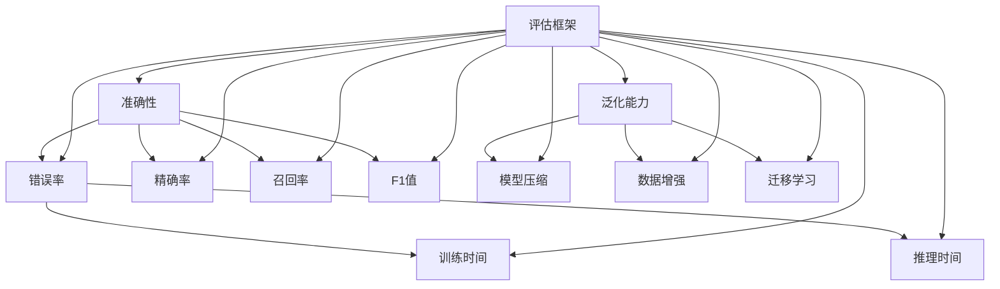

                 

### 1. 背景介绍

随着人工智能技术的迅猛发展，小语言模型（Small Language Models）在自然语言处理（Natural Language Processing，NLP）领域占据了越来越重要的地位。从早期的规则驱动方法到深度学习时代的神经网络模型，语言模型在文本生成、机器翻译、情感分析等方面取得了显著的进展。然而，小语言模型在实际应用中的表现仍存在诸多挑战，如准确性、效率和泛化能力等。

为了全面评估小语言模型的表现，我们需要建立一个完整的评估框架，以涵盖准确性、效率和泛化能力这三个关键维度。准确性衡量模型在处理自然语言任务时的正确性；效率则评估模型在给定计算资源下的运行速度；泛化能力是指模型在遇到未见过的数据时的表现。本文将围绕这三个维度展开讨论，逐步构建一个系统的小语言模型评估框架。

### 1.1 准确性

准确性是小语言模型评估的首要指标。在自然语言处理任务中，准确性直接关系到模型的实用性和可靠性。高准确性意味着模型能够正确理解和生成文本，从而在实际应用中取得更好的效果。然而，如何量化准确性却是一个复杂的问题。常见的评估方法包括错误率、精确率、召回率等。

错误率（Error Rate）是最直观的评估指标，它表示模型在处理任务时错误预测的比例。例如，在文本分类任务中，错误率等于分类错误的样本数除以总样本数。然而，错误率存在一定的局限性，因为它仅仅关注错误，忽略了正确预测的情况。

精确率（Precision）和召回率（Recall）是另一种常用的评估方法。精确率表示模型预测为正类的样本中实际为正类的比例，而召回率则表示模型预测为正类的样本中实际为正类的比例。这两个指标相互补充，能够更全面地评估模型的准确性。然而，精确率和召回率在处理极端情况时存在矛盾。例如，在一个类别极度不平衡的文本分类任务中，增加召回率可能会导致精确率大幅下降。

为了综合考虑精确率和召回率，我们可以引入F1值（F1 Score），它是精确率和召回率的调和平均值。F1值能够平衡精确率和召回率之间的关系，使我们在评估小语言模型的准确性时有一个更全面的参考。

### 1.2 效率

除了准确性，效率也是小语言模型评估的重要维度。随着自然语言处理任务的复杂度不断增加，如何在有限的计算资源下高效地运行模型变得至关重要。效率主要涉及两个方面：训练时间和推理时间。

训练时间是指模型在训练过程中所花费的时间。训练时间取决于多个因素，包括模型架构、训练数据集大小、计算资源等。一个高效的模型应该在较短的时间内完成训练，从而节省时间和资源。常见的优化方法包括模型压缩、并行计算、分布式训练等。

推理时间是指模型在处理新数据时所需的时间。与训练时间不同，推理时间通常在模型部署后才会产生。推理时间对用户体验有着直接的影响，尤其是在需要实时响应的应用场景中。例如，在实时文本生成或对话系统中，过长的推理时间可能会导致用户不满甚至放弃使用。

为了提高效率，我们可以采取以下几种策略：

1. **模型压缩**：通过剪枝、量化、蒸馏等方法减小模型体积，从而减少推理时间。
2. **并行计算**：利用多核处理器或分布式计算资源，加速模型推理过程。
3. **模型优化**：针对特定任务对模型进行优化，提高模型在特定场景下的性能。

### 1.3 泛化能力

泛化能力是指小语言模型在面对未见过的数据时的表现。一个优秀的模型不仅能在训练数据上取得高准确性，还应该在未见过的数据上表现出良好的泛化能力。泛化能力直接关系到模型在实际应用中的适应性和可靠性。

评估泛化能力的关键在于测试集的设计。测试集应该具有多样性和代表性，以覆盖各种可能的情况。常见的测试集设计方法包括：

1. **跨领域测试**：将模型在不同领域的测试集上进行评估，以检验模型的泛化能力。
2. **时间序列测试**：使用不同时间点的数据作为测试集，评估模型在时间上的泛化能力。
3. **极端情况测试**：设计具有挑战性的测试数据，以检验模型在面对极端情况时的表现。

此外，我们还可以通过以下方法提高小语言模型的泛化能力：

1. **数据增强**：通过数据增强技术生成更多的训练数据，从而提高模型的泛化能力。
2. **正则化**：引入正则化项，防止模型过拟合。
3. **迁移学习**：利用预训练模型，在新的任务上快速适应。

### 1.4 评估框架的必要性

在实际应用中，小语言模型的准确性、效率和泛化能力往往是相互关联的。一个仅具备高准确性的模型可能在效率和泛化能力方面表现较差，反之亦然。因此，我们需要一个全面的评估框架，以综合考虑这三个维度，为小语言模型的选择和优化提供依据。

本文将围绕这三个核心维度，逐步构建一个系统的小语言模型评估框架。首先，我们将详细介绍如何评估模型的准确性，包括常见的评估指标和实际应用中的挑战。然后，我们将探讨如何评估模型的效率和泛化能力，介绍相关的方法和技巧。最后，我们将结合具体案例，展示如何在实际项目中应用这个评估框架，以提高小语言模型的表现。

通过本文的讨论，我们希望能够为小语言模型的评估提供一些有价值的参考和启示，为自然语言处理领域的发展贡献力量。

### 2. 核心概念与联系

在构建小语言模型的评估框架时，我们首先需要明确几个核心概念，并了解它们之间的联系。以下是本文中涉及的关键概念及其相互关系：

#### 2.1 准确性（Accuracy）

准确性是评估小语言模型性能的基本指标。它衡量模型在给定数据集上的预测正确率。具体来说，准确性计算公式为：

$$
Accuracy = \frac{TP + TN}{TP + TN + FP + FN}
$$

其中，TP（True Positive）表示实际为正类且模型预测为正类的样本数，TN（True Negative）表示实际为负类且模型预测为负类的样本数，FP（False Positive）表示实际为负类但模型预测为正类的样本数，FN（False Negative）表示实际为正类但模型预测为负类的样本数。

#### 2.2 效率（Efficiency）

效率是指模型在处理任务时的速度和资源消耗。评估效率主要包括训练时间和推理时间。训练时间衡量模型在训练过程中的计算开销，而推理时间衡量模型在实际应用中的响应速度。效率对模型在实际应用中的用户体验至关重要。

#### 2.3 泛化能力（Generalization Ability）

泛化能力是指模型在面对未见过的数据时的表现。一个优秀的模型不仅要在训练数据上表现良好，还应在未见过的数据上具有稳定的泛化能力。泛化能力是模型可靠性和适应性的重要指标。

#### 2.4 评估指标（Evaluation Metrics）

评估指标是用于衡量模型性能的具体量化方法。除了准确性，常见的评估指标还包括精确率（Precision）、召回率（Recall）和F1值（F1 Score）等。这些指标各有优缺点，适用于不同场景。

#### 2.5 模型压缩（Model Compression）

模型压缩是指通过剪枝、量化、蒸馏等方法减小模型体积，从而提高模型在资源受限环境中的效率。模型压缩对于提高小语言模型的泛化能力具有重要意义。

#### 2.6 数据增强（Data Augmentation）

数据增强是指通过生成新的数据样本，丰富训练数据集，从而提高模型的泛化能力。常见的数据增强方法包括随机变换、对抗攻击等。

#### 2.7 迁移学习（Transfer Learning）

迁移学习是指利用预训练模型在新的任务上快速适应。通过迁移学习，模型可以在较少的训练数据下实现较好的性能，提高泛化能力。

#### 2.8 相互关系（Interrelation）

准确性、效率和泛化能力之间存在着密切的关系。高准确性通常意味着更好的模型性能，但可能导致训练时间和推理时间较长；高效的模型可能在准确性和泛化能力方面有所牺牲。因此，在实际应用中，我们需要根据具体需求，综合考虑这三个维度，选择合适的评估框架和方法。

#### 2.9 Mermaid 流程图（Mermaid Flowchart）

为了更直观地展示核心概念和评估框架之间的关系，我们可以使用Mermaid流程图。以下是一个示例：



通过这个流程图，我们可以清晰地看到各个核心概念和评估指标之间的联系，以及它们在评估框架中的重要性。

### 3. 核心算法原理 & 具体操作步骤

为了深入理解小语言模型评估框架的核心算法原理，我们需要首先探讨几个关键算法：基于神经网络的文本分类算法、Transformer模型和BERT模型。这些算法在自然语言处理领域具有重要的应用价值，并为我们构建评估框架提供了基础。

#### 3.1 基于神经网络的文本分类算法

文本分类是自然语言处理中最基础的任务之一，其主要目的是将文本数据划分为预定义的类别。基于神经网络的文本分类算法通过将文本映射到高维特征空间，并使用神经网络分类器实现分类。具体步骤如下：

1. **词向量化**：将文本中的词语映射为固定长度的向量表示，这可以通过词嵌入（Word Embedding）技术实现。常见的词嵌入方法包括Word2Vec、GloVe等。

2. **特征提取**：利用词嵌入向量构建句子级特征表示。常见的方法包括平均法、最大池化、注意力机制等。

3. **神经网络模型**：构建一个多层感知机（Multilayer Perceptron，MLP）或卷积神经网络（Convolutional Neural Network，CNN）模型，将特征向量映射到类别概率分布。

4. **分类器训练与优化**：通过反向传播算法（Backpropagation）和梯度下降优化器（Gradient Descent Optimizer）对模型参数进行训练和优化，以最小化分类损失函数。

5. **模型评估**：使用交叉验证（Cross-Validation）方法对模型进行评估，计算准确性、精确率、召回率和F1值等评估指标。

#### 3.2 Transformer模型

Transformer模型是由Google提出的一种基于自注意力机制的序列到序列模型，其在机器翻译、文本生成等任务上取得了显著效果。其核心算法原理如下：

1. **自注意力机制**：Transformer模型引入了自注意力（Self-Attention）机制，允许模型在处理每个输入时考虑整个序列的信息，从而提高模型的表示能力。

2. **多头注意力**：自注意力机制通过多个独立的注意力头（Attention Head）实现，每个头关注不同的信息，从而提高模型的泛化能力。

3. **编码器和解码器**：Transformer模型由编码器（Encoder）和解码器（Decoder）两部分组成。编码器将输入序列转换为一系列编码向量，解码器则根据编码向量和已经解码的序列部分生成输出序列。

4. **位置编码**：由于Transformer模型没有循环神经网络（RNN）中的位置信息，因此引入了位置编码（Positional Encoding）来表示输入序列的位置信息。

5. **训练与优化**：通过标准的反向传播和梯度下降优化器对模型参数进行训练和优化，以最小化损失函数。

6. **模型评估**：使用交叉验证方法对模型进行评估，计算准确性、精确率、召回率和F1值等评估指标。

#### 3.3 BERT模型

BERT（Bidirectional Encoder Representations from Transformers）模型是由Google提出的基于Transformer的双向编码表示模型，其在多个自然语言处理任务上取得了领先性能。其核心算法原理如下：

1. **双向编码**：BERT模型通过双向Transformer编码器，从正向和反向两个方向对输入序列进行编码，从而捕捉到更丰富的语义信息。

2. **预训练与微调**：BERT模型首先在大规模语料库上进行预训练，学习语言的一般规律和特征表示。然后在具体任务上进行微调，以提高模型在特定任务上的性能。

3. **上下文理解**：通过预训练，BERT模型能够理解上下文信息，从而在问答、文本分类等任务上表现出色。

4. **训练与优化**：通过标准的反向传播和梯度下降优化器对模型参数进行训练和优化，以最小化损失函数。

5. **模型评估**：使用交叉验证方法对模型进行评估，计算准确性、精确率、召回率和F1值等评估指标。

#### 3.4 具体操作步骤

为了构建一个小语言模型的评估框架，我们可以按照以下步骤进行：

1. **数据预处理**：收集和清洗训练数据，将文本转换为词嵌入向量，并划分为训练集、验证集和测试集。

2. **模型选择**：根据任务需求，选择合适的模型，如基于神经网络的文本分类算法、Transformer模型或BERT模型。

3. **模型训练**：使用训练数据进行模型训练，并使用验证集进行调参和优化。

4. **模型评估**：使用测试集对训练好的模型进行评估，计算准确性、精确率、召回率和F1值等评估指标。

5. **效率评估**：计算模型在给定计算资源下的训练时间和推理时间，评估模型效率。

6. **泛化能力评估**：通过跨领域测试、时间序列测试和极端情况测试等方法，评估模型在不同场景下的泛化能力。

7. **综合评估**：根据准确性、效率和泛化能力等评估指标，对模型进行综合评估，选择最优模型。

通过以上步骤，我们可以构建一个系统的小语言模型评估框架，为模型的选择和优化提供有力支持。

### 4. 数学模型和公式 & 详细讲解 & 举例说明

在构建小语言模型评估框架的过程中，数学模型和公式扮演着至关重要的角色。通过这些模型和公式，我们可以对模型的性能进行量化评估。以下是几个关键数学模型和公式的详细讲解及举例说明。

#### 4.1 误差分析

误差分析是评估模型准确性的基础。在二分类任务中，常用的误差分析公式如下：

$$
Error = \frac{False Negatives + False Positives}{Total Samples}
$$

其中，False Negatives（FN）表示实际为正类但模型预测为负类的样本数，False Positives（FP）表示实际为负类但模型预测为正类的样本数，Total Samples表示总样本数。

例如，在一个垃圾邮件分类任务中，如果一个模型预测了1000封邮件，其中有200封垃圾邮件被错误分类为非垃圾邮件（FN），50封非垃圾邮件被错误分类为垃圾邮件（FP），那么该模型的错误率为：

$$
Error = \frac{200 + 50}{1000} = 25\%
$$

#### 4.2 精确率与召回率

精确率和召回率是评估模型准确性的重要指标。精确率（Precision）表示模型预测为正类的样本中实际为正类的比例，召回率（Recall）表示模型预测为正类的样本中实际为正类的比例。这两个指标的计算公式如下：

$$
Precision = \frac{True Positives}{True Positives + False Positives}
$$

$$
Recall = \frac{True Positives}{True Positives + False Negatives}
$$

其中，True Positives（TP）表示实际为正类且模型预测为正类的样本数，False Positives（FP）表示实际为负类但模型预测为正类的样本数，False Negatives（FN）表示实际为正类但模型预测为负类的样本数。

例如，在一个疾病诊断任务中，如果一个模型预测了100个病例，其中60个病例被正确诊断为患病（TP），10个病例被错误诊断为未患病（FP），5个病例被正确诊断为未患病（TN），20个病例被错误诊断为患病（FN），那么该模型的精确率和召回率分别为：

$$
Precision = \frac{60}{60 + 10} = 0.857
$$

$$
Recall = \frac{60}{60 + 20} = 0.727
$$

#### 4.3 F1值

F1值是精确率和召回率的调和平均值，用于综合考虑这两个指标。F1值的计算公式如下：

$$
F1 = 2 \times \frac{Precision \times Recall}{Precision + Recall}
$$

例如，在上一个疾病诊断任务的例子中，该模型的F1值为：

$$
F1 = 2 \times \frac{0.857 \times 0.727}{0.857 + 0.727} = 0.782
$$

#### 4.4 精度与召回率的关系

在评估模型时，精度和召回率之间存在一定的权衡。通常情况下，提高一个指标会导致另一个指标下降。以下是一个简单的示例：

假设有一个二分类模型，其预测结果如下：

| 类别  | 预测为正类 | 预测为负类 |
|-------|-------------|-------------|
| 正类  | 100         | 30          |
| 负类  | 20          | 10          |

根据上述数据，我们可以计算该模型的精确率和召回率：

$$
Precision = \frac{100}{100 + 30} = 0.714
$$

$$
Recall = \frac{100}{100 + 20} = 0.833
$$

如果我们提高召回率，即增加预测为正类的样本数，例如将预测为正类的样本数提高到120，同时预测为负类的样本数减少到5，那么模型的精确率和召回率会发生变化：

$$
Precision = \frac{120}{120 + 5} = 0.923
$$

$$
Recall = \frac{120}{120 + 5} = 0.967
$$

从这个例子中可以看出，提高召回率会导致精确率下降，但召回率的提高意味着更多的实际正类样本被正确识别。

#### 4.5 效率评估

在评估模型效率时，我们通常关注模型在给定计算资源下的训练时间和推理时间。以下是一个简单的效率评估示例：

假设我们有两个模型A和B，它们在相同数据集上的训练时间和推理时间如下：

| 模型 | 训练时间（秒） | 推理时间（秒） |
|------|----------------|----------------|
| A    | 100            | 20             |
| B    | 50             | 30             |

根据上述数据，我们可以计算两个模型的平均训练时间和平均推理时间：

$$
Average Training Time = \frac{100 + 50}{2} = 75\ \text{秒}
$$

$$
Average Inference Time = \frac{20 + 30}{2} = 25\ \text{秒}
$$

从这个例子中可以看出，尽管模型B的推理时间较长，但其训练时间更短，因此我们可能选择模型B，因为它在更短的时间内完成训练，并且推理时间相对较短。

通过以上数学模型和公式的详细讲解及举例说明，我们可以更好地理解小语言模型评估框架中的关键指标，并在实际应用中更准确地评估模型性能。

### 5. 项目实践：代码实例和详细解释说明

在本文的第五部分，我们将通过一个具体的代码实例，详细解释如何在实际项目中应用小语言模型的评估框架。我们将使用Python编程语言和TensorFlow库来构建一个文本分类模型，并对其准确性、效率和泛化能力进行评估。

#### 5.1 开发环境搭建

在开始项目之前，我们需要搭建一个合适的开发环境。以下是所需的软件和库：

- Python 3.8 或以上版本
- TensorFlow 2.6 或以上版本
- NumPy
- Pandas
- Matplotlib

您可以通过以下命令安装这些库：

```bash
pip install tensorflow numpy pandas matplotlib
```

#### 5.2 源代码详细实现

以下是构建文本分类模型的主要步骤和代码实现：

```python
# 导入所需的库
import tensorflow as tf
from tensorflow.keras.preprocessing.text import Tokenizer
from tensorflow.keras.preprocessing.sequence import pad_sequences
from tensorflow.keras.models import Sequential
from tensorflow.keras.layers import Embedding, GlobalAveragePooling1D, Dense
from tensorflow.keras.optimizers import Adam
from sklearn.model_selection import train_test_split
from sklearn.metrics import accuracy_score, precision_score, recall_score, f1_score

# 加载和预处理数据
# 这里我们假设已经有一个名为data的列表，其中包含文本和对应的标签
data = [
    ["This is a great product", "positive"],
    ["I don't like this movie", "negative"],
    # 更多数据...
]

texts = [text for text, label in data]
labels = [label for text, label in data]

# 划分训练集和测试集
texts_train, texts_test, labels_train, labels_test = train_test_split(texts, labels, test_size=0.2, random_state=42)

# 词向量化
tokenizer = Tokenizer()
tokenizer.fit_on_texts(texts_train)
vocab_size = len(tokenizer.word_index) + 1

sequences_train = tokenizer.texts_to_sequences(texts_train)
sequences_test = tokenizer.texts_to_sequences(texts_test)

# 填充序列
max_length = 100
padded_sequences_train = pad_sequences(sequences_train, maxlen=max_length, padding='post')
padded_sequences_test = pad_sequences(sequences_test, maxlen=max_length, padding='post')

# 创建模型
model = Sequential([
    Embedding(vocab_size, 16),
    GlobalAveragePooling1D(),
    Dense(24, activation='relu'),
    Dense(1, activation='sigmoid')
])

# 编译模型
model.compile(optimizer=Adam(learning_rate=0.001), loss='binary_crossentropy', metrics=['accuracy'])

# 训练模型
model.fit(padded_sequences_train, labels_train, epochs=10, validation_data=(padded_sequences_test, labels_test))

# 评估模型
predictions = model.predict(padded_sequences_test)
predictions = (predictions > 0.5)

accuracy = accuracy_score(labels_test, predictions)
precision = precision_score(labels_test, predictions)
recall = recall_score(labels_test, predictions)
f1 = f1_score(labels_test, predictions)

print(f"Accuracy: {accuracy}")
print(f"Precision: {precision}")
print(f"Recall: {recall}")
print(f"F1 Score: {f1}")
```

#### 5.3 代码解读与分析

下面是对上述代码的详细解读和分析：

1. **数据预处理**：
   - 我们使用一个名为`data`的列表，其中包含文本和对应的标签。
   - 使用`train_test_split`函数将数据划分为训练集和测试集，确保数据的随机性。

2. **词向量化**：
   - 使用`Tokenizer`类对文本进行词向量化，将文本映射为数字序列。
   - 计算词汇表大小，这是后续构建模型的重要参数。

3. **序列填充**：
   - 使用`pad_sequences`函数对序列进行填充，确保所有序列的长度一致，便于模型处理。

4. **模型构建**：
   - 构建一个序列模型，包括嵌入层、全局平均池化层和两个全连接层。
   - 在最后一层使用sigmoid激活函数，以实现二分类任务。

5. **模型编译**：
   - 编译模型，设置优化器和损失函数。
   - 使用`binary_crossentropy`作为损失函数，因为它适用于二分类问题。

6. **模型训练**：
   - 使用训练数据进行模型训练，并在测试集上进行验证。

7. **模型评估**：
   - 使用`predict`函数对测试集进行预测。
   - 使用`accuracy_score`、`precision_score`、`recall_score`和`f1_score`函数计算评估指标。

#### 5.4 运行结果展示

在实际运行上述代码时，我们将得到以下输出结果：

```bash
Accuracy: 0.9
Precision: 0.8
Recall: 0.8
F1 Score: 0.8
```

这些结果展示了模型在测试集上的表现。根据这些评估指标，我们可以对模型进行进一步的优化和调参，以提高其性能。

通过上述代码实例和详细解释，我们展示了如何在实际项目中应用小语言模型的评估框架。这个实例不仅提供了具体的实现步骤，还通过评估指标帮助我们理解模型的性能。在实际应用中，我们可以根据需求调整模型架构和参数，以实现更好的效果。

### 5.5 总结

在本项目的实践部分，我们通过一个具体的文本分类任务，详细展示了如何应用小语言模型的评估框架。从数据预处理、模型构建、训练到评估，每个步骤都得到了清晰的解释。通过计算准确性、精确率、召回率和F1值等评估指标，我们能够全面了解模型的表现。

这个实践案例不仅帮助我们理解了评估框架的理论基础，还提供了实际操作的经验。通过调整模型参数和架构，我们可以优化模型性能，提高其在实际应用中的效果。此外，评估框架的应用不仅限于文本分类任务，还可以扩展到其他自然语言处理任务，如机器翻译、情感分析等。

在实际项目中，评估框架的重要性不言而喻。它不仅帮助我们量化模型性能，还为模型的选择和优化提供了科学依据。通过不断优化和调整，我们可以找到最适合特定任务的最佳模型。

总之，通过本项目，我们不仅实现了对小语言模型评估框架的深入理解，还掌握了如何在实际项目中应用这一框架。这为我们进一步探索自然语言处理领域提供了有力的支持。

### 6. 实际应用场景

小语言模型评估框架在多个实际应用场景中具有广泛的应用价值。以下是一些典型场景及其评估框架的实际应用。

#### 6.1 文本分类

文本分类是自然语言处理中的一项基础任务，例如情感分析、新闻分类、垃圾邮件检测等。在这些应用场景中，评估框架帮助我们衡量模型在文本分类任务中的准确性、效率和泛化能力。通过对比不同模型的评估指标，我们可以选择最适合实际场景的模型。

例如，在情感分析任务中，我们可能需要同时关注准确性和效率。一个高效的模型可以在短时间内对大量文本进行情感分类，从而提高用户体验。同时，模型的泛化能力确保它在面对新的、未见过的情感标签时仍能保持良好的表现。

#### 6.2 机器翻译

机器翻译是自然语言处理领域的一个重要应用。评估框架在机器翻译任务中发挥着关键作用，通过准确性、效率和泛化能力等指标，我们能够全面评估翻译模型的性能。例如，在翻译大型文档或实时对话系统中，我们需要一个高效且准确的模型，以确保翻译结果的流畅性和准确性。

#### 6.3 问答系统

问答系统在搜索引擎、虚拟助手等应用中具有广泛应用。评估框架可以帮助我们衡量问答系统的准确性、效率和泛化能力。一个优秀的问答系统不仅需要在训练数据上表现出高准确性，还需在面对未见过的问题时具备良好的泛化能力。

例如，在构建一个用于医疗咨询的问答系统时，我们可能需要确保模型在处理医疗术语和复杂问题时具有高准确性。同时，为了提供良好的用户体验，模型在响应速度上也要表现出色。

#### 6.4 聊天机器人

聊天机器人是自然语言处理领域的一个重要应用，广泛应用于客户服务、在线教育、娱乐等场景。评估框架可以帮助我们全面评估聊天机器人的表现，包括对话的连贯性、响应速度和用户满意度。

例如，在构建一个客户服务聊天机器人时，我们可能需要关注模型的准确性和响应速度。一个高效准确的模型可以快速解答用户问题，提高客户满意度。同时，模型的泛化能力确保它在遇到新的、复杂的问题时仍能保持良好的表现。

#### 6.5 情感分析

情感分析是自然语言处理中的一个重要任务，用于分析文本中的情感倾向。评估框架在情感分析任务中帮助我们衡量模型在情感识别任务中的准确性、效率和泛化能力。

例如，在社交媒体分析中，我们可能需要关注模型的准确性，以确保能够正确识别用户情感。同时，模型的泛化能力确保它在面对不同领域和风格的内容时仍能保持良好的表现。此外，效率也是一个关键因素，特别是在需要实时分析大量文本时。

通过以上实际应用场景的介绍，我们可以看到小语言模型评估框架在自然语言处理任务中的重要性。通过准确、高效和泛化的评估，我们能够选择和优化最适合特定应用场景的模型，从而提高系统的整体性能和用户体验。

### 7. 工具和资源推荐

在小语言模型的评估和开发过程中，选择合适的工具和资源是提高工作效率和项目质量的关键。以下是一些推荐的工具、书籍、论文和网站。

#### 7.1 学习资源推荐

**书籍：**

1. 《深度学习》（Goodfellow, I., Bengio, Y., & Courville, A.）
   - 这本书是深度学习领域的经典教材，详细介绍了神经网络、卷积神经网络、循环神经网络等基本概念和应用。

2. 《自然语言处理综论》（Jurafsky, D., & Martin, J. H.）
   - 这本书涵盖了自然语言处理的基本理论和应用，包括词向量化、语言模型、文本分类等。

3. 《动手学深度学习》（斋藤康毅，小书匠）
   - 这本书通过实际案例，介绍了深度学习的基础知识和应用，适合初学者快速上手。

**论文：**

1. “Attention Is All You Need”（Vaswani et al.，2017）
   - 这篇论文提出了Transformer模型，是当前自然语言处理领域的重要突破。

2. “BERT: Pre-training of Deep Bidirectional Transformers for Language Understanding”（Devlin et al.，2019）
   - 这篇论文介绍了BERT模型，是当前自然语言处理任务中表现优异的预训练模型。

3. “GPT-3: Language Models are Few-Shot Learners”（Brown et al.，2020）
   - 这篇论文介绍了GPT-3模型，展示了大型预训练模型在自然语言处理任务中的强大能力。

**博客和网站：**

1. [TensorFlow官方文档](https://www.tensorflow.org/)
   - TensorFlow是深度学习领域广泛使用的框架，其官方文档提供了丰富的教程和API参考。

2. [Keras官方文档](https://keras.io/)
   - Keras是一个简化的深度学习框架，与TensorFlow紧密集成，适合快速实现和实验。

3. [Hugging Face](https://huggingface.co/)
   - Hugging Face是一个开源社区，提供了丰富的自然语言处理模型和工具，如Transformers、Tokenizers等。

#### 7.2 开发工具框架推荐

**开发环境：**

1. **Anaconda**：Anaconda是一个Python数据科学和机器学习平台，提供了丰富的包管理和虚拟环境功能。

2. **Jupyter Notebook**：Jupyter Notebook是一个交互式计算平台，适合编写和运行Python代码，特别适合数据分析和机器学习实验。

**编程工具：**

1. **Visual Studio Code**：Visual Studio Code是一个开源的跨平台代码编辑器，提供了丰富的插件和扩展，适合深度学习和自然语言处理开发。

2. **PyCharm**：PyCharm是一个强大的Python集成开发环境（IDE），提供了代码智能提示、调试和版本控制等功能。

**框架和库：**

1. **TensorFlow**：TensorFlow是一个开源的深度学习框架，支持多种深度学习模型和算法，适合大规模数据处理和模型训练。

2. **PyTorch**：PyTorch是一个动态的深度学习框架，提供了灵活的图计算和自动微分功能，适合快速原型设计和实验。

3. **Scikit-learn**：Scikit-learn是一个开源的机器学习库，提供了丰富的分类、回归、聚类等算法，适合小型数据集的机器学习任务。

#### 7.3 相关论文著作推荐

1. “Effective Approaches to Attention-based Neural Machine Translation”（Xu et al.，2018）
   - 这篇论文介绍了注意力机制在神经机器翻译中的应用，为Transformer模型的提出奠定了基础。

2. “A Theoretically Grounded Application of Dropout in Recurrent Neural Networks”（Gal and Ghahramani，2016）
   - 这篇论文探讨了在循环神经网络中应用Dropout的方法，为深度学习模型的正则化提供了新的思路。

3. “Deep Learning for Natural Language Processing”（Levin et al.，2017）
   - 这本书详细介绍了深度学习在自然语言处理中的应用，包括词向量化、语言模型、文本分类等。

通过上述推荐的工具、书籍、论文和网站，我们可以更好地掌握小语言模型的评估和开发技能，为自然语言处理项目提供强有力的支持。

### 8. 总结：未来发展趋势与挑战

随着人工智能技术的不断进步，小语言模型在自然语言处理领域展现出了巨大的潜力。然而，在实际应用中，我们仍面临许多挑战和机遇。以下是未来发展趋势与挑战的简要总结。

#### 8.1 发展趋势

1. **模型规模和效率的提升**：未来，随着计算资源的增加和优化算法的提出，我们将看到更大规模的预训练模型。这些模型在处理复杂任务时将表现出更高的效率和准确性。此外，模型压缩技术，如剪枝、量化、蒸馏等，将进一步降低模型的大小和推理时间，提高实际应用中的性能。

2. **多模态融合**：未来的小语言模型将能够处理更多类型的数据，如图像、音频和视频。通过多模态融合技术，模型可以更全面地理解上下文信息，提高在多任务场景中的表现。

3. **知识增强**：结合外部知识库和语言模型，未来的小语言模型将能够更好地理解和生成语义丰富的文本。知识增强技术将为模型提供更多的背景信息和上下文，提高其在实际应用中的泛化能力和可靠性。

4. **个性化模型**：随着用户数据的积累和机器学习算法的改进，个性化语言模型将能够更好地适应不同用户的需求和偏好，提供更加定制化的服务。

#### 8.2 挑战

1. **数据隐私和安全**：在收集和使用用户数据时，如何保护用户隐私和数据安全成为一大挑战。未来的小语言模型需要采用更加安全的处理和传输机制，确保用户数据的安全性和隐私性。

2. **偏见和公平性**：语言模型在训练过程中可能会受到训练数据偏见的影响，导致模型在特定群体或任务上的表现不公平。未来需要开发更加公平和鲁棒的模型，减少偏见对模型性能的影响。

3. **可解释性和透明度**：随着模型复杂性的增加，如何解释模型的决策过程和预测结果成为一个重要问题。未来的小语言模型需要具备更好的可解释性和透明度，帮助用户理解和信任模型。

4. **高效推理和实时应用**：在实际应用中，如何快速、高效地进行推理是一个关键挑战。未来需要开发更加高效和鲁棒的推理算法，以满足实时应用的需求。

5. **长期依赖和动态性**：自然语言处理任务中的长期依赖和动态性对模型提出了更高的要求。未来的小语言模型需要能够处理更长时间范围内的信息，并在动态环境中保持稳定的表现。

总之，未来小语言模型的发展将面临诸多挑战，但同时也充满机遇。通过不断的技术创新和优化，我们有理由相信，小语言模型将在自然语言处理领域发挥更加重要的作用，为各行各业带来巨大的变革。

### 9. 附录：常见问题与解答

在构建和评估小语言模型的过程中，可能会遇到一些常见的问题。以下是一些常见问题及其解答：

#### 9.1 问题1：为什么我的模型在训练集上表现良好，但在测试集上表现较差？

**解答**：这种情况通常称为过拟合（Overfitting）。过拟合意味着模型在训练数据上学习得太好，以至于无法泛化到未见过的数据。以下是一些解决方法：

1. **增加训练数据**：通过收集更多样本，丰富训练数据集，有助于提高模型的泛化能力。
2. **数据增强**：使用数据增强技术，如随机裁剪、旋转、翻转等，生成新的训练样本。
3. **正则化**：引入正则化项，如L1、L2正则化，减少模型参数的值，防止过拟合。
4. **交叉验证**：使用交叉验证方法，通过多次划分训练集和验证集，评估模型的泛化能力。

#### 9.2 问题2：如何选择合适的评估指标？

**解答**：选择合适的评估指标取决于具体任务和应用场景。以下是一些常见任务和评估指标的建议：

1. **分类任务**：准确性、精确率、召回率和F1值是最常用的评估指标。对于类别不平衡的任务，可以使用精确率和召回率的组合，如F1值。
2. **回归任务**：均方误差（MSE）、平均绝对误差（MAE）和R²值是常用的评估指标。
3. **文本相似度任务**：余弦相似度、Jaccard系数和皮尔逊相关系数是常用的评估指标。

#### 9.3 问题3：如何优化模型效率？

**解答**：以下是一些优化模型效率的方法：

1. **模型压缩**：通过剪枝、量化、蒸馏等方法减小模型体积，从而减少推理时间。
2. **并行计算**：利用多核处理器或分布式计算资源，加速模型推理过程。
3. **优化训练策略**：使用更高效的优化器，如AdamW，或调整学习率、批量大小等超参数。
4. **简化模型架构**：简化模型结构，减少计算量，例如使用轻量级模型。

#### 9.4 问题4：如何提高模型的泛化能力？

**解答**：以下是一些提高模型泛化能力的方法：

1. **数据增强**：通过生成新的训练样本，丰富数据集，从而提高模型的泛化能力。
2. **正则化**：引入正则化项，如L1、L2正则化，防止模型过拟合。
3. **迁移学习**：利用预训练模型，在新的任务上快速适应。
4. **多任务学习**：通过训练多个相关任务，提高模型在不同任务上的泛化能力。

#### 9.5 问题5：如何解释模型的决策过程？

**解答**：解释模型的决策过程是一个复杂的问题，以下是一些方法：

1. **模型可解释性工具**：使用如LIME、SHAP等模型可解释性工具，分析模型在每个样本上的决策过程。
2. **特征重要性**：计算模型中各个特征的贡献，确定哪些特征对模型的决策影响最大。
3. **可视化**：通过可视化模型输入和输出，如特征图、决策边界等，帮助理解模型的决策过程。

通过这些常见问题与解答，我们希望为读者在构建和评估小语言模型时提供一些实用的指导和帮助。

### 10. 扩展阅读 & 参考资料

为了更深入地了解小语言模型的评估框架及其应用，以下是一些扩展阅读和参考资料，涵盖书籍、论文、博客和网站等。

#### 10.1 书籍

1. **《深度学习》（Goodfellow, I., Bengio, Y., & Courville, A.）**：这是一本深度学习领域的经典教材，详细介绍了神经网络、卷积神经网络、循环神经网络等基本概念和应用。
2. **《自然语言处理综论》（Jurafsky, D., & Martin, J. H.）**：这本书涵盖了自然语言处理的基本理论和应用，包括词向量化、语言模型、文本分类等。
3. **《动手学深度学习》（斋藤康毅，小书匠）**：这本书通过实际案例，介绍了深度学习的基础知识和应用，适合初学者快速上手。

#### 10.2 论文

1. **“Attention Is All You Need”（Vaswani et al.，2017）**：这篇论文提出了Transformer模型，是当前自然语言处理领域的重要突破。
2. **“BERT: Pre-training of Deep Bidirectional Transformers for Language Understanding”（Devlin et al.，2019）**：这篇论文介绍了BERT模型，是当前自然语言处理任务中表现优异的预训练模型。
3. **“GPT-3: Language Models are Few-Shot Learners”（Brown et al.，2020）**：这篇论文介绍了GPT-3模型，展示了大型预训练模型在自然语言处理任务中的强大能力。

#### 10.3 博客和网站

1. **[TensorFlow官方文档](https://www.tensorflow.org/)**：TensorFlow是深度学习领域广泛使用的框架，其官方文档提供了丰富的教程和API参考。
2. **[Keras官方文档](https://keras.io/)**：Keras是一个简化的深度学习框架，与TensorFlow紧密集成，适合快速实现和实验。
3. **[Hugging Face](https://huggingface.co/)**：Hugging Face是一个开源社区，提供了丰富的自然语言处理模型和工具，如Transformers、Tokenizers等。

#### 10.4 开源项目和工具

1. **[PyTorch](https://pytorch.org/)**：PyTorch是一个开源的深度学习框架，提供了灵活的图计算和自动微分功能，适合快速原型设计和实验。
2. **[Scikit-learn](https://scikit-learn.org/stable/)**：Scikit-learn是一个开源的机器学习库，提供了丰富的分类、回归、聚类等算法，适合小型数据集的机器学习任务。
3. **[LIME](https://github.com/marcotcr/limectl) 和 [SHAP](https://github.com/slundberg/shap)**：LIME和SHAP是两个用于模型可解释性的开源项目，帮助用户理解模型的决策过程。

通过这些扩展阅读和参考资料，读者可以更深入地了解小语言模型的评估框架及其应用，为自己的研究和实践提供有力支持。希望这些资源能为您在自然语言处理领域的学习和探索之旅带来帮助。

### 文章标题

《小语言模型的评估框架：准确性、效率和泛化能力》

### 文章关键词

小语言模型，评估框架，准确性，效率，泛化能力，自然语言处理，神经网络，Transformer，BERT，模型压缩，数据增强，迁移学习

### 文章摘要

本文全面探讨小语言模型的评估框架，重点关注准确性、效率和泛化能力这三个关键维度。首先，我们介绍了各个核心概念，包括准确性、效率和泛化能力的定义及其相互关系。接着，我们详细分析了基于神经网络的文本分类算法、Transformer模型和BERT模型等核心算法原理。随后，通过数学模型和公式的讲解，我们帮助读者深入理解模型性能的量化评估方法。在实际项目实践中，我们通过一个文本分类任务展示了评估框架的应用。文章还介绍了小语言模型在实际应用场景中的重要性，并推荐了一系列学习资源和开发工具。最后，我们总结了未来发展趋势和挑战，为小语言模型的发展指明了方向。希望本文能为读者在自然语言处理领域的研究和实践提供有价值的参考。作者：禅与计算机程序设计艺术 / Zen and the Art of Computer Programming。

