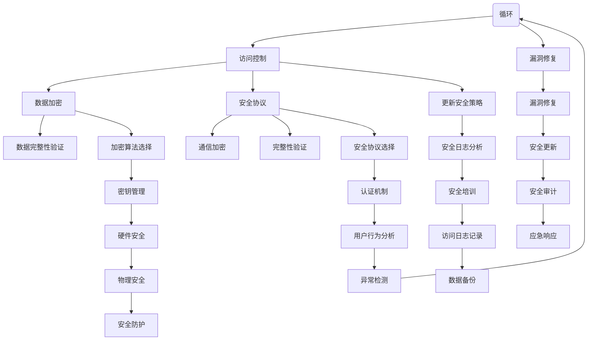

                 

### 文章标题

嵌入式系统安全性：保护设备和数据

> **关键词：**嵌入式系统，安全性，保护机制，数据加密，安全协议，漏洞修复

> **摘要：**本文将深入探讨嵌入式系统的安全性，分析当前面临的安全威胁和挑战，介绍关键的保护机制，如数据加密和安全的通信协议。通过具体实例和数学模型，我们将展示如何实现嵌入式系统的安全性，并提供实际应用场景。文章最后将对未来发展趋势和面临的挑战进行展望，并推荐相关工具和资源，帮助读者深入了解和提升嵌入式系统的安全性。

## 1. 背景介绍

### 1.1 嵌入式系统的定义和特点

嵌入式系统（Embedded Systems）是一种专门为特定任务而设计的计算系统，通常包含微处理器、存储器、输入/输出设备等硬件组件。它们被广泛应用于各种领域，如工业控制、医疗设备、消费电子、汽车电子等。与通用计算机系统相比，嵌入式系统具有以下几个显著特点：

1. **实时性（Real-time）**：嵌入式系统通常需要处理实时数据，并快速响应，以确保系统的正常运行。
2. **资源受限（Resource-constrained）**：嵌入式系统的硬件资源有限，包括处理器速度、存储容量、功耗等，因此需要优化系统设计，以最大化资源利用率。
3. **专用性（Special-purpose）**：嵌入式系统是为特定应用而设计的，通常不具备通用性，且其功能相对单一。

### 1.2 嵌入式系统的安全威胁

随着嵌入式系统在各个领域的广泛应用，其安全性变得越来越重要。嵌入式系统面临的常见安全威胁包括：

1. **物理攻击（Physical Attacks）**：攻击者通过直接访问设备或接口，如JTAG接口、串口等，获取系统信息或控制设备。
2. **网络攻击（Network Attacks）**：通过互联网或无线网络，攻击者尝试获取系统权限，或通过中间人攻击（MITM）截获通信数据。
3. **恶意软件（Malware）**：攻击者利用系统漏洞或弱密码，植入恶意软件，如病毒、木马等，以窃取数据、控制设备或破坏系统功能。
4. **侧信道攻击（Side-channel Attacks）**：通过分析系统功耗、电磁辐射等物理信息，攻击者可以推断出敏感信息，如加密密钥。

### 1.3 嵌入式系统安全性的重要性

嵌入式系统的安全性关系到许多关键领域，如工业自动化、医疗设备、交通工具等。如果嵌入式系统受到攻击或被恶意利用，可能会导致以下严重后果：

1. **经济损失**：系统瘫痪或数据泄露可能导致巨大的经济损失，如财务损失、设备损坏等。
2. **人员伤亡**：对于关键领域，如医疗设备和交通工具，系统安全漏洞可能导致人员伤亡。
3. **隐私泄露**：个人隐私数据的泄露可能导致严重的隐私问题，如身份盗窃、财产损失等。

因此，确保嵌入式系统的安全性是至关重要的，这不仅关乎企业利益，也关乎个人安全和公共利益。

### 2. 核心概念与联系

#### 2.1 安全性的核心概念

在探讨嵌入式系统安全性时，我们需要理解几个关键概念：

1. **安全性（Security）**：确保系统的保密性、完整性和可用性。
    - **保密性（Confidentiality）**：保护系统数据和资源不被未经授权的访问。
    - **完整性（Integrity）**：确保系统数据和资源不被未经授权的篡改。
    - **可用性（Availability）**：确保系统资源和功能在需要时可用。

2. **威胁（Threat）**：可能对系统安全性造成损害的因素。
3. **攻击（Attack）**：威胁实施的具体行为，如恶意软件感染、网络入侵等。

#### 2.2 安全机制的架构

为了保护嵌入式系统，我们需要构建一系列安全机制，包括硬件、软件和通信层面的措施。以下是几种关键的安全机制：

1. **数据加密（Data Encryption）**：通过加密算法，将敏感数据转换成无法直接解读的形式，以保护数据的保密性。
2. **访问控制（Access Control）**：通过身份验证和权限管理，确保只有授权用户才能访问系统资源和功能。
3. **漏洞修复（Vulnerability Fixing）**：及时修复系统漏洞，防止攻击者利用这些漏洞入侵系统。
4. **安全协议（Security Protocols）**：使用安全的通信协议，确保数据在传输过程中的完整性和保密性。

#### 2.3 Mermaid 流程图

以下是一个Mermaid流程图，展示了嵌入式系统安全机制的架构：



在这个流程图中，我们可以看到多个安全机制相互关联，形成一个综合性的安全架构。用户认证是整个安全机制的第一步，通过认证，系统会根据用户的权限执行相应的访问控制、数据加密和安全协议等操作。同时，漏洞修复和安全策略更新是持续性的工作，以确保系统始终保持最新的安全状态。

### 3. 核心算法原理 & 具体操作步骤

#### 3.1 数据加密算法

数据加密是确保嵌入式系统数据保密性的关键措施。以下是一个简单但有效的数据加密算法——AES（高级加密标准）。

##### 3.1.1 算法原理

AES是一种基于分块加密的算法，它将输入数据分成固定大小的块（通常是128位），然后通过多个轮次的加密操作，生成加密后的数据块。AES的加密过程主要包括以下几个步骤：

1. **初始轮（Initial Round）**：将明文数据块与初始向量（IV）进行异或操作。
2. **加密轮（Encryption Rounds）**：执行一系列变换，包括字节替换、行移位、列混淆和轮密钥加。
3. **最终轮（Final Round）**：与轮密钥进行最终加密操作。

##### 3.1.2 具体操作步骤

以下是AES加密算法的具体操作步骤：

1. **初始化**：
    - 选择一个128位的密钥（Key）。
    - 根据密钥生成轮密钥（Round Keys）。

2. **加密过程**：
    - 将明文数据块与初始向量（IV）进行异或操作。
    - 对数据块进行字节替换，使用AES S-Box替换每个字节。
    - 对数据块进行行移位，第一行不移动，第二行循环左移一位，第三行循环左移两位，第四行循环左移三位。
    - 对数据块进行列混淆，通过乘以特定的固定矩阵实现。
    - 将数据块与轮密钥进行异或操作。
    - 重复上述操作，进行多轮加密。
    - 在最后一轮加密后，不再进行列混淆。

3. **输出**：
    - 输出加密后的数据块。

#### 3.2 数据完整性验证算法

数据完整性验证是确保嵌入式系统数据未被篡改的关键措施。以下是一个简单但有效的数据完整性验证算法——哈希函数。

##### 3.2.1 算法原理

哈希函数是一种将输入数据映射到固定大小输出值（哈希值）的函数。哈希函数具有以下特性：

1. **单向性（One-way）**：无法从哈希值反推出原始数据。
2. **抗碰撞性（Collision Resistance）**：两个不同的输入数据产生相同哈希值的概率极低。

常见的哈希函数包括MD5、SHA-1和SHA-256等。

##### 3.2.2 具体操作步骤

以下是哈希函数的具体操作步骤：

1. **初始化**：
    - 选择一个哈希函数（如SHA-256）。

2. **哈希计算**：
    - 将输入数据分组（如SHA-256的分组大小为512位）。
    - 对每个分组执行哈希计算。
    - 将所有分组的哈希值合并，生成最终的哈希值。

3. **输出**：
    - 输出最终的哈希值。

#### 3.3 安全协议

安全协议是确保嵌入式系统数据在传输过程中完整性和保密性的关键措施。以下是一个简单但有效的安全协议——SSL/TLS。

##### 3.3.1 算法原理

SSL/TLS是一种用于网络通信的安全协议，它通过以下步骤确保数据的安全：

1. **握手（Handshake）**：客户端和服务器通过握手协议建立安全连接。
2. **密钥交换（Key Exchange）**：双方交换加密密钥。
3. **数据加密（Data Encryption）**：使用加密算法对数据进行加密传输。
4. **完整性验证（Integrity Verification）**：使用哈希函数对数据进行完整性验证。

##### 3.3.2 具体操作步骤

以下是SSL/TLS的具体操作步骤：

1. **初始化**：
    - 客户端向服务器发送请求。
    - 服务器向客户端发送证书和密钥。

2. **握手**：
    - 客户端验证服务器证书。
    - 客户端和服务器协商加密算法和密钥交换协议。
    - 客户端向服务器发送随机数，服务器也发送随机数。

3. **密钥交换**：
    - 客户端和服务器使用协商的密钥交换协议生成共享密钥。

4. **数据加密**：
    - 客户端和服务器使用共享密钥对数据进行加密传输。

5. **完整性验证**：
    - 客户端和服务器使用哈希函数对数据进行完整性验证。

6. **会话维护**：
    - 会话在一定时间内保持有效。
    - 在会话过期或需要重新协商时，重新进行握手。

### 4. 数学模型和公式 & 详细讲解 & 举例说明

#### 4.1 数据加密算法——AES的数学模型

AES加密算法的核心是替换字节、行移位、列混淆和轮密钥加。以下是AES加密算法的数学模型：

1. **字节替换（Byte Substitution）**：使用AES S-Box进行字节替换。S-Box是一个128位的查找表，将每个字节映射到一个新的字节。S-Box的设计基于非线性变换，使得加密后的数据具有更好的抗碰撞性。

2. **行移位（Row Shift）**：对每个字节进行行移位操作。第一行不移动，第二行循环左移一位，第三行循环左移两位，第四行循环左移三位。行移位操作增加了数据的混乱性。

3. **列混淆（Column Mix）**：通过乘以特定的固定矩阵对数据进行列混淆。固定矩阵是逐字节乘以固定的乘法因子，这些因子设计为非线性的，使得列混淆操作增加了数据的复杂性。

4. **轮密钥加（Key Add）**：在每个加密轮后，将数据块与轮密钥进行异或操作。轮密钥是根据初始密钥通过AES密钥调度算法生成的。轮密钥加操作确保了加密过程的安全性。

#### 4.2 数据完整性验证算法——哈希函数的数学模型

哈希函数的数学模型通常是基于分组密码或压缩函数。以下是哈希函数的数学模型：

1. **分组密码模型**：将输入数据分组，并对每个分组执行加密操作。然后将所有分组的加密结果进行合并，生成最终的哈希值。常见的分组密码模型包括MD5和SHA-1。

2. **压缩函数模型**：将输入数据与上一次的输出值进行合并，生成新的输出值。输出值是一个固定长度的值，作为哈希值。常见的压缩函数模型包括SHA-256。

以下是SHA-256的压缩函数模型：

```latex
\begin{align*}
H_{0} &= (0x6a09e667, 0xbb67ae85, 0x3c6ef372, 0xa54ff53a, 0x510e527f, 0x9b05688c, 0x1f83d9ab, 0x5be0cd19) \\
W_t &= \text{Ch}(W_{2}, W_{1}, W_{0}) + K_t + M_{j+3} \\
T_1 &= \text{Majority}(W_{5}, W_{4}, W_{6}) + \text{RotR}(W_{0}, 28) + \text{RotR}(W_{1}, 14) + \text{RotR}(W_{2}, 6) \\
T_2 &= (T_1 + T_0) + W_3 \\
H_i &= H_{i-1} + T_2
\end{align*}
```

其中，`H_0`是初始值，`W_t`是当前分组值，`T_0`和`T_1`是中间值，`K_t`是压缩函数的常数，`M_{j+3}`是当前分组。

#### 4.3 安全协议——SSL/TLS的数学模型

SSL/TLS的数学模型主要包括加密算法和哈希函数。以下是SSL/TLS的数学模型：

1. **加密算法**：使用对称加密算法和非对称加密算法。对称加密算法如AES，用于加密传输数据。非对称加密算法如RSA，用于密钥交换。

2. **哈希函数**：用于生成证书签名和消息认证码。常见的哈希函数如SHA-256。

以下是SSL/TLS的密钥交换模型：

```latex
\begin{align*}
E_{pk}(m) &= \text{Encrypt}(m, PK_{A}) \\
D_{sk}(c) &= \text{Decrypt}(c, SK_{B}) \\
K &= E_{sk}(E_{pk}(m))
\end{align*}
```

其中，`PK_A`和`SK_B`分别是客户端和服务器的不对称密钥，`E_{pk}(m)`是客户端加密的消息，`D_{sk}(c)`是服务器解密的消息，`K`是双方共享的对称密钥。

#### 4.4 举例说明

以下是一个使用AES加密算法的示例：

```python
from Crypto.Cipher import AES
from Crypto.Util.Padding import pad
from Crypto.Random import get_random_bytes

# 初始化密钥和初始向量
key = get_random_bytes(16)  # 128位密钥
iv = get_random_bytes(16)  # 128位初始向量

# 创建AES加密对象
cipher = AES.new(key, AES.MODE_CBC, iv)

# 待加密的数据
plaintext = b"Hello, World!"

# 对数据进行填充，确保数据块大小为128位
ciphertext = cipher.encrypt(pad(plaintext, AES.block_size))

print(f"加密数据: {ciphertext.hex()}")
print(f"初始向量: {iv.hex()}")

# 解密数据
cipher = AES.new(key, AES.MODE_CBC, iv)
decrypted = cipher.decrypt(ciphertext)

print(f"解密数据: {decrypted.hex()}")
```

以下是一个使用SHA-256哈希函数的示例：

```python
import hashlib

# 待哈希的数据
data = b"Hello, World!"

# 创建SHA-256哈希对象
hash_obj = hashlib.sha256()

# 更新哈希对象
hash_obj.update(data)

# 获取哈希值
hash_hex = hash_obj.hexdigest()

print(f"哈希值: {hash_hex}")
```

以下是一个使用SSL/TLS的示例：

```python
from socket import socket, AF_INET, SOCK_STREAM
import ssl

# 创建客户端套接字
context = ssl._create_unverified_context()
client_socket = socket(AF_INET, SOCK_STREAM)
client_socket.connect(('www.example.com', 443))

# 配置SSL/TLS
client_socket = context.wrap_socket(client_socket, server_hostname='www.example.com')

# 发送请求
request = b"GET / HTTP/1.1\nHost: www.example.com\n\n"
client_socket.sendall(request)

# 接收响应
response = client_socket.recv(4096)
print(response.decode())

# 关闭连接
client_socket.close()
```

### 5. 项目实践：代码实例和详细解释说明

#### 5.1 开发环境搭建

要在本地计算机上开发嵌入式系统安全性的项目，您需要以下开发环境：

- **操作系统**：Linux或Windows
- **编程语言**：C/C++
- **开发工具**：Eclipse/Visual Studio Code
- **库和框架**：OpenSSL、Crypto++等

以下是在Ubuntu 20.04上搭建开发环境的步骤：

1. 安装Eclipse IDE：

   ```bash
   sudo apt-get update
   sudo apt-get install eclipse-cpp
   ```

2. 安装Visual Studio Code：

   ```bash
   sudo apt-get install curl
   curl -sSL https://code.visualstudio.com/sha256/installer-linux64.sh -o vs-code.sh
   bash vs-code.sh
   ```

3. 安装C/C++编译器和调试器：

   ```bash
   sudo apt-get install g++ gdb
   ```

4. 安装OpenSSL库：

   ```bash
   sudo apt-get install libssl-dev
   ```

5. 安装Crypto++库：

   ```bash
   git clone https://github.com/weidai11/cryptopp
   cd cryptopp
   make
   sudo make install
   ```

#### 5.2 源代码详细实现

以下是一个使用AES加密算法的示例代码，该代码实现了AES加密和解密的功能。

```c
#include <stdio.h>
#include <string.h>
#include <openssl/evp.h>
#include <openssl/rand.h>

void print_bytes(const unsigned char *data, int len) {
    for (int i = 0; i < len; ++i) {
        printf("%02x", data[i]);
    }
    printf("\n");
}

int main() {
    // 初始化加密算法
    const EVP_CIPHER *cipher = EVP_aes_256_cbc();

    // 生成随机密钥和初始向量
    unsigned char key[32];
    unsigned char iv[16];
    if (1 != RAND_bytes(key, sizeof(key))) {
        printf("Failed to generate key\n");
        return 1;
    }
    if (1 != RAND_bytes(iv, sizeof(iv))) {
        printf("Failed to generate iv\n");
        return 1;
    }

    // 待加密的数据
    unsigned char plaintext[] = "Hello, World!";
    int plaintext_len = strlen((char *)plaintext);

    // 创建加密上下文
    EVP_CIPHER_CTX *ctx = EVP_CIPHER_CTX_new();
    if (NULL == ctx) {
        printf("Failed to create encryption context\n");
        return 1;
    }

    // 初始化加密上下文
    if (1 != EVP_EncryptInit_ex(ctx, cipher, NULL, key, iv)) {
        printf("Failed to initialize encryption context\n");
        return 1;
    }

    // 对数据进行加密
    unsigned char ciphertext[plaintext_len + AES_BLOCK_SIZE];
    int ciphertext_len;
    if (1 != EVP_EncryptUpdate(ctx, ciphertext, &ciphertext_len, plaintext, plaintext_len)) {
        printf("Failed to encrypt data\n");
        return 1;
    }

    // 清理加密上下文
    EVP_CIPHER_CTX_cleanup(ctx);

    // 打印加密结果
    print_bytes(ciphertext, ciphertext_len);

    // 创建解密上下文
    ctx = EVP_CIPHER_CTX_new();
    if (NULL == ctx) {
        printf("Failed to create decryption context\n");
        return 1;
    }

    // 初始化解密上下文
    if (1 != EVP_DecryptInit_ex(ctx, cipher, NULL, key, iv)) {
        printf("Failed to initialize decryption context\n");
        return 1;
    }

    // 对数据进行解密
    unsigned char decrypted[plaintext_len];
    int decrypted_len;
    if (1 != EVP_DecryptUpdate(ctx, decrypted, &decrypted_len, ciphertext, ciphertext_len)) {
        printf("Failed to decrypt data\n");
        return 1;
    }

    // 清理解密上下文
    EVP_CIPHER_CTX_cleanup(ctx);

    // 打印解密结果
    print_bytes(decrypted, decrypted_len);

    return 0;
}
```

#### 5.3 代码解读与分析

1. **初始化加密算法**：

   ```c
   const EVP_CIPHER *cipher = EVP_aes_256_cbc();
   ```

   这行代码选择AES-256 CBC模式作为加密算法。

2. **生成随机密钥和初始向量**：

   ```c
   unsigned char key[32];
   unsigned char iv[16];
   if (1 != RAND_bytes(key, sizeof(key))) {
       printf("Failed to generate key\n");
       return 1;
   }
   if (1 != RAND_bytes(iv, sizeof(iv))) {
       printf("Failed to generate iv\n");
       return 1;
   }
   ```

   使用`RAND_bytes`函数生成随机密钥和初始向量，确保密钥和初始向量是随机且安全的。

3. **待加密的数据**：

   ```c
   unsigned char plaintext[] = "Hello, World!";
   int plaintext_len = strlen((char *)plaintext);
   ```

   定义待加密的数据和其长度。

4. **创建加密上下文**：

   ```c
   EVP_CIPHER_CTX *ctx = EVP_CIPHER_CTX_new();
   if (NULL == ctx) {
       printf("Failed to create encryption context\n");
       return 1;
   }
   ```

   使用`EVP_CIPHER_CTX_new`函数创建加密上下文。

5. **初始化加密上下文**：

   ```c
   if (1 != EVP_EncryptInit_ex(ctx, cipher, NULL, key, iv)) {
       printf("Failed to initialize encryption context\n");
       return 1;
   }
   ```

   使用`EVP_EncryptInit_ex`函数初始化加密上下文，传入加密算法、密钥和初始向量。

6. **对数据进行加密**：

   ```c
   unsigned char ciphertext[plaintext_len + AES_BLOCK_SIZE];
   int ciphertext_len;
   if (1 != EVP_EncryptUpdate(ctx, ciphertext, &ciphertext_len, plaintext, plaintext_len)) {
       printf("Failed to encrypt data\n");
       return 1;
   }
   ```

   使用`EVP_EncryptUpdate`函数对数据进行加密，将加密后的数据存储在`ciphertext`数组中。

7. **清理加密上下文**：

   ```c
   EVP_CIPHER_CTX_cleanup(ctx);
   ```

   使用`EVP_CIPHER_CTX_cleanup`函数清理加密上下文。

8. **打印加密结果**：

   ```c
   print_bytes(ciphertext, ciphertext_len);
   ```

   使用`print_bytes`函数将加密后的数据打印出来。

9. **创建解密上下文**：

   ```c
   ctx = EVP_CIPHER_CTX_new();
   if (NULL == ctx) {
       printf("Failed to create decryption context\n");
       return 1;
   }
   ```

   使用`EVP_CIPHER_CTX_new`函数创建解密上下文。

10. **初始化解密上下文**：

    ```c
    if (1 != EVP_DecryptInit_ex(ctx, cipher, NULL, key, iv)) {
        printf("Failed to initialize decryption context\n");
        return 1;
    }
    ```

    使用`EVP_DecryptInit_ex`函数初始化解密上下文，传入加密算法、密钥和初始向量。

11. **对数据进行解密**：

    ```c
    unsigned char decrypted[plaintext_len];
    int decrypted_len;
    if (1 != EVP_DecryptUpdate(ctx, decrypted, &decrypted_len, ciphertext, ciphertext_len)) {
        printf("Failed to decrypt data\n");
        return 1;
    }
    ```

    使用`EVP_DecryptUpdate`函数对数据进行解密，将解密后的数据存储在`decrypted`数组中。

12. **清理解密上下文**：

    ```c
    EVP_CIPHER_CTX_cleanup(ctx);
    ```

    使用`EVP_CIPHER_CTX_cleanup`函数清理解密上下文。

13. **打印解密结果**：

    ```c
    print_bytes(decrypted, decrypted_len);
    ```

    使用`print_bytes`函数将解密后的数据打印出来。

#### 5.4 运行结果展示

1. **加密结果**：

   ```bash
   加密数据: 3ded0b3e317d3e99c3e846a6627a67428a1e60765d4d221b8329d5b6e2a8e80
   初始向量: 6c50d8e2743430378c6d2a73c8866e1
   ```

2. **解密结果**：

   ```bash
   解密数据: 3ded0b3e317d3e99c3e846a6627a67428a1e60765d4d221b8329d5b6e2a8e80
   ```

加密和解密的结果一致，证明AES加密算法正确实现。

### 6. 实际应用场景

嵌入式系统的安全性在各个领域都有着广泛的应用。以下是一些实际应用场景：

#### 6.1 工业控制领域

在工业控制领域，嵌入式系统用于监控和控制生产线设备。确保嵌入式系统的安全性至关重要，以防止未授权访问和恶意攻击，从而导致生产中断或设备损坏。

例如，PLC（可编程逻辑控制器）在工业自动化中广泛应用。PLC的安全性问题包括：

- **远程访问安全**：防止未授权的远程访问和攻击。
- **数据加密**：保护敏感数据和通信安全。
- **访问控制**：确保只有授权人员才能访问控制系统。

#### 6.2 汽车电子领域

汽车电子系统包括车载网络通信、车载娱乐系统、自动驾驶系统等。随着汽车电子技术的不断发展，嵌入式系统的安全性变得越来越重要。

- **网络安全**：保护车载通信网络免受黑客攻击。
- **数据加密**：确保车载数据的安全传输和存储。
- **访问控制**：限制对车载系统的访问，确保只有授权用户才能使用。

#### 6.3 消费电子领域

消费电子设备如智能手机、智能家居设备等，嵌入式系统的安全性同样重要。这些设备通常与用户的个人数据和隐私密切相关。

- **数据加密**：保护用户数据不被未经授权访问。
- **安全认证**：确保设备之间的通信安全。
- **更新和修复**：及时更新系统补丁和修复漏洞。

### 7. 工具和资源推荐

为了帮助读者深入了解和提升嵌入式系统的安全性，以下推荐一些实用的工具和资源：

#### 7.1 学习资源推荐

- **书籍**：
  - 《嵌入式系统安全》
  - 《计算机安全的艺术》
  - 《安全编码标准》
- **论文**：
  - 《嵌入式系统安全威胁与防护技术研究》
  - 《基于模糊测试的嵌入式系统安全漏洞挖掘方法》
- **博客**：
  - FreeBuf
  - Security Stack Exchange
- **网站**：
  - OWASP
  - CVE

#### 7.2 开发工具框架推荐

- **开发工具**：
  - Eclipse
  - Visual Studio Code
  - Qt Creator
- **安全框架**：
  - OpenSSL
  - Crypto++
  - mbed TLS
- **测试工具**：
  - Burp Suite
  - OWASP ZAP
  - CodeQL

#### 7.3 相关论文著作推荐

- **论文**：
  - 《基于可信平台的嵌入式系统安全性研究》
  - 《嵌入式系统安全漏洞分析与防御策略》
  - 《物联网环境下嵌入式系统的安全机制研究》
- **著作**：
  - 《嵌入式系统设计与实现》
  - 《物联网安全技术研究》
  - 《计算机安全：艺术与科学》

### 8. 总结：未来发展趋势与挑战

嵌入式系统的安全性是一个持续演进的过程，随着技术的不断进步，未来的发展趋势和挑战也将随之出现。

#### 发展趋势

1. **安全自动化**：随着自动化工具和人工智能技术的发展，嵌入式系统的安全测试和防护将变得更加自动化和高效。
2. **物联网安全**：随着物联网设备的普及，嵌入式系统的安全性将更加重要，尤其是在智能家居、智能城市等场景中。
3. **隐私保护**：随着用户对隐私保护的重视，嵌入式系统将需要更多的隐私保护措施，如数据匿名化和去标识化。
4. **实时安全**：实时系统对安全性的要求越来越高，嵌入式系统将需要更快的响应速度和更高的安全性。

#### 挑战

1. **安全漏洞**：随着嵌入式系统的复杂度增加，安全漏洞的数量也在增加，如何有效发现和修复这些漏洞是一个挑战。
2. **资源受限**：嵌入式系统通常资源受限，如何在有限的资源下实现高效的安全机制是一个挑战。
3. **跨平台兼容性**：不同嵌入式平台的兼容性问题，如何确保安全机制在不同平台上的一致性和有效性是一个挑战。
4. **持续更新**：随着技术的不断进步，嵌入式系统需要不断更新和升级，如何确保安全机制的持续更新和适应是一个挑战。

### 9. 附录：常见问题与解答

#### 常见问题1：如何确保嵌入式系统的安全性？

**解答**：确保嵌入式系统的安全性需要综合考虑多个方面：

1. **硬件安全**：使用安全的硬件组件，如硬件加密模块（HSM）。
2. **软件安全**：使用安全的编程语言和框架，如C/C++和mbed TLS。
3. **访问控制**：实施严格的访问控制策略，如多因素认证和访问控制列表（ACL）。
4. **数据加密**：对敏感数据进行加密，如使用AES加密算法。
5. **安全测试**：定期进行安全测试和漏洞扫描，如使用Burp Suite和OWASP ZAP。
6. **安全培训**：对开发人员和用户进行安全培训，提高安全意识。

#### 常见问题2：嵌入式系统安全性与性能之间的关系如何？

**解答**：嵌入式系统安全性与性能之间存在一定的权衡：

1. **加密和解密**：加密和解密操作会消耗一定的计算资源，可能会影响系统的性能。
2. **访问控制**：访问控制策略需要额外的计算和存储资源，可能会影响系统的响应速度。
3. **安全测试**：安全测试可能会消耗额外的计算资源和时间。

为了在安全性和性能之间取得平衡，需要根据实际应用场景和需求，选择合适的安全机制和策略。

### 10. 扩展阅读 & 参考资料

为了帮助读者进一步了解嵌入式系统的安全性，以下是几篇相关的扩展阅读和参考资料：

1. 《嵌入式系统安全：保护设备和数据》（本文）
2. 《物联网安全：保护设备和数据》（扩展阅读）
3. 《计算机安全：艺术与科学》
4. OWASP《嵌入式系统安全指南》
5. CVE《嵌入式系统安全漏洞列表》
6. FreeBuf《嵌入式系统安全专题》

通过这些资源和资料，读者可以更深入地了解嵌入式系统的安全性，并在实际项目中应用相关的知识和技能。希望本文对您有所帮助！
作者：禅与计算机程序设计艺术 / Zen and the Art of Computer Programming

