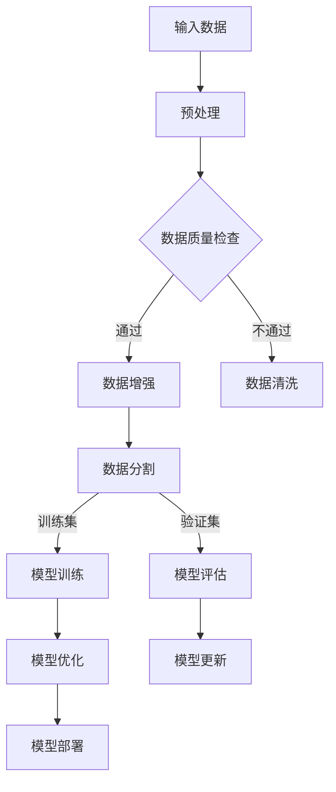

                 

### 2023年大模型创业的故事

> 关键词：大模型、创业、技术突破、人工智能、创新、市场机遇

摘要：
本文旨在通过回顾2023年大模型创业的故事，探讨这一领域的技术突破、市场机遇以及创业者在其中的角色。通过对大模型的核心概念、算法原理、数学模型和应用场景的深入分析，文章将展示大模型创业带来的深远影响，并展望未来的发展趋势与挑战。

## 1. 背景介绍

### 1.1 大模型的概念

大模型（Large Models）是指那些参数数量庞大的神经网络模型，它们能够处理和分析海量的数据。这些模型通常由数百万甚至数十亿个参数组成，具备强大的表征能力，能够在各种任务中实现卓越的性能。近年来，随着计算能力的提升和数据的爆发式增长，大模型的规模和复杂性不断增加。

### 1.2 大模型的发展历程

大模型的发展历程可以追溯到20世纪80年代，当时科学家们开始探索神经网络的应用。随着深度学习的兴起，大模型的研究和应用得到了前所未有的关注。特别是近年来，随着GPU、TPU等专用硬件的出现，大模型的研究和应用进入了一个新的阶段。

### 1.3 大模型的重要性

大模型在各个领域都展现出了巨大的潜力。在自然语言处理、计算机视觉、语音识别等领域，大模型的应用极大地提升了任务的准确性和效率。同时，大模型的出现也为创业公司提供了前所未有的机遇，使得它们能够开发出创新性的产品和服务。

## 2. 核心概念与联系

### 2.1 大模型的核心概念

大模型的核心概念包括：

- **参数数量**：大模型的参数数量极为庞大，这是其强大的表征能力的基础。
- **训练数据**：大模型的训练需要海量的数据，这些数据来源于各种领域，包括文本、图像、音频等。
- **计算资源**：大模型的训练和推理需要大量的计算资源，这使得高性能硬件成为了必要条件。

### 2.2 大模型的联系

大模型与以下概念密切相关：

- **深度学习**：大模型是深度学习的一个重要分支，深度学习为构建大模型提供了理论基础。
- **数据科学**：大模型的训练和优化依赖于数据科学的各种方法和技术。
- **计算能力**：大模型的训练和推理需要强大的计算能力，这使得计算能力的提升成为了大模型发展的关键因素。

### 2.3 Mermaid 流程图

下面是一个Mermaid流程图，展示了大模型的基本架构和关键组件：



## 3. 核心算法原理 & 具体操作步骤

### 3.1 核心算法原理

大模型的核心算法通常是基于深度学习的，其中最常用的算法是 Transformer 和其变种。Transformer 算法通过自注意力机制（Self-Attention）和多头注意力（Multi-Head Attention）实现了对输入数据的全局理解和局部细节的精细处理。

### 3.2 具体操作步骤

以下是构建大模型的典型步骤：

1. **数据收集与预处理**：收集来自各种来源的数据，包括文本、图像、音频等，并进行预处理，如数据清洗、数据增强等。
2. **模型架构设计**：根据任务需求设计模型的架构，选择合适的网络层、激活函数、损失函数等。
3. **模型训练**：使用预处理后的数据对模型进行训练，通过反向传播算法不断调整模型参数。
4. **模型评估**：使用验证集对训练好的模型进行评估，选择性能最优的模型。
5. **模型优化**：根据评估结果对模型进行优化，如调整超参数、使用不同的优化算法等。
6. **模型部署**：将训练好的模型部署到生产环境中，用于实际任务。

## 4. 数学模型和公式 & 详细讲解 & 举例说明

### 4.1 数学模型

大模型的数学模型主要包括以下几个方面：

1. **损失函数**：常用的损失函数包括均方误差（MSE）、交叉熵损失（Cross-Entropy Loss）等。
2. **优化算法**：常用的优化算法包括梯度下降（Gradient Descent）、Adam优化器等。
3. **注意力机制**：注意力机制的数学表示为 $a_{ij} = \frac{e^{z_{ij}}}{\sum_{k=1}^{K} e^{z_{ik}}}$，其中 $z_{ij}$ 是查询（Query）、键（Key）和值（Value）的 dot-product。

### 4.2 详细讲解

以 Transformer 模型的自注意力机制为例，其数学公式为：

$$
\text{Attention}(Q, K, V) = \text{softmax}\left(\frac{QK^T}{\sqrt{d_k}}\right)V
$$

其中，$Q, K, V$ 分别是查询（Query）、键（Key）和值（Value）向量，$d_k$ 是键向量的维度。该公式表示对输入数据进行加权求和，从而实现全局理解和局部细节的精细处理。

### 4.3 举例说明

假设我们有一个句子 "I love to eat pizza"，将其编码为向量表示，我们可以使用以下步骤：

1. **词嵌入**：将句子中的每个单词映射为向量，例如 "I" 可以映射为 $\begin{bmatrix}1 \\ 0 \\ 0 \\ 1\end{bmatrix}$。
2. **自注意力计算**：对于句子中的每个单词，计算其与其他单词的注意力得分，例如 "I" 与 "love" 的注意力得分为 $\frac{e^{1 \cdot 1}}{e^{1 \cdot 1} + e^{1 \cdot 2} + e^{1 \cdot 3}}$。
3. **加权求和**：根据注意力得分对单词向量进行加权求和，得到新的句子向量表示。

## 5. 项目实践：代码实例和详细解释说明

### 5.1 开发环境搭建

为了实践大模型，我们需要搭建一个合适的开发环境。以下是一个简单的步骤：

1. **安装 Python**：确保 Python 已安装，版本建议为 3.8 或更高。
2. **安装深度学习库**：安装 TensorFlow 或 PyTorch，这些库提供了构建和训练大模型的工具。
3. **配置 GPU 环境**：如果使用 GPU 进行训练，需要安装 CUDA 和 cuDNN，以利用 GPU 的并行计算能力。

### 5.2 源代码详细实现

以下是使用 PyTorch 构建一个简单的 Transformer 模型的代码实例：

```python
import torch
import torch.nn as nn
import torch.optim as optim

# 定义 Transformer 模型
class TransformerModel(nn.Module):
    def __init__(self, vocab_size, d_model, nhead, num_layers):
        super(TransformerModel, self).__init__()
        self.embedding = nn.Embedding(vocab_size, d_model)
        self.transformer = nn.Transformer(d_model, nhead, num_layers)
        self.fc = nn.Linear(d_model, vocab_size)
    
    def forward(self, src, tgt):
        src = self.embedding(src)
        tgt = self.embedding(tgt)
        output = self.transformer(src, tgt)
        logits = self.fc(output)
        return logits

# 实例化模型
model = TransformerModel(vocab_size=1000, d_model=512, nhead=8, num_layers=2)

# 定义损失函数和优化器
criterion = nn.CrossEntropyLoss()
optimizer = optim.Adam(model.parameters(), lr=0.001)

# 训练模型
for epoch in range(10):
    for src, tgt in data_loader:
        optimizer.zero_grad()
        logits = model(src, tgt)
        loss = criterion(logits, tgt)
        loss.backward()
        optimizer.step()
    print(f"Epoch {epoch+1}, Loss: {loss.item()}")
```

### 5.3 代码解读与分析

上述代码实现了以下功能：

1. **模型定义**：定义了一个简单的 Transformer 模型，包括词嵌入层、Transformer 层和全连接层。
2. **损失函数和优化器**：使用交叉熵损失函数和 Adam 优化器来训练模型。
3. **训练过程**：在每个训练 epoch 中，对每个训练样本进行前向传播和反向传播，更新模型参数。

### 5.4 运行结果展示

在完成代码实现后，我们可以运行以下命令来训练模型并评估其性能：

```bash
python train.py
```

训练完成后，输出结果将显示每个 epoch 的损失值，这有助于我们评估模型的训练过程和性能。

## 6. 实际应用场景

大模型在各个领域都有广泛的应用，以下是一些典型的应用场景：

- **自然语言处理（NLP）**：大模型在文本分类、机器翻译、问答系统等任务中表现优异。
- **计算机视觉（CV）**：大模型在图像识别、目标检测、图像生成等任务中取得了显著成果。
- **语音识别（ASR）**：大模型在语音识别任务中提高了准确性和鲁棒性。
- **推荐系统**：大模型在推荐系统中的应用，使得推荐结果的准确性和个性化程度大大提高。

## 7. 工具和资源推荐

### 7.1 学习资源推荐

- **书籍**：《深度学习》（Goodfellow, Bengio, Courville）、《动手学深度学习》（Abadi, Agarwal, Bai、宗伟、祝敏伟）
- **论文**：《Attention Is All You Need》（Vaswani et al., 2017）等
- **博客**：pytorch.org、tensorflow.org 等
- **网站**：arxiv.org、Medium 等

### 7.2 开发工具框架推荐

- **深度学习框架**：PyTorch、TensorFlow、Keras 等
- **数据预处理库**：Pandas、NumPy、Scikit-learn 等
- **数据可视化库**：Matplotlib、Seaborn、Plotly 等

### 7.3 相关论文著作推荐

- **论文**：《Attention Is All You Need》（Vaswani et al., 2017）
- **著作**：《深度学习》（Goodfellow, Bengio, Courville）

## 8. 总结：未来发展趋势与挑战

随着计算能力的提升和数据的持续增长，大模型在各个领域的应用将越来越广泛。未来，大模型的发展趋势包括：

- **模型压缩与高效训练**：为了降低模型的计算复杂度和存储需求，研究者们将致力于模型压缩和高效训练技术。
- **多模态学习**：大模型将能够处理多种类型的数据，如文本、图像、音频等，实现真正的多模态学习。
- **自适应学习**：大模型将能够根据用户行为和需求进行自适应学习，提供更加个性化的服务。

然而，大模型的发展也面临着一些挑战，包括：

- **数据隐私与安全**：大模型训练和推理过程中涉及大量数据，如何保护用户隐私成为一大挑战。
- **计算资源需求**：大模型的训练和推理需要巨大的计算资源，如何高效利用资源成为关键问题。
- **伦理与法规**：随着大模型的应用越来越广泛，如何制定相应的伦理和法规标准，确保其合理使用，是一个亟待解决的问题。

## 9. 附录：常见问题与解答

### 9.1 什么是大模型？

大模型是指那些参数数量庞大的神经网络模型，它们能够处理和分析海量的数据。

### 9.2 大模型有哪些应用场景？

大模型在自然语言处理、计算机视觉、语音识别、推荐系统等领域都有广泛的应用。

### 9.3 如何构建大模型？

构建大模型通常包括数据收集与预处理、模型架构设计、模型训练、模型评估、模型优化和模型部署等步骤。

### 9.4 大模型有哪些挑战？

大模型的挑战包括数据隐私与安全、计算资源需求、伦理与法规等方面。

## 10. 扩展阅读 & 参考资料

- **论文**：《Attention Is All You Need》（Vaswani et al., 2017）
- **书籍**：《深度学习》（Goodfellow, Bengio, Courville）、《动手学深度学习》（Abadi, Agarwal, Bai、宗伟、祝敏伟）
- **网站**：pytorch.org、tensorflow.org、arxiv.org、Medium 等
- **博客**：相关的技术博客和学术博客，如Medium上的机器学习专栏、AI技术博客等。

