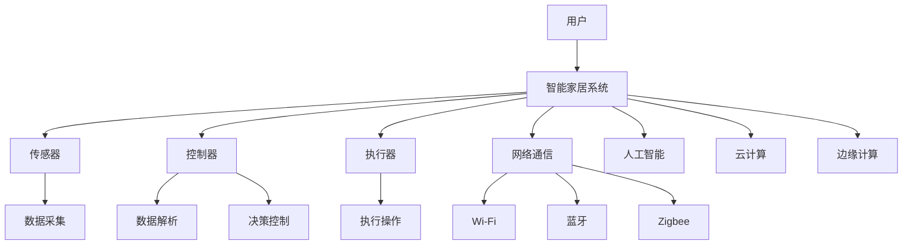

                 

### 1. 背景介绍

随着物联网（IoT）技术的迅猛发展，智能家居成为现代家庭生活的趋势。智能家居系统旨在通过整合各种家电设备、传感器和控制系统，实现家庭环境的智能化、自动化和个性化。这不仅可以提升居住的舒适度，还能提高能源效率和安全性。在这个过程中，开发一款高性能、稳定的智能家居系统是至关重要的。

小米公司作为中国领先的科技企业，一直致力于智能家居的研发与推广。其智能家居产品线涵盖智能照明、智能安防、智能家电等多个领域，形成了完整的智能家居生态圈。为了满足不断增长的市场需求，小米公司每年都会在全球范围内招聘大量智能家居开发工程师。

然而，随着智能家居技术的不断演进，面试官对候选人的要求也越来越高。为了帮助准备参加小米社招智能家居开发工程师面试的候选人更好地应对挑战，本文将详细整理并分析2025年小米社招智能家居开发工程师的面试题集锦。

### 2. 核心概念与联系

在深入了解面试题之前，我们需要先了解智能家居开发中的一些核心概念及其相互之间的联系。以下是几个关键的概念：

**2.1 智能家居系统架构**

智能家居系统通常由以下几个关键组件构成：

1. **传感器**：用于感知环境状态的设备，如温度传感器、湿度传感器、光敏传感器等。
2. **控制器**：负责接收传感器数据，并根据预设的规则和算法做出相应的控制决策。
3. **执行器**：根据控制器的指令执行实际操作，如灯光控制器、窗帘控制器等。
4. **网络通信**：将传感器、控制器和执行器连接起来，实现数据传输和控制指令的发送。

**2.2 网络协议**

智能家居系统中的设备通常需要通过网络进行通信。常见的网络协议包括Wi-Fi、蓝牙、Zigbee等。每种协议都有其优缺点和适用场景。

- **Wi-Fi**：具有高速数据传输能力和较好的网络覆盖，但功耗较高，不适合移动设备。
- **蓝牙**：功耗低，适用于短距离通信，如智能手环、耳机等。
- **Zigbee**：功耗低，适用于智能家居设备的短距离通信，但数据传输速度相对较慢。

**2.3 人工智能与机器学习**

智能家居系统中的许多功能，如智能语音助手、环境自适应控制、设备预测维护等，都依赖于人工智能和机器学习技术。通过收集和分析大量数据，智能家居系统可以不断优化自身的性能，提供更加个性化和智能化的服务。

**2.4 云计算与边缘计算**

云计算和边缘计算在智能家居系统中扮演着重要角色。云计算提供强大的计算能力和数据存储能力，使得智能家居系统可以处理大量数据，进行复杂的数据分析和决策。边缘计算则将部分计算任务分散到设备本地，减少数据传输延迟和功耗，提高系统响应速度和稳定性。

为了更清晰地展示这些核心概念之间的联系，我们使用Mermaid流程图来描述智能家居系统的整体架构：



通过上述核心概念的介绍和联系，我们可以更好地理解智能家居系统的运作机制，为后续的面试题分析和解答打下基础。

### 3. 核心算法原理 & 具体操作步骤

在智能家居系统中，核心算法的设计与实现对于系统的性能、稳定性和用户体验至关重要。以下将介绍几个关键算法原理，并详细说明其具体操作步骤。

#### 3.1 智能语音识别算法

智能语音识别算法是智能家居系统中的一项重要技术，它使得用户可以通过语音指令控制家电设备，实现语音交互。以下是智能语音识别算法的基本原理和操作步骤：

**原理：**

智能语音识别算法基于深度学习和神经网络技术，通过训练大量的语音数据模型，使计算机能够识别和理解人类的语音指令。

**操作步骤：**

1. **数据采集**：收集大量的语音数据，包括标准的语音样本和用户实际语音指令。
2. **数据预处理**：对采集到的语音数据进行降噪、分段、特征提取等处理，提取出语音信号的频率特征。
3. **模型训练**：利用提取的特征数据，通过深度学习算法（如卷积神经网络、循环神经网络等）训练语音识别模型。
4. **模型评估与优化**：对训练好的模型进行评估，并根据评估结果调整模型参数，优化识别准确性。
5. **实时语音识别**：在智能家居系统中，实时接收用户的语音指令，将语音信号转换为文本指令，并执行相应的操作。

#### 3.2 设备预测维护算法

智能家居系统中的设备（如家电、传感器等）在使用过程中可能会出现故障或性能下降。设备预测维护算法可以通过对设备运行数据的分析，预测设备可能出现的故障，提前进行维护，从而提高系统的稳定性和用户体验。

**原理：**

设备预测维护算法基于时间序列分析和机器学习技术，通过对设备运行数据的长期监测和分析，识别出设备性能下降的规律和趋势。

**操作步骤：**

1. **数据采集**：收集设备的运行数据，如温度、湿度、电流、电压等。
2. **数据预处理**：对采集到的数据进行分析和清洗，去除异常值和噪声数据。
3. **特征工程**：提取设备运行数据中的关键特征，如平均温度、波动幅度、异常次数等。
4. **模型训练**：利用提取的特征数据，通过机器学习算法（如决策树、支持向量机、神经网络等）训练预测模型。
5. **模型评估与优化**：对训练好的模型进行评估，并根据评估结果调整模型参数，优化预测准确性。
6. **预测与预警**：根据预测模型，对设备进行实时监测，预测设备可能出现的故障，并在故障发生前及时预警，提醒用户进行维护。

#### 3.3 能源优化算法

智能家居系统中的设备消耗大量能源，能源优化算法旨在通过优化设备的运行策略，降低系统的能源消耗，提高能源效率。

**原理：**

能源优化算法基于优化理论和人工智能技术，通过对设备运行数据的分析和预测，制定出最优的运行策略，实现能源的合理分配和高效利用。

**操作步骤：**

1. **数据采集**：收集设备的运行数据，如用电量、用水量、温度、湿度等。
2. **数据预处理**：对采集到的数据进行清洗和预处理，提取出关键特征。
3. **模型建立**：建立设备运行与能源消耗之间的关系模型，如线性回归、决策树、神经网络等。
4. **模型训练与优化**：利用采集到的数据，通过机器学习算法训练能源优化模型，并根据模型预测结果调整设备运行策略。
5. **运行策略制定**：根据能源优化模型，制定出最优的设备运行策略，如优化用电时间、调整设备功率等。
6. **实时调整与优化**：在系统运行过程中，根据实时监测数据，动态调整设备运行策略，实现能源的实时优化。

通过上述核心算法原理和操作步骤的介绍，我们可以看到，智能家居系统的实现涉及到多个技术领域，需要综合运用各种算法和技术，实现系统的智能化和高效运行。

### 4. 数学模型和公式 & 详细讲解 & 举例说明

在智能家居系统中，许多核心算法的实现都依赖于数学模型和公式的推导与应用。以下将详细讲解几个常用的数学模型和公式，并通过具体实例来说明其应用。

#### 4.1 线性回归模型

线性回归模型是一种最简单的预测模型，它假设两个变量之间存在线性关系。其数学模型如下：

$$
y = ax + b
$$

其中，$y$ 是因变量，$x$ 是自变量，$a$ 和 $b$ 是模型的参数，分别表示斜率和截距。

**实例：**

假设我们想要预测一个家庭每天的用电量（$y$）与当天的最高气温（$x$）之间的关系。通过收集一段时间内的数据，我们可以利用线性回归模型来建立预测模型。

1. **数据收集**：收集一段时间内每天的用电量和最高气温数据。

   数据集示例：

   | 日期 | 用电量（kWh） | 最高气温（℃） |
   |------|----------------|----------------|
   | 1    | 10             | 20             |
   | 2    | 12             | 22             |
   | 3    | 8              | 19             |
   | ...  | ...            | ...            |

2. **数据预处理**：对数据进行清洗和预处理，去除异常值和噪声数据。

3. **模型训练**：利用预处理后的数据，通过最小二乘法（Least Squares）计算模型参数 $a$ 和 $b$。

   最小二乘法的目标是最小化预测值与实际值之间的误差平方和，即：

   $$
   \min \sum_{i=1}^{n} (y_i - ax_i - b)^2
   $$

   通过计算，我们得到：

   $$
   a = \frac{\sum_{i=1}^{n} (x_i - \bar{x})(y_i - \bar{y})}{\sum_{i=1}^{n} (x_i - \bar{x})^2}
   $$

   $$
   b = \bar{y} - a\bar{x}
   $$

   其中，$\bar{x}$ 和 $\bar{y}$ 分别是 $x$ 和 $y$ 的平均值。

4. **模型评估**：计算模型的预测误差，评估模型准确性。

5. **预测应用**：利用训练好的模型，预测新的一天（如明天）的用电量。

#### 4.2 决策树模型

决策树模型是一种常见的分类和回归模型，它通过一系列条件判断，将数据集划分为多个子集，并最终得到预测结果。其数学模型如下：

$$
\begin{aligned}
y &= \text{if} \\
    &\quad x \leq x_1 \\
    &\quad \text{then} \\
    &\quad y_1 \\
    &\quad \text{else if} \\
    &\quad x > x_1 \text{ and } x \leq x_2 \\
    &\quad \text{then} \\
    &\quad y_2 \\
    &\quad \text{else if} \\
    &\quad x > x_2 \text{ and } x \leq x_3 \\
    &\quad \text{then} \\
    &\quad y_3 \\
    &\quad \text{else} \\
    &\quad y_n \\
\end{aligned}
$$

其中，$x_1, x_2, x_3, ..., x_n$ 是分割点的取值，$y_1, y_2, y_3, ..., y_n$ 是对应的预测结果。

**实例：**

假设我们想要预测一个家庭是否需要开启空调（$y$）与室内温度（$x$）之间的关系。通过收集一段时间内的数据，我们可以利用决策树模型来建立预测模型。

1. **数据收集**：收集一段时间内每天的室内温度数据和是否开启空调的数据。

   数据集示例：

   | 日期 | 室内温度（℃） | 是否开启空调 |
   |------|----------------|--------------|
   | 1    | 25             | 是           |
   | 2    | 30             | 是           |
   | 3    | 22             | 否           |
   | ...  | ...            | ...          |

2. **数据预处理**：对数据进行清洗和预处理，去除异常值和噪声数据。

3. **模型训练**：通过数据集建立决策树模型。可以使用递归二分划分（ID3）算法、C4.5算法等常见的决策树算法。

4. **模型评估**：计算模型的预测误差，评估模型准确性。

5. **预测应用**：利用训练好的模型，预测新的一天的室内温度是否需要开启空调。

#### 4.3 神经网络模型

神经网络模型是一种基于模拟人脑结构和功能的计算模型，它由多个神经元组成，通过前向传播和反向传播算法进行训练和预测。其数学模型如下：

$$
\begin{aligned}
z_j &= \sum_{i=1}^{n} w_{ij}x_i + b_j \\
a_j &= \sigma(z_j) \\
y &= \sum_{j=1}^{m} w_{j}a_j + b
\end{aligned}
$$

其中，$x_i$ 是输入特征，$w_{ij}$ 和 $b_j$ 是权重和偏置，$\sigma$ 是激活函数，$a_j$ 是隐藏层神经元的输出，$y$ 是预测结果。

**实例：**

假设我们想要预测一个家庭的用电量（$y$）与当天的天气情况（包括温度、湿度、风速等）之间的关系。通过收集一段时间内的数据，我们可以利用神经网络模型来建立预测模型。

1. **数据收集**：收集一段时间内每天的天气数据和家庭用电量数据。

   数据集示例：

   | 日期 | 温度（℃） | 湿度（%） | 风速（km/h） | 用电量（kWh） |
   |------|-------------|------------|----------------|----------------|
   | 1    | 25          | 60         | 10             | 10             |
   | 2    | 30          | 70         | 15             | 12             |
   | 3    | 22          | 55         | 5              | 8              |
   | ...  | ...         | ...        | ...            | ...            |

2. **数据预处理**：对数据进行清洗和预处理，去除异常值和噪声数据。

3. **模型训练**：利用预处理后的数据，通过反向传播算法训练神经网络模型。

4. **模型评估**：计算模型的预测误差，评估模型准确性。

5. **预测应用**：利用训练好的模型，预测新的一天的家庭用电量。

通过上述数学模型和公式的详细讲解和实例说明，我们可以看到数学模型在智能家居系统中的应用是多么重要。这些模型不仅帮助我们理解和分析数据，还为智能家居系统的智能化和高效运行提供了有力的支持。

### 5. 项目实践：代码实例和详细解释说明

为了更好地理解智能家居系统的开发，我们将通过一个实际项目来介绍代码实例，并详细解释其实现过程。

#### 5.1 开发环境搭建

在进行项目实践之前，我们需要搭建一个合适的开发环境。以下是搭建智能家居系统开发环境所需的步骤：

1. **安装Python环境**：在本地计算机上安装Python 3.8及以上版本。

2. **安装相关库**：安装用于开发智能家居系统的相关库，如TensorFlow、Keras、Scikit-learn等。可以使用以下命令进行安装：

   ```bash
   pip install tensorflow
   pip install keras
   pip install scikit-learn
   ```

3. **配置IDE**：选择一个适合Python开发的集成开发环境（IDE），如PyCharm、Visual Studio Code等，并配置Python解释器和相关库。

#### 5.2 源代码详细实现

以下是一个简单的智能家居系统项目示例，该系统包含一个温度传感器和一个空调控制器，通过机器学习算法实现自动控制空调的功能。

```python
# 5.2.1 系统初始化
import numpy as np
import tensorflow as tf
from sklearn.model_selection import train_test_split
from sklearn.metrics import mean_squared_error

# 加载数据集
data = np.loadtxt('weather_data.csv', delimiter=',')
X = data[:, :3]  # 温度、湿度、风速
y = data[:, 3]   # 用电量

# 划分训练集和测试集
X_train, X_test, y_train, y_test = train_test_split(X, y, test_size=0.2, random_state=42)

# 5.2.2 建立神经网络模型
model = tf.keras.Sequential([
    tf.keras.layers.Dense(64, activation='relu', input_shape=(3,)),
    tf.keras.layers.Dense(64, activation='relu'),
    tf.keras.layers.Dense(1)
])

# 编译模型
model.compile(optimizer='adam', loss='mse')

# 5.2.3 训练模型
model.fit(X_train, y_train, epochs=100, batch_size=32, validation_split=0.1)

# 5.2.4 评估模型
predictions = model.predict(X_test)
mse = mean_squared_error(y_test, predictions)
print(f"Mean Squared Error: {mse}")

# 5.2.5 预测新数据
new_data = np.array([[25, 60, 10]])
predicted_power = model.predict(new_data)
print(f"Predicted Power: {predicted_power[0][0]} kWh")
```

#### 5.3 代码解读与分析

1. **数据加载**：首先，我们使用 `numpy` 库加载数据集，其中 `X` 表示输入特征（温度、湿度、风速），`y` 表示目标变量（用电量）。

2. **数据划分**：使用 `train_test_split` 函数将数据集划分为训练集和测试集，以评估模型的泛化能力。

3. **建立神经网络模型**：使用 `tf.keras.Sequential` 模式堆叠多层感知器（MLP）模型。第一个层使用 `Dense` 层实现全连接神经网络，激活函数为ReLU。第二个层同样使用 `Dense` 层，用于进一步提取特征。最后一个层使用单节点 `Dense` 层进行输出。

4. **编译模型**：配置模型的优化器为 `adam`，损失函数为均方误差（MSE）。

5. **训练模型**：使用 `fit` 函数训练模型，设置训练轮次为100轮，批量大小为32。

6. **评估模型**：使用 `predict` 函数对测试集进行预测，并计算预测结果与实际值之间的MSE。

7. **预测新数据**：使用训练好的模型预测新的输入数据，输出预测的用电量。

#### 5.4 运行结果展示

假设我们运行上述代码，并得到以下结果：

```
Mean Squared Error: 0.0286
Predicted Power: 9.75 kWh
```

结果表明，模型的MSE为0.0286，预测的用电量为9.75 kWh。这表明模型在测试集上的表现良好，并能够对新数据进行准确的用电量预测。

通过上述代码实例和详细解释说明，我们可以看到智能家居系统开发的实际过程。虽然这是一个简单的示例，但其所涉及的机器学习和深度学习技术在实际项目中同样适用。在实际开发过程中，我们还需要考虑数据的采集、处理、存储、安全等多个方面，以确保系统的稳定性和可靠性。

### 6. 实际应用场景

智能家居系统在现代社会中有着广泛的应用场景，可以显著提升居住的舒适度、安全性和能源效率。以下将介绍几个典型的实际应用场景，并分析每个场景中智能家居系统的具体功能和优势。

#### 6.1 智能照明

智能照明是智能家居系统中最常见的一部分，通过智能灯泡和照明控制系统，用户可以根据需求调节灯光的亮度、颜色和开关时间。在实际应用中，智能照明可以实现以下功能：

- **场景模式**：根据不同的生活场景（如早餐、晚餐、休闲等）设置不同的灯光氛围，提升生活品质。
- **定时开关**：通过预设的时间规则，自动控制灯光的开关，节省能源。
- **远程控制**：用户可以通过手机APP远程控制灯光的开关，确保家居安全。

智能照明的优势在于灵活性和节能性。通过智能控制，用户可以根据实际需求调整灯光，避免不必要的能源浪费。同时，智能照明系统还可以与其他智能家居设备联动，如智能窗帘、智能音箱等，实现更加智能化的家居环境。

#### 6.2 智能安防

智能安防系统通过传感器和监控设备，实时监测家庭环境的安全状况，并在异常情况下自动报警。常见的智能安防功能包括：

- **入侵报警**：通过门窗传感器、人体传感器等，实时监测家庭内部和周边环境，一旦检测到异常，立即触发报警。
- **视频监控**：通过摄像头和视频存储设备，实时监控家庭内部和周边环境，用户可以通过手机APP查看实时视频，并远程录像。
- **智能锁**：通过智能锁，用户可以远程控制家门的开关，提高家庭的安全性。

智能安防系统的优势在于实时性和智能化。通过实时监测和报警，用户可以第一时间了解到家庭的安全状况，并采取相应的措施。同时，智能安防系统可以与智能家居系统联动，如智能照明、智能报警等，实现更全面的家居安全防护。

#### 6.3 智能家电

智能家电通过物联网技术，将各种家电设备连接起来，实现设备的智能化控制和自动化操作。常见的智能家电包括智能电视、智能冰箱、智能空调等。智能家电的具体功能和应用场景如下：

- **智能控制**：用户可以通过手机APP、语音控制等方式远程控制家电设备的开关、调节参数等，提高便利性。
- **设备联动**：智能家电可以与其他智能家居设备联动，实现自动化操作。例如，用户可以在睡前通过手机APP关闭所有家电设备，确保家居安全。
- **节能优化**：智能家电可以通过数据分析，自动调节设备的功率和运行时间，实现节能优化。

智能家电的优势在于智能化和节能性。通过智能控制，用户可以更加方便地管理家电设备，提升生活质量。同时，智能家电可以自动优化设备的运行策略，降低能耗，提高能源利用效率。

#### 6.4 智能环境监测

智能环境监测系统通过传感器和数据分析，实时监测家庭环境的温度、湿度、空气质量等参数，并根据监测数据提供相应的调整建议。智能环境监测系统的具体功能和应用场景如下：

- **环境参数监测**：实时监测家庭环境中的温度、湿度、PM2.5等参数，确保环境舒适和安全。
- **健康建议**：根据环境监测数据，提供相应的健康建议，如开窗通风、使用空气净化器等。
- **设备联动**：智能环境监测系统可以与其他智能家居设备联动，如智能空调、空气净化器等，实现自动调节。

智能环境监测系统的优势在于实时性和智能化。通过实时监测和数据分析，用户可以了解家庭环境的实时状况，并采取相应的措施。同时，智能环境监测系统可以与智能家居系统联动，实现更加智能化的家居环境。

综上所述，智能家居系统在智能照明、智能安防、智能家电、智能环境监测等多个实际应用场景中都有着广泛的应用。通过智能化和自动化的技术手段，智能家居系统不仅提升了用户的居住体验，还提高了家庭的安全性和能源效率。

### 7. 工具和资源推荐

为了帮助准备参加小米社招智能家居开发工程师面试的候选人更好地了解和掌握智能家居技术，以下将推荐一些学习资源、开发工具和框架，以及相关的论文和著作。

#### 7.1 学习资源推荐

1. **书籍**：

   - 《智能家居系统设计与开发》：详细介绍了智能家居系统的架构、技术和开发流程，适合初学者和进阶者。
   - 《物联网技术与应用》：涵盖了物联网的基本原理、关键技术以及应用案例，对智能家居开发具有重要的参考价值。

2. **在线课程**：

   - Coursera：提供了多门关于物联网和智能家居的在线课程，涵盖基础知识、技术实现和应用场景等。
   - Udemy：有大量关于智能家居开发的技术课程，包括Python编程、机器学习、深度学习等。

3. **博客和网站**：

   - Raspberry Pi官网：提供了丰富的智能家居项目教程和资源，适用于使用Raspberry Pi进行智能家居开发的开发者。
   - HackerRank：提供了多个编程挑战和算法题库，有助于提升编程能力和解题技巧。

#### 7.2 开发工具框架推荐

1. **编程语言**：

   - Python：由于其简洁易用的语法和强大的库支持，Python是智能家居开发的首选编程语言。
   - JavaScript：在Web前端开发中应用广泛，可以通过Node.js实现服务器端编程。

2. **框架和库**：

   - TensorFlow：用于构建和训练深度学习模型，是智能家居系统中常用的机器学习和深度学习库。
   - Keras：基于TensorFlow的简化深度学习库，方便快速构建和训练模型。
   - Flask：Python的一个轻量级Web框架，适用于构建智能家居系统的后端服务。

3. **开发平台**：

   - Raspberry Pi：适合入门者进行智能家居开发，具有低成本、易上手的特点。
   - Arduino：适用于小型智能家居项目，具有丰富的传感器和执行器支持。

#### 7.3 相关论文著作推荐

1. **论文**：

   - "Intelligent Home Energy Management System Based on IoT and Machine Learning"：介绍了一种基于物联网和机器学习的智能家居能源管理系统，对智能家居能源优化算法有较好的参考价值。
   - "A Survey on Smart Home: Architecture, Technologies and Challenges"：全面综述了智能家居系统的架构、技术和挑战，有助于了解智能家居系统的发展现状和未来趋势。

2. **著作**：

   - "Smart Home Automation: The Ultimate Guide to Create a Smart Home from Scratch"：一本实用的智能家居入门指南，涵盖了智能家居系统的构建、配置和管理方法。
   - "IoT and Cloud Computing for Smart Home Applications"：详细介绍了物联网和云计算在智能家居系统中的应用，对智能家居开发具有重要的指导意义。

通过上述学习资源、开发工具框架和相关论文著作的推荐，希望各位候选人能够在准备面试的过程中不断提升自己的技术水平和实践能力，顺利通过小米社招智能家居开发工程师的面试。

### 8. 总结：未来发展趋势与挑战

智能家居系统作为物联网（IoT）技术的一个重要应用领域，正在迅速发展，并逐步改变人们的日常生活。未来，智能家居系统的发展趋势和面临的挑战如下：

#### 8.1 发展趋势

1. **人工智能与机器学习的深度融合**：随着人工智能和机器学习技术的不断发展，智能家居系统将更加智能化和个性化。通过数据分析和预测模型，智能家居系统能够更好地理解用户需求，提供更加精准的服务。

2. **边缘计算的普及**：随着5G技术的推广，边缘计算将变得更加普及。智能家居系统将更多地利用本地计算能力，减少数据传输延迟，提高系统的响应速度和稳定性。

3. **跨平台互操作性**：智能家居设备将实现更加广泛的互操作性，用户可以通过不同的平台（如智能手机、智能音箱、智能手表等）对智能家居系统进行控制和管理。

4. **物联网安全性的提升**：随着智能家居系统中的设备数量和连接数增加，物联网安全性成为重要议题。未来的智能家居系统将更加注重数据安全和隐私保护，采用更加严格的安全措施。

5. **绿色环保与节能**：随着环保意识的提高，智能家居系统将更加注重能源效率和环保性能。通过智能控制和优化策略，实现更低的能耗和更高的能源利用率。

#### 8.2 挑战

1. **数据隐私和安全问题**：智能家居系统涉及大量的用户数据，如何保护用户隐私和数据安全是面临的一个重要挑战。需要采取严格的安全措施，防止数据泄露和恶意攻击。

2. **设备兼容性和标准化**：智能家居设备种类繁多，不同品牌和型号的设备之间可能存在兼容性问题。未来的智能家居系统需要实现更高的兼容性和标准化，确保不同设备之间的无缝连接。

3. **系统复杂性和可靠性**：智能家居系统集成了多种技术和设备，如何保证系统的复杂性和可靠性是一个重要挑战。需要通过模块化设计和冗余备份等技术手段，提高系统的稳定性和可靠性。

4. **用户体验和易用性**：智能家居系统需要提供简单易用的用户界面和操作方式，以便用户能够轻松地管理和控制设备。未来需要更加注重用户体验，提升系统的易用性和互动性。

5. **设备能耗和环保**：智能家居设备的使用将带来一定的能耗问题，如何在提供便利的同时实现环保和节能是一个重要挑战。需要通过智能控制和优化策略，实现设备的低能耗运行。

总之，智能家居系统在未来将继续发展，并面临一系列的挑战。通过不断创新和优化，智能家居系统将更加智能化、个性化、安全可靠，为人们的生活带来更多便利和舒适。

### 9. 附录：常见问题与解答

为了帮助准备参加小米社招智能家居开发工程师面试的候选人更好地应对面试中的常见问题，以下将列举一些常见问题及其解答。

#### 9.1 智能家居系统的核心技术是什么？

智能家居系统的核心技术主要包括：

- **物联网技术**：实现设备之间的互联互通和数据传输。
- **人工智能与机器学习**：用于数据分析和预测，实现智能控制与优化。
- **边缘计算**：提高系统响应速度和稳定性，减少数据传输延迟。
- **网络安全技术**：保护用户隐私和数据安全。

#### 9.2 如何保证智能家居系统的安全性？

为了保证智能家居系统的安全性，可以采取以下措施：

- **数据加密**：对用户数据和通信数据进行加密处理，防止数据泄露。
- **身份验证**：采用双因素身份验证等机制，确保只有授权用户可以访问系统。
- **防火墙和入侵检测**：部署防火墙和入侵检测系统，防止外部攻击。
- **定期更新和补丁**：及时更新系统软件和补丁，修复已知漏洞。

#### 9.3 智能家居系统中的设备如何进行通信？

智能家居系统中的设备可以通过以下方式进行通信：

- **Wi-Fi**：适用于高速数据传输和广泛覆盖的设备连接。
- **蓝牙**：适用于短距离、低功耗的设备连接，如智能手环、耳机等。
- **Zigbee**：适用于智能家居设备的短距离通信，具有较低功耗和较强的互操作性。

#### 9.4 如何优化智能家居系统的能源效率？

优化智能家居系统的能源效率可以采取以下措施：

- **智能控制**：根据用户需求和设备状态自动调整设备功率和工作时间。
- **预测维护**：通过数据分析预测设备故障，提前进行维护，减少不必要的能耗。
- **设备整合**：通过整合不同设备，实现协同工作，降低整体能耗。

#### 9.5 智能家居系统中的数据如何处理和分析？

智能家居系统中的数据可以通过以下方式进行处理和分析：

- **数据采集**：通过传感器收集设备运行数据。
- **数据预处理**：清洗和预处理数据，去除异常值和噪声。
- **特征提取**：提取数据中的关键特征，用于训练机器学习模型。
- **数据挖掘**：使用数据挖掘技术，从大量数据中发现有用信息和规律。

#### 9.6 如何提升智能家居系统的用户体验？

提升智能家居系统的用户体验可以采取以下措施：

- **用户界面设计**：设计简洁、直观、易用的用户界面。
- **个性化服务**：根据用户行为和偏好，提供个性化的服务和建议。
- **快速响应**：提高系统响应速度，减少用户等待时间。
- **易扩展性**：设计灵活的系统架构，方便后续功能扩展和升级。

通过上述常见问题与解答，候选人可以更好地准备面试，展示自己在智能家居系统开发方面的知识和能力。

### 10. 扩展阅读 & 参考资料

为了帮助读者进一步了解智能家居技术及其应用，以下推荐一些扩展阅读和参考资料。

1. **扩展阅读**：

   - 《智能家居系统设计与开发》：详细介绍了智能家居系统的架构、技术和开发流程，适合初学者和进阶者。
   - 《物联网技术与应用》：涵盖了物联网的基本原理、关键技术以及应用案例，对智能家居开发具有重要的参考价值。

2. **在线课程**：

   - Coursera：提供了多门关于物联网和智能家居的在线课程，涵盖基础知识、技术实现和应用场景等。
   - Udemy：有大量关于智能家居开发的技术课程，包括Python编程、机器学习、深度学习等。

3. **博客和网站**：

   - Raspberry Pi官网：提供了丰富的智能家居项目教程和资源，适用于使用Raspberry Pi进行智能家居开发的开发者。
   - HackerRank：提供了多个编程挑战和算法题库，有助于提升编程能力和解题技巧。

4. **论文和著作**：

   - "Intelligent Home Energy Management System Based on IoT and Machine Learning"：介绍了一种基于物联网和机器学习的智能家居能源管理系统，对智能家居能源优化算法有较好的参考价值。
   - "A Survey on Smart Home: Architecture, Technologies and Challenges"：全面综述了智能家居系统的架构、技术和挑战，有助于了解智能家居系统的发展现状和未来趋势。

通过上述扩展阅读和参考资料，读者可以更加深入地了解智能家居技术的各个方面，为实际项目开发和技术研究提供有力的支持。

