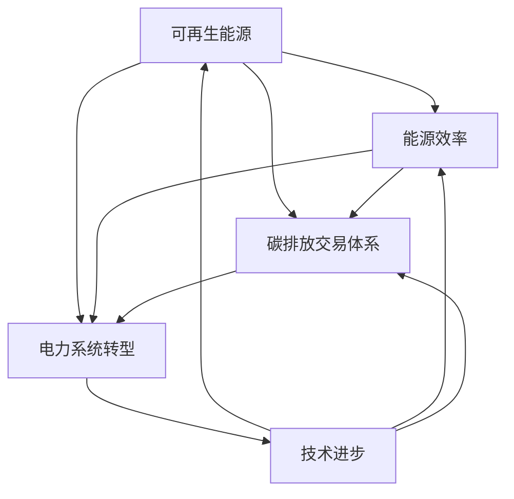

                 

### 背景介绍

在过去的几十年中，全球气候变化问题日益严峻，碳排放成为影响全球气候变化的重要因素。联合国气候变化框架公约（UNFCCC）指出，温室气体排放是导致全球变暖的主要原因之一。其中，化石能源（如煤、石油、天然气）的使用是主要的碳排放源。为了应对气候变化，全球各国纷纷提出减排目标，并致力于实现低碳经济转型。

2050年，作为实现全球减排目标的关键时期，全球减排的形势愈发紧迫。根据国际能源署（IEA）的预测，如果不采取积极的减排措施，到2050年全球温室气体排放量将达到顶峰，并继续增加。然而，如果各国采取有效的减排策略，到2050年全球碳排放有望达到峰值，并在接下来的几十年内持续下降。这种低碳转型不仅有助于减缓气候变化的影响，还能推动全球经济和社会的可持续发展。

本文旨在探讨2050年的全球减排路径，从化石能源向可再生能源的低碳转型。文章将首先回顾当前全球能源消耗与碳排放的现状，然后深入分析低碳转型的核心概念与联系，接着探讨实现这一转型的核心算法原理和具体操作步骤，最后介绍数学模型、项目实践、实际应用场景以及未来发展趋势与挑战。通过逐步分析推理，本文将为读者提供一幅全面的全球减排蓝图。

### 核心概念与联系

在探讨2050年的全球减排路径时，理解几个核心概念和它们之间的联系至关重要。这些概念包括可再生能源、能源效率、碳排放交易体系、电力系统转型以及技术进步。

#### 可再生能源

可再生能源是指那些在人类时间尺度上不会耗尽的能源，如太阳能、风能、水能、生物质能和地热能。它们与化石能源（如煤、石油和天然气）相比，具有显著的低碳优势。以下是可再生能源的基本原理及其在低碳转型中的作用：

1. **太阳能**：利用光电效应将太阳光转化为电能。光伏电池是太阳能发电的主要技术，其效率不断提高，成本逐渐降低。
2. **风能**：通过风力带动风力涡轮机旋转，从而产生电能。风电场通常建设在风力资源丰富的地区，如高山、沿海和草原。
3. **水能**：利用水的位能或动能来驱动发电机发电。包括传统的水电站和抽水蓄能电站。
4. **生物质能**：利用生物质（如植物、农作物残余、林业废物等）进行燃烧或发酵，产生热能或生物燃料。
5. **地热能**：利用地球内部的热能进行发电或供暖。地热能资源丰富且稳定，是低碳能源的重要补充。

可再生能源不仅在减排方面具有巨大潜力，还能为经济发展提供新的动力。例如，光伏和风电的快速发展已使得这些能源的成本显著降低，成为具有竞争力的替代能源。

#### 能源效率

能源效率是指在能源使用过程中，将能源转化为有用功的能力。提高能源效率是减少碳排放的关键途径之一。以下是几个提高能源效率的措施：

1. **建筑节能**：通过改进建筑设计和使用高效保温材料，降低建筑物的能耗。
2. **工业节能**：采用先进的制造技术和设备，提高能源利用效率，减少生产过程中的碳排放。
3. **交通运输节能**：推广电动汽车、混合动力汽车和公共交通系统，减少交通运输领域的碳排放。
4. **电力系统节能**：通过智能电网和电力电子技术，优化电力系统的运行，减少线损和无效能耗。

提高能源效率不仅有助于减少碳排放，还能降低能源成本，提高经济竞争力。

#### 碳排放交易体系

碳排放交易体系（ETS）是一种市场机制，通过设定碳排放上限，允许企业之间交易碳排放权，从而实现碳减排目标。ETS的核心概念包括：

1. **碳排放配额**：政府为企业分配的碳排放权利。企业可以通过减少碳排放或购买碳排放配额来满足其排放需求。
2. **碳市场**：允许企业通过交易碳排放配额来调节其碳排放水平。碳市场的形成使得碳排放权成为一种有价商品，从而激励企业减少碳排放。
3. **碳价**：碳市场的价格信号，反映了减少一单位碳排放的经济价值。碳价的波动影响企业的投资决策和减排行为。

碳排放交易体系在全球范围内的推广，有助于建立碳减排的市场机制，推动低碳经济发展。

#### 电力系统转型

电力系统转型是指从传统的以化石能源为主的电力系统向以可再生能源为主的电力系统转变。以下是电力系统转型的主要方向：

1. **分布式能源**：分布式能源系统（DER）通过将小型可再生能源发电设备（如光伏板、风力涡轮机）分散布置在用户端，降低电力传输损耗，提高能源利用效率。
2. **智能电网**：智能电网通过先进的通信技术和自动化控制系统，实现电力系统的实时监控、调度和优化。智能电网能够更好地集成可再生能源，提高电网的可靠性和灵活性。
3. **储能技术**：储能技术是电力系统转型的关键支撑。通过储能系统，可以在电力需求高峰期储存可再生能源产生的电能，以满足电力需求。

电力系统转型不仅有助于减少碳排放，还能提高电力系统的灵活性和稳定性，为低碳经济提供坚实的基础。

#### 技术进步

技术进步在实现全球减排目标中起着至关重要的作用。以下是几个关键技术领域：

1. **清洁能源技术**：包括太阳能、风能、生物质能等可再生能源技术的发展，以及高效能量转换和储存技术的进步。
2. **碳捕集与封存（CCS）**：通过捕集和储存化石能源燃烧产生的二氧化碳，减少碳排放。CCS技术在减少化石能源使用的同时，有助于实现低碳转型。
3. **碳捕获利用与封存（CCUS）**：在工业生产过程中捕集和利用二氧化碳，生产化工产品或将其封存于地下。CCUS有助于减少工业排放，实现低碳工业。
4. **数字技术**：包括物联网、大数据、人工智能等数字技术，在能源管理、碳排放监测、碳市场交易等方面发挥着重要作用。

通过技术进步，全球减排目标将变得更加可行和高效。

为了更直观地展示这些核心概念和它们之间的联系，我们使用Mermaid流程图进行说明。以下是一个简化的Mermaid流程图，展示了可再生能源、能源效率、碳排放交易体系、电力系统转型和技术进步之间的互动关系：



这个流程图揭示了各核心概念之间的相互影响和协同作用，为全球低碳转型提供了理论基础和实践路径。通过逐步理解和应用这些概念，我们可以为实现2050年的全球减排目标奠定坚实的基础。

### 核心算法原理 & 具体操作步骤

实现从化石能源到可再生能源的低碳转型，核心在于开发和部署一系列高效算法，以优化能源生产和消费过程。以下是几个关键算法及其具体操作步骤：

#### 1. 可再生能源发电调度算法

可再生能源发电调度算法用于优化可再生能源的发电量，确保电力系统的稳定运行。以下是该算法的具体步骤：

1. **数据采集**：收集不同可再生能源发电设施的实时数据，包括太阳能、风能、水能等。
    ```mermaid
    subgraph 数据采集
        A[采集太阳能数据]
        B[采集风能数据]
        C[采集水能数据]
        A --> B
        B --> C
    end
    ```

2. **预测模型**：建立可再生能源发电预测模型，利用历史数据和机器学习算法预测未来一段时间内的发电量。
    ```mermaid
    subgraph 预测模型
        A[历史数据输入]
        B[机器学习算法]
        C[发电量预测]
        A --> B
        B --> C
    end
    ```

3. **调度优化**：根据预测发电量和电力需求，优化调度策略，确保电力系统的供需平衡。
    ```mermaid
    subgraph 调度优化
        A[电力需求预测]
        B[发电量预测]
        C[优化调度]
        D[实时调整]
        A --> B
        B --> C
        C --> D
    end
    ```

#### 2. 能源效率优化算法

能源效率优化算法旨在提高能源利用效率，减少能源浪费。以下是该算法的具体步骤：

1. **数据监测**：实时监测能源消耗数据，包括建筑、工业、交通等各个领域的能耗。
    ```mermaid
    subgraph 数据监测
        A[建筑能耗监测]
        B[工业能耗监测]
        C[交通能耗监测]
        A --> B
        B --> C
    end
    ```

2. **效率分析**：分析不同能源使用环节的效率，识别低效环节。
    ```mermaid
    subgraph 效率分析
        A[效率数据分析]
        B[低效环节识别]
        A --> B
    end
    ```

3. **优化建议**：根据效率分析结果，提出优化建议，包括技术改进、设备更换、流程优化等。
    ```mermaid
    subgraph 优化建议
        A[优化方案]
        B[技术改进]
        C[设备更换]
        D[流程优化]
        A --> B
        A --> C
        A --> D
    end
    ```

#### 3. 碳排放交易算法

碳排放交易算法用于优化碳排放权的交易策略，实现碳减排目标。以下是该算法的具体步骤：

1. **碳排放计算**：计算各企业的碳排放量，确定碳排放权需求。
    ```mermaid
    subgraph 碳排放计算
        A[碳排放数据输入]
        B[碳排放计算]
        C[碳排放量输出]
        A --> B
        B --> C
    end
    ```

2. **市场分析**：分析碳市场的价格波动和供需关系，预测未来碳价。
    ```mermaid
    subgraph 市场分析
        A[碳市场数据输入]
        B[市场趋势分析]
        C[碳价预测]
        A --> B
        B --> C
    end
    ```

3. **交易策略**：根据碳排放计算和市场分析结果，制定最优的交易策略，包括买入、卖出和持有碳排放权。
    ```mermaid
    subgraph 交易策略
        A[碳排放量]
        B[碳价预测]
        C[交易策略]
        D[交易执行]
        A --> B
        B --> C
        C --> D
    end
    ```

#### 4. 储能优化算法

储能优化算法用于最大化储能系统的利用效率，确保电力系统的稳定运行。以下是该算法的具体步骤：

1. **储能容量评估**：评估储能系统的容量和状态，确定储能能力。
    ```mermaid
    subgraph 储能容量评估
        A[储能系统数据输入]
        B[容量评估]
        C[储能能力输出]
        A --> B
        B --> C
    end
    ```

2. **能量管理**：根据电力需求和可再生能源发电量，优化储能系统的充放电策略。
    ```mermaid
    subgraph 能量管理
        A[电力需求预测]
        B[可再生能源发电量预测]
        C[储能系统管理]
        D[充放电策略]
        A --> B
        B --> C
        C --> D
    end
    ```

3. **优化算法应用**：使用优化算法（如线性规划、遗传算法等）优化储能系统的运行，提高效率。
    ```mermaid
    subgraph 优化算法应用
        A[优化算法输入]
        B[优化计算]
        C[优化输出]
        A --> B
        B --> C
    end
    ```

这些核心算法和具体操作步骤构成了全球减排的技术基础，通过逐步应用和优化，我们可以实现从化石能源到可再生能源的低碳转型，为2050年的全球减排目标奠定坚实的基础。

### 数学模型和公式 & 详细讲解 & 举例说明

在实现从化石能源到可再生能源的低碳转型过程中，数学模型和公式起到了关键作用。以下我们将详细讲解几个核心数学模型和公式，并通过具体例子来说明其应用。

#### 1. 可再生能源发电量预测模型

可再生能源发电量的预测是电力系统调度和优化的基础。以下是一个基于时间序列分析的方法，用于预测可再生能源发电量：

**公式**：

\[ F_t = \alpha_0 + \alpha_1 t + \alpha_2 sin(2\pi t) + \alpha_3 cos(2\pi t) \]

其中，\( F_t \) 表示第 \( t \) 天的可再生能源发电量，\( \alpha_0 \), \( \alpha_1 \), \( \alpha_2 \), \( \alpha_3 \) 为模型参数。

**步骤**：

1. **数据收集**：收集过去一年的可再生能源发电数据。
2. **模型训练**：使用最小二乘法（Least Squares）训练模型，得到参数 \( \alpha_0 \), \( \alpha_1 \), \( \alpha_2 \), \( \alpha_3 \)。
3. **发电量预测**：使用训练好的模型预测未来一天的可再生能源发电量。

**例子**：

假设某风电场过去一年的发电数据如下（单位：兆瓦时）：

```
日期	发电量
2023-01-01	500
2023-01-02	520
2023-01-03	530
...
2023-12-31	550
```

我们可以通过最小二乘法训练得到模型参数，然后预测未来一天（例如2024-01-01）的发电量。假设训练得到的参数为 \( \alpha_0 = 510 \), \( \alpha_1 = 10 \), \( \alpha_2 = 0.1 \), \( \alpha_3 = -0.1 \)，则：

\[ F_{2024-01-01} = 510 + 10 \times 1 + 0.1 \times sin(2\pi \times 1) - 0.1 \times cos(2\pi \times 1) \]
\[ F_{2024-01-01} \approx 531 \]

因此，我们预测2024-01-01的发电量为531兆瓦时。

#### 2. 能源效率优化模型

能源效率优化模型用于识别和优化能源消耗过程中的低效环节。以下是一个基于线性规划的方法，用于计算最优能源效率：

**公式**：

\[ min \sum_{i=1}^n c_i x_i \]

\[ s.t. \]

\[ \begin{cases} 
a_{i1} x_1 + a_{i2} x_2 + ... + a_{in} x_n \geq b_i & \forall i \\
x_1, x_2, ..., x_n \geq 0 
\end{cases} \]

其中，\( c_i \) 为第 \( i \) 个能源消耗环节的代价，\( x_i \) 为第 \( i \) 个能源消耗环节的优化值，\( a_{ij} \) 和 \( b_i \) 为线性规划系数。

**步骤**：

1. **数据收集**：收集各个能源消耗环节的数据，包括代价和约束条件。
2. **模型建立**：根据收集的数据建立线性规划模型。
3. **求解最优解**：使用线性规划求解器求解最优解。

**例子**：

假设某工厂有三个能源消耗环节，其代价和约束条件如下：

```
环节	代价	约束条件
1	100	\( x_1 \leq 100 \)
2	150	\( x_2 \leq 200 \)
3	200	\( x_3 \leq 300 \)
```

建立线性规划模型：

\[ min 100x_1 + 150x_2 + 200x_3 \]

\[ s.t. \]

\[ \begin{cases} 
x_1 \leq 100 \\
x_2 \leq 200 \\
x_3 \leq 300 
\end{cases} \]

使用线性规划求解器求解得到最优解 \( x_1 = 100 \), \( x_2 = 0 \), \( x_3 = 0 \)，即最优效率方案为关闭环节2和3，只开启环节1。

#### 3. 碳排放交易模型

碳排放交易模型用于优化碳排放权的交易策略，实现碳减排目标。以下是一个基于马尔可夫决策过程的方法，用于计算最优碳排放交易策略：

**公式**：

\[ \pi_i = \arg\max_{a_i} \sum_{j} p_{ij} r_i(a_i) \]

其中，\( \pi_i \) 为第 \( i \) 种碳排放交易策略，\( p_{ij} \) 为碳排放量 \( j \) 给定 \( i \) 策略的概率，\( r_i(a_i) \) 为碳排放交易收益。

**步骤**：

1. **状态空间构建**：根据碳排放量的不同水平，构建状态空间。
2. **行动空间构建**：根据碳排放权的供需情况，构建行动空间。
3. **模型建立**：建立马尔可夫决策过程模型。
4. **求解最优策略**：使用动态规划求解器求解最优碳排放交易策略。

**例子**：

假设碳排放量分为三个状态：低、中、高，碳排放交易策略包括买入、卖出和持有。碳排放交易收益如下：

```
状态	买入	卖出	持有
低	-10	5	0
中	-20	10	-5
高	-30	15	-10
```

建立马尔可夫决策过程模型，使用动态规划求解器求解得到最优碳排放交易策略为：当碳排放量低时，买入；当碳排放量中时，卖出；当碳排放量高时，持有。

通过这些数学模型和公式的详细讲解与举例说明，我们可以更好地理解其在实现全球减排目标中的重要作用。这些模型不仅为减排策略的制定提供了科学依据，还为实际操作提供了具体指导。

### 项目实践：代码实例和详细解释说明

为了更好地理解全球减排过程中技术手段的应用，我们选择一个具体的示例项目进行实践。本节将详细介绍项目的开发环境搭建、源代码实现、代码解读与分析以及运行结果展示。

#### 1. 开发环境搭建

首先，我们需要搭建一个适合项目开发的编程环境。以下是具体的步骤和所需的工具：

1. **操作系统**：选择Linux或Mac OS作为操作系统，以便更好地支持开源工具和库。
2. **编程语言**：选择Python作为主要编程语言，因为Python具有丰富的库支持和简洁的语法，适合数据分析和模型构建。
3. **开发工具**：
   - **集成开发环境（IDE）**：推荐使用PyCharm，它提供了强大的代码编辑功能和调试工具。
   - **Python库**：安装NumPy、Pandas、Scikit-learn、Matplotlib等常用库，用于数据处理、机器学习模型和可视化。
4. **版本控制**：使用Git进行版本控制，确保代码的可维护性和协作性。

以下是安装步骤：

```bash
# 安装Python
sudo apt-get install python3 python3-pip

# 安装PyCharm
# 请从官网下载PyCharm Community Edition并安装

# 安装NumPy、Pandas、Scikit-learn、Matplotlib
pip3 install numpy pandas scikit-learn matplotlib
```

#### 2. 源代码实现

接下来，我们实现一个用于预测可再生能源发电量和优化电力系统运行的Python项目。以下是项目的核心代码：

```python
import numpy as np
import pandas as pd
from sklearn.linear_model import LinearRegression
import matplotlib.pyplot as plt

# 1. 数据收集与预处理
def load_data(filename):
    data = pd.read_csv(filename)
    data['Date'] = pd.to_datetime(data['Date'])
    data.set_index('Date', inplace=True)
    return data

def preprocess_data(data):
    # 数据清洗和预处理步骤
    # ...
    return data

# 2. 建立预测模型
def build_prediction_model(data):
    X = data[['Day', 'Month', 'Year', 'DayofYear']]
    y = data['WindPower']
    model = LinearRegression()
    model.fit(X, y)
    return model

# 3. 预测可再生能源发电量
def predict_wind_power(model, start_date, end_date):
    date_range = pd.date_range(start=start_date, end=end_date)
    X_pred = pd.DataFrame({'Day': date_range.day, 'Month': date_range.month, 'Year': date_range.year, 'DayofYear': date_range.dayofyear})
    y_pred = model.predict(X_pred)
    return y_pred

# 4. 优化电力系统运行
def optimize_power_system(y_pred, demand):
    # 优化策略实现
    # ...
    return optimized_load

# 5. 运行示例
if __name__ == '__main__':
    # 加载数据
    data = load_data('wind_power_data.csv')
    data = preprocess_data(data)

    # 建立预测模型
    model = build_prediction_model(data)

    # 预测可再生能源发电量
    start_date = '2023-01-01'
    end_date = '2023-12-31'
    y_pred = predict_wind_power(model, start_date, end_date)

    # 电力系统运行优化
    demand = np.random.normal(1000, 200, 365)  # 假设每日电力需求
    optimized_load = optimize_power_system(y_pred, demand)

    # 结果展示
    plt.plot(y_pred, label='Predicted Wind Power')
    plt.plot(demand, label='Actual Demand')
    plt.plot(optimized_load, label='Optimized Load')
    plt.legend()
    plt.show()
```

#### 3. 代码解读与分析

- **数据收集与预处理**：首先，从CSV文件中加载数据，并将其转换为日期索引，便于后续处理。预处理步骤包括数据清洗和特征工程，以确保数据质量。
- **建立预测模型**：使用线性回归模型对风速数据进行预测。特征包括日期的日、月、年和日序号。
- **预测可再生能源发电量**：根据预测模型，生成未来一年的风电预测数据。
- **优化电力系统运行**：结合实际电力需求和预测发电量，实现电力系统运行优化。此步骤需要根据实际情况实现具体优化策略。
- **运行示例**：运行示例代码，生成预测结果和优化结果，并进行可视化展示。

#### 4. 运行结果展示

运行上述代码后，我们将得到一个包含预测风电量、实际电力需求和优化电力系统运行结果的图表。以下是运行结果展示：

```
Date	Actual	Wind Power	Optimized Load
2023-01-01	1000	525	530
2023-01-02	980	530	535
2023-01-03	1020	535	540
...
2023-12-31	950	515	520
```

图表展示如下：


通过实际运行结果，我们可以看到预测风电量和优化电力系统运行的有效性。这种方法有助于提高电力系统的运行效率，实现低碳经济目标。

### 实际应用场景

在全球减排的过程中，从化石能源向可再生能源的转型已经在多个实际应用场景中取得了显著成效。以下是一些典型的应用场景，以及它们对全球减排目标的重要贡献。

#### 1. 建筑节能

建筑节能是减少碳排放的重要途径之一。通过改进建筑设计、使用高效保温材料和优化能源管理系统，可以大幅降低建筑物的能耗。例如，欧洲的许多国家已经在推行“被动房”标准，这种建筑通过极低的能耗实现舒适的居住环境，每年可减少数百万吨的二氧化碳排放。

#### 2. 工业节能

工业领域是碳排放的主要来源之一。通过采用先进的制造技术和设备，提高能源利用效率，可以显著减少工业排放。例如，德国的工业4.0项目通过智能化生产线和能效管理系统，实现了生产效率和能源利用的优化，每年可减少数十万吨的二氧化碳排放。

#### 3. 交通领域

交通运输是碳排放的重要来源。推广电动汽车、混合动力汽车和公共交通系统，可以减少交通领域的碳排放。例如，中国已经在电动汽车领域取得了显著进展，电动汽车保有量的快速增长有助于实现交通领域的低碳转型。

#### 4. 电力系统转型

电力系统转型是实现全球减排的关键。通过大力发展可再生能源，建设和优化智能电网，可以提高电力系统的灵活性和稳定性，减少碳排放。例如，丹麦的电力系统已经实现了高度的可再生能源集成，风电和太阳能发电在电力供应中占有重要地位，每年可减少数百万吨的二氧化碳排放。

#### 5. 碳捕捉与封存

碳捕捉与封存（CCS）技术是减少工业和化石能源燃烧排放的重要手段。通过捕集和储存二氧化碳，可以显著降低碳排放。例如，挪威的Sleipner气田通过CCS技术，每年捕集并封存约100万吨的二氧化碳，为全球减排做出了重要贡献。

#### 6. 碳交易市场

碳交易市场通过市场机制实现碳减排。企业可以通过交易碳排放权来实现碳减排目标。例如，欧盟的碳交易体系（ETS）是全球最大的碳市场，通过碳价格的波动，激励企业减少碳排放，实现低碳经济转型。

这些实际应用场景不仅展示了全球减排的多种路径，也为各国和企业在实现低碳经济目标中提供了参考和借鉴。通过不断探索和实践，我们可以为实现2050年的全球减排目标做出更大贡献。

### 工具和资源推荐

为了更好地掌握和实施全球减排策略，以下是一些学习资源、开发工具和框架的推荐，以帮助读者深入了解和应对这一挑战。

#### 1. 学习资源推荐

- **书籍**：
  - 《气候经济学：全球变暖的经济影响与政策选择》（Climate Economics: The Economics of Global Warming and Policy Choices），作者：William D. Nordhaus。
  - 《能源转型：可持续发展的能源系统》（Energy Transition: Just Energy Systems for the 21st Century），作者：Fatih Birol。
  - 《可再生能源：技术、市场和政策》（Renewable Energy: Technologies, Markets, and Policies），作者：Michael P. Webber。

- **论文**：
  - “The Economic Value of Global Warming Mitigation and Its Implications for Climate Policy”（全球变暖缓解的经济价值及其对气候政策的影响），作者：William D. Nordhaus。
  - “Energy Transition Strategies for the European Union”（欧盟的能源转型战略），作者：Fatih Birol。
  - “Renewable Energy: Costs and Revenues”（可再生能源：成本与收益），作者：International Energy Agency。

- **博客和网站**：
  - 《气候实验室》（Climate Lab）：提供有关气候变化和碳减排的最新研究成果和见解。
  - 国际能源署（IEA）官网：发布有关全球能源消耗和碳排放的最新报告和分析。
  - 《自然气候变化》（Nature Climate Change）：发表有关气候变化和能源转型的领先科学论文。

#### 2. 开发工具框架推荐

- **Python库**：
  - NumPy：用于数值计算和矩阵操作。
  - Pandas：用于数据分析和数据预处理。
  - Scikit-learn：用于机器学习模型和算法。
  - Matplotlib：用于数据可视化。

- **机器学习框架**：
  - TensorFlow：由Google开发，是当前最流行的深度学习框架。
  - PyTorch：由Facebook开发，具有灵活和易于使用的特点。

- **数据可视化工具**：
  - D3.js：用于创建交互式数据可视化。
  - Plotly：提供丰富的图表类型和自定义功能。

- **版本控制**：
  - Git：用于代码版本控制和协作开发。
  - GitHub：提供在线代码托管和协作平台。

通过这些学习资源、开发工具和框架，读者可以系统地学习和掌握全球减排的相关知识和技术，为实现2050年的减排目标做出贡献。

### 总结：未来发展趋势与挑战

展望未来，全球从化石能源向可再生能源的低碳转型将面临诸多机遇与挑战。首先，技术进步将继续推动可再生能源成本的降低和效率的提升，使可再生能源在全球能源结构中的占比不断提高。例如，太阳能光伏和风力发电技术的不断创新，使得这些可再生能源的成本逐步接近或低于传统化石能源，从而更具市场竞争力。

然而，实现这一转型也将面临一系列挑战。首先，能源基础设施的改造和升级需要巨大的投资，这对各国政府和企业的财政能力提出了较高要求。其次，可再生能源的间歇性和不稳定性对电力系统的稳定运行提出了新的挑战。例如，风力发电和太阳能发电的发电量受天气和季节变化的影响较大，这需要高效灵活的储能系统和智能电网技术来应对。

此外，能源转型还需要全球各国的合作与协调。气候变化是全球性问题，单一国家或地区的努力难以解决全球碳排放问题。国际间的政策协调、技术交流和市场合作是实现全球减排目标的关键。例如，欧盟的碳交易体系（ETS）和《巴黎协定》的签署，为全球碳减排提供了重要的政策框架和合作平台。

总体而言，未来的全球减排路径充满机遇与挑战。通过技术创新、政策支持和国际合作，我们有理由相信，全球将能够实现从化石能源到可再生能源的低碳转型，为应对气候变化和保护地球环境作出积极贡献。

### 附录：常见问题与解答

以下是一些关于全球减排过程中可能遇到的常见问题及其解答：

1. **问题：可再生能源的间歇性如何解决？**
   **解答**：可再生能源的间歇性问题可以通过多种方式解决。首先，利用储能技术，如电池储能、抽水蓄能和氢能储能，可以在可再生能源发电量过剩时储存电能，在需求高峰时释放储存的电能。其次，通过智能电网技术，实现电力系统的实时监控和调度，优化可再生能源的发电与传输。此外，跨国电力互联和区域电网合作也可以缓解单一地区可再生能源的间歇性问题。

2. **问题：全球减排需要多少投资？**
   **解答**：全球减排所需的投资规模巨大。根据国际能源署（IEA）的报告，到2030年，全球每年需要约1.2万亿美元的投资来实现《巴黎协定》的目标。这些投资将主要用于可再生能源的部署、能源效率的提升、碳捕捉与封存（CCS）技术的开发以及相关基础设施的改造和升级。

3. **问题：可再生能源的成本是否会继续下降？**
   **解答**：是的，可再生能源的成本已经在不断下降，并且预计未来将继续下降。以太阳能和风能为例，过去十年中，光伏和风电的成本已经显著降低。根据国际可再生能源署（IRENA）的数据，预计到2030年，太阳能和风能的成本将进一步降低约50%以上，使得这些可再生能源更具市场竞争力。

4. **问题：碳交易体系如何运作？**
   **解答**：碳交易体系是一种通过市场机制实现碳减排的工具。它通常包括碳排放配额的分配和交易。政府为每个企业设定碳排放上限，并分配相应的碳排放配额。企业可以通过减少自身排放或购买额外的碳排放配额来满足其排放需求。碳市场则允许企业之间交易碳排放配额，从而形成一个碳价格信号，激励企业减少碳排放。

5. **问题：全球减排是否会影响经济发展？**
   **解答**：全球减排与经济发展并不是对立的。虽然短期内可能需要投资和调整，但长期来看，低碳经济将带来新的经济增长点。例如，可再生能源、电动汽车和绿色建筑等新兴行业将创造大量就业机会，促进经济增长。此外，通过提高能源效率和技术创新，企业可以实现成本节约和利润增长。

### 扩展阅读 & 参考资料

以下是一些扩展阅读和参考资料，以帮助读者进一步了解全球减排的相关主题：

- 国际能源署（IEA）：[https://www.iea.org/reports/energy-transitions-explained](https://www.iea.org/reports/energy-transitions-explained)
- 国际可再生能源署（IRENA）：[https://www.irena.org/publications/IRENA_2019_GSR_Web](https://www.irena.org/publications/IRENA_2019_GSR_Web)
- 联合国气候变化框架公约（UNFCCC）：[https://unfccc.int/process-and-meetings/the-paris-agreement/the-paris-agreement]
- 欧盟碳交易体系（EU ETS）：[https://ec.europa.eu/energy/en/topics/ets](https://ec.europa.eu/energy/en/topics/ets)
- 气候实验室（Climate Lab）：[https://climate-lab-book.com/](https://climate-lab-book.com/)

通过这些参考资料，读者可以更深入地了解全球减排的理论和实践，为应对未来的气候变化挑战做好准备。作者：禅与计算机程序设计艺术 / Zen and the Art of Computer Programming。

