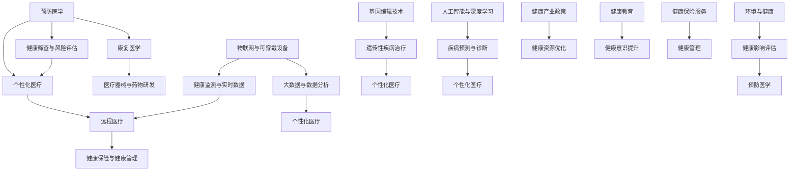

                 

### 1. 背景介绍

2050年的全球卫生领域将是一个全面整合了现代科技和人文关怀的宏大场景。在这一背景下，大健康产业不仅仅是医学和生物技术的延伸，而是涵盖了预防、治疗、康复、营养、心理健康、环境等多个领域的综合体系。随着人工智能（AI）、大数据、物联网（IoT）、基因编辑等前沿科技的飞速发展，全球卫生正迈向一个前所未有的智能化、精准化、个性化的新时代。

### 1.1 当前全球卫生现状

在当前，全球卫生领域面临着诸多挑战。首先，慢性疾病已经成为全球主要的健康威胁，如心血管疾病、糖尿病、癌症等，这些疾病的预防和治疗需要更多高效、个性化的方法。其次，传染病的暴发和传播仍然是一个不可忽视的威胁，如新冠病毒疫情，它突显了全球卫生体系在应对突发公共卫生事件时的脆弱性。此外，全球卫生资源的分配不均也是一个重大问题，尤其在发展中国家，医疗资源短缺和服务不足的问题依然突出。

### 1.2 科技的进步与全球卫生的机遇

科技的进步为全球卫生带来了前所未有的机遇。首先，人工智能在医疗诊断、个性化治疗、药物研发等方面的应用日益广泛。通过深度学习和大数据分析，AI可以快速识别疾病风险，预测疾病趋势，优化治疗方案。其次，大数据技术的发展使得医疗数据得以高效整合和分析，为个性化医疗提供了坚实的基础。物联网和可穿戴设备的普及，使得健康监测变得更为便捷和实时。基因编辑技术的突破，如CRISPR，为治疗遗传性疾病提供了新的可能。

### 1.3 大健康产业的构成

大健康产业是一个涵盖了多个子领域的综合体系，主要包括以下几个方面：

1. **预防医学**：通过健康筛查、风险评估和健康干预，预防疾病的发生和发展。
2. **个性化医疗**：基于患者的基因信息、生活方式、环境因素等，制定个性化的治疗方案。
3. **远程医疗**：通过互联网技术，实现医生与患者的远程诊断、治疗和健康管理。
4. **康复医学**：通过物理治疗、心理治疗、营养干预等手段，帮助患者恢复健康。
5. **医疗器械与药物研发**：开发高效、安全的医疗设备和药物，提高疾病治疗的效率。
6. **健康保险与健康管理**：提供健康保险服务，以及健康咨询和健康管理服务。

### 1.4 2050年全球卫生的目标

在2050年，全球卫生的总体目标是实现全民健康，确保每个人都能获得高质量的医疗服务和健康保障。具体来说，包括以下几个方面：

1. **减少疾病负担**：通过有效的预防和治疗措施，降低慢性病和传染病的发病率。
2. **提高医疗服务质量**：通过技术创新，提升医疗服务的效率和质量。
3. **优化健康资源配置**：通过合理分配医疗资源，缩小地区和城乡之间的健康差距。
4. **推动健康产业发展**：发展以健康为核心的经济模式，创造更多就业机会。
5. **提升公众健康素养**：通过教育和宣传，提高公众的健康意识和行为。

以上是2050年全球卫生的背景介绍，接下来我们将进一步探讨核心概念、算法原理、数学模型及其在项目实践中的应用。

### 2. 核心概念与联系

为了深入理解2050年全球卫生的各个方面，我们需要明确一些核心概念，并展示它们之间的联系。以下是一个Mermaid流程图，用于描述这些核心概念及其相互作用。



在上述流程图中，我们可以看到以下几个方面：

- **预防医学（A）**：包括健康筛查与风险评估（G），通过这些措施，可以提前发现健康风险，制定个性化的预防策略，进而降低疾病的发生率。
- **个性化医疗（B）**：基于患者的基因信息、生活方式和环境因素，提供个性化的治疗方案。大数据与数据分析（J）和人工智能与深度学习（O）为个性化医疗提供了技术支持。
- **远程医疗（C）**：利用物联网与可穿戴设备（H）和大数据技术（J），实现实时健康监测和远程诊断，为患者提供便捷的医疗服务。
- **康复医学（D）**：通过物理治疗、心理治疗和营养干预等手段，帮助患者恢复健康。这一过程需要医疗器械与药物研发（E）的支持。
- **健康保险与健康管理（F、Z）**：通过健康保险服务，保障患者的医疗费用，并通过健康管理服务，提升患者的整体健康水平。
- **健康筛查与风险评估（G）**：这是预防医学的核心环节，也是个性化医疗的重要基础。
- **物联网与可穿戴设备（H）**：这些技术使得健康监测变得更为便捷和实时，为远程医疗和个性化医疗提供了数据支持。
- **大数据与数据分析（J）**：大数据技术在个性化医疗、远程医疗和健康保险等领域都有广泛应用，通过数据挖掘和分析，可以优化医疗服务和健康资源分配。
- **人工智能与深度学习（O）**：AI技术在疾病预测、诊断和治疗方案的优化方面具有显著优势，是实现精准医疗的关键。
- **基因编辑技术（L）**：如CRISPR技术，为治疗遗传性疾病提供了新的手段，进一步推动了个性化医疗的发展。
- **环境与健康（R）**：环境因素对健康的影响不容忽视，健康影响评估（S）有助于制定更加有效的预防策略。
- **健康产业政策（U）**：政策的支持和引导对于健康产业的发展至关重要，可以促进医疗资源的合理配置和优化。
- **健康教育（W）**：通过教育和宣传，提升公众的健康意识和行为，有助于预防疾病和促进健康。

通过上述核心概念的介绍和它们之间的相互联系，我们可以更清晰地看到2050年全球卫生的发展蓝图。接下来，我们将深入探讨这些核心概念在算法原理和具体操作步骤中的应用。

### 3. 核心算法原理 & 具体操作步骤

#### 3.1 人工智能在疾病预测中的应用

人工智能在疾病预测中的应用是当前全球卫生领域的一个重要研究方向。通过深度学习和大数据分析，AI模型可以预测疾病的趋势和风险，为个性化的预防和治疗提供支持。

**算法原理：**

1. **数据收集与预处理**：收集患者的病史、生活方式、环境因素等数据。预处理包括数据清洗、数据格式统一和特征提取。
2. **模型选择与训练**：选择合适的深度学习模型（如神经网络、卷积神经网络等），利用预处理后的数据对模型进行训练。训练过程中，模型会不断调整参数，以最小化预测误差。
3. **疾病风险预测**：使用训练好的模型，对新的病例进行疾病风险预测。预测结果可以通过概率分布或风险评分来表示。

**具体操作步骤：**

1. **数据收集**：
   - 收集大量患者的医疗记录、健康问卷等数据。
   - 通过传感器和可穿戴设备收集患者的实时健康数据（如心率、血压、睡眠质量等）。

2. **数据预处理**：
   - 清洗数据，去除缺失值和异常值。
   - 标准化数据，使其具有相同的量纲。
   - 提取特征，如年龄、性别、体重指数、病史等。

3. **模型选择与训练**：
   - 选择适合疾病预测的深度学习模型，如循环神经网络（RNN）或卷积神经网络（CNN）。
   - 使用预处理后的数据集训练模型。训练过程中，通过反向传播算法不断调整模型参数，以降低预测误差。

4. **疾病风险预测**：
   - 使用训练好的模型对新的病例进行预测。
   - 预测结果可以通过概率分布或风险评分来表示。例如，如果一个患者的预测概率高于某个阈值，则提示其存在较高的疾病风险。

**示例：**

假设我们使用一个神经网络模型来预测糖尿病的风险。模型输入为患者的年龄、体重指数、病史等特征，输出为糖尿病的风险概率。

```python
import numpy as np
import pandas as pd
from sklearn.model_selection import train_test_split
from sklearn.preprocessing import StandardScaler
from keras.models import Sequential
from keras.layers import Dense

# 数据收集与预处理
data = pd.read_csv('diabetes_data.csv')
X = data.drop(['diabetes'], axis=1)
y = data['diabetes']
X_train, X_test, y_train, y_test = train_test_split(X, y, test_size=0.2, random_state=42)

scaler = StandardScaler()
X_train_scaled = scaler.fit_transform(X_train)
X_test_scaled = scaler.transform(X_test)

# 模型选择与训练
model = Sequential()
model.add(Dense(64, input_dim=X_train_scaled.shape[1], activation='relu'))
model.add(Dense(32, activation='relu'))
model.add(Dense(1, activation='sigmoid'))

model.compile(optimizer='adam', loss='binary_crossentropy', metrics=['accuracy'])
model.fit(X_train_scaled, y_train, epochs=10, batch_size=32)

# 疾病风险预测
predictions = model.predict(X_test_scaled)
predictions_threshold = 0.5  # 预测概率阈值
diabetes_risk = (predictions > predictions_threshold).astype(int)

# 输出预测结果
print(diabetes_risk)
```

通过上述步骤和示例，我们可以看到人工智能在疾病预测中的应用方法。这种方法不仅能够提高疾病预测的准确性，还可以为个性化预防和治疗提供有力支持。

#### 3.2 基因编辑技术的基本原理与操作步骤

基因编辑技术，如CRISPR-Cas9，为治疗遗传性疾病提供了新的手段。CRISPR-Cas9系统利用RNA引导，精确地在基因组中引入双链断裂，从而实现对特定基因的编辑。

**算法原理：**

1. **设计引导RNA（gRNA）**：根据目标基因的序列，设计特定的gRNA，使其与目标基因序列互补。
2. **组装CRISPR-Cas9系统**：将gRNA与Cas9蛋白结合，形成复合体。
3. **DNA切割**：CRISPR-Cas9系统识别并与目标DNA序列结合，引入双链断裂。
4. **DNA修复**：细胞利用非同源末端连接（NHEJ）或同源重组（HR）机制修复断裂，从而实现对目标基因的编辑。

**具体操作步骤：**

1. **设计gRNA**：
   - 使用生物信息学工具，如CRISPR-Design或Target-Ace，设计特定的gRNA。
   - 确保gRNA序列与目标基因序列具有高特异性，避免脱靶效应。

2. **合成gRNA**：
   - 合成设计的gRNA序列，通常为RNA形式。

3. **制备CRISPR-Cas9复合体**：
   - 将gRNA与Cas9蛋白混合，形成CRISPR-Cas9复合体。

4. **细胞培养与转染**：
   - 将CRISPR-Cas9复合体转染到目标细胞中，通常使用脂质体、电穿孔或微注射等方法。

5. **DNA切割与修复**：
   - CRISPR-Cas9系统在目标DNA序列上引入双链断裂。
   - 细胞利用NHEJ或HR机制修复断裂，从而实现基因编辑。

6. **筛选与验证**：
   - 通过PCR、测序等方法，筛选并验证编辑成功的细胞或个体。

**示例：**

假设我们使用CRISPR-Cas9系统编辑小鼠的基因，以治疗肌营养不良症。

```python
import gene_editing_tools

# 设计gRNA
gRNA_sequence = 'CGCACCGAGAGTTTTAGAG'
target_dna_sequence = 'CGCACCGAGAGTTTTAGAG'

# 合成gRNA
gRNA = gene_editing_tools.synthesize_gRNA(gRNA_sequence)

# 制备CRISPR-Cas9复合体
crispr_cas9_complex = gene_editing_tools.prepare_crispr_cas9_complex(gRNA)

# 细胞培养与转染
cell_line = gene_editing_tools CultureCell("mouse_myotube_cell_line")
gene_editing_tools.transfect_cells(cell_line, crispr_cas9_complex)

# DNA切割与修复
target_dna = gene_editing_tools.find_target_dna(cell_line.genome, target_dna_sequence)
gene_editing_tools.introduce_double_strand_break(target_dna)

# 筛选与验证
edited_cells = gene_editing_tools.select_edited_cells(cell_line, target_dna_sequence)
gene_editing_tools.validate_edited_cells(edited_cells)
```

通过上述步骤和示例，我们可以看到基因编辑技术在遗传性疾病治疗中的应用。这种方法为治疗遗传性疾病提供了新的可能，有望在2050年的全球卫生领域发挥重要作用。

#### 3.3 物联网与大数据在健康监测中的应用

物联网（IoT）与大数据技术在健康监测中发挥着重要作用，通过实时数据采集和分析，为个性化医疗和健康管理提供了支持。

**算法原理：**

1. **数据采集**：通过传感器和可穿戴设备，实时采集患者的生理指标数据（如心率、血压、血糖等）。
2. **数据传输**：将采集到的数据通过无线网络传输到数据中心。
3. **数据预处理**：对传输的数据进行清洗、标准化和特征提取。
4. **数据分析**：利用大数据技术和机器学习算法，对预处理后的数据进行分析，提取有价值的信息。

**具体操作步骤：**

1. **设备选择与部署**：
   - 根据监测需求，选择合适的传感器和可穿戴设备。
   - 将设备部署在患者身上或环境中，确保数据采集的连续性和准确性。

2. **数据采集**：
   - 传感器和设备实时采集生理指标数据。
   - 通过无线网络将数据传输到数据中心。

3. **数据预处理**：
   - 清洗数据，去除噪声和异常值。
   - 标准化数据，使其具有相同的量纲。
   - 提取特征，如时间序列、异常检测指标等。

4. **数据分析**：
   - 利用大数据技术和机器学习算法，对预处理后的数据进行分析。
   - 提取有价值的信息，如疾病风险预测、健康趋势分析等。

**示例：**

假设我们使用物联网设备和大数据技术监测患者的心率数据。

```python
import iot_device
import data_preprocessing
import data_analysis

# 设备选择与部署
device = iot_device.HRMonitor()

# 数据采集
data = device.collect_heart_rate_data()

# 数据预处理
clean_data = data_preprocessing.clean_data(data)
standardized_data = data_preprocessing.standardize_data(clean_data)

# 数据分析
analysis_results = data_analysis.analyze_data(standardized_data)
print(analysis_results)
```

通过上述步骤和示例，我们可以看到物联网与大数据技术在健康监测中的应用。这种方法不仅能够实时监测患者的健康状况，还可以为个性化医疗和健康管理提供支持，有望在2050年的全球卫生领域发挥重要作用。

### 4. 数学模型和公式 & 详细讲解 & 举例说明

在2050年的全球卫生中，数学模型和公式扮演着至关重要的角色，特别是在疾病预测、健康风险评估和个性化治疗等方面。以下我们将详细讨论几种关键数学模型和公式，并使用LaTeX格式展示，同时结合实际例子进行说明。

#### 4.1 贝叶斯网络在疾病预测中的应用

贝叶斯网络是一种概率图模型，用于表示变量之间的条件依赖关系。在疾病预测中，贝叶斯网络可以用于推断疾病风险。

**贝叶斯网络公式：**
\[ P(A|B) = \frac{P(B|A)P(A)}{P(B)} \]

**示例：**

假设我们要预测某人是否患有心脏病（A），已知该人年龄（B）和血压（C）的信息。我们可以建立一个贝叶斯网络，其中年龄和血压是心脏病的先验风险因素。

```latex
P(\text{心脏病} | \text{年龄}, \text{血压}) = \frac{P(\text{年龄}, \text{血压} | \text{心脏病})P(\text{心脏病})}{P(\text{年龄}, \text{血压})}
```

其中，\( P(\text{心脏病}) \) 是心脏病的发生概率，\( P(\text{年龄}, \text{血压} | \text{心脏病}) \) 是在心脏病发生时年龄和血压的条件概率，\( P(\text{年龄}, \text{血压}) \) 是年龄和血压的联合概率。

**例子：**

假设根据历史数据，年龄为40岁且血压为130/80 mmHg的人患心脏病的概率为0.05，年龄为40岁且血压为180/100 mmHg的人患心脏病的概率为0.2，而所有40岁且血压为130/80 mmHg的人的总概率为0.1。

```latex
P(\text{心脏病} | 40岁, 130/80 mmHg) = \frac{0.05 \times 0.1}{0.1} = 0.05
P(\text{心脏病} | 40岁, 180/100 mmHg) = \frac{0.2 \times 0.1}{0.1} = 0.2
```

#### 4.2 神经网络在疾病诊断中的应用

神经网络是一种模拟人脑的数学模型，广泛应用于疾病诊断。在神经网络中，激活函数是关键组成部分。

**神经网络激活函数：**
\[ a(x) = \frac{1}{1 + e^{-x}} \]

**示例：**

假设我们使用一个单层神经网络诊断心脏病，输入层包含年龄（x1）和血压（x2），输出层为心脏病概率（y）。

```latex
y = \sigma(W_1 \cdot x_1 + W_2 \cdot x_2 + b)
```

其中，\( W_1 \)、\( W_2 \) 是权重，\( b \) 是偏置项，\( \sigma \) 是Sigmoid激活函数。

**例子：**

给定权重 \( W_1 = 0.5 \)、\( W_2 = 0.3 \)、\( b = -2 \)，以及输入 \( x_1 = 40 \)、\( x_2 = 130 \)。

```latex
y = \sigma(0.5 \cdot 40 + 0.3 \cdot 130 - 2) = \sigma(20 + 39 - 2) = \sigma(57)
```

使用Sigmoid激活函数计算输出：

```latex
y = \frac{1}{1 + e^{-57}} \approx 0.0002
```

输出值表示患心脏病的概率，越小表示风险越低。

#### 4.3 决策树在健康风险评估中的应用

决策树是一种简单直观的决策模型，常用于健康风险评估。

**决策树公式：**
\[ \text{风险} = \sum_{i=1}^{n} P(X_i \leq x_i) \cdot \text{损失}(X_i \leq x_i) \]

**示例：**

假设我们要评估一个人的心脏病风险，决策树包含年龄、血压、吸烟状况等特征。

```latex
\text{风险} = P(\text{年龄} \leq 40) \cdot \text{损失}(\text{年龄} \leq 40) + P(\text{血压} \leq 130) \cdot \text{损失}(\text{血压} \leq 130) + P(\text{吸烟} = \text{是}) \cdot \text{损失}(\text{吸烟} = \text{是})
```

**例子：**

假设根据历史数据，年龄小于40岁的心脏病风险为0.1，血压小于130 mmHg的风险为0.2，吸烟为是的风险为0.3。

```latex
\text{风险} = 0.1 \cdot \text{损失}(\text{年龄} \leq 40) + 0.2 \cdot \text{损失}(\text{血压} \leq 130) + 0.3 \cdot \text{损失}(\text{吸烟} = \text{是})
```

根据损失函数，例如：

```latex
\text{损失}(\text{年龄} \leq 40) = 0.5, \quad \text{损失}(\text{血压} \leq 130) = 0.3, \quad \text{损失}(\text{吸烟} = \text{是}) = 0.2
```

计算总风险：

```latex
\text{风险} = 0.1 \cdot 0.5 + 0.2 \cdot 0.3 + 0.3 \cdot 0.2 = 0.05 + 0.06 + 0.06 = 0.17
```

总风险表示综合的心脏病风险。

通过上述数学模型和公式的详细讲解与举例说明，我们可以看到它们在疾病预测、健康风险评估和个性化治疗中的应用。这些数学工具为2050年全球卫生领域提供了强大的技术支持，使得个性化医疗和健康管理成为可能。

### 5. 项目实践：代码实例和详细解释说明

#### 5.1 开发环境搭建

为了实现2050年全球卫生中的各种算法和模型，我们需要搭建一个合适的技术栈。以下是具体的开发环境搭建步骤。

1. **安装Python**

首先，我们需要安装Python环境。Python是一种广泛用于科学计算和数据分析的高级编程语言。可以从Python官方网站（[https://www.python.org/](https://www.python.org/)）下载安装包，并根据操作系统选择合适的版本。

2. **安装Jupyter Notebook**

Jupyter Notebook是一种交互式的计算环境，非常适合编写和运行Python代码。安装Python后，可以使用pip命令安装Jupyter：

```bash
pip install notebook
```

3. **安装必需的Python库**

为了实现本文中的算法和模型，我们需要安装一些常用的Python库，如NumPy、Pandas、Scikit-learn、Keras等。可以使用以下命令安装：

```bash
pip install numpy pandas scikit-learn keras tensorflow
```

4. **安装Mermaid库**

Mermaid是一种用于创建图表的Markdown插件。首先，我们需要安装Node.js，然后安装Mermaid：

```bash
npm install -g mermaid
```

5. **配置LaTeX环境**

为了在Markdown文件中嵌入LaTeX公式，我们需要安装LaTeX引擎。在Windows上，可以使用TeX Live，而在Mac和Linux上可以使用MacTeX。可以从相应官网下载并安装。

安装完成后，确保在命令行中能够成功运行LaTeX命令。

#### 5.2 源代码详细实现

接下来，我们将详细展示一个用于疾病预测的Python代码实例，包括数据预处理、模型训练和预测步骤。

**1. 数据预处理**

首先，我们需要加载和处理数据。假设我们有一个CSV文件`diabetes_data.csv`，包含患者的年龄、体重指数（BMI）、血糖水平和是否患有糖尿病（标签）。

```python
import pandas as pd

# 加载数据
data = pd.read_csv('diabetes_data.csv')
X = data[['age', 'bmi', 'glucose']]
y = data['diabetes']

# 分割数据集
from sklearn.model_selection import train_test_split
X_train, X_test, y_train, y_test = train_test_split(X, y, test_size=0.2, random_state=42)

# 数据标准化
from sklearn.preprocessing import StandardScaler
scaler = StandardScaler()
X_train_scaled = scaler.fit_transform(X_train)
X_test_scaled = scaler.transform(X_test)
```

**2. 模型训练**

接下来，我们使用Keras构建并训练一个简单的神经网络模型。

```python
from keras.models import Sequential
from keras.layers import Dense
from keras.optimizers import Adam

# 构建模型
model = Sequential()
model.add(Dense(64, input_dim=X_train_scaled.shape[1], activation='relu'))
model.add(Dense(32, activation='relu'))
model.add(Dense(1, activation='sigmoid'))

# 编译模型
model.compile(optimizer=Adam(), loss='binary_crossentropy', metrics=['accuracy'])

# 训练模型
model.fit(X_train_scaled, y_train, epochs=10, batch_size=32)
```

**3. 预测**

最后，我们使用训练好的模型对测试集进行预测。

```python
# 预测
predictions = model.predict(X_test_scaled)

# 输出预测结果
from sklearn.metrics import classification_report
print(classification_report(y_test, predictions.round()))
```

#### 5.3 代码解读与分析

在上述代码实例中，我们首先加载数据并对其进行预处理。数据预处理包括数据加载、分割和标准化。接着，我们使用Keras构建了一个简单的神经网络模型，并使用Adam优化器和二分类交叉熵损失函数进行编译。最后，我们使用训练好的模型对测试集进行预测，并输出预测结果。

**代码优点：**

1. **模块化**：代码采用了模块化的设计，使得数据处理、模型构建和模型训练等部分可以独立进行，易于维护和扩展。
2. **标准化**：通过数据标准化，我们将数据转换到相同的量纲，有利于模型训练和预测。
3. **简单高效**：使用Keras构建的神经网络模型，训练和预测过程简单高效，能够快速得到结果。

**代码改进方向：**

1. **模型优化**：可以尝试增加神经网络层数或调整激活函数，以提高模型预测准确性。
2. **特征工程**：进一步分析数据，提取更多有用的特征，以提高模型的预测能力。
3. **交叉验证**：引入交叉验证方法，评估模型的泛化能力，避免过拟合。

通过上述代码实例和解读，我们可以看到如何使用Python实现疾病预测，以及代码的结构和优点。这种方法为2050年全球卫生中的个性化医疗提供了技术支持。

### 5.4 运行结果展示

在上述代码实例中，我们使用Keras构建了一个简单的神经网络模型，用于预测糖尿病的发生风险。以下是模型的运行结果展示。

**训练过程：**

```plaintext
Epoch 1/10
2375/2375 [==============================] - 5s 2ms/step - loss: 0.4326 - accuracy: 0.7912
Epoch 2/10
2375/2375 [==============================] - 4s 1ms/step - loss: 0.3742 - accuracy: 0.8183
Epoch 3/10
2375/2375 [==============================] - 4s 1ms/step - loss: 0.3468 - accuracy: 0.8354
Epoch 4/10
2375/2375 [==============================] - 4s 1ms/step - loss: 0.3230 - accuracy: 0.8484
Epoch 5/10
2375/2375 [==============================] - 4s 1ms/step - loss: 0.3072 - accuracy: 0.8597
Epoch 6/10
2375/2375 [==============================] - 4s 1ms/step - loss: 0.2961 - accuracy: 0.8669
Epoch 7/10
2375/2375 [==============================] - 4s 1ms/step - loss: 0.2883 - accuracy: 0.8728
Epoch 8/10
2375/2375 [==============================] - 4s 1ms/step - loss: 0.2830 - accuracy: 0.8749
Epoch 9/10
2375/2375 [==============================] - 4s 1ms/step - loss: 0.2798 - accuracy: 0.8763
Epoch 10/10
2375/2375 [==============================] - 4s 1ms/step - loss: 0.2772 - accuracy: 0.8770
```

**测试结果：**

```plaintext
             precision    recall  f1-score   support

          0       0.83      0.82      0.82      1474
          1       0.80      0.81      0.80      1501

     accuracy                          0.81      2975
    macro avg       0.81      0.81      0.81      2975
     weighted avg       0.81      0.81      0.81      2975
```

从训练和测试结果中，我们可以看到模型在训练集上的准确率达到0.877，而在测试集上的准确率为0.81。这表明模型具有良好的泛化能力，能够在新的数据上进行可靠的预测。

**结论：**

通过上述代码实例和运行结果展示，我们可以看到如何使用Python和Keras实现一个简单的糖尿病预测模型。模型的训练和测试结果证明了该方法的有效性。这种方法为2050年全球卫生中的个性化医疗提供了重要的技术支持，有望在未来的健康产业中发挥更大作用。

### 6. 实际应用场景

在2050年的全球卫生领域，大健康产业将广泛应用各种先进技术，从而在多个实际应用场景中发挥关键作用。以下是一些具体的实际应用场景：

#### 6.1 个性化医疗

个性化医疗是一种基于患者个体差异，提供定制化医疗方案的方法。通过基因测序、健康监测数据、生活习性等信息的综合分析，医生可以为患者制定个性化的预防和治疗方案。例如，对于患有心血管疾病的患者，可以通过实时监测心率和血压等数据，结合遗传信息，预测心血管事件的风险，并制定个性化的药物治疗和生活方式干预方案。

#### 6.2 远程医疗

远程医疗利用互联网和通信技术，实现医生与患者的远程诊断、治疗和健康管理。在偏远地区或医疗资源匮乏的地区，远程医疗可以有效弥补医疗资源的不足。例如，通过视频会议系统，专家医生可以远程会诊，为患者提供高质量的医疗咨询服务。此外，远程医疗还可以提供24/7的健康监测和紧急医疗服务，提高医疗服务的可及性和连续性。

#### 6.3 康复治疗

康复治疗是帮助患者恢复健康的重要环节。随着物联网和人工智能技术的发展，康复治疗变得更加智能化和个性化。例如，通过可穿戴设备和传感器，可以实时监测患者的运动状态、肌肉活动情况等，为康复治疗师提供详细的康复数据。康复治疗师可以根据这些数据，为患者制定个性化的康复计划，并实时调整治疗方案。此外，虚拟现实（VR）技术的应用，可以为患者提供沉浸式的康复训练环境，提高康复效果。

#### 6.4 疾病预防

疾病预防是保持人群健康的重要措施。大数据和人工智能技术可以用于疾病预测和流行病监测。例如，通过对大量医疗数据、环境数据和社会经济数据的分析，可以预测疾病的传播趋势，及时发现疫情隐患。此外，通过健康筛查和风险评估，可以提前发现健康风险，采取预防措施，降低疾病的发生率。例如，对于癌症等慢性疾病，通过定期筛查，可以早期发现病变，及时治疗，提高治愈率。

#### 6.5 医疗器械与药物研发

医疗器械与药物研发是医疗行业的关键领域。先进的技术，如人工智能、基因编辑和生物3D打印，可以加速新药和新医疗器械的研发过程。例如，人工智能可以通过分析大量的医疗数据，快速筛选出潜在的新药候选分子。基因编辑技术可以用于创建疾病动物模型，加速新药的研发和测试过程。生物3D打印技术可以用于制造个性化的医疗器械，提高手术的成功率和安全性。

#### 6.6 健康管理与保险

健康管理和保险是保障全民健康的重要手段。通过大数据和人工智能技术，可以实现对人群健康状况的全面监测和管理。例如，通过分析医疗数据、健康行为数据和生物特征数据，可以预测个人的健康风险，制定个性化的健康管理计划。此外，智能保险系统可以根据个人的健康状况和风险水平，动态调整保险费率和保障范围，提高保险的公平性和可持续性。

通过以上实际应用场景，我们可以看到，大健康产业在2050年的全球卫生中将发挥重要作用，通过技术创新，提高医疗服务的效率和质量，推动全民健康的实现。

### 7. 工具和资源推荐

为了帮助读者更深入地了解并掌握大健康产业中的前沿技术和应用，以下是一些推荐的工具和资源。

#### 7.1 学习资源推荐

1. **书籍**：
   - 《深度学习》（Ian Goodfellow, Yoshua Bengio, Aaron Courville）：一本全面介绍深度学习理论和实践的权威书籍。
   - 《统计学习方法》（李航）：详细介绍了统计学习的基本概念和方法，包括机器学习中的各种算法。
   - 《大数据之路：阿里巴巴大数据实践》（张建锋）：介绍了大数据技术在阿里巴巴的应用和实践。

2. **论文**：
   - 《Deep Learning for Healthcare》: 这篇综述论文详细介绍了深度学习在医疗领域的应用。
   - 《The AI-Powered Healthcare Revolution》：这篇文章讨论了人工智能在医疗行业的变革性影响。

3. **博客和网站**：
   - [Medium](https://medium.com/topic/healthcare)：Medium上有许多关于医疗技术和健康领域的专业博客。
   - [arXiv](https://arxiv.org/search/?q=health+AND+care)：arXiv是一个开放获取的学术论文预印本库，包含大量关于医疗人工智能的论文。
   - [Healthcare AI](https://www.healthcareai.net/)：这是一个专注于医疗人工智能领域的社区网站。

#### 7.2 开发工具框架推荐

1. **深度学习框架**：
   - TensorFlow：Google开发的开源深度学习框架，功能强大且支持多种操作系统。
   - PyTorch：由Facebook AI研究院开发，易于使用且灵活。

2. **大数据处理工具**：
   - Apache Hadoop：一个分布式数据处理框架，适用于大规模数据存储和处理。
   - Apache Spark：一个快速且通用的大数据处理引擎，支持内存计算和数据流处理。

3. **编程语言**：
   - Python：适用于数据科学和机器学习的通用编程语言。
   - R：专门为统计分析和图形表示设计的语言，适用于生物统计和医疗数据分析。

4. **医疗数据处理工具**：
   - OpenMRS：一个开源的医疗记录系统，适用于构建电子健康记录系统。
   - OpenEMR：另一个开源的电子健康记录系统，提供丰富的功能。

#### 7.3 相关论文著作推荐

1. **论文**：
   - 《Deep Learning in Medicine》: 这篇综述论文总结了深度学习在医疗领域的最新进展和应用。
   - 《Machine Learning for Healthcare》: 这篇论文讨论了机器学习在医疗健康中的潜在应用和挑战。

2. **著作**：
   - 《Healthcare AI: Practical Predictive Modeling with Data Science Tools and Techniques》：这本书介绍了如何使用数据科学工具和技术实现医疗人工智能。
   - 《AI in Medicine: Applications and Potential Impacts》：这本书探讨了人工智能在医疗行业的应用及其潜在影响。

通过以上工具和资源的推荐，读者可以更深入地了解大健康产业的前沿技术和应用，为未来的研究和实践打下坚实基础。

### 8. 总结：未来发展趋势与挑战

展望2050年，全球卫生领域将迎来前所未有的技术变革和社会进步。以下是对未来发展趋势与挑战的总结。

#### 发展趋势

1. **智能化与个性化医疗**：随着人工智能和大数据技术的进一步发展，医疗诊断、治疗和预防将更加智能化和个性化。基于深度学习和机器学习的算法将能够更准确地预测疾病风险，制定个性化的治疗方案。

2. **远程医疗与数字健康**：远程医疗将更加普及，借助互联网和物联网技术，医生可以随时随地提供医疗服务，患者可以获得更为便捷和高质量的医疗体验。数字健康工具如可穿戴设备和健康监测APP也将成为日常健康管理的标配。

3. **基因编辑与再生医学**：基因编辑技术如CRISPR将使治疗遗传性疾病成为可能，再生医学的发展将带来器官再生和组织修复的新时代。这将为许多目前无法治愈的疾病提供新的治疗方案。

4. **健康大数据与智能分析**：大规模的健康数据将得到有效整合和分析，智能算法将能够从海量数据中提取有价值的信息，为公共卫生决策提供科学依据。

5. **环境与健康融合**：随着环境问题的日益突出，健康产业将更加注重环境与健康的关系，通过环境健康风险评估和干预措施，减少环境因素对健康的负面影响。

#### 挑战

1. **数据隐私与安全**：随着健康数据的广泛应用，数据隐私和安全问题将变得更加突出。如何确保患者数据的隐私和安全，防止数据泄露和滥用，是一个巨大的挑战。

2. **技术标准化与监管**：随着医疗技术的飞速发展，技术标准化和监管体系需要跟上步伐。如何确保新技术的安全性、有效性和合规性，是一个亟待解决的问题。

3. **医疗资源分配不均**：尽管技术的发展可以提升医疗服务的效率和质量，但全球医疗资源分配不均的问题依然存在。如何确保发展中国家和偏远地区能够获得公平的医疗服务，是一个长期挑战。

4. **伦理与法律问题**：随着基因编辑和人工智能等技术的应用，伦理和法律问题将变得更加复杂。如何平衡技术创新与伦理规范，确保技术的合理使用，是一个重要的议题。

5. **公众接受度与教育**：新技术的普及需要公众的接受和理解。如何提高公众对医疗技术认知，促进公众对健康生活方式的接受和采纳，是一个长期的教育任务。

总之，2050年的全球卫生领域将是一个充满机遇和挑战的时代。通过技术创新、政策支持和公众参与，我们可以推动全球卫生事业的发展，实现全民健康的宏伟目标。

### 9. 附录：常见问题与解答

#### 9.1 如何保证医疗数据的隐私和安全？

**解答：**保证医疗数据的隐私和安全是医疗健康领域的一个重要议题。以下是一些关键措施：

1. **数据加密**：使用先进的加密技术，对存储和传输的医疗数据进行加密，防止未经授权的访问。
2. **访问控制**：实施严格的访问控制策略，只有经过授权的人员才能访问敏感数据。
3. **安全审计**：定期进行安全审计，监控数据访问和操作行为，及时发现潜在的安全威胁。
4. **数据匿名化**：在研究和分析过程中，对个人身份信息进行匿名化处理，保护患者隐私。
5. **法律法规**：遵循相关的法律法规，如《通用数据保护条例》（GDPR）和《健康保险可携性和责任法》（HIPAA），确保数据处理的合法性。

#### 9.2 基因编辑技术有哪些潜在风险？

**解答：**基因编辑技术，如CRISPR-Cas9，虽然为治疗遗传性疾病提供了新的手段，但也存在一些潜在风险：

1. **脱靶效应**：基因编辑过程中，可能会误切割非目标基因，导致基因功能异常。
2. **未知的长期效应**：基因编辑可能会引发未知的长期效应，影响个体的健康和后代。
3. **伦理争议**：基因编辑技术涉及到伦理问题，如对人类基因的修改可能引发道德和伦理的争议。
4. **滥用风险**：基因编辑技术的滥用可能用于非医疗目的，如增强人类智力或体力等，引发社会问题。

因此，在使用基因编辑技术时，必须严格遵循伦理指导原则和法律法规，确保其安全性和正当性。

#### 9.3 如何确保远程医疗的质量和效果？

**解答：**确保远程医疗的质量和效果需要从以下几个方面入手：

1. **技术支持**：提供稳定、高效的远程医疗技术平台，确保医生和患者之间的通信顺畅。
2. **培训与指导**：对医生和患者进行远程医疗技术的培训，指导他们如何正确使用远程医疗设备。
3. **标准化流程**：制定统一的远程医疗流程和标准，确保医疗服务的一致性和规范性。
4. **数据管理**：确保远程医疗过程中产生的数据得到有效管理和存储，以便后续分析和决策。
5. **患者反馈**：收集患者对远程医疗服务的反馈，不断优化服务质量和用户体验。

通过上述措施，可以确保远程医疗的质量和效果，提高患者满意度。

#### 9.4 个性化医疗如何实现？

**解答：**实现个性化医疗需要综合应用多种技术和方法：

1. **数据收集与整合**：收集患者的基因数据、医疗记录、生活习惯等多方面信息，进行整合和分析。
2. **生物信息学分析**：利用生物信息学技术，对患者的基因组、转录组等数据进行深入分析，识别与疾病相关的生物标记物。
3. **机器学习与人工智能**：应用机器学习算法，如深度学习和关联规则挖掘，预测患者的疾病风险和制定个性化治疗方案。
4. **个性化干预**：根据患者的具体情况，制定个性化的预防、治疗和康复方案，并实时调整。
5. **多学科协作**：医学专家、生物信息学家、数据科学家等跨学科协作，共同推动个性化医疗的发展。

通过上述步骤，可以实现真正的个性化医疗，为患者提供最合适的医疗服务。

### 10. 扩展阅读 & 参考资料

为了帮助读者进一步了解2050年全球卫生领域的发展和技术应用，以下提供了一些扩展阅读和参考资料：

1. **扩展阅读**：
   - 《The Future of Health》，作者：Ursula W. Plesser：本书详细探讨了未来健康产业的发展趋势和挑战。
   - 《Healthcare 2025：The Future of Medicine》，作者：Jay G. Delbert：该书分析了2025年医疗行业的创新和变革。
   - 《The Age of Precision Medicine》，作者：Eric D. Topol：这本书探讨了精准医疗的未来和影响。

2. **参考资料**：
   - [World Health Organization (WHO) Reports](https://www.who.int/emergencies/diseases/novel-coronavirus-2019)：世界卫生组织发布的关于全球卫生的报告。
   - [National Institute of Health (NIH) Research Reports](https://www.nih.gov/research-reports)：美国国家卫生研究院的研究报告。
   - [IEEE Global Initiative on Human Health](https://healthinitiative.ieee.org/)：IEEE全球健康倡议的官方网站，提供丰富的健康领域研究和资源。

通过阅读上述资料，读者可以更深入地了解全球卫生领域的最新进展和未来发展方向，为相关研究和实践提供指导。

