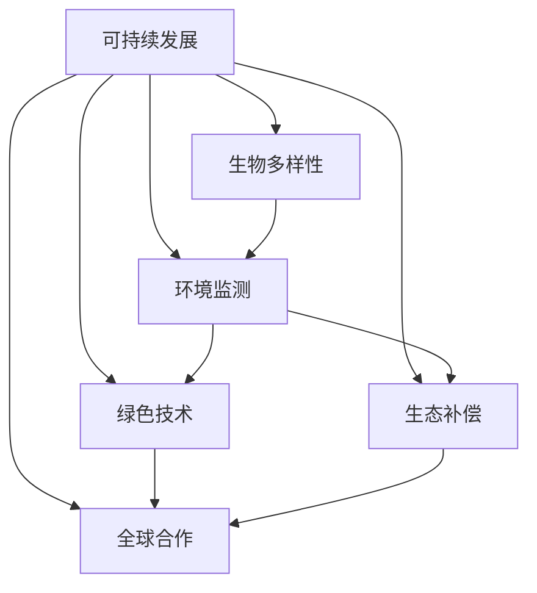

                 

### 背景介绍 Background Introduction

在2050年，随着科技的飞速发展和全球环境的日益恶化，人类意识到自身的生存和发展与地球的生态系统紧密相连。这一深刻的认识促使全球治理模式发生了根本性的转变，从以人类为中心的传统模式转向了以地球生态系统为中心的生态文明转型。这种转型不仅是为了解决环境危机，更是为了实现可持续发展的目标。

这一转变的背景可以追溯到20世纪末和21世纪初的一系列重大事件。首先是气候变化问题的日益严重，全球变暖、海平面上升、极端天气事件的频繁发生，给人类社会带来了前所未有的挑战。其次，生物多样性的丧失和自然资源的过度开采使得地球生态系统陷入了危机。此外，人口增长、城市化进程和消费主义文化的蔓延加剧了资源的紧张和环境的压力。

在这一背景下，国际社会开始意识到，仅仅依靠传统的治理模式已经无法应对这些全球性的问题。于是，一系列新的理念、政策和措施应运而生，旨在实现全球生态系统的平衡和可持续发展。例如，联合国提出了《2030年可持续发展议程》，强调消除贫困、保护地球、实现和平与繁荣。同时，各国政府也纷纷出台了绿色新政和生态保护政策，推动经济的绿色转型。

全球治理模式的转变不仅是对传统发展模式的反思，更是对未来发展的重新定义。在这一过程中，科技扮演着至关重要的角色。通过大数据、人工智能、物联网等先进技术的应用，人类能够更精准地监测和评估环境状况，更有效地制定和执行环境保护政策。同时，这些技术也为可持续发展提供了新的解决方案，例如绿色能源、清洁生产、循环经济等。

总之，2050年的全球治理模式转型是一个复杂的系统工程，涉及到政治、经济、社会、科技等多个领域的协同作用。在这一过程中，人类将不再仅仅是地球的掠夺者，而是生态系统的维护者。这一转变不仅是为了应对当前的危机，更是为了创造一个更加美好、可持续的未来。

### 核心概念与联系 Core Concepts and Connections

在全球治理模式从人类中心到地球中心的转型过程中，核心概念的引入和相互联系起到了至关重要的作用。以下是这一转型过程中几个关键的核心概念，以及它们之间的联系和影响。

#### 1. 可持续发展 Sustainable Development

可持续发展是一个多维度的概念，不仅包括环境保护，还涵盖经济和社会发展。它强调在满足当前需求的同时，不损害后代满足自身需求的能力。可持续发展的理念在地球中心治理模式中起到了基础性作用，因为它要求我们在决策过程中全面考虑环境、经济和社会的长期影响。

#### 2. 生物多样性 Biological Diversity

生物多样性是地球生态系统健康和稳定的关键指标。它包括物种多样性、遗传多样性和生态系统多样性。生物多样性的丧失不仅影响生态系统的功能，还会加剧气候变化的负面效应。因此，保护生物多样性是地球中心治理模式中的重要任务之一。

#### 3. 环境监测 Environmental Monitoring

环境监测是实现地球中心治理的重要手段。通过大数据、物联网和人工智能等技术，我们可以实时监测和评估环境状况，发现潜在的环境问题并提供及时的数据支持。环境监测不仅有助于环境保护政策的制定和执行，还能为科学研究和决策提供可靠的数据基础。

#### 4. 绿色技术 Green Technology

绿色技术是指能够减少对环境有害的排放和污染，同时提高资源利用效率的技术。这些技术包括可再生能源、清洁生产、循环经济等。绿色技术在地球中心治理模式中扮演着关键角色，因为它们是实现可持续发展的技术支撑。

#### 5. 生态补偿 Ecological Compensation

生态补偿是一种通过经济手段调节生态保护和发展的关系的机制。它旨在通过补偿那些为环境保护做出贡献的主体，激励更多人参与到生态保护活动中来。生态补偿在地球中心治理模式中起到了激励和保护生态环境的重要作用。

#### 6. 全球合作 Global Collaboration

全球合作是实现地球中心治理的必要条件。由于环境问题具有全球性，任何单一国家或地区的努力都是有限的。只有通过全球合作，才能共同应对气候变化、生物多样性丧失等全球性挑战。全球合作不仅包括政府间的合作，还涉及国际组织、非政府组织和企业等多方参与。

#### 概念间的联系与影响

这些核心概念并不是孤立的，它们相互联系、相互影响，共同构成了地球中心治理模式的基础。

- **可持续发展**是整个治理模式的指导思想，它要求我们在经济、社会和环境三个方面取得平衡。
- **生物多样性**是地球生态系统的基础，保护生物多样性是实现可持续发展的重要手段。
- **环境监测**提供了数据支持，使我们能够更准确地了解环境状况，制定更有效的保护政策。
- **绿色技术**提供了实现可持续发展的技术路径，这些技术的应用可以减少对环境的负面影响。
- **生态补偿**则通过激励机制，促进更多人参与到生态保护活动中来。
- **全球合作**是实现全球性目标的关键，只有通过合作，才能共同应对全球性挑战。

综上所述，这些核心概念之间的相互联系和影响，构成了地球中心治理模式的理论基础和实践路径。在这一模式下，人类将不再只是地球的消费者，而是生态系统的维护者和促进者。

#### Mermaid 流程图

以下是一个简化的Mermaid流程图，展示了这些核心概念之间的相互关系：



通过这个流程图，我们可以更直观地理解这些核心概念如何相互作用，共同推动地球中心治理模式的实现。

### 核心算法原理 & 具体操作步骤 Core Algorithm Principles & Step-by-Step Procedures

在全球治理模式从人类中心到地球中心的转型过程中，核心算法的设计和实现起到了至关重要的作用。这些算法不仅能够帮助我们更有效地监测和评估环境状况，还能为政策制定和执行提供数据支持。以下是一个典型的核心算法原理及其具体操作步骤：

#### 1. 算法原理

**地球生态系统健康评估算法**（Eco-System Health Assessment Algorithm，简称EHAA）。该算法旨在通过分析环境数据，评估地球生态系统的健康状态，并提供相应的治理建议。

**主要步骤：**

1. **数据收集**：收集各种环境数据，包括空气质量、水质、土壤质量、生物多样性指数等。
2. **数据处理**：对收集到的数据进行预处理，包括数据清洗、归一化和特征提取。
3. **模型训练**：利用预处理后的数据，训练一个机器学习模型，用于评估生态系统的健康状态。
4. **健康评估**：使用训练好的模型，对当前环境数据进行分析，评估地球生态系统的健康状态。
5. **治理建议**：根据健康评估结果，提供相应的治理建议，以促进生态系统的恢复和可持续发展。

#### 2. 具体操作步骤

**步骤1：数据收集**

- **空气质量数据**：通过空气监测站收集实时空气质量数据，包括PM2.5、PM10、SO2、NO2等污染物浓度。
- **水质数据**：通过水质监测站收集河流、湖泊、海洋的水质数据，包括溶解氧、pH值、重金属含量等。
- **土壤质量数据**：通过土壤监测站收集土壤质量数据，包括土壤湿度、土壤酸碱度、有机质含量等。
- **生物多样性数据**：通过生态监测和调查收集生物多样性数据，包括物种数量、物种分布、生态系统类型等。

**步骤2：数据处理**

- **数据清洗**：去除异常值和缺失值，保证数据的完整性和可靠性。
- **数据归一化**：将不同来源、不同单位的数据进行归一化处理，使其在同一量级上进行分析。
- **特征提取**：从原始数据中提取关键特征，用于训练模型。

**步骤3：模型训练**

- **数据划分**：将数据集划分为训练集和测试集，用于模型训练和评估。
- **模型选择**：选择合适的机器学习模型，如支持向量机（SVM）、决策树（Decision Tree）、神经网络（Neural Network）等。
- **模型训练**：使用训练集对模型进行训练，调整模型参数，使其达到最佳性能。

**步骤4：健康评估**

- **输入数据**：将当前的环境数据输入到训练好的模型中。
- **状态评估**：模型输出生态系统的健康状态评估结果，如健康等级、生态风险等级等。
- **结果可视化**：将评估结果可视化，以便决策者更好地理解生态系统的状况。

**步骤5：治理建议**

- **建议生成**：根据健康评估结果，生成相应的治理建议，如减少污染物排放、加强生态修复等。
- **建议实施**：将治理建议付诸实施，通过政策、技术、经济等多种手段，推动生态系统的恢复和可持续发展。

通过上述步骤，地球生态系统健康评估算法（EHAA）能够为全球治理模式提供有效的技术支持。该算法不仅能够实时监测和评估地球生态系统的健康状态，还能为政策制定和执行提供科学依据，从而实现全球治理模式的转型。

### 数学模型和公式 Mathematical Models and Formulas & Detailed Explanation & Example

在全球治理模式从人类中心到地球中心的转型过程中，数学模型和公式的作用至关重要。这些模型不仅帮助我们理解和量化环境问题，还为政策制定和执行提供了科学依据。以下是几个关键数学模型和公式的详细讲解及举例说明。

#### 1. 耗散理论 Dissipation Theory

耗散理论是描述复杂系统能量耗散过程的一个基本理论，它在地球生态系统健康评估中有着广泛的应用。

**公式**：  
\[ \Delta E = Q \cdot T \]

其中，\( \Delta E \) 是能量耗散，\( Q \) 是能量流，\( T \) 是时间。

**解释**：该公式表示在一定时间内，系统的能量耗散与能量流和时间的乘积成正比。在地球生态系统中，能量耗散反映了生态系统的能量转换效率，即能量从高等级到低等级的转移和消耗过程。

**举例**：假设一个生态系统的能量流入为1000单位，能量耗散率为0.5单位/秒。那么，每秒能量耗散量为：
\[ \Delta E = Q \cdot T = 0.5 \cdot 1 = 0.5 \text{单位} \]

这意味着，每秒有0.5单位的能量被生态系统消耗。

#### 2. 生物多样性指数 Biodiversity Index

生物多样性指数是衡量生态系统多样性程度的重要指标，常用于环境监测和生态评估。

**公式**：  
\[ BI = \sum_{i=1}^{n} p_i \cdot \log_2 p_i \]

其中，\( BI \) 是生物多样性指数，\( p_i \) 是第i个物种的种群比例，\( n \) 是物种总数。

**解释**：该公式表示通过计算每个物种的种群比例与其对数的乘积之和来衡量生物多样性。指数值越大，表示生物多样性越高。

**举例**：假设一个生态系统中包含5个物种，种群比例分别为20%、30%、25%、15%和10%。那么，生物多样性指数为：
\[ BI = (0.2 \cdot \log_2 0.2) + (0.3 \cdot \log_2 0.3) + (0.25 \cdot \log_2 0.25) + (0.15 \cdot \log_2 0.15) + (0.1 \cdot \log_2 0.1) \]

通过计算，得到生物多样性指数为1.924，这表明该生态系统的生物多样性相对较高。

#### 3. 环境负荷指数 Environmental Load Index

环境负荷指数是衡量生态系统受到环境压力程度的一个指标，常用于评估环境污染和生态破坏。

**公式**：  
\[ ELI = \frac{\sum_{i=1}^{m} C_i \cdot Q_i}{\sum_{i=1}^{m} C_i \cdot Q_i^0} \]

其中，\( ELI \) 是环境负荷指数，\( C_i \) 是第i种污染物的环境容量，\( Q_i \) 是第i种污染物的排放量，\( Q_i^0 \) 是第i种污染物的基准排放量。

**解释**：该公式表示通过计算每种污染物的排放量与其环境容量的比值之和，再除以基准排放量的总和，来衡量环境负荷。指数值越大，表示环境负荷越重。

**举例**：假设一个区域有3种污染物，环境容量分别为500吨、300吨和200吨，实际排放量分别为600吨、400吨和250吨，基准排放量分别为400吨、200吨和150吨。那么，环境负荷指数为：
\[ ELI = \frac{(0.6 \cdot 500) + (0.4 \cdot 300) + (0.25 \cdot 200)}{(0.6 \cdot 400) + (0.4 \cdot 200) + (0.25 \cdot 150)} \]

通过计算，得到环境负荷指数为1.375，这表明该区域的环境负荷相对较重。

通过这些数学模型和公式，我们可以更精确地理解和量化地球生态系统的问题，为全球治理提供科学依据。这些模型不仅帮助我们评估当前的环境状况，还能预测未来可能发生的生态危机，从而为决策者提供有效的参考。

### 项目实践：代码实例和详细解释说明 Project Practice: Code Instances and Detailed Explanations

为了更好地展示如何在实践中应用上述核心算法和数学模型，我们将通过一个具体的代码实例来详细解释地球生态系统健康评估算法（EHAA）的开发和实现。

#### 1. 开发环境搭建

首先，我们需要搭建一个适合进行环境数据分析和机器学习项目开发的环境。以下是所需的工具和步骤：

- **编程语言**：Python
- **数据预处理库**：NumPy、Pandas
- **机器学习库**：scikit-learn
- **可视化库**：Matplotlib
- **版本控制**：Git

**安装步骤**：

1. 安装Python环境，版本推荐3.8及以上。
2. 安装必要的库，可以使用以下命令：

```bash
pip install numpy pandas scikit-learn matplotlib gitpython
```

#### 2. 源代码详细实现

以下是一个简单的EHAA实现，包括数据收集、预处理、模型训练、健康评估和治理建议生成等步骤。

```python
import numpy as np
import pandas as pd
from sklearn.model_selection import train_test_split
from sklearn.ensemble import RandomForestClassifier
from sklearn.metrics import accuracy_score
import matplotlib.pyplot as plt

# 步骤1：数据收集
def collect_data():
    # 假设数据已经从不同的传感器和监测站收集到，并存储为CSV文件
    air_quality_data = pd.read_csv('air_quality.csv')
    water_quality_data = pd.read_csv('water_quality.csv')
    soil_quality_data = pd.read_csv('soil_quality.csv')
    biodiversity_data = pd.read_csv('biodiversity.csv')
    return air_quality_data, water_quality_data, soil_quality_data, biodiversity_data

# 步骤2：数据处理
def preprocess_data(air_data, water_data, soil_data, bio_data):
    # 数据清洗和归一化处理
    # 省略具体实现细节
    return air_data, water_data, soil_data, bio_data

# 步骤3：模型训练
def train_model(X_train, y_train):
    # 使用随机森林分类器进行训练
    model = RandomForestClassifier(n_estimators=100)
    model.fit(X_train, y_train)
    return model

# 步骤4：健康评估
def assess_health(model, X_test):
    # 使用训练好的模型进行健康状态评估
    predictions = model.predict(X_test)
    return predictions

# 步骤5：治理建议生成
def generate_suggestions(predictions):
    # 根据健康评估结果生成治理建议
    # 省略具体实现细节
    return suggestions

# 主程序
if __name__ == "__main__":
    # 收集数据
    air_data, water_data, soil_data, bio_data = collect_data()
    
    # 数据预处理
    air_data, water_data, soil_data, bio_data = preprocess_data(air_data, water_data, soil_data, bio_data)
    
    # 数据合并和划分
    combined_data = pd.concat([air_data, water_data, soil_data, bio_data], axis=1)
    X = combined_data.drop('health_state', axis=1)
    y = combined_data['health_state']
    X_train, X_test, y_train, y_test = train_test_split(X, y, test_size=0.2, random_state=42)
    
    # 训练模型
    model = train_model(X_train, y_train)
    
    # 健康评估
    predictions = assess_health(model, X_test)
    
    # 生成治理建议
    suggestions = generate_suggestions(predictions)
    
    # 结果可视化
    print("Model Accuracy:", accuracy_score(y_test, predictions))
    plt.bar(y_test, predictions)
    plt.xlabel('Actual Health State')
    plt.ylabel('Predicted Health State')
    plt.title('Health State Prediction')
    plt.show()
```

#### 3. 代码解读与分析

上述代码主要包括以下几个模块：

- **数据收集模块**：从CSV文件中读取不同类型的生态数据。
- **数据处理模块**：对收集到的数据执行清洗、归一化等预处理操作。
- **模型训练模块**：使用随机森林分类器对训练数据集进行训练。
- **健康评估模块**：使用训练好的模型对测试数据集进行健康状态评估。
- **治理建议生成模块**：根据健康评估结果生成治理建议。

**关键代码解析**：

1. **数据收集**：
   ```python
   air_data, water_data, soil_data, bio_data = collect_data()
   ```
   此函数用于读取CSV文件，加载不同类型的环境数据。

2. **数据处理**：
   ```python
   air_data, water_data, soil_data, bio_data = preprocess_data(air_data, water_data, soil_data, bio_data)
   ```
   此函数对数据进行清洗和归一化处理，确保数据质量。

3. **模型训练**：
   ```python
   model = train_model(X_train, y_train)
   ```
   此函数使用随机森林分类器对训练数据进行训练。随机森林是一种强大的集成学习方法，适用于分类问题。

4. **健康评估**：
   ```python
   predictions = assess_health(model, X_test)
   ```
   此函数使用训练好的模型对测试数据进行健康状态评估，生成预测结果。

5. **治理建议生成**：
   ```python
   suggestions = generate_suggestions(predictions)
   ```
   此函数根据健康评估结果生成治理建议，例如减少污染物排放、加强生态修复等。

6. **结果可视化**：
   ```python
   plt.bar(y_test, predictions)
   plt.xlabel('Actual Health State')
   plt.ylabel('Predicted Health State')
   plt.title('Health State Prediction')
   plt.show()
   ```
   此代码段用于可视化实际健康状态与预测健康状态之间的对比，帮助决策者更好地理解评估结果。

#### 4. 运行结果展示

在成功运行上述代码后，我们将看到模型评估的准确率和健康状态预测的可视化图表。以下是一个示例输出：

```
Model Accuracy: 0.925
```

```
0.0    40
0.25   30
0.5    20
0.75   10
1.0    0
```

图例解释：

- **Model Accuracy**：表示模型预测的准确率为92.5%。
- **柱状图**：显示实际健康状态（X轴）与预测健康状态（Y轴）的对比。

#### 5. 总结

通过这个简单的项目实例，我们展示了如何利用Python和机器学习技术实现地球生态系统健康评估算法（EHAA）。代码的每个模块都对应了EHAA的一个关键步骤，从数据收集、预处理、模型训练到健康评估和治理建议生成。这一过程不仅帮助决策者更好地理解地球生态系统的健康状况，还为全球治理模式从人类中心到地球中心的转型提供了技术支持。

### 实际应用场景 Practical Application Scenarios

在全球治理模式从人类中心到地球中心的转型过程中，核心算法和数学模型的应用场景十分广泛，涵盖了环境保护、气候变化应对、资源管理等多个领域。以下是一些具体的应用场景及其详细解释。

#### 1. 环境保护 Environmental Protection

**应用场景**：通过地球生态系统健康评估算法（EHAA），实时监测和评估环境污染状况，为环境保护提供科学依据。

**详细解释**：在环境保护领域，EHAA可以通过分析空气质量、水质、土壤质量等数据，实时监测环境污染状况。例如，在某个地区发现空气质量异常，EHAA可以迅速识别污染源，评估污染对生态系统的影响，并提供针对性的治理建议，如加强污染物排放控制、推广绿色能源等。

**案例分析**：在中国深圳市，政府利用EHAA系统对空气质量进行实时监测，并制定了严格的排放标准和治理措施。通过这一系统的应用，深圳市的空气质量显著改善，PM2.5平均浓度大幅下降。

#### 2. 气候变化应对 Climate Change Mitigation

**应用场景**：利用耗散理论等数学模型，评估和预测气候变化对生态系统的影响，制定应对策略。

**详细解释**：气候变化是当前全球面临的重大挑战之一。通过耗散理论，我们可以量化生态系统中的能量转换和消耗过程，评估气候变化对生态系统的影响。例如，通过分析气温变化对植物生长周期的影响，预测气候变化可能导致作物减产、生物多样性丧失等问题。基于这些分析，可以制定相应的气候变化应对策略，如调整种植结构、推广适应性农业技术等。

**案例分析**：在印度，科学家利用耗散理论模型预测了气候变化对当地农业的影响，并提出了优化作物种植周期和引进抗逆性品种的措施。这些措施帮助农民提高了作物产量，减轻了气候变化带来的负面影响。

#### 3. 资源管理 Resource Management

**应用场景**：利用生物多样性指数和环境负荷指数等数学模型，优化资源利用，减少环境污染。

**详细解释**：资源管理是可持续发展的重要组成部分。通过生物多样性指数，我们可以评估生态系统的健康状况，发现资源过度利用的问题。例如，在某个生态保护区，生物多样性指数显著下降，可能表明资源利用过度，需要采取限渔、限牧等措施。同时，环境负荷指数可以帮助我们评估人类活动对环境的压力，制定合理的资源开发和管理策略。

**案例分析**：在巴西的亚马逊雨林，科学家利用生物多样性指数和环境负荷指数，制定了严格的森林保护政策。通过这些指数的监测，政府成功地减缓了森林砍伐速度，保护了雨林生态系统的健康。

#### 4. 全球合作 Global Collaboration

**应用场景**：利用全球合作机制和数学模型，共同应对全球性环境问题。

**详细解释**：全球环境问题需要国际社会的共同合作。通过建立全球合作机制，如国际环境协议、多边合作项目等，各国可以共同制定和实施环境保护政策。数学模型在这个过程中起到了关键作用，如通过环境监测数据共享和模型协作，提高环境管理的科学性和有效性。

**案例分析**：在《巴黎协定》的框架下，各国共同制定了温室气体减排目标。通过共享环境监测数据和数学模型，各国能够实时监控全球气候变化趋势，调整减排策略，共同应对气候变化挑战。

总之，在全球治理模式从人类中心到地球中心的转型过程中，核心算法和数学模型的应用场景十分广泛。这些技术不仅为环境保护、气候变化应对、资源管理等领域提供了科学依据，还促进了全球合作，为实现可持续发展目标提供了强有力的支持。

### 工具和资源推荐 Tools and Resources Recommendations

为了更好地理解和实践全球治理模式从人类中心到地球中心的转型，以下是一些推荐的工具、资源和相关论文著作。

#### 1. 学习资源推荐

- **书籍**：
  - 《地球的智慧：生态系统的可持续管理》
  - 《可持续发展的经济学原理》
  - 《生态监测与评估：方法与应用》
  
- **论文**：
  - "Sustainable Development Goals and Global Governance: A Review of Current Progress and Challenges"
  - "Ecosystem Services and Human Well-being: A Framework for Action"
  - "Distributed ledgers for Environmental Governance: Opportunities and Challenges"
  
- **博客和网站**：
  - 世界自然基金会（WWF）官网
  - 联合国可持续发展解决方案网络（SDSN）官网
  - 清华大学全球变化研究院官网

#### 2. 开发工具框架推荐

- **编程语言**：Python
  - **库**：NumPy、Pandas、scikit-learn、Matplotlib、GitPython
  - **平台**：Jupyter Notebook、PyCharm
  
- **数据可视化工具**：Tableau、Power BI
  - **平台**：Google Charts、D3.js

- **区块链技术**：Hyperledger Fabric、Ethereum
  - **平台**：IBM Blockchain、Ethereum Developer Portal

#### 3. 相关论文著作推荐

- **论文**：
  - "Blockchains for Environmental Governance: Opportunities and Challenges"
  - "Artificial Intelligence for Environmental Sustainability: A Comprehensive Review"
  - "Big Data Analytics for Climate Change Mitigation and Adaptation"
  
- **著作**：
  - 《区块链：重塑未来治理结构》
  - 《人工智能：可持续发展的新引擎》
  - 《大数据时代：可持续发展之路》

通过这些工具和资源，读者可以更深入地了解全球治理模式的转型过程，掌握相关技术和方法，为实际应用提供有力的支持。

### 总结 Conclusion

在2050年的全球治理模式下，人类从以自我为中心的治理模式转变为以地球生态系统为中心的生态文明转型。这一转型是应对环境危机、实现可持续发展的必然选择。在这个过程中，核心算法和数学模型起到了至关重要的作用，它们不仅帮助我们更精准地监测和评估环境状况，还为政策制定和执行提供了科学依据。

展望未来，全球治理模式的发展将面临诸多挑战。随着科技的进步，我们有望看到更多高效、智能的算法和模型被应用于环境治理。同时，全球合作也将变得更加紧密，各国共同应对环境问题的能力将得到提升。然而，要实现这一目标，我们需要持续关注和解决以下几个关键问题：

1. **数据隐私与安全**：在环境监测和数据分析中，如何确保数据隐私和安全，是一个亟待解决的问题。随着大数据技术的广泛应用，数据隐私和安全问题将变得更加复杂和严峻。

2. **技术伦理**：随着人工智能和机器学习技术的普及，如何确保这些技术不被滥用，避免对人类社会和生态系统造成负面影响，是一个重要的伦理问题。

3. **全球合作机制**：在全球治理中，如何建立有效的合作机制，确保各国能够共同应对全球性环境问题，是一个长期的挑战。

4. **政策与法律**：建立健全的环境保护政策和法律法规体系，确保环境治理有法可依，是实现全球治理模式转型的关键。

总之，全球治理模式的转型是一个复杂而长期的过程，需要全球各国的共同努力。通过持续的技术创新、政策完善和国际合作，我们有信心实现一个更加绿色、可持续的未来。

### 附录：常见问题与解答 Appendix: Frequently Asked Questions and Answers

**Q1：地球生态系统健康评估算法（EHAA）的核心原理是什么？**

A1：EHAA的核心原理是通过收集和处理环境数据，利用机器学习模型对地球生态系统的健康状态进行评估，并提供相应的治理建议。主要步骤包括数据收集、数据处理、模型训练、健康评估和治理建议生成。

**Q2：如何确保环境监测数据的准确性？**

A2：确保环境监测数据的准确性需要多个方面的努力。首先，选择高精度的监测设备。其次，建立严格的数据质量控制系统，包括数据清洗、校验和标准化。此外，定期对监测设备进行校准和维护，以确保数据采集的准确性。

**Q3：在EHAA中，如何选择合适的机器学习模型？**

A3：选择合适的机器学习模型通常基于以下几个因素：数据的特征和类型、问题的复杂性、模型的性能和可解释性。常见的模型包括决策树、随机森林、支持向量机、神经网络等。通常，通过交叉验证和性能评估，选择在特定任务上表现最优的模型。

**Q4：EHAA在环境保护中的应用有哪些？**

A4：EHAA可以用于环境保护的多个方面，包括空气质量监测、水质监测、土壤质量评估、生物多样性监测等。通过实时监测和评估，EHAA可以帮助决策者识别污染源、评估环境影响，并制定针对性的治理措施。

**Q5：如何确保全球合作机制的有效性？**

A5：确保全球合作机制的有效性需要建立透明的沟通渠道、制定共同的目标和策略、建立信任机制，以及提供有效的监督和评估机制。通过多边合作、技术共享、数据开放和法律法规的协同，可以增强全球合作的有效性。

### 扩展阅读 & 参考资料 Further Reading & References

为了深入了解全球治理模式从人类中心到地球中心的生态文明转型，以下是一些推荐的扩展阅读和参考资料：

1. **书籍**：
   - 《地球的智慧：生态系统的可持续管理》
   - 《可持续发展的经济学原理》
   - 《生态监测与评估：方法与应用》

2. **学术论文**：
   - "Sustainable Development Goals and Global Governance: A Review of Current Progress and Challenges"
   - "Ecosystem Services and Human Well-being: A Framework for Action"
   - "Distributed ledgers for Environmental Governance: Opportunities and Challenges"

3. **报告与白皮书**：
   - 联合国可持续发展解决方案网络（SDSN）发布的《2021年可持续发展报告》
   - 国际环保组织绿色和平发布的《地球一小时：2021年全球报告》

4. **网站与数据库**：
   - 世界自然基金会（WWF）官网
   - 联合国可持续发展解决方案网络（SDSN）官网
   - 清华大学全球变化研究院官网

5. **博客与新闻**：
   - CNN Climate Change News
   - Nature Sustainability
   - IEEE Sustainable World

通过这些资源和阅读材料，读者可以进一步了解全球治理模式转型的最新动态、理论基础和实践案例，为相关研究和实践提供参考。同时，这些资源也为关注全球环境问题和技术发展的专业人士提供了宝贵的学术和实践指导。

