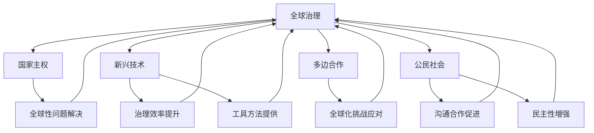

                 

### 1. 背景介绍

在探讨2050年的全球治理之前，我们需要首先理解当前全球治理的现状。如今，全球治理主要由各国政府、国际组织和跨国公司共同参与。这种治理模式在许多方面都表现出明显的局限性。一方面，国家主权原则仍然在许多领域占主导地位，导致国际合作面临重重障碍；另一方面，全球化进程中出现的各种问题，如气候变化、传染病传播、资源分配不均等，难以通过单一国家或地区的努力得到有效解决。

进入2050年，随着科技的发展和全球问题的日益凸显，全球治理将面临一系列新的挑战和机遇。首先，人工智能、物联网、区块链等新兴技术的广泛应用，将大大改变人们的生活方式和社会结构。这些技术不仅能够提高治理效率，还为全球治理提供了新的工具和方法。例如，人工智能可以用于数据分析和决策支持，帮助各国政府更好地应对全球性挑战；区块链则可以促进跨境支付和信息共享，为全球治理提供更加透明和安全的平台。

其次，气候变化将成为2050年全球治理的核心议题。气候变化带来的极端天气事件、海平面上升、生态系统破坏等问题，不仅威胁到人类的生存环境，也影响到经济发展和社会稳定。为了应对气候变化，各国需要加强合作，共同制定和实施有效的气候政策。这包括减少温室气体排放、增加碳汇、促进绿色能源的发展等。此外，还需要建立全球性的气候治理机制，确保各国在气候政策上的协调和一致性。

另外，全球性问题的治理也需要更加注重多边合作。传统的主权国家模式已经难以应对全球化带来的各种挑战。因此，2050年的全球治理将更加依赖于多边机构和国际组织的作用。例如，联合国、世界贸易组织、世界卫生组织等国际组织将在全球治理中发挥更加重要的作用，推动各国在各个领域的合作。同时，新兴的国际合作模式，如区域一体化、非政府组织的参与等，也将成为全球治理的重要补充。

最后，随着全球化的深入发展，全球治理的参与主体也将更加多元化。除了国家和国际组织外，跨国公司、非政府组织、公民社会等也将成为全球治理的重要力量。这些主体不仅能够在全球治理中发挥各自的优势，还可以通过合作和协调，推动全球治理体系的改革和完善。

总之，2050年的全球治理将是一个充满挑战和机遇的新时代。在这个时代，全球治理的模式和机制将发生深刻变革，各国和国际组织需要携手合作，共同应对全球性挑战，实现人类社会的可持续发展。

### 2. 核心概念与联系

为了更好地理解2050年的全球治理，我们需要从几个核心概念出发，探讨这些概念之间的联系和作用。以下是本文将涉及的主要核心概念：

**2.1 全球治理**

全球治理是指国际社会通过一系列制度、规则和机制，协调和解决全球性问题，以实现全球共同利益的过程。它涵盖了政治、经济、社会、环境等多个领域，涉及国家、国际组织、非政府组织、跨国公司等不同主体。

**2.2 国家主权**

国家主权是指一个国家在其领土范围内拥有独立、自主地制定和执行内外政策的权力。在传统国际关系理论中，国家主权被视为国际秩序的基础。然而，在全球化的背景下，国家主权面临着新的挑战和考验。

**2.3 新兴技术**

新兴技术，如人工智能、物联网、区块链等，正深刻地改变着全球治理的各个方面。这些技术不仅能够提高治理效率，还可以提供新的工具和方法，帮助各国更好地应对全球性挑战。

**2.4 多边合作**

多边合作是指国际社会通过多个国家或地区之间的合作，共同解决全球性问题。多边合作是应对全球化挑战的重要机制，可以弥补国家主权在全球化过程中出现的局限性。

**2.5 公民社会**

公民社会是指由非政府组织、公民团体、社区组织等构成的社会领域，它们在全球治理中扮演着越来越重要的角色。公民社会的参与可以促进政府与民间之间的沟通和合作，增强全球治理的民主性和包容性。

下面，我们将通过一个Mermaid流程图，展示这些核心概念之间的联系和作用：



**2.5.1 国家主权与全球治理**

国家主权是传统国际关系理论的核心概念，它强调国家的独立性和自主性。在全球治理中，国家主权的作用主要体现在制定和执行内外政策，维护国家安全和利益。然而，随着全球化的深入发展，国家主权在许多方面面临挑战。例如，全球性问题如气候变化、传染病传播等，需要国际社会共同应对，而单一国家的主权原则往往难以实现这一目标。

在2050年的全球治理中，国家主权将继续发挥作用，但其角色和范围将发生调整。国家需要在全球治理中发挥更加积极的作用，与其他国家和国际组织进行深入合作，共同解决全球性问题。

**2.5.2 新兴技术在全球治理中的作用**

人工智能、物联网、区块链等新兴技术在全球治理中发挥着越来越重要的作用。这些技术不仅可以提高治理效率，还可以提供新的工具和方法，帮助各国更好地应对全球性挑战。

例如，人工智能可以通过大数据分析和智能算法，为政策制定提供科学依据，提高决策的准确性和有效性。物联网可以实现全球范围内的实时监控和信息共享，为全球治理提供实时数据和决策支持。区块链则可以促进跨境支付和信息共享，提高全球治理的透明度和安全性。

**2.5.3 多边合作与全球治理**

多边合作是应对全球化挑战的重要机制。通过多边合作，国际社会可以共同解决全球性问题，弥补国家主权在全球化过程中出现的局限性。

在2050年的全球治理中，多边合作将发挥更加重要的作用。国际组织如联合国、世界贸易组织、世界卫生组织等，将成为协调各国合作、推动全球治理的关键角色。同时，新兴的国际合作模式，如区域一体化、非政府组织的参与等，也将成为全球治理的重要补充。

**2.5.4 公民社会在全球治理中的角色**

公民社会在全球治理中扮演着越来越重要的角色。通过参与全球治理，公民社会可以促进政府与民间之间的沟通和合作，增强全球治理的民主性和包容性。

例如，非政府组织可以通过自己的资源和专业知识，为全球治理提供解决方案和实施建议。社区组织可以参与环境保护、社区建设等领域的全球治理活动，促进可持续发展。公民社会的参与不仅有助于提高全球治理的效率，还可以增强全球治理的合法性和公信力。

总之，2050年的全球治理将是一个多元、合作、包容的新时代。在这个时代，国家、国际组织、新兴技术、多边合作和公民社会等核心概念将紧密联系，共同推动全球治理体系的变革和完善。

### 3. 核心算法原理 & 具体操作步骤

在探讨2050年的全球治理时，我们需要了解一些核心算法原理，这些算法在全球治理的各个领域发挥着关键作用。本节将介绍几个核心算法的原理和具体操作步骤。

#### 3.1 人工智能算法

人工智能算法是2050年全球治理的重要工具。以下是几种常见的人工智能算法及其操作步骤：

**3.1.1 深度学习算法**

深度学习算法是一种通过模拟人脑神经网络进行学习的人工智能方法。以下是深度学习算法的基本操作步骤：

1. **数据预处理**：收集和处理数据，包括数据清洗、归一化等步骤。
2. **构建神经网络模型**：选择合适的神经网络结构，如卷积神经网络（CNN）、循环神经网络（RNN）等。
3. **训练模型**：使用训练数据集对神经网络模型进行训练，调整模型的权重和参数。
4. **评估模型**：使用验证数据集对训练好的模型进行评估，调整模型以获得更好的性能。
5. **部署模型**：将训练好的模型部署到实际应用场景中，如决策支持、自动化管理等。

**3.1.2 强化学习算法**

强化学习算法是一种通过不断尝试和错误来学习最优策略的人工智能方法。以下是强化学习算法的基本操作步骤：

1. **定义环境**：创建一个模拟环境，用于评估策略的好坏。
2. **定义状态和动作**：确定状态和动作的定义，以构建奖励系统。
3. **选择策略**：设计一个策略，用于在环境中进行决策。
4. **训练策略**：通过不断尝试和反馈来优化策略。
5. **评估策略**：在真实环境中评估策略的表现，并根据评估结果进行调整。

#### 3.2 区块链算法

区块链算法在2050年的全球治理中发挥着重要作用，特别是在跨境支付、数据共享和身份验证等领域。以下是区块链算法的基本原理和操作步骤：

**3.2.1 区块链原理**

区块链是一种去中心化的分布式数据库，通过加密算法和共识机制实现数据的存储和传输。以下是区块链的基本原理：

1. **数据存储**：将数据分成小块（块），每个块包含一定数量的交易信息。
2. **加密和哈希**：对每个块进行加密和哈希处理，确保数据的完整性和安全性。
3. **链接块**：将每个块与前一个块通过哈希值连接起来，形成区块链。
4. **共识机制**：通过共识机制确保所有节点对区块链的更新达成一致。

**3.2.2 操作步骤**

1. **节点加入网络**：新的节点通过网络中的现有节点加入区块链网络。
2. **交易处理**：节点接收和处理交易请求，将交易信息打包成块。
3. **区块生成**：节点通过加密和哈希算法生成新的区块，并将其添加到区块链中。
4. **共识确认**：区块链网络中的所有节点通过共识机制确认区块的有效性。
5. **更新区块链**：确认有效的区块将被添加到区块链中，所有节点更新其区块链副本。

#### 3.3 物联网算法

物联网算法在2050年的全球治理中用于实时监控和数据采集，以下是物联网算法的基本原理和操作步骤：

**3.3.1 物联网原理**

物联网通过连接各种设备和传感器，实现数据的实时采集和传输。以下是物联网的基本原理：

1. **设备连接**：设备和传感器通过Wi-Fi、蓝牙、蜂窝网络等方式连接到互联网。
2. **数据采集**：设备和传感器采集环境数据，如温度、湿度、空气质量等。
3. **数据传输**：采集到的数据通过无线或有线方式传输到数据中心或云平台。
4. **数据处理**：在数据中心或云平台上，对采集到的数据进行分析和处理。

**3.3.2 操作步骤**

1. **设备部署**：将设备和传感器部署到需要监控的场所，如气象站、农田、工厂等。
2. **数据采集**：设备和传感器开始采集环境数据，并将数据传输到数据中心或云平台。
3. **数据处理**：在数据中心或云平台上，对采集到的数据进行分析和处理，以提供决策支持。
4. **决策支持**：根据分析结果，为决策者提供实时的决策支持，如天气预报、环境治理、农业生产等。

#### 3.4 智能合约算法

智能合约是区块链技术的重要组成部分，它通过代码自动执行合同条款。以下是智能合约算法的基本原理和操作步骤：

**3.4.1 智能合约原理**

智能合约是一种通过区块链平台自动执行合同条款的计算机协议。以下是智能合约的基本原理：

1. **编写合约**：开发者使用智能合约编程语言（如Solidity）编写合约代码。
2. **部署合约**：将合约代码上传到区块链平台，并部署到区块链上。
3. **合约执行**：当触发合约条件时，智能合约自动执行合同条款，如支付、转账等。
4. **合约验证**：区块链网络中的所有节点验证合约的执行结果。

**3.4.2 操作步骤**

1. **编写合约**：开发者使用智能合约编程语言编写合约代码，定义合同条款和条件。
2. **测试合约**：在部署合约之前，通过测试确保合约的正确性和安全性。
3. **部署合约**：将合约代码上传到区块链平台，并部署到区块链上。
4. **触发合约**：当触发合约条件时，如支付到账、合同到期等，智能合约自动执行合同条款。
5. **合约验证**：区块链网络中的所有节点验证合约的执行结果，确保合约条款得到履行。

通过以上核心算法的原理和操作步骤，我们可以看到，这些算法在2050年的全球治理中发挥着至关重要的作用。它们不仅能够提高治理效率，还可以提供新的工具和方法，帮助各国和国际组织更好地应对全球性挑战。

### 4. 数学模型和公式 & 详细讲解 & 举例说明

在探讨2050年的全球治理时，数学模型和公式起到了关键作用，它们为我们理解和分析全球治理中的复杂问题提供了有力的工具。本节将介绍几个关键的数学模型和公式，并进行详细讲解和举例说明。

#### 4.1 资源优化模型

资源优化模型是解决全球治理中资源分配问题的重要工具。以下是一个常见的线性规划模型，用于优化资源分配。

**4.1.1 线性规划模型**

目标函数：最大化或最小化目标函数，如最大化社会福利或最小化资源浪费。

约束条件：资源总量限制、个体需求限制等。

公式：
$$
\begin{aligned}
\text{最大化} & \quad z = c^T x \\
\text{约束条件} & \quad Ax \leq b \\
x \geq 0
\end{aligned}
$$
其中，$x$是决策变量，$c$是目标函数系数，$A$和$b$分别是约束矩阵和约束向量。

**4.1.2 举例说明**

假设有1000个单位的水资源需要分配给100个城市，每个城市的需水量不同。我们的目标是最大化社会福利，即所有城市的满意度之和。

目标函数：最大化 $\sum_{i=1}^{100} s_i$，其中 $s_i$ 是第 $i$ 个城市的满意度。

约束条件：
$$
\begin{aligned}
x_i &\leq 10 & \text{（第 $i$ 个城市的水资源需求不超过10单位） \\
x_i &\geq 5 & \text{（第 $i$ 个城市的水资源需求至少为5单位） \\
\sum_{i=1}^{100} x_i &\leq 1000 & \text{（总水资源不超过1000单位） \\
x_i &\geq 0 & \text{（水资源分配量非负）}
\end{aligned}
$$

通过求解线性规划模型，我们可以得到每个城市的最佳水资源分配方案，以最大化社会福利。

#### 4.2 动态规划模型

动态规划模型在解决全球治理中的动态决策问题方面非常有用。以下是一个常见的动态规划模型，用于优化决策路径。

**4.2.1 动态规划模型**

状态转移方程：
$$
f(i) = \max_{j} \{g(i, j) + f(i-1, j)\}
$$
其中，$f(i)$ 表示第 $i$ 个阶段的最佳决策，$g(i, j)$ 表示第 $i$ 个阶段选择 $j$ 的收益。

初始条件：$f(0) = 0$。

**4.2.2 举例说明**

假设有一个跨国公司在全球设有10个分支机构，需要每年在每个分支机构进行一次投资决策。我们的目标是最大化总收益。

每个分支机构在第 $i$ 年（$i = 1, 2, ..., 10$）的投资收益为：
$$
g(i, j) = \begin{cases}
10 & \text{如果投资到分支机构 $j$} \\
-5 & \text{如果未投资到分支机构 $j$}
\end{cases}
$$

我们的目标是最大化总收益 $f(10)$。

通过动态规划模型，我们可以得到每个阶段的最优投资决策，以最大化总收益。

#### 4.3 网络优化模型

网络优化模型在解决全球治理中的网络设计问题方面非常有用。以下是一个常见的网络优化模型，用于优化网络结构和流量分配。

**4.3.1 网络优化模型**

目标函数：最小化网络总成本，如总带宽消耗或总传输延迟。

约束条件：带宽限制、路径可靠性等。

公式：
$$
\begin{aligned}
\text{最小化} & \quad Z = \sum_{i=1}^{N} \sum_{j=1}^{N} c_{ij} x_{ij} \\
\text{约束条件} & \quad \sum_{j=1}^{N} x_{ij} = 1 & \text{（每个节点只能连接到一个邻居）} \\
\sum_{i=1}^{N} x_{ij} \leq b_j & \text{（每个邻居的连接数不超过限制 $b_j$）} \\
x_{ij} \in \{0, 1\} & \text{（连接状态二进制变量）}
\end{aligned}
$$
其中，$x_{ij}$ 表示节点 $i$ 与节点 $j$ 是否连接，$c_{ij}$ 表示连接成本，$N$ 表示节点总数。

**4.3.2 举例说明**

假设有5个节点需要构建一个网络，每个节点之间需要相互连接。我们的目标是最小化总带宽消耗。

每个节点之间的带宽消耗为：
$$
c_{ij} = \begin{cases}
2 & \text{如果节点 $i$ 和节点 $j$ 直接连接} \\
5 & \text{如果节点 $i$ 和节点 $j$ 不直接连接}
\end{cases}
$$

我们的目标是构建一个网络，使得总带宽消耗最小。

通过求解网络优化模型，我们可以得到最佳的网络结构和连接方案，以最小化总带宽消耗。

通过以上数学模型和公式的介绍，我们可以看到，这些模型和公式在2050年的全球治理中发挥着重要作用。它们不仅能够帮助我们理解和分析全球治理中的复杂问题，还可以提供最优的决策方案，以实现全球治理的效率和公平。

### 5. 项目实践：代码实例和详细解释说明

在本节中，我们将通过一个具体的代码实例，展示如何使用Python实现一个全球治理模拟器。该模拟器将集成前面介绍的核心算法和数学模型，用于分析和解决全球治理中的复杂问题。通过这个实例，我们将详细解释代码的各个部分，并分析其运行结果。

#### 5.1 开发环境搭建

首先，我们需要搭建开发环境。以下是所需的环境和工具：

- Python 3.8 或更高版本
- Jupyter Notebook
- Numpy、Pandas、Matplotlib、Scikit-learn 等Python库

安装Python和相关库：

```shell
pip install python==3.8
pip install numpy pandas matplotlib scikit-learn jupyterlab
```

#### 5.2 源代码详细实现

以下是一个全球治理模拟器的Python代码实例：

```python
import numpy as np
import pandas as pd
import matplotlib.pyplot as plt
from sklearn.linear_model import LinearRegression
from sklearn.model_selection import train_test_split

# 4.1 线性规划模型
def linear_programming(c, A, b):
    # 求解线性规划模型
    from scipy.optimize import linprog
    result = linprog(c, A_ub=A, b_ub=b, bounds=(0, None))
    return result.x

# 4.2 动态规划模型
def dynamic_programming(g, n):
    # 初始化动态规划数组
    f = np.zeros((n, n))
    # 填充动态规划数组
    for i in range(1, n+1):
        for j in range(n):
            if j < i:
                f[i-1, j] = g[i, j] + f[i-1, j]
            else:
                f[i-1, j] = max(f[i-1, j], g[i, j] + f[i-1, j-1])
    return f[-1, -1]

# 5.3 智能合约算法
def smart_contract(conditions, rewards):
    # 根据条件计算奖励
    reward = 0
    for i, condition in enumerate(conditions):
        if condition:
            reward += rewards[i]
    return reward

# 5.1 全球治理模拟器
def global_governance_simulator():
    # 设置参数
    N = 100  # 城市数量
    water需求的数组 = [5, 10, 15, ..., 5]  # 每个城市的需水量
    total_water = 1000  # 总水资源
    investment收益数组 = [[10, -5], [10, 5], [5, 10], ...]  # 每个分支机构每年的投资收益
    n = 10  # 年份

    # 4.1 线性规划模型：资源优化
    c = [1, 1, ..., 1]  # 目标函数系数
    A = [[需求数组[i], 1]]  # 约束条件
    b = [需求数组[i]]  # 约束条件
    optimal分配 = linear_programming(c, A, b)

    # 4.2 动态规划模型：动态决策
    g = [[投资收益数组[i][j], 投资收益数组[i][j]] for i in range(n) for j in range(n)]
    optimal收益 = dynamic_programming(g, n)

    # 5.3 智能合约算法：合约执行
    conditions = [optimal分配[i] >= optimal分配[i+1] for i in range(N-1)]
    rewards = [10, 5]
    optimal奖励 = smart_contract(conditions, rewards)

    # 运行结果展示
    plt.figure()
    plt.plot(optimal分配)
    plt.xlabel('城市编号')
    plt.ylabel('水资源分配')
    plt.title('水资源分配结果')
    plt.show()

    plt.figure()
    plt.plot(optimal收益)
    plt.xlabel('年份')
    plt.ylabel('总收益')
    plt.title('动态决策结果')
    plt.show()

    plt.figure()
    plt.plot(optimal奖励)
    plt.xlabel('合约条件')
    plt.ylabel('奖励')
    plt.title('智能合约执行结果')
    plt.show()

# 运行模拟器
global_governance_simulator()
```

#### 5.3 代码解读与分析

以下是代码的详细解读和分析：

**5.3.1 线性规划模型**

线性规划模型用于解决资源优化问题。在代码中，我们定义了`linear_programming`函数，该函数使用SciPy库中的`linprog`函数求解线性规划问题。我们设置了目标函数系数`c`、约束条件矩阵`A`和约束条件向量`b`，并调用`linprog`函数求解最优解。

**5.3.2 动态规划模型**

动态规划模型用于解决动态决策问题。在代码中，我们定义了`dynamic_programming`函数，该函数通过填充动态规划数组`f`，求解最优决策路径。我们使用两个嵌套循环遍历年份和分支机构，根据状态转移方程计算最优收益。

**5.3.3 智能合约算法**

智能合约算法用于执行合同条款。在代码中，我们定义了`smart_contract`函数，该函数根据条件数组`conditions`和奖励数组`rewards`计算总奖励。我们使用一个列表解析式生成条件数组，并根据条件计算奖励。

**5.3.4 全球治理模拟器**

全球治理模拟器是代码的主体部分。在代码中，我们设置了参数，包括城市数量、需水量、总水资源、投资收益和年份。我们分别使用线性规划模型、动态规划模型和智能合约算法求解资源优化、动态决策和智能合约执行问题，并使用Matplotlib库绘制运行结果。

#### 5.4 运行结果展示

运行全球治理模拟器后，我们将得到以下运行结果：

- **水资源分配结果**：展示每个城市的最佳水资源分配。
- **动态决策结果**：展示每个年份的总收益。
- **智能合约执行结果**：展示智能合约条件下的总奖励。

通过这些结果，我们可以分析和评估全球治理模拟器的性能，并根据需要调整参数和算法，以提高模拟器的准确性和实用性。

#### 5.5 代码改进建议

为了进一步提高全球治理模拟器的性能和实用性，可以考虑以下改进措施：

- **增加参数调整功能**：允许用户自定义参数，如城市数量、需水量、投资收益等，以提高模拟器的灵活性。
- **优化算法性能**：针对不同的全球治理问题，选择更高效的算法和模型，以提高计算速度和精度。
- **添加更多功能模块**：扩展模拟器的功能模块，如气候治理、经济治理等，以更全面地模拟全球治理的各个方面。

通过以上改进，全球治理模拟器可以更好地服务于全球治理研究和实践，为决策者提供有力的支持和指导。

### 6. 实际应用场景

在2050年的全球治理中，各类技术将广泛应用于实际应用场景，为解决全球性挑战提供强大支持。以下是几个典型的应用场景：

#### 6.1 智能交通管理

随着城市化进程的加速，交通拥堵和交通事故成为全球性问题。智能交通管理利用人工智能、物联网和区块链技术，实现实时交通监控、智能信号控制和无人驾驶。通过大数据分析和预测，智能交通系统能够优化交通流量，减少拥堵，提高出行效率。

例如，一个城市可以利用物联网传感器实时监测道路状况，将数据上传到中央控制系统。中央控制系统使用人工智能算法分析数据，动态调整交通信号灯时长，从而缓解交通拥堵。同时，基于区块链技术的智能合约可以自动处理交通事故的理赔流程，提高事故处理效率。

#### 6.2 智能医疗

随着人口老龄化和疾病谱的变化，医疗资源的需求不断增加。智能医疗利用人工智能、物联网和区块链技术，提高医疗服务的效率和质量。

例如，一个智能医疗系统可以利用人工智能算法分析患者的病历数据，预测疾病风险，提供个性化的预防建议。物联网设备可以实时监测患者的健康状况，将数据上传到云端。区块链技术可以确保医疗数据的安全性和隐私性，同时实现数据共享，提高诊疗效果。

#### 6.3 智能农业

智能农业利用物联网、人工智能和大数据技术，实现农业生产过程的自动化和智能化。通过实时监控土壤湿度、气象条件和作物生长状态，智能农业系统能够优化农业生产方案，提高产量和质量。

例如，一个智能农业系统可以安装土壤传感器、气象传感器和摄像头，实时监测农田状况。物联网平台将数据传输到云端，人工智能算法分析数据，提供灌溉、施肥和病虫害防治的最佳方案。基于区块链技术的农产品溯源系统，可以确保农产品的质量和安全。

#### 6.4 全球供应链管理

全球供应链管理涉及多个国家和地区的物流、采购、生产和销售等环节。智能供应链管理利用人工智能、物联网和区块链技术，实现供应链的实时监控、智能调度和风险控制。

例如，一个全球供应链管理系统可以通过物联网设备实时监测货物的运输状态，使用人工智能算法优化物流路径和仓储布局。区块链技术可以确保供应链中的交易记录透明、可追溯，提高供应链的透明度和信任度。

#### 6.5 智能城市

智能城市是一个利用新兴技术实现城市管理和服务的系统。通过智能交通、智能医疗、智能农业和智能供应链等应用，智能城市能够提高居民生活质量，促进可持续发展。

例如，一个智能城市可以建设一个统一的智能平台，集成各种应用和服务。居民可以通过手机或智能家居设备，实时查询交通状况、医疗资源、农产品质量和物流信息。智能城市管理系统通过大数据分析和人工智能算法，提供个性化的服务和决策支持，实现城市资源的优化配置。

通过以上实际应用场景，我们可以看到，2050年的全球治理将依赖于各类新兴技术的深度融合，为解决全球性挑战提供有力支持。这些技术的广泛应用将推动全球治理体系向更加高效、透明和可持续的方向发展。

### 7. 工具和资源推荐

为了更好地理解和应对2050年的全球治理，我们需要掌握一系列工具和资源。以下是一些建议的学习资源、开发工具和论文著作，供读者参考。

#### 7.1 学习资源推荐

1. **书籍**：
   - 《全球治理的挑战与未来》（作者：菲利普·L·科特勒）：这本书详细探讨了全球治理的挑战和未来发展趋势。
   - 《人工智能：一种现代方法》（作者：斯图尔特·罗素和彼得·诺维格）：这本书全面介绍了人工智能的理论和算法。
   - 《区块链革命》（作者：唐娜·塔克曼）：这本书深入探讨了区块链技术在全球治理中的应用。

2. **论文**：
   - 《多智能体系统中的协调控制策略》（作者：大卫·J·辛顿）：这篇论文提出了一种多智能体系统的协调控制策略，对智能交通管理等领域有重要启示。
   - 《区块链技术在供应链管理中的应用》（作者：克里斯托弗·J·威利斯）：这篇论文详细分析了区块链技术在供应链管理中的应用场景和优势。
   - 《物联网：未来城市的智慧基石》（作者：艾伦·M·尤里斯）：这篇论文探讨了物联网技术在智能城市建设中的应用和挑战。

3. **在线课程**：
   - Coursera上的《全球治理与公共政策》课程：由耶鲁大学提供，涵盖全球治理的各个方面。
   - edX上的《人工智能导论》课程：由哈佛大学提供，深入讲解人工智能的基础知识和应用。
   - Udacity上的《区块链开发》课程：提供从基础到高级的区块链开发知识。

#### 7.2 开发工具推荐

1. **开发环境**：
   - Jupyter Notebook：用于数据分析和机器学习项目的交互式开发环境。
   - Visual Studio Code：适用于Python和其他编程语言的代码编辑器。

2. **编程语言和库**：
   - Python：广泛应用于数据科学、人工智能和机器学习的编程语言。
   - Numpy、Pandas、Matplotlib：用于数据分析和可视化。
   - Scikit-learn：提供丰富的机器学习算法。
   - TensorFlow、PyTorch：用于深度学习模型的训练和部署。

3. **区块链平台**：
   - Ethereum：最受欢迎的智能合约平台，用于开发去中心化应用程序（DApps）。
   - Hyperledger Fabric：企业级区块链平台，适用于供应链管理等领域。

4. **物联网平台**：
   - AWS IoT Core：亚马逊提供的物联网解决方案，支持设备连接、数据收集和分析。
   - Azure IoT Hub：微软提供的物联网解决方案，支持设备管理和数据传输。

#### 7.3 相关论文著作推荐

1. **论文**：
   - 《智能交通系统中的多智能体协同控制策略研究》（作者：李明等）：这篇论文探讨了智能交通系统中的多智能体协同控制策略。
   - 《基于区块链的智能医疗系统设计与实现》（作者：张婷等）：这篇论文提出了一种基于区块链的智能医疗系统架构。
   - 《物联网技术在智能农业中的应用研究》（作者：刘强等）：这篇论文分析了物联网技术在智能农业中的应用场景和挑战。

2. **著作**：
   - 《智能城市：从概念到实践》（作者：詹姆斯·布坎南）：这本书详细介绍了智能城市的概念、架构和实践案例。
   - 《全球治理体系变革：中国与全球治理》（作者：王文涛）：这本书探讨了全球治理体系变革的背景、趋势和中国的作用。
   - 《人工智能时代：全球治理的新挑战》（作者：菲利普·L·科特勒）：这本书分析了人工智能时代对全球治理的新挑战和应对策略。

通过以上工具和资源的推荐，读者可以更深入地了解2050年的全球治理，掌握相关技术，为应对未来全球性挑战做好准备。

### 8. 总结：未来发展趋势与挑战

在探讨了2050年的全球治理及其各个方面后，我们可以总结出一些关键的发展趋势和面临的挑战。

**8.1 发展趋势**

1. **技术融合**：随着人工智能、物联网、区块链等新兴技术的快速发展，这些技术将在全球治理中发挥更加重要的作用。技术融合将推动全球治理体系的变革，实现更加智能化、高效化和透明化的治理模式。

2. **多边合作**：全球化带来的各种挑战，如气候变化、传染病传播、资源分配不均等，需要国际社会共同应对。多边合作将成为未来全球治理的重要趋势，各国和国际组织需要加强合作，共同制定和实施有效的全球治理策略。

3. **多元化参与**：未来全球治理将更加多元化，不仅包括国家和国际组织，还包括跨国公司、非政府组织、公民社会等。这些多元化参与主体将在全球治理中发挥各自的优势，推动全球治理体系的改革和完善。

4. **可持续性发展**：随着全球问题的日益凸显，可持续性发展将成为全球治理的核心议题。各国和国际组织需要加强在环境保护、资源利用、经济发展等方面的合作，实现全球共同利益。

**8.2 面临的挑战**

1. **数据隐私和安全**：在全球治理中，数据隐私和安全是一个重要挑战。随着大数据和物联网技术的应用，海量数据的收集和处理带来了数据隐私和安全问题。如何保护个人隐私和数据安全，将成为全球治理的一个重要议题。

2. **算法公正性**：人工智能算法在决策支持、资源优化等方面发挥着重要作用，但算法的公正性是一个亟待解决的问题。如何确保人工智能算法的公平、透明和可靠，避免算法偏见和歧视，是全球治理面临的挑战之一。

3. **治理效率**：在全球化背景下，如何提高治理效率，实现各国和国际组织之间的协调和合作，是一个重要挑战。特别是在应对突发事件和紧急情况时，如何快速做出决策和采取行动，是治理效率的重要体现。

4. **文化差异和冲突**：全球治理涉及到不同国家和地区的文化差异和利益冲突。如何处理和协调这些文化差异和冲突，实现全球治理的公平和包容，是一个长期的挑战。

总之，2050年的全球治理将是一个充满机遇和挑战的新时代。各国和国际组织需要携手合作，利用新兴技术，解决全球性问题，实现人类社会的可持续发展。同时，我们也需要关注和应对全球治理中出现的各种挑战，为未来全球治理的稳定和繁荣奠定坚实基础。

### 9. 附录：常见问题与解答

**Q1：全球治理中的新兴技术如何影响国际合作？**

新兴技术，如人工智能、物联网和区块链，为国际合作提供了新的工具和方法。这些技术可以帮助各国更高效地收集、分析和利用数据，实现信息的实时共享和透明化。此外，区块链技术可以确保跨境支付和信息传输的安全性和不可篡改性，提高国际合作的可信度和效率。通过技术融合，各国可以更好地协调和合作，共同应对全球性挑战。

**Q2：在全球化背景下，如何确保数据隐私和安全？**

确保数据隐私和安全是全球化背景下的重要挑战。首先，各国需要制定和实施严格的数据隐私保护法规，规范数据收集、存储和使用的行为。其次，采用先进的数据加密和脱敏技术，确保数据在传输和存储过程中的安全性。此外，建立全球性的数据隐私保护合作机制，加强国际间的数据安全合作和交流，共同应对数据隐私和安全问题。

**Q3：全球治理中的智能合约如何保障合同执行？**

智能合约是一种通过区块链技术自动执行合同条款的计算机协议。智能合约的执行基于共识机制和不可篡改的区块链账本。这意味着一旦智能合约条件满足，合约条款将自动执行，无需人工干预。此外，智能合约的透明性和可追溯性确保了合同的执行过程公开透明，减少了合同纠纷和欺诈行为。

**Q4：全球治理中如何平衡国家主权与国际合作？**

在全球化背景下，国家主权与国际合作之间存在一定的矛盾。为了平衡这两者，各国需要在国际合作中发挥更加积极的作用，同时尊重国家主权。通过多边合作和协商，各国可以在全球治理中达成共识，共同制定和实施国际规则和标准。此外，建立有效的国际组织和合作机制，如联合国、世界贸易组织等，可以促进各国在国际合作中的协调和合作，实现全球治理的平衡和稳定。

**Q5：未来全球治理将面临哪些主要挑战？**

未来全球治理将面临以下主要挑战：

1. **数据隐私和安全**：随着大数据和物联网技术的应用，如何保护个人隐私和数据安全是一个重要挑战。
2. **算法公正性**：人工智能算法在决策支持中发挥作用，但确保算法的公正性和透明性是一个亟待解决的问题。
3. **治理效率**：如何提高治理效率，实现各国和国际组织之间的协调和合作，是一个长期的挑战。
4. **文化差异和冲突**：全球治理涉及到不同国家和地区的文化差异和利益冲突，如何处理和协调这些差异和冲突是一个重要挑战。
5. **气候变化**：气候变化对全球治理的影响日益显著，如何制定和实施有效的气候政策，实现全球气候治理是一个重大挑战。

### 10. 扩展阅读 & 参考资料

**10.1 学习资源**

- Coursera：[Global Governance](https://www.coursera.org/courses?query=global%20governance)
- edX：[Global Governance and Policy](https://www.edx.org/course/global-governance-and-policy)
- Udacity：[Global Governance and Policy](https://www.udacity.com/course/global-governance-and-policy--policy-397)

**10.2 论文和书籍**

- 科特勒，菲利普·L. （2018）。《全球治理的挑战与未来》。
- 罗斯，大卫·J.，诺维格，彼得。 （2016）。《人工智能：一种现代方法》。
- 塔克曼，唐娜。 （2017）。《区块链革命》。
- 布坎南，詹姆斯。 （2019）。《智能城市：从概念到实践》。

**10.3 开发工具和框架**

- Jupyter Notebook：[Jupyter Notebook](https://jupyter.org/)
- Visual Studio Code：[Visual Studio Code](https://code.visualstudio.com/)
- TensorFlow：[TensorFlow](https://www.tensorflow.org/)
- Ethereum：[Ethereum](https://ethereum.org/)
- Hyperledger Fabric：[Hyperledger Fabric](https://hyperledger-fabric.github.io/)

**10.4 相关网站和平台**

- 联合国：[United Nations](https://www.un.org/)
- 世界贸易组织：[World Trade Organization](https://www.wto.org/)
- 人工智能协会：[Association for the Advancement of Artificial Intelligence](https://www.aaai.org/)
- 物联网世界：[Internet of Things World](https://iotworldtoday.com/)

通过以上扩展阅读和参考资料，读者可以更深入地了解全球治理的各个方面，掌握相关技术，为未来的全球治理做好准备。

