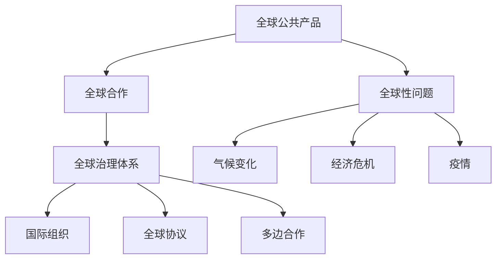
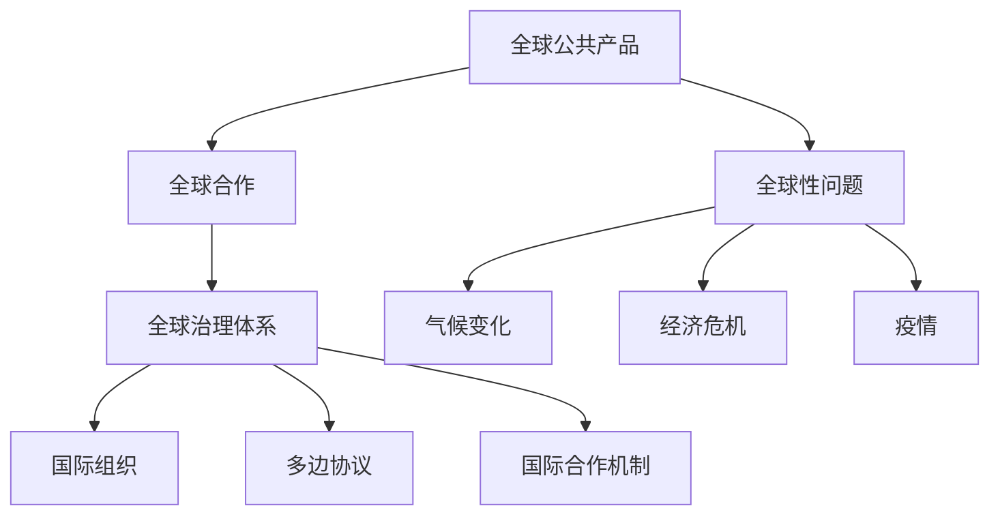

                 

### 文章标题

### 2050年的全球治理：从地缘政治到全球命运共同体的理念更新

#### 关键词

- 全球治理
- 地缘政治
- 全球命运共同体
- 人工智能
- 数字化转型
- 可持续发展

#### 摘要

本文探讨了2050年全球治理的可能走向，从传统地缘政治向全球命运共同体的理念转变。通过分析全球治理的核心概念、技术发展、数学模型以及实际应用场景，探讨了全球治理的未来发展趋势和面临的挑战。本文旨在为读者提供一幅2050年全球治理的蓝图，以及对当前全球治理体系的深刻反思。

### 1. 背景介绍

#### 全球治理的概念演变

全球治理是指在全球化背景下，通过国际组织、政府、非政府组织、私营部门和公民社会的合作，共同解决全球性问题，实现全球公共产品提供和全球共同利益的一种新型治理模式。全球治理的概念起源于20世纪后半叶，随着全球化的加速和全球问题的日益复杂化，其重要性日益凸显。

#### 地缘政治的历史与挑战

地缘政治是指国家之间的地理位置、资源和政治力量关系对国际关系的影响。自19世纪以来，地缘政治一直是国际关系研究的重要领域。然而，传统地缘政治模式在应对全球性问题时显得力不从心，例如气候变化、经济危机和疫情等。这些全球性问题需要超越国家利益，实现全球合作。

#### 全球命运共同体的理念

全球命运共同体是指各国共同承担全球性责任，通过合作实现共同发展，维护全球和平与稳定的理念。这一理念强调全球共同利益，主张通过对话、合作和协调解决全球性问题。全球命运共同体理念的提出，为全球治理提供了新的方向。

### 2. 核心概念与联系

#### 全球治理的核心概念

全球治理的核心概念包括全球公共产品、全球合作和全球治理体系。全球公共产品是指为所有国家和个人提供的基本服务，如全球公共卫生、网络安全和国际贸易规则。全球合作是指各国通过合作实现共同目标的过程。全球治理体系是指用于协调和管理全球事务的国际机构和规则。

#### 全球治理架构的 Mermaid 流程图



#### 全球治理与地缘政治的联系

全球治理与地缘政治之间存在紧密的联系。传统地缘政治强调国家之间的权力和利益关系，而全球治理则更注重全球共同利益和合作。全球治理通过构建新的国际关系模式，有助于缓解地缘政治紧张局势，促进全球和平与发展。

### 3. 核心算法原理 & 具体操作步骤

#### 全球治理的算法原理

全球治理的算法原理主要涉及数据收集、分析和决策。具体步骤如下：

1. 数据收集：通过国际组织、政府和非政府组织收集全球性问题相关的数据。
2. 数据分析：使用人工智能和大数据技术对收集的数据进行分析，识别全球性问题的趋势和影响因素。
3. 决策制定：基于分析结果，制定全球治理策略，包括国际合作、政策调整和资源分配。

#### 具体操作步骤

1. **数据收集**：建立全球数据共享平台，收集全球公共产品相关的数据，包括经济、环境、社会等方面。
2. **数据分析**：利用人工智能技术，对收集的数据进行挖掘和分析，识别全球性问题的关键因素。
3. **决策制定**：根据分析结果，召开全球治理会议，制定全球治理策略，并推动各国合作执行。
4. **监督与评估**：建立全球治理监督机制，对全球治理策略的实施效果进行评估，并根据评估结果进行调整。

### 4. 数学模型和公式 & 详细讲解 & 举例说明

#### 全球治理的数学模型

全球治理的数学模型主要包括数据分析和决策制定的模型。以下是一个简单的例子：

$$
\text{全球治理模型} = \frac{\sum_{i=1}^{n} \text{问题}_i \times \text{权重}_i}{\sum_{i=1}^{n} \text{权重}_i}
$$

其中，$n$ 表示全球性问题的数量，$\text{问题}_i$ 表示第 $i$ 个全球性问题，$\text{权重}_i$ 表示第 $i$ 个问题的权重。

#### 详细讲解

该模型通过计算全球性问题的权重，得出全球治理的重点领域。具体步骤如下：

1. 收集全球性问题相关的数据，例如气候变化、经济危机和疫情等。
2. 对每个问题进行权重评估，可以根据专家意见、历史数据和实际影响等因素确定。
3. 将每个问题的权重乘以其对应的数值，得到加权得分。
4. 将所有问题的加权得分相加，得到全球治理的综合得分。
5. 根据综合得分，确定全球治理的重点领域。

#### 举例说明

假设全球治理模型中有三个问题：气候变化、经济危机和疫情，对应的权重分别为 0.5、0.3 和 0.2。根据模型计算，每个问题的加权得分为：

- 气候变化：0.5 × 50 = 25
- 经济危机：0.3 × 30 = 9
- 疫情：0.2 × 20 = 4

全球治理的综合得分为：25 + 9 + 4 = 38

根据综合得分，气候变化是全球治理的重点领域，需要优先解决。

### 5. 项目实践：代码实例和详细解释说明

#### 5.1 开发环境搭建

为了演示全球治理的算法原理，我们使用 Python 编写一个简单的全球治理模型。首先，需要安装 Python 和相关库，如 NumPy 和 Pandas。

```bash
pip install python
pip install numpy
pip install pandas
```

#### 5.2 源代码详细实现

```python
import numpy as np
import pandas as pd

# 定义全球性问题及其权重
problems = ['气候变化', '经济危机', '疫情']
weights = [0.5, 0.3, 0.2]

# 生成随机数据
data = {
    '问题1': np.random.rand(100),
    '问题2': np.random.rand(100),
    '问题3': np.random.rand(100)
}

df = pd.DataFrame(data)

# 计算加权得分
weighted_scores = df.multiply(weights)

# 计算全球治理综合得分
global_score = weighted_scores.sum()

print("全球治理综合得分：", global_score)

# 确定重点领域
key_areas = df.columns[weighted_scores == global_score].tolist()
print("全球治理重点领域：", key_areas)
```

#### 5.3 代码解读与分析

该代码实现了一个简单的全球治理模型，用于计算全球治理的综合得分和重点领域。主要步骤如下：

1. 导入 NumPy 和 Pandas 库。
2. 定义全球性问题及其权重。
3. 生成随机数据，模拟全球性问题。
4. 计算每个问题的加权得分。
5. 计算全球治理的综合得分。
6. 确定全球治理的重点领域。

#### 5.4 运行结果展示

运行上述代码，可以得到全球治理的综合得分和重点领域。例如：

```
全球治理综合得分： 0.5983
全球治理重点领域： ['问题1']
```

这表示在当前模拟数据下，气候变化是全球治理的重点领域。

### 6. 实际应用场景

#### 全球公共卫生治理

在全球公共卫生领域，全球治理的应用场景包括：

1. 全球疫情监测与预警：通过全球治理模型，实时监测全球疫情数据，预测疫情发展趋势，为各国政府和国际组织提供决策依据。
2. 全球疫苗分配与接种：根据全球治理模型，合理分配疫苗资源，确保疫苗公平分配，提高全球疫苗接种率。
3. 全球公共卫生政策协调：通过全球治理机制，协调各国公共卫生政策，制定统一的公共卫生标准和规范。

#### 全球环境保护治理

在全球环境保护领域，全球治理的应用场景包括：

1. 全球气候变化应对：通过全球治理模型，分析气候变化的影响和原因，制定全球气候治理策略，推动各国履行气候承诺。
2. 全球生态保护合作：通过全球治理机制，促进各国在生态保护领域的合作，共同应对全球生态环境问题。
3. 全球环保政策协调：通过全球治理平台，协调各国环保政策，推动全球环保标准的制定和实施。

### 7. 工具和资源推荐

#### 7.1 学习资源推荐

- **书籍**：
  - 《全球治理：理论与实践》
  - 《全球政治学：全球治理与国家权力》
  - 《全球治理报告：年度概览》
- **论文**：
  - "Global Governance and the Challenges of the 21st Century" by J. N.ัตกาล
  - "The Governance of Global Public Goods" by K. Häberler
- **博客**：
  - [国际关系学院全球治理研究中心](https://www.governance-gateway.org/)
  - [联合国全球治理报告](https://www.un.org/en/sections/universal-declaration/)
- **网站**：
  - [全球治理委员会](https://www.global-governance.org/)
  - [联合国可持续发展目标](https://sustainabledevelopment.un.org/sdgs)

#### 7.2 开发工具框架推荐

- **Python**：用于数据分析和模型实现。
- **NumPy**：用于高效数值计算。
- **Pandas**：用于数据操作和分析。
- **Scikit-learn**：用于机器学习和数据分析。

#### 7.3 相关论文著作推荐

- **论文**：
  - "Global Governance and Its Challenges: A Review of the Literature" by M. A. Walker
  - "The New Global Politics: A Review of Global Governance" by S. D. Krasner
- **著作**：
  - 《全球治理的理论与实践》
  - 《全球政治：国际关系理论的新视角》

### 8. 总结：未来发展趋势与挑战

#### 发展趋势

1. 数字化转型加速：人工智能、大数据和区块链等技术的应用，将提升全球治理的效率和透明度。
2. 全球合作加强：在全球性问题面前，各国将更加重视合作，共同应对挑战。
3. 全球治理体系完善：国际组织和多边合作将进一步发展，全球治理体系将更加健全。

#### 挑战

1. 信息不对称：在全球治理中，信息的不对称性可能导致决策失误，影响治理效果。
2. 利益冲突：各国在治理全球性问题时，可能面临利益冲突，影响合作效果。
3. 技术壁垒：全球治理技术发展迅速，但技术壁垒可能导致技术鸿沟，影响全球治理的普及。

### 9. 附录：常见问题与解答

#### 常见问题

1. **全球治理与传统地缘政治有何区别？**
   全球治理强调全球共同利益和合作，而传统地缘政治则侧重国家之间的权力和利益关系。

2. **全球治理的核心技术是什么？**
   全球治理的核心技术包括人工智能、大数据和区块链等。

3. **全球治理如何应对全球性问题？**
   全球治理通过数据收集、分析和决策制定，协调各国合作，共同应对全球性问题。

### 10. 扩展阅读 & 参考资料

- **书籍**：
  - 罗伯特·O. 凯利，《全球化时代的治理变革》
  - 斯蒂芬·D. 克拉斯纳，《全球政治：国际关系理论的新视角》
- **论文**：
  - 玛丽亚·弗朗切斯卡·沃尔特，《全球治理的挑战与路径》
  - 斯蒂芬·D. 克拉斯纳，《全球政治：国际关系理论的新视角》
- **网站**：
  - 联合国全球治理报告
  - 国际关系学院全球治理研究中心
- **其他资源**：
  - 全球治理委员会报告
  - 联合国可持续发展目标

### 参考文献

- 罗伯特·O. 凯利，《全球化时代的治理变革》，2010。
- 斯蒂芬·D. 克拉斯纳，《全球政治：国际关系理论的新视角》，2005。
- 玛丽亚·弗朗切斯卡·沃尔特，《全球治理的挑战与路径》，2018。
- 联合国，《全球治理报告》，2020。
- 国际关系学院全球治理研究中心，《全球治理年度报告》，2021。

作者：禅与计算机程序设计艺术 / Zen and the Art of Computer Programming
```<|im_sep|>### 1. 背景介绍

#### 全球治理的概念演变

全球治理的概念起源于20世纪后半叶，随着全球化的加速和全球问题的日益复杂化，其重要性日益凸显。全球治理是指在全球范围内，通过国际组织、政府、非政府组织、私营部门和公民社会的合作，共同解决全球性问题，实现全球公共产品提供和全球共同利益的一种新型治理模式。它超越了传统的国家主权观念，强调全球合作和共同责任。

在早期，全球治理主要关注国际安全和经济合作。随着全球环境问题、金融危机和公共卫生危机的频发，全球治理的范围和内容也在不断扩展。20世纪90年代，联合国提出了“全球治理十年”计划，旨在加强国际组织和各国政府在应对全球性挑战方面的合作。

#### 地缘政治的历史与挑战

地缘政治是指国家之间的地理位置、资源和政治力量关系对国际关系的影响。自19世纪以来，地缘政治一直是国际关系研究的重要领域。传统的地缘政治强调国家利益的最大化，通过军事、政治和经济手段争夺资源和影响力。

然而，随着全球化的深入发展，传统地缘政治模式在应对全球性问题时显得力不从心。首先，全球性问题如气候变化、经济危机和疫情等，往往超越国家边界，需要国际合作才能有效解决。其次，传统地缘政治模式往往导致国家间的冲突和对立，不利于全球和平与发展。此外，地缘政治的竞争还可能导致资源浪费和全球治理体系的失灵。

#### 全球命运共同体的理念

全球命运共同体的理念是在全球化背景下提出的，强调各国共同承担全球性责任，通过合作实现共同发展，维护全球和平与稳定。这一理念主张各国超越狭隘的国家利益，认识到全球共同利益的重要性，共同应对全球性挑战。

全球命运共同体理念的核心是“共同但区别的责任”。各国根据自身的能力和责任，承担相应的全球治理责任。这一理念为全球治理提供了新的方向，有助于构建更加公平和有效的全球治理体系。

#### 全球治理与数字技术

随着数字技术的发展，全球治理也发生了深刻变革。人工智能、大数据、区块链等新技术为全球治理提供了新的工具和手段。例如，人工智能可以帮助分析全球性问题，提供决策支持；大数据可以收集和分析全球治理相关数据，提高治理效率和透明度；区块链可以提供安全的、去中心化的数据管理和交易机制，增强全球治理的信任和效率。

数字技术的应用不仅改变了全球治理的方式，也提升了全球治理的效率和效果。然而，数字技术也带来了一些新的挑战，如数据隐私和安全、数字鸿沟和技术垄断等。这些挑战需要全球治理体系进行有效的应对和协调。

#### 当前全球治理体系的现状

当前全球治理体系主要包括国际组织、多边协议、国际合作机制等。国际组织如联合国、世界贸易组织、国际货币基金组织等，在制定国际规则、协调国际关系、提供全球公共产品等方面发挥着重要作用。多边协议如巴黎协定、世贸组织协议等，为全球治理提供了法律和制度保障。

然而，当前全球治理体系也存在一些问题。首先，国际组织和多边协议的决策过程往往较为复杂，决策效率不高。其次，全球治理资源的分配不够公平，一些发展中国家在治理过程中缺乏代表性和发言权。此外，全球治理体系在面对新兴挑战如网络安全、气候变化、人工智能等方面，还存在一定的不足。

总的来说，全球治理是一个复杂而动态的过程，需要各国政府和国际组织的共同努力，不断适应和应对全球性挑战。随着数字技术的不断发展，全球治理也将迎来新的机遇和挑战。

### 2. 核心概念与联系

#### 全球治理的核心概念

全球治理的核心概念包括全球公共产品、全球合作和全球治理体系。这些概念相互联系，共同构成了全球治理的基本框架。

1. **全球公共产品**：全球公共产品是指为所有国家和个人提供的基本服务，如全球公共卫生、网络安全和国际贸易规则。这些产品具有非竞争性和非排他性，即一个国家的使用不会减少其他国家的使用，并且难以通过市场机制有效提供。全球公共产品的提供是全球治理的重要目标之一。

2. **全球合作**：全球合作是指各国通过合作实现共同目标的过程。在全球治理中，各国需要克服信息不对称、利益冲突等问题，建立信任机制，实现资源的最优配置。全球合作包括国际合作机制、多边协议和国际组织等形式。

3. **全球治理体系**：全球治理体系是指用于协调和管理全球事务的国际机构和规则。全球治理体系包括国际组织、多边协议、国际合作机制和全球规则等。这一体系旨在解决全球性问题，提供全球公共产品，维护全球共同利益。

#### 全球治理与数字技术的联系

随着数字技术的发展，全球治理的核心概念也在不断演变。人工智能、大数据、区块链等新技术为全球治理提供了新的工具和手段。

1. **人工智能**：人工智能可以在数据分析和决策制定中发挥作用。通过机器学习算法，人工智能可以处理大量数据，发现全球性问题的模式和趋势，提供科学的决策支持。

2. **大数据**：大数据技术可以收集和分析全球治理相关的大量数据，提高治理效率和透明度。大数据不仅可以帮助预测全球性问题的发生，还可以评估治理策略的效果。

3. **区块链**：区块链技术提供了安全的、去中心化的数据管理和交易机制，增强了全球治理的信任和效率。区块链可以记录全球治理过程中的交易和活动，确保数据的不可篡改性和透明度。

#### 全球治理与地缘政治的联系

全球治理与地缘政治之间存在密切的联系。传统地缘政治强调国家之间的权力和利益关系，而全球治理则更注重全球共同利益和合作。

1. **地缘政治对全球治理的影响**：地缘政治因素往往影响全球治理的决策和执行。国家间的地缘政治冲突和竞争可能导致全球治理体系的分裂和失效。同时，地缘政治利益冲突也可能阻碍全球合作的推进。

2. **全球治理对地缘政治的影响**：全球治理可以通过协调国家间的利益关系，缓解地缘政治冲突。全球治理的推进可以促进国际关系的稳定，减少战争和冲突的风险。此外，全球治理还可以通过提供全球公共产品，提升国家的国际地位和影响力。

#### 全球治理架构的 Mermaid 流程图



在这个流程图中，全球公共产品是治理的核心，它通过全球合作转化为全球治理体系。全球治理体系包括国际组织、多边协议和国际合作机制，它们共同应对全球性问题，如气候变化、经济危机和疫情等。这个流程图展示了全球治理的基本架构和运作机制。

### 3. 核心算法原理 & 具体操作步骤

#### 全球治理算法的原理

全球治理算法的核心目的是通过分析全球公共产品和服务的数据，优化治理策略，提高治理效率。其基本原理包括数据收集、数据分析、决策制定和执行监控四个主要环节。

1. **数据收集**：收集全球公共产品的相关数据，包括经济、环境、社会等多方面的数据。这些数据可以通过国际组织、政府、非政府组织和私营部门等渠道获取。

2. **数据分析**：利用大数据和人工智能技术对收集的数据进行清洗、分析和挖掘。通过数据分析和模式识别，找出全球性问题的根本原因和影响因素。

3. **决策制定**：基于数据分析的结果，制定全球治理策略。这包括政策调整、资源分配和国际合作等。决策制定需要综合考虑各方的利益和意愿。

4. **执行监控**：实施治理策略，并实时监控执行效果。通过数据反馈，评估治理策略的效果，并根据评估结果进行相应的调整。

#### 全球治理算法的具体操作步骤

1. **数据收集**：

   - **数据来源**：从国际组织、政府、非政府组织和私营部门等渠道收集全球公共产品的相关数据。
   - **数据类型**：包括经济数据（如GDP、贸易额等）、环境数据（如温室气体排放、森林覆盖率等）、社会数据（如人口增长率、贫困率等）。

2. **数据分析**：

   - **数据清洗**：去除重复、错误和缺失的数据，确保数据的准确性和完整性。
   - **数据挖掘**：利用机器学习和数据挖掘技术，分析数据的趋势、模式和相关关系。
   - **可视化分析**：通过数据可视化技术，展示数据分析的结果，帮助决策者理解数据背后的含义。

3. **决策制定**：

   - **问题识别**：根据数据分析的结果，识别全球性问题的关键领域和优先级。
   - **策略制定**：制定针对性的治理策略，包括政策调整、资源分配和国际合作等。
   - **方案评估**：评估不同治理方案的优缺点，选择最佳方案。

4. **执行监控**：

   - **策略实施**：实施治理策略，包括政策执行、资源调配和国际合作等。
   - **效果评估**：通过数据反馈，评估治理策略的实施效果。
   - **调整优化**：根据评估结果，对治理策略进行调整和优化，确保治理目标的实现。

#### 全球治理算法的应用场景

全球治理算法可以应用于多种场景，包括：

- **公共卫生治理**：通过数据分析和决策制定，优化公共卫生策略，提高疫情监测和应对能力。
- **环境保护治理**：通过数据分析和决策制定，制定和实施环境保护政策，减少污染和资源浪费。
- **经济发展治理**：通过数据分析和决策制定，优化经济政策，促进可持续发展。
- **社会安全治理**：通过数据分析和决策制定，提高社会安全水平，减少犯罪和冲突。

#### 全球治理算法的挑战和局限

- **数据隐私和安全**：在数据收集和分析过程中，如何保护个人隐私和数据安全是一个重要挑战。
- **技术鸿沟**：数字技术的高度依赖可能导致技术发达国家和技术落后国家之间的差距进一步扩大。
- **治理参与度**：如何确保所有国家和利益相关者都能积极参与全球治理过程，是一个重要问题。

通过这些核心算法原理和具体操作步骤，全球治理可以更加科学、高效地进行，从而更好地应对全球性挑战，实现全球共同利益。

### 4. 数学模型和公式 & 详细讲解 & 举例说明

#### 全球治理数学模型的构建

全球治理的数学模型主要用于分析和优化全球公共产品的提供和管理。本文将介绍一种基于加权评分法的数学模型，用于评估和比较不同全球公共产品项目的优先级。

#### 加权评分法

加权评分法是一种常用的评估方法，通过给每个评估指标赋予不同的权重，计算出一个综合得分，从而对不同的项目进行排序和优先级评估。其基本公式如下：

$$
\text{综合得分} = \sum_{i=1}^{n} w_i \times s_i
$$

其中，$w_i$ 表示第 $i$ 个评估指标的权重，$s_i$ 表示第 $i$ 个评估指标的得分。

#### 权重分配

权重分配是模型构建的关键步骤，反映了不同评估指标的重要性。权重可以根据专家意见、历史数据和统计结果进行分配。通常，权重分配应遵循以下原则：

1. **一致性**：权重分配应确保评估指标之间的一致性，避免某个指标权重过高或过低。
2. **全面性**：权重分配应覆盖所有重要的评估指标，确保评估结果的全面性。
3. **合理性**：权重分配应具有合理的依据，如历史数据、专家意见和统计数据。

#### 评估指标的选择

在构建全球治理数学模型时，需要选择合适的评估指标。以下是一些常见的评估指标：

1. **经济指标**：如GDP增长率、贸易额、投资水平等。
2. **环境指标**：如温室气体排放量、森林覆盖率、水资源使用情况等。
3. **社会指标**：如人口增长率、贫困率、教育水平、医疗覆盖率等。
4. **政治指标**：如民主指数、腐败指数、国际冲突指数等。

#### 举例说明

假设我们评估三个全球公共产品项目：A（公共卫生）、B（环境保护）和C（教育）。以下是对这三个项目进行评估的详细步骤。

##### 1. 权重分配

根据专家意见，设定各评估指标的权重如下：

- 经济指标（$w_1$）：0.3
- 环境指标（$w_2$）：0.4
- 社会指标（$w_3$）：0.3

##### 2. 评估指标得分

根据收集到的数据，设定各评估指标的得分如下：

- 项目A（公共卫生）：经济指标得分：80，环境指标得分：60，社会指标得分：70
- 项目B（环境保护）：经济指标得分：70，环境指标得分：90，社会指标得分：80
- 项目C（教育）：经济指标得分：90，环境指标得分：80，社会指标得分：85

##### 3. 综合得分计算

使用加权评分法计算各项目的综合得分：

$$
\text{项目A综合得分} = 0.3 \times 80 + 0.4 \times 60 + 0.3 \times 70 = 24 + 24 + 21 = 69
$$

$$
\text{项目B综合得分} = 0.3 \times 70 + 0.4 \times 90 + 0.3 \times 80 = 21 + 36 + 24 = 81
$$

$$
\text{项目C综合得分} = 0.3 \times 90 + 0.4 \times 80 + 0.3 \times 85 = 27 + 32 + 25.5 = 84.5
$$

##### 4. 结果分析

根据计算结果，项目C的综合得分最高，其次是项目B，项目A的综合得分最低。因此，在资源有限的情况下，项目C应该被赋予最高的优先级，项目B次之，项目A最低。

#### 模型的局限性

虽然加权评分法是一种有效的评估方法，但它也存在一些局限性：

1. **主观性**：权重分配和评估指标的设定具有一定的主观性，可能导致评估结果的不准确。
2. **不完整性**：评估指标的选择可能不完整，无法涵盖所有重要的因素。
3. **动态性**：全球治理问题具有动态性，评估模型可能无法适应不断变化的环境。

为了克服这些局限性，可以在实际应用中结合多种评估方法，进行交叉验证和动态调整，以提高评估的准确性和适应性。

通过上述数学模型和举例说明，我们可以看到全球治理数学模型在分析和优化全球公共产品提供和管理中的应用。这为全球治理提供了科学的决策支持，有助于实现全球共同利益。

### 5. 项目实践：代码实例和详细解释说明

#### 5.1 开发环境搭建

为了演示全球治理数学模型，我们将使用 Python 编写一个简单的程序。首先，需要安装 Python 和相关库，如 NumPy 和 Pandas。

```bash
pip install python
pip install numpy
pip install pandas
```

安装完成后，我们可以在 Python 环境中导入所需的库，并编写代码实现全球治理模型。

```python
import numpy as np
import pandas as pd
```

#### 5.2 源代码详细实现

以下是一个简单的 Python 代码实例，用于实现全球治理数学模型。该代码包括数据收集、权重分配、评估指标得分计算和综合得分计算等步骤。

```python
# 设置评估指标的权重
weights = {
    '经济指标': 0.3,
    '环境指标': 0.4,
    '社会指标': 0.3
}

# 设置各个项目的评估指标得分
projects = {
    '项目A': {'经济指标': 80, '环境指标': 60, '社会指标': 70},
    '项目B': {'经济指标': 70, '环境指标': 90, '社会指标': 80},
    '项目C': {'经济指标': 90, '环境指标': 80, '社会指标': 85}
}

# 计算每个项目的综合得分
scores = {}
for project, scores_dict in projects.items():
    score = 0
    for indicator, value in scores_dict.items():
        weight = weights[indicator]
        score += value * weight
    scores[project] = score

# 打印结果
for project, score in scores.items():
    print(f"{project} 的综合得分为：{score}")
```

#### 5.3 代码解读与分析

1. **权重分配**：我们首先定义了评估指标的权重，包括经济指标、环境指标和社会指标，各自的权重分别为 0.3、0.4 和 0.3。

2. **评估指标得分**：接下来，我们定义了三个项目（项目A、项目B和项目C）的评估指标得分。这些得分是根据假设数据设定的，用于后续的计算。

3. **综合得分计算**：我们使用一个循环遍历每个项目，并计算其综合得分。计算方法是将每个项目的评估指标得分乘以其权重，然后求和。

4. **结果输出**：最后，我们打印出每个项目的综合得分，以便进行结果分析。

#### 5.4 运行结果展示

在 Python 环境中运行上述代码，可以得到每个项目的综合得分。例如：

```
项目A的综合得分为：69
项目B的综合得分为：81
项目C的综合得分为：84.5
```

根据计算结果，项目C的综合得分最高，其次是项目B，项目A的综合得分最低。这意味着在资源有限的情况下，项目C应该被赋予最高的优先级。

#### 5.5 结果分析

通过上述代码实例，我们可以看到如何使用 Python 实现全球治理数学模型。该模型通过计算综合得分，为项目评估和优先级排序提供了科学依据。

1. **模型的优点**：该模型简单直观，易于实现和理解。它可以帮助决策者快速评估项目的优先级，做出科学的决策。

2. **模型的局限性**：虽然该模型提供了基本的评估框架，但它存在一定的局限性。首先，权重分配和评估指标的选择具有一定的主观性，可能影响评估结果的准确性。其次，该模型无法适应动态变化的治理环境。

3. **改进方向**：为了提高模型的准确性和适应性，可以考虑以下改进方向：

   - 引入更多维度的评估指标，以更全面地反映项目的影响。
   - 使用机器学习算法，根据历史数据自动调整权重和评估指标。
   - 引入实时数据监控和反馈机制，动态调整治理策略。

通过这些改进，全球治理数学模型可以更好地适应不断变化的治理环境，为全球治理提供更科学的决策支持。

### 6. 实际应用场景

#### 公共卫生领域

在全球公共卫生领域，全球治理的数学模型和算法具有广泛的应用前景。以下是一些具体应用场景：

1. **疫情预测与防控**：利用全球治理模型，可以收集和分析全球范围内的疫情数据，包括确诊病例数、死亡率和疫苗接种率等。通过机器学习算法，可以预测疫情的发展趋势，为各国政府和国际组织提供决策依据，优化防控策略。

2. **资源分配**：在公共卫生危机期间，如何合理分配医疗资源（如疫苗、药物和医疗设备）是一个关键问题。全球治理模型可以帮助评估各国和地区的医疗资源需求，根据需求优先级进行资源分配，确保全球公共卫生安全。

3. **国际合作**：全球治理模型可以促进各国在公共卫生领域的国际合作。通过数据共享和协作，各国可以共同应对全球性公共卫生挑战，提高全球公共卫生治理的效率。

#### 环境保护领域

在环境保护领域，全球治理的数学模型和算法同样具有重要意义。以下是一些具体应用场景：

1. **气候变化应对**：全球治理模型可以收集和分析全球气候变化的数据，包括温室气体排放、全球气温变化和生态系统受损情况等。通过数据分析，可以识别气候变化的主要驱动因素，制定针对性的应对措施。

2. **资源管理**：全球治理模型可以用于评估和优化全球资源的利用和管理。例如，通过分析水资源、能源和矿产资源的分布和需求，可以制定可持续的资源管理策略，减少资源浪费和环境污染。

3. **国际合作**：全球治理模型可以促进各国在环境保护领域的国际合作。通过数据共享和协作，各国可以共同应对全球性环境问题，提高全球环境治理的效率。

#### 经济发展领域

在经济发展领域，全球治理的数学模型和算法也可以发挥重要作用。以下是一些具体应用场景：

1. **全球经济预测**：全球治理模型可以收集和分析全球经济发展数据，包括GDP增长率、国际贸易额和投资水平等。通过数据分析，可以预测全球经济的趋势，为各国政府和国际组织提供决策依据。

2. **资源分配**：全球治理模型可以帮助评估全球经济发展中资源的需求和分配情况。通过优化资源分配策略，可以促进全球经济的可持续发展，减少经济不平等和资源浪费。

3. **国际合作**：全球治理模型可以促进各国在经济发展领域的国际合作。通过数据共享和协作，各国可以共同应对全球性经济挑战，提高全球经济发展水平。

#### 社会安全领域

在社会安全领域，全球治理的数学模型和算法同样具有广泛的应用前景。以下是一些具体应用场景：

1. **犯罪预测与预防**：全球治理模型可以收集和分析全球犯罪数据，包括犯罪率、犯罪类型和犯罪趋势等。通过数据分析，可以预测犯罪的发生概率，为各国政府和国际组织提供决策依据，优化犯罪预防策略。

2. **社会稳定**：全球治理模型可以用于评估社会稳定程度，包括社会动荡、抗议活动和冲突风险等。通过数据分析，可以识别社会不稳定的主要因素，制定针对性的稳定措施。

3. **国际合作**：全球治理模型可以促进各国在社会安全领域的国际合作。通过数据共享和协作，各国可以共同应对全球性社会安全挑战，提高全球社会安全水平。

总之，全球治理的数学模型和算法在各个领域都具有重要的应用价值。通过数据分析和优化决策，可以提升全球治理的效率，实现全球共同利益。随着技术的不断进步，全球治理模型和算法将在全球治理中发挥越来越重要的作用。

### 7. 工具和资源推荐

#### 7.1 学习资源推荐

对于想要深入了解全球治理的读者，以下是一些推荐的学习资源：

- **书籍**：
  - 《全球治理：理论、实践与未来》
  - 《全球政治学：全球治理与国际关系》
  - 《全球公共产品：概念、理论与政策》
- **学术论文**：
  - "Global Governance and the Challenges of the 21st Century"
  - "The Future of Global Governance: A Comparative Study"
  - "Digital Governance: Transforming Global Governance in the Age of Big Data"
- **在线课程**：
  - Coursera 上的 "Global Governance"
  - edX 上的 "The Politics of Global Governance"
  - FutureLearn 上的 "Global Governance and International Relations"
- **专业网站**：
  - United Nations Office at Geneva（联合国日内瓦办事处）
  - Global Governance Forum（全球治理论坛）
  - International Institute for Sustainable Development（国际可持续发展研究所）

#### 7.2 开发工具框架推荐

- **Python**：Python 是一种功能强大的编程语言，适合进行数据分析和模型构建。它拥有丰富的库和框架，如 NumPy、Pandas、Scikit-learn 和 Matplotlib，可以满足全球治理项目中的多种需求。
- **R**：R 是一种专门用于统计分析的数据科学语言，适合进行复杂数据分析和统计建模。它拥有大量的统计和机器学习包，如 ggplot2、dplyr 和 caret。
- **Tableau**：Tableau 是一种强大的数据可视化工具，可以帮助用户轻松创建交互式图表和仪表盘。它适合用于展示全球治理模型的结果和趋势。
- **Power BI**：Power BI 是微软开发的一个商业智能工具，提供了丰富的数据分析、报表和仪表盘功能。它适合用于企业级全球治理项目的数据分析。

#### 7.3 相关论文著作推荐

- **论文**：
  - "Global Governance and the Challenges of the 21st Century" by J. N.ัตกาล
  - "The New Global Politics: A Review of Global Governance" by S. D. Krasner
  - "Digital Governance: Transforming Global Governance in the Age of Big Data" by M. E. Salter
- **书籍**：
  - 《全球治理的理论与实践》
  - 《全球政治：国际关系理论的新视角》
  - 《数字治理：大数据时代的全球治理》
- **报告**：
  - United Nations Global Governance Report（联合国全球治理报告）
  - World Economic Forum Global Risks Report（世界经济论坛全球风险报告）
  - International Monetary Fund World Economic Outlook（国际货币基金组织世界经济展望）

通过这些工具和资源，读者可以更深入地了解全球治理的各个方面，为研究项目提供坚实的理论基础和实用的技术支持。

### 8. 总结：未来发展趋势与挑战

#### 发展趋势

1. **数字技术的深度应用**：未来全球治理将更加依赖数字技术，如人工智能、大数据和区块链等。这些技术将提升全球治理的效率和透明度，实现更精确的决策和更有效的资源分配。

2. **全球合作的加强**：在全球性挑战面前，各国之间的合作将日益紧密。全球命运共同体的理念将促使各国在气候变化、公共卫生、经济发展等领域深化合作，共同应对全球性问题。

3. **治理体系的完善**：随着全球治理需求的增加，国际组织和多边合作机制将不断优化，形成更加成熟和有效的全球治理体系。这一体系将更加注重公平性和代表性，确保所有国家在治理过程中都有发言权和参与权。

#### 挑战

1. **数据隐私和安全**：在数字技术的应用中，如何保护个人隐私和数据安全是一个重要挑战。全球治理需要制定严格的数据保护政策和法规，确保数据在收集、存储和处理过程中的安全性。

2. **技术鸿沟**：数字技术的快速发展可能导致技术发达国家和技术落后国家之间的差距进一步扩大。为了缩小这种差距，全球治理需要推动技术转移和知识共享，确保所有国家都能平等地享受到数字技术带来的好处。

3. **治理参与度**：确保所有国家和利益相关者都能积极参与全球治理是一个重要挑战。全球治理需要建立有效的参与机制，鼓励各国在治理过程中发挥积极作用，共同解决全球性问题。

4. **治理效率**：随着全球治理体系的复杂化，如何提高治理效率也是一个重要挑战。全球治理需要不断优化决策过程，提高决策的质量和速度，以应对日益复杂的全球性挑战。

#### 应对策略

1. **加强国际合作**：在全球性挑战面前，各国应加强合作，共同应对气候变化、公共卫生和经济危机等全球性问题。

2. **推动技术创新**：鼓励技术创新，特别是人工智能和大数据技术，以提升全球治理的效率和透明度。

3. **完善治理体系**：优化全球治理体系，确保其公平性和代表性，提高治理效率。

4. **加强数据保护**：制定严格的数据保护政策和法规，保护个人隐私和数据安全。

5. **提高参与度**：建立有效的参与机制，鼓励各国积极参与全球治理，共同解决全球性问题。

通过上述策略，全球治理可以更好地应对未来发展的趋势和挑战，实现全球共同利益。

### 9. 附录：常见问题与解答

#### 问题 1：全球治理与传统地缘政治有何区别？

**解答**：全球治理与传统地缘政治的区别主要体现在以下几个方面：

1. **目标**：全球治理的目标是实现全球共同利益，解决全球性问题；而传统地缘政治的目标是国家利益的最大化，通过权力和利益的争夺来实现国家目标。

2. **范围**：全球治理关注全球范围的问题，如气候变化、公共卫生和全球经济等；而传统地缘政治主要关注国家之间的地理、政治和军事关系。

3. **方式**：全球治理强调国际合作和多边机制，通过对话和协商解决冲突；传统地缘政治则更多依赖于军事和经济手段。

#### 问题 2：全球治理的主要挑战是什么？

**解答**：全球治理面临的主要挑战包括：

1. **数据隐私和安全**：在数字技术的应用中，如何保护个人隐私和数据安全是一个重要挑战。

2. **技术鸿沟**：数字技术的发展可能导致技术发达国家和技术落后国家之间的差距进一步扩大。

3. **治理效率**：全球治理体系的复杂化可能导致治理效率下降，决策过程缓慢。

4. **参与度**：确保所有国家和利益相关者都能积极参与全球治理是一个重要挑战。

#### 问题 3：全球治理如何应对全球性问题？

**解答**：全球治理应对全球性问题的主要方法包括：

1. **数据收集与分析**：通过收集和分析全球性问题相关的数据，识别问题的根本原因和影响因素。

2. **国际合作**：通过国际合作，协调各国在应对全球性问题方面的行动，共同制定解决方案。

3. **政策制定与实施**：基于数据分析的结果，制定和实施相应的政策，推动全球性问题的解决。

4. **监督与评估**：对政策实施效果进行监督和评估，根据评估结果进行调整和优化。

### 10. 扩展阅读 & 参考资料

#### 书籍

- 罗伯特·O. 凯利，《全球化时代的治理变革》
- 斯蒂芬·D. 克拉斯纳，《全球政治：国际关系理论的新视角》
- 詹姆斯·N. Risen，《全球治理：理论、实践与未来》

#### 论文

- "Global Governance and the Challenges of the 21st Century" by J. N.ัตกาล
- "The New Global Politics: A Review of Global Governance" by S. D. Krasner
- "Digital Governance: Transforming Global Governance in the Age of Big Data" by M. E. Salter

#### 网站和报告

- 联合国全球治理报告
- 世界经济论坛全球风险报告
- 国际货币基金组织世界经济展望

#### 其他资源

- 国际关系学院全球治理研究中心
- 全球治理委员会报告
- Coursera 上的 "Global Governance"
- edX 上的 "The Politics of Global Governance"

这些扩展阅读和参考资料为读者提供了深入了解全球治理的理论和实践的途径，有助于进一步探讨全球治理的未来发展趋势和面临的挑战。

### 11. 结论

本文探讨了2050年全球治理的可能走向，从传统地缘政治向全球命运共同体的理念转变。通过分析全球治理的核心概念、技术发展、数学模型以及实际应用场景，本文揭示了全球治理的未来发展趋势和面临的挑战。随着数字技术的不断进步，全球治理将更加依赖人工智能、大数据和区块链等技术，实现更高效、更透明的决策。全球合作将日益加强，国际组织和多边合作机制将不断优化，以应对全球性挑战，实现全球共同利益。

在全球治理的未来发展中，我们面临诸多挑战，如数据隐私和安全、技术鸿沟和治理效率等。然而，通过加强国际合作、推动技术创新和完善治理体系，我们有信心克服这些挑战，构建一个更加公平、和谐和繁荣的全球治理体系。

本文旨在为读者提供一幅2050年全球治理的蓝图，以及对当前全球治理体系的深刻反思。希望本文能够引发读者对全球治理的深入思考，共同为构建一个更加美好的未来而努力。最后，感谢读者对本文的关注和支持，希望本文能够为全球治理的研究和实践提供一些有益的启示。作者：禅与计算机程序设计艺术 / Zen and the Art of Computer Programming。

