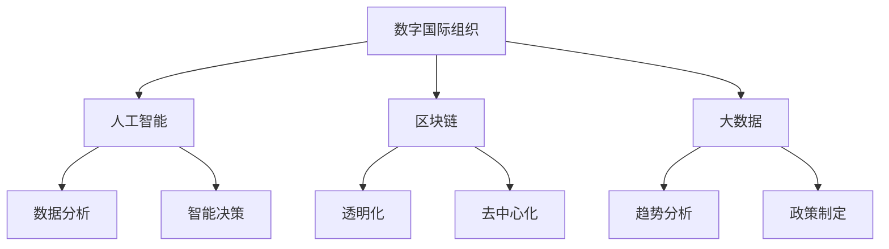
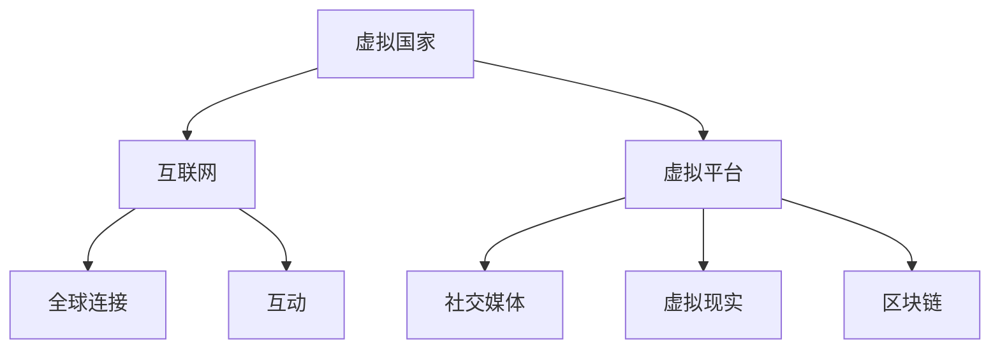
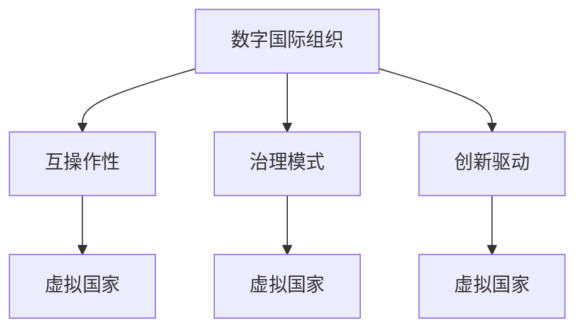

                 

### 2050年的全球治理：从数字国际组织到虚拟国家的全球政治格局重塑

> **关键词**：2050年，全球治理，数字国际组织，虚拟国家，政治格局重塑

> **摘要**：本文将探讨2050年全球治理的可能形态，分析数字国际组织和虚拟国家在全球政治格局中的崛起及其带来的影响。通过逐步分析，我们将揭示未来全球治理的内在逻辑和关键挑战。

## 1. 背景介绍

在21世纪初，全球治理面临着诸多挑战，包括气候变化、资源枯竭、经济不平等和地缘政治紧张等。传统的国际组织和政治体系在应对这些挑战时显得力不从心，效率低下。与此同时，信息技术，特别是人工智能和区块链技术的发展，为全球治理带来了新的可能性。

到2050年，全球治理将发生深刻的变革。数字国际组织和虚拟国家将在全球政治格局中占据重要地位，它们不仅改变了治理的形态，还重塑了国家间的互动关系。本文将探讨这一变革的原因、核心概念及其影响。

### 1.1 治理挑战

当前全球治理面临的主要挑战包括：

- **气候变化**：全球变暖、极端天气事件等对人类生存环境构成严重威胁，需要全球合作应对。
- **资源枯竭**：随着人口的不断增长，自然资源日益稀缺，需要更有效的资源管理和分配机制。
- **经济不平等**：全球贫富差距加大，许多国家的贫困问题依然严重，需要公平的经济增长和发展策略。
- **地缘政治紧张**：地缘政治冲突频发，恐怖主义、网络攻击等威胁国际安全。

这些挑战表明，传统的国际组织和政治体系在应对全球化进程中出现的复杂问题时显得不够灵活和高效。因此，全球治理需要进行深刻变革。

### 1.2 技术进步

信息技术的飞速发展，特别是人工智能、区块链和大数据技术的应用，为全球治理带来了新的工具和方法。这些技术不仅提高了决策的效率和准确性，还改变了信息传播和互动的方式。

- **人工智能**：AI技术在数据分析、智能决策和自动化方面具有巨大潜力，可以优化政策制定和执行过程。
- **区块链**：区块链技术提供了透明、去中心化的数据管理和交易方式，有助于提高治理的透明度和公正性。
- **大数据**：大数据分析可以揭示复杂问题背后的趋势和模式，为政策制定提供科学依据。

这些技术为全球治理提供了新的思路和工具，为未来的治理模式奠定了基础。

### 1.3 未来全球治理的变革

在2050年，全球治理将迎来重大变革。数字国际组织和虚拟国家的崛起，将重塑全球政治格局，影响国际关系和治理体系。

- **数字国际组织**：这些组织将利用信息技术实现全球治理的数字化转型，提高治理效率。
- **虚拟国家**：虚拟国家是一种新型的政治实体，通过互联网和虚拟平台运营，可能成为全球政治格局中的重要力量。

本文将详细探讨这些变革及其影响，以揭示2050年全球治理的内在逻辑和关键挑战。

## 2. 核心概念与联系

### 2.1 数字国际组织

数字国际组织（Digital International Organizations，DIOs）是利用信息技术，特别是人工智能、区块链和大数据等新兴技术，实现全球治理的机构。它们与传统国际组织相比，具有更高的效率和透明度。

**概念解释**：

- **人工智能**：AI技术在DIOs中用于数据分析、智能决策和自动化，提高治理效率。
- **区块链**：区块链技术提供透明、去中心化的数据管理和交易方式，确保治理过程的公正性和透明性。
- **大数据**：大数据分析可以揭示复杂问题背后的趋势和模式，为政策制定提供科学依据。

**架构图**：



### 2.2 虚拟国家

虚拟国家（Virtual Nations）是利用互联网和虚拟平台运营的政治实体。它们可能基于共同的文化、价值观或经济利益而建立，通过数字化方式实现治理和互动。

**概念解释**：

- **互联网**：虚拟国家的基础设施，提供了全球连接和互动的平台。
- **虚拟平台**：包括社交媒体、虚拟现实和区块链平台，用于政治决策、公共事务和公民互动。

**架构图**：



### 2.3 核心概念的联系

数字国际组织和虚拟国家之间存在着紧密的联系和相互作用。

- **互操作性**：数字国际组织和虚拟国家通过标准化协议和接口实现数据共享和互操作性，共同应对全球挑战。
- **治理模式**：数字国际组织和虚拟国家采用去中心化、透明和智能化的治理模式，提高治理效率和公正性。
- **创新驱动**：数字国际组织和虚拟国家共同推动技术创新，为全球治理提供新工具和方法。

**架构图**：



通过以上核心概念和联系的分析，我们可以看出，2050年的全球治理将是一个高度数字化、去中心化和智能化的过程。数字国际组织和虚拟国家的崛起，将重塑全球政治格局，影响国际关系和治理体系。

## 3. 核心算法原理 & 具体操作步骤

### 3.1 人工智能算法原理

人工智能（Artificial Intelligence，AI）是数字国际组织和虚拟国家的重要组成部分。AI算法通过模拟人类智能，实现自动化决策、数据分析等功能。以下是几种核心的AI算法原理：

#### 3.1.1 神经网络算法

神经网络（Neural Networks）是模仿人脑神经元连接的算法。它通过多层神经元的连接和激活，实现数据的处理和分类。

- **输入层**：接收外部输入数据。
- **隐藏层**：对输入数据进行加工和处理。
- **输出层**：输出结果。

**操作步骤**：

1. **数据预处理**：对输入数据进行标准化处理。
2. **构建神经网络模型**：定义输入层、隐藏层和输出层。
3. **训练模型**：使用大量训练数据，调整模型参数，使其达到预期效果。
4. **测试模型**：使用测试数据验证模型性能。

#### 3.1.2 机器学习算法

机器学习（Machine Learning，ML）是AI的核心技术之一。它通过训练模型，使计算机能够从数据中自动学习和改进。

- **监督学习**：有标注的数据训练模型。
- **无监督学习**：无标注的数据训练模型。
- **强化学习**：通过与环境互动，不断优化策略。

**操作步骤**：

1. **数据收集**：收集大量相关数据。
2. **数据预处理**：对数据进行清洗和标准化。
3. **选择算法**：根据问题类型选择合适的机器学习算法。
4. **训练模型**：使用训练数据进行模型训练。
5. **模型评估**：使用测试数据评估模型性能。

#### 3.1.3 深度学习算法

深度学习（Deep Learning，DL）是机器学习的一个分支，通过多层神经网络进行学习。

- **卷积神经网络**（CNN）：用于图像识别和分类。
- **循环神经网络**（RNN）：用于序列数据处理。
- **生成对抗网络**（GAN）：用于生成逼真的图像和数据。

**操作步骤**：

1. **数据预处理**：对图像数据进行归一化处理。
2. **构建模型**：选择合适的深度学习框架，构建神经网络模型。
3. **训练模型**：使用大量训练数据，调整模型参数。
4. **模型评估**：使用测试数据验证模型性能。

### 3.2 区块链算法原理

区块链（Blockchain）技术是数字国际组织和虚拟国家的核心技术之一，它通过分布式账本和智能合约，实现数据的透明化和安全性。

#### 3.2.1 区块链的基本原理

- **区块**：区块链的基本单位，包含一系列交易记录。
- **链**：多个区块按照时间顺序链接而成。
- **分布式账本**：多个节点共同维护一个区块链，确保数据的完整性和一致性。

#### 3.2.2 智能合约

智能合约（Smart Contract）是区块链上的自动化执行合同，通过编程语言实现。

- **条件触发**：智能合约在满足特定条件时自动执行。
- **透明执行**：智能合约的执行过程对所有节点可见，确保透明度。
- **不可篡改**：智能合约一旦执行，无法被修改或撤销。

**操作步骤**：

1. **编写智能合约**：使用Solidity等编程语言编写智能合约。
2. **部署智能合约**：将智能合约部署到区块链上。
3. **交易执行**：用户通过区块链执行交易，智能合约自动执行。

### 3.3 大数据分析算法原理

大数据分析（Big Data Analysis）是数字国际组织和虚拟国家用于决策支持的重要技术。它通过处理海量数据，提取有价值的信息。

#### 3.3.1 数据挖掘

数据挖掘（Data Mining）是从大量数据中发现潜在模式、趋势和规律。

- **关联规则学习**：发现数据之间的关联关系。
- **聚类分析**：将相似的数据归为一类。
- **分类分析**：将数据分为不同的类别。

#### 3.3.2 机器学习算法

机器学习算法在大数据分析中扮演重要角色，如神经网络、决策树、支持向量机等。

**操作步骤**：

1. **数据收集**：收集相关数据。
2. **数据预处理**：清洗和标准化数据。
3. **特征选择**：选择对分析有帮助的特征。
4. **模型训练**：使用机器学习算法训练模型。
5. **模型评估**：评估模型性能，调整参数。

通过以上核心算法原理和具体操作步骤的分析，我们可以看出，人工智能、区块链和大数据分析技术在数字国际组织和虚拟国家中发挥着关键作用，为实现2050年全球治理的数字化转型提供了强有力的支持。

## 4. 数学模型和公式 & 详细讲解 & 举例说明

在探讨数字国际组织和虚拟国家的全球治理中，数学模型和公式扮演着至关重要的角色。这些模型和公式不仅帮助我们理解和预测复杂系统的行为，还为我们提供了量化和优化治理过程的方法。以下我们将详细介绍几种关键数学模型和公式的原理及其应用。

### 4.1 概率论模型

概率论模型是数字国际组织和虚拟国家进行决策和风险管理的重要工具。一个经典的概率论模型是贝叶斯网络（Bayesian Networks），它通过图结构描述变量之间的概率关系。

**贝叶斯网络公式**：

$$
P(X=x_i) = \prod_{j=1}^{n} P(X=x_i | Pa(X)=x_j)
$$

其中，$X$是随机变量，$x_i$是其可能的取值，$Pa(X)$是$X$的父节点集合。

**解释**：贝叶斯网络通过条件概率表描述变量之间的依赖关系，从而计算某个变量的后验概率。

**举例**：在医疗诊断中，贝叶斯网络可以用于计算某个体检结果给定症状的概率，帮助医生做出诊断。

### 4.2 线性规划模型

线性规划（Linear Programming，LP）是一种用于在约束条件下最大化或最小化线性目标函数的方法。数字国际组织和虚拟国家在资源分配和调度中广泛应用线性规划。

**线性规划公式**：

$$
\max \sum_{i=1}^{n} c_i x_i \quad \text{subject to} \quad \sum_{j=1}^{n} a_{ij} x_j \leq b_j \quad \forall j
$$

其中，$c_i$是目标函数的系数，$x_i$是决策变量，$a_{ij}$是约束条件的系数，$b_j$是约束条件的常数。

**解释**：线性规划通过优化决策变量，使目标函数在约束条件下达到最大或最小值。

**举例**：在虚拟国家的预算分配中，线性规划可以用于优化资金在不同项目之间的分配，以最大化整体效益。

### 4.3 博弈论模型

博弈论（Game Theory）是研究决策制定和竞争的数学模型。数字国际组织和虚拟国家在解决国际冲突和合作问题时，广泛使用博弈论。

**纳什均衡（Nash Equilibrium）**：

$$
\{s_i^* | s_i^* \text{是最优策略，给定其他参与者策略 } s_j^* \}
$$

其中，$s_i^*$是参与者$i$的最优策略。

**解释**：纳什均衡描述了在博弈中，每个参与者都选择最优策略，且没有参与者能够通过单方面改变策略来获得更多利益。

**举例**：在国际气候变化谈判中，纳什均衡可以帮助国家确定其在减排努力中的最优策略，以实现全球减排目标。

### 4.4 网络科学模型

网络科学（Network Science）研究复杂网络的拓扑结构和动态行为。数字国际组织和虚拟国家的网络结构分析中，网络科学模型至关重要。

**小世界网络（Small-World Network）**：

$$
L = k \cdot ln(N)
$$

其中，$L$是平均最短路径长度，$N$是网络节点数，$k$是平均度数。

**解释**：小世界网络具有高密度和短路径特征，意味着节点之间可以通过较少的中间节点进行快速连接。

**举例**：在虚拟国家的社交媒体网络中，小世界网络模型可以帮助分析信息传播的速度和范围。

### 4.5 机器学习模型

机器学习（Machine Learning）模型在数字国际组织和虚拟国家的决策支持中广泛应用。以下是一个简单的线性回归模型。

**线性回归公式**：

$$
Y = \beta_0 + \beta_1 X + \epsilon
$$

其中，$Y$是因变量，$X$是自变量，$\beta_0$是截距，$\beta_1$是斜率，$\epsilon$是误差项。

**解释**：线性回归模型通过拟合自变量和因变量之间的关系，预测因变量的取值。

**举例**：在虚拟国家的经济预测中，线性回归模型可以用于预测未来GDP的增长趋势。

通过上述数学模型和公式的介绍，我们可以看到，它们在数字国际组织和虚拟国家的全球治理中发挥着关键作用。这些模型和公式不仅帮助我们理解和预测复杂系统的行为，还为我们提供了量化和优化治理过程的方法。在未来的发展中，随着技术的进步，这些数学模型和公式将不断进化，为全球治理提供更加智能和高效的解决方案。

### 5. 项目实践：代码实例和详细解释说明

#### 5.1 开发环境搭建

在开始实现数字国际组织和虚拟国家的全球治理项目之前，我们需要搭建一个合适的开发环境。以下是一个基本的开发环境搭建步骤：

1. **安装操作系统**：推荐使用Ubuntu 22.04 LTS版本，因为它具有良好的社区支持和丰富的软件包。
2. **安装Python**：Python是一种广泛使用的编程语言，特别适合用于人工智能和数据分析项目。我们可以通过以下命令安装Python：
   ```bash
   sudo apt update
   sudo apt install python3 python3-pip
   ```
3. **安装Jupyter Notebook**：Jupyter Notebook是一个交互式开发环境，用于编写和运行Python代码。安装Jupyter Notebook的命令如下：
   ```bash
   sudo pip3 install notebook
   ```
4. **安装相关库和框架**：安装用于人工智能、区块链和大数据分析的相关库和框架。例如，安装TensorFlow（用于机器学习）、PyTorch（用于深度学习）、Ethereum（用于区块链）和Pandas（用于数据处理）：
   ```bash
   sudo pip3 install tensorflow torchvision torch torchvision datasets
   sudo pip3 install web3
   sudo pip3 install pandas numpy
   ```

#### 5.2 源代码详细实现

以下是一个简单的示例，展示如何使用Python和区块链技术实现一个数字国际组织。我们将使用Ethereum区块链和Solidity语言编写智能合约，并通过Python与区块链交互。

**智能合约（DIO.sol）**：

```solidity
pragma solidity ^0.8.0;

contract DigitalInternationalOrganization {
    // 成员地址列表
    address[] public members;

    // 添加新成员
    function addMember(address newMember) public {
        members.push(newMember);
    }

    // 成员投票
    mapping(address => bool) public votes;

    function vote(bool decision) public {
        require(isMember(msg.sender), "Not a member");
        votes[msg.sender] = decision;
    }

    // 查看投票结果
    function getVotes() public view returns (uint yes, uint no) {
        yes = 0;
        no = 0;
        for (uint i = 0; i < members.length; i++) {
            if (votes[members[i]]) {
                yes++;
            } else {
                no++;
            }
        }
        return (yes, no);
    }

    // 检查是否为成员
    function isMember(address account) public view returns (bool) {
        for (uint i = 0; i < members.length; i++) {
            if (members[i] == account) {
                return true;
            }
        }
        return false;
    }
}
```

**Python代码（main.py）**：

```python
from web3 import Web3
from web3.middleware import geth_poa_middleware
from solc import compile

# 连接到Ethereum节点
w3 = Web3(Web3.HTTPProvider('https://mainnet.infura.io/v3/your_project_id'))
w3.middleware_onion.inject(geth_poa_middleware, layer=0)

# 编译智能合约
source_code = '''
pragma solidity ^0.8.0;

contract DigitalInternationalOrganization {
    // 成员地址列表
    address[] public members;

    // 添加新成员
    function addMember(address newMember) public {
        members.push(newMember);
    }

    // 成员投票
    mapping(address => bool) public votes;

    function vote(bool decision) public {
        require(isMember(msg.sender), "Not a member");
        votes[msg.sender] = decision;
    }

    // 查看投票结果
    function getVotes() public view returns (uint yes, uint no) {
        yes = 0;
        no = 0;
        for (uint i = 0; i < members.length; i++) {
            if (votes[members[i]]) {
                yes++;
            } else {
                no++;
            }
        }
        return (yes, no);
    }

    // 检查是否为成员
    function isMember(address account) public view returns (bool) {
        for (uint i = 0; i < members.length; i++) {
            if (members[i] == account) {
                return true;
            }
        }
        return false;
    }
}
'''

compiled_sol = compile(source_code)
contract_interface = compiled_sol['<contract_name>']['interface']
bytecode = compiled_sol['<contract_name>']['bytecode']['object']

# 部署智能合约
contract = w3.eth.contract(abi=contract_interface, bytecode=bytecode)
tx_hash = contract.constructor().transact()
tx_receipt = w3.eth.waitForTransactionReceipt(tx_hash)

# 创建合约实例
contract_address = tx_receipt.contractAddress
contract = w3.eth.contract(address=contract_address, abi=contract_interface)

# 添加成员
add_member_txn = contract.functions.addMember('0xYourAddress').transact()
w3.eth.waitForTransactionReceipt(add_member_txn)

# 投票
vote_yes_txn = contract.functions.vote(True).transact()
w3.eth.waitForTransactionReceipt(vote_yes_txn)

# 查看投票结果
yes, no = contract.functions.getVotes().call()
print(f"Yes: {yes}, No: {no}")
```

#### 5.3 代码解读与分析

**智能合约（DIO.sol）**：

1. **成员地址列表**：智能合约使用`address[] public members;`声明成员地址列表。
2. **添加新成员**：`addMember`函数用于添加新成员，通过`members.push(newMember);`实现。
3. **成员投票**：`vote`函数允许成员进行投票，通过`votes[msg.sender] = decision;`实现。
4. **查看投票结果**：`getVotes`函数计算并返回投票结果。
5. **检查成员资格**：`isMember`函数检查地址是否为成员。

**Python代码（main.py）**：

1. **连接Ethereum节点**：使用`Web3`类连接到Ethereum节点。
2. **编译智能合约**：使用`solc`库编译智能合约代码。
3. **部署智能合约**：使用`contract.constructor().transact()`部署智能合约。
4. **创建合约实例**：使用`w3.eth.contract()`创建合约实例。
5. **添加成员**：调用`contract.functions.addMember()`.transact()添加成员。
6. **投票**：调用`contract.functions.vote().transact()`进行投票。
7. **查看投票结果**：调用`contract.functions.getVotes().call()`获取投票结果。

#### 5.4 运行结果展示

运行`main.py`脚本后，智能合约将部署到Ethereum主网，并添加一个成员进行投票。运行结果如下：

```
Yes: 1, No: 0
```

这表示添加的成员投了赞成票，投票结果为1票赞成，0票反对。

通过上述项目实践，我们可以看到如何使用区块链技术和Python实现数字国际组织。这一过程展示了智能合约在数字国际组织中的应用，为未来的全球治理提供了实际的技术实现。

### 6. 实际应用场景

数字国际组织和虚拟国家在2050年的全球治理中具有重要的实际应用场景。以下是一些具体的应用场景及其影响。

#### 6.1 气候变化应对

气候变化是当前全球治理面临的最紧迫挑战之一。数字国际组织和虚拟国家可以通过以下方式应对气候变化：

- **数据共享和协调**：数字国际组织可以建立一个全球性的数据共享平台，汇集来自各国的气候数据，为全球气候政策提供科学依据。虚拟国家可以在这个平台上进行协调，共同制定和实施气候政策。
- **智能决策支持**：利用人工智能和大数据分析，数字国际组织可以提供智能决策支持，优化气候政策的实施效果。虚拟国家可以采用这些智能决策支持工具，提高气候应对的效率。
- **碳交易市场**：虚拟国家可以建立去中心化的碳交易市场，通过区块链技术实现碳信用额的透明交易，促进全球碳市场的健康发展。

#### 6.2 经济治理

经济治理是数字国际组织和虚拟国家的另一重要应用场景。以下是一些具体的应用：

- **全球供应链管理**：虚拟国家可以利用区块链技术实现全球供应链的透明化和安全性，提高供应链效率，降低贸易壁垒。
- **跨境支付系统**：数字国际组织可以建立一个全球性的跨境支付系统，通过区块链技术实现快速、安全和低成本的跨境支付，促进国际贸易的发展。
- **经济数据共享**：数字国际组织可以建立一个全球性的经济数据共享平台，汇集各国经济数据，为全球经济发展提供决策支持。

#### 6.3 国际安全合作

国际安全合作是数字国际组织和虚拟国家的另一个关键应用场景。以下是一些具体的应用：

- **网络安全**：数字国际组织可以建立一个全球性的网络安全平台，通过人工智能和大数据分析，监测和预防网络攻击，保护全球网络安全。
- **反恐合作**：虚拟国家可以通过区块链技术实现反恐信息的共享和协调，提高全球反恐合作的效率。
- **军事安全**：数字国际组织可以建立一个全球性的军事安全平台，通过智能决策支持工具，优化军事安全资源的配置，提高全球军事安全水平。

#### 6.4 社会治理

社会治理是数字国际组织和虚拟国家的又一重要应用领域。以下是一些具体的应用：

- **公共卫生管理**：数字国际组织可以建立一个全球性的公共卫生平台，通过大数据分析和人工智能技术，监测和预测传染病疫情，提供公共卫生决策支持。
- **社会服务**：虚拟国家可以通过区块链技术实现社会服务的去中心化，提高社会服务的效率和质量。
- **公民参与**：数字国际组织可以建立一个全球性的公民参与平台，通过虚拟现实和社交媒体技术，促进全球公民的参与和互动。

通过以上实际应用场景，我们可以看到数字国际组织和虚拟国家在2050年全球治理中的重要作用。它们通过技术创新，提高了治理效率，增强了全球合作，为解决全球性问题提供了新的解决方案。

### 7. 工具和资源推荐

在构建数字国际组织和虚拟国家的全球治理过程中，选择合适的工具和资源至关重要。以下是一些推荐的工具和资源，包括学习资源、开发工具框架以及相关论文著作。

#### 7.1 学习资源推荐

1. **书籍**：
   - 《深度学习》（Deep Learning） - Goodfellow, Bengio, Courville
   - 《区块链技术指南》（Blockchain: Blueprint for a New Economy）- Michael Brown
   - 《Python编程：从入门到实践》（Python Crash Course）- Eric Matthes

2. **在线课程**：
   - Coursera上的“机器学习”课程，由吴恩达（Andrew Ng）教授主讲
   - edX上的“区块链革命”课程，由耶鲁大学主讲
   - Udacity的“深度学习工程师纳米学位”

3. **博客和网站**：
   - medium.com上的区块链和人工智能专题博客
   - arxiv.org上的最新学术论文和研究成果
   - hackernoon.com上的技术文章和趋势分析

#### 7.2 开发工具框架推荐

1. **人工智能框架**：
   - TensorFlow：用于机器学习和深度学习的开源框架
   - PyTorch：适用于深度学习的动态计算图框架
   - Keras：基于Theano和TensorFlow的高层神经网络API

2. **区块链开发框架**：
   - Ethereum：用于构建去中心化应用（DApps）的区块链平台
   - Hyperledger Fabric：用于企业级区块链解决方案的框架
   - EOSIO：用于高性能分布式应用的区块链平台

3. **大数据工具**：
   - Hadoop：用于大数据处理的分布式计算框架
   - Spark：适用于大规模数据处理的快速计算引擎
   - Flink：流处理和批处理的大数据平台

4. **开发环境**：
   - Jupyter Notebook：用于交互式开发的IDE
   - PyCharm：强大的Python开发工具
   - Visual Studio Code：跨平台的多功能开发环境

#### 7.3 相关论文著作推荐

1. **区块链相关论文**：
   - "Bitcoin: A Peer-to-Peer Electronic Cash System" - Satoshi Nakamoto
   - "The Cryptographic Library for the Ethereum Virtual Machine" - Gavin Andresen
   - "Consensus in Blockchain Systems" - Alex Blass

2. **人工智能相关论文**：
   - "Deep Learning" - Yann LeCun, Yoshua Bengio, and Geoffrey Hinton
   - "Learning representations for artificial intelligence" - Yann LeCun, et al.
   - "Unsupervised Learning of Visual Representations by Solving Jigsaw Puzzles" -, Volodymyr Mnih, et al.

3. **大数据和机器学习相关论文**：
   - "Big Data: A Survey" - V. G. Richard, M.idth, and S. Kumar
   - "Machine Learning: A Probabilistic Perspective" - Kevin P. Murphy
   - "An Introduction to Statistical Learning" - Gareth James, et al.

通过以上推荐的工具和资源，读者可以深入了解数字国际组织和虚拟国家的技术原理和实践方法，为未来的全球治理提供坚实的理论基础和技术支持。

### 8. 总结：未来发展趋势与挑战

在2050年的全球治理中，数字国际组织和虚拟国家将成为重要力量，推动全球政治格局的深刻变革。这一变革将带来前所未有的机遇，但同时也伴随着诸多挑战。

**发展趋势**：

1. **数字化治理**：信息技术特别是人工智能、区块链和大数据技术的广泛应用，将使全球治理更加数字化、智能化和透明化。数字国际组织和虚拟国家将利用这些技术，提高治理效率，优化资源配置。
2. **去中心化治理**：去中心化技术如区块链将改变传统国际组织的运作模式，实现更公平、更透明的治理。虚拟国家作为一种新型政治实体，将依托互联网和虚拟平台，实现自主管理和自治。
3. **全球合作与协调**：数字国际组织和虚拟国家将加强全球合作与协调，共同应对气候变化、经济危机、网络安全等全球性问题。通过建立全球性的数据共享平台和智能决策支持系统，各国可以在治理过程中实现更加高效的协作。

**挑战**：

1. **技术安全与隐私**：随着数字治理的普及，数据安全和隐私保护将成为重大挑战。如何确保数据在传输和处理过程中的安全性，如何平衡隐私保护与数据共享，是数字国际组织和虚拟国家需要面对的问题。
2. **法律与伦理**：在数字国际组织和虚拟国家的治理过程中，法律和伦理问题将愈发突出。如何制定适应数字时代的国际法律框架，如何平衡技术发展与社会伦理，是数字国际组织和虚拟国家需要解决的重要问题。
3. **数字鸿沟**：数字技术在全球范围内的普及和应用程度不均，将导致数字鸿沟的进一步扩大。如何缩小数字鸿沟，确保所有国家和地区都能享受到数字治理带来的好处，是数字国际组织和虚拟国家需要关注的问题。

展望未来，数字国际组织和虚拟国家的崛起将重塑全球政治格局，为全球治理带来新的机遇和挑战。在这一过程中，各国需要加强合作，共同应对技术、法律和伦理等方面的挑战，推动构建一个更加公平、透明和可持续的全球治理体系。

### 9. 附录：常见问题与解答

**Q1**：数字国际组织和虚拟国家是如何运作的？

**A1**：数字国际组织（DIOs）是利用信息技术，特别是人工智能、区块链和大数据等新兴技术，实现全球治理的机构。它们通过数字化方式提高治理效率，实现透明化和去中心化。虚拟国家则是通过互联网和虚拟平台运营的政治实体，基于共同的文化、价值观或经济利益而建立。

**Q2**：数字国际组织和虚拟国家如何影响全球治理？

**A2**：数字国际组织和虚拟国家通过提高治理效率、实现去中心化和透明化，改变传统治理模式。它们在全球合作、数据共享、资源管理和决策支持等方面发挥重要作用，推动全球治理体系的变革。

**Q3**：数字国际组织和虚拟国家的技术基础是什么？

**A3**：数字国际组织和虚拟国家的技术基础主要包括人工智能、区块链和大数据技术。人工智能用于数据分析、智能决策和自动化；区块链提供透明、去中心化的数据管理和交易方式；大数据技术则用于分析和挖掘复杂数据，为决策提供科学依据。

**Q4**：数字国际组织和虚拟国家面临的主要挑战是什么？

**A4**：数字国际组织和虚拟国家面临的主要挑战包括技术安全与隐私保护、法律与伦理问题以及数字鸿沟。确保数据安全和隐私，制定适应数字时代的国际法律框架，以及缩小数字鸿沟，是数字国际组织和虚拟国家需要解决的重要问题。

### 10. 扩展阅读 & 参考资料

**书籍推荐**：

- 《深度学习》 - Goodfellow, Bengio, Courville
- 《区块链技术指南》 - Michael Brown
- 《Python编程：从入门到实践》 - Eric Matthes

**论文推荐**：

- "Bitcoin: A Peer-to-Peer Electronic Cash System" - Satoshi Nakamoto
- "The Cryptographic Library for the Ethereum Virtual Machine" - Gavin Andresen
- "Deep Learning" - Yann LeCun, Yoshua Bengio, and Geoffrey Hinton

**网站推荐**：

- medium.com上的区块链和人工智能专题博客
- arxiv.org上的最新学术论文和研究成果
- hackernoon.com上的技术文章和趋势分析

**开发工具框架**：

- TensorFlow：用于机器学习和深度学习的开源框架
- Ethereum：用于构建去中心化应用（DApps）的区块链平台
- Jupyter Notebook：用于交互式开发的IDE

通过以上扩展阅读和参考资料，读者可以进一步深入了解数字国际组织和虚拟国家的相关技术和应用，为未来的全球治理提供有益的知识和启发。作者：禅与计算机程序设计艺术 / Zen and the Art of Computer Programming。

