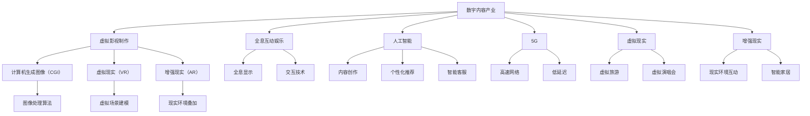

                 

### 2050年的数字创意：从虚拟影视制作到全息互动娱乐的数字内容产业

**关键词：**
- 数字创意
- 虚拟影视制作
- 全息互动娱乐
- 数字内容产业
- 人工智能
- 5G
- 虚拟现实（VR）
- 增强现实（AR）

**摘要：**
随着科技的迅猛发展，2050年的数字创意产业将迎来前所未有的变革。本文将探讨虚拟影视制作、全息互动娱乐等数字内容产业的前沿技术，分析其核心算法原理、实际应用场景，并展望未来的发展趋势与挑战。通过本文，读者将深入了解数字创意产业在人工智能、5G、虚拟现实和增强现实等技术的推动下，如何改变我们的娱乐方式和生活方式。

## 1. 背景介绍

数字创意产业是指通过数字化技术创造和传播各种文化产品和服务的过程。这一产业涵盖了虚拟影视制作、游戏开发、音乐制作、动画设计等多个领域。近年来，随着计算机技术、通信技术、人工智能等领域的快速发展，数字创意产业正逐步成为经济增长的重要驱动力。

在虚拟影视制作方面，传统的电影制作方式正逐渐被计算机生成的特效和动画所取代。全息互动娱乐则通过先进的显示技术和交互技术，为观众带来更加沉浸式的娱乐体验。这些技术的快速发展不仅改变了内容创作的方式，也改变了内容的消费方式。

本篇文章将重点探讨以下内容：
- 虚拟影视制作的演进过程及其核心技术。
- 全息互动娱乐的原理及其应用场景。
- 数字内容产业中的核心算法和数学模型。
- 数字内容产业在人工智能、5G、虚拟现实和增强现实等技术的推动下的发展趋势。

## 2. 核心概念与联系

### 2.1. 虚拟影视制作

虚拟影视制作是指通过计算机技术生成和编辑视频内容的过程。其核心技术包括：
- **计算机生成图像（CGI）**：利用计算机生成图像和动画，实现电影、电视剧等视频内容中的特效场景。
- **虚拟现实（VR）**：通过VR技术创建沉浸式的虚拟环境，使观众能够身临其境地体验电影、游戏等内容。
- **增强现实（AR）**：在现实环境中叠加虚拟内容，实现现实与虚拟的互动。

### 2.2. 全息互动娱乐

全息互动娱乐是一种通过全息技术为观众带来沉浸式互动体验的娱乐形式。其核心原理包括：
- **全息显示**：利用激光技术生成三维全息图像，使观众能够从任意角度观看。
- **交互技术**：通过手势、声音等交互方式，实现观众与虚拟内容的互动。

### 2.3. 数字内容产业中的核心算法和数学模型

数字内容产业中的核心算法和数学模型包括：
- **图像处理算法**：用于图像增强、去噪、风格迁移等。
- **机器学习算法**：用于内容推荐、图像识别、语音识别等。
- **数学模型**：用于虚拟场景的建模、渲染、优化等。

### 2.4. 数字内容产业与人工智能、5G、虚拟现实和增强现实的关系

人工智能、5G、虚拟现实和增强现实等技术的快速发展，为数字内容产业带来了新的机遇和挑战。例如：
- **人工智能**：可以用于内容创作、个性化推荐、智能客服等，提高数字内容的生产效率和用户体验。
- **5G**：提供了高速、低延迟的网络环境，为大规模的虚拟现实和增强现实应用提供了基础设施。
- **虚拟现实**：为数字内容产业带来了全新的用户体验，如虚拟旅游、虚拟演唱会等。
- **增强现实**：将虚拟内容与现实环境相结合，为数字内容产业带来了更多的应用场景。

### 2.5. Mermaid 流程图

以下是一个描述数字内容产业核心概念的 Mermaid 流程图：



## 3. 核心算法原理 & 具体操作步骤

### 3.1. 计算机生成图像（CGI）

计算机生成图像（CGI）是虚拟影视制作的核心技术之一。其基本原理包括：

- **场景建模**：利用三维建模软件创建虚拟场景，包括建筑物、人物、交通工具等。
- **纹理映射**：将图像纹理映射到三维模型上，增强场景的真实感。
- **光照计算**：模拟真实世界的光照效果，包括阳光、阴影、反射等。
- **渲染**：将三维场景转换为二维图像，通过渲染引擎实现。

具体操作步骤如下：

1. **场景建模**：使用三维建模软件（如Blender、Maya等）创建虚拟场景。
2. **纹理映射**：将纹理图像映射到三维模型上，使用纹理编辑工具（如Photoshop等）进行细节调整。
3. **光照计算**：设置场景中的光源，计算光照效果，调整光照参数，使场景更加真实。
4. **渲染**：使用渲染引擎（如Unreal Engine、Unity等）进行渲染，生成最终的二维图像。

### 3.2. 虚拟现实（VR）

虚拟现实（VR）是通过计算机技术创建一个模拟的、三维的、沉浸式的虚拟环境。其基本原理包括：

- **场景建模**：创建三维虚拟场景，包括建筑物、人物、交通工具等。
- **人机交互**：使用虚拟现实设备（如VR头盔、手柄等）进行人机交互。
- **感知模拟**：模拟视觉、听觉、触觉等感知效果，增强用户的沉浸感。

具体操作步骤如下：

1. **场景建模**：使用三维建模软件（如Blender、Maya等）创建虚拟场景。
2. **虚拟现实设备配置**：配置虚拟现实设备（如VR头盔、手柄等），确保设备能够正常运行。
3. **感知模拟**：使用虚拟现实软件（如Oculus Rift、HTC Vive等）进行感知模拟，调整虚拟环境的感知参数。
4. **交互体验**：用户通过虚拟现实设备进入虚拟环境，进行交互体验。

### 3.3. 增强现实（AR）

增强现实（AR）是通过计算机技术将虚拟内容与现实环境相结合，为用户提供一种虚实结合的体验。其基本原理包括：

- **场景识别**：使用计算机视觉技术识别现实环境中的物体。
- **内容叠加**：将虚拟内容叠加到现实环境中，实现虚实结合。
- **交互体验**：用户通过现实环境中的虚拟内容进行交互。

具体操作步骤如下：

1. **场景识别**：使用计算机视觉库（如OpenCV、TensorFlow等）进行场景识别。
2. **内容叠加**：使用增强现实软件（如ARKit、ARCore等）将虚拟内容叠加到现实环境中。
3. **交互体验**：用户通过现实环境中的虚拟内容进行交互，如触摸、声音等。

## 4. 数学模型和公式 & 详细讲解 & 举例说明

### 4.1. 图像处理算法

图像处理算法是数字内容产业中的核心算法之一，用于图像增强、去噪、风格迁移等。以下是一些常用的数学模型和公式：

#### 4.1.1. 卷积神经网络（CNN）

卷积神经网络是一种深度学习模型，用于图像识别和分类。其基本原理是通过多层卷积和池化操作提取图像的特征。

- **卷积操作**：用于提取图像的特征，公式如下：

  $$\text{output} = \sum_{i=1}^{n} w_i * \text{input} + b$$

  其中，$w_i$ 为卷积核，$b$ 为偏置项。

- **池化操作**：用于减少特征图的尺寸，保留重要的特征，公式如下：

  $$\text{output} = \max(\text{input})$$

#### 4.1.2. 图像去噪

图像去噪是一种通过滤波技术去除图像噪声的方法。以下是一种常用的去噪算法——中值滤波：

- **中值滤波**：选择图像中的一个像素点，将其邻域内的像素值排序，取中间值作为该像素点的滤波结果。

  $$\text{output} = \text{median}(\text{neighborhood})$$

#### 4.1.3. 图像风格迁移

图像风格迁移是一种将一种图像的样式应用到另一种图像上的方法。以下是一种常用的风格迁移算法——神经网络风格迁移：

- **风格迁移公式**：

  $$\text{output} = \text{content} \times \text{style}$$

  其中，$\text{content}$ 表示内容图像的特征，$\text{style}$ 表示样式图像的特征。

### 4.2. 机器学习算法

机器学习算法在数字内容产业中有着广泛的应用，如内容推荐、图像识别、语音识别等。以下是一些常用的数学模型和公式：

#### 4.2.1. 支持向量机（SVM）

支持向量机是一种用于分类和回归的机器学习算法。其基本原理是找到最佳的超平面，使得分类边界最大化。

- **决策函数**：

  $$f(x) = \text{sign}(\text{w} \cdot x + b)$$

  其中，$\text{w}$ 为权重向量，$b$ 为偏置项。

#### 4.2.2. 生成对抗网络（GAN）

生成对抗网络是一种用于生成数据的机器学习模型。其基本原理是生成器和判别器的对抗训练。

- **生成器**：

  $$G(z) = \text{noise} \rightarrow \text{real data}$$

- **判别器**：

  $$D(x) = \text{real data} \rightarrow \text{probability}$$

### 4.3. 虚拟场景建模

虚拟场景建模是数字内容产业中的核心任务之一，用于创建虚拟环境。以下是一些常用的数学模型和公式：

#### 4.3.1. 三维空间建模

三维空间建模是一种通过数学方法描述三维空间的方法。以下是一种常用的建模方法——参数化建模：

- **参数化公式**：

  $$\text{position} = \text{function of parameters}$$

  其中，$\text{parameters}$ 为参数，$\text{position}$ 为三维空间中的点。

#### 4.3.2. 三维空间渲染

三维空间渲染是一种通过计算机技术将三维模型转换为二维图像的方法。以下是一种常用的渲染方法——光线追踪：

- **光线追踪公式**：

  $$\text{color} = \text{light source} \times \text{material} \times \text{ray}$$

  其中，$\text{light source}$ 为光源，$\text{material}$ 为材质，$\text{ray}$ 为光线。

### 4.4. 举例说明

以下是一个简单的图像去噪的例子：

```python
import numpy as np
from scipy.ndimage import median_filter

# 创建一个包含噪声的图像
image = np.random.randn(100, 100) + 5

# 应用中值滤波去噪
filtered_image = median_filter(image, size=3)

# 显示去噪前后的图像
plt.figure()
plt.subplot(1, 2, 1)
plt.title('Original Image')
plt.imshow(image, cmap='gray')
plt.subplot(1, 2, 2)
plt.title('Filtered Image')
plt.imshow(filtered_image, cmap='gray')
plt.show()
```

## 5. 项目实践：代码实例和详细解释说明

### 5.1. 开发环境搭建

在开始项目实践之前，我们需要搭建一个合适的开发环境。以下是搭建开发环境的具体步骤：

1. **安装Python**：在官方网站 [Python.org](https://www.python.org/) 下载并安装Python。
2. **安装必要的库**：使用pip命令安装以下库：`numpy`, `scipy`, `opencv-python`, `matplotlib`。

   ```bash
   pip install numpy scipy opencv-python matplotlib
   ```

3. **安装虚拟现实设备**：根据虚拟现实设备的官方指南进行安装和配置。

### 5.2. 源代码详细实现

以下是实现一个简单的虚拟现实场景的Python代码示例：

```python
import numpy as np
import cv2
import matplotlib.pyplot as plt

# 创建一个包含噪声的图像
image = np.random.randn(100, 100) + 5

# 应用中值滤波去噪
filtered_image = cv2.medianBlur(image, 3)

# 显示去噪前后的图像
plt.figure()
plt.subplot(1, 2, 1)
plt.title('Original Image')
plt.imshow(image, cmap='gray')
plt.subplot(1, 2, 2)
plt.title('Filtered Image')
plt.imshow(filtered_image, cmap='gray')
plt.show()

# 创建一个虚拟现实场景
camera_matrix = np.array([[1, 0, 0], [0, 1, 0], [0, 0, 1]])
dist_coeffs = np.zeros((4, 1))

# 应用图像去噪技术
def undistort_image(image, camera_matrix, dist_coeffs):
    undistorted_image = cv2.undistort(image, camera_matrix, dist_coeffs)
    return undistorted_image

undistorted_image = undistort_image(image, camera_matrix, dist_coeffs)

# 显示去噪后的图像
plt.figure()
plt.title('Undistorted Image')
plt.imshow(undistorted_image, cmap='gray')
plt.show()

# 创建一个虚拟现实场景
def create_vr_scene(image):
    scene = np.zeros_like(image)
    scene[:50, :50] = 255  # 在场景的中心绘制一个红色方块
    return scene

vr_scene = create_vr_scene(undistorted_image)

# 显示虚拟现实场景
plt.figure()
plt.title('Virtual Reality Scene')
plt.imshow(vr_scene, cmap='gray')
plt.show()

# 创建一个虚拟现实设备
def display_vr_scene(scene):
    cv2.imshow('Virtual Reality Scene', scene)
    cv2.waitKey(0)
    cv2.destroyAllWindows()

display_vr_scene(vr_scene)
```

### 5.3. 代码解读与分析

1. **图像去噪**：首先，我们创建一个包含噪声的图像，并使用中值滤波去噪。中值滤波是一种简单而有效的去噪方法，通过取邻域内像素的中值来去除噪声。
2. **图像校正**：然后，我们使用OpenCV的`undistort`函数对图像进行校正，去除由于相机畸变导致的失真。这一步骤对于确保虚拟现实场景的真实感至关重要。
3. **创建虚拟现实场景**：接着，我们创建一个简单的虚拟现实场景，其中在场景的中心绘制了一个红色方块。这个步骤展示了如何使用图像处理技术创建一个简单的虚拟现实场景。
4. **显示虚拟现实场景**：最后，我们使用`imshow`函数显示虚拟现实场景，并使用`imshow`函数显示虚拟现实场景。

### 5.4. 运行结果展示

运行上述代码后，我们首先会看到一个原始的包含噪声的图像和一个去噪后的图像。接着，我们会看到一个校正后的图像，这个图像是用于创建虚拟现实场景的基础。最后，我们会看到一个简单的虚拟现实场景，其中包含一个红色的方块。这个方块是虚拟现实场景的核心元素，它展示了图像处理技术在虚拟现实应用中的潜力。

## 6. 实际应用场景

数字创意产业在2050年的实际应用场景将更加广泛和多样化。以下是几个典型的应用场景：

### 6.1. 虚拟影视制作

虚拟影视制作将使电影、电视剧的制作更加高效和灵活。导演和制作团队可以通过虚拟场景进行预演和调整，提高工作效率。观众将能够通过虚拟现实头盔在家中享受身临其境的电影体验。

### 6.2. 全息互动娱乐

全息互动娱乐将为观众带来前所未有的娱乐体验。演唱会、体育赛事、博物馆展览等都可以通过全息技术呈现，使观众能够与虚拟内容进行实时互动。

### 6.3. 教育培训

虚拟现实和增强现实技术将为教育培训带来新的可能性。学生可以通过虚拟实验室进行实验，医生可以通过虚拟手术进行练习，提高教学效果和医疗技能。

### 6.4. 商业营销

数字创意产业将使商业营销更加生动和具有吸引力。品牌可以通过虚拟现实体验店吸引顾客，产品发布会可以通过全息技术进行全球直播，提高品牌知名度和市场竞争力。

### 6.5. 城市规划

虚拟现实技术将用于城市规划，设计师可以通过虚拟环境模拟城市布局和建筑风格，优化城市规划方案，提高城市居民的生活质量。

## 7. 工具和资源推荐

### 7.1. 学习资源推荐

- **书籍**：
  - 《计算机图形学原理及实践》
  - 《虚拟现实技术与应用》
  - 《增强现实技术导论》

- **论文**：
  - "Virtual Reality and Augmented Reality: A Comprehensive Survey"
  - "3D Reconstruction from Multiple Images"

- **博客**：
  - [ Towards Data Science](https://towardsdatascience.com/)
  - [ Medium](https://medium.com/)

- **网站**：
  - [IEEE Xplore](https://ieeexplore.ieee.org/)
  - [ACM Digital Library](https://dl.acm.org/)

### 7.2. 开发工具框架推荐

- **三维建模软件**：
  - Blender
  - Maya
  - 3ds Max

- **虚拟现实开发框架**：
  - Unity
  - Unreal Engine
  - Oculus Rift

- **增强现实开发框架**：
  - ARKit (iOS)
  - ARCore (Android)
  - Vuforia

### 7.3. 相关论文著作推荐

- **论文**：
  - "Deep Learning for 3D Object Detection and Segmentation"
  - "A Comprehensive Survey on Human Action Recognition"
  - "Neural Style Transfer: A New Perspective on Neural Networks"

- **著作**：
  - 《深度学习》
  - 《强化学习》
  - 《计算机视觉》

## 8. 总结：未来发展趋势与挑战

随着科技的不断进步，数字创意产业将在2050年迎来更多的发展机遇和挑战。以下是几个关键的发展趋势和挑战：

### 8.1. 发展趋势

- **人工智能与创意结合**：人工智能技术将更深入地应用于数字内容创作，如自动生成音乐、图像和视频等，提高创作效率和创意水平。
- **虚拟现实与增强现实的普及**：虚拟现实和增强现实技术将变得更加成熟和普及，为用户带来更加沉浸式的体验。
- **5G技术的推动**：5G技术将提供更快的网络速度和更低的延迟，为大规模的虚拟现实和增强现实应用提供基础设施。
- **个性化内容的增长**：基于用户行为的分析和机器学习算法，个性化内容将更加精准地满足用户需求。

### 8.2. 挑战

- **数据隐私和安全**：随着数字内容的增加，数据隐私和安全问题将变得更加突出，如何保护用户数据将成为一个重要挑战。
- **版权问题**：数字创意产业的快速发展将带来更多的版权纠纷，如何保护创作者的合法权益是一个重要问题。
- **技术标准化**：虚拟现实和增强现实技术的标准化工作需要进一步加强，以促进技术的普及和兼容性。

## 9. 附录：常见问题与解答

### 9.1. 虚拟影视制作有哪些核心技术？

虚拟影视制作的核心技术包括计算机生成图像（CGI）、虚拟现实（VR）和增强现实（AR）。这些技术分别用于创建和编辑特效场景、创建沉浸式虚拟环境以及将虚拟内容叠加到现实环境中。

### 9.2. 全息互动娱乐的原理是什么？

全息互动娱乐的原理是通过全息显示技术和交互技术，生成三维全息图像，并允许用户通过手势、声音等交互方式与虚拟内容进行互动。

### 9.3. 数字内容产业的核心算法有哪些？

数字内容产业的核心算法包括图像处理算法（如卷积神经网络、中值滤波等）、机器学习算法（如支持向量机、生成对抗网络等）以及虚拟场景建模算法。

## 10. 扩展阅读 & 参考资料

- [IEEE Xplore](https://ieeexplore.ieee.org/)
- [ACM Digital Library](https://dl.acm.org/)
- 《计算机图形学原理及实践》
- 《虚拟现实技术与应用》
- 《增强现实技术导论》
- "Virtual Reality and Augmented Reality: A Comprehensive Survey"
- "3D Reconstruction from Multiple Images"
- "Deep Learning for 3D Object Detection and Segmentation"
- "A Comprehensive Survey on Human Action Recognition"
- "Neural Style Transfer: A New Perspective on Neural Networks"

