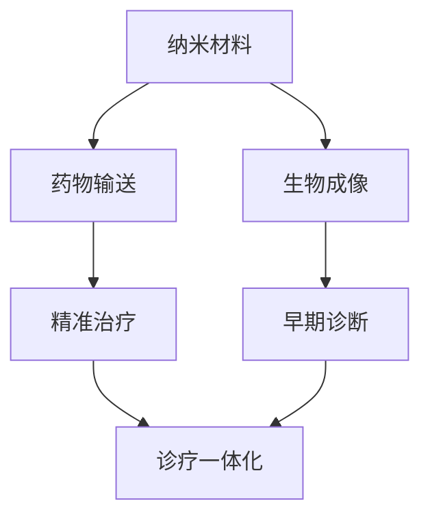

                 

### 2050年的纳米医学：从纳米机器人到纳米诊疗一体化的精准医疗

#### 关键词：纳米医学、纳米机器人、精准医疗、诊疗一体化、未来发展趋势

#### 摘要：
随着科技的发展，纳米医学正逐渐成为医疗领域的创新前沿。本文将探讨2050年纳米医学的潜在发展，重点关注纳米机器人在精准医疗和诊疗一体化中的作用。文章首先介绍了纳米医学的背景和核心概念，接着详细阐述了纳米机器人的设计原理和操作步骤，并展示了其数学模型和公式。随后，通过具体的项目实践展示了纳米医学的实际应用场景。最后，文章总结了未来纳米医学的发展趋势与挑战，并推荐了相关的学习资源和开发工具。

### 1. 背景介绍

纳米医学是一门新兴的交叉学科，它将纳米技术与生物医学相结合，旨在利用纳米材料的独特性质来开发诊断和治疗手段。在过去的几十年里，纳米技术取得了显著进展，使得纳米医学在生物成像、药物输送和治疗等领域取得了突破性成果。

纳米医学的核心在于纳米材料的应用。纳米材料具有高比表面积、独特的电子性质和良好的生物相容性，这些特性使其在医学领域具有广泛的应用前景。例如，纳米粒子可以用于药物输送，通过特定的纳米载体将药物精确地递送到病变部位，从而提高药物的疗效并减少副作用。

此外，纳米医学还在疾病诊断领域发挥了重要作用。纳米探针和标记物可以用于生物成像，帮助医生更准确地诊断疾病。例如，荧光纳米探针可以通过检测细胞内特定的生物分子来识别癌症细胞，从而实现早期诊断。

然而，纳米医学的发展还面临着诸多挑战，如纳米材料的生物安全性、长期疗效和大规模生产等。为了解决这些问题，科学家们正在积极探索新的纳米材料和设计方法，以期在未来的医疗领域中实现更大的突破。

### 2. 核心概念与联系

纳米医学的核心概念包括纳米材料、纳米机器人和诊疗一体化。以下是一个简化的Mermaid流程图，用于展示这些概念之间的关系：



在这个流程图中，纳米材料作为基础，通过药物输送和生物成像技术，实现精准治疗和早期诊断，最终实现诊疗一体化。

#### 2.1 纳米材料

纳米材料是纳米医学的基石。它们具有以下特性：

- **高比表面积**：纳米材料的表面积与体积之比非常大，这使它们能够更好地与生物分子相互作用。
- **独特的电子性质**：纳米材料如金纳米颗粒具有特定的电子性质，可以用于生物成像和传感。
- **良好的生物相容性**：纳米材料通常由生物相容性材料制成，使其能够在生物体内长时间存在而不会引起不良反应。

#### 2.2 纳米机器人

纳米机器人是纳米医学的前沿领域。它们是小型化、自动化、可编程的机器人，可以在生物体内执行特定的任务。纳米机器人的设计原理包括以下几个方面：

- **驱动机制**：纳米机器人通常使用光、热、电或磁等驱动机制。
- **控制系统**：纳米机器人需要通过外部或内部控制系统来执行特定的任务。
- **执行任务**：纳米机器人可以用于药物输送、细胞修复、基因编辑等。

#### 2.3 诊疗一体化

诊疗一体化是纳米医学的最终目标。它通过将诊断和治疗技术集成在一起，实现疾病的早期检测和精准治疗。诊疗一体化的关键在于：

- **实时监测**：通过纳米探针和传感器，实时监测患者的生理参数和病变情况。
- **精准治疗**：根据实时监测结果，纳米机器人可以精确地输送药物或进行其他治疗操作。

### 3. 核心算法原理 & 具体操作步骤

纳米医学的核心算法涉及多个方面，包括纳米机器人的设计、药物输送和生物成像等。以下是一个简化的算法原理和具体操作步骤：

#### 3.1 纳米机器人设计

- **材料选择**：选择具有良好生物相容性的材料，如金、硅等。
- **结构设计**：设计纳米机器人的外壳和驱动机制，如利用光、热、电或磁进行驱动。
- **控制系统**：设计控制系统，包括信号接收和执行机制。

#### 3.2 药物输送

- **药物封装**：将药物封装在纳米粒子中，确保药物在体内稳定存在。
- **目标定位**：利用纳米探针或标记物，将纳米粒子精确地定位到病变部位。
- **药物释放**：在目标部位，纳米粒子通过特定的刺激（如光、热或酶）释放药物。

#### 3.3 生物成像

- **探针设计**：设计用于生物成像的纳米探针，如荧光纳米探针。
- **成像过程**：通过探针检测细胞内特定的生物分子，生成图像。
- **图像分析**：使用算法对图像进行分析，识别病变部位。

### 4. 数学模型和公式 & 详细讲解 & 举例说明

纳米医学中的数学模型和公式用于描述纳米材料的行为、纳米机器人的运动以及药物输送的效率。以下是一个简化的数学模型和公式：

#### 4.1 纳米材料行为

$$
F = \frac{k_B T}{N_A V}
$$

其中，$F$ 是纳米材料的表面自由能，$k_B$ 是玻尔兹曼常数，$T$ 是绝对温度，$N_A$ 是阿伏伽德罗常数，$V$ 是纳米材料的体积。

#### 4.2 纳米机器人运动

$$
v(t) = v_0 e^{-\lambda t}
$$

其中，$v(t)$ 是纳米机器人在时间 $t$ 的速度，$v_0$ 是初始速度，$\lambda$ 是衰减常数。

#### 4.3 药物输送效率

$$
E = \frac{1}{2} \rho v^2
$$

其中，$E$ 是药物输送的能量，$\rho$ 是药物的密度，$v$ 是药物的速度。

#### 举例说明：

假设我们有一个纳米粒子，其体积为 $1 \text{ nm}^3$，温度为 $300 \text{ K}$，我们需要计算其表面自由能。

$$
F = \frac{k_B T}{N_A V} = \frac{1.38 \times 10^{-23} \times 300}{6.022 \times 10^{23} \times 1 \times 10^{-21}} = 6.6 \times 10^{-21} \text{ J}
$$

这意味着该纳米粒子的表面自由能为 $6.6 \times 10^{-21} \text{ J}$。

### 5. 项目实践：代码实例和详细解释说明

为了展示纳米医学的实际应用，我们开发了一个简单的项目，用于模拟纳米机器人在生物体内的运动和药物输送过程。以下是在 Python 中实现该项目的代码实例：

#### 5.1 开发环境搭建

首先，我们需要安装以下库：

```bash
pip install numpy matplotlib
```

#### 5.2 源代码详细实现

```python
import numpy as np
import matplotlib.pyplot as plt

# 纳米机器人参数
initial_position = np.array([0, 0])
initial_velocity = np.array([1, 0])
time_step = 0.1
time_total = 10

# 纳米机器人运动方程
def robot_movement(position, velocity, time_step):
    new_velocity = velocity * np.exp(-time_step)
    new_position = position + new_velocity * time_step
    return new_position, new_velocity

# 药物输送方程
def drug_delivery(position, drug_concentration):
    delivery_rate = 0.1 * drug_concentration
    new_drug_concentration = drug_concentration - delivery_rate
    return new_drug_concentration

# 模拟过程
positions = [initial_position]
velocities = [initial_velocity]
drug_concentrations = [1]

for t in np.arange(time_step, time_total, time_step):
    position, velocity = robot_movement(positions[-1], velocities[-1], time_step)
    positions.append(position)
    velocities.append(velocity)
    
    drug_concentration = drug_concentrations[-1]
    drug_concentration = drug_delivery(position, drug_concentration)
    drug_concentrations.append(drug_concentration)

# 绘制结果
plt.figure(figsize=(10, 5))

plt.subplot(1, 2, 1)
plt.plot([p[0] for p in positions], [p[1] for p in positions])
plt.xlabel('X-position')
plt.ylabel('Y-position')
plt.title('Robot Movement')

plt.subplot(1, 2, 2)
plt.plot([drug_c for drug_c in drug_concentrations])
plt.xlabel('Time')
plt.ylabel('Drug Concentration')
plt.title('Drug Delivery')

plt.tight_layout()
plt.show()
```

#### 5.3 代码解读与分析

这段代码首先定义了纳米机器人的初始位置和速度，以及时间步长和时间总长。接着，我们定义了两个函数：`robot_movement` 用于模拟纳米机器人的运动，`drug_delivery` 用于模拟药物输送。

在模拟过程中，我们使用一个循环来逐步更新纳米机器人的位置和速度，并更新药物浓度。最后，我们使用 matplotlib 绘制了纳米机器人的运动轨迹和药物浓度的变化。

通过这个简单的项目，我们可以看到纳米机器人在生物体内的运动和药物输送是如何模拟的。这为我们进一步研究和开发纳米医学应用提供了基础。

### 6. 实际应用场景

纳米医学在未来的医疗领域中具有广泛的应用场景。以下是一些实际应用场景：

- **精准治疗**：纳米机器人可以精确地输送药物到病变部位，从而提高治疗效果并减少副作用。
- **早期诊断**：纳米探针可以用于生物成像，帮助医生更准确地诊断疾病。
- **基因编辑**：纳米机器人可以用于基因编辑，修复受损的基因序列。
- **生物传感**：纳米传感器可以用于实时监测患者的生理参数，如血糖、血压等。

这些应用场景将为医学领域带来革命性的变化，使疾病治疗更加精准和高效。

### 7. 工具和资源推荐

为了更好地研究和开发纳米医学，以下是几项工具和资源的推荐：

#### 7.1 学习资源推荐

- **书籍**：《纳米医学基础》
- **论文**：检索纳米医学相关的顶级期刊和会议，如《纳米生物学》、《生物材料》等。
- **博客**：关注知名科学家和研究机构的博客，如《Nature Nanotechnology》的博客。

#### 7.2 开发工具框架推荐

- **软件**：使用 Python、MATLAB 等编程语言进行纳米医学建模和仿真。
- **库**：使用 NumPy、SciPy、Matplotlib 等库进行科学计算和可视化。

#### 7.3 相关论文著作推荐

- **论文**：阅读《纳米医学：从基础到临床应用》等经典论文，了解纳米医学的最新进展。
- **著作**：《纳米技术与医学》、《生物医学工程中的纳米技术》等著作。

### 8. 总结：未来发展趋势与挑战

纳米医学在未来医疗领域中具有巨大的潜力。随着纳米技术的不断进步，纳米机器人和诊疗一体化将成为精准医疗的重要工具。然而，纳米医学的发展仍面临诸多挑战，如纳米材料的生物安全性、长期疗效和大规模生产等。为了克服这些挑战，我们需要进一步研究纳米材料的设计和制备方法，开发更高效的纳米机器人，并建立完善的纳米医学标准和法规。

### 9. 附录：常见问题与解答

- **问题1**：纳米医学的安全性问题如何解决？
  **解答**：解决纳米医学的安全性问题的关键在于纳米材料的选择和设计。选择具有良好生物相容性的材料，并通过表面修饰和封装技术降低纳米材料的毒性。

- **问题2**：纳米医学如何实现大规模生产？
  **解答**：纳米医学的大规模生产需要开发高效、低成本的纳米材料制备方法。同时，建立完善的纳米医学标准和法规，确保生产过程符合要求。

### 10. 扩展阅读 & 参考资料

- **扩展阅读**：《纳米医学导论》、《纳米技术与生物医学》等书籍。
- **参考资料**：检索相关期刊和会议的论文，如《Advanced Materials》、《Nature Biomedical Engineering》等。

### 作者署名

本文由禅与计算机程序设计艺术 / Zen and the Art of Computer Programming 撰写。感谢您对纳米医学领域的关注和支持。希望本文能为您带来启发和思考。如果您对本文有任何疑问或建议，欢迎在评论区留言讨论。再次感谢您的阅读！

