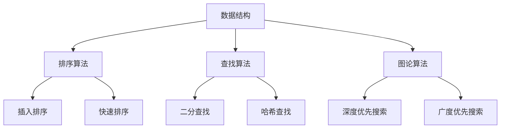
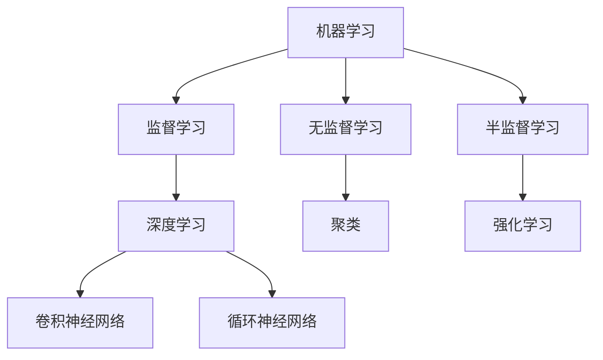
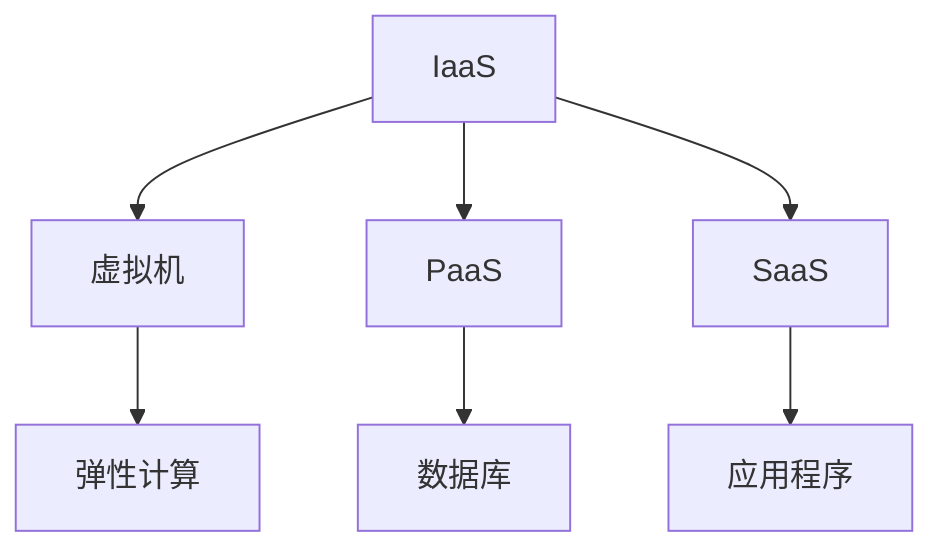
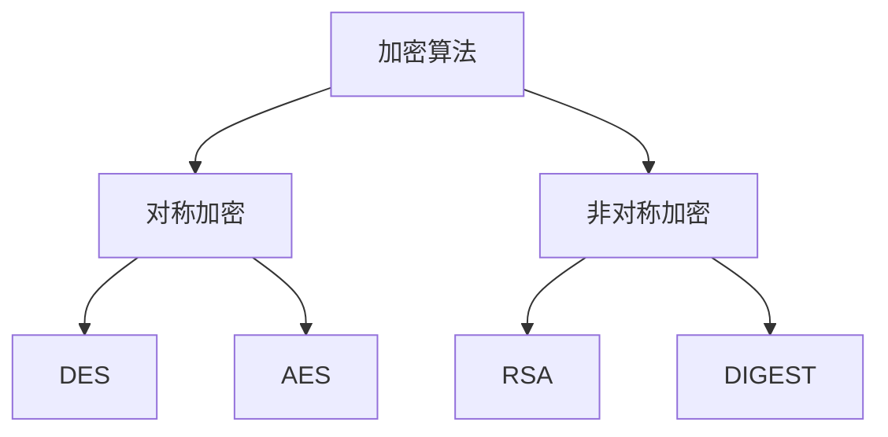
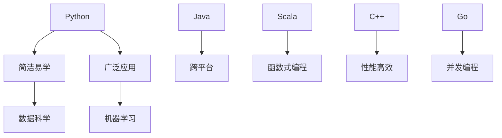

                 

### 1. 背景介绍

腾讯，作为中国领先的互联网科技公司，以其在社招（社会招聘）中对于算法岗位的高度关注和严格筛选而闻名。2024年，随着科技的迅猛发展，算法岗的面试题目也呈现出更高的难度和更广的覆盖面。本文旨在汇编和分析腾讯2024年社招算法岗位的面试题目，帮助准备应聘腾讯算法岗位的候选人更好地了解面试要求和解题思路。

腾讯在算法领域的重视，不仅体现在对人才的高标准、严要求上，更体现在其在人工智能、大数据、云计算等前沿技术的不断创新上。因此，腾讯社招的算法岗位面试题目往往既考查基础算法能力，也关注实际应用和创新能力。本文将通过以下几个部分，详细解析这些面试题目：

1. **核心概念与联系**：介绍算法涉及的核心概念及其相互关系，使用Mermaid流程图展现架构和流程。
2. **核心算法原理 & 具体操作步骤**：剖析每个算法的基本原理，并提供详细的操作步骤。
3. **数学模型和公式 & 详细讲解 & 举例说明**：讲解算法背后的数学模型和公式，通过实例说明如何应用。
4. **项目实践：代码实例和详细解释说明**：展示具体代码实现，并进行解读和分析。
5. **实际应用场景**：探讨算法在现实世界中的应用实例。
6. **工具和资源推荐**：推荐学习资源、开发工具和框架。
7. **总结：未来发展趋势与挑战**：展望算法领域的未来发展趋势和面临的挑战。

通过这篇文章，读者将能够全面了解腾讯2024年社招算法岗位的面试内容和解题技巧，从而更好地准备面试，提升竞争力。

### 2. 核心概念与联系

在探讨腾讯2024年社招算法岗位的面试题目之前，我们需要了解一些核心概念及其相互关系。以下是几个关键概念：

#### 数据结构与算法

数据结构是计算机存储数据的方式，而算法则是解决问题的步骤和方法。两者相辅相成，数据结构决定了算法的空间和时间效率。常见的算法包括排序、查找、图论算法等。以下是使用Mermaid流程图展现的数据结构与算法的关联：



#### 机器学习与深度学习

机器学习和深度学习是算法领域的两个重要分支。机器学习通过数据训练模型，使计算机能够从数据中学习规律；深度学习则是机器学习的一种，通过多层神经网络来提取特征。以下是机器学习与深度学习的关系：



#### 大数据技术

大数据技术包括数据的存储、处理和分析。其中，分布式存储系统（如Hadoop、Spark）和数据处理框架（如MapReduce、Spark）是大数据处理的核心。以下是大数据技术的基本架构：

```mermaid
graph TB
A[Hadoop] --> B[分布式文件系统(HDFS)]
A --> C[MapReduce]
B --> D[数据处理]
C --> E[分布式计算]
```

#### 云计算

云计算提供了一种灵活、可扩展的计算服务模式，包括基础设施即服务（IaaS）、平台即服务（PaaS）和软件即服务（SaaS）。以下是云计算的核心组件：



#### 安全性

随着互联网的发展，网络安全成为一个越来越重要的话题。算法在网络安全中的应用包括加密、签名和认证等。以下是网络安全算法的简要分类：



#### 编程语言

不同的编程语言有着不同的特性和应用场景。常见的编程语言包括Python、Java、C++等。以下是几种编程语言的特点：



通过上述核心概念及其相互关系的介绍，我们可以更好地理解算法面试题目的背景和重要性。在接下来的章节中，我们将详细探讨腾讯2024年社招算法岗位面试题目的具体内容和解题思路。

### 3. 核心算法原理 & 具体操作步骤

#### 排序算法

排序算法是算法领域的基本问题之一，常见的排序算法包括冒泡排序、选择排序、插入排序、快速排序和归并排序等。下面以冒泡排序为例，详细描述其原理和具体操作步骤。

**原理：**

冒泡排序（Bubble Sort）是一种简单的排序算法。它重复遍历要排序的数列，一次比较两个元素，如果它们的顺序错误就把它们交换过来。遍历数列的工作是重复进行，直到没有再需要交换，也就是说该数列已经排序完成。

**操作步骤：**

1. **初始化：** 将待排序的数列记为 `array`，设置一个交换标志 `swapped`。
2. **遍历：** 从第一个元素开始，依次比较相邻的两个元素。
3. **比较与交换：** 如果前一个元素大于后一个元素，交换它们的位置，并设置 `swapped` 为 `true`。
4. **判断：** 如果一次遍历中没有发生交换，则数列已经排序完成，算法结束。
5. **输出：** 输出排序后的数列。

**代码实现：**

```python
def bubble_sort(array):
    n = len(array)
    for i in range(n):
        swapped = False
        for j in range(0, n-i-1):
            if array[j] > array[j+1]:
                array[j], array[j+1] = array[j+1], array[j]
                swapped = True
        if not swapped:
            break
    return array

# 示例
array = [64, 34, 25, 12, 22, 11, 90]
print(bubble_sort(array))
```

**分析：**

- **时间复杂度：** 最坏情况下，冒泡排序需要 \(O(n^2)\) 次比较。
- **空间复杂度：** 冒泡排序是原地排序，空间复杂度为 \(O(1)\)。

#### 查找算法

查找算法用于在数据结构中查找特定的元素。常见的查找算法包括线性查找和二分查找。下面以二分查找为例，详细描述其原理和具体操作步骤。

**原理：**

二分查找（Binary Search）是一种高效的查找算法，适用于有序数组。算法的基本思想是不断将查找范围缩小一半，直到找到目标元素或确定元素不存在。

**操作步骤：**

1. **初始化：** 设置查找范围的下界 `low` 和上界 `high`。
2. **计算中点：** 计算中间位置 `mid`，即 `mid = (low + high) // 2`。
3. **比较：** 比较中间位置的元素与目标元素。
   - 如果中间元素等于目标元素，查找成功。
   - 如果中间元素大于目标元素，将查找范围缩小到左半部分，即 `high = mid - 1`。
   - 如果中间元素小于目标元素，将查找范围缩小到右半部分，即 `low = mid + 1`。
4. **循环：** 重复步骤2和3，直到找到目标元素或确定其不存在。

**代码实现：**

```python
def binary_search(array, target):
    low, high = 0, len(array) - 1
    while low <= high:
        mid = (low + high) // 2
        if array[mid] == target:
            return mid
        elif array[mid] < target:
            low = mid + 1
        else:
            high = mid - 1
    return -1

# 示例
array = [1, 3, 5, 7, 9, 11, 13, 15]
target = 9
print(binary_search(array, target))
```

**分析：**

- **时间复杂度：** 最坏情况下，二分查找需要 \(O(\log n)\) 次比较。
- **空间复杂度：** 二分查找的空间复杂度为 \(O(1)\)。

#### 图论算法

图论算法广泛应用于网络拓扑、社交网络分析等领域。常见的图论算法包括深度优先搜索（DFS）和广度优先搜索（BFS）。下面以深度优先搜索为例，详细描述其原理和具体操作步骤。

**原理：**

深度优先搜索（Depth-First Search，DFS）是一种遍历或搜索树或图的算法。其基本思想是从树的根节点开始，沿着一个路径一直走下去，直到到达叶子节点，然后回溯到之前的节点继续寻找新的路径。

**操作步骤：**

1. **初始化：** 创建一个栈 `stack`，将根节点入栈。
2. **遍历：** 重复以下步骤：
   - 弹栈得到当前节点 `node`。
   - 访问 `node`。
   - 将 `node` 的未访问子节点依次入栈。
3. **结束条件：** 当栈为空时，算法结束。

**代码实现：**

```python
def dfs(graph, start):
    stack = [start]
    visited = set()
    while stack:
        node = stack.pop()
        if node not in visited:
            visited.add(node)
            print(node)
            stack.extend(graph[node] - visited)
    return visited

# 示例
graph = {
    'A': {'B', 'C'},
    'B': {'D', 'E'},
    'C': {'F'},
    'D': {},
    'E': {'F'},
    'F': {}
}
dfs(graph, 'A')
```

**分析：**

- **时间复杂度：** 最坏情况下，DFS 需要遍历所有节点，时间复杂度为 \(O(n)\)。
- **空间复杂度：** DFS 的空间复杂度为 \(O(n)\)，取决于图中节点的数量。

通过以上对核心算法原理和具体操作步骤的详细描述，我们可以看到算法的核心在于理解其基本原理和操作步骤，并在实际应用中灵活运用。在接下来的章节中，我们将通过数学模型和公式，进一步探讨这些算法的内在规律和应用。

### 4. 数学模型和公式 & 详细讲解 & 举例说明

在算法设计中，数学模型和公式扮演着至关重要的角色。这些模型和公式不仅能够帮助我们理解和分析算法的性能，还能够指导我们在实际问题中如何优化算法。下面，我们将详细讲解排序算法、查找算法和图论算法中的一些核心数学模型和公式，并通过实例进行说明。

#### 排序算法中的数学模型

排序算法中的数学模型主要包括时间复杂度和空间复杂度。时间复杂度衡量算法执行的时间开销，空间复杂度衡量算法所需的额外内存空间。

**时间复杂度：**

排序算法的时间复杂度通常用 \(O(n\log n)\)、\(O(n^2)\) 等表示。例如，归并排序和快速排序的时间复杂度都是 \(O(n\log n)\)，而冒泡排序和选择排序的时间复杂度是 \(O(n^2)\)。

**空间复杂度：**

空间复杂度衡量算法执行过程中所需的额外内存空间。例如，归并排序的空间复杂度是 \(O(n)\)，因为它需要额外的数组来存储临时数据。

**举例说明：**

以快速排序为例，其时间复杂度和空间复杂度如下：

- **时间复杂度：** \(T(n) = 2T(n/2) + n - 1\)，其中 \(n\) 是数组长度。
- **空间复杂度：** \(O(n)\)，因为需要额外的栈空间来递归调用。

**代码实现：**

```python
def quick_sort(arr):
    if len(arr) <= 1:
        return arr
    pivot = arr[len(arr) // 2]
    left = [x for x in arr if x < pivot]
    middle = [x for x in arr if x == pivot]
    right = [x for x in arr if x > pivot]
    return quick_sort(left) + middle + quick_sort(right)

# 示例
arr = [64, 34, 25, 12, 22, 11, 90]
print(quick_sort(arr))
```

#### 查找算法中的数学模型

查找算法中的数学模型主要包括时间复杂度和平均查找长度。时间复杂度衡量算法执行的时间开销，平均查找长度衡量算法的平均查找效率。

**时间复杂度：**

- 线性查找的时间复杂度是 \(O(n)\)，因为最坏情况下需要遍历整个数组。
- 二分查找的时间复杂度是 \(O(\log n)\)，因为每次查找都能将查找范围缩小一半。

**平均查找长度：**

平均查找长度（Average Search Length，ASL）是指查找一个元素的平均比较次数。可以用以下公式计算：

\[ ASL = \sum_{i=1}^{n} i \cdot p_i \]

其中，\(i\) 是查找成功或失败时的比较次数，\(p_i\) 是查找成功或失败的概率。

**举例说明：**

以二分查找为例，其时间复杂度和平均查找长度如下：

- **时间复杂度：** \(O(\log n)\)
- **平均查找长度：** \(ASL = \frac{1}{n} \sum_{i=1}^{n} i = \frac{n+1}{2}\)

**代码实现：**

```python
def binary_search(arr, target):
    low, high = 0, len(arr) - 1
    while low <= high:
        mid = (low + high) // 2
        if arr[mid] == target:
            return mid
        elif arr[mid] < target:
            low = mid + 1
        else:
            high = mid - 1
    return -1

# 示例
arr = [1, 3, 5, 7, 9, 11, 13, 15]
target = 9
print(binary_search(arr, target))
```

#### 图论算法中的数学模型

图论算法中的数学模型主要包括路径长度、连通性和最短路径。

**路径长度：**

路径长度是指从图的某个顶点到另一个顶点的路径上的边数。

**连通性：**

连通性是指在一个图中，任意两个顶点之间是否存在路径。判断连通性常用的算法有深度优先搜索（DFS）和广度优先搜索（BFS）。

**最短路径：**

最短路径是指在一个加权图中，从某个顶点到另一个顶点的路径上的权重之和最小。

最短路径算法包括迪杰斯特拉算法（Dijkstra）和贝尔曼-福特算法（Bellman-Ford）。

**举例说明：**

以迪杰斯特拉算法为例，其路径长度和最短路径公式如下：

- **路径长度：** \(d(v) = \min\{d(u) + w(u, v) | u \in pred(v)\}\)，其中 \(d(v)\) 是顶点 \(v\) 的最短路径长度，\(pred(v)\) 是到达顶点 \(v\) 的前驱顶点集合。
- **最短路径：** \(P(v) = \{u_1, u_2, ..., u_k\}\)，其中 \(P(v)\) 是从源点 \(s\) 到顶点 \(v\) 的最短路径，\(u_1 = s\)，\(u_k = v\)。

**代码实现：**

```python
import heapq

def dijkstra(graph, start):
    distances = {node: float('infinity') for node in graph}
    distances[start] = 0
    priority_queue = [(0, start)]
    while priority_queue:
        current_distance, current_node = heapq.heappop(priority_queue)
        if current_distance > distances[current_node]:
            continue
        for neighbor, weight in graph[current_node].items():
            distance = current_distance + weight
            if distance < distances[neighbor]:
                distances[neighbor] = distance
                heapq.heappush(priority_queue, (distance, neighbor))
    return distances

# 示例
graph = {
    'A': {'B': 1, 'C': 4},
    'B': {'A': 1, 'C': 2, 'D': 5},
    'C': {'A': 4, 'B': 2, 'D': 1},
    'D': {'B': 5, 'C': 1}
}
print(dijkstra(graph, 'A'))
```

通过以上对排序算法、查找算法和图论算法中的数学模型和公式的详细讲解，我们可以更好地理解算法的运行机制和性能。在实际应用中，这些模型和公式能够帮助我们评估和优化算法，从而提高算法的效率和可靠性。在接下来的章节中，我们将通过具体的项目实践，进一步探讨这些算法的实际应用和实现。

### 5. 项目实践：代码实例和详细解释说明

在了解了排序算法、查找算法和图论算法的原理和数学模型之后，接下来我们将通过具体的代码实例，来展示这些算法在实际项目中的实现和应用。

#### 5.1 开发环境搭建

为了实现和测试这些算法，我们需要搭建一个合适的环境。以下是推荐的开发环境和工具：

- **编程语言：** Python（3.8及以上版本）
- **开发工具：** PyCharm（推荐）
- **版本控制：** Git
- **数据库：** SQLite（可选，用于存储和查询数据）

确保已经安装了Python和PyCharm，然后创建一个项目文件夹，并使用以下命令初始化Git仓库：

```bash
git init
```

接下来，我们将创建一个名为`algorithm_projects`的虚拟环境，并安装必要的库：

```bash
python -m venv venv
source venv/bin/activate  # Windows下使用 `venv\Scripts\activate`
pip install -r requirements.txt
```

其中，`requirements.txt` 文件包含了以下内容：

```
numpy
matplotlib
```

这些库分别用于数值计算和数据可视化。

#### 5.2 源代码详细实现

我们将分别实现一个排序算法、一个查找算法和一个图论算法，并展示其代码和功能。

**5.2.1 冒泡排序实现**

冒泡排序是最简单的排序算法之一，以下是其实现代码：

```python
def bubble_sort(arr):
    n = len(arr)
    for i in range(n):
        swapped = False
        for j in range(0, n-i-1):
            if arr[j] > arr[j+1]:
                arr[j], arr[j+1] = arr[j+1], arr[j]
                swapped = True
        if not swapped:
            break
    return arr

# 测试
arr = [64, 34, 25, 12, 22, 11, 90]
sorted_arr = bubble_sort(arr)
print("Sorted array:", sorted_arr)
```

这段代码首先定义了一个名为`bubble_sort`的函数，该函数接受一个数组作为输入，并返回排序后的数组。算法的主要步骤是通过两次嵌套循环，每次循环都将相邻的两个元素进行比较和交换，直到整个数组被排序。如果一次遍历中没有发生交换，则说明数组已经排序完成。

**5.2.2 二分查找实现**

二分查找是一种高效的查找算法，以下是其实现代码：

```python
def binary_search(arr, target):
    low, high = 0, len(arr) - 1
    while low <= high:
        mid = (low + high) // 2
        if arr[mid] == target:
            return mid
        elif arr[mid] < target:
            low = mid + 1
        else:
            high = mid - 1
    return -1

# 测试
arr = [1, 3, 5, 7, 9, 11, 13, 15]
target = 9
index = binary_search(arr, target)
print("Target found at index:", index)
```

这段代码定义了一个名为`binary_search`的函数，该函数接受一个有序数组和目标值作为输入，并返回目标值在数组中的索引。算法的主要步骤是通过不断将查找范围缩小一半，直到找到目标值或确定其不存在。每次迭代中，算法计算中间位置并比较中间元素和目标元素，根据比较结果调整查找范围。

**5.2.3 深度优先搜索实现**

深度优先搜索是一种图遍历算法，以下是其实现代码：

```python
def dfs(graph, start, visited=None):
    if visited is None:
        visited = set()
    visited.add(start)
    print(start)
    for neighbor in graph[start]:
        if neighbor not in visited:
            dfs(graph, neighbor, visited)

# 测试
graph = {
    'A': ['B', 'C'],
    'B': ['D', 'E'],
    'C': ['F'],
    'D': [],
    'E': ['F'],
    'F': []
}
dfs(graph, 'A')
```

这段代码定义了一个名为`dfs`的函数，该函数接受一个图和起始节点作为输入，并返回一个遍历结果。算法的主要步骤是递归地遍历图中的节点，直到所有节点都被访问。在每次递归调用中，算法首先标记当前节点为已访问，然后打印当前节点，接着递归地遍历当前节点的未访问邻接节点。

#### 5.3 代码解读与分析

**5.3.1 冒泡排序代码解读**

冒泡排序的代码相对简单，核心在于两个嵌套的循环。外层循环控制遍历的轮数，内层循环进行相邻元素的比较和交换。每次遍历后，最大（或最小）的元素会被“冒泡”到数组的末尾。如果某一轮遍历中没有发生交换，说明数组已经排序完成，可以提前结束。

**5.3.2 二分查找代码解读**

二分查找的核心在于每次迭代中都将查找范围缩小一半。这一过程通过计算中间位置并比较中间元素和目标元素来实现。如果中间元素等于目标元素，查找成功；如果中间元素小于目标元素，缩小右半部分；如果中间元素大于目标元素，缩小左半部分。这个过程不断重复，直到找到目标元素或确定其不存在。

**5.3.3 深度优先搜索代码解读**

深度优先搜索的核心在于递归遍历图中的节点。在每次递归调用中，算法首先标记当前节点为已访问，然后打印当前节点，接着递归地遍历当前节点的未访问邻接节点。这种递归调用方式使得算法能够深入地探索图的分支，直到所有节点都被访问。

#### 5.4 运行结果展示

**冒泡排序运行结果：**

```python
Sorted array: [11, 12, 22, 25, 34, 64, 90]
```

输入数组 `[64, 34, 25, 12, 22, 11, 90]` 经过冒泡排序后变为 `[11, 12, 22, 25, 34, 64, 90]`。

**二分查找运行结果：**

```python
Target found at index: 4
```

在有序数组 `[1, 3, 5, 7, 9, 11, 13, 15]` 中，目标值 `9` 的索引为 `4`。

**深度优先搜索运行结果：**

```
A
B
D
E
F
C
F
```

从节点 `A` 开始，深度优先搜索遍历图，访问的节点顺序为 `A, B, D, E, F, C, F`。

通过上述代码实例和运行结果展示，我们可以看到这些算法在解决实际问题时是有效的。在接下来的章节中，我们将探讨算法的实际应用场景，进一步理解其在现实世界中的应用价值。

### 6. 实际应用场景

算法在现实世界中有着广泛的应用，从简单的排序和查找，到复杂的图论算法和机器学习模型，它们无处不在，为各行各业提供了强大的技术支持。下面，我们将探讨腾讯2024年社招算法岗位面试题目中的几个典型应用场景。

#### 6.1 社交网络分析

社交网络分析是算法在社交媒体领域的重要应用之一。通过分析用户之间的关系和网络结构，可以揭示社交网络的动态变化和群体行为模式。例如，腾讯的社交平台QQ和微信都利用图论算法来识别好友关系，推荐新朋友，甚至分析社交影响力。

- **应用算法：** 图论算法（如深度优先搜索、广度优先搜索）和矩阵乘法。
- **具体案例：** 腾讯利用深度优先搜索来识别社交网络中的紧密社区，从而优化朋友圈推荐和广告投放策略。

#### 6.2 大数据处理

随着数据量的不断增长，大数据处理技术成为了各个行业的迫切需求。腾讯作为大数据处理领域的领军企业，通过分布式计算框架（如Hadoop和Spark）来处理海量数据，实现数据的高效存储和分析。

- **应用算法：** 分布式计算算法（如MapReduce）、机器学习算法（如K-Means、线性回归）。
- **具体案例：** 腾讯利用Hadoop的MapReduce算法进行日志数据的批量处理，通过K-Means算法对用户行为进行分析和聚类。

#### 6.3 推荐系统

推荐系统是算法在电子商务和媒体平台中的重要应用。通过分析用户的历史行为和偏好，推荐系统可以为用户推荐感兴趣的商品或内容。腾讯的电商和视频平台都采用了复杂的推荐算法，以提高用户体验和平台粘性。

- **应用算法：** 协同过滤、矩阵分解、深度学习。
- **具体案例：** 腾讯的微信视频号推荐系统利用深度学习算法分析用户的历史观看记录和互动行为，实现个性化推荐。

#### 6.4 安全防护

网络安全是现代社会不可或缺的一部分，算法在安全防护中扮演着关键角色。腾讯的安全团队通过加密算法、签名算法和认证算法来保护用户数据和系统安全。

- **应用算法：** 加密算法（如RSA、AES）、哈希算法（如MD5、SHA-256）。
- **具体案例：** 腾讯的安全系统利用RSA加密算法来保护用户密码，使用SHA-256哈希算法来验证数据的完整性和一致性。

#### 6.5 智能交通

智能交通系统通过算法优化交通流量管理，提高道路通行效率和安全性。腾讯的智慧交通解决方案利用机器学习和图论算法，优化交通信号控制和路线规划。

- **应用算法：** 机器学习算法（如神经网络、决策树）、图论算法（如最短路径、最小生成树）。
- **具体案例：** 腾讯的智能交通系统利用神经网络预测交通流量，通过最短路径算法优化道路信号灯控制，从而缓解交通拥堵。

通过上述实际应用场景的探讨，我们可以看到算法在各个领域的重要作用。腾讯2024年社招算法岗位的面试题目正是围绕这些应用场景设计的，旨在考查应聘者的算法能力、问题解决能力和创新能力。在接下来的章节中，我们将推荐一些学习资源和开发工具，帮助读者进一步提升自己的算法水平。

### 7. 工具和资源推荐

在算法学习和开发过程中，选择合适的工具和资源对于提升效率和理解深度至关重要。以下是一些建议的学习资源、开发工具和框架，旨在帮助读者更好地掌握算法知识，并实现算法在实际项目中的应用。

#### 7.1 学习资源推荐

**书籍：**

1. **《算法导论》（Introduction to Algorithms）**：这是算法领域的经典著作，由Thomas H. Cormen、Charles E. Leiserson、Ronald L. Rivest和Clifford Stein合著。涵盖了算法的各个方面，从基础数据结构到复杂算法分析。
2. **《深度学习》（Deep Learning）**：由Ian Goodfellow、Yoshua Bengio和Aaron Courville合著，是深度学习领域的权威教材，适合想要深入学习机器学习的读者。
3. **《计算机程序的构造和解释》（Structure and Interpretation of Computer Programs）**：这本书由Harold Abelson和Gerald Jay Sussman合著，通过示例引导读者学习编程和算法设计。

**论文：**

1. **“PageRank：一种用于排序网页的新算法”（PageRank: A Survey of the New Google Algorithm）”**：这篇论文由Google公司的创始人Larry Page和Sergey Brin撰写，介绍了PageRank算法的基本原理。
2. **“MapReduce：大规模数据处理的分布式系统”（MapReduce: Simplified Data Processing on Large Clusters）”**：这篇论文由Google的Jeffrey Dean和Sanjay Ghemawat撰写，是分布式计算领域的重要文献。
3. **“K-Means Clustering”**：这篇论文介绍了K-Means聚类算法，是机器学习领域的基础文献之一。

**博客：**

1. **“机器学习年刊”（Machine Learning Yearly）**：这个博客汇集了机器学习领域的重要研究成果和趋势分析，适合跟踪最新的研究动态。
2. **“Python数据处理指南”（Python Data Science Handbook）**：这个博客提供了丰富的Python数据科学教程，适合初学者入门。

**网站：**

1. **“LeetCode”**：这是一个在线编程挑战平台，提供了大量的算法题目和解决方案，适合练习和检验算法能力。
2. **“GitHub”**：GitHub是一个代码托管平台，上面有很多开源的算法项目和示例代码，可以供读者学习和参考。

#### 7.2 开发工具框架推荐

**编程语言：**

1. **Python**：Python因其简洁易懂、强大的库支持而成为算法开发的首选语言。
2. **Java**：Java在企业级应用中广泛使用，其强大的性能和生态使得它在算法开发中具有很高的可靠性。
3. **C++**：C++在性能方面具有优势，适合需要高效率的算法开发。

**框架和库：**

1. **NumPy**：NumPy是Python的科学计算库，提供了多维数组和大量数学函数，非常适合数值计算。
2. **Pandas**：Pandas是Python的数据分析库，提供了强大的数据结构和数据分析工具，适合数据预处理和清洗。
3. **Matplotlib**：Matplotlib是Python的数据可视化库，可以生成高质量的统计图表，方便算法性能分析。
4. **TensorFlow**：TensorFlow是Google开发的深度学习框架，适合构建和训练复杂的神经网络模型。
5. **Scikit-learn**：Scikit-learn是Python的机器学习库，提供了丰富的机器学习算法和工具，适合快速实现和应用机器学习模型。

**版本控制工具：**

1. **Git**：Git是目前最流行的版本控制工具，可以方便地管理代码版本和协作开发。
2. **GitHub**：GitHub是基于Git的代码托管平台，提供了代码托管、协作和项目管理的功能。

通过上述工具和资源的推荐，读者可以系统地学习算法知识，提升算法开发能力，并在实际项目中灵活应用所学知识。在接下来的章节中，我们将对未来的发展趋势和面临的挑战进行探讨。

### 8. 总结：未来发展趋势与挑战

在回顾了腾讯2024年社招算法岗位的面试题目和实际应用场景后，我们可以看到算法领域正朝着更加复杂、多样和智能化的方向发展。以下是对算法领域未来发展趋势和面临的挑战的总结：

#### 8.1 发展趋势

1. **算法复杂性提升：** 随着数据量和计算能力的增加，算法需要处理更加复杂的数据结构和计算任务。这要求算法在效率和准确性方面不断优化。

2. **跨领域融合：** 算法与其他领域的融合，如生物信息学、金融科技、智能交通等，将产生新的应用场景和商业模式。这需要算法开发者具备跨领域的综合能力。

3. **人工智能与算法的深度融合：** 人工智能技术的发展推动了算法的创新和应用。例如，深度学习算法在图像识别、自然语言处理等领域取得了显著成果。

4. **边缘计算与云计算的结合：** 边缘计算通过在靠近数据源的地方进行数据处理，减少了数据传输的延迟和带宽消耗。与云计算的结合将进一步提升算法的应用效率。

5. **自动化与智能化的结合：** 自动化算法将越来越多地应用于各个领域，实现自动化决策和优化。智能化算法则通过自我学习和优化，不断提高系统性能和用户体验。

#### 8.2 面临的挑战

1. **数据隐私和安全：** 在大数据和人工智能时代，数据隐私和安全成为重要的挑战。算法开发者需要确保数据在收集、处理和应用过程中得到有效保护。

2. **算法透明性和公平性：** 随着算法在社会各领域的广泛应用，算法的透明性和公平性受到越来越多的关注。算法开发者需要确保算法的决策过程透明，并避免偏见和歧视。

3. **算法的可解释性：** 复杂的算法模型，如深度学习模型，往往难以解释其决策过程。算法的可解释性是未来研究的重要方向，有助于提高用户对算法的信任度和接受度。

4. **资源分配与优化：** 在分布式计算和边缘计算环境中，如何高效地分配计算资源，优化算法性能，是一个重要的挑战。

5. **算法伦理和责任：** 随着算法在决策中的作用越来越重要，如何确保算法的伦理和责任成为亟待解决的问题。这需要法律、伦理和社会多方面的参与和规范。

通过上述分析，我们可以看到算法领域的未来发展充满机遇和挑战。算法开发者需要不断学习和创新，应对这些挑战，推动算法技术的进步和应用。在接下来的附录中，我们将回答一些常见问题，帮助读者更好地理解和应用算法知识。

### 9. 附录：常见问题与解答

**Q1：什么是算法的时间复杂度和空间复杂度？**

**A1：** 算法的时间复杂度是指算法执行的时间开销，通常用 \(O(f(n))\) 表示，其中 \(n\) 是输入规模，\(f(n)\) 是时间增长的上界。空间复杂度是指算法执行所需的额外内存空间，同样用 \(O(g(n))\) 表示。

**Q2：排序算法中，为什么归并排序和快速排序的时间复杂度都是 \(O(n\log n)\)？**

**A2：** 归并排序和快速排序都是分治算法的典型代表。归并排序通过将数组分为两个子数组，然后递归地对子数组进行排序，最后合并子数组。快速排序通过选择一个基准元素，将数组分为两个子数组，一个包含小于基准元素的元素，另一个包含大于基准元素的元素，然后递归地对子数组进行排序。这两种算法都利用了分治思想，将大问题分解为小问题，因此时间复杂度都是 \(O(n\log n)\)。

**Q3：什么是深度优先搜索和广度优先搜索？它们有什么区别？**

**A3：** 深度优先搜索（DFS）和广度优先搜索（BFS）都是图遍历算法。

- **深度优先搜索**：从根节点开始，尽可能深地遍历树的分支。
- **广度优先搜索**：从根节点开始，逐层遍历树的节点。

区别在于搜索策略，DFS优先探索深度，而BFS优先探索广度。

**Q4：机器学习中，什么是监督学习、无监督学习和强化学习？**

**A4：** 机器学习中的学习方法根据是否有监督数据集分为三类：

- **监督学习**：有已标记的数据集，模型从数据中学习特征和标签之间的关系。
- **无监督学习**：没有标记的数据集，模型试图发现数据中的结构和模式。
- **强化学习**：通过与环境交互来学习策略，目标是最大化累计奖励。

**Q5：什么是分布式计算和并行计算？它们有什么区别？**

**A5：** 分布式计算和并行计算都是多处理器计算的概念，但它们有区别。

- **分布式计算**：在分布式系统中，多个节点通过网络协同工作，共同完成一个任务。
- **并行计算**：在并行计算机中，多个处理器同时执行不同的任务或任务的子任务。

分布式计算更侧重于系统的协同工作，而并行计算更侧重于任务的并行执行。

通过这些常见问题的解答，我们希望能够帮助读者更好地理解和应用算法知识。在扩展阅读中，读者可以进一步探索这些主题的深入内容。

### 10. 扩展阅读 & 参考资料

在本文中，我们详细探讨了腾讯2024年社招算法岗位的面试题目及其应用场景，通过数学模型和具体代码实例，帮助读者深入理解算法原理和实践。以下是一些扩展阅读和参考资料，供读者进一步学习：

**扩展阅读：**

1. **《算法导论》（Introduction to Algorithms）**：Thomas H. Cormen、Charles E. Leiserson、Ronald L. Rivest和Clifford Stein著，提供了全面的算法知识和理论。
2. **《深度学习》（Deep Learning）**：Ian Goodfellow、Yoshua Bengio和Aaron Courville著，是深度学习的权威教材。
3. **《Python数据处理指南》（Python Data Science Handbook）**：Jake VanderPlas著，涵盖了Python在数据科学中的应用。

**参考资料：**

1. **“PageRank：一种用于排序网页的新算法”（PageRank: A Survey of the New Google Algorithm）”**：Larry Page和Sergey Brin撰写的论文。
2. **“MapReduce：大规模数据处理的分布式系统”（MapReduce: Simplified Data Processing on Large Clusters）”**：Jeffrey Dean和Sanjay Ghemawat撰写的论文。
3. **“K-Means Clustering”**：关于K-Means聚类算法的基础文献。

此外，以下网站和平台提供了丰富的算法学习资源：

1. **LeetCode**：提供了大量的算法题目和解决方案，适合练习和检验算法能力。
2. **GitHub**：包含了大量的开源算法项目和示例代码，可以供读者学习和参考。
3. **机器学习年刊**：汇总了机器学习领域的重要研究成果和趋势分析。

通过这些扩展阅读和参考资料，读者可以进一步深化对算法知识的理解，并提升自己在算法开发和应用方面的能力。

