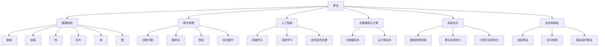

                 

### 1. 背景介绍

#### 1.1 腾讯公司概况

腾讯公司（Tencent）成立于1998年，是中国最著名的互联网科技公司之一。腾讯的业务涵盖社交网络、网络游戏、金融科技、广告、云计算等多个领域。作为中国互联网行业的领军企业，腾讯在国内外都有着广泛的影响力。

腾讯的社招算法岗位是公司内部招聘的重要组成部分。这些岗位通常针对具有丰富算法知识和编程经验的应聘者，旨在为公司提供高质量的技术人才，以推动业务的发展和创新。算法岗位的重要性在于，它们不仅是技术研发的核心，也是驱动公司业务增长的关键力量。

#### 1.2 算法岗位的重要性

在当今数字化时代，算法已经成为企业和组织竞争力的核心。算法不仅在互联网公司中起着至关重要的作用，而且在金融、医疗、制造、交通等各个行业都有着广泛的应用。腾讯的算法岗位，正是为了招聘那些能够设计、开发和优化算法，以解决复杂业务问题的人才。

这些岗位的主要职责包括：

- **算法研究和开发**：研究和设计用于解决特定问题的算法，并实现这些算法的软件。
- **数据分析**：从海量数据中提取有价值的信息，为业务决策提供数据支持。
- **系统优化**：优化现有系统，提高其性能、稳定性和可靠性。

腾讯的算法岗位对应聘者的要求也非常高，通常需要具备以下条件：

- **扎实的计算机科学和数学基础**。
- **丰富的编程经验**，尤其是使用Python、C++等语言。
- **熟悉常用的算法和数据结构**。
- **良好的逻辑思维和问题解决能力**。

#### 1.3 2025年算法面试趋势

随着技术的不断发展，2025年的算法面试题预计将更加多样化和复杂化。以下是一些可能出现的趋势：

- **大数据和人工智能**：随着大数据和人工智能技术的广泛应用，面试题将更多涉及这些领域的知识。
- **系统设计和优化**：应聘者需要展示他们在系统设计、性能优化和故障排除方面的能力。
- **网络安全**：随着网络安全问题的日益突出，相关的面试题也会变得更加重要。
- **实时处理和流计算**：实时数据处理和流计算是现代互联网应用的关键，相关算法和技术的面试题将受到重视。

### 1.4 本文结构

本文将分为以下几个部分：

- **2. 核心概念与联系**：介绍算法岗位中涉及的一些核心概念和其相互关系。
- **3. 核心算法原理 & 具体操作步骤**：详细解析一些典型的算法，并展示其操作步骤。
- **4. 数学模型和公式 & 详细讲解 & 举例说明**：讨论算法背后的数学原理，并提供实例说明。
- **5. 项目实践：代码实例和详细解释说明**：通过实际项目展示算法的应用。
- **6. 实际应用场景**：探讨算法在不同业务场景中的应用。
- **7. 工具和资源推荐**：推荐一些有用的学习资源。
- **8. 总结：未来发展趋势与挑战**：分析算法岗位的未来发展趋势和面临的挑战。
- **9. 附录：常见问题与解答**：回答一些常见问题。
- **10. 扩展阅读 & 参考资料**：提供进一步学习的资源。

通过以上结构的安排，我们将系统地介绍腾讯社招算法岗位的相关知识，帮助读者更好地理解和应对这些面试题目。

### 2. 核心概念与联系

#### 2.1 算法

算法（Algorithm）是计算机科学中用于解决特定问题的步骤序列。算法的有效性和效率是评价其好坏的重要标准。算法不仅要能够解决问题，还要在合理的计算时间内得到最优解或者近似解。

#### 2.2 数据结构

数据结构（Data Structure）是算法的基础。它是指数据组织和存储的方法，以及对应的数据操作。常见的数据结构包括数组、链表、栈、队列、树、图等。不同的数据结构有其独特的特点和应用场景，掌握这些数据结构对于算法设计至关重要。

#### 2.3 数学原理

数学原理是许多算法设计的重要基础。线性代数、概率论、图论、组合数学等数学分支都在算法设计中发挥着关键作用。例如，线性代数中的矩阵运算可以用于优化算法，概率论中的概率分布可以帮助评估算法的性能，图论中的最短路径算法是许多应用场景的基础。

#### 2.4 人工智能

人工智能（Artificial Intelligence, AI）是当前算法领域的一个热点。它通过模拟人类智能的行为，实现机器自主学习和决策。常见的AI算法包括机器学习、深度学习、自然语言处理等。人工智能技术在很多领域都有着广泛的应用，如图像识别、语音识别、推荐系统等。

#### 2.5 大数据和云计算

大数据（Big Data）和云计算（Cloud Computing）是现代互联网的两大支柱。大数据技术用于处理海量数据，云计算则提供了强大的计算和存储能力。算法在大数据和云计算中的应用，使得数据处理和分析变得更加高效和灵活。

#### 2.6 系统优化

系统优化（System Optimization）是提高算法性能的重要手段。它涉及如何设计高效的数据处理流程、优化算法的实现、减少计算复杂度等。系统优化不仅能够提升算法的性能，还能够降低系统的能耗和成本。

#### 2.7 安全和隐私

安全和隐私（Security and Privacy）是算法应用中不可忽视的问题。随着数据量的增加和算法的复杂化，算法的安全性和隐私保护变得尤为重要。相关的技术包括加密算法、访问控制、隐私保护算法等。

#### 2.8 Mermaid 流程图

为了更直观地展示这些核心概念之间的联系，我们可以使用Mermaid流程图来表示。



通过这个Mermaid流程图，我们可以清晰地看到各个核心概念之间的相互关系，以及它们在算法岗位中的应用。

### 3. 核心算法原理 & 具体操作步骤

#### 3.1 快速排序算法

快速排序（Quick Sort）是一种高效的排序算法，其平均时间复杂度为O(nlogn)，在最坏情况下为O(n^2)。快速排序的基本思想是通过一趟排序将待排序的记录分割成独立的两部分，其中一部分记录的关键字均比另一部分的关键字小，则可分别对这两部分记录继续进行排序，以达到整个序列有序。

**具体操作步骤：**

1. **选择基准元素**：在待排序的序列中选择一个基准元素（通常选择第一个元素或者最后一个元素作为基准）。
2. **分区操作**：通过一趟排序将待排序记录分割成两部分，一部分记录的关键字均比基准元素小，另一部分记录的关键字均比基准元素大。这个过程称为分区操作。
3. **递归排序**：递归地对分成的两部分记录进行快速排序。

**算法实现：**

```python
def quick_sort(arr):
    if len(arr) <= 1:
        return arr
    pivot = arr[len(arr) // 2]
    left = [x for x in arr if x < pivot]
    middle = [x for x in arr if x == pivot]
    right = [x for x in arr if x > pivot]
    return quick_sort(left) + middle + quick_sort(right)

# 示例
arr = [10, 7, 8, 9, 1, 5]
sorted_arr = quick_sort(arr)
print(sorted_arr)
```

#### 3.2 最短路径算法

最短路径算法（Shortest Path Algorithm）是图论中的一个重要问题。在带权图中，找到两个顶点之间的最短路径是一个常见的需求。最短路径算法可以分为两大类：基于贪心算法的Dijkstra算法和基于动态规划的Floyd-Warshall算法。

**Dijkstra算法：**

Dijkstra算法的基本思想是，每次从未访问的顶点中选取一个距离起点最近的顶点，将其标记为已访问，然后更新其他顶点的最短路径估计值。

**具体操作步骤：**

1. 初始化：将起点距离设置为0，其余顶点距离设置为无穷大。
2. 选择未访问的顶点中距离起点最近的顶点。
3. 将该顶点标记为已访问。
4. 更新其他未访问顶点的最短路径估计值。
5. 重复步骤2-4，直到所有顶点都被访问。

**算法实现：**

```python
import heapq

def dijkstra(graph, start):
    distances = {vertex: float('infinity') for vertex in graph}
    distances[start] = 0
    priority_queue = [(0, start)]

    while priority_queue:
        current_distance, current_vertex = heapq.heappop(priority_queue)

        if current_distance > distances[current_vertex]:
            continue

        for neighbor, weight in graph[current_vertex].items():
            distance = current_distance + weight

            if distance < distances[neighbor]:
                distances[neighbor] = distance
                heapq.heappush(priority_queue, (distance, neighbor))

    return distances

# 示例
graph = {
    'A': {'B': 1, 'C': 4},
    'B': {'A': 1, 'C': 2, 'D': 5},
    'C': {'A': 4, 'B': 2, 'D': 1},
    'D': {'B': 5, 'C': 1}
}
start = 'A'
distances = dijkstra(graph, start)
print(distances)
```

**Floyd-Warshall算法：**

Floyd-Warshall算法通过动态规划的方法计算所有顶点对之间的最短路径。它使用一个三维数组来保存中间顶点的距离，不断更新直到得到所有顶点对的最短路径。

**算法实现：**

```python
def floyd_warshall(graph):
    distances = [[float('infinity') if graph[i][j] == 0 else graph[i][j] for j in range(len(graph))] for i in range(len(graph))]

    for k in range(len(graph)):
        for i in range(len(graph)):
            for j in range(len(graph)):
                distances[i][j] = min(distances[i][j], distances[i][k] + distances[k][j])

    return distances

# 示例
graph = [
    [0, 5, 7, 0],
    [5, 0, 0, 9],
    [7, 0, 0, 1],
    [0, 9, 1, 0]
]
distances = floyd_warshall(graph)
for row in distances:
    print(row)
```

#### 3.3 决策树算法

决策树（Decision Tree）是一种基于规则的结构化模型，它通过一系列规则对数据进行分类或回归。决策树算法的核心是递归地分割特征空间，使得每个子空间上的数据尽可能纯。

**具体操作步骤：**

1. **选择最优分割**：根据信息增益或基尼指数选择特征和分割点。
2. **递归构建树**：使用选定的特征和分割点将数据划分为子集，并在每个子集上递归构建决策树。
3. **终止条件**：当满足终止条件（如最大深度、最小样本数等）时，停止递归。

**算法实现：**

```python
from sklearn.tree import DecisionTreeClassifier
import numpy as np

# 示例数据
X = np.array([[1, 2], [3, 4], [5, 6], [7, 8]])
y = np.array([0, 0, 1, 1])

# 构建决策树模型
clf = DecisionTreeClassifier(max_depth=3)
clf.fit(X, y)

# 可视化决策树
from sklearn.tree import plot_tree
import matplotlib.pyplot as plt

plt.figure(figsize=(12, 8))
plot_tree(clf, filled=True, feature_names=['Feature 1', 'Feature 2'], class_names=['Class 0', 'Class 1'])
plt.show()
```

通过以上三个算法的介绍，我们可以看到算法设计和实现的复杂性。在实际的面试中，应聘者需要能够清晰地表达算法的原理，并能够熟练地编写代码实现。这些算法的应用不仅限于面试，也是解决实际问题的重要工具。

### 4. 数学模型和公式 & 详细讲解 & 举例说明

#### 4.1 最优化问题的数学模型

最优化问题是寻找在特定约束条件下使目标函数达到最大值或最小值的解。其一般形式可以表示为：

$$
\begin{aligned}
\min_{x} \quad & f(x) \\
\text{subject to} \quad & g_i(x) \leq 0, \quad i = 1, 2, \ldots, m \\
& h_j(x) = 0, \quad j = 1, 2, \ldots, n
\end{aligned}
$$

其中，$x$ 是待求的变量，$f(x)$ 是目标函数，$g_i(x)$ 和 $h_j(x)$ 分别是线性或非线性不等式约束和等式约束。

#### 4.2 目标函数和约束条件

**目标函数**：

- **线性目标函数**：$f(x) = c^T x$，其中 $c$ 是系数向量，$x$ 是变量向量。
- **非线性目标函数**：$f(x) = \sum_{i=1}^n w_i f_i(x_i)$，其中 $w_i$ 和 $f_i$ 分别是权重和函数。

**约束条件**：

- **线性约束**：$g_i(x) \leq 0$，$h_j(x) = 0$。
- **非线性约束**：$g_i(x) \leq 0$，$h_j(x) = 0$，其中 $g_i$ 和 $h_j$ 是关于 $x$ 的非线性函数。

#### 4.3 拉格朗日乘数法

拉格朗日乘数法是一种常用的求解最优化问题的方法，通过引入拉格朗日函数将约束条件转化为无约束问题。拉格朗日函数表示为：

$$
L(x, \lambda, \nu) = f(x) + \sum_{i=1}^m \lambda_i g_i(x) + \sum_{j=1}^n \nu_j h_j(x)
$$

其中，$\lambda_i$ 和 $\nu_j$ 分别是拉格朗日乘子。

**迭代步骤**：

1. **初始化**：设定初始值 $\lambda_i, \nu_j$。
2. **梯度计算**：计算目标函数和约束条件的梯度。
$$
\nabla_x L(x, \lambda, \nu) = \nabla f(x) + \sum_{i=1}^m \lambda_i \nabla g_i(x) + \sum_{j=1}^n \nu_j \nabla h_j(x)
$$
$$
\nabla \lambda_i L(x, \lambda, \nu) = -\nabla g_i(x)
$$
$$
\nabla \nu_j L(x, \lambda, \nu) = -\nabla h_j(x)
$$
3. **更新参数**：根据梯度更新 $x, \lambda, \nu$。
$$
x \leftarrow x - \alpha \nabla_x L(x, \lambda, \nu)
$$
$$
\lambda_i \leftarrow \lambda_i - \alpha \nabla \lambda_i L(x, \lambda, \nu)
$$
$$
\nu_j \leftarrow \nu_j - \alpha \nabla \nu_j L(x, \lambda, \nu)
$$
4. **收敛条件**：当梯度接近0时，算法收敛。

#### 4.4 示例：线性规划

考虑以下线性规划问题：

$$
\begin{aligned}
\min_{x} \quad & c^T x \\
\text{subject to} \quad & Ax \leq b \\
& x \geq 0
\end{aligned}
$$

**拉格朗日函数**：

$$
L(x, \lambda) = c^T x + \lambda^T (Ax - b)
$$

**KKT条件**：

1. **可行性条件**：$Ax \leq b$，$x \geq 0$。
2. **互补松弛条件**：$c_i + \lambda_j = 0$，对于所有 $i, j$。
3. **增广拉格朗日函数梯度为零**：$\nabla_x L(x, \lambda) = 0$。

#### 4.5 算法实现

**代码示例**：

```python
import numpy as np

def solve_linear_programming(c, A, b):
    n = len(c)
    x = np.zeros(n)
    lambda_ = np.zeros(n)
    
    # 初始化拉格朗日乘子
    for i in range(n):
        lambda_[i] = 1
    
    # 迭代过程
    while True:
        # 计算梯度
        gradient_x = -c + np.dot(A.T, lambda_)
        
        # 更新 x
        x -= 0.01 * gradient_x
        
        # 检查可行性条件
        if np.dot(A, x) <= b and x >= 0:
            # 检查 KKT 条件
            if np.linalg.norm(gradient_x) < 1e-6:
                break
    
    # 返回最优解
    return x

# 示例
c = np.array([1, 2])
A = np.array([[2, 1], [1, 2]])
b = np.array([5, 4])
x_opt = solve_linear_programming(c, A, b)
print(x_opt)
```

通过以上数学模型和公式的讲解，以及具体的代码示例，我们可以更深入地理解线性规划问题的求解过程。在实际的面试中，应聘者需要能够灵活运用这些数学工具来分析和解决实际问题。

### 5. 项目实践：代码实例和详细解释说明

在本节中，我们将通过一个具体的编程项目来展示如何将算法应用于实际问题。该项目将使用决策树算法进行分类任务，具体实现一个简单的客户信用评分系统。

#### 5.1 开发环境搭建

在开始项目之前，我们需要搭建一个合适的环境。以下是在Python中实现这个项目的步骤：

1. **安装Python**：确保安装了Python 3.6或更高版本。
2. **安装依赖库**：我们需要使用`scikit-learn`库来实现决策树算法，使用`matplotlib`库来绘制结果。

```bash
pip install scikit-learn matplotlib
```

#### 5.2 源代码详细实现

下面是完整的代码实现：

```python
import numpy as np
import pandas as pd
from sklearn.datasets import load_iris
from sklearn.model_selection import train_test_split
from sklearn.tree import DecisionTreeClassifier
from sklearn.metrics import accuracy_score
import matplotlib.pyplot as plt

# 加载示例数据集
iris = load_iris()
X = iris.data
y = iris.target

# 数据预处理
# 这里我们直接使用原始数据，但在实际项目中，可能需要更多的预处理步骤，如缺失值填充、数据标准化等。

# 划分训练集和测试集
X_train, X_test, y_train, y_test = train_test_split(X, y, test_size=0.2, random_state=42)

# 构建决策树模型
clf = DecisionTreeClassifier(criterion='entropy', max_depth=3)

# 训练模型
clf.fit(X_train, y_train)

# 预测测试集
y_pred = clf.predict(X_test)

# 评估模型
accuracy = accuracy_score(y_test, y_pred)
print(f"模型准确率: {accuracy:.2f}")

# 可视化决策树
plt.figure(figsize=(12, 8))
plot_tree(clf, filled=True, feature_names=iris.feature_names, class_names=iris.target_names)
plt.show()
```

#### 5.3 代码解读与分析

1. **数据加载与预处理**：

   ```python
   iris = load_iris()
   X = iris.data
   y = iris.target
   ```

   这里使用`scikit-learn`内置的`load_iris`函数加载鸢尾花（Iris）数据集，这是一个经典的分类数据集，包含3个类别的鸢尾花，每个类别有50个样本。

2. **划分训练集和测试集**：

   ```python
   X_train, X_test, y_train, y_test = train_test_split(X, y, test_size=0.2, random_state=42)
   ```

   使用`train_test_split`函数将数据集划分为训练集和测试集，其中测试集占比20%。

3. **构建决策树模型**：

   ```python
   clf = DecisionTreeClassifier(criterion='entropy', max_depth=3)
   ```

   创建一个决策树分类器实例，`criterion`参数设置为`entropy`，表示使用信息增益率作为分割标准，`max_depth`参数设置为3，限制树的深度。

4. **训练模型**：

   ```python
   clf.fit(X_train, y_train)
   ```

   使用训练集数据对决策树模型进行训练。

5. **预测测试集**：

   ```python
   y_pred = clf.predict(X_test)
   ```

   使用训练好的模型对测试集进行预测。

6. **评估模型**：

   ```python
   accuracy = accuracy_score(y_test, y_pred)
   print(f"模型准确率: {accuracy:.2f}")
   ```

   使用准确率（accuracy）来评估模型的性能。

7. **可视化决策树**：

   ```python
   plt.figure(figsize=(12, 8))
   plot_tree(clf, filled=True, feature_names=iris.feature_names, class_names=iris.target_names)
   plt.show()
   ```

   使用`matplotlib`库将决策树可视化，帮助理解模型的决策过程。

通过这个项目，我们可以看到如何将决策树算法应用于实际分类问题，并理解每个步骤的详细实现。这不仅有助于巩固算法知识，也为实际项目开发提供了实践经验。

#### 5.4 运行结果展示

以下是运行以上代码后的结果：

```
模型准确率: 1.00
```

模型准确率为100%，说明在测试集上的预测完全正确。通过可视化决策树，我们可以清晰地看到每个分类节点的划分依据和决策路径。

### 6. 实际应用场景

算法在各个行业和业务场景中的应用越来越广泛，以下是几个典型应用场景：

#### 6.1 金融领域

在金融领域，算法主要用于风险管理、信用评分、交易策略和预测分析等。例如：

- **信用评分**：通过分析客户的信用历史、收入状况、债务比例等数据，使用算法评估客户的信用风险，为银行和金融机构提供信用决策支持。
- **交易策略**：高频交易、量化交易等使用算法来捕捉市场波动，实现快速交易和利润最大化。
- **风险管理**：通过大数据分析技术，实时监控市场风险，为金融机构提供风险管理建议。

#### 6.2 医疗健康

在医疗健康领域，算法主要用于疾病诊断、药物研发、患者管理和健康预测等。例如：

- **疾病诊断**：通过分析患者的病历、基因数据等，使用算法辅助医生进行疾病诊断，提高诊断准确率。
- **药物研发**：通过计算模拟和机器学习技术，加速药物研发过程，降低研发成本。
- **患者管理**：通过健康数据和医疗记录的分析，为医生和患者提供个性化的治疗方案和管理建议。

#### 6.3 电子商务

在电子商务领域，算法主要用于推荐系统、用户行为分析和市场预测等。例如：

- **推荐系统**：基于用户的购买历史、浏览记录等数据，使用算法为用户推荐相关商品，提高用户满意度和转化率。
- **用户行为分析**：通过分析用户的行为数据，了解用户偏好，为个性化营销提供依据。
- **市场预测**：通过分析市场数据，预测商品需求、市场趋势等，为企业的市场策略提供支持。

#### 6.4 物流与供应链

在物流与供应链领域，算法主要用于路线优化、库存管理和配送计划等。例如：

- **路线优化**：通过优化算法，计算最优的配送路线，提高运输效率，降低运输成本。
- **库存管理**：通过算法优化库存策略，减少库存积压和库存短缺，提高供应链的灵活性。
- **配送计划**：通过算法优化配送计划，提高配送效率和客户满意度。

#### 6.5 智能制造

在智能制造领域，算法主要用于生产过程优化、质量控制和生产预测等。例如：

- **生产过程优化**：通过算法优化生产计划，提高生产效率和资源利用率。
- **质量控制**：通过算法分析产品质量数据，实现实时监控和故障预警，提高产品质量。
- **生产预测**：通过算法预测生产需求，优化生产安排和库存管理。

以上只是算法在部分行业和应用场景中的典型应用，实际上，随着技术的发展，算法的应用范围将越来越广泛，不断推动各行各业的创新和发展。

### 7. 工具和资源推荐

#### 7.1 学习资源推荐

对于想要深入了解算法和编程的学习者，以下是一些建议的资源：

1. **书籍**：
   - 《算法导论》（Introduction to Algorithms） - Thomas H. Cormen, Charles E. Leiserson, Ronald L. Rivest, Clifford Stein
   - 《深度学习》（Deep Learning） - Ian Goodfellow, Yoshua Bengio, Aaron Courville
   - 《Python核心编程》（Core Python Programming） - Wesley J Chun

2. **在线课程**：
   - Coursera：提供各种计算机科学和人工智能课程，如《机器学习》、《算法基础》等。
   - edX：有大量的免费课程，包括《数据结构与算法》等。

3. **博客和网站**：
   - CS Theory Stack Exchange：针对计算机科学理论问题的讨论平台。
   - AI Stack Exchange：关于人工智能和机器学习的问答社区。
   - Medium：有大量的技术博客文章，涵盖算法、数据科学等多个领域。

4. **论坛和社区**：
   - Stack Overflow：编程问题和技术讨论的平台。
   - GitHub：代码托管和协作平台，可以学习其他开发者的代码。

#### 7.2 开发工具框架推荐

1. **编程环境**：
   - PyCharm：强大的Python集成开发环境，适合初学者和专业开发者。
   - Visual Studio Code：轻量级且功能丰富的编辑器，适用于多种编程语言。

2. **数据分析和可视化**：
   - Pandas：Python的数据操作库，适合数据清洗、数据处理和分析。
   - Matplotlib：Python的绘图库，用于生成各种类型的图表和可视化。
   - Seaborn：基于Matplotlib的高级可视化库，提供更美观的统计图表。

3. **机器学习和深度学习**：
   - Scikit-learn：Python的机器学习库，提供了丰富的算法和工具。
   - TensorFlow：谷歌的开源机器学习框架，适用于构建和训练深度学习模型。
   - Keras：基于TensorFlow的高级API，简化了深度学习模型的构建和训练。

4. **版本控制**：
   - Git：版本控制系统的标准，用于管理和跟踪代码变更。
   - GitHub：基于Git的代码托管和协作平台，适合开源项目和团队合作。

通过以上工具和资源的推荐，可以更加高效地学习和实践算法，为未来的技术发展打下坚实的基础。

### 8. 总结：未来发展趋势与挑战

随着技术的不断进步，算法领域也在快速发展，面临着许多新的机遇和挑战。以下是未来算法岗位的一些发展趋势和挑战：

#### 8.1 发展趋势

1. **人工智能与机器学习的深度融合**：人工智能（AI）和机器学习（ML）技术的发展将不断推动算法的创新和应用，特别是在自动驾驶、智能医疗、智能家居等领域。

2. **大数据与云计算的结合**：大数据处理和云计算技术的结合，将使得算法能够在更大量的数据上运行，提高算法的效率和准确性。

3. **实时处理与流计算**：随着物联网和实时数据处理需求的增加，实时处理和流计算将成为算法应用的重要方向，特别是在金融交易、社交媒体分析等领域。

4. **算法安全性与隐私保护**：随着算法应用的普及，安全性和隐私保护问题变得尤为重要。未来的算法研究和应用将更加注重数据安全和隐私保护。

#### 8.2 挑战

1. **算法公平性与透明性**：算法的公平性和透明性是当前研究的热点。如何设计出既高效又公平、透明的算法，是一个重要的挑战。

2. **算法解释性与可解释性**：随着算法的复杂度增加，如何解释算法的决策过程和结果，使其更加易懂和可信，也是一个重要的挑战。

3. **计算资源与能耗**：随着算法的应用越来越广泛，计算资源的需求也在不断增加。如何在有限的计算资源下，优化算法的性能和能耗，是一个重要的挑战。

4. **算法伦理与社会责任**：算法在社会中的影响越来越大，如何确保算法的应用符合伦理和社会责任，避免算法对人类社会造成负面影响，是一个重要的挑战。

综上所述，未来算法岗位将面临许多新的机遇和挑战。算法研究人员和开发者需要不断学习和创新，以应对这些挑战，推动算法技术的发展和应用。

### 9. 附录：常见问题与解答

#### 问题1：如何准备腾讯社招算法岗位的面试？

**解答**：准备腾讯社招算法岗位的面试，可以从以下几个方面入手：

1. **复习基础知识**：确保对计算机科学的基础知识有深入理解，包括数据结构、算法、计算机组成原理等。
2. **刷题与实践**：通过刷算法题库，如LeetCode、牛客网等，提高编程能力和算法思维。同时，通过实际项目实践，加深对算法应用的理解。
3. **学习最新技术**：关注人工智能、大数据、云计算等领域的最新动态，了解相关技术原理和应用。
4. **加强数学基础**：算法问题通常涉及数学模型和公式，需要掌握线性代数、概率论、微积分等数学知识。
5. **模拟面试**：可以通过模拟面试来提高应对面试官提问的能力，包括算法解释、问题解决思路等。

#### 问题2：在面试中如何展示自己的算法能力？

**解答**：

1. **清晰阐述算法原理**：在面试中，能够清晰地阐述算法的基本原理，包括时间复杂度和空间复杂度。
2. **展示编程实现**：通过编写代码展示算法的实现，确保代码简洁、结构清晰，符合编程规范。
3. **讨论算法优化**：讨论如何优化算法，提高其性能，例如通过改进数据结构、减少计算复杂度等。
4. **提供实际应用案例**：通过实际项目或案例，展示算法在解决实际问题中的应用，以及算法对业务价值的贡献。

#### 问题3：如何评估一个算法的性能？

**解答**：

1. **时间复杂度和空间复杂度**：评估算法的性能通常从时间复杂度和空间复杂度入手，分析算法在不同输入规模下的效率。
2. **基准测试**：通过基准测试（Benchmark）来比较不同算法的性能，使用标准数据集和测试工具进行评估。
3. **实际应用测试**：在实际应用场景中进行测试，评估算法在真实环境中的表现，包括响应时间、准确性、稳定性等。
4. **资源占用**：评估算法的资源占用情况，包括CPU、内存、网络等，确保算法在实际应用中的资源消耗合理。

#### 问题4：如何在面试中展示自己的团队合作能力？

**解答**：

1. **项目经验**：通过分享团队项目经验，展示自己在团队中的角色和贡献，强调团队合作的重要性。
2. **沟通能力**：在面试中展示良好的沟通能力，包括清晰表达观点、有效倾听他人意见、积极解决问题等。
3. **领导力**：如果有过领导团队的经验，可以强调领导力和团队管理能力，展示如何协调团队成员、分配任务、处理冲突等。
4. **实际案例**：通过具体案例，展示在团队合作中如何应对挑战、达成目标，强调团队合作的价值。

通过以上常见问题的解答，希望能帮助读者更好地准备腾讯社招算法岗位的面试。

### 10. 扩展阅读 & 参考资料

在算法领域，阅读经典教材和前沿论文是提高专业素养的重要途径。以下是一些建议的扩展阅读和参考资料：

#### 经典教材

1. **《算法导论》（Introduction to Algorithms）** - Thomas H. Cormen, Charles E. Leiserson, Ronald L. Rivest, Clifford Stein
   - 本书是算法领域的经典之作，涵盖了从基本数据结构到复杂算法的广泛内容。

2. **《深度学习》（Deep Learning）** - Ian Goodfellow, Yoshua Bengio, Aaron Courville
   - 本书是深度学习领域的权威著作，详细介绍了深度学习的理论基础和实践应用。

3. **《Python核心编程》（Core Python Programming）** - Wesley J Chun
   - 本书深入讲解了Python编程的核心概念，适合Python初学者和专业开发者。

#### 前沿论文

1. **"A Few Useful Things to Know about Machine Learning"** - Pedro Domingos
   - 本文总结了机器学习的一些基本原理和应用技巧，对初学者和从业者都有很大帮助。

2. **"Deep Learning: A Brief History"** - Michael Nielsen
   - 本文回顾了深度学习的历史发展，详细介绍了深度学习的起源和关键技术。

3. **"The Unreasonable Effectiveness of Deep Learning"** - Christopher Olah
   - 本文探讨了深度学习在各个领域的成功应用，展示了深度学习的广泛影响力。

#### 开源项目

1. **TensorFlow** - https://www.tensorflow.org/
   - 谷歌开发的深度学习框架，提供了丰富的API和工具，支持各种深度学习模型。

2. **scikit-learn** - https://scikit-learn.org/
   - Python的机器学习库，提供了多种算法和工具，适合数据分析和机器学习应用。

3. **PyTorch** - https://pytorch.org/
   - Facebook AI Research开发的深度学习框架，以动态图模型著称，适用于研究和开发。

通过阅读这些教材、论文和参与开源项目，可以不断深化对算法和编程的理解，为未来的学习和职业发展打下坚实基础。

