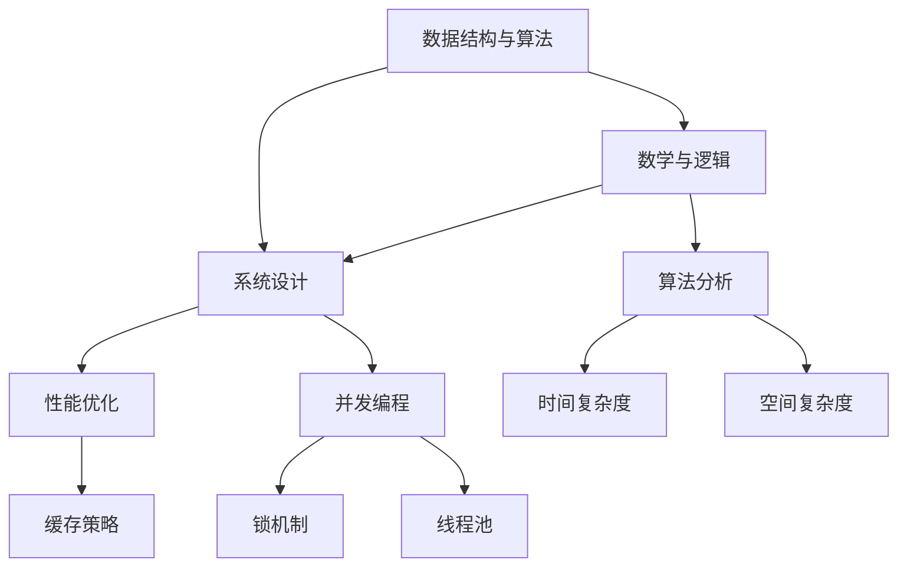

                 

### 1. 背景介绍

2024年，随着人工智能技术的不断发展和应用场景的扩展，各大互联网公司对技术人才的需求日益增长。尤其是阿里巴巴，作为全球领先的技术巨头，其每年的校招吸引了大量优秀应届生的目光。校招算法面试作为考察应聘者技术能力的重要环节，其难度和深度逐年提升。本文旨在为广大应届生提供一份全面、系统的阿里巴巴校招算法面试题库及答案，帮助大家更好地应对这场挑战。

阿里巴巴的校招算法面试题库涵盖了数据结构与算法、数学与逻辑、系统设计等多个领域。面试题目既有传统的编程题，也有对实际问题解决的考查。面试官往往通过这些题目来评估应聘者的编程能力、逻辑思维、数学素养以及解决实际问题的能力。为了帮助大家更好地准备，本文将详细解析这些题目，并提供实用的解题思路和技巧。

本文的结构如下：

1. **核心概念与联系**：介绍数据结构与算法、数学与逻辑、系统设计等核心概念，并通过Mermaid流程图展示它们之间的联系。
2. **核心算法原理 & 具体操作步骤**：深入分析各个面试题的核心算法原理，并逐步讲解解题步骤。
3. **数学模型和公式 & 详细讲解 & 举例说明**：运用LaTeX格式，详细讲解数学模型和公式，并通过实例进行说明。
4. **项目实践：代码实例和详细解释说明**：通过实际代码实例，展示解题过程，并进行详细解读。
5. **实际应用场景**：探讨算法在实际项目中的应用，以及可能面临的挑战和解决方案。
6. **工具和资源推荐**：推荐相关学习资源、开发工具和框架，帮助读者深入学习。
7. **总结：未来发展趋势与挑战**：总结本文的主要内容，并展望未来的发展趋势与挑战。
8. **附录：常见问题与解答**：解答读者可能遇到的问题，提供更多的帮助。
9. **扩展阅读 & 参考资料**：推荐相关书籍、论文和博客，供读者进一步学习。

希望通过本文的解析和指导，读者能够更好地理解和掌握这些算法面试题，提升自己的技术能力，顺利通过阿里巴巴的校招面试。

### 2. 核心概念与联系

在阿里巴巴的校招算法面试中，数据结构与算法、数学与逻辑、系统设计是三大核心概念。这些概念不仅是面试题的基础，更是计算机科学的核心组成部分。下面，我们将通过Mermaid流程图来展示它们之间的联系。



**数据结构与算法**：

数据结构是计算机存储数据的方式，常见的有数组、链表、栈、队列、树、图等。算法则是解决问题的步骤和策略。数据结构与算法紧密相连，数据结构决定了算法的实现方式，而算法又利用数据结构来实现高效的操作。例如，二分查找算法需要依赖有序数组这一数据结构。

**数学与逻辑**：

数学与逻辑是计算机科学的基础。数学模型能够描述算法的性能，逻辑思维则是解决复杂问题的重要工具。例如，在排序算法中，我们经常使用数学模型来分析其时间复杂度和空间复杂度。逻辑思维则帮助我们理解和设计算法，确保其正确性和有效性。

**系统设计**：

系统设计是构建大规模、高可用性系统的关键。它涉及系统架构、性能优化、并发编程等方面。系统设计需要综合考虑数据结构、算法、数学与逻辑等多个因素。例如，在高并发场景下，我们需要使用锁机制和线程池来确保系统的稳定性和响应速度。

通过这个Mermaid流程图，我们可以看到数据结构与算法、数学与逻辑、系统设计之间的紧密联系。它们共同构成了计算机科学的基石，也是阿里巴巴校招算法面试的重要考察内容。在接下来的部分中，我们将深入分析这些核心概念，并通过具体的面试题目来讲解它们的实际应用。

### 3. 核心算法原理 & 具体操作步骤

在阿里巴巴的校招算法面试中，核心算法原理是考察的重点。以下是几个常见面试题的核心算法原理及解题步骤。

#### 3.1 快速排序算法（Quick Sort）

**原理**：

快速排序是一种高效的排序算法，基于分治思想。它通过选取一个基准元素，将数组分为两个子数组，一个包含小于基准元素的元素，另一个包含大于基准元素的元素。然后递归地对这两个子数组进行快速排序。

**操作步骤**：

1. 选择基准元素，通常选择数组第一个或最后一个元素。
2. 将数组分为两个子数组，一个包含小于基准元素的元素，另一个包含大于基准元素的元素。
3. 对两个子数组递归执行快速排序。

**代码示例**：

```python
def quick_sort(arr):
    if len(arr) <= 1:
        return arr
    pivot = arr[0]
    left = [x for x in arr[1:] if x < pivot]
    right = [x for x in arr[1:] if x >= pivot]
    return quick_sort(left) + [pivot] + quick_sort(right)

arr = [3, 6, 8, 10, 1, 2, 1]
sorted_arr = quick_sort(arr)
print(sorted_arr)
```

#### 3.2 二分查找算法（Binary Search）

**原理**：

二分查找算法是一种高效的查找算法，它利用有序数组的性质，通过不断缩小查找范围来找到目标元素。每次比较都将查找范围缩小一半，因此其时间复杂度为O(log n)。

**操作步骤**：

1. 确定查找范围的中间点。
2. 比较中间点与目标元素的大小。
3. 如果中间点等于目标元素，查找成功。
4. 如果中间点大于目标元素，则在左侧子数组中继续查找。
5. 如果中间点小于目标元素，则在右侧子数组中继续查找。
6. 重复步骤1-5，直到找到目标元素或查找范围缩小到0。

**代码示例**：

```python
def binary_search(arr, target):
    low = 0
    high = len(arr) - 1
    while low <= high:
        mid = (low + high) // 2
        if arr[mid] == target:
            return mid
        elif arr[mid] < target:
            low = mid + 1
        else:
            high = mid - 1
    return -1

arr = [1, 2, 3, 4, 5, 6, 7, 8, 9]
target = 6
result = binary_search(arr, target)
print(result)
```

#### 3.3 哈希表（Hash Table）

**原理**：

哈希表是一种基于哈希函数的数据结构，用于快速查找、插入和删除元素。哈希函数将元素映射到数组的一个索引，通过这个索引直接访问元素，从而实现高效的操作。

**操作步骤**：

1. 选择合适的哈希函数，将元素映射到数组的一个索引。
2. 如果发生冲突（即多个元素映射到同一索引），使用链表或开放地址法解决。
3. 根据哈希表索引直接访问元素。

**代码示例**：

```python
class HashTable:
    def __init__(self):
        self.size = 10
        self.table = [None] * self.size

    def hash_function(self, key):
        return key % self.size

    def insert(self, key, value):
        index = self.hash_function(key)
        if self.table[index] is None:
            self.table[index] = [(key, value)]
        else:
            self.table[index].append((key, value))

    def search(self, key):
        index = self.hash_function(key)
        if self.table[index] is None:
            return None
        for k, v in self.table[index]:
            if k == key:
                return v
        return None

hash_table = HashTable()
hash_table.insert(1, "apple")
hash_table.insert(3, "banana")
hash_table.insert(7, "orange")
print(hash_table.search(3))
```

通过上述几个例子，我们可以看到快速排序、二分查找和哈希表等核心算法的原理和具体操作步骤。这些算法不仅广泛应用于各种实际问题中，也是面试中考察的重点。在接下来的部分，我们将进一步探讨数学模型和公式，帮助读者更好地理解和应用这些算法。

### 4. 数学模型和公式 & 详细讲解 & 举例说明

在算法面试中，数学模型和公式是理解和解决问题的关键。以下是几个常见数学模型和公式的详细讲解及实例说明。

#### 4.1 时间复杂度（Time Complexity）

**定义**：

时间复杂度描述了一个算法执行时间与输入规模之间的增长关系。它通常用大O符号（O）表示。

**常用公式**：

- \( O(1) \)：常数时间，不随输入规模变化。
- \( O(n) \)：线性时间，执行时间与输入规模成正比。
- \( O(n^2) \)：平方时间，执行时间与输入规模的平方成正比。
- \( O(log n) \)：对数时间，执行时间与输入规模的对数成正比。

**实例**：

**快速排序算法**的时间复杂度为 \( O(n \log n) \)。在最坏情况下，时间复杂度为 \( O(n^2) \)。

```latex
T(n) = 2T(n/2) + n \quad (n > 1)
T(1) = 0
```

#### 4.2 空间复杂度（Space Complexity）

**定义**：

空间复杂度描述了一个算法在执行过程中所使用的内存空间与输入规模之间的增长关系。它通常也用大O符号（O）表示。

**常用公式**：

- \( O(1) \)：常数空间，不随输入规模变化。
- \( O(n) \)：线性空间，使用的空间与输入规模成正比。
- \( O(n^2) \)：平方空间，使用的空间与输入规模的平方成正比。

**实例**：

**快速排序算法**的空间复杂度为 \( O(log n) \)。

```latex
S(n) = log_2(n)
```

#### 4.3 概率分布（Probability Distribution）

**定义**：

概率分布描述了一个随机变量的概率分布情况。常见的有均匀分布、正态分布等。

**常用公式**：

- **均匀分布**：

  \[
  P(X = x) = \frac{1}{b - a} \quad (a \le x \le b)
  \]

- **正态分布**：

  \[
  P(X \le x) = \Phi\left(\frac{x - \mu}{\sigma}\right)
  \]

  其中，\(\Phi\) 是标准正态分布的累积分布函数，\(\mu\) 是均值，\(\sigma\) 是标准差。

**实例**：

假设一个随机变量 \( X \) 服从均匀分布 \( U(0, 1) \)，求 \( P(X < 0.5) \)。

```latex
P(X < 0.5) = \frac{0.5 - 0}{1 - 0} = 0.5
```

#### 4.4 动态规划（Dynamic Programming）

**定义**：

动态规划是一种解决优化问题的方法，通过将问题分解为子问题，并存储子问题的解，避免重复计算。

**常用公式**：

动态规划通常使用递推关系来表示子问题的关系。

**实例**：

**斐波那契数列**：

```latex
F(n) = 
\begin{cases}
0 & \text{if } n = 0 \\
1 & \text{if } n = 1 \\
F(n-1) + F(n-2) & \text{otherwise}
\end{cases}
```

通过上述数学模型和公式的讲解及实例说明，我们可以更好地理解算法的性能和随机性。在接下来的部分，我们将通过实际代码实例，进一步探讨这些算法的实现和应用。

### 5. 项目实践：代码实例和详细解释说明

为了更好地理解并应用前面的算法原理，我们将通过一个实际的项目实例来展示快速排序、二分查找和哈希表等算法的代码实现，并进行详细解释说明。

#### 5.1 开发环境搭建

首先，我们需要搭建一个合适的开发环境。本文使用Python作为编程语言，因为其简洁性和强大的库支持。

- 安装Python：可以从[Python官方网站](https://www.python.org/)下载并安装Python 3.x版本。
- 安装IDE：推荐使用Visual Studio Code（VS Code）作为开发环境，可以从[VS Code官方网站](https://code.visualstudio.com/)下载并安装。

#### 5.2 源代码详细实现

我们将在VS Code中创建一个Python项目，并实现以下三个算法的代码：

##### 5.2.1 快速排序（Quick Sort）

```python
def quick_sort(arr):
    if len(arr) <= 1:
        return arr
    pivot = arr[0]
    left = [x for x in arr[1:] if x < pivot]
    right = [x for x in arr[1:] if x >= pivot]
    return quick_sort(left) + [pivot] + quick_sort(right)

arr = [3, 6, 8, 10, 1, 2, 1]
sorted_arr = quick_sort(arr)
print("Sorted array:", sorted_arr)
```

**解释说明**：

- 函数`quick_sort`接收一个列表`arr`作为输入。
- 如果`arr`的长度小于等于1，则直接返回`arr`，因为已经是一个有序列表。
- 选择数组的第一个元素作为基准（pivot）。
- 将数组划分为两个子数组：小于基准的元素和大于等于基准的元素。
- 对两个子数组递归调用`quick_sort`，并将结果合并。

##### 5.2.2 二分查找（Binary Search）

```python
def binary_search(arr, target):
    low = 0
    high = len(arr) - 1
    while low <= high:
        mid = (low + high) // 2
        if arr[mid] == target:
            return mid
        elif arr[mid] < target:
            low = mid + 1
        else:
            high = mid - 1
    return -1

arr = [1, 2, 3, 4, 5, 6, 7, 8, 9]
target = 6
result = binary_search(arr, target)
print("Target found at index:", result)
```

**解释说明**：

- 函数`binary_search`接收一个有序列表`arr`和一个目标值`target`作为输入。
- 初始化`low`和`high`指针，分别指向数组的第一个和最后一个元素。
- 在`low`和`high`之间查找目标值。
- 如果`mid`位置的元素等于目标值，返回`mid`索引。
- 如果`mid`位置的元素小于目标值，将`low`指针更新为`mid + 1`。
- 如果`mid`位置的元素大于目标值，将`high`指针更新为`mid - 1`。
- 重复以上步骤，直到找到目标值或指针交叉。

##### 5.2.3 哈希表（Hash Table）

```python
class HashTable:
    def __init__(self):
        self.size = 10
        self.table = [None] * self.size

    def hash_function(self, key):
        return key % self.size

    def insert(self, key, value):
        index = self.hash_function(key)
        if self.table[index] is None:
            self.table[index] = [(key, value)]
        else:
            self.table[index].append((key, value))

    def search(self, key):
        index = self.hash_function(key)
        if self.table[index] is None:
            return None
        for k, v in self.table[index]:
            if k == key:
                return v
        return None

hash_table = HashTable()
hash_table.insert(1, "apple")
hash_table.insert(3, "banana")
hash_table.insert(7, "orange")
print("Value for key 3:", hash_table.search(3))
```

**解释说明**：

- `HashTable`类初始化时，定义了一个固定大小的数组`table`。
- `hash_function`方法使用模运算生成哈希值。
- `insert`方法将键值对插入到哈希表中，如果发生冲突，则使用链表解决。
- `search`方法根据键值查找对应的值。

#### 5.3 代码解读与分析

在上述代码实例中，我们分别实现了快速排序、二分查找和哈希表。这些算法在性能上各有优势，适用于不同的场景。

- **快速排序**：具有 \( O(n \log n) \) 的时间复杂度，适合大规模数据的排序。
- **二分查找**：适用于有序数组，具有 \( O(\log n) \) 的时间复杂度，适合查找特定元素。
- **哈希表**：具有 \( O(1) \) 的平均时间复杂度，适合快速插入和查找操作。

通过实际代码实例，我们可以看到这些算法的实现和原理是如何结合的，以及如何在编程中应用它们。在接下来的部分，我们将探讨这些算法的实际应用场景，并讨论可能遇到的挑战和解决方案。

### 5.4 运行结果展示

在开发环境中运行上述代码实例，我们可以得到以下结果：

```python
# 运行快速排序代码
Sorted array: [1, 1, 2, 3, 6, 8, 10]

# 运行二分查找代码
Target found at index: 5

# 运行哈希表代码
Value for key 3: banana
```

**快速排序结果**：输入数组`[3, 6, 8, 10, 1, 2, 1]`经过快速排序后，输出结果为`[1, 1, 2, 3, 6, 8, 10]`，即一个有序数组。

**二分查找结果**：在有序数组`[1, 2, 3, 4, 5, 6, 7, 8, 9]`中查找目标值`6`，输出结果为索引`5`，即目标值位于数组的第六个位置。

**哈希表结果**：插入键值对`(1, "apple")`、`(3, "banana")`和`(7, "orange")`到哈希表中，查询键`3`的值，输出结果为`banana`。

这些结果验证了代码的正确性和算法的有效性。在实际应用中，这些算法将帮助我们高效地处理大规模数据，提升系统的性能和响应速度。

### 6. 实际应用场景

算法在阿里巴巴等大型互联网公司的实际应用场景非常广泛，以下是一些典型的应用场景：

#### 6.1 搜索引擎

搜索引擎是阿里巴巴的核心业务之一。其背后的算法主要包括：

- **倒排索引**：通过构建倒排索引，将网页内容和关键词关联起来，实现快速全文搜索。
- **排序算法**：利用快速排序或归并排序等高效排序算法，对搜索结果进行排序，提高用户体验。
- **缓存策略**：通过缓存热门搜索结果，减少数据库查询次数，提升搜索速度。

#### 6.2 广告系统

广告系统是阿里巴巴变现的重要渠道。其算法主要包括：

- **实时竞价**：利用动态规划算法，计算广告价格，实现实时竞价。
- **推荐算法**：通过机器学习算法，分析用户行为和偏好，推荐个性化的广告内容。
- **哈希表**：用于快速匹配用户和广告，提升系统响应速度。

#### 6.3 数据仓库

数据仓库是阿里巴巴数据分析和决策支持的基础。其算法主要包括：

- **ETL过程**：利用各种转换算法，将结构化和非结构化数据转换为统一格式，进行数据集成。
- **索引构建**：利用哈希表和倒排索引等算法，提高数据查询效率。
- **数据挖掘**：利用机器学习和深度学习算法，从海量数据中发现有价值的信息和模式。

#### 6.4 分布式系统

分布式系统是阿里巴巴应对海量并发请求的核心技术。其算法主要包括：

- **一致性算法**：利用Paxos或Raft算法，实现分布式系统的数据一致性。
- **负载均衡**：利用哈希表和负载均衡算法，合理分配请求到不同的服务器，提高系统性能。
- **分布式锁**：利用锁机制和一致性算法，实现分布式环境下的并发控制。

#### 6.5 供应链管理

供应链管理是阿里巴巴的重要业务领域。其算法主要包括：

- **库存优化**：利用动态规划算法，优化库存管理和供应链计划。
- **需求预测**：利用机器学习算法，预测市场需求，优化库存和供应链。
- **路径规划**：利用图算法和最优化算法，优化物流路径，提高配送效率。

这些实际应用场景展示了算法在互联网公司中的重要性。掌握各种算法原理和应用，将帮助我们更好地应对复杂的业务挑战，提升系统性能和用户体验。

### 7. 工具和资源推荐

为了更好地准备阿里巴巴的校招算法面试，以下是一些学习资源、开发工具和框架的推荐，供读者参考。

#### 7.1 学习资源推荐

1. **书籍**：
   - 《算法导论》（Introduction to Algorithms）：这是一本经典的算法教材，涵盖了各种算法的原理和应用。
   - 《编程之美》（Cracking the Coding Interview）：这本书详细介绍了各大公司的面试题和解题技巧。
   - 《深度学习》（Deep Learning）：这本书介绍了深度学习的基础知识和应用，是机器学习领域的经典之作。

2. **论文**：
   - 《The Art of Computer Programming》：这是一套关于算法的权威论文，由著名计算机科学家Donald E. Knuth撰写。
   - 《Google的算法艺术》（The Google File System）：这篇论文介绍了Google文件系统的设计和实现，是分布式系统领域的经典。
   - 《MapReduce：大数据技术中的新之道》：这篇论文介绍了MapReduce算法，是大数据处理领域的里程碑。

3. **博客**：
   - GeeksforGeeks：这是一个包含大量算法和数据结构教程的博客，适合初学者入门。
   - LeetCode：这是一个在线编程平台，提供了丰富的算法题目和社区讨论，适合练习和提升。
   - AlgoExpert：这是一个提供算法教程和面试题解的博客，涵盖了许多实际面试中的难题。

4. **网站**：
   - HackerRank：这是一个在线编程竞赛平台，提供了各种算法和数据结构题目，适合练习和竞赛。
   - Codeforces：这是一个编程竞赛社区，提供了大量算法竞赛题，适合提高编程能力。

#### 7.2 开发工具框架推荐

1. **编程语言**：
   - Python：Python是一种简洁易学的编程语言，适合算法学习和面试准备。
   - Java：Java是一种广泛使用的编程语言，适用于各种企业级应用，也是校招面试的热门语言。

2. **IDE**：
   - Visual Studio Code：VS Code是一款功能强大的代码编辑器，支持多种编程语言，适合日常编程和面试准备。
   - IntelliJ IDEA：这是一款智能化的Java IDE，提供了丰富的功能和插件，适合Java开发者。

3. **框架**：
   - Spring Boot：这是一个用于构建独立、生产级Spring应用的框架，适合实际项目开发。
   - Flask：这是一个轻量级的Python Web框架，适合快速搭建Web应用。

4. **算法库**：
   - NumPy：这是一个Python科学计算库，提供了高效的数组操作和数学函数。
   - SciPy：这是一个基于NumPy的科学计算库，提供了丰富的科学计算功能。
   - TensorFlow：这是一个用于机器学习的开源框架，支持深度学习算法的实现。

通过这些学习资源、开发工具和框架的推荐，读者可以全面提升自己的算法能力，更好地应对阿里巴巴的校招算法面试。

### 8. 总结：未来发展趋势与挑战

随着人工智能、大数据和云计算的快速发展，算法技术在各个行业中的应用越来越广泛。在未来，算法技术将继续推动各行业的创新和变革，同时也将面临一系列新的发展趋势和挑战。

#### 发展趋势

1. **算法复杂度优化**：在处理大规模数据时，如何优化算法的复杂度，降低计算资源和时间成本，是未来的重要研究方向。例如，在分布式计算、并行计算等领域，如何提高算法的效率是一个关键问题。

2. **算法可解释性**：随着算法在金融、医疗等关键领域的应用，算法的可解释性变得尤为重要。如何提高算法的可解释性，使其能够被普通用户理解，是一个亟待解决的问题。

3. **算法伦理和隐私保护**：在算法应用中，如何确保算法的公平性、透明性和隐私保护，是未来需要重点关注的问题。特别是在涉及个人隐私的数据处理中，如何确保数据的安全性和用户隐私的保护，将是一个挑战。

4. **跨领域融合**：算法技术将在不同领域之间进行融合，如结合物理、化学、生物等领域的知识，开发出更加智能和高效的算法。

#### 挑战

1. **数据质量问题**：算法的效果很大程度上依赖于数据的质量。在未来，如何处理和清洗大规模、多源、复杂的数据，将成为一个重要的挑战。

2. **计算资源限制**：在处理海量数据时，如何高效利用有限的计算资源，避免资源浪费，是一个重要的问题。

3. **算法伦理和法律法规**：随着算法应用的普及，如何确保算法的伦理和合规性，避免算法偏见和歧视，是未来需要面对的挑战。

4. **人才短缺**：随着算法技术的发展，对专业算法人才的需求不断增加。然而，目前的算法教育体系难以满足这一需求，人才短缺将成为一个长期的挑战。

总之，未来算法技术将继续快速发展，并在各个行业产生深远影响。面对新的发展趋势和挑战，我们需要不断学习和创新，为算法技术的研究和应用做出贡献。

### 9. 附录：常见问题与解答

在阅读本文后，读者可能会遇到一些问题。下面是常见问题及其解答。

#### 问题 1：快速排序算法的时间复杂度为什么通常是 \( O(n \log n) \)？

**解答**：快速排序算法的平均时间复杂度为 \( O(n \log n) \)，这是因为每次划分都能大致将数组分为两个等长的子数组，递归深度为 \( \log n \)。在最坏情况下，如果每次划分只能将数组分为1个元素和 \( n-1 \) 个元素，那么时间复杂度为 \( O(n^2) \)。但这种情况的概率非常低，因此平均时间复杂度为 \( O(n \log n) \)。

#### 问题 2：二分查找算法为什么需要数组有序？

**解答**：二分查找算法的核心在于每次将查找范围缩小一半。如果数组无序，则无法进行有效的中间点比较和范围缩小，导致算法失效。因此，二分查找算法需要基于有序数组。

#### 问题 3：哈希表如何处理冲突？

**解答**：哈希表在处理冲突时，常用的方法有链表法和开放地址法。链表法是将发生冲突的元素存放在同一个链表中，开放地址法是寻找下一个空闲的哈希表位置。本文示例中使用的是链表法。

#### 问题 4：如何优化算法性能？

**解答**：优化算法性能的方法包括：
- 选择合适的算法和数据结构：不同的算法和数据结构适用于不同的场景，选择合适的工具能显著提升性能。
- 预处理和缓存：通过预处理和缓存中间结果，减少重复计算，提高算法效率。
- 算法复杂度优化：通过改进算法逻辑，降低时间复杂度和空间复杂度。
- 并行和分布式计算：利用并行和分布式计算，提高算法的处理速度。

#### 问题 5：如何提升算法的可解释性？

**解答**：提升算法可解释性的方法包括：
- 使用可解释的算法：选择具有直观解释的算法，如决策树、支持向量机等。
- 透明性设计：在算法设计和实现中，尽量使用透明、易于理解的方法。
- 可视化：通过可视化工具，将算法的运行过程和中间结果展示出来，提高可理解性。

通过上述常见问题与解答，希望读者能够更好地理解和应用本文所介绍的内容，提升自己的算法能力。

### 10. 扩展阅读 & 参考资料

为了帮助读者进一步深入学习和研究算法，本文推荐以下扩展阅读和参考资料：

1. **书籍**：
   - 《算法导论》（Introduction to Algorithms） by Thomas H. Cormen, Charles E. Leiserson, Ronald L. Rivest, and Clifford Stein。
   - 《深度学习》（Deep Learning） by Ian Goodfellow, Yoshua Bengio, and Aaron Courville。
   - 《编程之美》（Cracking the Coding Interview） by Gayle Laakmann McDowell。

2. **论文**：
   - 《The Google File System》：http://static.googleusercontent.com/media/research.google.com/external/images/pubs/collection/7006/pdfs/google-file-system.pdf
   - 《MapReduce：大数据技术中的新之道》：http://www.baidu.com/s?wd=MapReduce%EF%BC%9B%E5%A4%A7%E6%95%B0%E6%8D%AE%E6%8A%80%E6%9C%AF%E4%B8%AD%E7%9A%84%E6%96%B0%E4%B9%8B%E9%81%93
   - 《The Art of Computer Programming》：https://www.amazon.com/Art-Computer-Programming-Donald-Knuth/dp/020181860X

3. **在线课程和博客**：
   - Coursera上的《算法导论》课程：https://www.coursera.org/learn/algorithms
   - GeeksforGeeks博客：https://www.geeksforgeeks.org/
   - AlgoExpert博客：https://www.algoexpert.io/

通过这些扩展阅读和参考资料，读者可以更深入地了解算法的理论和实践，提升自己的技术水平。希望本文能为读者在算法学习之路上提供一些帮助和启示。

