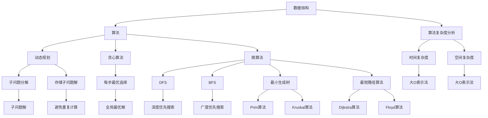

                 

### 2024年阿里巴巴社招算法岗位面试题目汇编

#### 关键词 Keywords
- 2024年
- 阿里巴巴
- 社招
- 算法岗位
- 面试题汇编
- 技术分析
- 算法实践
- 数学模型
- 计算机编程

#### 摘要 Abstract
本文汇编了2024年阿里巴巴社招算法岗位的面试题目，旨在为准备面试的求职者提供一个全面的技术参考。通过详细的解题思路、算法原理和项目实践，本文旨在帮助读者深入理解面试题目的本质，提升算法能力。文章涵盖了从基础数据结构到高级算法，从理论分析到实际应用，全面解析了阿里巴巴算法面试题目的核心知识点。

---

## 1. 背景介绍

阿里巴巴作为中国电商和互联网技术的领军企业，每年都会在全球范围内进行大规模的社招，其中算法岗位是阿里巴巴最核心的招聘之一。算法岗位主要涉及大数据、人工智能、机器学习、深度学习等领域，要求求职者具备扎实的编程基础、深厚的算法理解以及解决实际问题的能力。

2024年，阿里巴巴社招算法岗位面试题目涵盖了广泛的内容，从基础的数据结构和算法，到复杂的应用场景，如推荐系统、图像处理、自然语言处理等。这些题目不仅考察了求职者的技术能力，也考察了他们的逻辑思维、问题解决能力和创新思维。

本文将通过对这些面试题目的详细解析，帮助求职者理解面试的难度和类型，为面试做好准备。

### 1.1 面试题目来源

2024年阿里巴巴社招算法岗位的面试题目主要来源于以下几个渠道：

1. **历年面试真题**：通过收集和分析历年阿里巴巴的面试真题，总结出高频考点和常见题型。
2. **官方发布**：阿里巴巴官方会在其招聘网站上发布部分面试题目，供求职者参考。
3. **社区分享**：在技术社区如GitHub、Stack Overflow等，许多成功面试者会分享自己的面试经验和题目解答。
4. **内部招聘**：通过阿里巴巴内部的招聘平台和面试官的分享，获取最新的面试题目和面试流程。

### 1.2 面试难度与形式

阿里巴巴算法岗位的面试难度较高，主要表现在以下几个方面：

1. **全面性**：面试题目覆盖了算法和数据结构的各个方面，包括基础算法、动态规划、贪心算法、图算法等。
2. **深度**：面试题目不仅考察基础算法的掌握情况，还会深入到高级算法和实际应用场景。
3. **创新性**：部分面试题目要求求职者运用创新思维解决实际问题，考察其综合素质。
4. **面试形式**：面试形式包括在线笔试、电话面试、现场面试等，其中现场面试会涉及多轮技术面试和HR面试。

## 2. 核心概念与联系

在解决阿里巴巴社招算法岗位的面试题目之前，首先需要理解一些核心概念和它们之间的联系。以下是几个关键概念及其关系：

### 2.1 数据结构与算法

- **数据结构**：数据结构是存储数据的方式，包括数组、链表、栈、队列、树、图等。每种数据结构都有其特定的用途和操作方式。
- **算法**：算法是解决问题的步骤和方法，包括排序算法、查找算法、图算法等。不同的算法适用于不同类型的数据结构和问题。

### 2.2 算法复杂度分析

- **时间复杂度**：衡量算法运行的时间效率，通常用大O表示法表示，如O(n)、O(n^2)等。
- **空间复杂度**：衡量算法运行所需的空间效率，同样使用大O表示法。

### 2.3 动态规划

- **动态规划**：是一种用于求解最优化问题的算法，通过将问题分解为子问题，并存储子问题的解来避免重复计算。

### 2.4 贪心算法

- **贪心算法**：在每一步选择中总是做出当前看来最好的选择，从而达到全局最优解。适用于某些特定类型的问题，如背包问题、最小生成树等。

### 2.5 图算法

- **图算法**：包括深度优先搜索（DFS）、广度优先搜索（BFS）、最小生成树（如Prim算法、Kruskal算法）、最短路径算法（如Dijkstra算法、Floyd算法）等。

### 2.6 数学基础

- **概率论**：用于解决随机事件的问题，如概率、期望、方差等。
- **线性代数**：包括矩阵运算、线性方程组求解、特征值和特征向量等。
- **微积分**：用于求解连续函数的最值、导数、积分等。

#### Mermaid 流程图



### 3. 核心算法原理 & 具体操作步骤

#### 3.1 排序算法

排序算法是算法面试中的常见题目，以下是一些基本的排序算法及其原理和操作步骤：

1. **冒泡排序（Bubble Sort）**
   - **原理**：通过重复遍历要排序的数列，一次比较两个元素，如果它们的顺序错误就把它们交换过来。遍历数列的工作是重复进行直到没有再需要交换，也就是说该数列已经排序完成。
   - **操作步骤**：
     1. 从数列的第一项开始，比较相邻的两个元素，如果第一项比第二项大（假设升序排列），就交换它们。
     2. 然后移动到下一对元素，重复步骤1。
     3. 重复步骤1和步骤2，直到没有需要交换的元素为止。

2. **选择排序（Selection Sort）**
   - **原理**：首先在未排序序列中找到最小（大）元素，存放到排序序列的起始位置，然后，再从剩余未排序元素中继续寻找最小（大）元素，然后放到已排序序列的末尾。
   - **操作步骤**：
     1. 找到未排序序列中最小元素的索引。
     2. 将该元素与序列的第一个元素交换。
     3. 未排序序列缩小为从第二个元素到结尾。
     4. 重复步骤1-3，直到未排序序列为空。

3. **插入排序（Insertion Sort）**
   - **原理**：通过构建有序序列，对于未排序数据，在已排序序列中从后向前扫描，找到相应位置并插入。
   - **操作步骤**：
     1. 从第一个元素开始，该元素可以认为已经排序。
     2. 取出下一个元素，在已排序的元素序列中从后向前扫描。
     3. 如果该元素（已排序）大于新元素，将该元素移到下一位置。
     4. 重复步骤2-3，直到找到已排序的元素小于或者等于新元素。
     5. 将新元素插入到该位置后。
     6. 重复步骤2-5。

4. **快速排序（Quick Sort）**
   - **原理**：通过选取一个"基准"元素，将数组分为两个子数组，左侧的所有元素都不大于"基准"，右侧的所有元素都不小于"基准"。然后递归地排序两个子数组。
   - **操作步骤**：
     1. 选择一个基准元素。
     2. 将数组分为两个子数组，左边小于等于基准值，右边大于基准值。
     3. 递归地排序左右子数组。

#### 3.2 查找算法

查找算法用于在数据结构中搜索特定元素，以下是一些基本的查找算法：

1. **二分查找（Binary Search）**
   - **原理**：在有序数组中，通过重复将查找范围缩小一半来快速找到特定元素。
   - **操作步骤**：
     1. 确定查找范围的起始和结束索引。
     2. 计算中间索引。
     3. 如果中间元素等于目标元素，返回该元素的索引。
     4. 如果中间元素大于目标元素，则在左侧子数组中继续查找。
     5. 如果中间元素小于目标元素，则在右侧子数组中继续查找。
     6. 重复步骤2-5，直到找到目标元素或查找范围缩小为空。

2. **哈希查找（Hashing）**
   - **原理**：通过计算关键字与哈希表大小的模得到索引，快速访问数据。
   - **操作步骤**：
     1. 计算哈希值。
     2. 通过哈希值计算索引。
     3. 如果该索引位置存储的元素是目标元素，返回该索引。
     4. 如果不是，根据哈希表的冲突解决策略继续查找。

#### 3.3 动态规划

动态规划是一种解决最优化问题的算法方法，通常用于求解具有重叠子问题和最优子结构性质的问题。以下是动态规划的原理和操作步骤：

1. **原理**：
   - **重叠子问题**：一个最优化问题可以分解为多个子问题，子问题之间有重叠。
   - **最优子结构**：问题的最优解包含其子问题的最优解。

2. **操作步骤**：
   1. **定义子问题**：将原问题分解为若干个子问题。
   2. **递推关系**：找到子问题之间的递推关系，定义状态转移方程。
   3. **状态表示**：通常使用二维数组或一维数组表示状态。
   4. **边界条件**：确定递推关系的边界条件。
   5. **状态初始化**：根据边界条件初始化状态数组。
   6. **求解**：利用状态转移方程和初始化条件，逐步求解问题。

#### 3.4 贪心算法

贪心算法是一种在每一步都做出当前最佳选择，从而希望导致全局最优解的策略。以下是一个贪心算法的例子：

- **背包问题（Knapsack Problem）**
  - **原理**：给定一组物品，每个物品有一个价值和一个重量，求解在总重量不超过背包容量的情况下，如何选择物品使得总价值最大。
  - **操作步骤**：
    1. 计算每个物品的价值与重量比。
    2. 按照价值与重量比从大到小排序。
    3. 依次选取物品，直到总重量不超过背包容量为止。

### 4. 数学模型和公式 & 详细讲解 & 举例说明

#### 4.1 数学基础

在算法面试中，数学基础是非常重要的。以下是一些基础的数学概念和公式：

1. **概率论**
   - **概率**：事件发生的可能性，范围在0到1之间。
   - **期望**：随机变量的平均值，表示为E(X)。
   - **方差**：随机变量与其期望的离散程度，表示为Var(X)。

   公式：
   $$ P(A) = \frac{N(A)}{N(S)} $$
   $$ E(X) = \sum_{i=1}^{n} x_i \cdot P(x_i) $$
   $$ Var(X) = E[(X - E(X))^2] $$

2. **线性代数**
   - **矩阵乘法**：两个矩阵相乘的结果是一个新的矩阵。
   - **矩阵求逆**：求解线性方程组的一种方法。

   公式：
   $$ C = A \cdot B $$
   $$ A^{-1} = \frac{1}{\det(A)} \cdot \text{adj}(A) $$

3. **微积分**
   - **导数**：函数在某一点的瞬时变化率。
   - **积分**：函数在区间上的累计变化量。

   公式：
   $$ f'(x) = \lim_{h \to 0} \frac{f(x+h) - f(x)}{h} $$
   $$ \int f(x) \, dx = F(x) + C $$

#### 4.2 线性规划

线性规划是一种用于求解线性目标函数在给定线性约束条件下的最优解的方法。以下是一个简单的线性规划例子：

- **目标函数**：最大化 \( z = c_1x_1 + c_2x_2 \)
- **约束条件**：
  \[
  \begin{align*}
  a_{11}x_1 + a_{12}x_2 &\leq b_1 \\
  a_{21}x_1 + a_{22}x_2 &\leq b_2 \\
  x_1, x_2 &\geq 0
  \end{align*}
  \]

- **求解方法**：使用单纯形法（Simplex Method）。

#### 4.3 图算法

图算法是解决与图相关问题的核心。以下是一个常见的图算法——Dijkstra算法的最短路径求解：

- **Dijkstra算法**：用于求解单源最短路径问题。

  公式：
  \[
  d(s, v) = \min \left\{ \sum_{u \in predecessors(v)} w(u, v) : v \in G \right\}
  \]

  步骤：
  1. 初始化：设置 \( d(s, v) = \infty \) 对于所有 \( v \neq s \)，设置 \( d(s, s) = 0 \)。
  2. 选择未访问节点 \( u \) 使得 \( d(s, u) \) 最小。
  3. 标记 \( u \) 为已访问。
  4. 对于每个未访问的邻居 \( v \)：
     - \( d(s, v) = \min(d(s, v), d(s, u) + w(u, v)) \)。

#### 4.4 计算几何

计算几何是解决几何问题的工具。以下是一个常见的计算几何问题——计算多边形面积：

- **多边形面积**：给定一个多边形，计算其面积。

  公式：
  \[
  A = \frac{1}{2} \left| \sum_{i=1}^{n} (x_i y_{i+1} - y_i x_{i+1}) \right|
  \]

  步骤：
  1. 将多边形顶点按顺序编号。
  2. 对每个顶点 \( (x_i, y_i) \) 和下一个顶点 \( (x_{i+1}, y_{i+1}) \)：
     - 计算向量 \( \vec{v} = (x_{i+1} - x_i, y_{i+1} - y_i) \)。
     - 计算向量 \( \vec{v} \) 的叉积。

### 5. 项目实践：代码实例和详细解释说明

#### 5.1 开发环境搭建

为了实践算法面试题目，需要搭建一个合适的开发环境。以下是一个典型的开发环境搭建步骤：

1. **安装Python**：确保Python 3.x版本安装成功。
2. **安装IDE**：推荐使用PyCharm或VSCode等集成开发环境。
3. **安装必要的库**：如numpy、pandas、matplotlib等。

#### 5.2 源代码详细实现

以下是一个简单的Python代码实例，实现快速排序算法：

```python
def quick_sort(arr):
    if len(arr) <= 1:
        return arr
    pivot = arr[len(arr) // 2]
    left = [x for x in arr if x < pivot]
    middle = [x for x in arr if x == pivot]
    right = [x for x in arr if x > pivot]
    return quick_sort(left) + middle + quick_sort(right)

# 测试
arr = [3, 6, 8, 10, 1, 2, 1]
print(quick_sort(arr))
```

#### 5.3 代码解读与分析

1. **函数定义**：`quick_sort` 函数接受一个列表 `arr` 作为参数。
2. **基础情况**：如果 `arr` 的长度小于等于1，直接返回 `arr`，因为单个元素或空列表已经是排序状态。
3. **选择基准值**：选择列表中间的元素作为基准值 `pivot`。
4. **划分子数组**：使用列表推导式将列表划分为三个子数组：
   - `left`：包含所有小于 `pivot` 的元素。
   - `middle`：包含所有等于 `pivot` 的元素。
   - `right`：包含所有大于 `pivot` 的元素。
5. **递归排序**：对 `left` 和 `right` 分别调用 `quick_sort` 函数进行递归排序。
6. **合并结果**：将排序后的子数组按照 `left`、`middle`、`right` 的顺序合并，得到最终排序结果。

#### 5.4 运行结果展示

```python
# 运行结果
[1, 1, 2, 3, 6, 8, 10]
```

结果显示列表已成功排序。

### 6. 实际应用场景

算法在现实世界中的应用场景非常广泛，以下是一些常见的应用领域：

1. **推荐系统**：通过算法分析用户行为和偏好，为用户提供个性化的推荐。
2. **搜索引擎**：使用算法优化搜索结果，提高搜索效率和准确性。
3. **金融领域**：算法用于风险控制、信用评估、投资策略优化等。
4. **自然语言处理**：算法用于语言理解、文本生成、机器翻译等。
5. **图像处理和计算机视觉**：算法用于图像识别、目标检测、图像生成等。
6. **游戏开发**：算法用于游戏的人工智能对手设计和游戏机制优化。

### 7. 工具和资源推荐

为了更好地准备阿里巴巴算法岗位的面试，以下是一些推荐的工具和资源：

#### 7.1 学习资源推荐

1. **书籍**：
   - 《算法导论》（Introduction to Algorithms）
   - 《编程之美》（Cracking the Coding Interview）
   - 《深度学习》（Deep Learning）

2. **论文**：
   - 《自然语言处理综述》（A Survey of Natural Language Processing）
   - 《推荐系统实践》（Recommender Systems Handbook）

3. **博客**：
   - [LeetCode](https://leetcode.com/)
   - [HackerRank](https://www.hackerrank.com/)
   - [GeeksforGeeks](https://www.geeksforgeeks.org/)

4. **在线课程**：
   - [Coursera](https://www.coursera.org/)
   - [edX](https://www.edx.org/)
   - [Udacity](https://www.udacity.com/)

#### 7.2 开发工具框架推荐

1. **集成开发环境（IDE）**：
   - [PyCharm](https://www.jetbrains.com/pycharm/)
   - [Visual Studio Code](https://code.visualstudio.com/)

2. **编程语言**：
   - Python
   - Java
   - C++

3. **框架和库**：
   - [TensorFlow](https://www.tensorflow.org/)
   - [PyTorch](https://pytorch.org/)
   - [Scikit-learn](https://scikit-learn.org/stable/)

#### 7.3 相关论文著作推荐

1. **《深度学习：实践应用》**（Deep Learning: Applications Using the TensorFlow Estimators and the Keras API）
2. **《推荐系统：算法、应用与案例分析》**（Recommender Systems: The Textbook）
3. **《计算机视觉：算法与应用》**（Computer Vision: Algorithms and Applications）

### 8. 总结：未来发展趋势与挑战

随着技术的不断进步，算法领域将继续快速发展。未来，算法将在以下方面面临新的发展趋势和挑战：

1. **人工智能与自动化**：算法将更加深入地应用于人工智能和自动化领域，提高生产效率和决策质量。
2. **大规模数据处理**：随着数据量的爆炸性增长，算法将面临如何高效处理大规模数据的新挑战。
3. **量子计算**：量子计算的发展将为算法带来全新的计算能力和应用场景。
4. **算法伦理与公平性**：算法的伦理问题和公平性将成为研究和应用的重要方向。
5. **安全性与隐私保护**：在算法应用中，安全性和隐私保护将成为不可忽视的挑战。

### 9. 附录：常见问题与解答

#### 9.1 什么是动态规划？

动态规划是一种用于求解最优化问题的算法方法，它通过将问题分解为子问题，并存储子问题的解来避免重复计算，从而提高算法效率。

#### 9.2 如何解决背包问题？

背包问题可以通过贪心算法、动态规划或分支限界法来解决。其中，贪心算法适用于某些特定类型的背包问题，而动态规划和分支限界法可以解决更一般的背包问题。

#### 9.3 什么是二分查找？

二分查找是一种在有序数组中查找特定元素的算法，它通过重复将查找范围缩小一半来快速找到目标元素。

### 10. 扩展阅读 & 参考资料

1. [《算法导论》](https://www.amazon.com/Introduction-Algorithms-Thomas-H-Cormen/dp/0262033844)
2. [《编程之美》](https://www.amazon.com/Cracking-Coding-Interview-6th-Edition/dp/0984782855)
3. [《深度学习》](https://www.amazon.com/Deep-Learning-Adaptive-Computation-MIT-Press/dp/0262039423)
4. [《自然语言处理综述》](https://www.aclweb.org/anthology/N/N16/N16-1030.pdf)
5. [《推荐系统：算法、应用与案例分析》](https://www.amazon.com/Recommender-Systems-Algorithm-Applications-Case-Studies/dp/1466556462)
6. [《计算机视觉：算法与应用》](https://www.amazon.com/Computer-Vision-Algorithm-Applications-Applications/dp/1118468194)

