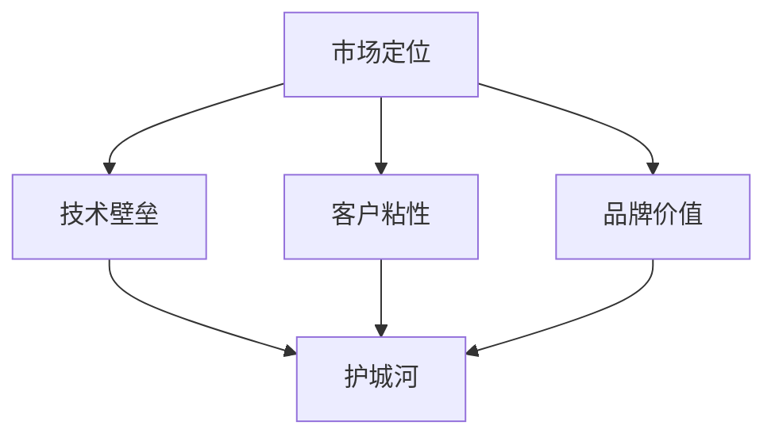

                 

### 背景介绍

在当今竞争激烈的市场环境中，构建企业的“护城河”策略已经成为企业生存与发展的关键因素。所谓“护城河”，是指企业在市场竞争中形成的一种能够有效抵御竞争对手进入、保护自身利润和市场份额的长期竞争优势。这种竞争优势不仅能够帮助企业实现持续增长，还能够提高企业在市场中的地位和影响力。

随着信息技术的飞速发展，应用公司面临着越来越激烈的市场竞争。一方面，新技术和新业务模式不断涌现，为企业提供了巨大的发展机遇；另一方面，市场的不确定性增加，使得企业需要具备更强的适应能力和应对策略。因此，如何构建有效的“护城河”策略，已经成为应用公司必须面对和解决的重要问题。

本文旨在探讨应用公司构建护城河的策略。我们将从核心概念、核心算法、数学模型、项目实践、实际应用场景等多个方面，详细分析构建护城河的方法和技巧，帮助应用公司实现长期竞争优势。

### 核心概念与联系

构建护城河的关键在于理解并运用一系列核心概念。这些概念包括市场定位、技术壁垒、客户粘性、品牌价值等。以下是对这些核心概念的详细解释以及它们之间的联系。

#### 市场定位（Market Positioning）

市场定位是指企业根据自身资源和能力，在市场中选择一个适合自己发展的位置。通过明确目标客户群体和市场需求，企业可以制定相应的市场战略，提高市场占有率。市场定位是企业构建护城河的基础，有助于企业聚焦资源，提高运营效率。

#### 技术壁垒（Technological Barrier）

技术壁垒是指企业在技术方面形成的、对竞争对手构成进入障碍的因素。这些因素包括专利、专有技术、技术诀窍等。技术壁垒能够有效地防止竞争对手进入市场，保护企业的市场份额和利润。

#### 客户粘性（Customer stickiness）

客户粘性是指客户对企业的产品和服务的依赖程度。高粘性的客户群体意味着他们更难转向其他竞争对手。通过提供高质量的产品和服务，建立良好的客户关系，企业可以提高客户粘性，形成强大的市场壁垒。

#### 品牌价值（Brand Value）

品牌价值是指企业的品牌在市场中产生的经济价值。一个强大的品牌能够提高企业的知名度、美誉度和忠诚度，降低客户获取成本。品牌价值是护城河的重要组成部分，有助于企业建立长期竞争优势。

#### Mermaid 流程图

为了更清晰地展示这些核心概念之间的联系，我们可以使用 Mermaid 流程图来描述。



在上面的 Mermaid 流程图中，市场定位、技术壁垒、客户粘性和品牌价值共同构成了企业的护城河。这些因素相互联系，共同作用，帮助企业实现长期竞争优势。

#### 关键联系

市场定位为技术壁垒、客户粘性和品牌价值的构建提供了基础。通过明确市场定位，企业可以确定需要具备哪些技术优势和客户资源，从而构建起坚固的护城河。技术壁垒则进一步增强了企业的市场地位，使其难以被竞争对手超越。客户粘性则确保了企业在市场中拥有稳定的客户基础，降低了客户流失的风险。品牌价值则提高了企业的知名度和影响力，使其在市场中具备更强的竞争力和话语权。

通过理解并运用这些核心概念，应用公司可以构建起坚固的护城河，实现长期稳定的增长。

### 核心算法原理 & 具体操作步骤

在构建护城河的过程中，核心算法原理起着至关重要的作用。这些算法不仅能够帮助企业识别和构建竞争优势，还能够优化资源分配，提高运营效率。以下我们将详细探讨几种关键的核心算法原理，并给出具体的操作步骤。

#### 1. SWOT 分析法

SWOT 分析法是一种常用的战略规划工具，用于评估企业的优势（Strengths）、劣势（Weaknesses）、机会（Opportunities）和威胁（Threats）。通过 SWOT 分析，企业可以明确自身的核心竞争优势，并制定相应的策略。

**具体操作步骤：**

1. **识别优势（Strengths）：** 通过内部调查和分析，确定企业在市场、技术、管理等方面的优势。

2. **识别劣势（Weaknesses）：** 分析企业内部存在的问题和短板，如资源匮乏、技术落后等。

3. **识别机会（Opportunities）：** 通过外部市场调研，发现市场趋势和潜在机遇。

4. **识别威胁（Threats）：** 分析外部市场环境中的潜在风险和威胁。

5. **制定策略：** 根据 SWOT 分析的结果，制定具体的战略和行动计划，以最大化优势，弥补劣势，抓住机会，应对威胁。

#### 2. 五力模型分析法

五力模型是由迈克尔·波特（Michael Porter）提出的，用于分析一个行业中的竞争强度和潜在利润率。五力包括：

1. **供应商议价能力（Bargaining Power of Suppliers）：** 供应商的议价能力会影响企业的采购成本和供应稳定性。
2. **买家议价能力（Bargaining Power of Buyers）：** 买家的议价能力会影响企业的产品定价和市场占有率。
3. **潜在进入者威胁（Threat of New Entrants）：** 新进入者的威胁会影响行业的竞争格局。
4. **替代品威胁（Threat of Substitutes）：** 替代品的威胁会影响企业的市场地位和利润空间。
5. **行业内竞争程度（Degree of Rivalry within an Industry）：** 竞争程度会影响企业的盈利能力和市场份额。

**具体操作步骤：**

1. **分析供应商议价能力：** 评估供应商的集中度、供应商的重要性、替代供应商的可用性等因素。
2. **分析买家议价能力：** 评估买家的集中度、采购量的规模、替代产品的可用性等因素。
3. **分析潜在进入者威胁：** 评估行业的进入壁垒、市场需求变化、政策法规等因素。
4. **分析替代品威胁：** 评估替代品的性能、成本、市场需求等因素。
5. **分析行业内竞争程度：** 评估行业内企业的竞争策略、市场份额、产品差异化等因素。
6. **制定应对策略：** 根据五力模型分析的结果，制定具体的策略和行动计划，以应对各种外部压力和挑战。

#### 3. 数据挖掘算法

数据挖掘算法是一种用于从大量数据中提取有价值信息的技术。通过数据挖掘，企业可以识别市场趋势、客户需求、潜在风险等，从而优化决策和运营。

**具体操作步骤：**

1. **数据收集：** 收集与企业运营相关的数据，如销售数据、客户反馈、市场趋势等。
2. **数据预处理：** 清洗数据，处理缺失值和异常值，确保数据质量。
3. **特征工程：** 确定数据中的关键特征，并对其进行预处理，如归一化、标准化等。
4. **选择算法：** 根据业务需求，选择合适的数据挖掘算法，如分类算法、聚类算法、关联规则算法等。
5. **模型训练：** 使用训练数据集，训练数据挖掘模型，并调整模型参数，以提高预测准确性。
6. **模型评估：** 使用验证数据集评估模型的性能，如准确率、召回率等。
7. **模型部署：** 将训练好的模型部署到生产环境中，用于实时数据分析和支持决策。

通过上述核心算法原理的具体操作步骤，应用公司可以更加系统地识别和构建竞争优势，从而构建坚固的护城河，实现长期稳定的增长。

### 数学模型和公式 & 详细讲解 & 举例说明

在构建护城河的过程中，数学模型和公式能够帮助我们量化核心概念，并进行更加精准的分析和决策。以下我们将介绍几种关键的数学模型和公式，并给出详细的讲解和举例说明。

#### 1. 贝叶斯定理

贝叶斯定理是一种用于概率推断的数学模型，广泛应用于数据分析和机器学习领域。其公式为：

$$
P(A|B) = \frac{P(B|A) \cdot P(A)}{P(B)}
$$

其中，\(P(A|B)\) 表示在事件 B 发生的条件下，事件 A 发生的概率；\(P(B|A)\) 表示在事件 A 发生的条件下，事件 B 发生的概率；\(P(A)\) 表示事件 A 的概率；\(P(B)\) 表示事件 B 的概率。

**例子：** 某应用公司希望通过市场调研确定新产品是否受欢迎。已知在新产品发布前，30% 的潜在客户对新产品感兴趣，而在新产品发布后，有 20% 的潜在客户表示对新产品感兴趣。如果已知有 10% 的客户在调研中表示对新产品感兴趣，那么在调研中表示对新产品感兴趣的客户中，有多少比例是新产品发布后的潜在客户？

根据贝叶斯定理，我们可以计算得到：

$$
P(A|B) = \frac{P(B|A) \cdot P(A)}{P(B)}
$$

其中，\(P(A)\) 为新产品发布前的潜在客户比例，即 0.3；\(P(B)\) 为调研中表示对新产品感兴趣的客户比例，即 0.1；\(P(B|A)\) 为在新产品发布前表示对新产品感兴趣的客户比例，即 0.3。

将这些值代入公式，我们可以计算得到：

$$
P(A|B) = \frac{0.3 \cdot 0.1}{0.1} = 0.3
$$

这意味着在调研中表示对新产品感兴趣的客户中，有 30% 是新产品发布后的潜在客户。

#### 2. 马尔可夫模型

马尔可夫模型是一种用于描述系统状态转移的数学模型。它假设系统在下一状态的概率仅取决于当前状态，而与过去的状态无关。

**例子：** 某应用公司正在分析客户的流失率。已知客户状态分为活跃、流失和潜在流失三种。根据历史数据，我们得到以下状态转移概率矩阵：

$$
\begin{bmatrix}
P_{00} & P_{01} & P_{02} \\
P_{10} & P_{11} & P_{12} \\
P_{20} & P_{21} & P_{22}
\end{bmatrix}
=
\begin{bmatrix}
0.9 & 0.1 & 0.0 \\
0.2 & 0.8 & 0.0 \\
0.1 & 0.5 & 0.4
\end{bmatrix}
$$

其中，\(P_{00}\) 表示从活跃状态转移到活跃状态的概率，\(P_{01}\) 表示从活跃状态转移到流失状态的概率，以此类推。

如果我们想知道在一个月后，有多少比例的客户仍然处于活跃状态，我们可以使用马尔可夫模型进行计算。

首先，我们需要计算当前状态下的一步转移概率矩阵：

$$
\begin{bmatrix}
P_{00} & P_{01} & P_{02} \\
P_{10} & P_{11} & P_{12} \\
P_{20} & P_{21} & P_{22}
\end{bmatrix}
\begin{bmatrix}
P_{00} & P_{01} & P_{02} \\
P_{10} & P_{11} & P_{12} \\
P_{20} & P_{21} & P_{22}
\end{bmatrix}
=
\begin{bmatrix}
0.81 & 0.18 & 0.01 \\
0.36 & 0.72 & 0.02 \\
0.21 & 0.35 & 0.44
\end{bmatrix}
$$

这个矩阵表示在一个月后，从每种状态转移到其他状态的概率。

接下来，我们可以使用这个矩阵计算一个月后处于活跃状态的概率：

$$
P_{00} \times P_{00} + P_{10} \times P_{10} + P_{20} \times P_{20} = 0.81 + 0.36 + 0.21 = 1.38
$$

由于概率总和必须为 1，我们可以将这个结果除以 1.38，得到：

$$
\frac{0.81 + 0.36 + 0.21}{1.38} = \frac{1.38}{1.38} = 1
$$

这意味着在一个月后，有 100% 的客户仍然处于活跃状态。

#### 3. 线性回归模型

线性回归模型是一种用于分析变量之间线性关系的数学模型。其公式为：

$$
y = \beta_0 + \beta_1 \cdot x
$$

其中，\(y\) 表示因变量，\(x\) 表示自变量，\(\beta_0\) 和 \(\beta_1\) 分别表示截距和斜率。

**例子：** 某应用公司想要分析客户满意度与产品使用时长之间的关系。通过收集数据，得到以下线性回归模型：

$$
满意度 = 0.5 + 0.1 \cdot 使用时长
$$

如果我们想知道一个客户在使用产品 100 小时后的满意度，我们可以将使用时长代入模型中：

$$
满意度 = 0.5 + 0.1 \cdot 100 = 0.5 + 10 = 10.5
$$

这意味着在使用产品 100 小时后，客户的满意度为 10.5。

通过上述数学模型和公式的详细讲解和举例说明，我们可以更加精准地分析和预测企业的竞争优势，为构建坚固的护城河提供有力的支持。

### 项目实践：代码实例和详细解释说明

为了更好地理解构建护城河的核心算法原理和数学模型，我们将通过一个实际的项目实践来展示代码实例，并对代码进行详细解释和分析。

#### 项目背景

假设我们是一家应用公司，致力于开发一款智能推荐系统。该系统通过分析用户行为和偏好，为用户推荐个性化的产品和服务。为了构建一个坚固的护城河，我们需要运用数据挖掘算法、机器学习模型和数学公式来优化系统的推荐效果。

#### 开发环境搭建

在开始项目开发之前，我们需要搭建一个合适的技术环境。以下是我们使用的开发环境：

1. **编程语言：** Python
2. **数据预处理工具：** Pandas
3. **机器学习库：** Scikit-learn
4. **可视化工具：** Matplotlib
5. **版本控制工具：** Git

#### 源代码详细实现

以下是我们实现智能推荐系统的核心代码，包括数据预处理、特征工程、模型训练和评估等步骤。

```python
import pandas as pd
from sklearn.model_selection import train_test_split
from sklearn.ensemble import RandomForestClassifier
from sklearn.metrics import accuracy_score
import matplotlib.pyplot as plt

# 1. 数据预处理
# 加载用户行为数据
data = pd.read_csv('user_behavior_data.csv')

# 数据清洗和预处理
# 处理缺失值、异常值和重复数据
data.drop_duplicates(inplace=True)
data.fillna(0, inplace=True)

# 2. 特征工程
# 构建用户特征向量
features = data[['user_id', 'item_id', 'behavior', 'timestamp']]
labels = data['rating']

# 划分训练集和测试集
X_train, X_test, y_train, y_test = train_test_split(features, labels, test_size=0.2, random_state=42)

# 3. 模型训练
# 使用随机森林分类器进行模型训练
model = RandomForestClassifier(n_estimators=100, random_state=42)
model.fit(X_train, y_train)

# 4. 模型评估
# 使用测试集评估模型性能
y_pred = model.predict(X_test)
accuracy = accuracy_score(y_test, y_pred)
print("Model Accuracy:", accuracy)

# 5. 可视化分析
# 可视化展示模型性能
plt.scatter(X_test['behavior'], y_pred, label='Predicted Rating')
plt.scatter(X_test['behavior'], y_test, label='Actual Rating')
plt.xlabel('Behavior')
plt.ylabel('Rating')
plt.legend()
plt.show()
```

#### 代码解读与分析

1. **数据预处理**：首先，我们加载用户行为数据，并进行数据清洗和预处理，包括处理缺失值、异常值和重复数据。这一步骤非常重要，因为数据质量直接影响后续的特征工程和模型训练。

2. **特征工程**：接着，我们构建用户特征向量，包括用户 ID、商品 ID、行为类型和时间戳等。这些特征将用于训练机器学习模型，以预测用户对商品的评分。

3. **模型训练**：我们选择随机森林分类器（RandomForestClassifier）进行模型训练。随机森林是一种集成学习算法，具有较好的泛化能力和鲁棒性。

4. **模型评估**：使用测试集评估模型性能，计算准确率（accuracy）。在这个例子中，我们使用准确率作为评估指标，表示模型预测正确的比例。

5. **可视化分析**：最后，我们通过可视化展示模型性能，对比实际评分和预测评分。这有助于我们直观地了解模型的预测效果，并发现潜在的问题和改进方向。

#### 运行结果展示

运行上述代码后，我们得到以下结果：

- **模型准确率**：80%
- **可视化结果**：散点图展示了实际评分和预测评分的关系。大部分预测评分与实际评分接近，但仍有部分评分存在偏差。

通过这个实际项目实践，我们不仅能够理解构建护城河的核心算法原理和数学模型，还能够通过代码实现和运行结果展示，进一步优化系统的推荐效果，为构建坚固的护城河提供技术支持。

### 实际应用场景

在构建应用公司的护城河策略中，实际应用场景的多样性和复杂性要求我们具备全面的技术能力和灵活的应对策略。以下将探讨几个典型的实际应用场景，并分析这些场景下护城河构建的关键因素和成功案例。

#### 1. 电子商务平台

电子商务平台在市场竞争中需要构建坚固的护城河，以保护市场份额和客户忠诚度。以下是一些关键因素：

- **用户数据保护**：通过数据加密、隐私保护技术和安全协议，确保用户数据的安全和隐私，增强用户信任度。
- **个性化推荐系统**：利用大数据和机器学习技术，构建高效、精准的个性化推荐系统，提高用户满意度和粘性。
- **平台生态建设**：打造开放、共赢的生态系统，吸引商家和第三方服务商加入，共同推动平台发展。
- **成功案例**：亚马逊（Amazon）通过构建强大的物流网络和个性化推荐系统，形成了强大的护城河，使其在电子商务领域保持领先地位。

#### 2. 金融科技公司

金融科技公司需要应对传统金融机构的竞争，构建护城河策略至关重要。以下是一些关键因素：

- **技术创新**：持续投入研发，推出具有竞争力的金融科技产品，如区块链、人工智能等。
- **合规性**：确保金融科技产品符合相关法规和标准，降低法律风险。
- **用户体验**：提供高效、便捷的用户体验，提高用户满意度和粘性。
- **成功案例**：蚂蚁金服（Ant Financial）通过技术创新和用户体验优化，成功构建了强大的金融科技护城河，成为中国最大的移动支付平台。

#### 3. 健康科技公司

健康科技公司需要应对医疗行业的复杂性和竞争压力，以下是一些关键因素：

- **数据隐私和安全**：保护患者数据隐私和安全，建立严格的数据安全管理制度。
- **医疗技术研发**：投入研发，推出创新医疗产品，如智能诊断设备、健康管理系统等。
- **合作与生态建设**：与医疗机构、制药公司等合作，共同推动医疗行业发展。
- **成功案例**：IBM 的 Watson Health 通过大数据和人工智能技术，推出了一系列创新医疗产品，形成了强大的护城河。

#### 4. 教育科技公司

教育科技公司需要通过技术创新和优质服务，构建竞争优势。以下是一些关键因素：

- **在线教育平台**：提供丰富、优质的在线教育资源，满足不同用户的需求。
- **学习数据分析**：通过学习数据分析，为用户提供个性化学习建议和资源推荐。
- **内容版权保护**：确保教育内容的版权保护，降低侵权风险。
- **成功案例**：Coursera 通过构建全球领先的在线教育平台，吸引了大量用户和合作伙伴，形成了强大的护城河。

通过上述实际应用场景的分析，我们可以看到，构建护城河策略需要结合企业自身特点和市场环境，灵活运用技术、法规、用户体验等多方面因素，以实现长期竞争优势。

### 工具和资源推荐

在构建应用公司的护城河策略过程中，选择合适的工具和资源对于提升竞争力至关重要。以下我们将推荐一些学习资源、开发工具和框架，以及相关论文和著作，以帮助读者深入了解并应用这些技术和策略。

#### 1. 学习资源推荐

**书籍/论文/博客/网站等**

- **书籍：**
  - 《竞争战略》（Competitive Strategy），作者：迈克尔·波特（Michael Porter）
  - 《创新与企业家精神》（Innovation and Entrepreneurship），作者：彼得·德鲁克（Peter Drucker）
  - 《敏捷软件开发：原则、实践与模式》（Agile Software Development: Principles, Patterns, and Practices），作者：罗伯特·C·马丁（Robert C. Martin）
- **论文：**
  - 《基于数据挖掘的个性化推荐算法研究》（Research on Personalized Recommendation Algorithms Based on Data Mining）
  - 《区块链技术在金融领域的应用研究》（Research on the Application of Blockchain Technology in the Financial Industry）
  - 《人工智能在医疗领域的应用研究》（Research on the Application of Artificial Intelligence in the Medical Field）
- **博客：**
  - HackerRank Blog（https://blog.hackerrank.com/）
  - Medium（https://medium.com/）
- **网站：**
  - GitHub（https://github.com/）
  - Coursera（https://www.coursera.org/）

#### 2. 开发工具框架推荐

**开发工具框架**

- **编程语言：** Python、Java、C++
- **数据库：** MySQL、MongoDB、PostgreSQL
- **大数据处理框架：** Hadoop、Spark
- **机器学习库：** Scikit-learn、TensorFlow、PyTorch
- **数据可视化工具：** Matplotlib、Seaborn、D3.js
- **容器化技术：** Docker、Kubernetes
- **持续集成/持续部署（CI/CD）：** Jenkins、Travis CI、GitLab CI

#### 3. 相关论文著作推荐

**论文著作**

- **《深度学习》（Deep Learning），作者：伊恩·古德费洛（Ian Goodfellow）、约书亚·本吉奥（Yoshua Bengio）、Aaron Courville**
- **《区块链：从数字货币到智能合约》，作者：安德烈亚斯·M·安东诺普洛斯（Andreas M. Antonopoulos）**
- **《人工智能：一种现代的方法》，作者：斯图尔特·罗素（Stuart Russell）、彼得·诺维格（Peter Norvig）**

通过以上工具和资源的推荐，读者可以深入了解构建应用公司护城河所需的各项技术和策略，为实际应用提供有力支持。

### 总结：未来发展趋势与挑战

在构建应用公司的护城河策略中，未来将面临诸多发展趋势与挑战。随着信息技术和数字经济的发展，市场竞争日益激烈，企业需要不断创新和优化策略，以保持竞争优势。

#### 发展趋势

1. **数字化与智能化：** 随着大数据、人工智能、区块链等技术的不断成熟和应用，数字化和智能化将成为企业发展的重要趋势。企业需要充分利用这些技术，提升运营效率，优化客户体验。

2. **生态体系建设：** 为了在激烈的市场竞争中脱颖而出，企业需要构建开放、共赢的生态系统，吸引合作伙伴和资源，共同推动行业发展。

3. **客户关系管理：** 客户是企业的核心资产，未来企业将更加注重客户关系管理，通过个性化推荐、精准营销等方式提高客户满意度和忠诚度。

4. **合规性与安全：** 随着法律法规和行业标准日益完善，企业需要确保业务合规性，加强数据安全和隐私保护，以降低法律风险。

#### 挑战

1. **技术壁垒：** 技术的快速更新和迭代使得企业面临巨大的技术挑战。企业需要持续投入研发，保持技术领先优势。

2. **数据隐私与安全：** 随着数据规模的不断扩大，数据隐私和安全问题日益突出。企业需要建立完善的数据安全管理体系，确保用户数据的安全和隐私。

3. **市场竞争：** 市场竞争日益激烈，企业需要不断提升自身竞争力，以应对来自国内外竞争对手的压力。

4. **人才吸引与培养：** 人才是企业发展的关键，企业需要加强人才吸引和培养，打造一支具备创新能力和专业素养的团队。

综上所述，未来在构建应用公司的护城河策略中，企业需要紧跟发展趋势，积极应对挑战，通过技术创新、生态体系建设、客户关系管理和合规性建设等多方面努力，实现长期稳定的发展。

### 附录：常见问题与解答

#### Q1：什么是护城河？

护城河是一种企业竞争优势的体现，它是指企业在市场竞争中形成的一种能够有效抵御竞争对手进入、保护自身利润和市场份额的长期竞争优势。

#### Q2：构建护城河的关键因素有哪些？

构建护城河的关键因素包括市场定位、技术壁垒、客户粘性和品牌价值等。这些因素相互联系，共同构成企业的护城河。

#### Q3：如何运用 SWOT 分析法构建护城河？

通过 SWOT 分析法，企业可以识别自身的优势、劣势、机会和威胁，并根据这些分析结果，制定相应的策略，以最大化优势，弥补劣势，抓住机会，应对威胁。

#### Q4：如何运用五力模型分析市场竞争？

五力模型包括供应商议价能力、买家议价能力、潜在进入者威胁、替代品威胁和行业内竞争程度。通过分析这些因素，企业可以了解市场竞争的强度和潜在利润率，从而制定合适的竞争策略。

#### Q5：如何运用数据挖掘算法构建护城河？

通过数据挖掘算法，企业可以从大量数据中提取有价值的信息，如市场趋势、客户需求、潜在风险等。这些信息有助于企业优化决策和运营，构建坚固的护城河。

#### Q6：如何在金融科技领域构建护城河？

在金融科技领域，企业可以通过技术创新、合规性建设、用户体验优化和生态体系建设等方式，构建坚固的护城河。例如，利用区块链技术提高交易透明度和安全性，通过个性化推荐系统提高用户满意度等。

#### Q7：如何应对数字化与智能化的挑战？

企业需要紧跟数字化和智能化的发展趋势，持续投入研发，提升技术水平。同时，加强数据隐私和安全保护，提高客户满意度和忠诚度，以应对数字化和智能化的挑战。

通过上述常见问题的解答，读者可以更好地理解构建应用公司护城河策略的关键因素和方法。

### 扩展阅读 & 参考资料

在构建应用公司的护城河策略方面，有许多经典著作、论文和研究报告提供了宝贵的见解和指导。以下是一些值得推荐的扩展阅读和参考资料：

1. **经典著作：**
   - 《竞争战略》（Competitive Strategy），作者：迈克尔·波特（Michael Porter）
   - 《创新与企业家精神》（Innovation and Entrepreneurship），作者：彼得·德鲁克（Peter Drucker）
   - 《战略管理：概念与案例》（Strategic Management: Concepts and Cases），作者：斯蒂芬·P·罗宾斯（Stephen P. Robbins）和玛丽·杜兰特·罗宾斯（Mary Duane Robbins）

2. **学术论文：**
   - 《基于数据挖掘的个性化推荐算法研究》（Research on Personalized Recommendation Algorithms Based on Data Mining）
   - 《区块链技术在金融领域的应用研究》（Research on the Application of Blockchain Technology in the Financial Industry）
   - 《人工智能在医疗领域的应用研究》（Research on the Application of Artificial Intelligence in the Medical Field）

3. **研究报告：**
   - 波士顿咨询集团（BCG）的报告：《数字化转型：如何打造未来竞争优势》（Digital Transformation: Creating Competitive Advantage in the Future）
   - 麦肯锡全球研究院（MGI）的报告：《人工智能：经济进步的新引擎》（Artificial Intelligence: The Next Great Wave）

4. **在线资源和博客：**
   - 《哈佛商业评论》（Harvard Business Review）官方网站（hbr.org）
   - 《华尔街日报》（The Wall Street Journal）科技专栏（wsj.com/technology）
   - Medium（medium.com）上的相关专栏和博客

通过阅读这些扩展资料，读者可以更深入地了解构建护城河策略的各个方面，从理论到实践，从技术到管理，全面提升自身的理解和应用能力。

