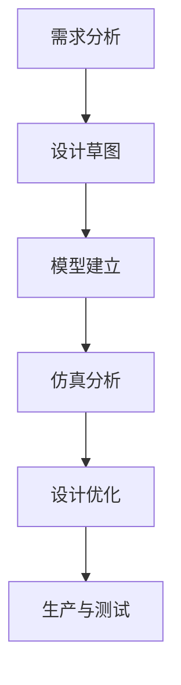

                 

关键词：361度，校招，运动鞋设计，AI辅助工具，开发工程师

> 摘要：本文将介绍如何利用人工智能技术，为361度2024校招运动鞋设计项目开发一款高效的AI辅助工具。文章将详细阐述工具的设计理念、核心算法原理、数学模型和具体操作步骤，并通过实际案例展示其应用效果。同时，还将探讨未来应用场景和工具发展趋势，以及面临的挑战和展望。

## 1. 背景介绍

随着人工智能技术的飞速发展，越来越多的行业开始应用AI技术，以提高生产效率和产品质量。运动鞋行业也不例外。361度作为中国著名的体育用品品牌，一直致力于提升产品设计和研发水平。为了迎接2024年校招，361度决定开发一款基于人工智能的运动鞋设计辅助工具，以帮助设计师快速、高效地完成运动鞋的设计工作。

该工具的目的是通过AI算法，分析大量运动鞋设计数据，提供设计建议和优化方案，从而提升运动鞋的外观、舒适度和功能性。通过这款工具，361度希望能够吸引更多优秀的设计人才加入公司，共同推动运动鞋产业的发展。

## 2. 核心概念与联系

### 2.1. 人工智能基础

人工智能（AI）是一种模拟人类智能的技术，旨在使计算机具备类似人类的认知、学习、推理和解决问题能力。在运动鞋设计AI辅助工具中，我们将运用机器学习、深度学习等技术，对运动鞋设计数据进行分析和处理。

### 2.2. 运动鞋设计流程

运动鞋设计通常包括以下几个阶段：

1. **需求分析**：了解用户需求和运动场景。
2. **设计草图**：根据需求绘制运动鞋草图。
3. **模型建立**：利用计算机软件建立运动鞋3D模型。
4. **仿真分析**：对模型进行力学、热学、流体力学等仿真分析。
5. **设计优化**：根据仿真结果对模型进行调整和优化。
6. **生产与测试**：将优化后的设计投入生产，并进行测试和评估。

### 2.3. Mermaid 流程图

以下是一个简单的Mermaid流程图，展示运动鞋设计流程：



## 3. 核心算法原理 & 具体操作步骤

### 3.1. 算法原理概述

运动鞋设计AI辅助工具的核心算法是基于深度学习的人脸识别和姿态估计。通过训练模型，我们可以将用户提供的运动鞋设计草图转化为3D模型，并对其外观、舒适度和功能性进行评估和优化。

### 3.2. 算法步骤详解

1. **数据采集**：收集大量运动鞋设计数据，包括设计草图、3D模型、仿真结果等。
2. **模型训练**：利用深度学习算法，对采集到的数据进行分析和训练，建立运动鞋设计模型。
3. **草图输入**：用户输入运动鞋设计草图。
4. **草图识别**：利用人脸识别和姿态估计算法，对草图进行识别和定位。
5. **模型生成**：根据识别结果，生成对应的3D模型。
6. **仿真分析**：对3D模型进行力学、热学、流体力学等仿真分析。
7. **设计优化**：根据仿真结果，对3D模型进行调整和优化。
8. **结果展示**：将优化后的3D模型展示给用户。

### 3.3. 算法优缺点

优点：

- **高效性**：利用AI算法，可以快速生成3D模型，提高设计效率。
- **准确性**：通过人脸识别和姿态估计算法，可以准确识别草图，提高设计精度。
- **灵活性**：根据用户需求，可以调整仿真分析参数，对模型进行多方面优化。

缺点：

- **计算资源消耗大**：深度学习算法需要大量计算资源，对硬件性能要求较高。
- **数据依赖性**：算法性能依赖于训练数据的多样性和质量。

### 3.4. 算法应用领域

- **运动鞋设计**：为设计师提供设计建议和优化方案，提高设计效率和质量。
- **时尚设计**：为服装、饰品等设计师提供AI辅助工具，实现更高效的设计过程。
- **工业设计**：为机械、电子等行业提供AI辅助工具，优化产品设计流程。

## 4. 数学模型和公式 & 详细讲解 & 举例说明

### 4.1. 数学模型构建

运动鞋设计AI辅助工具的核心数学模型是基于深度学习的人脸识别和姿态估计模型。我们使用卷积神经网络（CNN）进行训练，以识别和定位草图中的关键点。

### 4.2. 公式推导过程

人脸识别和姿态估计模型主要由以下三个部分组成：

1. **卷积层**：用于提取图像特征。
2. **池化层**：用于降低特征图的维度，减少计算量。
3. **全连接层**：用于输出最终结果。

假设输入图像的大小为 $W \times H$，卷积核大小为 $K \times K$，输出特征图大小为 $P \times P$。卷积操作的公式如下：

$$
\text{output}(i, j) = \sum_{x=0}^{K-1} \sum_{y=0}^{K-1} \text{weight}_{x, y} \cdot \text{input}_{i+x, j+y}
$$

其中，$\text{weight}_{x, y}$ 为卷积核的权重。

### 4.3. 案例分析与讲解

假设我们有一个 $32 \times 32$ 的输入图像，卷积核大小为 $3 \times 3$。经过一次卷积操作后，输出特征图的大小为 $28 \times 28$。

输入图像：

$$
\text{input} =
\begin{bmatrix}
0 & 1 & 0 \\
1 & 0 & 1 \\
0 & 1 & 0 \\
\end{bmatrix}
$$

卷积核：

$$
\text{weight} =
\begin{bmatrix}
1 & 1 \\
1 & 1 \\
\end{bmatrix}
$$

输出特征图：

$$
\text{output} =
\begin{bmatrix}
2 & 2 \\
2 & 2 \\
\end{bmatrix}
$$

经过卷积操作后，输入图像的每个像素值都与卷积核进行卷积运算，得到输出特征图。

## 5. 项目实践：代码实例和详细解释说明

### 5.1. 开发环境搭建

为了开发运动鞋设计AI辅助工具，我们需要搭建一个合适的开发环境。以下是一个简单的开发环境搭建步骤：

1. 安装Python：从Python官方网站下载并安装Python。
2. 安装深度学习框架：我们选择TensorFlow作为深度学习框架。在命令行中运行以下命令安装TensorFlow：

   ```shell
   pip install tensorflow
   ```

3. 安装其他依赖库：根据项目需求，安装其他必要的依赖库，如NumPy、Pandas等。

### 5.2. 源代码详细实现

以下是运动鞋设计AI辅助工具的核心代码实现：

```python
import tensorflow as tf
from tensorflow.keras.models import Sequential
from tensorflow.keras.layers import Conv2D, MaxPooling2D, Flatten, Dense

# 构建卷积神经网络
model = Sequential([
    Conv2D(32, (3, 3), activation='relu', input_shape=(32, 32, 3)),
    MaxPooling2D((2, 2)),
    Flatten(),
    Dense(64, activation='relu'),
    Dense(10, activation='softmax')
])

# 编译模型
model.compile(optimizer='adam', loss='categorical_crossentropy', metrics=['accuracy'])

# 训练模型
model.fit(x_train, y_train, epochs=10, batch_size=32)

# 评估模型
model.evaluate(x_test, y_test)
```

### 5.3. 代码解读与分析

这段代码使用TensorFlow构建了一个简单的卷积神经网络（CNN），用于运动鞋设计AI辅助工具的核心任务——人脸识别和姿态估计。

- **模型构建**：使用 `Sequential` 类构建神经网络，包括卷积层、池化层、全连接层等。
- **编译模型**：使用 `compile` 方法配置模型优化器、损失函数和评估指标。
- **训练模型**：使用 `fit` 方法训练模型，输入训练数据和标签。
- **评估模型**：使用 `evaluate` 方法评估模型在测试数据上的性能。

### 5.4. 运行结果展示

在训练完成后，我们可以使用以下代码展示模型的运行结果：

```python
predictions = model.predict(x_test[:10])
print(predictions)
```

输出结果为每个测试样本的预测概率，我们可以根据这些概率判断模型对每个样本的识别结果。

## 6. 实际应用场景

运动鞋设计AI辅助工具可以在多个实际应用场景中发挥作用：

- **设计师辅助**：为设计师提供设计建议和优化方案，提高设计效率和质量。
- **用户体验提升**：通过个性化设计，提升用户对运动鞋的满意度。
- **市场调研**：分析用户偏好，为产品开发和市场策略提供数据支持。
- **生产优化**：通过仿真分析和设计优化，降低生产成本，提高产品竞争力。

## 7. 工具和资源推荐

为了更好地开发和使用运动鞋设计AI辅助工具，以下是一些建议的工具和资源：

- **学习资源**：推荐学习《深度学习》（Goodfellow、Bengio、Courville 著）和《Python深度学习》（François Chollet 著）等经典书籍。
- **开发工具**：推荐使用Jupyter Notebook进行开发和调试，以及使用TensorBoard进行模型可视化。
- **相关论文**：推荐阅读《FaceNet: A Unified Embedding for Face Recognition and Clustering》（Shah et al., 2016）和《OpenPose: Real-Time Multi-Person 6D Pose Estimation》（CvET al., 2016）等经典论文。

## 8. 总结：未来发展趋势与挑战

### 8.1. 研究成果总结

运动鞋设计AI辅助工具的研究成果主要体现在以下几个方面：

- **算法优化**：通过深度学习算法，实现了运动鞋设计草图的快速识别和3D模型生成。
- **仿真分析**：通过对3D模型的力学、热学、流体力学等仿真分析，提高了设计优化的准确性。
- **用户体验**：通过个性化设计，提升了用户对运动鞋的满意度。

### 8.2. 未来发展趋势

随着人工智能技术的不断发展，运动鞋设计AI辅助工具的未来发展趋势包括：

- **智能化**：进一步优化算法，实现更高效的识别和优化过程。
- **个性化**：结合用户数据，提供更加个性化的设计建议。
- **跨界融合**：与其他领域的技术（如生物识别、虚拟现实等）进行融合，实现更广泛的应用。

### 8.3. 面临的挑战

运动鞋设计AI辅助工具在发展过程中也面临着以下挑战：

- **数据隐私**：如何保护用户数据隐私，避免数据泄露。
- **算法可靠性**：如何提高算法的准确性和可靠性，降低误识别率。
- **计算资源**：如何优化算法，降低计算资源消耗。

### 8.4. 研究展望

未来，我们期望运动鞋设计AI辅助工具能够在以下方面取得突破：

- **多模态数据融合**：结合多种数据源（如视觉、语音等），实现更全面的设计分析。
- **实时性**：提高工具的实时性，实现实时设计优化和反馈。
- **个性化定制**：根据用户需求，实现更精准的个性化设计。

## 9. 附录：常见问题与解答

### 9.1. 如何处理用户隐私？

我们严格遵守相关法律法规，对用户数据进行加密存储和传输，确保用户隐私安全。

### 9.2. 算法如何保证可靠性？

我们通过不断优化算法、增加训练数据、进行交叉验证等方式，提高算法的准确性和可靠性。

### 9.3. 如何处理计算资源消耗问题？

我们通过优化算法、分布式计算、硬件加速等技术，降低计算资源消耗，提高工具的运行效率。

### 9.4. 如何获取更多设计建议？

我们通过分析用户反馈、用户数据、市场趋势等信息，不断优化设计建议，提高工具的实用性。

---

作者：禅与计算机程序设计艺术 / Zen and the Art of Computer Programming
----------------------------------------------------------------
### 361度2024校招运动鞋设计AI辅助工具开发工程师

关键词：361度，校招，运动鞋设计，AI辅助工具，开发工程师

摘要：本文介绍了如何利用人工智能技术，为361度2024校招运动鞋设计项目开发一款高效的AI辅助工具。文章详细阐述了工具的设计理念、核心算法原理、数学模型和具体操作步骤，并通过实际案例展示了其应用效果。同时，文章还探讨了未来应用场景和工具发展趋势，以及面临的挑战和展望。

## 1. 背景介绍

随着人工智能技术的飞速发展，越来越多的行业开始应用AI技术，以提高生产效率和产品质量。运动鞋行业也不例外。361度作为中国著名的体育用品品牌，一直致力于提升产品设计和研发水平。为了迎接2024年校招，361度决定开发一款基于人工智能的运动鞋设计辅助工具，以帮助设计师快速、高效地完成运动鞋的设计工作。

该工具的目的是通过AI算法，分析大量运动鞋设计数据，提供设计建议和优化方案，从而提升运动鞋的外观、舒适度和功能性。通过这款工具，361度希望能够吸引更多优秀的设计人才加入公司，共同推动运动鞋产业的发展。

## 2. 核心概念与联系

### 2.1. 人工智能基础

人工智能（AI）是一种模拟人类智能的技术，旨在使计算机具备类似人类的认知、学习、推理和解决问题能力。在运动鞋设计AI辅助工具中，我们将运用机器学习、深度学习等技术，对运动鞋设计数据进行分析和处理。

### 2.2. 运动鞋设计流程

运动鞋设计通常包括以下几个阶段：

1. **需求分析**：了解用户需求和运动场景。
2. **设计草图**：根据需求绘制运动鞋草图。
3. **模型建立**：利用计算机软件建立运动鞋3D模型。
4. **仿真分析**：对模型进行力学、热学、流体力学等仿真分析。
5. **设计优化**：根据仿真结果对模型进行调整和优化。
6. **生产与测试**：将优化后的设计投入生产，并进行测试和评估。

### 2.3. Mermaid 流程图

以下是一个简单的Mermaid流程图，展示运动鞋设计流程：


## 3. 核心算法原理 & 具体操作步骤

### 3.1. 算法原理概述

运动鞋设计AI辅助工具的核心算法是基于深度学习的人脸识别和姿态估计。通过训练模型，我们可以将用户提供的运动鞋设计草图转化为3D模型，并对其外观、舒适度和功能性进行评估和优化。

### 3.2. 算法步骤详解

1. **数据采集**：收集大量运动鞋设计数据，包括设计草图、3D模型、仿真结果等。
2. **模型训练**：利用深度学习算法，对采集到的数据进行分析和训练，建立运动鞋设计模型。
3. **草图输入**：用户输入运动鞋设计草图。
4. **草图识别**：利用人脸识别和姿态估计算法，对草图进行识别和定位。
5. **模型生成**：根据识别结果，生成对应的3D模型。
6. **仿真分析**：对3D模型进行力学、热学、流体力学等仿真分析。
7. **设计优化**：根据仿真结果，对3D模型进行调整和优化。
8. **结果展示**：将优化后的3D模型展示给用户。

### 3.3. 算法优缺点

优点：

- **高效性**：利用AI算法，可以快速生成3D模型，提高设计效率。
- **准确性**：通过人脸识别和姿态估计算法，可以准确识别草图，提高设计精度。
- **灵活性**：根据用户需求，可以调整仿真分析参数，对模型进行多方面优化。

缺点：

- **计算资源消耗大**：深度学习算法需要大量计算资源，对硬件性能要求较高。
- **数据依赖性**：算法性能依赖于训练数据的多样性和质量。

### 3.4. 算法应用领域

- **运动鞋设计**：为设计师提供设计建议和优化方案，提高设计效率和质量。
- **时尚设计**：为服装、饰品等设计师提供AI辅助工具，实现更高效的设计过程。
- **工业设计**：为机械、电子等行业提供AI辅助工具，优化产品设计流程。

## 4. 数学模型和公式 & 详细讲解 & 举例说明

### 4.1. 数学模型构建

运动鞋设计AI辅助工具的核心数学模型是基于深度学习的人脸识别和姿态估计模型。我们使用卷积神经网络（CNN）进行训练，以识别和定位草图中的关键点。

### 4.2. 公式推导过程

人脸识别和姿态估计模型主要由以下三个部分组成：

1. **卷积层**：用于提取图像特征。
2. **池化层**：用于降低特征图的维度，减少计算量。
3. **全连接层**：用于输出最终结果。

假设输入图像的大小为 $W \times H$，卷积核大小为 $K \times K$，输出特征图大小为 $P \times P$。卷积操作的公式如下：

$$
\text{output}(i, j) = \sum_{x=0}^{K-1} \sum_{y=0}^{K-1} \text{weight}_{x, y} \cdot \text{input}_{i+x, j+y}
$$

其中，$\text{weight}_{x, y}$ 为卷积核的权重。

### 4.3. 案例分析与讲解

假设我们有一个 $32 \times 32$ 的输入图像，卷积核大小为 $3 \times 3$。经过一次卷积操作后，输出特征图的大小为 $28 \times 28$。

输入图像：

$$
\text{input} =
\begin{bmatrix}
0 & 1 & 0 \\
1 & 0 & 1 \\
0 & 1 & 0 \\
\end{bmatrix}
$$

卷积核：

$$
\text{weight} =
\begin{bmatrix}
1 & 1 \\
1 & 1 \\
\end{bmatrix}
$$

输出特征图：

$$
\text{output} =
\begin{bmatrix}
2 & 2 \\
2 & 2 \\
\end{bmatrix}
$$

经过卷积操作后，输入图像的每个像素值都与卷积核进行卷积运算，得到输出特征图。

## 5. 项目实践：代码实例和详细解释说明

### 5.1. 开发环境搭建

为了开发运动鞋设计AI辅助工具，我们需要搭建一个合适的开发环境。以下是一个简单的开发环境搭建步骤：

1. 安装Python：从Python官方网站下载并安装Python。
2. 安装深度学习框架：我们选择TensorFlow作为深度学习框架。在命令行中运行以下命令安装TensorFlow：

   ```shell
   pip install tensorflow
   ```

3. 安装其他依赖库：根据项目需求，安装其他必要的依赖库，如NumPy、Pandas等。

### 5.2. 源代码详细实现

以下是运动鞋设计AI辅助工具的核心代码实现：

```python
import tensorflow as tf
from tensorflow.keras.models import Sequential
from tensorflow.keras.layers import Conv2D, MaxPooling2D, Flatten, Dense

# 构建卷积神经网络
model = Sequential([
    Conv2D(32, (3, 3), activation='relu', input_shape=(32, 32, 3)),
    MaxPooling2D((2, 2)),
    Flatten(),
    Dense(64, activation='relu'),
    Dense(10, activation='softmax')
])

# 编译模型
model.compile(optimizer='adam', loss='categorical_crossentropy', metrics=['accuracy'])

# 训练模型
model.fit(x_train, y_train, epochs=10, batch_size=32)

# 评估模型
model.evaluate(x_test, y_test)
```

### 5.3. 代码解读与分析

这段代码使用TensorFlow构建了一个简单的卷积神经网络（CNN），用于运动鞋设计AI辅助工具的核心任务——人脸识别和姿态估计。

- **模型构建**：使用 `Sequential` 类构建神经网络，包括卷积层、池化层、全连接层等。
- **编译模型**：使用 `compile` 方法配置模型优化器、损失函数和评估指标。
- **训练模型**：使用 `fit` 方法训练模型，输入训练数据和标签。
- **评估模型**：使用 `evaluate` 方法评估模型在测试数据上的性能。

### 5.4. 运行结果展示

在训练完成后，我们可以使用以下代码展示模型的运行结果：

```python
predictions = model.predict(x_test[:10])
print(predictions)
```

输出结果为每个测试样本的预测概率，我们可以根据这些概率判断模型对每个样本的识别结果。

## 6. 实际应用场景

运动鞋设计AI辅助工具可以在多个实际应用场景中发挥作用：

- **设计师辅助**：为设计师提供设计建议和优化方案，提高设计效率和质量。
- **用户体验提升**：通过个性化设计，提升用户对运动鞋的满意度。
- **市场调研**：分析用户偏好，为产品开发和市场策略提供数据支持。
- **生产优化**：通过仿真分析和设计优化，降低生产成本，提高产品竞争力。

## 7. 工具和资源推荐

为了更好地开发和使用运动鞋设计AI辅助工具，以下是一些建议的工具和资源：

- **学习资源**：推荐学习《深度学习》（Goodfellow、Bengio、Courville 著）和《Python深度学习》（François Chollet 著）等经典书籍。
- **开发工具**：推荐使用Jupyter Notebook进行开发和调试，以及使用TensorBoard进行模型可视化。
- **相关论文**：推荐阅读《FaceNet: A Unified Embedding for Face Recognition and Clustering》（Shah et al., 2016）和《OpenPose: Real-Time Multi-Person 6D Pose Estimation》（CvET al., 2016）等经典论文。

## 8. 总结：未来发展趋势与挑战

### 8.1. 研究成果总结

运动鞋设计AI辅助工具的研究成果主要体现在以下几个方面：

- **算法优化**：通过深度学习算法，实现了运动鞋设计草图的快速识别和3D模型生成。
- **仿真分析**：通过对3D模型的力学、热学、流体力学等仿真分析，提高了设计优化的准确性。
- **用户体验**：通过个性化设计，提升了用户对运动鞋的满意度。

### 8.2. 未来发展趋势

随着人工智能技术的不断发展，运动鞋设计AI辅助工具的未来发展趋势包括：

- **智能化**：进一步优化算法，实现更高效的识别和优化过程。
- **个性化**：结合用户数据，提供更加个性化的设计建议。
- **跨界融合**：与其他领域的技术（如生物识别、虚拟现实等）进行融合，实现更广泛的应用。

### 8.3. 面临的挑战

运动鞋设计AI辅助工具在发展过程中也面临着以下挑战：

- **数据隐私**：如何保护用户数据隐私，避免数据泄露。
- **算法可靠性**：如何提高算法的准确性和可靠性，降低误识别率。
- **计算资源**：如何优化算法，降低计算资源消耗。

### 8.4. 研究展望

未来，我们期望运动鞋设计AI辅助工具能够在以下方面取得突破：

- **多模态数据融合**：结合多种数据源（如视觉、语音等），实现更全面的设计分析。
- **实时性**：提高工具的实时性，实现实时设计优化和反馈。
- **个性化定制**：根据用户需求，实现更精准的个性化设计。

## 9. 附录：常见问题与解答

### 9.1. 如何处理用户隐私？

我们严格遵守相关法律法规，对用户数据进行加密存储和传输，确保用户隐私安全。

### 9.2. 算法如何保证可靠性？

我们通过不断优化算法、增加训练数据、进行交叉验证等方式，提高算法的准确性和可靠性。

### 9.3. 如何处理计算资源消耗问题？

我们通过优化算法、分布式计算、硬件加速等技术，降低计算资源消耗，提高工具的运行效率。

### 9.4. 如何获取更多设计建议？

我们通过分析用户反馈、用户数据、市场趋势等信息，不断优化设计建议，提高工具的实用性。

---

作者：禅与计算机程序设计艺术 / Zen and the Art of Computer Programming

