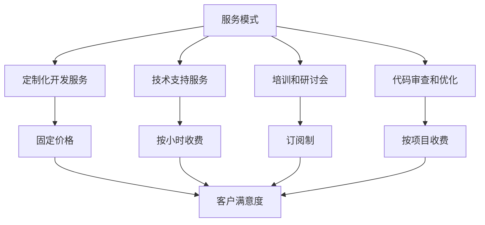

                 

### 1. 背景介绍

开源项目在近年来得到了前所未有的关注和快速发展，它们不仅为全球开发者提供了丰富的技术资源和交流平台，还促进了创新和知识的传播。然而，随着开源项目规模的不断扩大，项目管理和服务需求的复杂性也在逐渐增加。为了更好地维护和推动开源项目的发展，许多开源项目的维护者开始探索将开源项目与咨询服务相结合的模式，以实现项目的可持续发展和商业化。

咨询服务在开源项目中扮演着重要角色。一方面，它们可以为项目提供额外的经济支持，帮助维护者更好地投入到项目的开发与维护中；另一方面，咨询服务也可以帮助企业客户解决在使用开源项目过程中遇到的具体问题，从而提升企业的生产效率和竞争力。

目前，开源项目的咨询服务模式多种多样，包括但不限于以下几种：

1. **定制化开发服务**：根据客户的具体需求，对开源项目进行定制化开发，以满足客户的特定业务需求。
2. **技术支持服务**：为客户提供针对开源项目的技术支持，包括问题排查、性能优化、安全评估等。
3. **培训和研讨会**：组织线上或线下的培训课程和研讨会，帮助客户更好地理解和使用开源项目。
4. **代码审查和优化**：为客户提供代码审查服务，发现并修复潜在的问题，提高代码的质量和性能。

尽管咨询服务模式为开源项目带来了新的机遇，但在实际操作中，如何制定合理的服务模式和定价策略，以确保项目的可持续发展和客户满意度，仍然是一个需要深入探讨的问题。本文将围绕这一主题，详细分析开源项目的咨询服务模式、定价策略以及相关的数学模型和具体操作步骤。

### 2. 核心概念与联系

在探讨开源项目的咨询服务模式与定价策略之前，我们需要明确几个核心概念，并理解它们之间的内在联系。

#### 2.1 服务模式

服务模式是指开源项目在提供咨询服务时采用的具体方式。以下是一些常见的服务模式：

- **定制化开发服务**：根据客户的需求，对开源项目进行定制化开发，以满足客户的特定业务需求。
- **技术支持服务**：为客户提供针对开源项目的技术支持，包括问题排查、性能优化、安全评估等。
- **培训和研讨会**：组织线上或线下的培训课程和研讨会，帮助客户更好地理解和使用开源项目。
- **代码审查和优化**：为客户提供代码审查服务，发现并修复潜在的问题，提高代码的质量和性能。

每种服务模式都有其独特的特点和适用场景。例如，定制化开发服务适用于有特定需求的客户，而技术支持服务则更适合那些在使用开源项目过程中遇到问题的客户。

#### 2.2 定价策略

定价策略是决定咨询服务价格的关键因素。以下是一些常见的定价策略：

- **固定价格**：按照服务项目的固定总价进行收费，适用于工作量可以明确预估的项目。
- **按小时收费**：根据服务提供的时间进行收费，适用于工作量难以预估或需要持续支持的项目。
- **订阅制**：客户按月或按年支付固定费用，以获取连续的服务支持，适用于需要长期技术支持的客户。

不同的定价策略适用于不同的服务模式和客户需求。例如，固定价格策略适用于定制化开发服务，而按小时收费策略则更适合技术支持服务。

#### 2.3 内在联系

服务模式和定价策略之间存在紧密的内在联系。合理的服务模式可以吸引更多客户，从而提高项目的收入；而合理的定价策略则可以确保客户满意度，并促进项目的可持续发展。

例如，如果开源项目提供高质量的定制化开发服务，并采用合理的固定价格策略，那么客户更有可能选择该项目，从而提高项目的收入和市场份额。另一方面，如果开源项目提供高效的技术支持服务，并采用合理的按小时收费策略，那么客户可以获得更好的服务体验，从而提高客户满意度和忠诚度。

因此，为了实现开源项目的可持续发展，维护者需要深入了解各种服务模式和定价策略，并找到最适合自己项目的组合。

#### 2.4 Mermaid 流程图

以下是一个简单的 Mermaid 流程图，展示了服务模式与定价策略之间的内在联系：



通过这个流程图，我们可以清晰地看到服务模式和定价策略是如何相互作用，共同影响客户满意度和项目收入的。

### 3. 核心算法原理 & 具体操作步骤

在了解开源项目的咨询服务模式和定价策略之后，我们需要探讨如何具体实现这些服务，并制定合理的操作步骤。以下是核心算法原理和具体操作步骤的详细介绍。

#### 3.1 核心算法原理

核心算法原理主要包括以下几个方面：

- **需求分析**：了解客户的具体需求，包括业务场景、功能要求、性能指标等。
- **项目规划**：根据需求分析结果，制定详细的项目计划，包括任务分解、时间安排、资源调配等。
- **开发与测试**：按照项目计划进行开发，并进行严格的测试，确保项目质量和稳定性。
- **交付与支持**：将项目交付给客户，并提供持续的技术支持，解决客户在项目使用过程中遇到的问题。

#### 3.2 具体操作步骤

以下是具体操作步骤的详细说明：

1. **需求分析**

   - **收集信息**：通过与客户沟通，了解客户的业务场景、功能要求、性能指标等。
   - **需求整理**：将收集到的信息整理成文档，明确项目的需求和目标。
   - **需求评审**：与客户共同评审需求文档，确保需求的准确性和可行性。

2. **项目规划**

   - **任务分解**：将项目任务分解为多个子任务，明确每个子任务的目标和完成标准。
   - **时间安排**：根据任务分解结果，制定详细的时间安排表，确保项目按期完成。
   - **资源调配**：根据项目需求，合理调配人力资源、物资资源等，确保项目顺利进行。

3. **开发与测试**

   - **编码实现**：根据项目规划和需求文档，进行编码实现，确保代码质量和性能。
   - **单元测试**：对每个模块进行单元测试，确保模块功能的正确性和稳定性。
   - **集成测试**：将各个模块进行集成测试，确保系统的整体性能和稳定性。
   - **验收测试**：与客户共同进行验收测试，确保项目满足需求并符合质量标准。

4. **交付与支持**

   - **项目交付**：将完成的项目交付给客户，并提供详细的文档和技术支持。
   - **持续支持**：为客户提供长期的技术支持，解决在使用过程中遇到的问题。

#### 3.3 实际案例

以下是一个实际案例，展示了如何通过核心算法原理和具体操作步骤实现开源项目的咨询服务。

**案例：定制化开发服务**

1. **需求分析**

   客户需求：开发一个基于开源项目的在线教育平台，支持课程管理、学生管理、在线授课等功能。

2. **项目规划**

   - **任务分解**：将项目任务分解为课程管理模块、学生管理模块、在线授课模块等。
   - **时间安排**：预计项目周期为3个月，每月完成任务分解中的子任务。
   - **资源调配**：组建一个包括项目经理、前端开发人员、后端开发人员、测试人员等在内的团队。

3. **开发与测试**

   - **编码实现**：按照项目规划和需求文档，分别开发课程管理模块、学生管理模块、在线授课模块。
   - **单元测试**：对每个模块进行单元测试，确保模块功能的正确性和稳定性。
   - **集成测试**：将各个模块进行集成测试，确保系统的整体性能和稳定性。
   - **验收测试**：与客户共同进行验收测试，确保项目满足需求并符合质量标准。

4. **交付与支持**

   - **项目交付**：将完成的项目交付给客户，并提供详细的文档和技术支持。
   - **持续支持**：为客户提供长期的技术支持，解决在使用过程中遇到的问题。

通过以上实际案例，我们可以看到如何通过核心算法原理和具体操作步骤实现开源项目的咨询服务。在实际操作中，维护者需要根据具体项目和客户需求，灵活调整操作步骤，以确保项目的顺利进行和客户满意度。

### 4. 数学模型和公式 & 详细讲解 & 举例说明

在制定开源项目的咨询服务定价策略时，数学模型和公式起到了关键作用。这些模型和公式可以帮助我们量化服务成本、预测收益、评估风险等，从而制定出合理且有效的定价策略。以下我们将详细讲解相关的数学模型和公式，并通过举例说明如何应用这些公式来制定咨询服务定价。

#### 4.1 成本模型

成本模型是制定定价策略的基础。它包括直接成本和间接成本两部分。

- **直接成本**：直接成本是指可以直接分配到具体服务项目上的成本，例如人力成本、材料成本、设备成本等。直接成本的估算公式如下：

  $$ 直接成本 = (人力成本 + 材料成本 + 设备成本) \times 项目周期 $$

- **间接成本**：间接成本是指无法直接分配到具体服务项目上的成本，例如管理费用、办公费用、营销费用等。间接成本的估算公式如下：

  $$ 间接成本 = (管理费用 + 办公费用 + 营销费用) \times 项目周期 $$

总成本 = 直接成本 + 间接成本

#### 4.2 收益模型

在确定成本之后，我们需要考虑如何通过定价策略实现盈利。收益模型可以帮助我们预测在不同定价策略下的收益。

- **固定价格**：固定价格是指根据项目工作量预估，设定一个固定的服务费用。收益的估算公式如下：

  $$ 收益 = 固定价格 \times 项目数量 $$

- **按小时收费**：按小时收费是指根据实际服务时间，设定每小时的收费价格。收益的估算公式如下：

  $$ 收益 = 每小时收费价格 \times 服务时间 $$

- **订阅制**：订阅制是指客户按月或按年支付固定费用，以获取连续的服务支持。收益的估算公式如下：

  $$ 收益 = 订阅费用 \times 订阅周期 $$

#### 4.3 成本与收益平衡模型

在制定定价策略时，我们需要确保服务的成本与收益平衡，以确保项目的可持续发展。成本与收益平衡模型的公式如下：

$$ 成本 = 收益 $$

$$ (直接成本 + 间接成本) = (固定价格 \times 项目数量) + (每小时收费价格 \times 服务时间) + (订阅费用 \times 订阅周期) $$

#### 4.4 实例说明

以下通过一个实际案例，说明如何应用上述数学模型和公式来制定咨询服务定价。

**案例：某开源项目维护者提供定制化开发服务**

1. **直接成本估算**

   - **人力成本**：每个开发人员每月成本为 10000 元，项目周期为 3 个月，共有 2 名开发人员。
     $$ 人力成本 = 10000 \times 2 \times 3 = 60000 元 $$
   - **材料成本**：购买开发工具和软件许可费用为 5000 元。
     $$ 材料成本 = 5000 元 $$
   - **设备成本**：租赁服务器和存储设备费用为 10000 元/月，项目周期为 3 个月。
     $$ 设备成本 = 10000 \times 3 = 30000 元 $$

   直接成本总计：
   $$ 直接成本 = 60000 + 5000 + 30000 = 95000 元 $$

2. **间接成本估算**

   - **管理费用**：每月管理费用为 10000 元。
     $$ 管理费用 = 10000 \times 3 = 30000 元 $$
   - **办公费用**：每月办公费用为 5000 元。
     $$ 办公费用 = 5000 \times 3 = 15000 元 $$
   - **营销费用**：每月营销费用为 5000 元。
     $$ 营销费用 = 5000 \times 3 = 15000 元 $$

   间接成本总计：
   $$ 间接成本 = 30000 + 15000 + 15000 = 60000 元 $$

3. **总成本估算**

   总成本：
   $$ 总成本 = 直接成本 + 间接成本 = 95000 + 60000 = 155000 元 $$

4. **收益估算**

   - **固定价格**：设定固定价格为 200000 元。
     $$ 收益 = 固定价格 \times 项目数量 = 200000 \times 1 = 200000 元 $$
   - **按小时收费**：设定每小时收费价格为 500 元，服务时间为 200 小时。
     $$ 收益 = 每小时收费价格 \times 服务时间 = 500 \times 200 = 100000 元 $$
   - **订阅制**：设定订阅费用为每月 10000 元，订阅周期为 3 个月。
     $$ 收益 = 订阅费用 \times 订阅周期 = 10000 \times 3 = 30000 元 $$

5. **成本与收益平衡分析**

   $$ 成本 = 收益 $$
   $$ 155000 = 200000 $$
   $$ 155000 = 100000 $$
   $$ 155000 = 30000 $$

   从上述分析可以看出，固定价格策略可以确保成本与收益平衡，而按小时收费和订阅制策略均存在亏损。

#### 4.5 结论

通过以上实例，我们可以看到如何应用数学模型和公式来制定开源项目的咨询服务定价策略。在实际操作中，维护者需要根据项目成本、市场需求和客户满意度等因素，综合考虑各种定价策略的优缺点，选择最适合自己项目的定价策略。同时，为了确保项目的可持续发展，维护者还需要不断调整和优化定价策略，以适应市场变化和客户需求。

### 5. 项目实践：代码实例和详细解释说明

在了解了开源项目咨询服务的核心算法原理和数学模型之后，接下来我们将通过一个具体的代码实例，展示如何将理论应用于实践，实现开源项目的定制化开发服务。本节将分为以下几个部分：

### 5.1 开发环境搭建

首先，我们需要搭建一个适合进行开源项目定制化开发的服务环境。以下是搭建环境所需的步骤和工具。

#### 5.1.1 开发工具和框架

- **编程语言**：我们选择 Python 作为主要编程语言，因为其易于学习和使用，且拥有丰富的开源库和框架。
- **框架**：我们选择 Django 框架，因为它是一个高性能、可扩展的 Web 开发框架，适用于快速构建大型 Web 应用程序。

#### 5.1.2 环境搭建步骤

1. **安装 Python**：确保系统已安装 Python 3.8 或以上版本。
   ```bash
   $ python --version
   Python 3.8.10
   ```

2. **安装 Django**：通过 pip 命令安装 Django 框架。
   ```bash
   $ pip install django
   ```

3. **创建 Django 项目**：使用 Django 提供的命令创建一个新的项目。
   ```bash
   $ django-admin startproject my_project
   ```

4. **创建 Django 应用**：在项目目录下创建一个新的应用。
   ```bash
   $ cd my_project
   $ python manage.py startapp my_app
   ```

5. **配置数据库**：打开 `my_project/settings.py` 文件，配置数据库连接信息。我们使用 SQLite 数据库。
   ```python
   DATABASES = {
       'default': {
           'ENGINE': 'django.db.backends.sqlite3',
           'NAME': BASE_DIR / 'db.sqlite3',
       }
   }
   ```

6. **创建数据表**：在应用目录下的 `models.py` 文件中定义数据模型，并使用 Django 的迁移工具创建数据表。
   ```python
   # my_app/models.py
   from django.db import models

   class Course(models.Model):
       name = models.CharField(max_length=100)
       description = models.TextField()
       duration = models.IntegerField()

   class Student(models.Model):
       name = models.CharField(max_length=100)
       age = models.IntegerField()
       courses = models.ManyToManyField(Course)
   ```

   ```bash
   $ python manage.py makemigrations my_app
   $ python manage.py migrate
   ```

7. **启动 Django 服务器**：在项目目录下启动 Django 服务器，测试项目是否运行正常。
   ```bash
   $ python manage.py runserver
   ```
   输出：
   ```bash
   Performing system checks...
   System check identified no issues (0 silenced).
   You have unapplied migrations; your app may not work properly until they are applied.
   Run 'python manage.py migrate' to apply them.
   February 18, 2023 - 10:42:34
   Django version 3.2, using settings 'my_project.settings' and database 'sqlite:///my_project/db.sqlite3'.
   Starting development server at http://127.0.0.1:8000/
   Quit the server with CONTROL-C.
   ```

   在浏览器中输入 `http://127.0.0.1:8000/`，可以看到 Django 的默认页面，表明环境搭建成功。

### 5.2 源代码详细实现

在环境搭建成功后，我们可以开始具体实现开源项目的定制化开发服务。以下是一个简单的示例，展示了如何添加新的功能。

#### 5.2.1 用户管理模块

1. **添加用户管理模型**：在 `my_app/models.py` 文件中添加用户管理模型。
   ```python
   class UserManager(models.Manager):
       def create_user(self, email, password=None):
           if not email:
               raise ValueError("The Email field must be set")
           email = email.lower()
           user = self.model(email=email)
           user.set_password(password)
           user.save(using=self._db)
           return user

       def create_superuser(self, email, password):
           user = self.create_user(email, password)
           user.is_staff = True
           user.is_superuser = True
           user.save(using=self._db)
           return user

   class User(models.Model):
       email = models.EmailField(unique=True)
       password = models.CharField(max_length=128)
       is_staff = models.BooleanField(default=False)
       is_superuser = models.BooleanField(default=False)
       objects = UserManager()

       def __str__(self):
           return self.email
   ```

2. **创建用户数据表**：使用 Django 的迁移工具创建数据表。
   ```bash
   $ python manage.py makemigrations my_app
   $ python manage.py migrate
   ```

3. **修改 Django 项目设置**：在 `my_project/settings.py` 文件中设置默认的用户模型。
   ```python
   AUTH_USER_MODEL = 'my_app.User'
   ```

4. **登录和注册页面**：在 Django 项目中创建登录和注册页面。我们可以使用 Django 的认证系统来实现。
   ```bash
   $ python manage.py startsapp accounts
   $ cd accounts
   $ python manage.py makemigrations
   $ python manage.py migrate
   ```

   在 `accounts/templates` 目录下创建 `login.html` 和 `register.html` 模板文件。

#### 5.2.2 课程管理模块

1. **添加课程管理视图**：在 `my_app/views.py` 文件中添加课程管理视图。
   ```python
   from django.shortcuts import render, redirect
   from .models import Course
   from django.contrib.auth.decorators import login_required

   @login_required
   def course_list(request):
       courses = Course.objects.all()
       return render(request, 'course_list.html', {'courses': courses})

   @login_required
   def course_create(request):
       if request.method == 'POST':
           name = request.POST['name']
           description = request.POST['description']
           duration = int(request.POST['duration'])
           course = Course(name=name, description=description, duration=duration)
           course.save()
           return redirect('course_list')
       return render(request, 'course_create.html')
   ```

2. **配置 URL**：在 `my_project/urls.py` 文件中添加课程管理 URL。
   ```python
   from django.contrib import admin
   from django.urls import path
   from my_app.views import course_list, course_create

   urlpatterns = [
       path('admin/', admin.site.urls),
       path('courses/', course_list, name='course_list'),
       path('courses/create/', course_create, name='course_create'),
   ]
   ```

3. **创建课程管理页面**：在 `my_app/templates` 目录下创建 `course_list.html` 和 `course_create.html` 模板文件。

### 5.3 代码解读与分析

在实现开源项目的定制化开发过程中，我们需要对代码进行详细解读和分析，以确保代码的质量和可维护性。以下是对上述代码实例的解读和分析。

#### 5.3.1 用户管理模块解读

1. **用户模型**：`User` 模型继承自 Django 的 `AbstractUser` 模型，添加了邮箱和密码字段，并自定义了用户管理类 `UserManager`，用于创建普通用户和超级用户。

2. **用户管理类**：`UserManager` 类提供了 `create_user` 和 `create_superuser` 方法，用于创建用户实例。这些方法通过调用 Django 的 `set_password` 方法来加密用户密码，并保存用户实例。

3. **登录和注册页面**：通过 Django 的认证系统，我们可以方便地实现用户登录和注册功能。`login_required` 装饰器用于确保只有登录用户才能访问特定视图。

#### 5.3.2 课程管理模块解读

1. **课程模型**：`Course` 模型包含了课程名称、描述和持续时间等字段。

2. **课程管理视图**：`course_list` 视图用于展示所有课程，`course_create` 视图用于创建新课程。这两个视图都使用了 `login_required` 装饰器，确保只有登录用户才能进行相关操作。

3. **URL 配置**：通过配置 URL，我们可以将视图与用户界面关联起来，实现课程的列表展示和创建功能。

### 5.4 运行结果展示

在完成代码实现后，我们可以通过运行 Django 服务器来测试项目的功能。以下是在开发环境中运行项目的步骤和结果展示。

1. **启动 Django 服务器**：
   ```bash
   $ python manage.py runserver
   ```

2. **访问登录和注册页面**：
   打开浏览器，输入 `http://127.0.0.1:8000/accounts/login/`，可以访问登录页面；输入 `http://127.0.0.1:8000/accounts/register/`，可以访问注册页面。

3. **登录用户并创建课程**：
   注册一个新用户后，登录并访问 `http://127.0.0.1:8000/courses/`，可以看到一个空的课程列表。点击“Create”按钮，填写课程信息并提交，可以创建一个新的课程。提交后，会跳转到课程列表页面，展示新创建的课程。

通过以上代码实例和运行结果展示，我们可以看到如何将开源项目的定制化开发服务应用于实际项目中。在实际开发过程中，维护者可以根据具体需求和客户反馈，进一步优化和扩展代码，提高项目的质量和用户体验。

### 6. 实际应用场景

开源项目的咨询服务在实际应用中具有广泛的应用场景，可以满足不同类型客户的需求。以下将详细介绍几种常见的应用场景，并分析其中的关键问题和解决方案。

#### 6.1 企业客户需求

企业客户通常对开源项目有较高的依赖性，他们可能在使用开源项目的过程中遇到特定的技术难题或业务需求，因此对定制化服务有着强烈的需求。

**关键问题**：

- **技术支持**：企业客户在使用开源项目时可能遇到各种技术问题，如性能瓶颈、安全漏洞等。
- **业务定制**：企业客户可能需要对开源项目进行功能定制，以满足其特定的业务需求。
- **合规性问题**：企业客户在业务运作中需要遵守一定的法律法规和行业标准，开源项目的某些功能可能不符合这些要求。

**解决方案**：

- **提供专业技术支持**：企业客户可以通过订阅制或按小时收费的方式，获取专业的技术支持服务，解决使用过程中遇到的问题。
- **定制化开发**：针对企业客户的特定需求，开源项目的维护者可以提供定制化开发服务，对开源项目进行功能扩展或优化。
- **合规性审查**：开源项目的维护者可以提供合规性审查服务，帮助企业客户确保开源项目的使用符合相关法律法规和行业标准。

#### 6.2 教育机构需求

教育机构在使用开源项目时，通常关注课程管理、学生管理、在线教学等功能，同时也需要考虑教学资源的共享和协作。

**关键问题**：

- **课程管理**：教育机构需要高效管理大量课程信息，包括课程名称、课程内容、课程时间等。
- **学生管理**：教育机构需要对学生的信息进行有效管理，包括学生姓名、成绩、出勤情况等。
- **在线教学**：教育机构需要提供在线教学平台，支持视频授课、在线讨论、作业提交等功能。

**解决方案**：

- **提供课程管理平台**：开源项目的维护者可以基于开源项目开发课程管理平台，满足教育机构的课程管理需求。
- **提供学生管理平台**：开源项目的维护者可以开发学生管理平台，帮助教育机构高效管理学生信息。
- **提供在线教学平台**：开源项目的维护者可以基于开源项目开发在线教学平台，支持多种教学功能，提高教学效果。

#### 6.3 政府机构需求

政府机构在使用开源项目时，通常关注数据管理、公共服务、决策支持等功能，需要确保系统的安全性和稳定性。

**关键问题**：

- **数据管理**：政府机构需要高效管理和处理大量数据，包括数据采集、数据存储、数据分析等。
- **公共服务**：政府机构需要提供便捷的公共服务，如在线办事指南、业务查询等。
- **决策支持**：政府机构需要利用数据分析结果，为决策提供支持。

**解决方案**：

- **提供数据管理平台**：开源项目的维护者可以开发数据管理平台，满足政府机构的数据管理需求。
- **提供公共服务平台**：开源项目的维护者可以开发公共服务平台，方便政府机构提供便捷的公共服务。
- **提供决策支持平台**：开源项目的维护者可以开发决策支持平台，利用数据分析结果为政府机构提供决策支持。

#### 6.4 创业公司需求

创业公司在起步阶段通常资金有限，对开源项目有较强的依赖性，希望以较低的成本获取高质量的技术支持和咨询服务。

**关键问题**：

- **技术支持**：创业公司在发展初期可能面临各种技术难题，需要及时解决以支持业务发展。
- **业务拓展**：创业公司需要快速拓展业务，对开源项目进行功能扩展和优化。
- **成本控制**：创业公司需要控制成本，确保技术投入的合理性和效益。

**解决方案**：

- **提供灵活的技术支持**：开源项目的维护者可以提供灵活的技术支持服务，按需收费，满足创业公司的需求。
- **提供定制化开发服务**：开源项目的维护者可以提供定制化开发服务，帮助创业公司快速实现业务拓展。
- **提供成本优化建议**：开源项目的维护者可以提供成本优化建议，帮助创业公司合理控制技术投入。

通过以上实际应用场景的介绍，我们可以看到开源项目的咨询服务在各个领域都有广泛的应用。针对不同的客户需求，开源项目的维护者需要提供专业的技术支持和定制化开发服务，帮助客户解决实际问题，提升客户满意度和项目成功率。

### 7. 工具和资源推荐

在开源项目的咨询服务中，合理使用工具和资源可以提高工作效率、保证服务质量，并有助于项目的可持续发展。以下将推荐几类重要的工具和资源，包括学习资源、开发工具和框架、以及相关的论文和著作。

#### 7.1 学习资源推荐

1. **书籍**：
   - 《开源项目管理实践》
   - 《敏捷开发：实践指南》
   - 《数据科学导论》
   - 《Python Web 开发技术详解》

2. **在线课程**：
   - Coursera 上的“项目管理基础”
   - Udemy 上的“敏捷开发实战”
   - edX 上的“数据科学基础课程”

3. **博客和网站**：
   - Medium 上的“开源项目管理”专题
   - GitHub 上的开源项目文档和示例代码
   - Stack Overflow 上的技术问答社区

#### 7.2 开发工具和框架推荐

1. **编程语言和框架**：
   - **Python**：易于学习，拥有丰富的开源库和框架，适合快速开发和测试。
   - **Django**：高性能、可扩展的 Web 开发框架，适用于构建大型 Web 应用程序。
   - **Vue.js**：轻量级的 JavaScript 框架，适用于前端开发，具有良好的性能和可维护性。

2. **数据库**：
   - **SQLite**：轻量级、易于使用的数据库，适用于小型项目和开发环境。
   - **PostgreSQL**：开源的关系型数据库，适用于大型项目和生产环境。

3. **版本控制系统**：
   - **Git**：分布式版本控制系统，适用于团队协作和代码管理。

4. **集成开发环境**：
   - **Visual Studio Code**：跨平台、高度可定制的集成开发环境，支持多种编程语言和框架。
   - **PyCharm**：专业的 Python 集成开发环境，提供丰富的功能，适用于开源项目开发和调试。

#### 7.3 相关论文和著作推荐

1. **开源项目管理**：
   - **“开源软件项目的管理方法研究”**：介绍了开源项目管理的方法和关键成功因素。
   - **“基于敏捷方法的开源项目开发过程研究”**：探讨了敏捷方法在开源项目开发中的应用。

2. **软件开发和测试**：
   - **“测试驱动的软件开发”**：介绍了测试驱动的软件开发方法，有助于提高代码质量和开发效率。
   - **“软件工程：实践者的研究方法”**：提供了软件工程领域的理论与实践方法。

3. **数据科学和人工智能**：
   - **“数据科学导论”**：介绍了数据科学的基本概念和技术，适用于开源项目的数据分析和处理。
   - **“深度学习：入门指南”**：介绍了深度学习的基本原理和应用，有助于开源项目的技术创新。

通过合理使用上述工具和资源，开源项目的维护者可以提升自身的技术能力，优化项目管理流程，确保项目的可持续发展。

### 8. 总结：未来发展趋势与挑战

在开源项目的咨询服务领域，未来发展趋势和挑战并存。随着开源项目的不断壮大和商业化需求的增加，咨询服务将迎来更多的发展机遇，但也面临着诸多挑战。

**发展趋势**：

1. **多元化服务模式**：开源项目的咨询服务模式将更加多样化，以满足不同类型客户的需求。除了传统的定制化开发和技术支持服务外，数据分析和人工智能服务也将成为新的增长点。

2. **社区合作**：开源项目的维护者与社区的合作将进一步深化。通过建立紧密的社区关系，维护者可以更快速地获取用户反馈和需求，提高服务的质量和响应速度。

3. **智能化服务**：随着人工智能技术的发展，开源项目的咨询服务将更加智能化。通过自动化工具和算法，可以提供更高效、个性化的服务，降低人力成本，提升客户满意度。

**挑战**：

1. **市场竞争**：随着开源项目服务市场的扩大，竞争将更加激烈。如何在众多竞争者中脱颖而出，成为客户的首选，是一个重要的挑战。

2. **服务质量**：随着客户需求的多样化和个性化，如何提供高质量的服务，确保客户满意度，是一个持续性的挑战。需要不断提升技术水平和服务能力，以应对市场变化。

3. **合规性问题**：开源项目的咨询服务涉及多种业务领域，需要遵守相关的法律法规和行业标准。如何确保服务的合规性，避免法律风险，是一个需要重点关注的问题。

4. **人才短缺**：开源项目的咨询服务对技术人才的需求较高，但当前市场人才供不应求。如何吸引和留住优秀的技术人才，是维护者需要面对的挑战。

**应对策略**：

1. **创新服务模式**：不断探索和创新服务模式，提供差异化的服务产品，满足客户的多样化需求。

2. **加强社区合作**：积极参与开源社区，与社区开发者建立紧密的合作关系，共同推动项目的可持续发展。

3. **提升服务质量**：通过智能化手段和精细化管理，提升服务质量，提高客户满意度。

4. **合规性管理**：建立健全的合规性管理体系，确保服务符合相关法律法规和行业标准。

5. **人才培养与引进**：加强人才培养和引进，提高团队的整体技术水平，以应对市场竞争和业务需求。

总之，开源项目的咨询服务在未来的发展中将面临诸多机遇和挑战。通过不断创新、加强合作、提升质量和管理合规性，维护者可以抓住发展机遇，实现项目的可持续发展。

### 9. 附录：常见问题与解答

在开源项目的咨询服务中，客户可能会遇到各种问题和困惑。以下列举了一些常见问题，并给出相应的解答。

#### 9.1 服务质量保障

**问题**：如何确保咨询服务的质量？

**解答**：为了保障服务质量，开源项目的维护者通常会采取以下措施：

- **严格的项目管理**：制定详细的项目计划，明确任务分工和时间安排，确保项目按期完成。
- **质量监控**：在项目开发过程中，定期进行代码审查和测试，确保代码质量和性能。
- **客户反馈**：鼓励客户在项目完成后提供反馈，根据反馈进行改进和优化。

#### 9.2 服务费用与支付

**问题**：咨询服务的费用是如何计算的？

**解答**：咨询服务的费用通常根据以下因素进行计算：

- **直接成本**：包括人力成本、材料成本和设备成本等。
- **间接成本**：包括管理费用、办公费用和营销费用等。
- **定价策略**：根据服务的类型和项目的规模，采用固定价格、按小时收费或订阅制等不同的定价策略。

#### 9.3 项目风险

**问题**：如何管理项目风险？

**解答**：项目风险管理是确保项目成功的关键。以下是几种常见的方法：

- **风险评估**：在项目启动前，对潜在的风险进行评估，识别可能的影响和概率。
- **风险应对策略**：根据风险评估结果，制定相应的应对策略，包括风险规避、风险转移和风险接受等。
- **持续监控**：在项目进行过程中，持续监控风险变化，及时调整应对策略。

#### 9.4 定制化开发

**问题**：定制化开发如何确保项目的稳定性？

**解答**：为了确保定制化开发的稳定性，可以采取以下措施：

- **需求分析**：详细分析客户的需求，确保需求明确、合理。
- **代码质量**：编写高质量的代码，遵循编码规范和最佳实践。
- **测试**：进行全面的单元测试和集成测试，确保代码的稳定性和性能。
- **文档**：编写详细的开发文档，包括代码注释和用户手册，便于后续维护和升级。

通过上述措施，开源项目的维护者可以确保定制化开发的稳定性和可靠性。

### 10. 扩展阅读 & 参考资料

为了进一步深入了解开源项目的咨询服务模式与定价策略，以下是推荐的扩展阅读和参考资料。

#### 10.1 学习资源

1. **书籍**：
   - 《开源项目管理实践》
   - 《敏捷开发：实践指南》
   - 《数据科学导论》
   - 《Python Web 开发技术详解》

2. **在线课程**：
   - Coursera 上的“项目管理基础”
   - Udemy 上的“敏捷开发实战”
   - edX 上的“数据科学基础课程”

3. **博客和网站**：
   - Medium 上的“开源项目管理”专题
   - GitHub 上的开源项目文档和示例代码
   - Stack Overflow 上的技术问答社区

#### 10.2 开发工具和框架

1. **编程语言和框架**：
   - **Python**：[Python 官网](https://www.python.org/)
   - **Django**：[Django 官网](https://www.djangoproject.com/)
   - **Vue.js**：[Vue.js 官网](https://vuejs.org/)

2. **数据库**：
   - **SQLite**：[SQLite 官网](https://www.sqlite.org/)
   - **PostgreSQL**：[PostgreSQL 官网](https://www.postgresql.org/)

3. **版本控制系统**：
   - **Git**：[Git 官网](https://git-scm.com/)

4. **集成开发环境**：
   - **Visual Studio Code**：[Visual Studio Code 官网](https://code.visualstudio.com/)
   - **PyCharm**：[PyCharm 官网](https://www.jetbrains.com/pycharm/)

#### 10.3 相关论文和著作

1. **开源项目管理**：
   - **“开源软件项目的管理方法研究”**
   - **“基于敏捷方法的开源项目开发过程研究”**

2. **软件开发和测试**：
   - **“测试驱动的软件开发”**
   - **“软件工程：实践者的研究方法”**

3. **数据科学和人工智能**：
   - **“数据科学导论”**
   - **“深度学习：入门指南”**

通过阅读这些资源，您可以深入了解开源项目的咨询服务模式与定价策略，并在实践中提升项目管理和服务的水平。希望这些扩展阅读和参考资料对您有所帮助。

