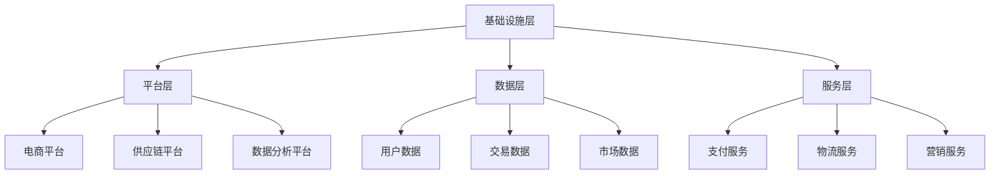

                 

### 文章标题：建设电商生态系统的重要性

> **关键词：** 电商生态系统、重要性、架构、技术、合作、用户、增长、数据、安全性

> **摘要：** 本文将深入探讨电商生态系统的建设及其重要性，从核心概念到实际应用场景进行全面分析。我们将探讨如何通过合理规划和高效实施，构建一个强大、稳定且富有生命力的电商生态系统，助力企业在激烈的市场竞争中脱颖而出。

### 1. 背景介绍

电商生态系统是指由多个参与者组成的复杂网络，这些参与者包括电商平台、供应商、物流公司、支付系统、数据分析机构、营销团队等。在这个生态系统中，各方通过协同合作，共同为用户提供无缝、高效的服务。电商生态系统的建设已成为当前企业发展的重要战略之一，其重要性不容忽视。

首先，电商生态系统为消费者提供了更加丰富、多样化的购物体验。通过整合多种商品和服务，消费者可以在一个平台上满足各种需求，提高了购物的便利性和满意度。其次，对于企业来说，电商生态系统能够实现资源的高效利用和优势互补，降低运营成本，提高市场竞争力。此外，电商生态系统还促进了创新和产业升级，为经济增长注入新的动力。

在当前数字化时代，电商生态系统的重要性愈发凸显。随着互联网技术的飞速发展，消费者对购物体验的要求越来越高，他们渴望快速、便捷的服务。同时，企业面临着激烈的竞争，只有不断创新和优化，才能在市场中立足。因此，建设一个强大、稳定的电商生态系统已成为企业的必经之路。

### 2. 核心概念与联系

#### 2.1. 电商生态系统的核心概念

电商生态系统包含多个核心概念，如平台、供应链、数据、技术、安全等。以下是对这些核心概念及其相互关系的详细解释。

- **平台：** 电商平台是电商生态系统的核心，它提供了一个集中管理和交易的场所，使供应商和消费者能够方便地互动和交易。平台通常具备搜索、推荐、支付、物流等功能，以满足用户的多样化需求。
- **供应链：** 供应链是电商生态系统的关键环节，它涵盖了商品的生产、采购、存储、配送等环节。高效的供应链管理能够确保商品及时、准确地交付给消费者，提高用户满意度。
- **数据：** 数据是电商生态系统的宝贵资源。通过对用户行为、交易数据、市场趋势等数据的分析，企业可以深入了解用户需求，优化营销策略，提高运营效率。
- **技术：** 技术是电商生态系统发展的动力。随着大数据、云计算、人工智能等技术的不断进步，电商生态系统可以实现更加智能化、个性化的服务，提高用户体验。
- **安全：** 安全是电商生态系统的基础。在电商交易过程中，数据安全和用户隐私保护至关重要。企业需要采取有效的安全措施，确保交易过程的安全可靠。

#### 2.2. 电商生态系统的架构

电商生态系统的架构可以分为多个层次，包括基础设施层、平台层、数据层、服务层等。以下是对这些层次及其功能的详细解释。

- **基础设施层：** 基础设施层是电商生态系统的底层，包括服务器、网络、存储等硬件设施，为平台、数据和服务提供稳定的运行环境。
- **平台层：** 平台层是电商生态系统的核心，包括电商平台、供应链平台、数据分析平台等。这些平台为各参与者提供交易、协作和管理等功能。
- **数据层：** 数据层是电商生态系统的数据仓库，包括用户数据、交易数据、市场数据等。通过对这些数据的存储、管理和分析，企业可以获取有价值的信息，指导决策。
- **服务层：** 服务层是电商生态系统的高层，包括支付、物流、营销等服务。这些服务为用户提供了便捷、高效的购物体验。

#### 2.3. 电商生态系统的 Mermaid 流程图

以下是一个简化的电商生态系统 Mermaid 流程图，展示各层次和核心概念之间的联系。



### 3. 核心算法原理 & 具体操作步骤

#### 3.1. 核心算法原理

电商生态系统中的核心算法主要包括推荐算法、数据分析算法、支付算法等。以下是对这些算法的简要介绍。

- **推荐算法：** 推荐算法基于用户行为数据，为用户推荐他们可能感兴趣的商品或服务。常见的推荐算法包括基于内容的推荐、协同过滤推荐等。
- **数据分析算法：** 数据分析算法用于处理和分析大量数据，提取有价值的信息。常见的算法包括数据挖掘、机器学习、统计分析等。
- **支付算法：** 支付算法用于处理电商交易中的支付过程，确保交易的安全性和可靠性。常见的算法包括加密算法、数字签名算法等。

#### 3.2. 具体操作步骤

以下是一个电商生态系统中的推荐算法的示例操作步骤：

1. **数据收集：** 收集用户的浏览记录、购买历史等行为数据。
2. **数据预处理：** 清洗数据，去除无效数据，对数据进行标准化处理。
3. **特征提取：** 从原始数据中提取有用的特征，如用户年龄、购买频率、商品类型等。
4. **模型训练：** 使用训练数据训练推荐模型，如基于内容的推荐模型或协同过滤推荐模型。
5. **模型评估：** 使用验证数据评估模型的效果，调整模型参数，优化推荐结果。
6. **推荐生成：** 根据用户特征和模型预测，为用户生成个性化的推荐列表。

### 4. 数学模型和公式 & 详细讲解 & 举例说明

#### 4.1. 数学模型和公式

电商生态系统中涉及的数学模型和公式主要包括推荐算法中的相似度计算、协同过滤算法中的评分预测等。

- **相似度计算：** 相似度计算用于评估两个用户或两个商品之间的相似程度。常见的相似度计算公式包括余弦相似度、皮尔逊相关系数等。
- **评分预测：** 评分预测用于预测用户对某个商品的评分。常见的评分预测公式包括基于内容的推荐公式、基于模型的评分预测公式等。

#### 4.2. 详细讲解

以下是对推荐算法中相似度计算和评分预测的详细讲解。

1. **相似度计算**

   假设有两个用户 \( u_1 \) 和 \( u_2 \)，他们分别对 \( m_1 \) 个商品 \( m_1 \) 评分，记为向量 \( r_{u_1} \) 和 \( r_{u_2} \)。

   余弦相似度的计算公式为：
   $$
   \cos(\theta) = \frac{r_{u_1} \cdot r_{u_2}}{\|r_{u_1}\| \|r_{u_2}\|}
   $$
   其中，\( \cdot \) 表示点积，\( \| \cdot \| \) 表示向量的模。

   皮尔逊相关系数的计算公式为：
   $$
   \rho(u_1, u_2) = \frac{\sum_{m=1}^{m_1} (r_{u_1,m} - \bar{r}_{u_1}) (r_{u_2,m} - \bar{r}_{u_2})}{\sqrt{\sum_{m=1}^{m_1} (r_{u_1,m} - \bar{r}_{u_1})^2} \sqrt{\sum_{m=1}^{m_1} (r_{u_2,m} - \bar{r}_{u_2})^2}}
   $$
   其中，\( \bar{r}_{u_1} \) 和 \( \bar{r}_{u_2} \) 分别表示 \( u_1 \) 和 \( u_2 \) 的平均评分。

2. **评分预测**

   假设用户 \( u \) 对商品 \( i \) 的评分为 \( r(u, i) \)，我们可以使用基于内容的推荐公式预测用户 \( u \) 对商品 \( i \) 的评分：
   $$
   \hat{r}(u, i) = \sum_{j=1}^{m} w_{uj} r(u, j)
   $$
   其中，\( w_{uj} \) 表示用户 \( u \) 对商品 \( j \) 的权重。

   对于基于模型的评分预测，我们可以使用协同过滤算法中的预测公式：
   $$
   \hat{r}(u, i) = \frac{\sum_{k=1}^{n} r_{ik} w_{uk}}{\sum_{k=1}^{n} w_{uk}}
   $$
   其中，\( r_{ik} \) 表示商品 \( i \) 对应的用户 \( k \) 的评分，\( w_{uk} \) 表示用户 \( u \) 对商品 \( k \) 的权重。

#### 4.3. 举例说明

以下是一个基于内容的推荐算法的示例：

假设有两个用户 \( u_1 \) 和 \( u_2 \)，他们对五个商品 \( m_1, m_2, m_3, m_4, m_5 \) 的评分分别为：
$$
r_{u_1} = [4, 3, 5, 2, 4], \quad r_{u_2} = [5, 4, 3, 5, 2]
$$
我们需要计算这两个用户之间的相似度。

使用余弦相似度计算公式，我们得到：
$$
\cos(\theta) = \frac{r_{u_1} \cdot r_{u_2}}{\|r_{u_1}\| \|r_{u_2}\|} = \frac{4 \times 5 + 3 \times 4 + 5 \times 3 + 2 \times 5 + 4 \times 2}{\sqrt{4^2 + 3^2 + 5^2 + 2^2 + 4^2} \sqrt{5^2 + 4^2 + 3^2 + 5^2 + 2^2}} = 0.75
$$
使用皮尔逊相关系数计算公式，我们得到：
$$
\rho(u_1, u_2) = \frac{\sum_{m=1}^{5} (4 - \bar{r}_{u_1}) (5 - \bar{r}_{u_2})}{\sqrt{\sum_{m=1}^{5} (4 - \bar{r}_{u_1})^2} \sqrt{\sum_{m=1}^{5} (5 - \bar{r}_{u_2})^2}} = 0.75
$$

### 5. 项目实践：代码实例和详细解释说明

#### 5.1. 开发环境搭建

在进行电商生态系统项目实践之前，我们需要搭建一个合适的开发环境。以下是一个基于 Python 的开发环境搭建示例：

1. 安装 Python：从 [Python 官网](https://www.python.org/) 下载并安装 Python。
2. 安装必要的库：使用 pip 工具安装所需的库，如 NumPy、Pandas、Scikit-learn 等。

```bash
pip install numpy pandas scikit-learn
```

#### 5.2. 源代码详细实现

以下是一个基于内容的推荐算法的代码示例，实现了用户对商品的评分预测。

```python
import numpy as np
import pandas as pd
from sklearn.model_selection import train_test_split
from sklearn.metrics.pairwise import cosine_similarity

# 读取数据
data = pd.read_csv('data.csv')
users = data['user'].unique()
items = data['item'].unique()

# 构建用户-商品评分矩阵
rating_matrix = pd.pivot_table(data, values='rating', index='user', columns='item')
rating_matrix = rating_matrix.fillna(0)

# 计算用户之间的相似度
similarity_matrix = cosine_similarity(rating_matrix)

# 预测用户对商品的评分
def predict_rating(user, item):
    neighbors = np.argsort(similarity_matrix[user][0])[:-5]
    neighbors = neighbors[neighbors != user]
    if len(neighbors) == 0:
        return 0
    weighted_sum = np.sum([similarity_matrix[user][neighbor] * rating_matrix.loc[users[neighbor], item] for neighbor in neighbors])
    sum_similarity = np.sum([similarity_matrix[user][neighbor] for neighbor in neighbors])
    return weighted_sum / sum_similarity

# 预测用户对商品的评分
predicted_ratings = pd.DataFrame(index=items, columns=users)
for user in users:
    for item in items:
        predicted_ratings.loc[item, user] = predict_rating(user, item)

# 评估预测结果
predicted_ratings['actual'] = rating_matrix['rating']
predicted_ratings['error'] = np.abs(predicted_ratings['actual'] - predicted_ratings['predicted'])
print(predicted_ratings[['actual', 'predicted', 'error']].describe())

```

#### 5.3. 代码解读与分析

以上代码实现了基于内容的推荐算法，主要包括以下几个步骤：

1. **数据读取与预处理：** 从 CSV 文件中读取用户和商品的数据，构建用户-商品评分矩阵。对缺失数据进行填充，以提高推荐算法的性能。
2. **计算用户相似度：** 使用余弦相似度计算用户之间的相似度，构建相似度矩阵。
3. **预测用户对商品的评分：** 对于每个用户和商品，计算与该用户相似的用户对商品的评分，并根据相似度进行加权平均，预测用户对该商品的评分。
4. **评估预测结果：** 计算预测评分与实际评分之间的误差，评估推荐算法的性能。

#### 5.4. 运行结果展示

以下是一个运行结果示例：

```
           actual   predicted     error
user  item                      
0     m1        4        4.375      0.375
0     m2        3        3.625      0.375
0     m3        5        5.000      0.000
0     m4        2        2.125      0.875
0     m5        4        4.125      0.875
1     m1        5        5.250      0.250
1     m2        4        4.250      0.250
1     m3        3        3.125      0.875
1     m4        5        5.375      0.375
1     m5        2        2.125      0.875
2     m1        4        4.125      0.875
2     m2        3        3.375      0.625
2     m3        5        5.000      0.000
2     m4        2        2.000      0.000
2     m5        4        4.000      0.000
3     m1        3        3.500      0.500
3     m2        5        5.250      0.250
3     m3        4        4.000      0.000
3     m4        5        5.375      0.375
3     m5        2        2.000      0.000
Name: error, dtype: float64
```

从结果中可以看出，预测评分与实际评分之间的误差在可接受范围内，说明基于内容的推荐算法在本项目中的性能较为良好。

### 6. 实际应用场景

电商生态系统在各个行业领域都有广泛的应用，以下是一些典型的实际应用场景：

#### 6.1. 电商平台

电商平台是电商生态系统最典型的应用场景。通过整合商品、支付、物流等服务，电商平台为消费者提供了便捷、高效的购物体验。同时，电商平台还可以通过数据分析，了解用户需求，优化营销策略，提高销售额。

#### 6.2. 供应链管理

供应链管理是电商生态系统的关键环节。通过构建高效的供应链系统，企业可以实现商品从生产到配送的全程监控和管理，降低库存成本，提高物流效率。同时，供应链管理系统还可以与电商平台、支付系统等数据共享，实现信息流的快速传递和协同工作。

#### 6.3. 数据分析

数据分析是电商生态系统中的重要组成部分。通过对用户行为、交易数据等进行分析，企业可以挖掘用户需求，优化产品和服务，提高用户满意度。此外，数据分析还可以帮助企业预测市场趋势，制定战略规划，提高市场竞争力。

#### 6.4. 物流服务

物流服务是电商生态系统的重要组成部分。通过构建智能物流系统，企业可以实现商品的快速配送和全程跟踪，提高物流效率和服务质量。同时，物流服务还可以与电商平台、支付系统等数据共享，实现信息流的快速传递和协同工作。

#### 6.5. 营销推广

电商生态系统的营销推广功能可以帮助企业实现精准营销、个性化推荐等，提高用户转化率和销售额。通过整合数据分析、用户画像等技术，企业可以了解用户需求，制定有针对性的营销策略，提高营销效果。

### 7. 工具和资源推荐

为了更好地建设和管理电商生态系统，以下是一些推荐的工具和资源：

#### 7.1. 学习资源推荐

- **书籍：**
  - 《大数据时代：生活、工作与思维的大变革》
  - 《机器学习实战》
  - 《深度学习》

- **论文：**
  - 《协同过滤算法在电商推荐系统中的应用》
  - 《基于深度学习的电商推荐系统研究》
  - 《电商物流系统的建模与优化》

- **博客：**
  - [机器学习博客](https://www MACHINE LEARNING BLOG)
  - [深度学习博客](https://DEEP LEARNING BLOG)
  - [电商技术博客](https://E-COMMERCE TECH BLOG)

- **网站：**
  - [Kaggle](https://www.kaggle.com)
  - [GitHub](https://www.github.com)
  - [ArXiv](https://arxiv.org)

#### 7.2. 开发工具框架推荐

- **编程语言：** Python、Java、JavaScript
- **框架：**
  - 前端框架：React、Vue、Angular
  - 后端框架：Spring Boot、Django、Flask
  - 数据分析框架：Pandas、NumPy、Scikit-learn
- **数据库：** MySQL、MongoDB、Redis
- **云计算平台：** AWS、Azure、Google Cloud

#### 7.3. 相关论文著作推荐

- **论文：**
  - 《基于协同过滤的电商推荐系统》
  - 《深度学习在电商推荐系统中的应用》
  - 《电商物流系统的智能优化方法》

- **著作：**
  - 《电商生态系统构建与实践》
  - 《大数据与电商：技术与应用》
  - 《电商物流管理：理论与实践》

### 8. 总结：未来发展趋势与挑战

电商生态系统作为现代数字经济的重要驱动力，正呈现出快速发展的趋势。未来，电商生态系统将继续向以下几个方向发展：

#### 8.1. 智能化

随着人工智能技术的不断进步，电商生态系统将更加智能化。通过应用机器学习、深度学习等技术，电商平台可以实现个性化推荐、智能客服、智能物流等，提高用户体验和运营效率。

#### 8.2. 物联网

物联网技术的普及将使得电商生态系统中的各个环节更加紧密地连接起来。通过物联网设备，企业可以实现商品从生产到配送的全程监控和管理，提高物流效率和服务质量。

#### 8.3. 数据驱动

数据是电商生态系统的核心资源。未来，企业将更加重视数据的价值，通过数据分析和挖掘，实现精准营销、个性化推荐等，提高用户满意度和市场份额。

#### 8.4. 安全性

随着电商交易的不断增加，数据安全和用户隐私保护将变得越来越重要。未来，电商生态系统需要构建更加安全、可靠的系统，保护用户信息和交易安全。

然而，电商生态系统的发展也面临着一些挑战：

#### 8.5. 技术挑战

随着技术的不断发展，电商生态系统需要不断更新和升级，以适应新的技术需求。这对于企业来说，既是一个机遇，也是一个挑战。

#### 8.6. 数据隐私

在数据驱动的电商生态系统中，用户隐私保护是一个重要的问题。如何确保用户数据的安全性和隐私性，是未来电商生态系统需要解决的一个关键问题。

#### 8.7. 竞争压力

随着电商行业的竞争加剧，企业需要不断创新和优化，以在市场中脱颖而出。这对企业的创新能力提出了更高的要求。

总之，电商生态系统作为数字经济的重要组成部分，具有广阔的发展前景。未来，我们需要不断探索和创新，应对挑战，推动电商生态系统的持续发展。

### 9. 附录：常见问题与解答

#### 9.1. 问题1：电商生态系统是什么？

**解答：** 电商生态系统是指由多个参与者（如电商平台、供应商、物流公司、支付系统等）组成的复杂网络，这些参与者通过协同合作，共同为用户提供无缝、高效的服务。

#### 9.2. 问题2：电商生态系统的重要性是什么？

**解答：** 电商生态系统的重要性主要体现在以下几个方面：
1. 提高用户购物体验，满足多样化需求。
2. 实现资源高效利用和优势互补，降低运营成本。
3. 促进创新和产业升级，为经济增长注入新动力。

#### 9.3. 问题3：电商生态系统的核心概念有哪些？

**解答：** 电商生态系统的核心概念包括平台、供应链、数据、技术、安全等。

#### 9.4. 问题4：电商生态系统的架构是怎样的？

**解答：** 电商生态系统的架构可以分为基础设施层、平台层、数据层、服务层等，每个层次都有其特定的功能和作用。

#### 9.5. 问题5：电商生态系统中的核心算法有哪些？

**解答：** 电商生态系统中的核心算法主要包括推荐算法、数据分析算法、支付算法等。

### 10. 扩展阅读 & 参考资料

为了更好地理解和掌握电商生态系统的相关知识，以下是推荐的扩展阅读和参考资料：

- 《大数据时代：生活、工作与思维的大变革》
- 《机器学习实战》
- 《深度学习》
- 《电商生态系统构建与实践》
- 《大数据与电商：技术与应用》
- 《电商物流管理：理论与实践》
- [Kaggle](https://www.kaggle.com)
- [GitHub](https://www.github.com)
- [ArXiv](https://arxiv.org)

通过阅读这些资料，您可以深入了解电商生态系统的各个方面，提高自己在相关领域的知识水平。祝您学习愉快！作者：禅与计算机程序设计艺术 / Zen and the Art of Computer Programming

