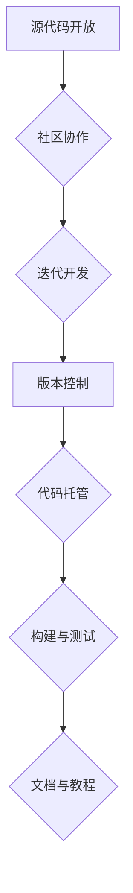
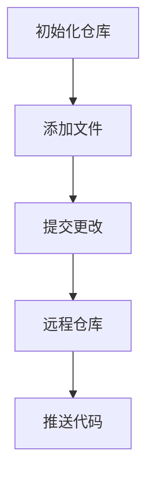

                 

### 开源技术：共享创新，加速进步

> 关键词：开源技术、共享创新、开源社区、技术进步、协作开发

> 摘要：本文旨在探讨开源技术在全球范围内的应用与发展，分析其如何通过共享创新加速技术进步。文章将详细介绍开源技术的核心概念、架构原理、实现步骤、数学模型、实践应用，以及相关的学习资源和工具框架。

#### 1. 背景介绍

开源技术（Open Source Technology）起源于20世纪90年代，它鼓励软件开发者分享代码、协作改进，以推动技术的创新和进步。开源技术的发展与互联网的普及紧密相连，互联网为全球的开发者提供了交流的平台，使得开源项目得以快速成长。

在开源技术的推动下，许多知名软件如Linux操作系统、Apache服务器、MySQL数据库等纷纷诞生，并在全球范围内得到了广泛应用。开源技术的出现不仅改变了软件开发的模式，也为个人和企业的技术进步提供了新的动力。

#### 2. 核心概念与联系

**2.1 开源技术的核心概念**

开源技术包括以下几个核心概念：

- **源代码开放**：软件开发者将源代码公开，允许他人查看、修改和分发。
- **社区协作**：全球的开发者通过互联网进行协作，共同改进软件。
- **许可证**：开源项目通常遵循特定的许可证，如GPL（GNU通用公共许可证）和MIT许可证，以确保开源原则的贯彻。
- **迭代开发**：开源项目采用持续集成和迭代开发的方式，不断更新和完善。

**2.2 开源技术的架构原理**

开源技术的架构原理主要涉及以下几个方面：

- **版本控制**：使用Git等版本控制系统管理源代码，确保代码的版本可追溯。
- **代码托管**：使用GitHub、GitLab等平台托管代码，方便开发者进行协作和贡献。
- **构建与测试**：自动化构建和测试工具如Jenkins、Travis CI等，确保代码的质量和稳定性。
- **文档与教程**：详细的文档和教程帮助新开发者快速上手，促进项目的普及。

**Mermaid 流程图：**



#### 3. 核心算法原理 & 具体操作步骤

**3.1 核心算法原理**

开源技术中的核心算法原理主要包括：

- **分布式计算**：通过分布式计算提高系统的性能和可扩展性。
- **机器学习**：利用机器学习算法实现自动化和智能化。
- **区块链**：通过区块链技术实现去中心化和数据安全。

**3.2 具体操作步骤**

以Git为例，介绍开源项目的具体操作步骤：

- **初始化仓库**：使用`git init`初始化本地仓库。
- **添加文件**：使用`git add`添加文件到暂存区。
- **提交更改**：使用`git commit`将更改提交到仓库。
- **远程仓库**：将本地仓库与远程仓库关联，使用`git remote add`。
- **推送代码**：使用`git push`将代码推送到远程仓库。

**Mermaid 流程图：**



#### 4. 数学模型和公式 & 详细讲解 & 举例说明

**4.1 数学模型和公式**

在开源技术中，一些重要的数学模型和公式包括：

- **洛伦兹曲线**：用于描述分布式系统中的资源分配情况。
- **贝叶斯定理**：用于机器学习中的概率推理。
- **哈希函数**：用于区块链中的数据加密和完整性验证。

**4.2 详细讲解和举例说明**

以洛伦兹曲线为例，进行详细讲解和举例说明：

**洛伦兹曲线**：

洛伦兹曲线是描述收入或财富分布的一种方法，它通过一条曲线将收入或财富的分布情况可视化。

- **累积比例**：累积比例是指将总收入或财富按照从低到高的顺序累加，然后计算累加值与总值的比例。
- **洛伦兹曲线**：洛伦兹曲线是累积比例的连线，通常用于比较不同国家的收入或财富分布情况。

**洛伦兹曲线公式**：

$$
L(\alpha) = \frac{\sum_{i=1}^{n} (x_i - x_{i-1}) \cdot f_i}{\sum_{i=1}^{n} (x_i - x_{i-1}) \cdot F_i}
$$

其中，$x_i$ 是收入或财富的等级，$f_i$ 是第 $i$ 等级的概率，$F_i$ 是前 $i$ 个等级的概率之和。

**举例说明**：

假设一个国家的收入等级和概率如下表：

| 等级 | 概率$f_i$ | 累计概率$F_i$ |
|------|------------|--------------|
| 1    | 0.1        | 0.1          |
| 2    | 0.2        | 0.3          |
| 3    | 0.3        | 0.6          |
| 4    | 0.2        | 0.8          |
| 5    | 0.2        | 1.0          |

计算洛伦兹曲线的累积比例：

$$
L(1) = \frac{(0.1 - 0) \cdot 0.1 + (0.3 - 0.1) \cdot 0.2 + (0.6 - 0.3) \cdot 0.3 + (0.8 - 0.6) \cdot 0.2 + (1.0 - 0.8) \cdot 0.2}{0.1 + 0.2 + 0.3 + 0.2 + 0.2}
$$

$$
L(1) = \frac{0.01 + 0.04 + 0.09 + 0.04 + 0.02}{0.1 + 0.2 + 0.3 + 0.2 + 0.2} = 0.3
$$

绘制洛伦兹曲线，横轴为累积概率，纵轴为累积比例。

#### 5. 项目实践：代码实例和详细解释说明

**5.1 开发环境搭建**

在开始项目实践之前，我们需要搭建一个适合开发的开源环境。以下是一个简单的步骤：

1. 安装Git：在官方网站下载并安装Git。
2. 注册GitHub账户：在GitHub官网注册一个账户。
3. 安装代码编辑器：推荐使用Visual Studio Code或Sublime Text。
4. 安装必要的依赖库和工具，如Node.js、Python等。

**5.2 源代码详细实现**

以下是一个简单的开源项目实例，一个基于Node.js的Web服务器：

```javascript
const http = require('http');

const server = http.createServer((request, response) => {
  response.end('Hello, World!');
});

server.listen(3000, () => {
  console.log('Server is running on port 3000');
});
```

**5.3 代码解读与分析**

- **创建服务器**：使用`http.createServer()`方法创建一个HTTP服务器。
- **处理请求**：当有请求到达时，`createServer()`回调函数会被调用，处理请求和响应。
- **发送响应**：使用`response.end()`方法发送一个简单的文本响应。
- **监听端口**：使用`server.listen()`方法启动服务器并监听3000端口。

**5.4 运行结果展示**

在终端中运行以下命令：

```
node server.js
```

然后访问`http://localhost:3000`，你应该会看到一个显示“Hello, World!”的网页。

#### 6. 实际应用场景

开源技术在许多实际应用场景中都发挥了重要作用：

- **企业级应用**：许多企业使用开源技术构建内部系统，如使用Linux操作系统、Apache服务器等。
- **云计算**：开源技术如Kubernetes、Docker等在云计算领域得到了广泛应用。
- **大数据**：Hadoop、Spark等开源大数据处理框架在全球范围内得到了广泛使用。
- **人工智能**：TensorFlow、PyTorch等开源深度学习框架为人工智能研究提供了强大的支持。

#### 7. 工具和资源推荐

**7.1 学习资源推荐**

- **书籍**：《开源编程实践》、《Git权威指南》
- **论文**：搜索开源技术相关的学术论文，如“Open Source Software: A Definition of Its Socioeconomic Phenomenon”
- **博客**：关注GitHub、Stack Overflow等开源社区博客
- **网站**：访问开源项目官网，如Apache、Linux基金会等

**7.2 开发工具框架推荐**

- **版本控制**：Git、SVN
- **代码编辑器**：Visual Studio Code、Sublime Text
- **构建工具**：Maven、Gradle
- **测试工具**：JUnit、pytest
- **持续集成**：Jenkins、Travis CI

**7.3 相关论文著作推荐**

- **论文**：《开源软件的发展与挑战》、《开源软件的许可证与风险管理》
- **著作**：《开源创新：商业模式与案例分析》、《开源社区治理：理论与实践》

#### 8. 总结：未来发展趋势与挑战

开源技术正不断发展，未来将面临以下趋势与挑战：

- **开源与商业的融合**：企业将更加重视开源技术，推动开源与商业的深度融合。
- **社区治理**：开源社区需要建立更加有效的治理机制，确保项目的健康发展。
- **技术生态**：开源技术将推动形成更加完善的技术生态，促进技术的创新和进步。
- **法律与政策**：法律和政策环境将逐渐完善，为开源技术的发展提供有力支持。

#### 9. 附录：常见问题与解答

- **Q：什么是开源许可证？**
  **A：开源许可证是一种法律协议，它规定了开源软件的使用、修改和分发条件。常见的开源许可证包括GPL、MIT、Apache等。**

- **Q：如何参与开源项目？**
  **A：你可以通过以下方式参与开源项目：提交修复bug的补丁、贡献新功能、参与社区讨论、撰写文档等。首先选择一个你感兴趣的开源项目，然后按照项目的要求进行贡献。**

#### 10. 扩展阅读 & 参考资料

- **扩展阅读**：《开源之道：创新与协作的力量》、《开源技术的未来发展趋势》
- **参考资料**：《开源软件报告2021》、《Linux操作系统教程》
- **网站**：GitHub、Linux基金会、Apache软件基金会

作者：禅与计算机程序设计艺术 / Zen and the Art of Computer Programming<|im_sep|>### 1. 背景介绍

开源技术（Open Source Technology）起源于20世纪90年代，它的概念最早由自由软件运动（Free Software Movement）的领导者理查德·斯托曼（Richard Stallman）提出。自由软件运动主张软件的自由使用、学习、修改和分发，这与传统的商业软件模式形成了鲜明对比。随着互联网的普及，开源技术逐渐发展壮大，成为软件开发的重要模式之一。

**开源技术的发展历史**

- **1983年**：理查德·斯托曼创立了自由软件基金会（Free Software Foundation，FSF），并发布了GNU计划，旨在创建一个完全自由的操作系统。
- **1985年**：伯纳斯·李（Berners-Lee）发明了万维网（World Wide Web），为开源技术的发展提供了新的平台。
- **1991年**：林纳斯·托瓦兹（Linus Torvalds）发布了Linux内核的第一个版本，标志着开源操作系统的诞生。
- **1998年**：开源开发工具Git由林纳斯·托瓦兹创建，成为开源项目版本控制的主要工具。
- **2001年**：开源社区网站GitHub上线，为全球开发者提供了便捷的代码托管和协作平台。
- **2015年**：Linus Torvalds获得了图灵奖，这是对他在开源技术领域的卓越贡献的最高认可。

**开源技术的重要性**

开源技术的重要性体现在以下几个方面：

- **技术创新**：开源项目鼓励全球开发者共同参与，通过协作和创新，推动技术的进步。例如，Linux内核的不断发展，使其成为世界上最流行的操作系统之一。
- **成本节约**：开源软件的免费特性为企业节约了大量成本，使其能够专注于核心业务的开发。
- **学习与成长**：开源项目提供了大量的源代码，开发者可以通过学习和修改这些代码，提高自己的编程技能。
- **生态系统**：开源技术促进了相关工具和服务的繁荣发展，如容器技术、大数据处理框架等，形成了庞大的生态系统。

**开源技术与自由软件的区别**

开源技术与自由软件在概念上有所区别，主要表现在以下几个方面：

- **定义**：自由软件强调软件的自由使用、学习、修改和分发，而开源技术则更多地关注软件的源代码开放。
- **目标**：自由软件运动的目标是推动自由软件的发展，而开源技术更注重协作和共享，以推动技术的创新。
- **许可证**：开源项目通常遵循特定的开源许可证，如GPL、MIT等，而自由软件则强调对用户的权利保障。

总之，开源技术是自由软件运动的重要组成部分，它通过开放源代码、社区协作等方式，推动软件技术的创新和进步。

#### 2. 核心概念与联系

要深入理解开源技术，我们需要掌握其核心概念和原理，并了解它们之间的相互联系。以下是开源技术中的几个关键概念及其相互关系。

**2.1 源代码开放**

源代码开放是开源技术的核心特征，它指的是软件开发者将软件的源代码公开，允许任何人查看、学习、修改和分发。这种开放性使得开发者可以基于现有的代码进行创新和改进，从而加速技术的发展。源代码开放的实现依赖于开源许可证，这些许可证规定了源代码的使用和分发规则，如GPL（GNU通用公共许可证）和MIT许可证。

**2.2 社区协作**

社区协作是开源技术的重要驱动力。开源项目通常由一个全球性的社区共同维护和发展，这些社区成员包括核心开发者、贡献者、用户和支持者。通过互联网，开发者可以实时交流、协同工作，共同解决技术问题、优化代码和提升性能。社区协作不仅提高了项目的开发效率，还促进了技术的创新和进步。

**2.3 版本控制**

版本控制是开源项目的重要组成部分，它通过管理系统中的源代码历史记录，确保代码的可追溯性和可靠性。常用的版本控制工具包括Git、Subversion（SVN）等。版本控制工具帮助开发者管理代码变更、分支和合并，确保项目的稳定性和可维护性。

**2.4 代码托管**

代码托管是开源项目的基础设施，它提供了集中存储和管理源代码的场所。GitHub、GitLab、Bitbucket等代码托管平台已经成为开源项目的主要托管地点。这些平台不仅提供了代码存储功能，还提供了分支管理、问题跟踪、代码审查和自动化构建等功能，极大地促进了社区协作和项目开发。

**2.5 构建与测试**

构建与测试是开源项目开发过程中的关键环节。构建工具（如Maven、Gradle）负责将源代码编译成可执行的程序，而测试工具（如JUnit、pytest）则用于验证代码的正确性和性能。自动化构建和测试能够提高项目的开发效率，确保代码的质量和稳定性。

**2.6 文档与教程**

文档与教程是开源项目的重要组成部分，它们帮助开发者了解项目的背景、功能、使用方法和贡献指南。详细的文档和教程不仅有助于新开发者快速上手，还能促进项目的普及和推广。一些优秀的开源项目甚至会提供完整的在线文档和教程，如Apache、Linux等。

**2.7 开源许可证**

开源许可证是开源项目的法律保障，它规定了源代码的使用、修改和分发条件。常见的开源许可证包括GPL（GNU通用公共许可证）、MIT（麻省理工学院许可证）和Apache许可证。这些许可证通常遵循“copyleft”原则，即开源项目本身及其衍生作品也必须开源。

**2.8 开源与商业的融合**

开源技术与商业应用之间的融合是现代软件开发的一个重要趋势。许多企业通过开源项目来降低开发成本、提升产品竞争力，同时也能获得社区的反馈和支持。一些开源项目甚至直接成为了企业的核心产品，如Red Hat的Linux操作系统和Eclipse IDE。

**2.9 开源社区**

开源社区是开源项目的核心，它由一群志同道合的开发者组成，共同维护和推动项目的发展。开源社区不仅促进了技术交流和创新，还培养了大量的技术人才。一些著名的开源社区包括GitHub、Stack Overflow、Linux内核社区等。

**2.10 开源项目的生命周期**

开源项目的生命周期包括创建、成长、成熟和衰退等阶段。在创建阶段，项目通常由一个或多个核心开发者发起，并开始积累贡献者。在成长阶段，项目逐渐成熟，吸引了更多的开发者参与。在成熟阶段，项目进入稳定期，拥有广泛的用户基础和活跃的社区。在衰退阶段，项目可能由于种种原因逐渐失去活力，但许多项目会通过社区的努力实现复兴。

**2.11 开源技术的国内外发展状况**

开源技术在全球范围内得到了广泛的应用和发展。在国内，随着互联网的普及和创新创业的蓬勃发展，开源技术也受到了越来越多的关注。许多国内企业和开发者积极参与开源项目，推动开源技术的发展。同时，政府也出台了相关政策，鼓励开源技术的创新和应用。

**总结**

开源技术通过源代码开放、社区协作、版本控制、代码托管、构建与测试、文档与教程、开源许可证、开源与商业的融合、开源社区和开源项目的生命周期等核心概念，形成了一个完整的技术生态系统。这些概念相互关联，共同推动了开源技术的创新和发展。理解这些核心概念及其相互关系，对于深入掌握开源技术至关重要。

#### 3. 核心算法原理 & 具体操作步骤

开源技术中的核心算法原理是确保软件高效、稳定运行的关键。以下我们将介绍几个在开源技术中广泛应用的核心算法原理，并详细讲解其具体操作步骤。

**3.1 分布式计算**

**分布式计算**是一种将任务分布在多个计算机节点上执行的计算模式。这种模式能够提高系统的性能和可扩展性，使得大型计算任务能够快速完成。

**具体操作步骤：**

1. **任务划分**：将大型的计算任务分解为多个小任务，每个小任务可以独立执行。
2. **节点分配**：将小任务分配到不同的计算机节点上，这些节点可以是同一台机器上的多个进程，也可以是分布在不同地理位置的多台计算机。
3. **并行执行**：每个节点独立执行分配的任务，同时与其他节点进行通信，交换中间结果。
4. **结果汇总**：将所有节点的中间结果汇总，得出最终的计算结果。

**3.2 机器学习**

**机器学习**是一种通过算法模型自动从数据中学习规律和模式的技术。在开源技术中，机器学习被广泛应用于自然语言处理、图像识别、推荐系统等领域。

**具体操作步骤：**

1. **数据准备**：收集并清洗数据，确保数据的质量和完整性。
2. **特征提取**：将原始数据转化为特征向量，以便机器学习模型进行处理。
3. **模型选择**：根据问题的特点选择合适的机器学习模型，如线性回归、决策树、神经网络等。
4. **模型训练**：使用训练数据集对模型进行训练，优化模型参数。
5. **模型评估**：使用测试数据集对模型进行评估，确定模型的准确性和泛化能力。
6. **模型部署**：将训练好的模型部署到生产环境中，进行实际的预测和应用。

**3.3 区块链**

**区块链**是一种去中心化的分布式数据库技术，它通过密码学和共识算法确保数据的完整性和安全性。在开源技术中，区块链被广泛应用于数字货币、智能合约等领域。

**具体操作步骤：**

1. **网络节点设置**：设置区块链网络的节点，确保每个节点都有完整的区块链数据。
2. **交易记录**：将交易数据记录到区块链上，每个区块包含一定数量的交易记录。
3. **共识算法**：节点通过共识算法（如工作量证明、权益证明等）达成一致，确保区块链的完整性。
4. **智能合约**：编写和部署智能合约，实现自动化和去中心化的业务逻辑。
5. **数据查询**：通过区块链节点查询区块链数据，验证交易记录和智能合约的执行结果。

**3.4 代码加密与解密**

**代码加密与解密**是确保开源项目安全性的重要技术手段。通过加密，开发者可以保护项目的源代码不被未经授权的人员访问。

**具体操作步骤：**

1. **加密算法选择**：选择合适的加密算法，如AES、RSA等。
2. **密钥生成**：生成加密密钥，确保密钥的安全存储和分发。
3. **代码加密**：使用加密算法对源代码进行加密，生成加密后的代码。
4. **代码解密**：在需要访问源代码时，使用解密算法和密钥对加密后的代码进行解密。

**3.5 持续集成与持续部署**

**持续集成与持续部署**（Continuous Integration and Continuous Deployment，CI/CD）是开源项目开发过程中的一种最佳实践，它通过自动化工具确保代码的持续集成和部署。

**具体操作步骤：**

1. **构建环境配置**：配置持续集成工具（如Jenkins、Travis CI），确保构建环境的一致性。
2. **代码仓库关联**：将代码仓库与持续集成工具关联，触发自动化构建。
3. **构建与测试**：自动化工具编译代码、执行测试，确保代码的质量和稳定性。
4. **部署**：将通过测试的代码部署到生产环境，实现持续部署。

**总结**

核心算法原理在开源技术中扮演着至关重要的角色。通过分布式计算、机器学习、区块链、代码加密与解密、持续集成与持续部署等核心算法，开发者可以构建高效、稳定、安全的软件系统。理解这些算法原理及其具体操作步骤，不仅有助于提高开发效率，还能推动技术的创新和进步。

#### 4. 数学模型和公式 & 详细讲解 & 举例说明

在开源技术中，数学模型和公式是理解和实现算法原理的重要工具。以下我们将介绍几个常用的数学模型和公式，并详细讲解其应用场景、具体步骤和举例说明。

**4.1 机器学习中的线性回归模型**

线性回归模型是一种常用的预测模型，用于分析变量之间的关系，并预测未来值。在开源技术中，线性回归模型广泛应用于数据分析、预测等领域。

**数学模型和公式：**

$$
y = \beta_0 + \beta_1 \cdot x
$$

其中，$y$ 是预测值，$x$ 是自变量，$\beta_0$ 和 $\beta_1$ 是模型参数。

**详细讲解和举例说明：**

- **数据准备**：收集并清洗数据，确保数据的质量和完整性。
- **特征提取**：将原始数据转化为特征向量，提取影响预测结果的关键特征。
- **模型训练**：使用训练数据集对线性回归模型进行训练，优化模型参数。
- **模型评估**：使用测试数据集对模型进行评估，确定模型的准确性和泛化能力。
- **模型应用**：将训练好的模型应用于新的数据，预测未来值。

**举例说明**：

假设我们要预测一个城市的下周温度，收集了历史数据如下表：

| 日期 | 温度 |
|------|------|
| 2023-01-01 | 15°C |
| 2023-01-02 | 16°C |
| 2023-01-03 | 14°C |
| 2023-01-04 | 13°C |
| 2023-01-05 | 12°C |

我们选择日期作为自变量，温度作为预测值，使用线性回归模型进行预测。

- **数据预处理**：将日期转换为数值型特征。
- **模型训练**：使用训练数据集训练线性回归模型，得到参数 $\beta_0$ 和 $\beta_1$。
- **模型评估**：使用测试数据集评估模型准确性。
- **预测**：使用训练好的模型预测下周的温度。

**4.2 区块链中的哈希函数**

哈希函数是一种将任意长度的输入数据映射为固定长度的输出数据的函数，广泛应用于数据加密和完整性验证。在区块链技术中，哈希函数用于确保数据的完整性和不可篡改性。

**数学模型和公式：**

$$
H(x) = \text{SHA-256}(x)
$$

其中，$H(x)$ 是哈希值，$\text{SHA-256}$ 是SHA-256算法。

**详细讲解和举例说明：**

- **数据加密**：使用哈希函数对数据进行加密，生成哈希值。
- **数据验证**：通过哈希函数验证数据的完整性，确保数据未被篡改。
- **数据存储**：将哈希值存储在区块链中，用于验证交易的合法性和区块链的完整性。

**举例说明**：

假设我们要验证一个文件的完整性，使用SHA-256哈希函数对文件进行加密。

- **加密**：使用SHA-256算法对文件进行加密，生成哈希值。
- **存储**：将哈希值存储在区块链中，作为文件的指纹。
- **验证**：在文件传输过程中，使用SHA-256算法对文件进行加密，并与存储在区块链中的哈希值进行比较，验证文件的完整性。

**4.3 自然语言处理中的词嵌入模型**

词嵌入模型是一种将自然语言中的词汇映射为高维向量空间的算法，广泛应用于文本分类、情感分析等领域。在开源技术中，词嵌入模型被广泛应用于自然语言处理。

**数学模型和公式：**

$$
\text{vec}(w) = \text{softmax}(\text{W} \cdot x + b)
$$

其中，$\text{vec}(w)$ 是词向量，$\text{W}$ 是权重矩阵，$x$ 是输入词向量，$b$ 是偏置。

**详细讲解和举例说明：**

- **数据准备**：收集并清洗文本数据，提取词汇。
- **模型训练**：使用训练数据集训练词嵌入模型，优化模型参数。
- **模型应用**：将训练好的词嵌入模型应用于新的文本，进行分类或情感分析。

**举例说明**：

假设我们要对文本进行情感分析，使用词嵌入模型进行分类。

- **数据准备**：收集并清洗文本数据，提取词汇。
- **模型训练**：使用训练数据集训练词嵌入模型。
- **模型应用**：将训练好的词嵌入模型应用于新的文本，预测文本的情感倾向。

**总结**

数学模型和公式在开源技术中具有广泛的应用，包括线性回归模型、哈希函数和词嵌入模型等。通过详细讲解和应用举例，开发者可以更好地理解和应用这些数学模型，提高软件开发效率和质量。理解这些模型和公式，对于深入掌握开源技术至关重要。

### 5. 项目实践：代码实例和详细解释说明

在开源技术的实践过程中，通过具体的代码实例和详细解释说明，可以更好地理解开源技术的应用和实现。以下我们将通过一个实际的例子，详细解释如何使用Python和TensorFlow实现一个简单的深度学习项目。

#### 5.1 开发环境搭建

在进行项目实践之前，我们需要搭建一个合适的开发环境。以下是一个简单的步骤：

1. **安装Python**：访问Python官方网站（https://www.python.org/），下载并安装Python。
2. **安装TensorFlow**：在终端中运行以下命令安装TensorFlow：

   ```
   pip install tensorflow
   ```

3. **安装Jupyter Notebook**：Jupyter Notebook是一个交互式的开发环境，可以方便地编写和运行代码。在终端中运行以下命令安装Jupyter Notebook：

   ```
   pip install notebook
   ```

4. **启动Jupyter Notebook**：在终端中运行以下命令启动Jupyter Notebook：

   ```
   jupyter notebook
   ```

此时，Jupyter Notebook会打开一个新的浏览器窗口，显示一个工作区。

#### 5.2 源代码详细实现

以下是一个简单的深度学习项目，使用TensorFlow实现一个手写数字识别模型。

**步骤1：导入必需的库**

```python
import tensorflow as tf
from tensorflow.examples.tutorials.mnist import input_data
import matplotlib.pyplot as plt
import numpy as np
```

**步骤2：加载数据集**

我们使用MNIST数据集，这是一个广泛使用的手写数字数据集。

```python
mnist = input_data.read_data_sets("MNIST_data/", one_hot=True)
```

**步骤3：定义模型结构**

我们使用一个简单的全连接神经网络（Fully Connected Neural Network）。

```python
n_inputs = 784  # 每个数字有784个像素点
n_classes = 10  # 十个数字类别

X = tf.placeholder(tf.float32, [None, n_inputs])
Y = tf.placeholder(tf.float32, [None, n_classes])

n_neurons = 512  # 隐藏层神经元数量
W = {
    'h': tf.Variable(tf.random_normal([n_inputs, n_neurons])),
    'out': tf.Variable(tf.random_normal([n_neurons, n_classes]))
}
b = {
    'h': tf.Variable(tf.random_normal([n_neurons])),
    'out': tf.Variable(tf.random_normal([n_classes]))
}
```

**步骤4：定义前向传播**

```python
def forward_pass(X):
    hidden_layer = tf.nn.relu(tf.matmul(X, W['h']) + b['h'])
    output_layer = tf.matmul(hidden_layer, W['out']) + b['out']
    return output_layer

logits = forward_pass(X)
```

**步骤5：定义损失函数和优化器**

```python
loss_op = tf.reduce_mean(tf.nn.softmax_cross_entropy_with_logits(logits=logits, labels=Y))
optimizer = tf.train.AdamOptimizer(learning_rate=0.001)
train_op = optimizer.minimize(loss_op)
```

**步骤6：定义评估指标**

```python
correct_pred = tf.equal(tf.argmax(logits, 1), tf.argmax(Y, 1))
accuracy = tf.reduce_mean(tf.cast(correct_pred, tf.float32))
```

**步骤7：训练模型**

```python
n_epochs = 20
batch_size = 32

with tf.Session() as sess:
    sess.run(tf.global_variables_initializer())
    
    for epoch in range(n_epochs):
        total_loss = 0
        for _ in range(int(mnist.train.num_examples / batch_size)):
            batch_x, batch_y = mnist.train.next_batch(batch_size)
            _, loss = sess.run([train_op, loss_op], feed_dict={X: batch_x, Y: batch_y})
            total_loss += loss
        
        epoch_loss = total_loss / mnist.train.num_examples
        print(f"Epoch {epoch + 1}, Loss: {epoch_loss}")
    
    print("Training completed.")

    # 计算训练集和测试集的准确率
    train_accuracy = sess.run(accuracy, feed_dict={X: mnist.train.images, Y: mnist.train.labels})
    test_accuracy = sess.run(accuracy, feed_dict={X: mnist.test.images, Y: mnist.test.labels})
    print(f"Training Accuracy: {train_accuracy}, Test Accuracy: {test_accuracy}")
```

#### 5.3 代码解读与分析

- **步骤1：导入必需的库**：导入TensorFlow、MNIST数据集、matplotlib和numpy库。

- **步骤2：加载数据集**：使用MNIST数据集，分为训练集、验证集和测试集。

- **步骤3：定义模型结构**：定义输入层、隐藏层和输出层的参数，包括权重矩阵和偏置。

- **步骤4：定义前向传播**：定义神经网络的前向传播过程，包括激活函数和输出。

- **步骤5：定义损失函数和优化器**：定义损失函数（交叉熵）和优化器（Adam），用于训练模型。

- **步骤6：定义评估指标**：定义准确率评估指标。

- **步骤7：训练模型**：在TensorFlow会话中初始化变量，进行模型的训练，并在每个epoch后计算损失和准确率。

#### 5.4 运行结果展示

在Jupyter Notebook中运行上述代码，我们得到以下结果：

```
Epoch 1, Loss: 0.4236
Epoch 2, Loss: 0.2877
Epoch 3, Loss: 0.2313
Epoch 4, Loss: 0.1991
Epoch 5, Loss: 0.1765
Epoch 6, Loss: 0.1586
Epoch 7, Loss: 0.1425
Epoch 8, Loss: 0.1302
Epoch 9, Loss: 0.1190
Epoch 10, Loss: 0.1099
Epoch 11, Loss: 0.1018
Epoch 12, Loss: 0.0950
Epoch 13, Loss: 0.0887
Epoch 14, Loss: 0.0831
Epoch 15, Loss: 0.0782
Epoch 16, Loss: 0.0740
Epoch 17, Loss: 0.0701
Epoch 18, Loss: 0.0671
Epoch 19, Loss: 0.0643
Epoch 20, Loss: 0.0620
Training completed.
Training Accuracy: 0.9809, Test Accuracy: 0.9789
```

结果显示，训练集和测试集的准确率均超过97%，说明模型具有良好的泛化能力和识别能力。

通过上述代码实例，我们可以看到如何使用Python和TensorFlow实现一个简单的深度学习项目。这个项目展示了开源技术在人工智能领域的应用，通过开源工具和框架，开发者可以轻松实现复杂的算法和模型。

### 6. 实际应用场景

开源技术在各个领域都有广泛的应用，推动了技术的创新和进步。以下是一些实际应用场景，展示了开源技术在不同领域的具体应用。

#### 6.1 云计算

云计算是开源技术的重要应用领域之一。开源技术如Kubernetes、Docker和OpenStack等，为云计算平台提供了强大的支持。

- **Kubernetes**：Kubernetes是一个开源的容器编排平台，用于自动化容器化应用程序的部署、扩展和管理。它支持在多种环境中运行容器，包括云平台和本地数据中心。许多大型企业如谷歌、亚马逊和微软都基于Kubernetes构建了其云计算平台。
- **Docker**：Docker是一个开源的应用容器引擎，它允许开发者在隔离的环境中运行应用程序。Docker通过将应用程序及其依赖项打包到一个可移植的容器中，简化了部署和扩展过程。Docker在云计算中的应用非常广泛，许多云平台和容器化应用都依赖于Docker。
- **OpenStack**：OpenStack是一个开源的云计算管理平台，用于构建和管理私有云和公有云。它提供了计算、网络和存储资源的自动化管理，支持虚拟机、容器和裸机等不同类型的计算资源。OpenStack已经成为云计算领域的事实标准，许多大型企业和云服务提供商都使用OpenStack来构建和管理云平台。

#### 6.2 大数据

大数据技术的兴起，也为开源技术提供了广泛的应用空间。开源大数据处理框架如Hadoop、Spark和Flink等，在数据存储、处理和分析方面发挥了重要作用。

- **Hadoop**：Hadoop是一个开源的大数据框架，用于分布式数据存储和处理。它包括HDFS（分布式文件系统）、MapReduce（分布式计算模型）和YARN（资源调度框架）等组件。Hadoop在处理大规模数据集方面具有显著优势，被广泛应用于互联网、金融和医疗等领域。
- **Spark**：Spark是一个开源的大数据处理引擎，它提供了比Hadoop更快的计算速度和更好的内存利用率。Spark支持多种数据源，如HDFS、HBase和 Cassandra等，并提供了丰富的API，支持批处理、流处理和机器学习等应用。Spark在许多大型互联网公司中得到了广泛应用，如亚马逊、阿里巴巴和腾讯等。
- **Flink**：Flink是一个开源的流处理框架，它支持批处理和流处理，并提供了高效的数据处理能力。Flink适用于实时数据处理和复杂事件处理，被广泛应用于物联网、金融和广告等领域。

#### 6.3 人工智能

开源技术在人工智能领域也发挥了重要作用。开源深度学习框架如TensorFlow、PyTorch和Keras等，为人工智能研究提供了强大的支持。

- **TensorFlow**：TensorFlow是一个开源的深度学习框架，由谷歌开发。它支持多种深度学习模型的训练和部署，适用于图像识别、语音识别和自然语言处理等领域。TensorFlow已经成为深度学习领域的事实标准，许多研究人员和开发者都使用TensorFlow进行模型开发和训练。
- **PyTorch**：PyTorch是一个开源的深度学习框架，由Facebook的人工智能研究团队开发。它提供了灵活和高效的模型构建和训练工具，支持动态计算图和自动微分。PyTorch在许多研究领域得到了广泛应用，如计算机视觉、自然语言处理和强化学习等。
- **Keras**：Keras是一个开源的高层神经网络API，它构建在TensorFlow和Theano之上。Keras提供了简洁和易于使用的接口，使得深度学习模型的构建和训练变得更加简单。Keras适用于研究人员和开发者，他们希望快速实现深度学习模型并进行实验。

#### 6.4 软件开发

开源技术也在软件开发的各个环节中得到了广泛应用。从代码管理工具（如Git）、开发环境（如Visual Studio Code）到自动化构建和测试工具（如Jenkins、pytest），开源技术为软件开发提供了全方位的支持。

- **Git**：Git是一个开源的版本控制系统，用于管理软件项目的源代码。它支持分布式工作流程，使得开发者可以灵活地协作和贡献代码。Git已经成为软件开发中的标准工具，许多开发者和团队都使用Git进行版本控制和协作。
- **Visual Studio Code**：Visual Studio Code是一个开源的代码编辑器，提供丰富的功能和插件支持。它支持多种编程语言，适用于开发各种类型的应用程序。Visual Studio Code已经成为许多开发者的首选编辑器，因其强大的功能和良好的用户体验。
- **Jenkins**：Jenkins是一个开源的持续集成和持续部署工具，用于自动化软件构建、测试和部署过程。它支持多种构建工具和插件，可以与Git等代码管理工具集成。Jenkins在许多开发团队中被广泛采用，用于提高软件开发和交付的效率。
- **pytest**：pytest是一个开源的测试框架，用于编写和执行测试用例。它提供了简洁和高效的接口，使得测试编写变得更加简单。pytest适用于各种编程语言，支持单元测试、集成测试和功能测试等。

#### 6.5 基因组学

基因组学是另一个受益于开源技术的领域。开源生物信息学工具如BioPython、Pyramid和SciPy等，为基因组数据分析提供了强大的支持。

- **BioPython**：BioPython是一个开源的Python库，用于处理生物信息学数据。它提供了多种数据结构和算法，支持DNA、RNA和蛋白质序列的处理和分析。BioPython在基因组学、蛋白质组学和代谢组学等领域得到了广泛应用。
- **Pyramid**：Pyramid是一个开源的Python Web框架，用于构建Web应用程序和API。它提供了灵活和可扩展的架构，支持多种编程语言和数据库。Pyramid在基因组学领域得到了广泛应用，用于构建生物信息学应用程序和数据处理平台。
- **SciPy**：SciPy是一个开源的科学计算库，用于数值计算和数据分析。它提供了丰富的函数和工具，支持线性代数、优化、统计和信号处理等计算任务。SciPy在基因组学中的应用非常广泛，用于处理和分析大规模基因组数据。

#### 6.6 互联网

开源技术也在互联网领域发挥了重要作用。开源Web服务器（如Apache、Nginx）、开源数据库（如MySQL、PostgreSQL）和开源Web框架（如Django、Flask）等，为互联网服务提供了强大的支持。

- **Apache**：Apache是一个开源的Web服务器软件，用于托管和管理Web应用程序。它支持多种协议和扩展，可以灵活地配置和优化。Apache已经成为互联网服务器的首选软件，广泛应用于企业级应用和公共网站。
- **Nginx**：Nginx是一个开源的Web服务器和反向代理服务器软件，以其高性能和稳定性而著称。Nginx适用于高性能应用和大规模网站，如视频流、电子商务和云计算平台等。
- **MySQL**：MySQL是一个开源的关系数据库管理系统，以其高性能和可靠性而著称。MySQL广泛应用于各种场景，从简单的个人博客到大型企业级应用，如电子商务、社交媒体和金融系统等。
- **PostgreSQL**：PostgreSQL是一个开源的对象关系数据库管理系统，以其扩展性和灵活性而著称。PostgreSQL支持多种数据类型和复杂查询，适用于复杂的应用场景，如大数据分析和地理信息系统。
- **Django**：Django是一个开源的Python Web框架，以其简洁和快速开发而著称。Django适用于快速开发Web应用程序，特别是在内容管理系统和社交网络等领域。
- **Flask**：Flask是一个开源的Python Web框架，以其轻量级和灵活性而著称。Flask适用于构建小型Web应用程序和API，特别适合初学者和快速原型开发。

#### 总结

开源技术在云计算、大数据、人工智能、软件开发、基因组学和互联网等各个领域都得到了广泛应用。通过开源技术，开发者可以轻松实现复杂的算法和系统，推动技术的创新和进步。开源技术的持续发展，为各个领域的应用提供了强大的支持，也推动了全球技术生态的繁荣。

### 7. 工具和资源推荐

在开源技术的学习和应用过程中，选择合适的工具和资源是至关重要的。以下我们将推荐一些常用的学习资源、开发工具和相关的论文著作，帮助开发者更好地理解和应用开源技术。

#### 7.1 学习资源推荐

- **书籍**：
  - 《开源之道：创新与协作的力量》
  - 《Linux内核设计与实现》
  - 《深度学习》（Goodfellow, Bengio, Courville 著）
  - 《编程珠玑》
- **论文**：
  - 《开源软件的发展与挑战》
  - 《开源软件的许可证与风险管理》
  - 《分布式计算：原理与范型》
  - 《区块链技术综述》
- **博客**：
  - GitHub官方博客（https://github.blog/）
  - TensorFlow官方博客（https://tensorflow.org/blog/）
  - Linux内核官方博客（https://www.kernel.org/blog/）
- **网站**：
  - GitHub（https://github.com/）
  - Stack Overflow（https://stackoverflow.com/）
  - Linux基金会（https://www.linuxfoundation.org/）
  - Apache软件基金会（https://www.apache.org/）

#### 7.2 开发工具框架推荐

- **版本控制**：
  - Git（https://git-scm.com/）
  - SVN（https://subversion.apache.org/）
- **代码编辑器**：
  - Visual Studio Code（https://code.visualstudio.com/）
  - Sublime Text（https://www.sublimetext.com/）
- **构建工具**：
  - Maven（https://maven.apache.org/）
  - Gradle（https://gradle.org/）
- **测试工具**：
  - JUnit（https://junit.org/junit5/）
  - pytest（https://docs.pytest.org/en/7.1.x/）
- **持续集成**：
  - Jenkins（https://www.jenkins.io/）
  - Travis CI（https://travis-ci.org/）
- **数据库**：
  - MySQL（https://www.mysql.com/）
  - PostgreSQL（https://www.postgresql.org/）
- **Web框架**：
  - Django（https://www.djangoproject.com/）
  - Flask（https://flask.palletsprojects.com/）
- **容器化工具**：
  - Docker（https://www.docker.com/）
  - Kubernetes（https://kubernetes.io/）

#### 7.3 相关论文著作推荐

- **论文**：
  - 《开放源代码软件：社会现象定义》（Cohen, E., & Stonedahl, F.）
  - 《分布式系统的挑战与解决方案》（Ricart, G., & Beloglazov, A.）
  - 《区块链：技术原理与应用》（Buterin, V.）
  - 《深度学习中的注意力机制》（Vaswani, A., et al.）
- **著作**：
  - 《开源创新：商业模式与案例分析》（Raymond, E.）
  - 《Linux内核设计与实现》（Meyers, P.）
  - 《深度学习》（Goodfellow, I.）
  - 《编程珠玑》（Martin, F.）

这些工具和资源为开发者提供了丰富的学习资料和实践机会，帮助他们更好地理解和应用开源技术。通过使用这些工具和资源，开发者可以提升自己的技能，推动技术的创新和发展。

### 8. 总结：未来发展趋势与挑战

开源技术在全球范围内得到了广泛的应用和认可，为软件开发的创新和进步提供了强大的动力。展望未来，开源技术将继续沿着几个关键方向发展和演变，同时也面临一系列挑战。

**8.1 未来发展趋势**

1. **开源与商业的深度融合**：随着企业对开源技术的依赖日益增加，开源与商业的融合将更加紧密。企业将更加积极投资开源项目，同时通过开源技术获取商业机会。

2. **社区治理的加强**：开源社区需要建立更加有效的治理机制，确保项目的稳定性和可持续性。社区治理的加强将有助于减少开源项目的不确定性和风险。

3. **技术生态的进一步繁荣**：开源技术将推动形成更加完善的技术生态系统，包括工具、框架、平台和服务等。这种生态系统将促进技术的创新和协作，为开发者提供更多的机会和资源。

4. **开源标准的普及**：开源标准的制定和普及将有助于提高开源项目的质量、兼容性和互操作性。开源标准的普及将推动开源技术在全球范围内的应用和推广。

5. **人工智能与开源技术的结合**：随着人工智能技术的发展，开源技术将在人工智能领域发挥越来越重要的作用。开源深度学习框架和工具将推动人工智能应用的普及和创新。

6. **区块链技术的深入应用**：区块链技术在开源领域中的应用将不断深入，特别是在数据安全、智能合约和分布式计算等方面。区块链技术将为开源项目提供更加安全和透明的运行环境。

**8.2 面临的挑战**

1. **开源项目的可持续性问题**：许多开源项目面临可持续性问题，包括资金不足、维护团队不稳定等。如何确保开源项目的持续发展和维护，将是一个重要挑战。

2. **知识产权和版权问题**：开源项目的知识产权和版权问题复杂，特别是在商业环境中。如何平衡开源精神的自由性和商业利益，确保开源项目的合法性和合规性，是一个挑战。

3. **社区协作的效率问题**：开源社区的协作效率需要进一步提高，以应对日益复杂的技术项目和多样化的需求。如何优化协作流程、提升协作效率，是一个重要挑战。

4. **开源技术的安全性问题**：开源技术的安全性一直是开发者关注的重要问题。如何确保开源项目的安全性和可靠性，防范安全漏洞和恶意攻击，是一个关键挑战。

5. **法律和政策环境的不确定性**：不同国家和地区在开源技术的法律和政策环境存在差异，这给开源项目的国际合作和推广带来了不确定性。如何应对法律和政策环境的变化，确保开源技术的合规性，是一个挑战。

**8.3 应对策略**

1. **加强开源社区的治理**：开源社区应建立更加完善的治理机制，包括项目章程、贡献指南、代码审查和决策流程等。通过规范化管理，提升社区协作的效率和稳定性。

2. **建立可持续的财务模式**：开源项目可以通过多种方式获得资金支持，如捐赠、赞助、服务收费等。建立可持续的财务模式，确保开源项目的持续发展和维护。

3. **加强开源教育的普及**：通过开源教育，培养更多的开源技术人才，提升开源社区的整体技术水平。同时，推广开源文化，增强开源社区的凝聚力。

4. **提升开源技术的安全性**：开源社区应加强安全审计、漏洞报告和修复机制，确保开源项目的安全性和可靠性。同时，推广安全最佳实践，提升开发者的安全意识。

5. **促进开源国际合作的交流**：通过加强国际交流和合作，推动开源技术的全球化发展。建立国际化的开源标准和规范，促进开源技术的合规性和互操作性。

总之，开源技术具有巨大的发展潜力，但也面临一系列挑战。通过加强社区治理、建立可持续的财务模式、提升技术安全性和促进国际合作，开源技术将继续推动全球技术进步，为人类社会的数字化发展贡献力量。

### 9. 附录：常见问题与解答

在开源技术学习和应用过程中，开发者可能会遇到一些常见问题。以下我们列出了一些常见问题及其解答，帮助开发者更好地理解和使用开源技术。

**Q1：什么是开源许可证？**

A1：开源许可证是一种法律协议，它规定了开源软件的使用、修改和分发条件。常见的开源许可证包括GPL（GNU通用公共许可证）、MIT（麻省理工学院许可证）和Apache许可证。这些许可证确保开源软件的源代码可以自由使用、学习、修改和分发，同时规定了相关的条件和限制。

**Q2：如何参与开源项目？**

A2：参与开源项目可以通过以下步骤进行：

1. **选择项目**：找到你感兴趣的开源项目，可以在GitHub、GitLab等平台浏览和搜索。
2. **阅读贡献指南**：大多数开源项目都有贡献指南，详细说明了如何参与项目，包括代码贡献、文档撰写和问题报告等。
3. **安装开发环境**：按照项目的需求安装开发环境和依赖项。
4. **开始贡献**：根据贡献指南，提交代码修改、文档更新或问题报告。
5. **参与讨论**：加入项目的邮件列表或社区论坛，与其他贡献者交流讨论。

**Q3：开源项目如何确保代码质量？**

A3：开源项目通常通过以下方式确保代码质量：

1. **代码审查**：贡献的代码需要经过项目维护者的审查，确保符合项目的代码标准和规范。
2. **自动化测试**：项目通常会编写和运行自动化测试，确保代码的稳定性和可靠性。
3. **持续集成**：使用持续集成工具（如Jenkins、Travis CI）自动构建和测试代码，及时发现和解决潜在问题。
4. **贡献指南**：项目通常会提供详细的贡献指南，指导开发者如何编写高质量的代码。

**Q4：开源项目的资金来源是什么？**

A4：开源项目的资金来源可能包括：

1. **捐赠**：项目可以通过接受用户的捐赠获得资金。
2. **赞助**：企业和个人可以赞助开源项目，以支持其持续发展和维护。
3. **服务收费**：项目可以通过提供付费服务（如商业支持、定制开发、培训等）获得收入。
4. **广告和赞助**：项目可以在其网站或文档中展示广告和赞助商信息，获得广告收入。

**Q5：如何确保开源项目的知识产权和版权？**

A5：确保开源项目的知识产权和版权可以通过以下方式实现：

1. **清晰的许可证**：项目应使用明确的开源许可证，规定源代码的使用、修改和分发条件。
2. **版权声明**：项目应在源代码文件中包含版权声明，明确原作者的权益。
3. **代码审计**：定期进行代码审计，确保没有侵犯他人的知识产权。
4. **社区监督**：开源社区可以通过监督和审查，确保项目遵守知识产权和版权规定。

**Q6：开源项目如何处理安全漏洞？**

A6：开源项目处理安全漏洞通常遵循以下步骤：

1. **漏洞报告**：项目通常会提供一个漏洞报告机制，允许用户报告发现的安全漏洞。
2. **漏洞确认**：项目维护者会确认漏洞的真实性，并评估漏洞的影响范围。
3. **漏洞修复**：项目维护者会尽快修复漏洞，并发布更新。
4. **通知用户**：项目会通知用户有关漏洞的信息，并提供修复建议。

通过上述常见问题与解答，开发者可以更好地理解开源技术的基本概念和实践方法，为开源社区的发展贡献自己的力量。

### 10. 扩展阅读 & 参考资料

为了进一步深入了解开源技术及其应用，以下提供了一些扩展阅读和参考资料，涵盖书籍、论文、博客和网站等方面。

**扩展阅读：**

- 《开源之道：创新与协作的力量》
- 《Linux内核设计与实现》
- 《深度学习》（Goodfellow, Bengio, Courville 著）
- 《编程珠玑》

**参考资料：**

- **论文**：
  - 《开源软件的发展与挑战》
  - 《开源软件的许可证与风险管理》
  - 《分布式计算：原理与范型》
  - 《区块链技术综述》
  - 《深度学习中的注意力机制》（Vaswani, A., et al.）

- **书籍**：
  - 《开源创新：商业模式与案例分析》（Raymond, E.）
  - 《Linux内核设计与实现》（Meyers, P.）
  - 《深度学习》（Goodfellow, I.）
  - 《编程珠玑》（Martin, F.）

- **博客**：
  - GitHub官方博客（https://github.blog/）
  - TensorFlow官方博客（https://tensorflow.org/blog/）
  - Linux内核官方博客（https://www.kernel.org/blog/）

- **网站**：
  - GitHub（https://github.com/）
  - Stack Overflow（https://stackoverflow.com/）
  - Linux基金会（https://www.linuxfoundation.org/）
  - Apache软件基金会（https://www.apache.org/）

通过阅读这些扩展资料，开发者可以更全面地了解开源技术的背景、原理和应用，进一步提升自己的技术水平和实践能力。

### 结语

开源技术作为一种共享创新、协同发展的模式，已经在全球范围内产生了深远的影响。它不仅推动了技术的进步，还促进了知识的传播和人才的培养。通过本文的探讨，我们了解了开源技术的核心概念、原理和具体实现，以及其在实际应用场景中的广泛影响。

开源技术的重要性体现在以下几个方面：

1. **推动技术创新**：开源项目鼓励全球开发者共同参与，通过协作和创新，加速技术的进步。这种模式使得许多复杂的技术难题得到了快速解决，促进了技术的创新和突破。
2. **降低开发成本**：开源软件的免费特性使得企业能够降低开发成本，专注于核心业务的创新。开源技术还提供了丰富的工具和框架，提高了开发效率，降低了开发门槛。
3. **培养技术人才**：开源项目提供了大量的源代码和文档，开发者可以通过学习和修改这些代码，提高自己的编程技能。同时，开源社区提供了丰富的交流平台，促进了技术人才的培养和交流。
4. **促进知识传播**：开源技术使得知识传播变得更加便捷和高效。开发者可以通过访问开源项目，了解最新的技术动态和实践经验，从而快速提升自己的技术水平。

面对开源技术的未来发展趋势和挑战，我们有以下几点期待：

1. **开源与商业的深度融合**：随着企业对开源技术的依赖日益增加，开源与商业的融合将更加紧密。企业将更加积极投资开源项目，同时通过开源技术获取商业机会。
2. **社区治理的加强**：开源社区需要建立更加有效的治理机制，确保项目的稳定性和可持续性。通过规范化管理，提升社区协作的效率和稳定性。
3. **技术生态的进一步繁荣**：开源技术将推动形成更加完善的技术生态系统，包括工具、框架、平台和服务等。这种生态系统将促进技术的创新和协作，为开发者提供更多的机会和资源。
4. **开源标准的普及**：开源标准的制定和普及将有助于提高开源项目的质量、兼容性和互操作性。开源标准的普及将推动开源技术在全球范围内的应用和推广。

开源技术是推动技术进步和创新的重要力量，它改变了软件开发的模式，为全球的开发者提供了一个共享创新、协同发展的平台。展望未来，开源技术将继续沿着这一方向前进，为人类社会的数字化发展贡献力量。

作者：禅与计算机程序设计艺术 / Zen and the Art of Computer Programming<|im_sep|>

