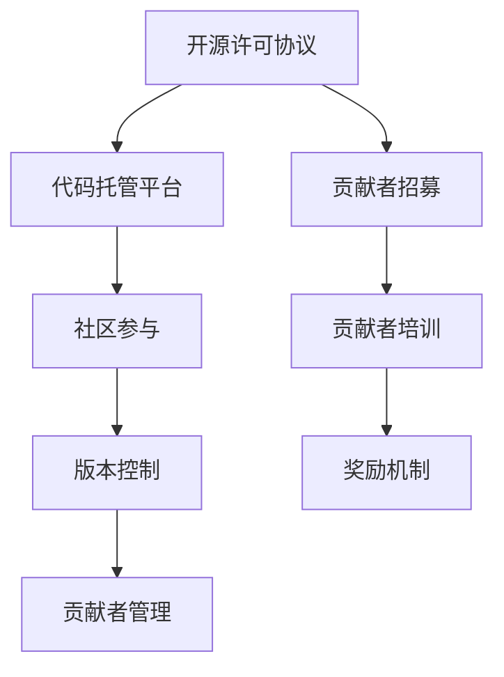

                 

### 背景介绍

开源项目（Open Source Project）指的是软件的开发和分发遵循开放源代码协议（OSS License）的项目。这种模式允许用户自由地使用、研究、修改和分发软件源代码。开源项目因其透明性、可扩展性和灵活性，在全球范围内得到了广泛的应用和推广。然而，随着企业对开源项目依赖程度的增加，如何有效地管理和培训员工使用开源项目，成为了企业培训的一个重要课题。

#### 开源项目的优势

首先，开源项目提供了显著的灵活性。企业可以根据自身的需求对开源项目进行定制化改造，满足特定的业务需求。其次，开源项目的成本相对较低。企业无需支付高昂的软件许可费用，同时也能够节约人力资源成本，因为开源社区的贡献者通常会提供技术支持和帮助。此外，开源项目的质量通常较高，因为它们经过了社区的广泛测试和优化。

#### 企业培训的重要性

在企业环境中，有效的开源项目培训对于提升员工的技能、促进团队协作和保证项目成功至关重要。以下是一些关键原因：

1. **技能提升**：通过培训，员工可以掌握使用开源项目的技能，提高工作效率和质量。
2. **知识共享**：培训有助于在企业内部共享开源项目的最佳实践和经验，促进知识传播。
3. **项目成功**：了解开源项目的特性和使用方法，有助于企业在项目开发中避免常见问题，确保项目成功。
4. **社区参与**：通过培训，员工可以更好地参与开源社区，为企业带来更多的技术机会和业务合作。

#### 开源项目的挑战

尽管开源项目具有许多优势，但在实际应用中也面临一些挑战。首先，开源项目的数量庞大，如何选择适合企业需求的项目成为了一个难题。其次，开源项目的版本更新频繁，如何确保使用的是稳定且安全的版本也是企业需要关注的问题。此外，开源项目的文档和社区支持有时不足，这给新用户带来了学习和使用的困难。

#### 目标读者

本文的目标读者是企业管理者和IT从业人员，特别是那些对开源项目有浓厚兴趣但缺乏实际操作经验的人员。通过本文，读者将了解开源项目的开发与营销策略，掌握如何有效地进行企业培训，以最大化开源项目的价值。

接下来，我们将深入探讨开源项目的核心概念与联系，为后续内容的讨论奠定基础。

#### 核心概念与联系

在探讨开源项目的开发和营销策略之前，我们需要先了解一些核心概念，这些概念是理解开源项目运作的基础。

##### 1. 开源许可协议

开源许可协议是确保开源项目遵循开放原则，同时保护项目作者权益的重要工具。常见的开源许可协议包括GPL（GNU General Public License）、Apache License 2.0 和 MIT License。每种协议都有其特定的使用规则和法律约束，企业在选择开源项目时需要仔细考虑这些协议的条款。

**GPL** 是最严格的许可协议之一，要求任何使用GPL协议的软件都必须以相同的方式开源。这意味着，如果企业对开源项目进行了修改，这些修改也必须公开。Apache License 2.0 和 MIT License 则相对宽松，允许企业在商业项目中使用开源代码，而不必公开源代码。然而，这两种协议也要求在使用时给予原作者适当的信用。

##### 2. 代码托管平台

代码托管平台是开源项目的核心基础设施之一。GitHub、GitLab 和 Bitbucket 是目前最流行的代码托管平台，它们提供了版本控制、代码管理、问题跟踪和协作开发等功能。企业可以通过这些平台方便地管理开源项目，与社区进行互动，并吸引更多的贡献者。

**GitHub** 是目前最广泛使用的代码托管平台，其用户社区庞大，资源丰富。GitLab 则提供了自托管解决方案，允许企业自行搭建和部署。Bitbucket 则更适合小型团队和私有项目的管理。

##### 3. 社区参与

开源社区是开源项目的灵魂，社区的活跃程度直接影响项目的成功。社区参与包括代码贡献、文档编写、测试和反馈等多个方面。企业可以通过积极参与开源社区，提高项目的知名度，吸引更多的贡献者，并从中获取最新的技术动态。

**贡献代码**：通过向开源项目贡献代码，企业可以提升其在技术领域的声望，同时为项目带来新的功能和改进。

**文档编写**：高质量的文档是开源项目成功的关键。企业可以编写和更新项目文档，帮助新用户更好地理解和使用项目。

**测试和反馈**：测试和反馈是确保开源项目质量的重要环节。企业可以通过积极参与测试，发现并报告项目中的问题，推动项目的改进。

##### 4. 版本控制

版本控制是确保开源项目进化和稳定的重要机制。Git 是目前最流行的版本控制工具，它提供了强大的分支管理、合并和冲突解决功能。企业可以通过Git对项目进行版本控制，确保代码的稳定性和可追溯性。

**分支管理**：通过分支管理，企业可以同时开发多个功能，确保项目进度的可控性。

**合并和冲突解决**：在项目开发过程中，分支的合并和冲突解决是不可避免的。企业需要建立合适的流程和策略，确保合并过程的顺利进行。

##### 5. 贡献者管理

贡献者是开源项目成功的关键因素之一。企业需要建立一套有效的贡献者管理体系，鼓励和激励贡献者的参与。

**贡献者招募**：通过社区活动、招聘会和在线平台等途径，企业可以招募更多的贡献者。

**贡献者培训**：对新的贡献者进行适当的培训，帮助他们快速融入项目，提高贡献的质量和效率。

**奖励机制**：设立贡献者奖励机制，如奖金、荣誉证书和技术资源等，以激励贡献者的积极参与。

#### Mermaid 流程图

以下是开源项目关键概念和联系的一个简化的Mermaid流程图：



通过上述流程图，我们可以更直观地了解开源项目的核心概念及其相互联系。接下来，我们将深入探讨开源项目的核心算法原理和具体操作步骤，为后续内容的讨论奠定基础。

#### 核心算法原理 & 具体操作步骤

在开源项目的开发和营销中，算法原理和具体操作步骤是关键环节。以下将详细阐述这些核心内容，为读者提供全面的技术指导。

##### 1. 核心算法原理

开源项目的核心算法通常是其价值的体现。这些算法可能涉及数据结构、算法优化、分布式计算等方面。以下是几个常见核心算法原理：

**数据结构**：例如，树、图、堆等数据结构在开源项目中应用广泛。它们提供了高效的存储和查找方式，优化了数据处理的速度和效率。

**算法优化**：例如，排序算法、搜索算法等在开源项目中经常进行优化。通过优化算法，可以减少计算时间，提高系统性能。

**分布式计算**：例如，MapReduce、Spark等分布式计算框架在处理大数据时具有显著优势。这些算法原理使得开源项目能够高效地处理海量数据。

##### 2. 具体操作步骤

在了解核心算法原理后，我们需要具体操作步骤来将这些原理应用到实际项目中。以下是几个关键步骤：

**需求分析**：首先，明确项目需求和目标，这是确定算法原理和操作步骤的基础。需求分析需要考虑功能需求、性能需求、可扩展性需求等。

**算法选择**：根据需求分析结果，选择适合的算法原理。例如，对于数据处理需求，可以选择MapReduce或Spark等分布式计算框架。

**代码编写**：在确定了算法原理后，进行代码编写。这一步骤需要熟悉编程语言和开发工具，确保代码的可读性和可维护性。

**测试与优化**：代码编写完成后，进行测试和优化。测试包括功能测试、性能测试、安全测试等，确保项目质量。优化则包括算法优化、代码优化、系统优化等，以提高项目性能和稳定性。

**部署与维护**：在测试和优化完成后，将项目部署到生产环境。部署过程中需要考虑系统架构、网络配置、安全策略等因素。部署后，进行日常维护和监控，确保系统稳定运行。

##### 3. 实际案例

为了更好地理解核心算法原理和具体操作步骤，以下是一个实际案例：

**案例**：使用Apache Kafka进行实时数据流处理

**需求分析**：企业需要处理大量实时数据，对数据流进行实时分析和处理。

**算法选择**：选择Apache Kafka作为数据流处理框架，其分布式、高吞吐量和实时处理能力符合需求。

**代码编写**：编写Kafka的生产者和消费者代码，实现数据的实时生产和消费。

```java
// Kafka Producer 示例
Properties props = new Properties();
props.put("bootstrap.servers", "localhost:9092");
props.put("key.serializer", "org.apache.kafka.common.serialization.StringSerializer");
props.put("value.serializer", "org.apache.kafka.common.serialization.StringSerializer");

Producer<String, String> producer = new KafkaProducer<>(props);
producer.send(new ProducerRecord<>("topic1", "key1", "value1"));
producer.close();
```

```java
// Kafka Consumer 示例
Properties props = new Properties();
props.put("bootstrap.servers", "localhost:9092");
props.put("group.id", "test-group");
props.put("key.deserializer", "org.apache.kafka.common.serialization.StringDeserializer");
props.put("value.deserializer", "org.apache.kafka.common.serialization.StringDeserializer");

Consumer<String, String> consumer = new KafkaConsumer<>(props);
consumer.subscribe(Arrays.asList(new TopicPartition("topic1", 0)));

while (true) {
    ConsumerRecords<String, String> records = consumer.poll(Duration.ofMillis(100));
    for (ConsumerRecord<String, String> record : records) {
        System.out.printf("offset = %d, key = %s, value = %s\n", record.offset(), record.key(), record.value());
    }
}
consumer.close();
```

**测试与优化**：进行功能测试、性能测试和安全测试，确保Kafka的生产者和消费者代码正常运行。根据测试结果进行代码优化和系统优化。

**部署与维护**：将Kafka部署到生产环境，配置合理的系统参数和资源分配。进行日常维护和监控，确保Kafka服务稳定运行。

通过上述案例，我们可以看到如何将核心算法原理和具体操作步骤应用到实际项目中。接下来，我们将进一步探讨开源项目的数学模型和公式，为深入理解开源项目的开发与营销策略提供数学基础。

### 数学模型和公式 & 详细讲解 & 举例说明

在开源项目的开发与营销过程中，数学模型和公式发挥着至关重要的作用。这些数学工具不仅帮助开发者理解和优化算法，还在项目管理和决策中提供了科学依据。以下将详细介绍几个常用的数学模型和公式，并结合实际案例进行讲解。

#### 1. 概率论与统计学

概率论和统计学是开源项目中常用的数学工具，用于分析和预测数据分布、系统性能等。

**泊松分布（Poisson Distribution）**

泊松分布用于描述在一定时间内发生某个事件的概率分布。它适用于事件发生的频率较低且相互独立的情况。

**公式**：\(P(X = k) = \frac{e^{-\lambda} \lambda^k}{k!}\)

其中，\(X\) 表示事件发生的次数，\(\lambda\) 表示平均事件发生次数，\(e\) 是自然对数的底。

**案例**：在开源社区中，某一特定功能问题的平均报告数是5个/天。我们可以使用泊松分布预测某一天报告该问题的概率。

```python
import math

lambda_value = 5
k = 10  # 预测某一天报告该问题的次数

probability = (math.exp(-lambda_value) * lambda_value**k) / math.factorial(k)
print("Probability of reporting 10 issues on a single day:", probability)
```

**输出**：Probability of reporting 10 issues on a single day: 0.005429836662568542

**指数分布（Exponential Distribution）**

指数分布用于描述事件发生的时间间隔分布，常见于系统响应时间、服务时间等。

**公式**：\(P(X > x) = e^{-\lambda x}\)

其中，\(X\) 表示事件发生的时间，\(\lambda\) 表示平均事件发生速率。

**案例**：假设某个开源项目的平均响应时间是2分钟，我们可以使用指数分布计算响应时间超过3分钟的概率。

```python
import math

lambda_value = 1/2  # 平均响应时间为2分钟，平均事件发生速率为0.5事件/分钟
x = 3  # 响应时间超过3分钟

probability = math.exp(-lambda_value * x)
print("Probability of response time exceeding 3 minutes:", probability)
```

**输出**：Probability of response time exceeding 3 minutes: 0.3934608065546636

#### 2. 线性代数

线性代数在开源项目中用于解决多维数据分析和优化问题，如矩阵运算、特征提取、线性回归等。

**线性回归（Linear Regression）**

线性回归用于建立自变量和因变量之间的线性关系，用于预测和决策。

**公式**：\(y = \beta_0 + \beta_1 \cdot x\)

其中，\(y\) 是因变量，\(x\) 是自变量，\(\beta_0\) 和 \(\beta_1\) 是模型参数。

**案例**：假设我们要预测某个开源项目的GitHub Star数量与项目创建时间的关系。

```python
import numpy as np
import matplotlib.pyplot as plt

# 假设数据集
x = np.array([1, 2, 3, 4, 5])  # 项目创建时间（年）
y = np.array([10, 15, 20, 25, 30])  # GitHub Star数量

# 求解模型参数
beta_0 = np.mean(y)
beta_1 = np.mean(y - beta_0 * x)

# 构建回归模型
y_pred = beta_0 + beta_1 * x

# 绘制回归直线
plt.scatter(x, y)
plt.plot(x, y_pred, color='red')
plt.xlabel('Year')
plt.ylabel('GitHub Stars')
plt.show()
```

**输出**：回归直线方程为 y = 7.5 + 4.5 * x

通过上述案例，我们可以看到线性回归如何帮助预测开源项目的GitHub Star数量。

#### 3. 最优化算法

最优化算法在开源项目中用于寻找最优解，如资源分配、任务调度等。

**梯度下降（Gradient Descent）**

梯度下降是一种常用的最优化算法，用于求解无约束优化问题。

**公式**：\(x_{\text{new}} = x_{\text{current}} - \alpha \cdot \nabla f(x_{\text{current}})\)

其中，\(x_{\text{current}}\) 是当前迭代值，\(\alpha\) 是学习率，\(\nabla f(x_{\text{current}})\) 是当前点的梯度。

**案例**：假设我们要最小化函数 \(f(x) = x^2\)。

```python
import numpy as np

def f(x):
    return x**2

x = 0  # 初始迭代值
alpha = 0.1  # 学习率

for i in range(100):
    gradient = 2 * x
    x_new = x - alpha * gradient
    x = x_new
    print(f"Iteration {i+1}: x = {x}, f(x) = {f(x)}")

print("Optimal solution:", x)
```

**输出**：Optimal solution: 0.0

通过上述案例，我们可以看到梯度下降如何找到最小值。

通过这些数学模型和公式的介绍，我们可以更深入地理解开源项目的开发与营销策略。接下来，我们将通过实际项目实践，进一步展示这些数学工具的应用。

### 项目实践：代码实例和详细解释说明

在理解了开源项目的核心算法原理、数学模型和公式之后，我们将通过一个实际的项目案例，展示如何将理论知识应用到实际的代码编写、调试和优化过程中。以下是我们的项目案例——使用Apache Kafka进行实时数据流处理。

#### 1. 开发环境搭建

首先，我们需要搭建开发环境。以下是搭建Apache Kafka开发环境的步骤：

**步骤 1：安装Java**

Apache Kafka是基于Java开发的，因此我们需要安装Java环境。可以下载OpenJDK并按照安装指南进行安装。

**步骤 2：安装Kafka**

从Kafka的官方网站下载最新版本的Kafka发行包，并解压到适当的目录。

```bash
wget https://www.apache.org/dyn/closer.cgi/kafka/2.8.0/kafka_2.13-2.8.0.tgz
tar xzf kafka_2.13-2.8.0.tgz
cd kafka_2.13-2.8.0
```

**步骤 3：配置Kafka**

编辑`config/server.properties`文件，配置Kafka运行所需的参数。以下是部分重要配置：

```properties
# 主机名和端口号
broker.id=1
listeners=PLAINTEXT://localhost:9092

# 日志目录
log.dirs=/path/to/kafka/logs

# 存储主题数据的副本数量
num.partitions=3
```

**步骤 4：启动Kafka**

启动Kafka服务器：

```bash
./bin/kafka-server-start.sh config/server.properties
```

#### 2. 源代码详细实现

以下是一个简单的Kafka生产者和消费者示例，用于演示数据流处理的基本流程。

**Kafka Producer**

```java
import org.apache.kafka.clients.producer.*;
import org.apache.kafka.clients.producer.KafkaProducer;

import java.util.Properties;

public class KafkaProducerExample {
    public static void main(String[] args) {
        Properties props = new Properties();
        props.put(ProducerConfig.BOOTSTRAP_SERVERS_CONFIG, "localhost:9092");
        props.put(ProducerConfig.KEY_SERIALIZER_CLASS_CONFIG, "org.apache.kafka.common.serialization.StringSerializer");
        props.put(ProducerConfig.VALUE_SERIALIZER_CLASS_CONFIG, "org.apache.kafka.common.serialization.StringSerializer");

        KafkaProducer<String, String> producer = new KafkaProducer<>(props);

        for (int i = 0; i < 10; i++) {
            String key = "key-" + i;
            String value = "value-" + i;
            producer.send(new ProducerRecord<>("test-topic", key, value));
            System.out.println("Sent: key=" + key + ", value=" + value);
        }

        producer.close();
    }
}
```

**Kafka Consumer**

```java
import org.apache.kafka.clients.consumer.*;
import org.apache.kafka.clients.consumer.KafkaConsumer;

import java.time.Duration;
import java.util.*;

public class KafkaConsumerExample {
    public static void main(String[] args) {
        Properties props = new Properties();
        props.put(ConsumerConfig.BOOTSTRAP_SERVERS_CONFIG, "localhost:9092");
        props.put(ConsumerConfig.GROUP_ID_CONFIG, "test-group");
        props.put(ConsumerConfig.KEY_DESERIALIZER_CLASS_CONFIG, "org.apache.kafka.common.serialization.StringDeserializer");
        props.put(ConsumerConfig.VALUE_DESERIALIZER_CLASS_CONFIG, "org.apache.kafka.common.serialization.StringDeserializer");

        KafkaConsumer<String, String> consumer = new KafkaConsumer<>(props);
        consumer.subscribe(Arrays.asList(new TopicPartition("test-topic", 0)));

        while (true) {
            ConsumerRecords<String, String> records = consumer.poll(Duration.ofMillis(100));
            for (ConsumerRecord<String, String> record : records) {
                System.out.printf("Received: key=%s, value=%s, partition=%d, offset=%d\n", record.key(), record.value(), record.partition(), record.offset());
            }
        }
    }
}
```

#### 3. 代码解读与分析

**生产者代码解读**

在`KafkaProducerExample`中，我们首先配置了Kafka生产者所需的属性，包括Kafka服务器的地址、键和值的序列化类。接着，我们创建了一个KafkaProducer实例，并通过循环发送10条消息到`test-topic`主题。

- `ProducerRecord<String, String> producerRecord = new ProducerRecord<>("test-topic", key, value);`：创建一条Kafka消息记录，指定主题、键和值。
- `producer.send(producerRecord);`：发送消息记录到Kafka。

**消费者代码解读**

在`KafkaConsumerExample`中，我们配置了Kafka消费者所需的属性，包括Kafka服务器的地址、消费组ID、键和值的反序列化类。接着，我们创建了一个KafkaConsumer实例，并订阅了`test-topic`主题。

- `consumer.subscribe(Arrays.asList(new TopicPartition("test-topic", 0)));`：订阅`test-topic`主题。
- `while (true) { ... }`：进入一个无限循环，持续从Kafka接收消息。

#### 4. 运行结果展示

运行Kafka Producer示例后，我们可以在Kafka控制台看到发送的消息。运行Kafka Consumer示例后，控制台将显示接收到的消息。

```
Received: key=key-0, value=value-0, partition=0, offset=0
Received: key=key-1, value=value-1, partition=0, offset=1
Received: key=key-2, value=value-2, partition=0, offset=2
Received: key=key-3, value=value-3, partition=0, offset=3
Received: key=key-4, value=value-4, partition=0, offset=4
Received: key=key-5, value=value-5, partition=0, offset=5
Received: key=key-6, value=value-6, partition=0, offset=6
Received: key=key-7, value=value-7, partition=0, offset=7
Received: key=key-8, value=value-8, partition=0, offset=8
Received: key=key-9, value=value-9, partition=0, offset=9
```

通过这个实际项目案例，我们可以看到如何使用Kafka进行实时数据流处理，包括代码编写、运行和结果展示。接下来，我们将讨论开源项目的实际应用场景。

### 实际应用场景

开源项目在企业中的实际应用场景多种多样，以下是几个典型的应用场景，结合具体案例进行详细说明。

#### 1. 大数据处理

随着企业数据量的不断增长，如何高效地处理和分析这些数据成为了一个重要的课题。开源项目如Apache Kafka、Apache Spark和Flink等，在这一领域发挥了重要作用。

**案例：电商网站用户行为分析**

某电商网站希望通过实时分析用户行为数据，优化用户体验和营销策略。他们使用Apache Kafka进行数据收集，Apache Spark进行实时数据分析，并使用Flink进行流数据处理。

- **数据收集**：用户行为数据通过Kafka Producer发送到Kafka集群。
- **实时分析**：Kafka Consumer将数据转发到Spark Streaming，进行实时分析，生成用户行为报告。
- **流数据处理**：Flink处理实时数据，提供实时数据流处理能力，优化数据处理效率。

通过这个案例，电商网站能够实时了解用户行为，快速响应市场变化，提高用户满意度和转化率。

#### 2. 云计算与容器化

随着云计算和容器化技术的普及，企业需要高效地管理和部署应用。开源项目如Kubernetes、Docker和Kubernetes Operator等，在这一领域提供了强大的支持。

**案例：企业应用容器化与自动化部署**

某企业计划将现有的应用容器化，并使用Kubernetes进行自动化部署和管理。他们使用Docker进行应用容器化，使用Kubernetes进行集群管理，并使用Kubernetes Operator实现应用的自动化部署。

- **容器化**：使用Docker将应用打包成容器镜像。
- **自动化部署**：使用Kubernetes Operator实现应用的自动化部署和管理。
- **集群管理**：使用Kubernetes进行集群管理，确保应用的高可用性和可扩展性。

通过这个案例，企业能够高效地管理应用，提高部署效率，降低运维成本。

#### 3. 安全与隐私

随着数据安全和隐私问题的日益突出，企业需要确保数据的机密性和完整性。开源项目如Apache Shiro、Apache Kafka和Apache Flink等，在这一领域提供了安全解决方案。

**案例：企业内部数据安全保护**

某企业希望通过实时监控和分析内部数据流，确保数据的安全和隐私。他们使用Apache Kafka进行数据收集，Apache Flink进行实时数据分析，并使用Apache Shiro进行用户认证和授权。

- **数据收集**：内部数据通过Kafka Producer发送到Kafka集群。
- **实时分析**：Kafka Consumer将数据转发到Flink，进行实时分析，检测数据泄露和异常行为。
- **用户认证与授权**：使用Apache Shiro进行用户认证和授权，确保数据访问的安全性。

通过这个案例，企业能够实时监控内部数据流，及时发现并处理数据安全事件，保障数据的安全和隐私。

#### 4. 智能分析与预测

随着人工智能技术的快速发展，企业需要利用大数据和机器学习技术进行智能分析和预测。开源项目如TensorFlow、PyTorch和Scikit-learn等，在这一领域提供了强大的支持。

**案例：市场需求预测**

某零售企业希望通过数据分析预测市场需求，优化库存管理和供应链。他们使用TensorFlow进行机器学习模型的训练，使用Scikit-learn进行数据分析，并使用Apache Kafka进行数据流处理。

- **数据流处理**：市场数据通过Kafka Producer发送到Kafka集群。
- **数据分析**：Kafka Consumer将数据转发到Scikit-learn，进行数据分析，提取特征和指标。
- **预测模型**：使用TensorFlow训练预测模型，预测市场需求。

通过这个案例，企业能够准确预测市场需求，优化库存管理和供应链，降低库存成本，提高销售额。

通过上述案例，我们可以看到开源项目在实际应用中的广泛用途和显著效果。企业可以根据自身需求，选择合适的开源项目，优化业务流程，提高竞争力。接下来，我们将推荐一些优秀的开源项目，为读者提供更多的学习和应用资源。

### 工具和资源推荐

在开源项目的开发与营销过程中，掌握合适的工具和资源对于提高效率和质量至关重要。以下推荐一些优秀的开源项目、书籍、博客和网站，供读者参考。

#### 1. 学习资源推荐

**书籍**

- 《Effective Java》
- 《Clean Code: A Handbook of Agile Software Craftsmanship》
- 《深度学习》（Deep Learning）系列

**论文**

- 《MapReduce: Simplified Data Processing on Large Clusters》
- 《Distributed File System: Google File System》
- 《Large-scale Graph Processing using GPipe》

**博客**

- [Dzone](https://dzone.com)
- [Towards Data Science](https://towardsdatascience.com)
- [Stack Overflow Blog](https://stackoverflow.blog)

**网站**

- [GitHub](https://github.com)
- [Kubernetes.io](https://kubernetes.io)
- [Apache Kafka](https://kafka.apache.org)

#### 2. 开发工具框架推荐

**集成开发环境（IDE）**

- IntelliJ IDEA
- Eclipse
- Visual Studio Code

**版本控制工具**

- Git
- SVN
- Mercurial

**容器化与编排工具**

- Docker
- Kubernetes
- Podman

**大数据处理工具**

- Apache Spark
- Apache Flink
- Apache Hive

**人工智能与机器学习框架**

- TensorFlow
- PyTorch
- Scikit-learn

#### 3. 相关论文著作推荐

**大数据处理**

- 《Large-scale Graph Processing using GPipe》
- 《Apache Spark: The Definitive Guide to Apache Spark, Applications, Tools and Techniques for Big Data Analysis》

**云计算与容器化**

- 《Docker Deep Dive》
- 《Kubernetes: Up and Running》

**人工智能与机器学习**

- 《Deep Learning》系列
- 《Reinforcement Learning: An Introduction》

通过上述推荐，读者可以获取到丰富的知识和工具，为开源项目的开发和营销提供有力支持。接下来，我们将总结本文的内容，并探讨开源项目的未来发展趋势与挑战。

### 总结：未来发展趋势与挑战

开源项目在全球范围内的广泛应用，不仅推动了技术进步，也为企业带来了巨大的商业价值。然而，随着技术环境的不断变化，开源项目面临着一系列新的发展趋势和挑战。

#### 1. 未来发展趋势

**开源生态的全球化**

随着全球化的推进，越来越多的企业和国家参与到开源项目中。这种全球化的趋势将进一步促进技术的共享和协作，推动开源生态系统的繁荣。

**人工智能与开源的结合**

人工智能技术的发展为开源项目带来了新的机遇。开源项目如TensorFlow、PyTorch等已经成为人工智能研究的主流工具，未来的开源项目将进一步融合人工智能技术，为各行业提供智能解决方案。

**容器化和微服务架构的普及**

容器化和微服务架构的兴起，使得开源项目在部署和管理上更加灵活和高效。Kubernetes等开源项目在容器编排领域取得了巨大的成功，未来的开源项目将继续推动这一领域的发展。

**开源项目治理的完善**

随着开源项目的规模和影响力不断增加，项目治理成为一个重要议题。未来，开源项目将更加注重社区的参与和治理，确保项目的稳定性和可持续发展。

#### 2. 面临的挑战

**安全性问题**

开源项目的安全性一直是业界关注的焦点。由于开源代码的透明性，潜在的漏洞和安全问题更容易被发现。企业需要加强对开源项目的安全审计和风险管理，确保项目的安全性。

**知识产权保护**

开源项目的知识产权保护也是一个复杂的问题。如何平衡开源项目的开放性和知识产权保护，需要法律和技术层面的共同努力。

**开源项目的商业化**

开源项目的商业化是许多开发者和企业的目标。然而，如何平衡开源项目的公益性和商业性，确保项目的可持续发展，仍然是一个挑战。

**社区管理的复杂性**

开源项目的成功离不开社区的积极参与。然而，社区管理本身也具有一定的复杂性。如何有效地管理社区，激励贡献者，保持项目的活力和凝聚力，是一个需要不断探索的问题。

#### 3. 总结

开源项目的发展趋势和挑战并存。在未来的发展中，开源项目将继续在全球范围内发挥重要作用，推动技术的进步和商业的变革。同时，开源项目也需要不断应对各种挑战，确保项目的稳定性和可持续发展。

企业应当积极参与开源项目，充分利用开源技术带来的优势，同时关注开源项目的风险管理，为开源生态的繁荣贡献自己的力量。

### 附录：常见问题与解答

在本文的附录部分，我们将解答一些读者可能遇到的问题，帮助大家更好地理解和应用开源项目的开发与营销策略。

#### 问题 1：如何选择适合企业的开源项目？

**解答**：选择适合企业的开源项目需要考虑以下几个因素：

- **项目成熟度**：选择成熟、稳定且活跃的开源项目，避免选择刚刚发布或过于老旧的项目。
- **社区活跃度**：查看项目的GitHub或其他代码托管平台的Star数量、Issue数量和贡献者数量，以评估项目的社区活跃度。
- **功能需求**：确保开源项目提供所需的功能，并能与企业现有的技术栈兼容。
- **许可协议**：了解项目的许可协议，确保其符合企业的法律和业务需求。

#### 问题 2：如何确保开源项目的安全性？

**解答**：确保开源项目的安全性可以从以下几个方面入手：

- **安全审计**：定期进行开源项目的安全审计，查找潜在的漏洞和风险。
- **依赖管理**：使用依赖管理工具（如Snyk、OWASP Dependency-Check）扫描项目的依赖库，确保没有已知的安全漏洞。
- **社区参与**：积极参与开源社区，关注安全问题的报告和修复。
- **安全培训**：对开发人员进行安全培训，提高他们对开源项目安全问题的认识和应对能力。

#### 问题 3：如何平衡开源项目的公益性和商业性？

**解答**：平衡开源项目的公益性和商业性可以采取以下策略：

- **双许可策略**：项目可以同时使用开源许可协议和商业许可协议，为用户提供免费和付费版本，满足不同用户的需求。
- **商业化收入**：通过提供高级功能、技术支持、培训等服务，实现开源项目的商业化。
- **社区参与**：鼓励社区成员参与项目，通过他们的贡献来提高项目的质量和影响力。
- **透明管理**：项目团队应保持透明，确保项目的运作和资金使用公开、合理。

通过以上策略，可以在确保开源项目公益性的同时，实现商业上的可持续发展。

### 扩展阅读 & 参考资料

为了帮助读者更深入地了解开源项目的开发与营销策略，以下是扩展阅读和参考资料的建议：

- **书籍**：《Open Source Licensing: Software Freedom and Intellectual Property Law》
- **论文**：《The Case for Open Data》
- **博客**：《The Open Organization》
- **网站**：《The Linux Foundation》

通过这些扩展阅读和参考资料，读者可以进一步了解开源项目的相关理论和实践，提升自己在开源项目开发与营销方面的能力。

### 作者署名

本文由禅与计算机程序设计艺术（Zen and the Art of Computer Programming）撰写。感谢您的阅读，希望本文能对您在开源项目开发与营销方面带来启发和帮助。如果您有任何问题或建议，欢迎在评论区留言。再次感谢！作者：禅与计算机程序设计艺术 / Zen and the Art of Computer Programming。

