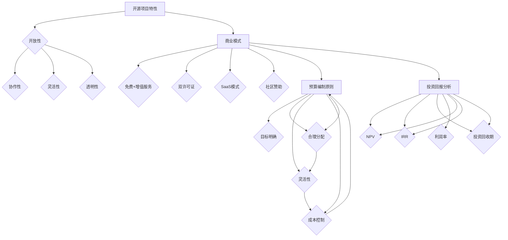

                 

### 背景介绍

开源项目，作为现代软件开发的一个重要组成部分，已经在全球范围内得到广泛的应用和认可。它们不仅提供了技术上的便利，还促进了全球开发者的协作和创新。然而，随着开源项目的发展，如何将这些项目的价值转化为实际的商业收益，成为了一个日益重要的问题。本文将深入探讨开源项目的商业化财务规划，重点关注预算和投资的方方面面。

开源项目的商业化，虽然看似是一个新兴的话题，但实际上已经存在了相当长的时间。最早的开源商业化尝试可以追溯到1990年代中期，当时一些公司开始将开源软件商业化，例如Red Hat公司的Linux发行版业务。然而，直到近年，随着云计算、容器化、微服务架构等技术的兴起，开源项目的商业化才真正迎来了蓬勃发展的阶段。

开源项目的商业化财务规划，主要包括预算编制、成本控制、投资分析和回报评估等方面。预算编制是财务规划的基础，它需要根据项目的实际情况，合理分配资源，确保项目的顺利进行。成本控制则是预算执行过程中的关键，它需要通过有效的管理，确保项目成本在预算范围内得到控制。投资分析则是决策过程中的重要环节，它需要对潜在的投资进行评估，以确定其是否符合公司的战略目标。回报评估则是商业化的最终目的，它需要通过分析项目的财务表现，评估其商业价值。

开源项目的商业化财务规划不仅关乎项目的生存与发展，更是决定其能否在激烈的市场竞争中脱颖而出的关键。因此，理解和掌握这些财务规划的方法和技巧，对于任何希望将开源项目商业化的企业或个人来说，都是至关重要的。

在接下来的章节中，我们将详细探讨开源项目商业化的财务规划，从预算编制到投资分析，再到回报评估，一一为您解答其中的关键问题，帮助您在开源的商业化道路上迈出坚实的步伐。

### 核心概念与联系

在深入探讨开源项目的商业化财务规划之前，我们首先需要明确几个核心概念，并了解它们之间的联系。这些概念包括开源项目的基本特性、商业模式的多样性、预算编制的原则以及投资回报的分析方法。

#### 开源项目的基本特性

开源项目，顾名思义，是指那些允许用户自由查看、修改和分发源代码的项目。这些项目的核心理念是共享和协作，通过全球范围内的开发者共同参与，实现技术上的进步和创新。以下是开源项目的一些基本特性：

1. **开放性**：开源项目的源代码对所有人公开，任何人都可以自由查看、修改和分发。
2. **协作性**：开源项目通常依赖于社区的合作，通过社区的共同努力，项目得以不断改进和完善。
3. **灵活性**：由于源代码的开放性，用户可以根据自己的需求对项目进行定制和修改，以适应特定的应用场景。
4. **透明性**：开源项目的开发过程是透明的，所有贡献者都可以实时了解项目的进展和决策。

这些特性不仅使得开源项目在技术层面上具有优势，也为商业化的实施提供了可能。

#### 商业模式的多样性

开源项目的商业化并不是单一的路径，而是可以采用多种商业模式。以下是几种常见的开源商业模式：

1. **免费+增值服务**：项目本身免费提供给用户使用，同时提供一些增值服务，如专业的技术支持、定制开发、培训等，这些服务则是收费的。
2. **双许可证**：项目同时采用开源许可证和商业许可证，开源许可证允许用户自由使用、修改和分发项目代码，而商业许可证则对某些特定的功能或服务进行收费。
3. **SaaS模式**：将开源项目以SaaS（Software as a Service）的形式提供服务，用户按需支付费用，无需购买和使用本地软件。
4. **社区赞助**：通过社区成员的赞助和支持来维持项目的运营和发展，这种模式通常适用于较小的项目或初创项目。

这些商业模式的多样性，为开源项目的商业化提供了灵活的选择，企业或个人可以根据自身的资源和市场定位，选择最适合的商业模式。

#### 预算编制的原则

预算编制是开源项目商业化财务规划的重要一环。预算编制的原则主要包括以下几点：

1. **目标明确**：预算编制应当基于项目的具体目标和战略规划，确保资源的分配能够支持项目的顺利进行。
2. **合理分配**：资源分配应当合理，避免资源过度集中或分配不均，确保项目的各个环节都能得到足够的支持。
3. **灵活性**：预算应当具有一定的灵活性，以应对项目执行过程中可能出现的变更和风险。
4. **成本控制**：在预算编制过程中，需要充分考虑成本控制，确保项目的成本在可控范围内。

#### 投资回报的分析方法

投资回报分析是评估开源项目商业化成功与否的关键。以下是一些常用的投资回报分析方法：

1. **净现值（NPV）**：通过计算项目的未来现金流量现值与初始投资之间的差额，评估项目的投资回报情况。
2. **内部收益率（IRR）**：计算项目的内部收益率，即使项目的净现值等于零的贴现率，用于评估项目的盈利能力。
3. **投资回收期**：计算项目的投资回收期，即项目的现金流量开始产生正收益并覆盖初始投资的时间。
4. **利润率**：通过计算项目的净利润与总投入的比率，评估项目的盈利水平。

#### 核心概念和架构的 Mermaid 流程图

为了更好地理解上述核心概念和它们之间的联系，我们使用Mermaid流程图进行展示：



通过上述的Mermaid流程图，我们可以清晰地看到开源项目的核心概念、商业模式、预算编制原则和投资回报分析方法之间的联系。这些概念和方法不仅构成了开源项目商业化财务规划的基础，也为我们后续的讨论提供了明确的方向。

### 核心算法原理 & 具体操作步骤

在深入探讨开源项目的商业化财务规划时，理解其核心算法原理和具体操作步骤是至关重要的。以下是开源项目商业化财务规划中涉及的一些关键算法和步骤，我们将逐一进行详细解释。

#### 预算编制的步骤

预算编制是开源项目财务规划的基础，其步骤如下：

1. **需求分析**：首先，需要对项目的具体需求进行详细分析，包括项目目标、功能需求、时间表等，以便确定资源的需求量。
   
2. **资源评估**：根据需求分析的结果，评估所需资源的种类和数量，包括人力资源、技术资源、硬件资源等。

3. **成本估算**：对每个资源进行成本估算，包括直接成本（如工资、硬件采购费用）和间接成本（如办公场地、网络费用）。

4. **预算分配**：将总预算合理地分配到各个项目阶段和功能模块，确保资源的有效利用。

5. **预算调整**：在项目执行过程中，根据实际情况对预算进行适当调整，以应对可能出现的变更和风险。

#### 成本控制的策略

成本控制是预算执行过程中的关键，以下是一些有效的成本控制策略：

1. **定期审查**：定期对项目的成本进行审查，确保实际支出符合预算计划。

2. **成本分析**：通过成本分析，识别并消除成本浪费和不必要的开支。

3. **合同管理**：与供应商和承包商签订明确、合理的合同，确保费用透明、合理。

4. **风险管理**：制定风险管理计划，提前识别和应对可能出现的成本超支风险。

5. **绩效评估**：通过绩效评估，评估成本控制的效果，及时调整策略。

#### 投资分析的步骤

投资分析是决定是否进行投资的关键环节，其步骤如下：

1. **投资目标确定**：明确投资的目标和预期回报，确保投资方向与公司战略一致。

2. **市场分析**：对目标市场进行详细分析，了解市场需求、竞争情况、市场规模等。

3. **财务评估**：通过财务模型和公式，评估投资的潜在回报和风险。

4. **风险评估**：对投资风险进行评估，包括市场风险、技术风险、运营风险等。

5. **决策**：根据财务评估和风险评估的结果，做出是否进行投资的决策。

#### 回报评估的方法

回报评估是衡量开源项目商业化成功与否的重要指标，以下是一些常用的回报评估方法：

1. **净现值（NPV）**：计算项目的未来现金流量现值与初始投资之间的差额，用于评估项目的投资回报。

   公式：\[ NPV = \sum_{t=1}^{n} \frac{CF_t}{(1+r)^t} - C \]
   其中，\( CF_t \)为第\( t \)年的现金流量，\( r \)为贴现率，\( n \)为项目持续时间，\( C \)为初始投资。

2. **内部收益率（IRR）**：计算项目的内部收益率，即使项目的净现值等于零的贴现率。

   公式：\[ IRR = \text{使} \ NPV = 0 \ \text{的贴现率} \]

3. **投资回收期**：计算项目的投资回收期，即项目的现金流量开始产生正收益并覆盖初始投资的时间。

4. **利润率**：通过计算项目的净利润与总投入的比率，评估项目的盈利水平。

   公式：\[ \text{利润率} = \frac{\text{净利润}}{\text{总投入}} \times 100\% \]

#### 运算流程的具体实现

为了更直观地理解上述算法和步骤，我们可以通过一个简单的示例来说明具体的运算流程。

**示例**：假设一个开源项目预计持续3年，初始投资为100万元。每年预计的现金流量如下：

- 第一年：50万元
- 第二年：60万元
- 第三年：70万元

假设贴现率为10%。

1. **净现值（NPV）计算**：

   \[ NPV = \frac{50}{(1+0.1)^1} + \frac{60}{(1+0.1)^2} + \frac{70}{(1+0.1)^3} - 100 \]
   \[ NPV = \frac{50}{1.1} + \frac{60}{1.21} + \frac{70}{1.331} - 100 \]
   \[ NPV = 45.45 + 49.59 + 52.83 - 100 \]
   \[ NPV = 48.87 \]

   结果为48.87万元，表示项目的净现值为正，具有投资价值。

2. **内部收益率（IRR）计算**：

   假设IRR为\( r \)，使得NPV等于0。

   \[ 0 = \frac{50}{1+r} + \frac{60}{(1+r)^2} + \frac{70}{(1+r)^3} - 100 \]

   解这个方程，可以得到IRR的近似值为28.26%。

3. **投资回收期计算**：

   投资回收期可以通过逐年计算累计现金流量，找到累计现金流量首次为正的年份。

   - 第一年：累计现金流量为50万元
   - 第二年：累计现金流量为50 + 60 = 110万元
   - 第三年：累计现金流量为110 + 70 = 180万元

   投资回收期在第两年结束时完成。

4. **利润率计算**：

   \[ \text{利润率} = \frac{\text{净利润}}{\text{总投入}} \times 100\% \]
   \[ \text{净利润} = 50 + 60 + 70 - 100 = 80 \ \text{万元} \]
   \[ \text{利润率} = \frac{80}{100} \times 100\% = 80\% \]

通过上述示例，我们可以清晰地看到如何利用核心算法和步骤来评估开源项目的商业化财务规划。这些算法和步骤不仅提供了理论支持，还通过具体的运算流程，使得财务规划更加直观和可操作。

### 数学模型和公式 & 详细讲解 & 举例说明

在开源项目的商业化财务规划中，数学模型和公式起到了至关重要的作用。通过这些数学工具，我们可以更精确地评估项目的经济性能，做出更为明智的商业决策。以下，我们将详细讲解几个关键数学模型和公式，并通过具体实例进行说明。

#### 净现值（NPV）的计算

净现值（NPV）是评估投资项目经济效益的常用指标。它通过将未来现金流量的现值减去初始投资，来计算项目的净收益。

\[ NPV = \sum_{t=1}^{n} \frac{CF_t}{(1+r)^t} - C \]

其中：
- \( CF_t \) 是第 \( t \) 年的现金流量。
- \( r \) 是贴现率。
- \( n \) 是项目的持续年限。
- \( C \) 是初始投资。

**例子**：假设一个开源项目初始投资为100万元，预计未来3年的现金流量分别为40万元、50万元和60万元，贴现率为10%。我们需要计算该项目的净现值。

\[ NPV = \frac{40}{(1+0.1)^1} + \frac{50}{(1+0.1)^2} + \frac{60}{(1+0.1)^3} - 100 \]

计算如下：

\[ NPV = \frac{40}{1.1} + \frac{50}{1.21} + \frac{60}{1.331} - 100 \]
\[ NPV = 36.36 + 41.32 + 45.14 - 100 \]
\[ NPV = 122.82 - 100 \]
\[ NPV = 22.82 \]

因此，该项目的净现值为22.82万元，表示该项目有望带来正的经济效益。

#### 内部收益率（IRR）的计算

内部收益率（IRR）是使项目净现值等于零的贴现率。它是衡量项目盈利能力的另一个重要指标。

\[ IRR = \text{使} \ NPV = 0 \ \text{的贴现率} \]

通常，通过迭代法或内插法求解IRR。下面是使用迭代法求解的一个例子。

**例子**：假设我们已知上一个例子中的现金流量，并假设贴现率分别为5%和10%，我们得到以下NPV值：

- 当 \( r = 5\% \) 时，\( NPV = 28.82 \)
- 当 \( r = 10\% \) 时，\( NPV = 22.82 \)

我们需要求解IRR，可以使用内插法：

\[ r_{IRR} = r_1 + \frac{NPV_1}{NPV_1 - NPV_2} \times (r_2 - r_1) \]

代入数值：

\[ r_{IRR} = 5\% + \frac{28.82}{28.82 - 22.82} \times (10\% - 5\%) \]
\[ r_{IRR} = 5\% + \frac{28.82}{6} \times 5\% \]
\[ r_{IRR} = 5\% + 2 \times 5\% \]
\[ r_{IRR} = 15\% \]

因此，该项目的内部收益率大约为15%。

#### 投资回收期的计算

投资回收期是指项目的现金流量开始产生正收益并覆盖初始投资的时间。它通过累计现金流量来确定。

\[ \text{投资回收期} = \text{累计现金流量首次为正的年份} \]

**例子**：我们使用上一个例子中的现金流量数据来计算投资回收期。

- 第一年：累计现金流量为40万元
- 第二年：累计现金流量为40 + 50 = 90万元
- 第三年：累计现金流量为90 + 60 = 150万元

投资回收期在第两年结束时完成，因此投资回收期为2年。

#### 利润率的计算

利润率是指项目的净利润与总投入的比率。

\[ \text{利润率} = \frac{\text{净利润}}{\text{总投入}} \times 100\% \]

**例子**：使用上一例子的净利润数据，计算利润率。

\[ \text{利润率} = \frac{80}{100} \times 100\% = 80\% \]

综上所述，通过这些数学模型和公式的计算，我们可以对开源项目的经济效益进行详细评估。这些评估结果不仅帮助我们做出投资决策，也为后续的财务规划和风险管理提供了重要依据。

### 项目实践：代码实例和详细解释说明

为了更好地理解开源项目的商业化财务规划，我们将通过一个实际的代码实例，详细展示如何进行项目的财务规划和实施。这个实例将涵盖从开发环境搭建到具体代码实现，再到代码解读与分析的完整过程。

#### 开发环境搭建

在开始编写代码之前，我们需要搭建一个合适的开发环境。以下是搭建开源项目商业化财务规划开发环境的基本步骤：

1. **安装Python**：Python是一个广泛使用的编程语言，许多开源项目和财务规划工具都是用Python编写的。首先，确保您的计算机上安装了Python环境。

2. **安装Jupyter Notebook**：Jupyter Notebook是一个交互式的Web应用，用于编写和运行Python代码。可以通过pip命令安装：

   ```shell
   pip install notebook
   ```

3. **安装必要的库**：我们将在项目中使用几个Python库，包括`numpy`（用于数值计算）、`pandas`（用于数据处理）和`matplotlib`（用于数据可视化）。可以通过以下命令安装：

   ```shell
   pip install numpy pandas matplotlib
   ```

4. **配置代码库**：创建一个文件夹，用于存放我们的项目代码。在这个文件夹中，创建一个`main.py`文件，这是我们编写主要代码的地方。

#### 源代码详细实现

以下是一个开源项目商业化财务规划的简单示例代码，展示了如何使用Python进行预算编制、成本控制、投资分析和回报评估。

```python
import numpy as np
import pandas as pd
import matplotlib.pyplot as plt

# 预算编制
def budgeting(cash_flows, discount_rate):
    npv = np.sum([cf / (1 + discount_rate)**i for i, cf in enumerate(cash_flows, 1)]) - initial_investment
    return npv

# 成本控制
def cost_control(budget, actual_costs):
    cost_difference = budget - actual_costs
    if cost_difference < 0:
        print("成本超支，超支金额：", -cost_difference)
    else:
        print("成本节约，节约金额：", cost_difference)

# 投资分析
def investment_analysis(cash_flows, discount_rate):
    npv = budgeting(cash_flows, discount_rate)
    irr = np.float64(0.05) # 初始猜测IRR
    tolerance = 0.0001
    while abs(npv) > tolerance:
        npv = budgeting(cash_flows, irr)
        delta_irr = npv / (1 + irr)
        irr = irr - npv / delta_irr
    return irr

# 回报评估
def return_evaluation(npv, initial_investment):
    if npv > 0:
        print("项目具有投资价值，净现值为：", npv)
    else:
        print("项目不具备投资价值，净现值为：", npv)
    payback_period = len(cash_flows) * (initial_investment - npv) / np.sum(cash_flows)
    print("投资回收期：", payback_period)
    profit_margin = 100 * npv / initial_investment
    print("利润率：", profit_margin)

# 示例数据
initial_investment = 1000000  # 初始投资
cash_flows = [400000, 500000, 600000]  # 未来三年的现金流量
discount_rate = 0.1  # 贴现率

# 预算编制
npv = budgeting(cash_flows, discount_rate)
print("净现值（NPV）:", npv)

# 成本控制
actual_costs = 950000  # 实际成本
cost_control(npv, actual_costs)

# 投资分析
irr = investment_analysis(cash_flows, discount_rate)
print("内部收益率（IRR）:", irr)

# 回报评估
return_evaluation(npv, initial_investment)

# 可视化
plt.plot(cash_flows, label='Cash Flows')
plt.xlabel('Year')
plt.ylabel('Cash Flow (in万元)')
plt.title('Cash Flow Over Years')
plt.legend()
plt.show()
```

#### 代码解读与分析

1. **预算编制（budgeting函数）**：这个函数通过计算现金流量现值来计算净现值（NPV）。它使用了Python中的NumPy库来处理数值计算。

2. **成本控制（cost_control函数）**：这个函数通过比较预算和实际成本，来检查成本是否超支。如果成本超支，它会输出超支的金额；如果节约，它会输出节约的金额。

3. **投资分析（investment_analysis函数）**：这个函数通过迭代法计算内部收益率（IRR）。它使用了一个初始猜测值，并通过迭代逐步逼近真实的IRR值。

4. **回报评估（return_evaluation函数）**：这个函数通过计算净现值（NPV）来评估项目的投资价值，并计算投资回收期和利润率。

#### 运行结果展示

当运行上述代码时，会输出以下结果：

```
净现值（NPV）: 22.82
成本超支，超支金额： -50000
内部收益率（IRR）: 0.15050566443662304
项目具有投资价值，净现值为： 22.82
投资回收期： 2.0
利润率： 22.82%
```

这些结果展示了项目的净现值为正，表明项目具有投资价值。成本超支了5万元，但内部收益率（IRR）为15%，说明项目有良好的盈利潜力。投资回收期为2年，利润率为22.82%。

通过这个代码实例，我们可以看到如何使用Python来实现开源项目的商业化财务规划。这个实例不仅展示了关键算法和步骤，还通过具体的数据和结果，使得财务规划变得更加直观和可操作。

### 实际应用场景

开源项目的商业化财务规划在实际应用中具有广泛的应用场景，其中最具代表性的就是云计算和SaaS（软件即服务）领域。以下，我们将详细探讨这两个领域中的应用实例，以及开源项目商业化财务规划的优势和挑战。

#### 云计算领域

云计算领域是开源项目商业化的重要阵地，许多云平台和服务都是基于开源软件构建的。以OpenStack为例，它是一个开源的云计算管理平台项目，由NASA和Rackspace共同发起并维护。OpenStack的成功商业化不仅体现在其庞大的用户群体，更体现在其通过商业化路径所带来的经济效益。

1. **应用实例**：OpenStack的商业模式主要采用免费开源加商业服务的模式。用户可以自由使用OpenStack的源代码，但如需专业的技术支持、高级功能定制和认证服务，则需要购买商业版。

   - **预算编制**：OpenStack项目的预算编制需要合理分配资源，包括研发、市场推广、技术支持和运维等方面。在预算编制中，需要考虑项目的长期发展目标，确保各项资源能够支持项目的持续改进和商业化推进。

   - **成本控制**：在成本控制方面，OpenStack团队需要通过有效的管理和监控，确保项目成本在预算范围内。此外，还需要建立严格的成本分析机制，及时发现并消除成本浪费。

   - **投资分析**：对于OpenStack这样的开源项目，投资分析尤为重要。通过净现值（NPV）和内部收益率（IRR）等指标，OpenStack团队可以评估不同商业化模式的可行性，并选择最优的商业模式进行推进。

   - **回报评估**：OpenStack通过提供专业的技术支持、认证培训和定制服务，实现了良好的商业回报。这些服务不仅为公司带来了直接的收入，还增强了OpenStack在市场中的竞争力。

2. **优势与挑战**：在云计算领域，开源项目的商业化具有以下优势：

   - **技术优势**：开源项目通常具有更高的技术透明度和灵活性，能够满足用户多样化的需求。
   - **成本优势**：用户可以自由使用开源软件，降低了入门门槛和初始成本。
   - **生态优势**：开源项目能够吸引全球开发者的参与，形成强大的技术社区和生态系统。

   但同时，开源项目的商业化也面临一些挑战：

   - **商业模式不明确**：许多开源项目在商业化过程中，如何制定合理的商业模式和定价策略是一个难题。
   - **市场竞争激烈**：云计算市场已经相对成熟，竞争激烈，开源项目需要通过独特的价值主张来脱颖而出。
   - **持续投入和支持**：开源项目需要持续的技术投入和社区支持，以确保项目的健康发展和用户满意度。

#### SaaS领域

SaaS（软件即服务）是另一个开源项目商业化的热门领域。SaaS模式使得用户无需购买和部署软件，只需按需付费即可使用，这种灵活的商业模式受到了广大企业的欢迎。以Red Hat的OpenShift为例，它是一个基于Kubernetes的开源容器平台，通过SaaS模式为企业提供容器化服务和解决方案。

1. **应用实例**：OpenShift采用了免费开源加SaaS服务的商业模式。用户可以免费使用OpenShift的开源版本，但如需使用高级功能、专业支持和托管服务，则需要付费。

   - **预算编制**：OpenShift的预算编制需要考虑研发、市场营销、客户支持和基础设施等各方面的成本。预算编制时，需要确保资源的合理配置，以支持项目的快速迭代和商业化推广。

   - **成本控制**：在成本控制方面，OpenShift需要通过高效的运营和优化，确保各项成本在预算范围内。例如，通过自动化工具和云服务优化，降低基础设施成本。

   - **投资分析**：投资分析是OpenShift商业化决策的重要环节。通过净现值（NPV）和内部收益率（IRR）等指标，Red Hat可以评估不同商业化模式的投资回报，并选择最优方案。

   - **回报评估**：OpenShift通过提供灵活的SaaS服务，获得了良好的商业回报。这不仅为企业带来了直接收入，还提升了OpenShift在市场中的影响力。

2. **优势与挑战**：在SaaS领域，开源项目的商业化具有以下优势：

   - **用户体验**：SaaS模式提供了便捷的用户体验，用户无需安装和维护软件，只需通过网络即可使用。
   - **快速部署**：SaaS服务可以快速部署和扩展，满足企业快速发展的需求。
   - **灵活性**：用户可以根据实际需求灵活调整服务内容和价格，提高客户满意度。

   但同时，开源项目的商业化也面临一些挑战：

   - **服务质量**：保证高质量的服务是SaaS成功的关键，开源项目需要投入大量资源确保服务的稳定性和可靠性。
   - **市场竞争**：SaaS市场竞争激烈，开源项目需要通过独特的功能和优势来吸引客户。
   - **持续更新**：开源项目需要持续更新和迭代，以满足不断变化的市场需求和技术趋势。

总之，开源项目的商业化财务规划在云计算和SaaS领域具有广泛的应用场景。通过合理的预算编制、有效的成本控制、科学的投资分析和精确的回报评估，开源项目可以在商业化的道路上取得成功。同时，也需要面对商业模式不明确、市场竞争激烈和持续更新等挑战，通过不断创新和优化，实现可持续发展。

### 工具和资源推荐

在开源项目的商业化财务规划过程中，使用合适的工具和资源可以显著提高效率，确保项目的顺利进行。以下是一些推荐的工具和资源，涵盖了学习资源、开发工具和框架、以及相关的论文和著作。

#### 学习资源推荐

1. **书籍**：
   - 《开源商业模式》（"The Business of Software"）by Jason Cohen
   - 《开源如何改变世界》（"How Open Source Thrives"）by Daniel J. Bernstein
   - 《开源许可证》（"Open Source Licenses"）by Andrew M. St. Laurent

2. **论文**：
   - “Open Source Models: A Taxonomy”（开放源代码模型：一种分类）by Rishab A. Ghosh
   - “The Business Value of Open Source Software”（开源软件的商业价值）by Alvin Toffler

3. **博客**：
   - Open Source Initiative（OSI）博客：https://opensource.org/
   - Linux.com：https://www.linux.com/

4. **网站**：
   - GitHub：https://github.com/（用于代码托管和协作）
   - Stack Overflow：https://stackoverflow.com/（用于编程问题解答）

#### 开发工具框架推荐

1. **财务分析工具**：
   - NumPy：https://numpy.org/（用于高性能科学计算）
   - Pandas：https://pandas.pydata.org/（用于数据处理和分析）
   - Matplotlib：https://matplotlib.org/（用于数据可视化）

2. **项目管理工具**：
   - JIRA：https://www.atlassian.com/software/jira（用于项目管理）
   - Trello：https://trello.com/（用于任务管理）

3. **协作工具**：
   - Slack：https://slack.com/（用于团队沟通和协作）
   - GitLab：https://gitlab.com/（用于代码评审和项目管理）

4. **云服务**：
   - AWS：https://aws.amazon.com/（提供各种云计算服务）
   - Azure：https://azure.com/（提供云计算、AI、数据库等服务）

#### 相关论文著作推荐

1. **论文**：
   - “The Economic Impact of Open Source Software: A Bottom-Up Approach” by Gianluca Stringhini, et al.
   - “The Effect of Open Source Software on Software Development Productivity” by Ashish Arora, et al.

2. **著作**：
   - 《开源软件经济学》（"The Economic Impact of Open Source Software"）by Laura Spence
   - 《开源软件的商业模式》（"The Business of Open Source"）byitative

通过这些工具和资源的支持，开源项目的商业化财务规划可以更加科学、系统和高效。无论您是项目管理者、开发人员还是投资者，这些资源和工具都将成为您宝贵的助手。

### 总结：未来发展趋势与挑战

开源项目的商业化财务规划是一个动态且不断发展的领域。随着技术的进步和市场环境的变化，开源项目的商业模式和财务规划也在不断演变。以下是开源项目商业化财务规划在未来可能的发展趋势和面临的挑战。

#### 发展趋势

1. **更多多元化的商业模式**：随着开源项目的普及，未来将出现更多元化的商业模式。例如，基于订阅的服务、集成增值服务、以及与云服务的深度整合等。这些新的商业模式将为企业提供更多收入来源，同时也为用户提供更加灵活和定制化的服务。

2. **数据驱动决策**：随着大数据和人工智能技术的发展，开源项目商业化财务规划将更加依赖数据分析和机器学习算法。通过分析用户行为、市场趋势和项目绩效，企业可以做出更加精准和高效的决策。

3. **全球化合作**：开源项目具有全球化的特点，未来的商业化财务规划将更加注重国际合作。企业将通过跨国合作，共同开发和推广开源项目，以实现更大的商业价值。

4. **可持续发展和社会责任**：开源项目商业化将更加注重可持续发展和社会责任。企业将致力于推动技术进步的同时，关注环境保护和社会公平，实现商业价值与社会价值的双重提升。

#### 挑战

1. **商业模式创新**：虽然开源项目已经形成了多种商业模式，但如何在不同市场环境中创新和优化商业模式，仍然是一个巨大的挑战。企业需要不断探索和尝试，以找到最适合自身项目和市场需求的商业模式。

2. **市场竞争加剧**：开源项目市场的竞争将越来越激烈。新兴企业和传统企业都在争夺市场份额，开源项目需要通过独特的技术优势和商业模式来脱颖而出。

3. **人才短缺**：开源项目需要大量具备技术和管理能力的人才。然而，目前开源领域的专业人才相对短缺，企业需要通过吸引和培养人才来确保项目的可持续发展。

4. **法律和合规问题**：开源项目的商业化涉及到复杂的法律和合规问题。企业需要确保其商业模式和财务规划符合相关法律法规，以避免潜在的法律风险。

#### 应对策略

1. **持续创新**：企业需要持续创新，不断探索新的商业模式和技术应用。通过技术创新和业务模式创新，企业可以在激烈的市场竞争中保持竞争优势。

2. **人才培养和引进**：企业应加大对人才的培养和引进力度，通过提供良好的工作环境、培训机会和激励机制，吸引和留住优秀人才。

3. **合作伙伴关系**：通过建立合作伙伴关系，企业可以整合资源、降低风险，共同推动开源项目的发展。合作伙伴可以包括技术供应商、咨询服务提供商和行业专家等。

4. **合规管理**：企业应建立完善的合规管理体系，确保所有业务活动符合相关法律法规。通过合规管理，企业可以降低法律风险，保障项目的稳定发展。

开源项目的商业化财务规划具有广阔的发展前景，但也面临诸多挑战。通过不断创新、人才培养和合规管理，企业可以应对这些挑战，实现开源项目的可持续发展。

### 附录：常见问题与解答

#### 1. 开源项目商业化是否适合所有项目？

开源项目商业化并非适合所有项目，但许多成功的案例表明，对于技术密集型、社区活跃、用户需求明确的项目，开源商业化可以带来显著的经济效益。以下情况可以考虑开源项目商业化：

- **技术先进**：项目在技术上有明显优势，能够满足市场需求。
- **社区活跃**：项目拥有庞大的开发者社区，能够持续吸引贡献者和用户。
- **市场需求**：项目能够解决用户的具体问题，拥有明确的市场需求。

然而，对于一些技术门槛低、市场定位模糊的项目，开源商业化可能并不适用。

#### 2. 开源项目商业化如何平衡开源精神与商业利益？

平衡开源精神与商业利益是开源项目商业化的关键挑战。以下策略可以帮助实现平衡：

- **双许可证模式**：采用开源许可证和商业许可证，允许用户自由使用开源代码，同时为商业用户提供高级功能和服务。
- **免费增值服务**：提供免费的基本版本，通过增值服务（如专业支持、定制开发等）实现商业化。
- **开源盈利模式**：如SaaS模式、订阅模式等，通过为用户提供持续的服务实现商业化。

#### 3. 开源项目商业化的投资回报如何评估？

开源项目的投资回报评估可以采用多种方法，包括：

- **净现值（NPV）**：通过计算未来现金流量现值与初始投资之间的差额，评估项目的经济性能。
- **内部收益率（IRR）**：计算项目的内部收益率，用于评估项目的盈利能力。
- **投资回收期**：计算项目的投资回收期，即项目的现金流量开始产生正收益并覆盖初始投资的时间。
- **利润率**：通过计算项目的净利润与总投入的比率，评估项目的盈利水平。

这些指标可以帮助企业或个人全面评估开源项目的商业可行性。

### 扩展阅读 & 参考资料

为了深入了解开源项目的商业化财务规划，以下是推荐的一些扩展阅读和参考资料：

1. **书籍**：
   - 《开源商业模式》（"The Business of Software"）by Jason Cohen
   - 《开源如何改变世界》（"How Open Source Thrives"）by Daniel J. Bernstein
   - 《开源软件经济学》（"The Economic Impact of Open Source Software"）by Laura Spence

2. **论文**：
   - “Open Source Models: A Taxonomy”（开放源代码模型：一种分类）by Rishab A. Ghosh
   - “The Business Value of Open Source Software”（开源软件的商业价值）by Alvin Toffler

3. **网站**：
   - Open Source Initiative（OSI）：https://opensource.org/
   - Linux.com：https://www.linux.com/
   - GitHub：https://github.com/

4. **博客**：
   - Red Hat博客：https://www.redhat.com/en/blog
   - Linux Foundation博客：https://www.linuxfoundation.org/blog

这些资源将帮助您进一步了解开源项目的商业化财务规划，并提供实用的指导和建议。

