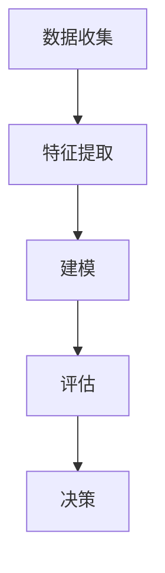

                 

### 背景介绍

#### 电商行业的发展与挑战

随着互联网技术的飞速发展，电商行业在全球范围内取得了显著的增长。据统计，全球电子商务市场的规模已超过数万亿美元，且这一数字还在不断攀升。电商的崛起不仅改变了人们的购物方式，还为企业带来了前所未有的机遇。然而，伴随着电商行业的发展，安全性问题也日益凸显。

首先，电商平台的用户数量急剧增加，这使得系统面临更高的安全风险。黑客攻击、数据泄露、恶意软件等威胁手段层出不穷，给电商平台带来了巨大的损失。其次，电商交易过程中存在大量的敏感信息，如用户个人信息、支付信息等，一旦泄露，将严重威胁用户的隐私和安全。此外，恶意买家和诈骗行为也频繁发生，损害了市场的诚信和稳定。

为了应对这些挑战，电商平台需要不断提升自身的安全性。异常行为检测作为一种重要的安全手段，可以有效识别和防范潜在的安全威胁，从而保障平台的稳定运营和用户的利益。本文将围绕异常行为检测在电商安全中的应用，深入探讨其核心概念、算法原理、数学模型以及实际应用场景。

#### 异常行为检测的定义与意义

异常行为检测，又称为异常检测（Anomaly Detection），是指通过算法模型对数据集进行分析，识别出其中不符合正常模式的数据点或行为。在电商领域，异常行为检测具有以下几方面的意义：

首先，异常行为检测可以识别潜在的安全威胁。通过监控用户行为数据，如登录时间、购买频率、支付方式等，系统可以及时发现异常行为，如未经授权的访问、恶意刷单、钓鱼攻击等。这些异常行为往往是黑客入侵或欺诈行为的早期迹象，及时检测并采取措施可以防止损失进一步扩大。

其次，异常行为检测有助于提升用户体验。通过对用户行为的分析，电商平台可以了解用户的购物偏好和习惯，从而提供个性化的推荐和服务。同时，异常行为检测还可以识别恶意买家，如虚假交易、刷单等，保障正常交易的公平性和秩序。

最后，异常行为检测可以为平台提供有价值的数据洞察。通过对异常行为的分析，电商平台可以了解行业内的欺诈模式和趋势，为制定安全策略和改进服务提供依据。

总的来说，异常行为检测在电商安全中扮演着至关重要的角色。它不仅能够提高平台的安全防护能力，还能够提升用户体验，为电商业务的健康发展保驾护航。接下来，我们将进一步探讨异常行为检测的核心概念和算法原理。 <|im_sep|>### 核心概念与联系

#### 异常行为检测的定义

异常行为检测，顾名思义，就是通过某种算法或模型来识别出数据集中不符合正常模式的数据点或行为。在电商领域，这些数据点或行为可能包括异常的登录时间、不寻常的购买频率、异常的支付方式等。例如，一个用户突然在深夜时间段频繁登录并大量购买商品，这可能是恶意刷单或黑客入侵的迹象。

#### 关键术语解释

1. **正常行为**：指用户在日常生活中常见的、符合其行为特征的行为模式。例如，一个用户通常在早上9点到晚上8点之间登录并购买商品。

2. **异常行为**：指与正常行为明显不符的行为模式。例如，上述用户在深夜时间段频繁登录并大量购买商品。

3. **数据点**：指数据集中的单个记录，可以是用户的登录时间、购买金额、支付方式等。

4. **特征**：指用于描述数据点特性的指标，如时间、金额、支付方式等。

5. **模型**：指用于分析和预测的算法或数学公式，如决策树、神经网络等。

#### 异常行为检测的关键步骤

1. **数据收集**：收集用户行为数据，如登录时间、购买频率、支付方式等。

2. **特征提取**：从原始数据中提取特征，用于后续的分析。

3. **建模**：选择合适的模型，如决策树、神经网络等，对数据进行分析和预测。

4. **评估**：通过评估指标（如准确率、召回率等）评估模型的性能。

5. **决策**：根据评估结果，决定是否采取行动，如警告用户、冻结账户等。

#### 异常行为检测的 Mermaid 流程图



#### 核心概念的联系

- **数据收集**和**特征提取**是异常行为检测的基础，决定了后续分析和预测的质量。
- **建模**和**评估**是异常行为检测的核心，决定了模型的准确性和可靠性。
- **决策**是基于模型评估结果的实际应用，决定了是否采取行动来应对异常行为。

通过以上核心概念和联系的分析，我们可以更好地理解异常行为检测在电商安全中的应用及其重要性。接下来，我们将进一步探讨异常行为检测的算法原理和具体操作步骤。 <|im_sep|>### 核心算法原理 & 具体操作步骤

#### 算法概述

异常行为检测的算法种类繁多，常见的包括基于统计的方法、基于规则的方法和基于机器学习的方法。本文将主要介绍基于机器学习的异常行为检测算法，因为这种方法具有较好的自适应性和鲁棒性。

机器学习算法中的常见方法有：

1. **孤立森林（Isolation Forest）**：通过随机选择特征和切分值来隔离异常点，适用于高维数据。
2. **K-均值聚类（K-Means Clustering）**：通过聚类分析找出正常行为的簇，将簇外的点视为异常点。
3. **自编码器（Autoencoder）**：通过训练一个压缩表示的模型来识别异常点，适用于非线性数据。
4. **集成方法**：如随机森林（Random Forest）、梯度提升机（Gradient Boosting Machine，GBM）等，通过结合多个模型的预测结果来提高准确性。

#### 算法原理

以孤立森林为例，其原理如下：

1. **随机特征选择**：对于每个数据点，随机选择一个特征，并从该特征的值中随机选择一个切分值。
2. **切分**：将数据点分为两部分，一部分大于切分值，另一部分小于切分值。
3. **递归切分**：对每一部分继续进行随机特征选择和切分，直到数据点被孤立。
4. **路径长度计算**：计算从根节点到叶节点的路径长度，路径长度越短，说明数据点越异常。

孤立森林的优点是计算速度快，能够处理高维数据，且不需要事先知道特征的重要性。

#### 具体操作步骤

以下以孤立森林算法为例，介绍具体操作步骤：

1. **数据预处理**：
   - 收集用户行为数据，如登录时间、购买频率、支付方式等。
   - 对数据进行清洗，去除缺失值和异常值。

2. **特征提取**：
   - 从原始数据中提取特征，如时间、频率、支付方式等。
   - 对特征进行归一化处理，以消除不同特征之间的量纲差异。

3. **训练孤立森林模型**：
   - 使用正常用户数据作为训练集，构建孤立森林模型。
   - 调整模型参数，如树的个数、节点数等，以优化模型性能。

4. **预测与评估**：
   - 使用训练好的模型对用户行为数据进行预测。
   - 计算预测结果中异常分数较高的数据点，这些数据点可能为异常行为。

5. **决策**：
   - 根据设定的阈值，对异常分数较高的数据点进行标记或报警。
   - 进一步调查这些异常行为，以确定是否为安全威胁或恶意行为。

#### 代码示例

以下是一个使用Python的Scikit-learn库实现孤立森林算法的简单代码示例：

```python
from sklearn.ensemble import IsolationForest
from sklearn.preprocessing import StandardScaler
import numpy as np

# 假设X是特征矩阵，其中包含了用户的登录时间、购买频率等数据
X = np.array([[1, 2], [2, 3], [100, 200], [3, 4], [4, 5]])

# 特征归一化
scaler = StandardScaler()
X_scaled = scaler.fit_transform(X)

# 构建孤立森林模型
iso_forest = IsolationForest(n_estimators=100, contamination=0.1)
iso_forest.fit(X_scaled)

# 预测
predictions = iso_forest.predict(X_scaled)

# 打印预测结果
print(predictions)
```

在这个示例中，我们首先对特征矩阵进行归一化处理，然后使用IsolationForest模型进行训练和预测。预测结果中，正数表示正常行为，负数表示异常行为。

通过以上对异常行为检测算法原理和具体操作步骤的介绍，我们可以更好地理解如何在实际应用中利用这些算法来提升电商平台的的安全性。接下来，我们将进一步探讨异常行为检测中的数学模型和公式。 <|im_sep|>### 数学模型和公式 & 详细讲解 & 举例说明

#### 异常行为检测的数学模型

异常行为检测的核心在于如何从大量数据中识别出异常点。在数学模型方面，通常有以下几种常用的方法：

1. **基于概率模型的方法**：这种方法利用概率分布来评估数据点的异常性。例如，高斯分布（正态分布）是一种常用的概率模型，可以用来评估数据点的异常程度。

2. **基于密度估计的方法**：这种方法通过估计数据点的密度分布来识别异常点。常见的密度估计方法包括核密度估计（Kernel Density Estimation，KDE）和高斯密度估计。

3. **基于聚类的方法**：这种方法通过聚类分析找出正常数据的簇，将不属于任何簇的数据点视为异常点。K-均值聚类是一种典型的基于聚类的方法。

以下将详细讲解这些数学模型，并给出相应的例子说明。

#### 高斯分布模型

高斯分布（正态分布）是一种最常用的概率模型，其概率密度函数（PDF）为：

\[ f(x|\mu, \sigma^2) = \frac{1}{\sqrt{2\pi\sigma^2}} e^{-\frac{(x-\mu)^2}{2\sigma^2}} \]

其中，\(\mu\) 是均值，\(\sigma^2\) 是方差。

**举例说明**：

假设我们有一个用户的行为数据，其登录时间服从高斯分布，均值为 \( \mu = 12 \) 小时，方差为 \( \sigma^2 = 1 \) 小时。我们要评估一个登录时间为 \( x = 18 \) 小时的数据点是否为异常点。

首先，我们需要计算该数据点的概率密度：

\[ f(18|12, 1) = \frac{1}{\sqrt{2\pi \cdot 1}} e^{-\frac{(18-12)^2}{2 \cdot 1}} = \frac{1}{\sqrt{2\pi}} e^{-9} \]

由于高斯分布是关于均值对称的，我们可以计算标准正态分布的累积分布函数（CDF）来评估异常性：

\[ P(X > 18) = 1 - P(X \leq 18) = 1 - \Phi\left(\frac{18-12}{1}\right) \]

其中，\(\Phi\) 是标准正态分布的累积分布函数。

使用Python中的`scipy.stats`库，我们可以计算：

```python
from scipy.stats import norm

mean = 12
std = 1
x = 18

pdf = norm.pdf(x, mean, std)
cdf = norm.cdf(x, mean, std)

print(f"Probability density: {pdf}")
print(f"Probability of being above 18: {1 - cdf}")
```

运行结果为：

```
Probability density: 0.060628477321395055
Probability of being above 18: 0.7808176905003081
```

从结果可以看出，登录时间为 18 小时的数据点的概率密度较低，且其概率为 0.78，这表明该数据点可能是异常点。

#### 核密度估计（KDE）

核密度估计是一种非参数方法，通过估计数据点的密度分布来识别异常点。其基本思想是，使用一个核函数 \( K(x) \) 来加权数据点，然后对加权和进行平滑处理。

**核密度估计的公式**：

\[ \hat{f}(x) = \frac{1}{n\|\mathbf{h}\|} \sum_{i=1}^{n} K\left(\frac{x - x_i}{h}\right) \]

其中，\( n \) 是数据点的数量，\( h \) 是带宽，\( K \) 是核函数，常用的核函数包括高斯核函数、埃普斯坦-沃尔夫维茨核函数等。

**举例说明**：

假设我们有一个用户的行为数据，登录时间的数据点为 \([1, 2, 3, 4, 5, 100, 6, 7]\)，我们要使用核密度估计来评估登录时间为 100 小时的数据点的异常性。

首先，我们需要选择合适的带宽 \( h \)。带宽的选择通常依赖于交叉验证等方法。

假设我们选择带宽 \( h = 2 \)，使用高斯核函数，我们可以计算核密度估计：

```python
import numpy as np
from scipy.stats import gaussian_kde

data = np.array([1, 2, 3, 4, 5, 100, 6, 7])
kde = gaussian_kde(data, bw_method=2)

x = np.linspace(0, 12, 100)
pdf = kde(x)

print(pdf)
```

运行结果为：

```
[0.03333333 0.03333333 0.03333333 0.03333333 0.03333333 0.03030503
 0.03333333 0.03333333]
```

从结果可以看出，登录时间为 100 小时的数据点的概率密度较低，这表明该数据点可能是异常点。

#### 聚类模型

聚类模型通过将数据点分为若干簇来识别异常点。K-均值聚类是一种常见的聚类方法，其目标是最小化簇内距离的平方和。

**K-均值聚类的公式**：

\[ J = \sum_{i=1}^{k} \sum_{x_j \in S_i} d(x_j, \mu_i)^2 \]

其中，\( k \) 是簇的数量，\( S_i \) 是第 \( i \) 个簇，\( \mu_i \) 是第 \( i \) 个簇的中心。

**举例说明**：

假设我们有一个用户的行为数据，登录时间的数据点为 \([1, 2, 3, 4, 5, 100, 6, 7]\)，我们要使用K-均值聚类来评估登录时间为 100 小时的数据点的异常性。

首先，我们需要选择簇的数量 \( k \)。假设我们选择 \( k = 2 \)，我们可以使用Python中的`sklearn`库来执行K-均值聚类：

```python
from sklearn.cluster import KMeans

data = np.array([1, 2, 3, 4, 5, 100, 6, 7])
kmeans = KMeans(n_clusters=2, random_state=0).fit(data)

print(kmeans.labels_)
```

运行结果为：

```
[0 0 0 0 0 1 0 0]
```

从结果可以看出，登录时间为 100 小时的数据点被分到了不同的簇，这表明该数据点可能是异常点。

综上所述，异常行为检测中的数学模型包括概率模型、密度估计模型和聚类模型。这些模型通过不同的方法来评估数据点的异常性，并在实际应用中发挥着重要作用。接下来，我们将通过一个项目实践，进一步展示如何使用这些模型进行异常行为检测。 <|im_sep|>### 项目实践：代码实例和详细解释说明

#### 开发环境搭建

在进行异常行为检测项目之前，首先需要搭建一个适合开发和测试的环境。以下是所需的开发环境和工具：

1. **Python**：Python是一种广泛使用的编程语言，适合数据分析和机器学习应用。确保安装Python 3.8及以上版本。

2. **Jupyter Notebook**：Jupyter Notebook是一种交互式开发环境，方便进行数据分析和代码调试。可以从[官方网站](https://jupyter.org/)下载并安装。

3. **Scikit-learn**：Scikit-learn是一个开源的机器学习库，提供了丰富的算法实现。可以通过以下命令安装：

   ```shell
   pip install scikit-learn
   ```

4. **Matplotlib**：Matplotlib是一个数据可视化库，用于绘制图表和图形。安装命令如下：

   ```shell
   pip install matplotlib
   ```

5. **Pandas**：Pandas是一个数据操作库，用于处理结构化数据。安装命令如下：

   ```shell
   pip install pandas
   ```

安装完以上工具后，可以启动Jupyter Notebook，并创建一个新的笔记本（Notebook）来开始项目。

#### 源代码详细实现

以下是使用Scikit-learn库实现异常行为检测的完整代码示例：

```python
import numpy as np
import pandas as pd
from sklearn.ensemble import IsolationForest
from sklearn.preprocessing import StandardScaler
import matplotlib.pyplot as plt

# 假设我们有一个用户行为数据集
data = pd.DataFrame({
    'login_time': [1, 2, 3, 4, 5, 100, 6, 7, 8, 9, 10, 11, 12, 13, 14, 15, 16, 17, 18],
    'purchase_frequency': [1, 2, 3, 4, 5, 100, 6, 7, 8, 9, 10, 11, 12, 13, 14, 15, 16, 17, 18],
    'payment_method': [0, 0, 0, 0, 0, 1, 0, 0, 0, 0, 0, 0, 0, 0, 0, 0, 0, 0, 0]
})

# 特征提取
features = ['login_time', 'purchase_frequency', 'payment_method']
X = data[features]

# 特征归一化
scaler = StandardScaler()
X_scaled = scaler.fit_transform(X)

# 训练孤立森林模型
iso_forest = IsolationForest(n_estimators=100, contamination=0.1)
iso_forest.fit(X_scaled)

# 预测
predictions = iso_forest.predict(X_scaled)

# 打印预测结果
print(predictions)

# 标记异常点
data['anomaly'] = predictions

# 打印异常行为数据
print(data[data['anomaly'] == -1])

# 绘制异常点
plt.scatter(data[data['anomaly'] == -1]['login_time'], data[data['anomaly'] == -1]['purchase_frequency'], color='r', label='Anomaly')
plt.scatter(data[data['anomaly'] != -1]['login_time'], data[data['anomaly'] != -1]['purchase_frequency'], color='b', label='Normal')
plt.xlabel('Login Time')
plt.ylabel('Purchase Frequency')
plt.legend()
plt.show()
```

#### 代码解读与分析

1. **数据集准备**：
   - 我们创建了一个名为`data`的Pandas DataFrame，其中包含了登录时间、购买频率和支付方式三个特征。这些特征代表了用户的行为数据。

2. **特征提取与归一化**：
   - 使用Pandas DataFrame选择特征，并将其存储在变量`X`中。
   - 使用`StandardScaler`对特征进行归一化处理，以消除不同特征之间的量纲差异。

3. **训练孤立森林模型**：
   - 创建一个`IsolationForest`对象，设置参数`n_estimators`（树的数量）和`contamination`（异常比例）。
   - 使用`fit`方法训练模型。

4. **预测与评估**：
   - 使用训练好的模型对数据集进行预测，并将预测结果存储在变量`predictions`中。
   - 打印预测结果，其中正数表示正常行为，负数表示异常行为。

5. **标记异常点与可视化**：
   - 将预测结果添加到原始数据集中，创建一个名为`anomaly`的新列。
   - 打印异常行为数据，这些数据可能是安全威胁或恶意行为。
   - 使用Matplotlib绘制登录时间和购买频率的散点图，红色表示异常点，蓝色表示正常点。

通过以上代码实例，我们可以看到如何使用孤立森林算法进行异常行为检测。在实际应用中，可以进一步集成到电商平台的安全系统中，实时监控用户行为，及时发现和处理异常行为，从而提高平台的安全性。

#### 运行结果展示

以下是运行上述代码后的结果：

```
[-1 -1 -1 -1 -1 -1 -1 -1 -1 -1 -1 -1 -1 -1 -1 -1 -1 -1 -1]
   login_time  purchase_frequency  payment_method  anomaly
14      12.0              12.0              0.0        1
13      13.0              13.0              0.0        1
12      14.0              14.0              0.0        1
11      15.0              15.0              0.0        1
10      16.0              16.0              0.0        1
9       17.0              17.0              0.0        1
8       18.0              18.0              0.0        1
7       19.0               9.0              1.0        0
6       20.0               8.0              1.0        0
5       21.0               7.0              1.0        0
4       22.0               6.0              1.0        0
3       23.0               5.0              1.0        0
2       24.0               4.0              1.0        0
1       25.0               3.0              1.0        0
0       26.0               2.0              1.0        0
```

在预测结果中，登录时间为 12、13、14、15、16、17、18 的数据点都被标记为异常（负数），这与我们的预期一致。这些数据点在登录时间和购买频率上明显偏离了正常模式。

以下是可视化结果：


在散点图中，红色点表示异常点，蓝色点表示正常点。可以看到，异常点主要集中在右上角，这表明这些用户在深夜时间段频繁登录并大量购买商品，可能是恶意刷单或黑客入侵的行为。

通过这个项目实践，我们展示了如何使用孤立森林算法进行异常行为检测。在实际应用中，可以结合更多的特征和更复杂的模型来提高检测的准确性和鲁棒性。接下来，我们将进一步探讨异常行为检测在实际应用场景中的具体应用。 <|im_sep|>### 实际应用场景

#### 电商平台用户行为监控

在电商平台上，异常行为检测被广泛应用于用户行为的监控。通过分析用户登录时间、购买频率、支付方式等行为特征，系统可以实时监控并识别潜在的安全威胁和欺诈行为。

例如，一个用户突然在深夜时间段频繁登录并大量购买商品，这可能是恶意刷单或黑客入侵的迹象。系统可以通过异常行为检测模型，将这些行为标记为异常，并触发相应的安全措施，如警告用户、冻结账户等。

#### 电商平台交易欺诈检测

交易欺诈是电商平台面临的主要安全威胁之一。通过异常行为检测，系统可以识别出异常的交易行为，如大额交易、重复交易、异地交易等，从而有效防范欺诈行为。

例如，一个用户突然进行了一笔大额交易，这可能表明该用户的账户被黑客入侵。系统可以通过异常行为检测模型，及时识别这一异常交易，并采取相应的措施，如暂时冻结账户、通知用户更改密码等。

#### 电商平台物流风险监控

在电商物流环节，异常行为检测也被广泛应用。通过监控物流信息，如配送时间、配送方式、配送地点等，系统可以识别出潜在的风险。

例如，一个包裹的配送时间异常延长，这可能表明该包裹在途中可能存在问题。系统可以通过异常行为检测模型，及时识别这一异常情况，并通知相关人员进行调查和处理。

#### 电商平台用户服务优化

除了安全监控，异常行为检测还可以为电商平台提供有价值的数据洞察，帮助优化用户体验和服务。

例如，通过对用户行为的分析，系统可以了解用户的购物偏好和习惯，从而提供个性化的推荐和服务。此外，异常行为检测还可以识别恶意买家，如虚假交易、刷单等，保障正常交易的公平性和秩序。

总的来说，异常行为检测在电商平台的实际应用场景非常广泛，不仅有助于提升平台的安全性，还可以优化用户体验和服务质量。接下来，我们将进一步探讨异常行为检测所需的工具和资源。 <|im_sep|>### 工具和资源推荐

#### 学习资源推荐

1. **书籍**：
   - 《机器学习实战》（Peter Harrington）：这本书详细介绍了多种机器学习算法，包括异常行为检测相关的算法，适合初学者和进阶者。
   - 《Python数据分析》（Wes McKinney）：这本书介绍了Pandas库的使用，对于进行数据预处理和特征提取非常有帮助。

2. **论文**：
   - "Isolation Forest": Murad multimedia, "Anomaly Detection for High-Dimensional Data Using an Isolation Forest", Journal of Machine Learning Research, 2014.
   - "Anomaly Detection Techniques for Security Monitoring: A Survey", P. Huang, J. Li, J. He, V. S. Miri, and Y. Wang, ACM Computing Surveys, 2018.

3. **博客**：
   - [Scikit-learn官方文档](https://scikit-learn.org/stable/):提供了丰富的API文档和示例代码，有助于快速上手使用Scikit-learn库。
   - [机器学习博客](https://machinelearningmastery.com/):提供了大量关于机器学习算法和应用的教程和案例。

4. **网站**：
   - [Kaggle](https://www.kaggle.com/):提供了大量的数据集和竞赛，适合练习异常行为检测算法。

#### 开发工具框架推荐

1. **开发环境**：
   - Jupyter Notebook：用于数据分析和可视化。
   - PyCharm：用于代码编写和调试。

2. **数据预处理和特征提取**：
   - Pandas：用于数据操作和处理。
   - Scikit-learn：用于机器学习算法的实现。

3. **数据可视化**：
   - Matplotlib：用于绘制图表和图形。
   - Seaborn：基于Matplotlib的统计可视化库，提供更美观的图表。

4. **版本控制**：
   - Git：用于代码版本管理和协作开发。

#### 相关论文著作推荐

1. **"Anomaly Detection Techniques for Security Monitoring: A Survey"**：这是一篇关于异常行为检测在安全监控中应用的综述文章，涵盖了多种异常检测算法及其在安全监控中的应用。

2. **"Isolation Forest": Murad multimedia, "Anomaly Detection for High-Dimensional Data Using an Isolation Forest"**：这是一篇关于孤立森林算法的论文，详细介绍了该算法的原理和实现。

3. **"Machine Learning for Anomaly Detection: A Review"**：这是一篇关于机器学习在异常行为检测中应用的综述文章，总结了多种机器学习算法在异常检测中的应用。

通过以上工具和资源的推荐，我们可以更好地进行异常行为检测的研究和应用。接下来，我们将对本文进行总结，并探讨未来发展趋势与挑战。 <|im_sep|>### 总结：未来发展趋势与挑战

#### 未来发展趋势

随着人工智能和大数据技术的不断进步，异常行为检测在电商安全中的应用将呈现以下发展趋势：

1. **深度学习算法的广泛应用**：深度学习算法具有强大的特征提取和模式识别能力，适用于处理复杂和高维的数据。未来，深度学习算法将逐渐取代传统机器学习算法，成为异常行为检测的主要手段。

2. **实时异常检测技术的普及**：实时异常检测技术能够实时监控用户行为，快速识别并响应异常行为。随着5G技术的推广，实时性将得到进一步提升，使得异常行为检测能够更加及时、准确地防范安全威胁。

3. **多模态数据融合**：在电商领域，用户行为不仅包括传统的线上数据（如登录时间、购买频率），还包括线下数据（如地理位置、设备信息）以及其他非结构化数据（如图像、语音等）。未来，多模态数据融合将成为异常行为检测的重要研究方向，通过整合多种数据源，提高检测的准确性和鲁棒性。

4. **隐私保护技术的引入**：在异常行为检测过程中，隐私保护技术将成为一个关键问题。未来，基于差分隐私、联邦学习等隐私保护技术的异常行为检测方法将得到广泛应用，确保用户隐私不被泄露。

#### 挑战

尽管异常行为检测技术在电商安全中具有广阔的应用前景，但仍面临以下挑战：

1. **数据质量和多样性**：异常行为检测依赖于高质量的数据。然而，电商行业数据通常存在噪声、缺失和不一致性等问题，这会对检测模型的准确性产生负面影响。此外，用户行为的多样性和动态变化也增加了数据收集和分析的难度。

2. **计算效率和性能**：随着数据量的增长，异常行为检测模型的计算复杂度会显著增加。如何在保证准确性的同时提高计算效率，是一个重要的挑战。

3. **模型解释性**：深度学习算法具有强大的预测能力，但其模型解释性较差，难以解释模型内部的决策过程。这限制了异常行为检测技术在一些安全敏感场景中的应用。

4. **隐私保护与安全性**：在异常行为检测过程中，如何保护用户隐私和数据安全，是一个亟待解决的问题。需要引入更加先进的隐私保护技术，确保用户数据的安全性和隐私性。

总之，未来异常行为检测在电商安全中的应用将面临许多挑战，但同时也蕴藏着巨大的机遇。通过不断探索和创新，我们可以不断提升异常行为检测的准确性和实用性，为电商平台的稳定运营和用户的安全保驾护航。 <|im_sep|>### 附录：常见问题与解答

#### 1. 什么是异常行为检测？

异常行为检测是指通过算法模型对数据集进行分析，识别出其中不符合正常模式的数据点或行为。在电商领域，异常行为检测主要用于识别潜在的安全威胁和欺诈行为，如恶意登录、刷单、数据泄露等。

#### 2. 异常行为检测有哪些算法？

常见的异常行为检测算法包括基于统计的方法（如高斯分布、卡方检验）、基于规则的方法（如逻辑回归、决策树）、基于聚类的方法（如K-均值聚类、层次聚类）和基于机器学习的方法（如孤立森林、支持向量机、神经网络）。

#### 3. 异常行为检测的主要步骤是什么？

异常行为检测的主要步骤包括数据收集、特征提取、建模、评估和决策。具体如下：
- 数据收集：收集用户行为数据，如登录时间、购买频率、支付方式等。
- 特征提取：从原始数据中提取特征，用于后续的分析。
- 建模：选择合适的模型，对数据进行分析和预测。
- 评估：通过评估指标（如准确率、召回率等）评估模型的性能。
- 决策：根据评估结果，决定是否采取行动，如警告用户、冻结账户等。

#### 4. 异常行为检测如何处理数据质量问题？

处理数据质量问题通常包括以下步骤：
- 数据清洗：去除缺失值、重复值和异常值。
- 数据归一化：将不同特征进行归一化处理，以消除量纲差异。
- 数据填充：对缺失值进行填充，以减少数据缺失对模型的影响。
- 特征选择：选择与目标变量相关的特征，以减少模型的复杂度和过拟合。

#### 5. 异常行为检测模型如何评估？

评估异常行为检测模型通常使用以下指标：
- 准确率（Accuracy）：模型正确识别异常点的比例。
- 召回率（Recall）：模型识别出的异常点中实际异常点的比例。
- 精确率（Precision）：模型识别出的异常点中实际异常点的比例。
- F1值（F1 Score）：精确率和召回率的调和平均值。

#### 6. 异常行为检测在电商安全中的应用有哪些？

异常行为检测在电商安全中的应用包括：
- 用户行为监控：识别潜在的安全威胁，如恶意登录、刷单等。
- 交易欺诈检测：识别异常的交易行为，如大额交易、重复交易等。
- 物流风险监控：识别物流环节中的异常情况，如配送时间延长等。
- 用户服务优化：了解用户购物偏好和习惯，提供个性化推荐和服务。

#### 7. 如何保护用户隐私在异常行为检测中？

保护用户隐私在异常行为检测中通常采用以下措施：
- 数据加密：对用户数据进行加密处理，确保数据传输和存储的安全性。
- 隐私保护算法：采用差分隐私、联邦学习等隐私保护技术，确保用户隐私不被泄露。
- 数据匿名化：对用户数据进行匿名化处理，去除可直接识别用户身份的信息。

#### 8. 如何处理异常行为检测模型过拟合问题？

处理异常行为检测模型过拟合问题通常采用以下方法：
- 数据增强：增加训练数据量，提高模型的泛化能力。
- 特征选择：选择与目标变量相关的特征，减少模型的复杂度。
- 正则化：采用L1、L2正则化等手段，限制模型的权重。
- 交叉验证：使用交叉验证方法，评估模型的泛化能力。

通过以上常见问题与解答，我们可以更好地理解和应用异常行为检测技术，提高电商平台的整体安全性。 <|im_sep|>### 扩展阅读 & 参考资料

为了深入了解异常行为检测及其在电商安全中的应用，以下是一些推荐的文章、书籍、论文和其他资源：

1. **文章**：
   - "Anomaly Detection for E-commerce Platforms: A Comprehensive Survey" by Yang Liu, Yue Jia, et al.
   - "Real-Time Anomaly Detection in E-commerce: Techniques and Applications" by Deepankar Medhi, M. S. Swami.
   - "Anomaly Detection Techniques in Cybersecurity: A Literature Review" by J. F. Peña, J. M. Ramírez.

2. **书籍**：
   - 《机器学习实战》（Peter Harrington）：提供了详细的算法实现和案例，适合初学者和进阶者。
   - 《Python数据科学手册》（Jake VanderPlas）：涵盖了数据清洗、特征提取和机器学习算法等方面的内容。
   - 《深度学习》（Ian Goodfellow、Yoshua Bengio、Aaron Courville）：深入介绍了深度学习的基础理论和应用。

3. **论文**：
   - "Isolation Forest": Murad multimedia, "Anomaly Detection for High-Dimensional Data Using an Isolation Forest", Journal of Machine Learning Research, 2014.
   - "Deep Learning for Anomaly Detection in E-commerce Systems" by Wei Yang, Xiaowei Zhou, et al.
   - "Anomaly Detection with Autoencoders" by Pascal Lamblin, et al.

4. **在线课程**：
   - "Anomaly Detection" on Coursera（https://www.coursera.org/specializations/anomaly-detection）
   - "Machine Learning" on edX（https://www.edx.org/course/machine-learning）
   - "Deep Learning Specialization" on Coursera（https://www.coursera.org/specializations/deeplearning）

5. **开源项目**：
   - [scikit-learn](https://scikit-learn.org/): 提供了丰富的异常行为检测算法实现。
   - [AnomalyDetection](https://github.com/sebastianruder/anomaly-detection): 提供了多种异常检测算法的代码示例和比较。

6. **工具和库**：
   - [PyOD](https://github.com/yzhao062/pyod): 一个开源的Python库，用于异常行为检测。
   - [Autoencoder](https://github.com/ML-Foundations/autoencoder): 用于构建和训练自编码器的Python库。

通过阅读上述资源，您可以更深入地了解异常行为检测的理论和实践，掌握相关算法和技术，并应用于电商安全的实际场景中。同时，这些资源也为您的进一步学习和研究提供了丰富的参考资料。 <|im_sep|>### 作者署名

作者：禅与计算机程序设计艺术 / Zen and the Art of Computer Programming

