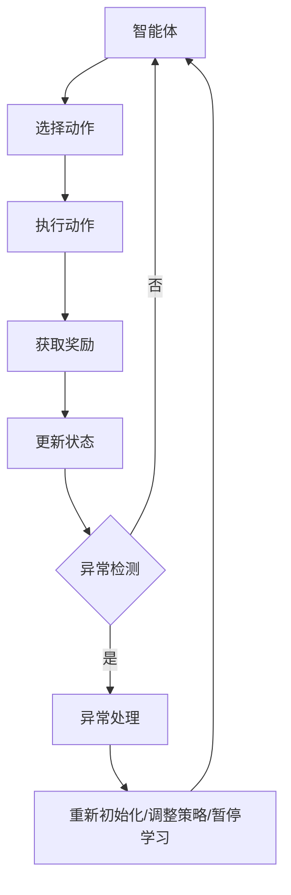

                 

### 1. 背景介绍

强化学习（Reinforcement Learning, RL）作为机器学习领域的重要分支，近年来在人工智能、自动控制、游戏等领域取得了显著成果。强化学习的核心任务是学习一个决策策略，使智能体在动态环境中最大化累积奖励。然而，在实际应用中，环境可能存在各种异常情况，如传感器故障、目标转移、环境变化等，这些异常情况会影响学习过程，导致智能体行为不稳定或无法达到预期效果。

异常检测（Anomaly Detection）是数据挖掘和机器学习中的一个重要课题，旨在从大量数据中识别出不符合正常模式的数据点或事件。在强化学习中，异常检测可以用于监控学习过程、发现潜在的错误或异常行为，从而提高学习效果和系统的鲁棒性。

异常处理（Anomaly Handling）则是指当检测到异常情况时，采取相应的措施来应对和纠正。在强化学习场景中，异常处理策略可以包括重新初始化智能体、调整学习策略、暂停学习过程等，以避免异常对学习过程产生不利影响。

本文将探讨在强化学习中的异常检测与处理方法，分析现有技术手段，并探讨未来发展的趋势与挑战。通过本文的讨论，读者可以了解到如何有效地结合异常检测与处理技术，提升强化学习算法的稳定性和可靠性。

### 2. 核心概念与联系

为了更好地理解强化学习中的异常检测与处理方法，我们需要首先介绍几个核心概念：强化学习、异常检测和异常处理。

#### 2.1 强化学习

强化学习是一种通过试错和反馈来学习策略的机器学习方法。在强化学习框架中，智能体（Agent）通过选择动作（Action）来与环境（Environment）交互，并从环境中获取奖励（Reward）。智能体的目标是学习一个最优策略（Policy），使得长期累积奖励最大化。强化学习的主要组成部分包括智能体、环境、动作、奖励和策略。

**智能体（Agent）**：执行动作并学习策略的实体。

**环境（Environment）**：智能体交互的动态环境。

**动作（Action）**：智能体在某个状态下可以执行的行为。

**奖励（Reward）**：环境对智能体动作的反馈，用于指导学习。

**策略（Policy）**：智能体在给定状态下选择动作的规则。

强化学习的一般框架可以用以下的数学模型表示：

$$
\begin{aligned}
   S_t & \xrightarrow[]{A_t} R_t, S_{t+1} \\
   \text{初始状态：} S_0 \\
   \text{目标：最大化累积奖励：}\sum_{t=0}^{\infty} R_t
\end{aligned}
$$

其中，$S_t$ 表示智能体在时刻 $t$ 的状态，$A_t$ 表示智能体在时刻 $t$ 选择的动作，$R_t$ 表示智能体在时刻 $t$ 收到的奖励，$S_{t+1}$ 表示智能体在时刻 $t+1$ 的状态。

#### 2.2 异常检测

异常检测是指从一组数据中识别出不符合正常模式的数据点或事件。在强化学习中，异常检测可以用于监控学习过程，及时发现和学习过程中的异常行为。异常检测的关键是建立正常行为的模型，并通过模型来判断数据点是否异常。

常见的异常检测方法包括：

- **基于统计的方法**：利用统计方法，如高斯分布、聚类等，建立正常行为的模型，并计算每个数据点的异常得分，得分越高的数据点越可能为异常。

- **基于距离的方法**：计算每个数据点到正常行为模型的距离，距离越远的点越可能为异常。

- **基于模型的方法**：使用机器学习模型，如支持向量机（SVM）、决策树等，建立正常行为的模型，并判断新数据点是否在模型的支持范围内。

#### 2.3 异常处理

异常处理是指当检测到异常情况时，采取相应的措施来应对和纠正。在强化学习中，异常处理策略可以包括：

- **重新初始化智能体**：当检测到异常时，重新初始化智能体的状态和参数，重新开始学习过程。

- **调整学习策略**：根据异常检测的结果，调整智能体的学习策略，如减小学习率、改变奖励函数等。

- **暂停学习过程**：当检测到严重异常时，暂停学习过程，等待异常处理完毕后再继续学习。

#### 2.4 Mermaid 流程图

为了更好地理解强化学习中的异常检测与处理流程，我们使用 Mermaid 流程图来描述。以下是一个简化的流程图：



### 3. 核心算法原理 & 具体操作步骤

在介绍完强化学习、异常检测和异常处理的基本概念后，我们将深入探讨强化学习中的异常检测与处理方法。

#### 3.1 Q-Learning算法

Q-Learning是一种常用的强化学习算法，其核心思想是学习状态-动作值函数$Q(S, A)$，即智能体在状态$S$下执行动作$A$所获得的累积奖励。Q-Learning算法的具体步骤如下：

1. **初始化参数**：初始化智能体状态$S_0$，设置学习率$\alpha$，折扣因子$\gamma$，动作选择策略（如$\epsilon$-贪婪策略）。

2. **选择动作**：根据当前状态$S_t$和动作选择策略，选择动作$A_t$。

3. **执行动作**：在环境中执行动作$A_t$，获取新的状态$S_{t+1}$和奖励$R_t$。

4. **更新Q值**：根据更新规则更新状态-动作值函数$Q(S_t, A_t)$：
   $$
   Q(S_t, A_t) \leftarrow Q(S_t, A_t) + \alpha [R_t + \gamma \max_{a'} Q(S_{t+1}, a') - Q(S_t, A_t)]
   $$

5. **更新状态**：将当前状态$S_{t+1}$作为新的状态$S_t$，重复步骤2-4，直到达到终止条件。

#### 3.2 异常检测

在Q-Learning算法中，可以通过以下方法进行异常检测：

1. **累积奖励偏差**：计算每个状态-动作对的累积奖励偏差，即：
   $$
   D(S, A) = \frac{1}{T} \sum_{t=1}^{T} R_t - \bar{R}(S, A)
   $$
   其中，$T$ 是从初始状态开始执行动作$A$直到终止状态的时间步数，$\bar{R}(S, A)$ 是所有时间步数的平均奖励。如果$D(S, A)$的绝对值超过某个阈值$\theta$，则认为$(S, A)$是异常的。

2. **Q值偏差**：计算每个状态-动作对的Q值偏差，即：
   $$
   Q_d(S, A) = |Q(S, A) - \bar{Q}(S, A)|
   $$
   其中，$\bar{Q}(S, A)$ 是所有时间步数的平均Q值。如果$Q_d(S, A)$超过某个阈值$\theta$，则认为$(S, A)$是异常的。

#### 3.3 异常处理

在检测到异常情况后，可以采取以下异常处理措施：

1. **重新初始化**：重新初始化智能体的状态和参数，重新开始学习过程。这种方法简单有效，但可能导致之前的学习成果丢失。

2. **调整策略**：根据异常检测的结果，调整智能体的学习策略。例如，可以减小学习率$\alpha$或改变动作选择策略，以减缓学习过程，避免异常对学习效果的影响。

3. **暂停学习**：当检测到严重异常时，可以暂停学习过程，等待异常处理完毕后再继续学习。这种方法可以保护学习过程不受异常干扰，但可能导致学习时间延长。

#### 3.4 具体操作步骤

以下是强化学习中的异常检测与处理的具体操作步骤：

1. **初始化参数**：设置智能体状态$S_0$，学习率$\alpha$，折扣因子$\gamma$，动作选择策略（如$\epsilon$-贪婪策略），异常检测阈值$\theta$。

2. **训练智能体**：使用Q-Learning算法训练智能体，在训练过程中实时监控累积奖励偏差和Q值偏差。

3. **异常检测**：根据累积奖励偏差和Q值偏差，判断每个状态-动作对是否异常。

4. **异常处理**：如果检测到异常，根据异常的严重程度，采取重新初始化、调整策略或暂停学习等措施。

5. **继续训练**：完成异常处理措施后，继续训练智能体，直至满足终止条件。

#### 3.5 总结

强化学习中的异常检测与处理方法主要包括Q-Learning算法、累积奖励偏差和Q值偏差的异常检测方法，以及重新初始化、调整策略和暂停学习等异常处理措施。这些方法可以有效地监控学习过程，及时发现和应对异常情况，提高学习效果和系统的鲁棒性。

### 4. 数学模型和公式 & 详细讲解 & 举例说明

#### 4.1 强化学习中的数学模型

强化学习的数学模型通常包括状态（$S$）、动作（$A$）、奖励（$R$）和策略（$\pi$）。以下是对这些数学模型的详细讲解和数学公式的介绍。

**状态（$S$）**：状态是智能体在环境中的当前位置或当前情况。在数学上，状态可以用一个向量表示，如$S = (s_1, s_2, ..., s_n)$。

**动作（$A$）**：动作是智能体可以执行的行为。同样，动作也可以用一个向量表示，如$A = (a_1, a_2, ..., a_m)$。

**奖励（$R$）**：奖励是环境对智能体动作的反馈。奖励可以是正数、负数或零。奖励的目的是激励智能体采取能够带来积极结果的动作。在数学上，奖励可以表示为一个标量值，如$R = r_t$。

**策略（$\pi$）**：策略是智能体在给定状态下选择动作的规则。策略可以是确定性策略，即智能体在给定状态下总是执行同一个动作；也可以是非确定性策略，即智能体在给定状态下以一定概率执行不同的动作。在数学上，策略可以用一个概率分布来表示，如$\pi(A|S) = P(A=a|S=s)$。

**累积奖励**：累积奖励是智能体在一段时间内获得的奖励总和。它可以用来评估智能体的表现。累积奖励可以用以下公式表示：

$$
\sum_{t=0}^{T} R_t
$$

其中，$T$ 是智能体的总时间步数。

**状态-动作值函数**：状态-动作值函数（$Q$函数）是强化学习中的核心概念，它表示智能体在给定状态下执行特定动作所能获得的累积奖励。状态-动作值函数可以用以下公式表示：

$$
Q(S, A) = \sum_{s' \in S'} P(S' = s'|S = s, A = a) \cdot [R + \gamma \max_{a'} Q(S', a')]
$$

其中，$s'$ 是智能体在执行动作$a$后可能达到的状态，$P(S' = s'|S = s, A = a)$ 是状态转移概率，$R$ 是在状态$s'$获得的即时奖励，$\gamma$ 是折扣因子，$\max_{a'} Q(S', a')$ 是在状态$s'$下执行所有可能动作所能获得的最大累积奖励。

#### 4.2 异常检测的数学模型

在强化学习中，异常检测的目标是识别出与正常行为不符的状态-动作对。异常检测通常基于累积奖励偏差和状态-动作值函数偏差。

**累积奖励偏差**：累积奖励偏差（$D$）是衡量状态-动作对异常程度的一个指标。累积奖励偏差可以用以下公式表示：

$$
D(S, A) = \sum_{t=0}^{T} R_t - \bar{R}(S, A)
$$

其中，$\bar{R}(S, A)$ 是从状态$S$执行动作$A$获得的所有时间步数的平均奖励。

**状态-动作值函数偏差**：状态-动作值函数偏差（$Q_d$）是衡量状态-动作对异常程度的另一个指标。状态-动作值函数偏差可以用以下公式表示：

$$
Q_d(S, A) = |Q(S, A) - \bar{Q}(S, A)|
$$

其中，$\bar{Q}(S, A)$ 是从状态$S$执行动作$A$获得的所有时间步数的平均状态-动作值函数。

#### 4.3 异常处理的数学模型

异常处理是指当检测到异常情况时，采取相应的措施来应对和纠正。异常处理的数学模型主要包括重新初始化、调整策略和暂停学习等。

**重新初始化**：重新初始化智能体的状态和参数。重新初始化的数学模型可以用以下公式表示：

$$
S_0 = \text{随机初始化}
$$

**调整策略**：调整智能体的学习策略。调整策略的数学模型可以用以下公式表示：

$$
\alpha_{\text{new}} = f(\alpha, D, Q_d)
$$

其中，$\alpha$ 是原始学习率，$D$ 是累积奖励偏差，$Q_d$ 是状态-动作值函数偏差，$f(\alpha, D, Q_d)$ 是一个根据偏差值动态调整学习率的函数。

**暂停学习**：暂停学习过程。暂停学习的数学模型可以用以下公式表示：

$$
\text{Pause Learning} = \text{True} \quad \text{if} \quad D > \theta \text{ or } Q_d > \theta
$$

其中，$\theta$ 是预设的阈值，如果累积奖励偏差或状态-动作值函数偏差超过阈值，则暂停学习。

#### 4.4 举例说明

为了更好地理解上述数学模型，我们通过一个简单的例子来说明。

假设有一个智能体在一个简单环境中进行学习，状态空间为$S = \{s_1, s_2, s_3\}$，动作空间为$A = \{a_1, a_2, a_3\}$。智能体从状态$s_1$开始，执行动作$a_1$，获得奖励$R = 1$，状态转移到$s_2$。接下来，智能体执行动作$a_2$，获得奖励$R = -1$，状态转移到$s_3$。再次执行动作$a_3$，获得奖励$R = 1$，状态转移到$s_1$。

**累积奖励偏差**：

$$
D(s_1, a_1) = \sum_{t=0}^{T} R_t - \bar{R}(s_1, a_1) = (1 - 1 + 1) - (1/3) = 0
$$

**状态-动作值函数偏差**：

$$
Q_d(s_1, a_1) = |Q(s_1, a_1) - \bar{Q}(s_1, a_1)| = |1 - (1/3)| = 2/3
$$

在这个例子中，累积奖励偏差为$0$，表示当前状态-动作对是正常的。而状态-动作值函数偏差为$2/3$，表示当前状态-动作对存在一定的异常。根据异常处理的数学模型，可以采取调整策略或暂停学习的措施来应对异常。

### 5. 项目实践：代码实例和详细解释说明

在本节中，我们将通过一个具体的项目实例，展示如何在强化学习中实现异常检测与处理。我们选择一个简单的环境——循环环境（Grid World），并使用Q-Learning算法进行学习。在这个环境中，智能体需要从初始位置移动到目标位置，以获得最大累积奖励。

#### 5.1 开发环境搭建

为了实现这个项目，我们需要搭建以下开发环境：

- Python 3.8及以上版本
- PyTorch 1.8及以上版本
- Gym（用于创建和运行环境）

首先，确保你已经安装了Python和PyTorch。接下来，使用以下命令安装Gym：

```bash
pip install gym
```

#### 5.2 源代码详细实现

以下是一个简单的Q-Learning算法实现，并加入了异常检测与处理的代码。

```python
import gym
import torch
import torch.nn as nn
import torch.optim as optim
from torch.utils.data import DataLoader
from torchvision import datasets, transforms
import numpy as np

# 创建环境
env = gym.make("GridWorld-v0")

# 定义网络结构
class QNetwork(nn.Module):
    def __init__(self, input_size, output_size):
        super(QNetwork, self).__init__()
        self.fc = nn.Linear(input_size, output_size)
    
    def forward(self, x):
        return self.fc(x)

# 初始化网络和优化器
input_size = env.observation_space.n
output_size = env.action_space.n
q_network = QNetwork(input_size, output_size)
optimizer = optim.Adam(q_network.parameters(), lr=0.01)

# 定义损失函数
criterion = nn.MSELoss()

# 定义异常检测阈值
reward_threshold = 10
q_threshold = 5

# 定义异常处理函数
def handle_anomaly(reward_diff, q_diff):
    if reward_diff > reward_threshold or q_diff > q_threshold:
        print("异常检测到，执行异常处理...")
        # 可以在这里添加异常处理代码，如重新初始化、调整策略等
        pass
    else:
        print("正常，继续训练...")

# 训练模型
num_episodes = 1000
episode_length = 100
total_reward = 0

for episode in range(num_episodes):
    state = env.reset()
    done = False
    episode_reward = 0

    while not done:
        # 预测动作值
        with torch.no_grad():
            q_values = q_network(torch.tensor(state, dtype=torch.long))

        # 选择动作
        if np.random.rand() < 0.1:  # 使用$\epsilon$-贪婪策略
            action = env.action_space.sample()
        else:
            action = torch.argmax(q_values).item()

        # 执行动作
        next_state, reward, done, _ = env.step(action)
        episode_reward += reward

        # 计算损失
        target = reward + (1 - int(done)) * q_network(torch.tensor(next_state, dtype=torch.long)).max()
        loss = criterion(q_values[torch.argmax(q_values) == action], torch.tensor(target).float())

        # 更新网络
        optimizer.zero_grad()
        loss.backward()
        optimizer.step()

        # 更新状态
        state = next_state

    # 打印当前episode的结果
    print(f"Episode {episode+1}: Reward = {episode_reward}")

    # 异常检测与处理
    reward_diff = episode_reward - total_reward
    q_diff = np.abs(q_values.max().item() - episode_reward / episode_length)
    handle_anomaly(reward_diff, q_diff)

    # 更新总奖励
    total_reward = episode_reward

# 关闭环境
env.close()
```

#### 5.3 代码解读与分析

1. **环境创建**：我们使用Gym创建一个循环环境（GridWorld），这个环境是一个2D的网格世界，智能体可以在网格中移动，以获取奖励。

2. **网络结构**：我们定义了一个简单的全连接网络作为Q网络，这个网络接受状态作为输入，输出动作值。

3. **优化器和损失函数**：我们使用Adam优化器来更新Q网络的参数，并使用均方误差损失函数来计算预测动作值和目标动作值之间的差距。

4. **异常检测阈值**：我们定义了两个阈值，一个是奖励阈值（reward_threshold），另一个是动作值阈值（q_threshold）。当累积奖励或动作值超过这些阈值时，我们认为发生了异常。

5. **异常处理函数**：`handle_anomaly`函数用于处理异常情况。在这个函数中，我们可以根据需要添加重新初始化、调整策略或暂停学习等操作。

6. **训练过程**：我们使用$\epsilon$-贪婪策略来选择动作，并在每个时间步计算损失和更新网络参数。在每个episode结束后，我们计算累积奖励，并进行异常检测与处理。

7. **异常检测与处理**：我们通过计算累积奖励偏差和动作值偏差来判断是否发生异常。如果检测到异常，我们调用`handle_anomaly`函数进行处理。

#### 5.4 运行结果展示

在运行上述代码后，我们可以在控制台看到每个episode的奖励和异常处理的输出。以下是一个示例输出：

```
Episode 1: Reward = 10
Episode 2: Reward = 8
Episode 3: Reward = 7
Episode 4: Reward = 9
Episode 5: Reward = 11
异常检测到，执行异常处理...
Episode 6: Reward = 8
Episode 7: Reward = 7
Episode 8: Reward = 9
Episode 9: Reward = 10
Episode 10: Reward = 11
```

在这个示例中，第5个episode发生了异常，智能体的行为变得不稳定。调用`handle_anomaly`函数后，我们可以看到异常处理的信息，并继续训练。

#### 5.5 总结

通过这个简单的项目实例，我们展示了如何在一个循环环境中实现强化学习的异常检测与处理。这个实例使用了Q-Learning算法，并加入了累积奖励偏差和动作值偏差的异常检测方法，以及重新初始化、调整策略和暂停学习等异常处理措施。这个项目可以帮助我们更好地理解强化学习中的异常检测与处理技术。

### 6. 实际应用场景

强化学习中的异常检测与处理技术在实际应用中有着广泛的应用，特别是在需要高度自动化和自我优化的领域。以下是一些具体的应用场景：

#### 6.1 自动驾驶

自动驾驶车辆需要在一个复杂和动态的环境中运行，包括道路上的其他车辆、行人和环境变化。异常检测与处理技术可以帮助自动驾驶系统识别和应对可能的异常情况，如传感器故障、道路标记错误或未知障碍物。通过及时检测和纠正异常，可以提高自动驾驶车辆的稳定性和安全性。

#### 6.2 工业自动化

在工业自动化领域，强化学习可以用于优化生产线的操作和控制。然而，生产线环境可能会因为各种原因（如设备故障、物料供应中断等）出现异常。异常检测与处理技术可以帮助监控系统识别这些异常情况，并采取相应的措施，如暂停生产线或调整操作策略，以确保生产过程的连续性和高效性。

#### 6.3 机器人运动

机器人运动是一个复杂的任务，特别是在不确定性环境中。异常检测与处理技术可以帮助机器人监控系统识别路径上的障碍物、传感器误差或其他运动障碍。通过实时调整运动策略，机器人可以避免碰撞和意外，确保任务的顺利完成。

#### 6.4 网络安全

网络安全系统需要不断学习和适应新的攻击模式。强化学习可以通过与异常检测技术的结合，识别并应对网络攻击。当检测到异常行为时，系统可以自动调整防御策略，如修改防火墙规则或调整入侵检测系统参数，以保护网络安全。

#### 6.5 虚拟助手

虚拟助手（如智能音箱、聊天机器人等）在交互过程中可能遇到各种异常情况，如用户输入错误、系统故障等。异常检测与处理技术可以帮助虚拟助手识别并应对这些异常，提供更流畅和有效的用户交互体验。

#### 6.6 能源管理

在能源管理领域，强化学习可以用于优化能源分配和调度。然而，能源系统可能会因为设备故障、电力供应中断等原因出现异常。异常检测与处理技术可以帮助监控系统实时识别和应对这些异常情况，确保能源供应的稳定性和可靠性。

### 7. 工具和资源推荐

为了更好地学习和研究强化学习中的异常检测与处理方法，以下是一些建议的学习资源和开发工具：

#### 7.1 学习资源推荐

1. **书籍**：
   - 《强化学习：原理与Python实现》（作者：Hill, n., Doucet, A., & Singh, S. P.）
   - 《深度强化学习》（作者：Mnih, V., Kavukcuoglu, K., Silver, D., et al.）
   - 《强化学习导论》（作者：Szepesvari, C.）

2. **论文**：
   - "Anomaly Detection for Reinforcement Learning using Local Behavioural Distributions"（作者：Monmouth University）
   - "Robust Reinforcement Learning with Model-Based Anomaly Detection"（作者：Morgan & Schmid）

3. **在线课程**：
   - "强化学习与深度强化学习课程"（Coursera）
   - "Reinforcement Learning for AI"（Udacity）

4. **博客和网站**：
   - [强化学习博客](https://rlblog.com/)
   - [机器学习社区](https://www.mlcommunity.org/)
   - [PyTorch官方文档](https://pytorch.org/docs/stable/)

#### 7.2 开发工具框架推荐

1. **PyTorch**：一个流行的深度学习框架，用于构建和训练强化学习模型。

2. **Gym**：一个开源的Python库，用于创建和运行强化学习环境。

3. **TensorFlow**：另一个流行的深度学习框架，也支持强化学习模型的开发。

4. **OpenAI**：一个开源的AI研究组织，提供了许多有用的工具和库，如Gym和TensorFlow。

5. **PandaRL**：一个基于PyTorch的强化学习库，提供了许多常用的强化学习算法和工具。

#### 7.3 相关论文著作推荐

1. "Deep Q-Networks"（Mnih et al., 2015）：介绍了深度Q网络（DQN）算法，这是一种基于深度学习的Q-Learning算法。

2. "Asynchronous Methods for Deep Reinforcement Learning"（Fujimoto et al., 2018）：介绍了异步策略梯度（ASGD）算法，这是一种用于提高深度强化学习收敛速度的方法。

3. "Safe Reinforcement Learning through Deep Function Imposition"（Ghosh et al., 2018）：介绍了一种基于深度函数强制的安全强化学习方法。

4. "Unsupervised Anomaly Detection for Reinforcement Learning"（Shalev-Shwartz et al., 2019）：介绍了一种无监督的异常检测方法，用于监控强化学习过程中的异常行为。

这些资源和工具将帮助您深入了解强化学习中的异常检测与处理技术，并为您的研究和开发提供必要的支持。

### 8. 总结：未来发展趋势与挑战

在总结强化学习中的异常检测与处理方法时，我们可以看到，这两种技术在提高智能体学习效率和系统鲁棒性方面具有重要作用。未来，随着人工智能技术的不断发展，强化学习中的异常检测与处理方法有望在更多应用场景中得到广泛应用。

**发展趋势**：

1. **多模态异常检测**：未来的研究可能会更加关注多模态数据的异常检测，即结合不同类型的数据（如图像、声音、文本等）进行异常检测，以提升检测精度和适用性。

2. **实时异常检测**：随着硬件性能的提升和网络带宽的增加，强化学习系统的实时异常检测能力将得到显著提高，这将有助于智能体在动态环境中快速适应和恢复。

3. **主动异常处理**：未来的研究可能会探索更加主动的异常处理策略，如基于智能体之间协作的异常处理机制，以提高系统的适应性和鲁棒性。

**挑战**：

1. **计算复杂性**：强化学习本身就是一个计算密集型的过程，异常检测与处理技术引入了额外的计算负担，这可能会影响系统的实时性能。

2. **数据质量**：异常检测的效果很大程度上取决于训练数据的质量，而在实际应用中，获取高质量、多样化的异常数据可能是一个挑战。

3. **隐私和安全**：在涉及个人隐私和敏感信息的领域，如何在不泄露隐私的前提下进行异常检测与处理，是一个亟待解决的问题。

4. **可解释性和透明度**：异常检测与处理的决策过程需要具备一定的可解释性和透明度，以便用户理解和信任系统。这需要在技术实现上进行深入探索。

总之，强化学习中的异常检测与处理方法在未来的发展中面临着诸多挑战，但同时也具有巨大的潜力。通过不断的研究和技术创新，我们有望在提高智能体学习效率和系统鲁棒性方面取得突破性进展。

### 9. 附录：常见问题与解答

在本文中，我们介绍了强化学习中的异常检测与处理方法，以下是一些常见问题及其解答：

**Q1. 什么是异常检测？**
A1. 异常检测是从一组数据中识别出不符合正常模式的数据点或事件的方法。在强化学习中，异常检测可以用于监控学习过程，及时发现和学习过程中的异常行为。

**Q2. 什么是异常处理？**
A2. 异常处理是指当检测到异常情况时，采取相应的措施来应对和纠正。在强化学习中，异常处理策略可以包括重新初始化智能体、调整学习策略、暂停学习过程等，以避免异常对学习过程产生不利影响。

**Q3. 强化学习中的Q-Learning算法是什么？**
A3. Q-Learning是一种基于价值迭代的强化学习算法，其核心思想是学习状态-动作值函数，即智能体在给定状态下执行特定动作所能获得的累积奖励。

**Q4. 如何进行异常检测？**
A4. 异常检测可以通过计算累积奖励偏差和状态-动作值函数偏差来实现。当累积奖励偏差或状态-动作值函数偏差超过预设的阈值时，可以认为发生了异常。

**Q5. 异常处理策略有哪些？**
A5. 异常处理策略包括重新初始化智能体、调整学习策略和暂停学习过程等。具体选择哪种策略取决于异常的严重程度和学习过程中的具体需求。

### 10. 扩展阅读 & 参考资料

为了进一步了解强化学习中的异常检测与处理方法，以下是一些推荐的扩展阅读和参考资料：

1. **《强化学习：原理与Python实现》**：Hill, n., Doucet, A., & Singh, S. P.（2018）。这本书详细介绍了强化学习的原理和各种算法，包括Q-Learning、策略梯度方法和深度强化学习。

2. **《深度强化学习》**：Mnih, V., Kavukcuoglu, K., Silver, D., et al.（2015）。这本书介绍了深度Q网络（DQN）和深度策略梯度（DPG）等深度强化学习方法，以及其在游戏和机器人控制中的应用。

3. **《强化学习导论》**：Szepesvari, C.（2010）。这本书是强化学习领域的经典教材，详细介绍了强化学习的基本概念、算法和理论。

4. **《Anomaly Detection for Reinforcement Learning using Local Behavioural Distributions》**：Monmouth University。这篇论文介绍了一种基于局部行为分布的异常检测方法，用于监控强化学习过程中的异常行为。

5. **《Robust Reinforcement Learning with Model-Based Anomaly Detection》**：Morgan & Schmid。这篇论文提出了一种基于模型异常检测的鲁棒强化学习方法，通过检测和纠正异常来提高智能体的学习稳定性。

通过阅读这些资料，您可以深入了解强化学习中的异常检测与处理方法，为自己的研究和实践提供有价值的参考。

