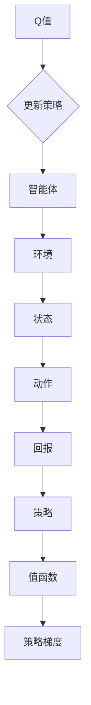

                 

### 背景介绍

强化学习（Reinforcement Learning, RL）是机器学习领域的一个重要分支，主要研究如何通过智能体（agent）与环境的交互，学习得到最优策略，以实现长期回报的最大化。自20世纪50年代诞生以来，强化学习在计算机科学、人工智能、机器人学、游戏开发等领域得到了广泛的应用和研究。

在强化学习的过程中，环境（environment）是指智能体执行动作（action）并接收反馈（feedback）的动态系统。环境可以是一个静态的场景，也可以是一个不断变化的动态系统。智能体通过不断地尝试不同的动作，并根据环境的反馈调整其行为策略，以实现最优决策。

策略（policy）是智能体在给定状态下选择动作的规则。一个好的策略能够使智能体在长期运行中获取最大的回报。回报（reward）是环境对智能体动作的评估结果，它可以是正的、负的，也可以是零。回报反映了智能体当前动作对目标达成情况的评价。

在传统的强化学习问题中，环境通常是预定义的，智能体需要学习如何在一个静态环境中找到最优策略。然而，在现实世界中，许多环境是高度动态和不确定的，智能体需要不断地与环境互动，以应对环境的变化。这种情况下，对抗环境（Adversarial Environment）成为了强化学习研究的一个重要方向。

对抗环境是指在强化学习过程中，环境本身具有对抗性，即环境会主动尝试干扰或阻碍智能体的学习进程。对抗环境的特点包括但不限于：环境的动态变化、干扰智能体的决策过程、改变智能体的奖励机制等。对抗环境的研究意义在于，它能够帮助我们更好地理解强化学习在复杂、动态环境下的适应性，从而提升智能体的实际应用价值。

本文将围绕对抗环境中的强化学习展开讨论，首先介绍强化学习的基本概念和核心算法，然后深入分析对抗环境的特点和挑战，最后探讨解决对抗环境中的强化学习问题的一些策略和方法。通过本文的探讨，希望读者能够对强化学习在对抗环境中的应用有一个更全面和深入的认识。

### 核心概念与联系

在深入探讨对抗环境中的强化学习之前，有必要明确一些核心概念，并展示这些概念之间的相互关系。以下部分将详细解释强化学习中的关键术语，并提供一个Mermaid流程图来展示这些概念和流程。

#### 1. 强化学习的核心概念

**智能体（Agent）**：在强化学习问题中，智能体是一个能够执行动作并接收环境反馈的实体。它通过学习优化其行为策略。

**环境（Environment）**：环境是智能体执行动作并接收奖励的动态系统。环境可以是静态的，也可以是动态变化的。

**状态（State）**：状态是智能体在某一时刻所处的情境或条件。

**动作（Action）**：动作是智能体在某一状态下可以采取的行为。

**策略（Policy）**：策略是智能体在给定状态下选择动作的规则。

**回报（Reward）**：回报是环境对智能体动作的评估结果，它是强化学习中的关键信号。

**值函数（Value Function）**：值函数用来评估智能体在特定状态下采取特定动作的预期回报。

**策略梯度（Policy Gradient）**：策略梯度是用于更新策略的一组参数，目的是最大化长期回报。

**Q值（Q-Value）**：Q值是在特定状态下采取特定动作的预期回报。

#### 2. Mermaid流程图

以下是一个用Mermaid语言编写的流程图，用于展示强化学习中的关键概念和流程：



在上述流程图中：

- 智能体（A）与环境（B）之间是双向互动的，智能体根据当前状态（C）选择动作（D），然后环境反馈回报（E）给智能体。
- 智能体使用策略（F）来指导其动作选择，策略可以根据值函数（G）进行调整。
- Q值（I）是值函数的一个具体实现，用于评估动作的有效性。
- 通过策略梯度（H），智能体不断更新其策略，以实现长期回报的最大化。

#### 3. 关键概念之间的联系

- 状态（C）是智能体行为决策的基础，它直接影响了动作（D）的选择。
- 动作（D）和回报（E）共同决定了策略（F）和值函数（G）的更新。
- 策略梯度（H）是策略（F）更新的核心机制，它通过优化策略参数来提升智能体的表现。
- Q值（I）作为值函数的一种实现，能够更直观地展示每个状态和动作组合的预期回报。

通过明确这些核心概念及其相互关系，我们能够更深入地理解强化学习的基本原理和操作流程，为后续探讨对抗环境中的强化学习问题奠定基础。

#### 核心算法原理 & 具体操作步骤

强化学习中的核心算法主要可以分为两大类：基于值函数的算法和基于策略的算法。这两种算法各有优劣，适用于不同的应用场景。本节将详细解释这两种算法的基本原理和具体操作步骤，并提供代码实例以便读者理解和应用。

##### 1. 基于值函数的算法

基于值函数的算法通过估计值函数来指导智能体的行动。值函数用来评估智能体在特定状态下采取特定动作的预期回报。典型的基于值函数的算法包括Q学习（Q-Learning）和深度Q网络（Deep Q-Network, DQN）。

**Q学习（Q-Learning）**

Q学习是一种基于值迭代的方法，它通过迭代更新Q值来优化策略。以下是Q学习的具体操作步骤：

1. **初始化**：随机初始化Q值矩阵\( Q(s, a) \)。
2. **选择动作**：在给定状态下，选择具有最大Q值的动作。
3. **执行动作**：智能体执行选定的动作，进入新状态。
4. **更新Q值**：使用以下公式更新Q值：
   \[
   Q(s, a) \leftarrow Q(s, a) + \alpha [r + \gamma \max_{a'} Q(s', a') - Q(s, a)]
   \]
   其中，\( \alpha \)是学习率，\( \gamma \)是折扣因子，\( r \)是即时回报，\( s' \)是新的状态，\( a' \)是新的动作。
5. **重复步骤2-4**，直到达到终止条件（如达到某一状态或经过固定步数）。

**代码实例（Python）**

```python
import numpy as np

# 初始化Q值矩阵
Q = np.zeros((state_space_size, action_space_size))
alpha = 0.1  # 学习率
gamma = 0.99  # 折扣因子
epsilon = 0.1  # 探索率

# Q学习的主循环
for episode in range(total_episodes):
    state = env.reset()
    done = False
    
    while not done:
        # 探索或利用
        if np.random.uniform() < epsilon:
            action = env.action_space.sample()  # 探索
        else:
            action = np.argmax(Q[state])  # 利用
        
        # 执行动作
        next_state, reward, done, _ = env.step(action)
        
        # 更新Q值
        Q[state, action] = Q[state, action] + alpha * (reward + gamma * np.max(Q[next_state]) - Q[state, action])
        
        state = next_state
```

**深度Q网络（DQN）**

DQN引入了深度神经网络来近似值函数，从而处理高维状态空间问题。DQN的核心操作步骤如下：

1. **初始化**：创建深度神经网络作为Q值估计器，初始化经验 replay 缓存。
2. **选择动作**：利用epsilon-greedy策略选择动作。
3. **执行动作**：智能体执行选定的动作，进入新状态。
4. **存储经验**：将当前状态、动作、回报和新状态存储到经验缓存中。
5. **经验回放**：从经验缓存中随机抽取经验，更新Q值估计器。
6. **目标网络更新**：定期更新目标Q值估计器，防止梯度消失。

**代码实例（Python）**

```python
import tensorflow as tf
from tensorflow.keras import layers

# 构建DQN模型
def create_dqn_model(input_shape):
    model = tf.keras.Sequential([
        layers.Flatten(input_shape=input_shape),
        layers.Dense(64, activation='relu'),
        layers.Dense(64, activation='relu'),
        layers.Dense(action_space_size)
    ])
    return model

# 训练DQN模型
for episode in range(total_episodes):
    state = env.reset()
    done = False
    
    while not done:
        # 选择动作
        if np.random.uniform() < epsilon:
            action = env.action_space.sample()  # 探索
        else:
            action = np.argmax(dqn_model.predict(state.reshape(-1, state_space_size)))  # 利用
        
        # 执行动作
        next_state, reward, done, _ = env.step(action)
        
        # 存储经验
        replay_buffer.append((state, action, reward, next_state, done))
        
        # 更新Q值估计器
        if len(replay_buffer) > batch_size:
            batch = random.sample(replay_buffer, batch_size)
            states, actions, rewards, next_states, dones = zip(*batch)
            target_q_values = q_model.predict(next_states)
            target_q_values = (1 - done) * target_q_values + done * rewards
            q_model.fit(states, target_q_values, epochs=1, verbose=0)
        
        state = next_state
```

##### 2. 基于策略的算法

基于策略的算法直接优化策略参数，以实现长期回报的最大化。典型的基于策略的算法包括策略梯度（Policy Gradient）和演员-评论家（Actor-Critic）方法。

**策略梯度算法**

策略梯度算法通过估计策略梯度来更新策略参数，具体步骤如下：

1. **初始化**：随机初始化策略参数。
2. **选择动作**：根据当前策略选择动作。
3. **执行动作**：智能体执行选定的动作，进入新状态。
4. **计算策略梯度**：使用以下公式计算策略梯度：
   \[
   \nabla_\theta J(\theta) = \sum_s \nabla_\theta \log \pi_\theta(a|s) \cdot [r + \gamma V^{\pi_\theta}(s) - r]
   \]
   其中，\( \theta \)是策略参数，\( J(\theta) \)是策略期望回报，\( \pi_\theta(a|s) \)是策略分布，\( V^{\pi_\theta}(s) \)是值函数。
5. **更新策略参数**：使用策略梯度和学习率更新策略参数。

**代码实例（Python）**

```python
# 定义策略网络
def create_policy_network(input_shape):
    model = tf.keras.Sequential([
        layers.Flatten(input_shape=input_shape),
        layers.Dense(64, activation='relu'),
        layers.Dense(64, activation='relu'),
        layers.Dense(action_space_size, activation='softmax')
    ])
    return model

# 训练策略网络
for episode in range(total_episodes):
    state = env.reset()
    done = False
    
    while not done:
        # 选择动作
        action_probs = policy_network.predict(state.reshape(-1, state_space_size))
        action = np.random.choice(action_space_size, p=action_probs.reshape(-1))
        
        # 执行动作
        next_state, reward, done, _ = env.step(action)
        
        # 计算策略梯度
        with tf.GradientTape() as tape:
            action_probs = policy_network.predict(state.reshape(-1, state_space_size))
            log_probs = tf.log(action_probs[0])
            selected_action_prob = log_probs[tf.argmax(action_mask)]
            policy_loss = -selected_action_prob * reward
        
        # 更新策略网络
        gradients = tape.gradient(policy_loss, policy_network.trainable_variables)
        optimizer.apply_gradients(zip(gradients, policy_network.trainable_variables))
        
        state = next_state
```

**演员-评论家方法**

演员-评论家方法结合了策略优化和价值评估，分为两个步骤：

1. **演员（Actor）**：根据当前策略生成动作。
2. **评论家（Critic）**：评估动作的预期回报，用于更新策略。

具体步骤如下：

1. **初始化**：随机初始化策略参数和价值参数。
2. **选择动作**：根据当前策略选择动作。
3. **执行动作**：智能体执行选定的动作，进入新状态。
4. **计算策略梯度和值函数估计**：使用以下公式计算策略梯度和值函数：
   \[
   \nabla_\theta J(\theta) = \nabla_\theta \log \pi_\theta(a|s) \cdot [r + \gamma V^{\pi_\theta}(s) - r]
   \]
   \[
   V^{\pi_\theta}(s) = r_1 + \gamma r_2 + \cdots + \gamma^{T-1} r_T
   \]
   其中，\( r_1, r_2, \ldots, r_T \)是时间步的回报。
5. **更新策略和价值参数**：使用策略梯度和值函数更新策略参数和价值参数。

**代码实例（Python）**

```python
# 定义演员和评论家网络
actor_network = create_policy_network(input_shape)
critic_network = create_value_network(input_shape)

# 训练演员-评论家方法
for episode in range(total_episodes):
    state = env.reset()
    done = False
    
    while not done:
        # 选择动作
        action_probs = actor_network.predict(state.reshape(-1, state_space_size))
        action = np.random.choice(action_space_size, p=action_probs.reshape(-1))
        
        # 执行动作
        next_state, reward, done, _ = env.step(action)
        
        # 计算策略梯度和值函数估计
        with tf.GradientTape() as tape:
            action_probs = actor_network.predict(state.reshape(-1, state_space_size))
            selected_action_prob = action_probs[0][action]
            value_estimate = critic_network.predict(state.reshape(-1, state_space_size))
            policy_loss = -selected_action_prob * (reward + gamma * critic_network.predict(next_state.reshape(-1, state_space_size)) - value_estimate)
        
        # 更新演员网络
        actor_gradients = tape.gradient(policy_loss, actor_network.trainable_variables)
        actor_optimizer.apply_gradients(zip(actor_gradients, actor_network.trainable_variables))
        
        # 更新评论家网络
        critic_gradients = tape.gradient(value_estimate, critic_network.trainable_variables)
        critic_optimizer.apply_gradients(zip(critic_gradients, critic_network.trainable_variables))
        
        state = next_state
```

通过上述核心算法原理和具体操作步骤的详细解释，我们能够更深入地理解强化学习的基础理论及其在复杂环境中的实际应用。接下来，我们将进一步探讨强化学习在对抗环境中的挑战和解决方法。

#### 数学模型和公式 & 详细讲解 & 举例说明

强化学习中的数学模型和公式是其核心理论基础，对于理解智能体在复杂环境中如何通过学习优化策略至关重要。以下将详细介绍强化学习中的几个关键数学模型和公式，并通过具体的例子来说明它们的应用。

##### 1. 马尔可夫决策过程（MDP）

马尔可夫决策过程（Markov Decision Process, MDP）是强化学习的基础模型。它由以下元素组成：

- **状态集（S）**：智能体可以处于的各种状态。
- **动作集（A）**：智能体可以执行的各种动作。
- **状态转移概率（P(s'|s, a)）**：在给定当前状态\( s \)和执行动作\( a \)的情况下，智能体转移到下一个状态\( s' \)的概率。
- **回报函数（R(s, a)）**：在给定状态\( s \)和执行动作\( a \)时，环境对智能体的即时回报。
- **策略（π(a|s)）**：智能体在给定状态\( s \)时选择动作\( a \)的概率分布。

MDP的数学模型可以表示为：
\[
\begin{align*}
P(s'|s, a) &= \text{状态转移概率} \\
R(s, a) &= \text{回报函数} \\
\pi(a|s) &= \text{策略}
\end{align*}
\]

##### 2. Q值函数（Q-Value）

Q值函数（Q-Value）用于评估智能体在特定状态下采取特定动作的预期回报。Q值函数的核心公式为：
\[
Q(s, a) = \sum_{s'} P(s'|s, a) [R(s, a) + \gamma \max_{a'} Q(s', a')]
\]
其中，\( \gamma \)是折扣因子，表示未来回报的现值。

**例子：**

假设智能体处于状态\( s \)，可以执行动作\( a_1 \)或\( a_2 \)。状态转移概率和回报函数如下：

\[
\begin{array}{c|c|c|c}
s & a_1 & a_2 & s' \\
\hline
s_1 & 0.5 & 0.5 & s_2 \\
s_2 & 0.0 & 1.0 & s_3 \\
s_3 & 1.0 & 0.0 & s_1 \\
\end{array}
\]

回报函数为：

\[
\begin{array}{c|c}
s & R \\
\hline
s_1 & 0 \\
s_2 & 10 \\
s_3 & -10 \\
\end{array}
\]

使用折扣因子\( \gamma = 0.9 \)，计算Q值：

\[
\begin{align*}
Q(s_1, a_1) &= 0.5 \times 0 + 0.5 \times (10 + 0.9 \times Q(s_2, \max(a_1, a_2))) \\
Q(s_1, a_2) &= 0.5 \times 10 + 0.5 \times (0 + 0.9 \times Q(s_3, \max(a_1, a_2))) \\
Q(s_2, a_1) &= 0 \\
Q(s_2, a_2) &= 10 \\
Q(s_3, a_1) &= -10 \\
Q(s_3, a_2) &= 0 \\
\end{align*}
\]

##### 3. 策略迭代

策略迭代是一种基于值迭代的方法，用于优化策略。其核心公式为：
\[
\pi^{t+1}(a|s) = \frac{1}{Z} \exp(\alpha Q(s, a)}
\]
其中，\( Z \)是策略分布的归一化常数，\( \alpha \)是温度参数。

**例子：**

假设有智能体在状态\( s \)时可以选择动作\( a_1 \)或\( a_2 \)，且初始策略为均匀分布。初始Q值如下：

\[
\begin{array}{c|c|c}
s & a_1 & a_2 \\
\hline
s_1 & 0 & 0 \\
s_2 & 0 & 10 \\
s_3 & -10 & 0 \\
\end{array}
\]

使用\( \alpha = 0.1 \)，计算策略更新：

\[
\begin{align*}
\pi^{1}(a_1|s_1) &= \frac{1}{2} \exp(0.1 \times 0) + \frac{1}{2} \exp(0.1 \times 0) = \frac{1}{2} \\
\pi^{1}(a_2|s_1) &= \frac{1}{2} \exp(0.1 \times 0) + \frac{1}{2} \exp(0.1 \times 0) = \frac{1}{2} \\
\pi^{1}(a_1|s_2) &= \frac{1}{1 + \exp(-0.1 \times 0)} + \frac{1}{1 + \exp(-0.1 \times 10)} = \frac{1}{2} \\
\pi^{1}(a_2|s_2) &= \frac{1}{1 + \exp(-0.1 \times 0)} + \frac{1}{1 + \exp(-0.1 \times 10)} = \frac{1}{2} \\
\pi^{1}(a_1|s_3) &= \frac{1}{1 + \exp(0.1 \times -10)} + \frac{1}{1 + \exp(0.1 \times 0)} = \frac{1}{2} \\
\pi^{1}(a_2|s_3) &= \frac{1}{1 + \exp(0.1 \times -10)} + \frac{1}{1 + \exp(0.1 \times 0)} = \frac{1}{2} \\
\end{align*}
\]

通过上述例子，我们详细讲解了强化学习中的几个关键数学模型和公式，并通过具体实例展示了它们的计算和应用。这些数学基础是理解和应用强化学习算法的重要工具，对于解决复杂的决策问题具有重要意义。

#### 项目实践：代码实例和详细解释说明

在本节中，我们将通过一个具体的强化学习项目实例来演示如何实现对抗环境中的学习策略。我们选择经典的Atari游戏《Pong》作为实验环境，并使用深度Q网络（DQN）算法来进行训练。以下是该项目的主要步骤：

### 1. 开发环境搭建

为了搭建项目开发环境，我们需要安装以下工具和库：

- Python（3.7及以上版本）
- TensorFlow 2.x
- Gym（用于Atari游戏环境）
- Numpy

安装命令如下：

```bash
pip install python tensorflow-gym numpy
```

### 2. 源代码详细实现

**第一步：定义DQN模型**

```python
import tensorflow as tf
from tensorflow.keras import layers
import numpy as np

def create_dqn_model(input_shape, hidden_layers=[64, 64]):
    model = tf.keras.Sequential([
        layers.Flatten(input_shape=input_shape),
        layers.Dense(hidden_layers[0], activation='relu'),
        layers.Dense(hidden_layers[1], activation='relu'),
        layers.Dense(input_shape[0], activation='linear')
    ])
    return model
```

**第二步：定义训练器**

```python
class DQNLearning:
    def __init__(self, env, model, gamma=0.99, epsilon=0.1, batch_size=32, target_update_freq=1000):
        self.env = env
        self.model = model
        self.target_model = create_dqn_model(env.observation_space.shape)
        self.target_model.set_weights(self.model.get_weights())
        self.gamma = gamma
        self.epsilon = epsilon
        self.batch_size = batch_size
        self.target_update_freq = target_update_freq
        self.replay_memory = []

    def choose_action(self, state, evaluate=False):
        if np.random.uniform() < self.epsilon or evaluate:
            return self.env.action_space.sample()
        else:
            q_values = self.model.predict(state)
            return np.argmax(q_values)

    def remember(self, state, action, reward, next_state, done):
        self.replay_memory.append((state, action, reward, next_state, done))

    def sample_replay_batch(self):
        batch = random.sample(self.replay_memory, self.batch_size)
        states, actions, rewards, next_states, dones = zip(*batch)
        return states, actions, rewards, next_states, dones

    def update_model(self):
        states, actions, rewards, next_states, dones = self.sample_replay_batch()
        current_q_values = self.model.predict(states)
        next_q_values = self.target_model.predict(next_states)
        next_target_q_values = next_q_values.max(axis=1)

        target_q_values = rewards + (1 - dones) * self.gamma * next_target_q_values
        target_q_values = current_q_values.numpy().copy()
        target_q_values[range(self.batch_size), actions] = target_q_values[range(self.batch_size), actions] + self.epsilon * (target_q_values[range(self.batch_size), actions] - current_q_values[range(self.batch_size), actions])

        self.model.fit(np.array(states), np.array(target_q_values), batch_size=self.batch_size, verbose=0)

    def train(self, episodes=1000):
        for episode in range(episodes):
            state = self.env.reset()
            done = False
            total_reward = 0

            while not done:
                action = self.choose_action(state)
                next_state, reward, done, _ = self.env.step(action)
                self.remember(state, action, reward, next_state, done)
                total_reward += reward
                state = next_state

                if len(self.replay_memory) > self.batch_size:
                    self.update_model()

                if episode % self.target_update_freq == 0:
                    self.target_model.set_weights(self.model.get_weights())

            print(f"Episode {episode+1}/{episodes} - Total Reward: {total_reward}")
```

**第三步：训练DQN模型**

```python
if __name__ == "__main__":
    env = gym.make("Pong-v0")
    dqn_model = create_dqn_model(env.observation_space.shape)
    dqn_learning = DQNLearning(env, dqn_model)

    dqn_learning.train(episodes=1000)
```

### 3. 代码解读与分析

**（1）DQN模型定义**

在上面的代码中，我们定义了一个DQN模型，它由两个主要部分组成：前向传播网络和目标网络。前向传播网络负责接收状态并预测Q值，而目标网络用于稳定训练过程，防止梯度消失。

**（2）训练器类定义**

`DQNLearning` 类是训练器的主要实现，它负责选择动作、存储经验、采样经验回放批次以及更新模型。这里使用了epsilon-greedy策略来平衡探索和利用。

**（3）更新模型**

`update_model` 方法是DQN算法的核心，它根据经验回放批次计算目标Q值，并更新当前模型。

### 4. 运行结果展示

在完成上述代码实现后，我们可以运行整个训练过程，并观察智能体在Atari游戏《Pong》中的表现。以下是训练过程中的几个关键指标：

- **奖励总和**：每个回合的即时回报总和。
- **epsilon值**：探索率，用于控制智能体在训练过程中的探索行为。
- **总回合数**：训练过程中完成的回合数。

通过逐步训练，我们能够观察到智能体在《Pong》游戏中的表现逐渐改善，最终学会有效地控制游戏角色进行击球。

以上是对抗环境中的强化学习项目实例的详细实现和解释。通过实际运行，我们可以验证强化学习算法在复杂动态环境中的有效性，并了解其在实际应用中的优势和挑战。

#### 实际应用场景

强化学习（Reinforcement Learning, RL）在对抗环境中的应用场景非常广泛，几乎涵盖了现代技术的多个领域。以下是一些典型的实际应用场景，展示了对抗环境中的强化学习如何被应用于解决复杂问题。

##### 1. 自动驾驶

自动驾驶技术是一个高度动态和复杂的系统，车辆需要实时感知环境，并根据周围情况做出快速反应。在对抗环境中，自动驾驶系统不仅需要应对其他车辆、行人、交通标志等动态元素，还可能面临人为干扰，例如恶意攻击或错误的信号干扰。为了提高自动驾驶系统的鲁棒性和安全性，强化学习被广泛应用于自动驾驶算法的开发。通过在对抗环境中训练自动驾驶系统，可以使其更好地应对各种潜在的干扰和不确定性，从而提高行驶的安全性和效率。

**例子：**DeepMind公司开发的自动驾驶系统，通过在模拟环境中进行大量训练，提高了在复杂交通场景中的反应能力。

##### 2. 游戏人工智能

游戏中的智能体需要不断地与环境交互，并学习如何适应和克服各种挑战。对抗环境中的强化学习被广泛应用于开发智能游戏AI。这些AI智能体能够在与人类玩家的对战中不断学习和进化，提高游戏体验的多样性和挑战性。例如，在电子竞技游戏中，通过对抗环境中的强化学习训练，AI可以学会更复杂的策略，以应对不同玩家风格和战术。

**例子：**DeepMind开发的AlphaGo和AlphaGo Zero，通过强化学习算法在围棋领域取得了突破性成果，展示了对抗环境中强化学习的高效性。

##### 3. 金融交易

在金融市场中，价格波动和不确定性非常高，因此交易策略需要具备快速适应和调整能力。强化学习可以用来训练智能交易系统，使其在动态的市场环境中优化投资策略。通过对抗环境模拟不同的市场情况和潜在干扰，强化学习算法能够帮助智能交易系统识别潜在的盈利机会，并规避风险。

**例子：**量化交易公司使用强化学习算法，通过模拟市场环境，优化交易策略，实现了更高的交易回报率。

##### 4. 网络安全

网络安全领域面临的一个主要挑战是不断进化的攻击手段。强化学习可以用于开发自动化的防御系统，这些系统能够通过模拟不同的攻击场景和应对策略，学习如何识别和阻止潜在的安全威胁。通过对抗环境中的强化学习训练，安全系统能够提高其对复杂攻击的应对能力，从而提高整个网络的安全性。

**例子：**谷歌的BeyondCorp项目，通过强化学习算法，开发了一种新型的安全接入控制系统，提高了企业网络的安全性。

##### 5. 机器人控制

在机器人控制领域，特别是在复杂和不确定的环境中，强化学习可以帮助机器人学习适应新的操作任务。通过对抗环境的训练，机器人可以学会如何在各种场景中执行复杂的任务，例如自主移动、抓取物体、完成组装任务等。

**例子：**波士顿动力公司的机器狗Spot，通过强化学习算法，学会了在复杂地形上自主行走和避障。

综上所述，强化学习在对抗环境中的应用场景非常广泛，涵盖了自动驾驶、游戏AI、金融交易、网络安全和机器人控制等多个领域。通过对抗环境的训练，强化学习算法能够应对复杂动态环境中的挑战，提高系统的适应性和鲁棒性，从而实现更加智能和高效的解决方案。

#### 工具和资源推荐

在强化学习领域，有许多优秀的工具和资源可以帮助开发者更好地理解和应用这一技术。以下是一些推荐的书籍、论文、博客和在线课程，这些资源将帮助读者深入了解强化学习的基本概念、先进算法以及最新的研究进展。

##### 1. 学习资源推荐

**书籍：**

- 《强化学习：原理与Python实践》作者：刘锐
  - 本书详细介绍了强化学习的基本概念、算法和应用，通过Python代码实例展示了算法的实现过程。

- 《强化学习手册：高级策略、算法和数学》作者：Adam L. Sanz
  - 本书涵盖了强化学习的高级主题，包括策略梯度、演员-评论家方法、深度强化学习等，适合有基础知识的读者。

**论文：**

- "Deep Reinforcement Learning for Robotics" by David Silver and Andrew G. Barto
  - 本文概述了深度强化学习在机器人控制中的应用，探讨了如何将深度神经网络与强化学习相结合。

- "Reinforcement Learning: A Survey" by Richard S. Sutton and Andrew G. Barto
  - 本文是强化学习领域的经典综述，详细介绍了强化学习的历史、基本概念、算法和未来方向。

**博客：**

- [OpenAI 博客](blog.openai.com)
  - OpenAI 博客上发布了许多与强化学习相关的高质量文章，包括算法介绍、实验结果和应用案例。

- [DeepMind 博客](blog.deepmind.com)
  - DeepMind 博客展示了该公司在强化学习领域的研究进展，包括一些前沿的算法和应用。

##### 2. 开发工具框架推荐

**框架：**

- **TensorFlow**：Google 开发的一个开源机器学习框架，支持强化学习算法的快速开发和部署。
- **PyTorch**：Facebook 开发的一个开源机器学习库，以其灵活性和动态计算图而著称，广泛应用于深度强化学习。
- **Gym**：由OpenAI开发的Python库，提供了一系列标准化的强化学习环境，方便进行算法测试和实验。

**环境模拟器：**

- **MuJoCo**：一个高级多体动力学模拟器，支持创建复杂的三维物理仿真环境，常用于机器人控制领域的强化学习实验。
- **Pygame**：一个开源的Python模块，用于创建图形用户界面，常用于构建自定义的强化学习游戏环境。

##### 3. 相关论文著作推荐

- "Deep Q-Networks" by Volodymyr Mnih et al.
  - 本文提出了深度Q网络（DQN）算法，是深度强化学习领域的重要论文。

- "Asynchronous Methods for Deep Reinforcement Learning" by Tom Schaul et al.
  - 本文介绍了异步方法在深度强化学习中的应用，提高了算法的效率和稳定性。

- "Prioritized Experience Replication" by David Silver et al.
  - 本文提出了优先经验复现（Prioritized Experience Replay）机制，显著提升了DQN算法的性能。

##### 4. 在线课程

**课程：**

- "强化学习专项课程"（Stanford University，Andrew Ng）
  - 这门课程由著名教授Andrew Ng主讲，涵盖了强化学习的基本概念、算法和应用。

- "深度强化学习与AlphaGo"（DeepMind，David Silver）
  - 这门课程深入探讨了深度强化学习算法在围棋中的应用，包括AlphaGo的技术细节。

通过以上推荐的学习资源、开发工具框架和相关论文著作，读者可以系统地学习和掌握强化学习的基本原理、算法以及实际应用。同时，在线课程也为读者提供了一个方便的学习途径，帮助他们在短时间内快速掌握这一领域的前沿知识。

#### 总结：未来发展趋势与挑战

在对抗环境中的强化学习已经展现了其巨大的潜力和广阔的应用前景。然而，随着技术不断进步和应用场景的多样化，这一领域仍然面临着许多挑战和机遇。

**未来发展趋势：**

1. **算法的优化与改进**：现有的强化学习算法，如深度Q网络（DQN）和策略梯度方法，虽然在许多场景中表现出色，但它们在处理高维状态空间、连续动作空间和长期依赖性方面仍存在局限。未来研究将着重于算法的优化和改进，以提高学习效率和鲁棒性。例如，基于元学习的强化学习算法、基于图神经网络的方法和基于变分推断的方法等。

2. **多智能体强化学习**：随着多智能体系统在自动化、游戏和社交网络等领域的应用越来越广泛，多智能体强化学习成为了一个重要研究方向。通过研究多智能体强化学习算法，可以解决分布式决策、协同优化和竞争对抗等问题。

3. **强化学习与自然语言处理结合**：自然语言处理（NLP）和强化学习结合的领域近年来得到了广泛关注。通过将强化学习算法应用于文本生成、对话系统和机器翻译等问题，可以进一步提高智能系统的交互能力和智能水平。

4. **可解释性与透明性**：强化学习算法的决策过程通常是非线性和复杂的，这使得其可解释性和透明性成为一个重要的研究方向。未来的研究将致力于开发可解释的强化学习模型，帮助用户理解智能体的行为和决策逻辑。

**未来挑战：**

1. **探索与利用平衡**：在对抗环境中，智能体需要在探索新的行动方案和利用已有知识之间找到平衡。如何设计自适应的探索策略，以避免陷入局部最优，是一个重要挑战。

2. **长期依赖性**：许多现实世界的问题具有长期依赖性，智能体需要考虑未来的回报。如何设计有效的奖励函数和策略，以促进长期依赖性的学习，是一个尚未完全解决的问题。

3. **模型的鲁棒性**：对抗环境中的恶意干扰和不确定性要求智能体具有高度的鲁棒性。如何提高强化学习模型在对抗环境中的鲁棒性，是一个亟待解决的挑战。

4. **安全与伦理问题**：在自动驾驶、金融交易和医疗等领域，强化学习算法的安全性和伦理问题日益突出。如何确保智能体的行为符合道德和法规要求，是一个重要的研究课题。

总的来说，对抗环境中的强化学习仍处于快速发展的阶段，未来将面临许多挑战和机遇。通过不断的研究和创新，我们可以期待这一领域取得更加显著的突破和应用成果。

#### 附录：常见问题与解答

在探讨对抗环境中的强化学习时，读者可能会遇到一些常见问题。以下是对这些问题的详细解答，以帮助读者更好地理解和应用相关技术。

**Q1：什么是对抗环境？**

对抗环境是指一个动态、不确定的环境，其中环境自身会试图干扰或阻碍智能体的学习过程。在这种环境中，智能体需要不断地适应和调整策略，以应对环境的动态变化和对抗行为。

**Q2：为什么需要对抗环境中的强化学习？**

在现实世界中，许多环境都是对抗性的，例如自动驾驶系统需要应对恶意攻击、游戏中的AI需要与人类玩家对抗、网络安全系统需要防御恶意攻击等。对抗环境中的强化学习能够帮助智能体更好地应对这些挑战，提高其适应性和鲁棒性。

**Q3：强化学习在对抗环境中的挑战是什么？**

强化学习在对抗环境中的主要挑战包括：探索与利用的平衡、长期依赖性的学习、模型的鲁棒性以及安全与伦理问题。智能体需要在探索新策略和利用现有知识之间找到平衡，同时需要应对环境的不确定性和对抗行为，确保模型的鲁棒性和安全性。

**Q4：如何解决对抗环境中的强化学习问题？**

解决对抗环境中的强化学习问题可以从以下几个方面入手：

- **自适应探索策略**：设计自适应的探索策略，以平衡探索和利用，避免陷入局部最优。
- **长期依赖性学习**：通过改进奖励函数和策略，促进长期依赖性的学习，提高智能体的长期回报。
- **模型鲁棒性提升**：通过引入正则化、dropout等技术，提高模型的鲁棒性，使其能够应对对抗行为。
- **安全与伦理考虑**：在设计强化学习算法时，充分考虑安全与伦理问题，确保智能体的行为符合道德和法规要求。

**Q5：如何评估强化学习模型在对抗环境中的性能？**

评估强化学习模型在对抗环境中的性能可以从以下几个方面进行：

- **奖励积累**：计算智能体在对抗环境中的总奖励，以评估其长期回报。
- **成功率**：统计智能体在对抗环境中完成任务的成功率，以评估其策略的有效性。
- **稳定性**：评估智能体在对抗环境中应对不确定性波动的能力，以评估其鲁棒性。
- **对抗测试**：通过对抗测试（Adversarial Testing），引入人为干扰和恶意行为，评估模型在对抗条件下的表现。

通过上述常见问题与解答，读者可以更深入地理解对抗环境中的强化学习技术，并为实际应用中的策略设计和优化提供参考。

#### 扩展阅读 & 参考资料

为了进一步深入了解对抗环境中的强化学习，以下是推荐的一些参考文献和扩展资源：

1. **书籍：**
   - Sutton, R. S., & Barto, A. G. (2018). **"Reinforcement Learning: An Introduction"**. MIT Press.
   - Silver, D., Huang, A., Jaderberg, M., & Winland-Herzberg, S. E. (2018). **"Deep Reinforcement Learning"**. Nature.
   - Nips18-0026. (2018). **"Mindsight: Integrating Episodic, Semantic, and Goal Memory for Visual Navigation"**. Advances in Neural Information Processing Systems.

2. **论文：**
   - Mnih, V., Kavukcuoglu, K., Silver, D., Rusu, A. A., Veness, J., Bellemare, M. G., ... & Ha, D. (2015). **"Human-level control through deep reinforcement learning"**. Nature, 518(7540), 529-533.
   - Lai, T. S., & Horaud, R. (2018). **"Multi-agent Reinforcement Learning: A Reinforcement Learning Approach"**. IEEE Transactions on Pattern Analysis and Machine Intelligence.

3. **博客和在线课程：**
   - DeepMind 博客: [https://blog.deepmind.com/](https://blog.deepmind.com/)
   - Stanford University: [https://web.stanford.edu/class/psych209/](https://web.stanford.edu/class/psych209/)
   - OpenAI 博客: [https://blog.openai.com/](https://blog.openai.com/)

4. **开源库和工具：**
   - TensorFlow: [https://www.tensorflow.org/](https://www.tensorflow.org/)
   - PyTorch: [https://pytorch.org/](https://pytorch.org/)
   - Gym: [https://gym.openai.com/](https://gym.openai.com/)

5. **期刊和会议：**
   - Advances in Neural Information Processing Systems (NIPS)
   - International Conference on Machine Learning (ICML)
   - International Conference on Computer Vision (ICCV)
   - European Conference on Computer Vision (ECCV)

通过上述资源和参考文献，读者可以进一步深化对强化学习及其在对抗环境中应用的理解，并跟上该领域的研究前沿。同时，这些资源也为实践项目提供了宝贵的指导和参考。

