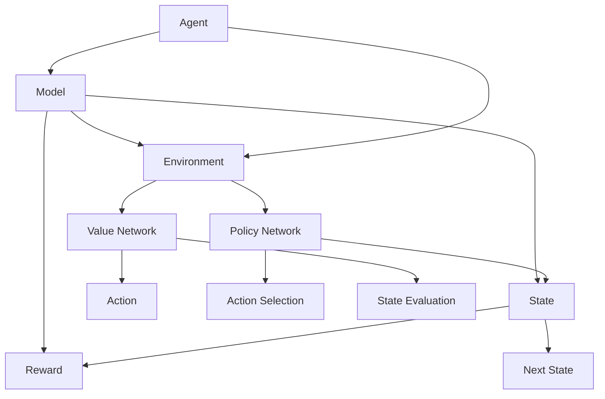

                 

### 1. 背景介绍

强化学习（Reinforcement Learning，简称RL）作为机器学习领域的重要分支，已经展现出其在智能决策、智能控制、游戏人工智能等众多领域中的重要应用价值。强化学习的核心在于通过与环境进行交互，不断调整自身的策略，以最大化累积奖励。与监督学习和无监督学习相比，强化学习更接近于人类学习的方式，具有自适应性和灵活性。

从历史角度来看，强化学习的研究可以追溯到20世纪50年代。当时的心理学家和计算机科学家开始探索如何让机器通过试错来学习复杂的任务。1954年，美国心理学家B.F. Skinner提出了强化理论，这一理论为强化学习的研究奠定了基础。1960年代，计算机科学家Arthur Samuel通过让计算机玩象棋游戏，成功实现了计算机的自我学习和策略优化，这被视为强化学习的早期成功案例。

进入21世纪，随着计算能力和数据存储技术的飞速发展，强化学习迎来了爆发式增长。AlphaGo的成功无疑是强化学习领域的一个重要里程碑。AlphaGo是谷歌DeepMind团队开发的围棋人工智能，通过深度强化学习算法，实现了在围棋领域超越人类顶级选手的成绩。这一成就不仅展示了强化学习在复杂任务处理方面的潜力，也引发了人们对强化学习在各个领域应用的广泛关注。

强化学习在现实世界中的应用场景十分广泛。例如，在自动驾驶领域，强化学习算法可以用于控制车辆的行驶路径，实现自主导航；在金融领域，强化学习可以用于量化交易策略的优化，提高投资收益；在医疗领域，强化学习可以用于疾病预测和治疗方案推荐，提高医疗决策的准确性。此外，强化学习还被应用于游戏开发、智能客服、机器人控制等多个领域，展现出其强大的应用价值。

总之，强化学习作为一种智能决策方法，正日益成为人工智能领域的研究热点。随着技术的不断进步和应用场景的拓展，强化学习有望在未来发挥更加重要的作用，为人类社会带来更多的创新和变革。

### 2. 核心概念与联系

#### 2.1. 强化学习的基本概念

强化学习（Reinforcement Learning，简称RL）是机器学习的一个重要分支，其主要目的是通过学习来获得最佳策略。强化学习中的基本概念包括以下几方面：

1. **代理（Agent）**：执行动作并接收环境反馈的智能体，如机器人、无人车、智能客服等。
2. **环境（Environment）**：代理执行动作的背景，可以是物理环境或虚拟环境。环境会根据代理的动作产生状态转移和奖励。
3. **状态（State）**：代理在环境中所处的某种描述，可以是多维向量。
4. **动作（Action）**：代理在某一状态下可以执行的行为。
5. **奖励（Reward）**：代理执行某一动作后，从环境中获得的即时反馈，用于评价动作的好坏。
6. **策略（Policy）**：代理在某一状态下选择动作的策略，可以是确定性策略或概率性策略。

#### 2.2. 强化学习中的常见架构

强化学习系统通常由以下几个关键部分组成：

1. **价值函数（Value Function）**：用于评估代理在特定状态下的最优值。包括状态值函数（State-Value Function）和动作值函数（Action-Value Function）。
2. **策略网络（Policy Network）**：用于生成代理的动作策略。可以通过神经网络来实现。
3. **评估网络（Value Network）**：用于评估代理在特定状态下的期望回报，帮助策略网络调整策略。
4. **模型（Model）**：用于预测环境状态转移和奖励的函数。通过模型预测，代理可以更快地学习环境特性。

#### 2.3. 强化学习算法的分类

根据学习过程中是否具备模型以及奖励的特点，强化学习算法主要可以分为以下几类：

1. **模型基强化学习（Model-Based Reinforcement Learning）**：这类算法使用环境模型来预测状态转移和奖励，包括马尔可夫决策过程（MDP）模型和部分可观测马尔可夫决策过程（POMDP）模型。
2. **模型自由强化学习（Model-Free Reinforcement Learning）**：这类算法不依赖环境模型，直接从经验中学习策略，包括基于值函数的方法（如Q-Learning）和基于策略的方法（如Policy Gradient）。
3. **基于策略的强化学习（Policy-Based Reinforcement Learning）**：这类算法通过直接优化策略来学习，常见的方法有策略梯度（Policy Gradient）和Actor-Critic方法。
4. **基于值的强化学习（Value-Based Reinforcement Learning）**：这类算法通过学习状态值函数或动作值函数来评估状态和动作，常见的方法有Q-Learning和SARSA。

#### 2.4. 强化学习与其他机器学习方法的比较

强化学习与监督学习和无监督学习有显著的不同：

1. **监督学习（Supervised Learning）**：在监督学习中，代理通过已标记的数据学习预测模型。强化学习则通过与环境互动，无标记地学习策略。
2. **无监督学习（Unsupervised Learning）**：无监督学习关注如何从无标签数据中学习特征表示。强化学习关注如何在不确定的环境中做出最优决策。
3. **强化学习优势**：强化学习能够处理动态环境，自适应调整策略，并具备一定的探索能力，使其在需要长期决策和复杂交互的任务中具有优势。

#### 2.5. 强化学习的关键挑战

尽管强化学习具有众多优势，但其在实际应用中也面临着一些关键挑战：

1. **探索与利用的权衡（Exploration vs Exploitation）**：强化学习需要在探索（尝试新策略）和利用（采用已知最优策略）之间找到平衡。
2. **样本效率（Sample Efficiency）**：强化学习通常需要大量样本来学习，提高样本效率是提高学习效率的关键。
3. **连续性和离散性动作空间**：处理连续动作空间和离散动作空间是强化学习的难点，需要设计合适的算法和技巧。
4. **模型泛化能力（Generalization）**：强化学习算法在实际应用中需要能够泛化到未见过的环境中，这需要算法具备良好的泛化能力。

通过以上对强化学习核心概念、架构、分类、与其他方法的比较以及关键挑战的介绍，我们可以对强化学习有一个全面和深入的理解，这为后续章节的深入探讨奠定了基础。

#### 2.6. 强化学习的Mermaid流程图

以下是一个简化的强化学习系统架构的Mermaid流程图，展示了强化学习系统中的关键组件及其交互流程。



在这个流程图中，代理（Agent）与环境（Environment）进行交互，通过策略网络（Policy Network）和评估网络（Value Network）不断更新其策略和行为。同时，模型（Model）用于预测状态转移和奖励，以提高代理的学习效率。每个组件的交互形成了强化学习系统的基础架构。

### 3. 核心算法原理 & 具体操作步骤

#### 3.1. Q-Learning算法

Q-Learning是强化学习中最基础和广泛使用的一种算法，它的核心思想是通过学习值函数来评估每个动作在当前状态下的预期回报，进而选择最优动作。

##### 3.1.1. 基本概念

在Q-Learning中，值函数 \( Q(s, a) \) 表示在状态 \( s \) 下执行动作 \( a \) 的预期回报。Q-Learning的目标是学习这个值函数，并基于它来选择动作。

- **状态-动作值函数（Q-Function）**：\( Q(s, a) \) 是在状态 \( s \) 下执行动作 \( a \) 后的预期回报。
- **目标值（Target Value）**：在更新值函数时，使用的预期回报，它是由当前状态 \( s_t \)、当前动作 \( a_t \)、下一个状态 \( s_{t+1} \) 和下一个动作的预期回报组成。

##### 3.1.2. 操作步骤

Q-Learning的具体操作步骤如下：

1. **初始化**：初始化值函数 \( Q(s, a) \) 为一个较小的常数，通常为0。
2. **选择动作**：在某一状态 \( s \) 下，根据策略选择一个动作 \( a \)。策略可以是基于最大值策略、ε-贪心策略等。
3. **执行动作**：在环境中执行选定的动作 \( a \)，并接收新的状态 \( s_{t+1} \) 和奖励 \( r \)。
4. **更新值函数**：根据下式更新值函数：
   $$
   Q(s_t, a_t) \leftarrow Q(s_t, a_t) + \alpha [r + \gamma \max_{a'} Q(s_{t+1}, a') - Q(s_t, a_t)]
   $$
   其中：
   - \( \alpha \) 是学习率，控制值函数更新的程度。
   - \( \gamma \) 是折扣因子，表示未来回报的重要程度。
   - \( \max_{a'} Q(s_{t+1}, a') \) 是在下一个状态 \( s_{t+1} \) 下所有可能动作的预期回报的最大值。
5. **重复步骤2-4**：不断重复以上步骤，直到满足停止条件（如达到一定步数、收敛到最优策略等）。

##### 3.1.3. 示例说明

假设代理处于状态 \( s_0 \)，初始值函数 \( Q(s_0, a) = 0 \)。当前状态下有两个动作 \( a_0 \) 和 \( a_1 \)，对应的预期回报为 \( Q(s_0, a_0) = 0.5 \) 和 \( Q(s_0, a_1) = 0.3 \)。在下一个状态 \( s_1 \) 下，执行动作 \( a_1 \) 后的奖励为 \( r = 0.1 \)，并且 \( Q(s_1, a') \) 的最大值为 \( 0.4 \)。

根据Q-Learning的更新公式，更新 \( Q(s_0, a_0) \) 和 \( Q(s_0, a_1) \)：

- 对于 \( a_0 \)：
  $$
  Q(s_0, a_0) \leftarrow Q(s_0, a_0) + \alpha [r + \gamma \max_{a'} Q(s_1, a') - Q(s_0, a_0)] = 0 + 0.1 + 0.9 \times (0.1 + 0.9 \times 0.4 - 0) = 0.58
  $$

- 对于 \( a_1 \)：
  $$
  Q(s_0, a_1) \leftarrow Q(s_0, a_1) + \alpha [r + \gamma \max_{a'} Q(s_1, a') - Q(s_0, a_1)] = 0.3 + 0.1 \times (0.1 + 0.9 \times 0.4 - 0.3) = 0.4
  $$

通过这个示例，我们可以看到Q-Learning算法是如何通过不断更新值函数来优化策略的。

#### 3.2. Policy Gradient算法

Policy Gradient算法通过直接优化策略来学习，它不依赖于值函数，而是直接更新策略以最大化累积奖励。

##### 3.2.1. 基本概念

在Policy Gradient中，策略 \( \pi(a|s; \theta) \) 表示在状态 \( s \) 下执行动作 \( a \) 的概率。策略网络参数 \( \theta \) 用于决定策略的形式。

- **策略网络（Policy Network）**：是一个概率模型，用于生成在特定状态下的动作分布。
- **梯度更新**：通过梯度上升方法，直接优化策略参数 \( \theta \)，使其最大化累积奖励。

##### 3.2.2. 操作步骤

Policy Gradient的具体操作步骤如下：

1. **初始化**：初始化策略网络参数 \( \theta \)。
2. **选择动作**：在状态 \( s \) 下，根据策略网络生成的概率分布 \( \pi(a|s; \theta) \) 选择一个动作 \( a \)。
3. **执行动作**：在环境中执行选定的动作 \( a \)，并接收新的状态 \( s_{t+1} \) 和奖励 \( r \)。
4. **计算回报**：计算从当前状态到终止状态（或下一个状态）的累积回报：
   $$
   G_t = \sum_{k=t}^{T} \gamma^k r_k
   $$
   其中，\( T \) 是时间步数，\( \gamma \) 是折扣因子。
5. **计算策略梯度**：根据回报 \( G_t \) 计算策略网络的梯度：
   $$
   \nabla_{\theta} J(\theta) = \nabla_{\theta} \sum_{t} \pi(a_t|s_t; \theta) G_t
   $$
   其中，\( J(\theta) \) 是策略的损失函数。
6. **更新策略参数**：使用梯度上升方法更新策略网络参数：
   $$
   \theta \leftarrow \theta + \alpha \nabla_{\theta} J(\theta)
   $$
   其中，\( \alpha \) 是学习率。
7. **重复步骤2-6**：不断重复以上步骤，直到满足停止条件。

##### 3.2.3. 示例说明

假设代理在状态 \( s_0 \) 下有两个动作 \( a_0 \) 和 \( a_1 \)，初始策略网络参数 \( \theta \) 使得 \( \pi(a_0|s_0; \theta) = 0.6 \)，\( \pi(a_1|s_0; \theta) = 0.4 \)。执行动作 \( a_0 \) 后，代理进入状态 \( s_1 \)，并收到奖励 \( r = 0.1 \)。假设累积回报 \( G_t = 0.2 \)。

根据Policy Gradient的更新公式，计算策略梯度和更新策略参数：

1. **计算策略梯度**：
   $$
   \nabla_{\theta} J(\theta) = \nabla_{\theta} [0.6 \times 0.2 + 0.4 \times 0] = [0.12, 0.08]
   $$

2. **更新策略参数**：
   $$
   \theta \leftarrow \theta + \alpha \nabla_{\theta} J(\theta) = [\theta_0 + 0.12, \theta_1 + 0.08]
   $$

通过这个示例，我们可以看到Policy Gradient算法是如何通过直接优化策略来学习并更新策略参数的。

#### 3.3. DQN算法

深度Q网络（Deep Q-Network，简称DQN）是结合深度学习与Q-Learning的一种算法，它通过深度神经网络来近似Q函数，从而解决状态空间维度过高的问题。

##### 3.3.1. 基本概念

DQN的核心思想是使用深度神经网络（DNN）来近似Q函数 \( Q(s, a) \)，即 \( Q_{\theta}(s, a) \)，其中 \( \theta \) 是网络参数。

- **深度神经网络（DNN）**：用于近似Q函数。
- **经验回放（Experience Replay）**：为了减少策略偏差，DQN使用经验回放机制，将历史经验数据随机取样，避免直接使用最近的体验数据导致的策略偏差。

##### 3.3.2. 操作步骤

DQN的具体操作步骤如下：

1. **初始化**：初始化DNN参数 \( \theta \) 和经验回放记忆池。
2. **选择动作**：在状态 \( s \) 下，根据当前策略选择一个动作 \( a \)，通常是ε-贪心策略。
3. **执行动作**：在环境中执行选定的动作 \( a \)，并接收新的状态 \( s_{t+1} \) 和奖励 \( r \)。
4. **存储经验**：将 \( (s_t, a_t, r, s_{t+1}) \) 存储到经验回放记忆池中。
5. **经验回放**：从经验回放记忆池中随机取样一个经验 \( (s', a', r', s'') \)。
6. **计算目标Q值**：
   $$
   Q^*(s', a') = r' + \gamma \max_{a''} Q_{\theta}(s'', a'')
   $$
7. **更新Q网络**：
   $$
   \theta \leftarrow \theta - \alpha \nabla_{\theta} [y - Q_{\theta}(s, a)]^2
   $$
   其中，\( y \) 是目标Q值，即 \( y = r + \gamma Q_{\theta}(s_{t+1}, a_{t+1}) \)。
8. **重复步骤2-7**：不断重复以上步骤，直到满足停止条件。

##### 3.3.3. 示例说明

假设代理在状态 \( s_0 \) 下有两个动作 \( a_0 \) 和 \( a_1 \)，当前DNN输出的Q值 \( Q_{\theta}(s_0, a_0) = 0.4 \)，\( Q_{\theta}(s_0, a_1) = 0.3 \)。执行动作 \( a_0 \) 后，代理进入状态 \( s_1 \)，并收到奖励 \( r = 0.1 \)。在经验回放记忆池中随机取样的下一个状态为 \( s_2 \)，DNN输出的Q值 \( Q_{\theta}(s_2, a') = 0.5 \)。

根据DQN的更新规则，计算目标Q值并更新DNN参数：

1. **计算目标Q值**：
   $$
   Q^*(s_0, a_0) = 0.1 + 0.9 \times 0.5 = 0.45
   $$

2. **更新DNN参数**：
   $$
   \theta \leftarrow \theta - \alpha \nabla_{\theta} [0.45 - Q_{\theta}(s_0, a_0)]^2
   $$
   假设学习率 \( \alpha = 0.1 \)，则更新过程如下：
   $$
   \theta \leftarrow \theta - 0.1 \nabla_{\theta} [0.45 - 0.4]^2 = \theta - 0.001 \times (0.45 - 0.4)^2 = \theta - 0.00005
   $$

通过这个示例，我们可以看到DQN算法是如何通过深度神经网络来近似Q函数，并使用经验回放机制来减少策略偏差的。

#### 3.4. A3C算法

异步 Advantage Actor-Critic（A3C）算法通过并行训练多个代理，并利用梯度累积的方法来提高训练效率，同时引入了优势函数来改善策略的学习。

##### 3.4.1. 基本概念

A3C的核心思想是利用多个并行代理在异步环境中训练，并使用全局策略和价值网络来聚合各个代理的经验，提高学习效率。

- **Actor-Critic**：结合了策略网络和价值网络的结构，通过策略网络生成动作，通过价值网络评估策略的好坏。
- **优势函数（Advantage Function）**：\( A(s, a) \) 表示在状态 \( s \) 下执行动作 \( a \) 的优势，即实际回报与期望回报的差值。

##### 3.4.2. 操作步骤

A3C的具体操作步骤如下：

1. **初始化**：初始化全局策略和价值网络参数 \( \theta \)，以及多个并行代理。
2. **选择动作**：在状态 \( s \) 下，根据策略网络生成的概率分布选择一个动作 \( a \)。
3. **执行动作**：在环境中执行选定的动作 \( a \)，并接收新的状态 \( s_{t+1} \) 和奖励 \( r \)。
4. **计算优势函数**：
   $$
   A(s, a) = G_t - V(s)
   $$
   其中，\( G_t \) 是累积回报，\( V(s) \) 是状态价值。
5. **梯度更新**：分别对策略网络和价值网络进行梯度更新：
   $$
   \nabla_{\theta} J_{\pi}(\theta) = \sum_{s, a} \pi(a|s; \theta) \nabla_{\theta} \log \pi(a|s; \theta) A(s, a)
   $$
   $$
   \nabla_{\theta} J_V(\theta) = \sum_{s} V(s) \nabla_{\theta} V(s)
   $$
6. **梯度累积**：将各个代理的梯度累积到全局梯度中，并使用全局梯度更新全局策略和价值网络参数。
7. **重复步骤2-6**：不断重复以上步骤，直到满足停止条件。

##### 3.4.3. 示例说明

假设有两个代理，代理1在状态 \( s_0 \) 下执行动作 \( a_0 \)，收到回报 \( r_1 = 0.1 \)；代理2在状态 \( s_1 \) 下执行动作 \( a_1 \)，收到回报 \( r_2 = 0.2 \)。全局策略和价值网络的参数为 \( \theta \)。

根据A3C的更新规则，计算全局梯度并更新全局参数：

1. **计算全局回报**：
   $$
   G = r_1 + r_2 = 0.1 + 0.2 = 0.3
   $$

2. **计算全局优势函数**：
   $$
   A_1(s_0, a_0) = G - V(s_0) = 0.3 - V(s_0)
   $$
   $$
   A_2(s_1, a_1) = G - V(s_1) = 0.3 - V(s_1)
   $$

3. **计算全局策略梯度**：
   $$
   \nabla_{\theta} J_{\pi}(\theta) = \sum_{s, a} \pi(a|s; \theta) \nabla_{\theta} \log \pi(a|s; \theta) A(s, a)
   $$
   其中，\( \pi(a|s; \theta) \) 是策略网络输出的概率分布。

4. **计算全局价值梯度**：
   $$
   \nabla_{\theta} J_V(\theta) = \sum_{s} V(s) \nabla_{\theta} V(s)
   $$

5. **更新全局参数**：
   $$
   \theta \leftarrow \theta + \alpha \nabla_{\theta} J_{\pi}(\theta) + \beta \nabla_{\theta} J_V(\theta)
   $$

通过这个示例，我们可以看到A3C算法是如何通过并行训练和梯度累积来提高训练效率的。

### 4. 数学模型和公式 & 详细讲解 & 举例说明

#### 4.1. 强化学习中的数学模型

强化学习中的数学模型主要包括马尔可夫决策过程（MDP）、状态值函数（State-Value Function）、动作值函数（Action-Value Function）等。下面将详细讲解这些模型，并给出相应的数学公式。

##### 4.1.1. 马尔可夫决策过程（MDP）

MDP是一个五元组 \( M = \langle S, A, P, R, \gamma \rangle \)，其中：

- \( S \)：状态空间，表示所有可能的状态集合。
- \( A \)：动作空间，表示所有可能的动作集合。
- \( P \)：状态转移概率函数，对于任意的 \( s \in S \) 和 \( a \in A \)，\( P(s' | s, a) \) 表示在状态 \( s \) 下执行动作 \( a \) 后转移到状态 \( s' \) 的概率。
- \( R \)：奖励函数，对于任意的 \( s \in S \) 和 \( a \in A \)，\( R(s, a) \) 表示在状态 \( s \) 下执行动作 \( a \) 后收到的即时奖励。
- \( \gamma \)：折扣因子，表示未来奖励的重要程度。

##### 4.1.2. 状态值函数（State-Value Function）

状态值函数 \( V(s) \) 表示在状态 \( s \) 下按照最优策略执行动作所能获得的累积奖励的期望。其数学定义为：

$$
V^*(s) = \sum_{s'} P(s'|s) \sum_{a} \gamma^0 R(s, a) + \gamma V^*(s')
$$

其中，\( V^*(s') \) 表示在状态 \( s' \) 下的状态值函数，\( \gamma \) 是折扣因子。

##### 4.1.3. 动作值函数（Action-Value Function）

动作值函数 \( Q(s, a) \) 表示在状态 \( s \) 下执行动作 \( a \) 所能获得的累积奖励的期望。其数学定义为：

$$
Q^*(s, a) = \sum_{s'} P(s'|s, a) \sum_{a'} \gamma^0 R(s, a) + \gamma Q^*(s', a')
$$

其中，\( Q^*(s', a') \) 表示在状态 \( s' \) 下执行动作 \( a' \) 的动作值函数。

#### 4.2. 强化学习算法的数学公式

下面我们将介绍几种强化学习算法的数学公式，包括Q-Learning、Policy Gradient和DQN。

##### 4.2.1. Q-Learning算法

Q-Learning算法的目标是学习最优动作值函数 \( Q^*(s, a) \)。其更新公式如下：

$$
Q(s, a) \leftarrow Q(s, a) + \alpha [r + \gamma \max_{a'} Q(s', a') - Q(s, a)]
$$

其中，\( r \) 是即时奖励，\( \gamma \) 是折扣因子，\( \alpha \) 是学习率。

##### 4.2.2. Policy Gradient算法

Policy Gradient算法的目标是学习最优策略 \( \pi^*(a|s) \)。其更新公式如下：

$$
\theta \leftarrow \theta + \alpha \nabla_{\theta} J(\theta)
$$

其中，\( J(\theta) = \sum_{t} \pi(a_t|s_t; \theta) G_t \)，\( G_t \) 是累积回报。

##### 4.2.3. DQN算法

DQN算法使用深度神经网络来近似动作值函数 \( Q_{\theta}(s, a) \)。其更新公式如下：

$$
\theta \leftarrow \theta - \alpha \nabla_{\theta} [y - Q_{\theta}(s, a)]^2
$$

其中，\( y = r + \gamma \max_{a'} Q_{\theta}(s', a') \) 是目标Q值。

#### 4.3. 举例说明

##### 4.3.1. Q-Learning算法举例

假设代理处于状态 \( s = [1, 2, 3] \)，当前动作值函数为 \( Q(s, a) \) 如下：

$$
Q([1, 2, 3], [u, d, l]) = \begin{bmatrix}
0.2 & 0.3 & 0.1 \\
0.4 & 0.5 & 0.2 \\
0.1 & 0.3 & 0.4
\end{bmatrix}
$$

代理执行动作 \( u \)（向上移动），进入状态 \( s' = [2, 3, 4] \)，收到即时奖励 \( r = 0.1 \)。当前折扣因子 \( \gamma = 0.9 \)，学习率 \( \alpha = 0.1 \)。则更新后的动作值函数为：

$$
Q([1, 2, 3], [u]) \leftarrow Q([1, 2, 3], [u]) + 0.1 [0.1 + 0.9 \times \max_{a'} Q([2, 3, 4], a') - Q([1, 2, 3], [u])]
$$

假设在状态 \( s' \) 下，\( \max_{a'} Q([2, 3, 4], a') = 0.6 \)，则更新过程为：

$$
Q([1, 2, 3], [u]) \leftarrow \begin{bmatrix}
0.2 & 0.3 & 0.1 \\
0.4 & 0.5 & 0.2 \\
0.1 & 0.3 & 0.4
\end{bmatrix} + 0.1 [0.1 + 0.9 \times 0.6 - 0.2] = \begin{bmatrix}
0.21 & 0.33 & 0.12 \\
0.44 & 0.55 & 0.23 \\
0.11 & 0.33 & 0.45
\end{bmatrix}
$$

##### 4.3.2. Policy Gradient算法举例

假设代理处于状态 \( s = [1, 2, 3] \)，当前策略网络参数为 \( \theta \)，策略网络生成的动作概率分布为：

$$
\pi(a|s; \theta) = \begin{bmatrix}
0.5 & 0.3 & 0.2 \\
0.4 & 0.5 & 0.1 \\
0.6 & 0.2 & 0.2
\end{bmatrix}
$$

代理执行动作 \( u \)（向上移动），进入状态 \( s' = [2, 3, 4] \)，收到即时奖励 \( r = 0.1 \)。当前累积回报 \( G_t = 0.3 \)，学习率 \( \alpha = 0.1 \)。则更新后的策略网络参数为：

$$
\theta \leftarrow \theta + 0.1 \nabla_{\theta} J(\theta)
$$

其中，\( J(\theta) = \sum_{t} \pi(a_t|s_t; \theta) G_t \)。

假设在状态 \( s \) 下，策略网络生成的动作概率分布为 \( \pi(a|s; \theta) = \begin{bmatrix} 0.5 & 0.3 & 0.2 \end{bmatrix} \)，则更新过程为：

$$
\theta \leftarrow \begin{bmatrix}
0.1 & 0.2 \\
0.3 & 0.4 \\
0.5 & 0.6
\end{bmatrix} + 0.1 \nabla_{\theta} [0.5 \times 0.3 + 0.3 \times 0.1 + 0.2 \times 0.2] = \begin{bmatrix}
0.115 & 0.23 \\
0.345 & 0.45 \\
0.565 & 0.68
\end{bmatrix}
$$

##### 4.3.3. DQN算法举例

假设代理处于状态 \( s = [1, 2, 3] \)，当前深度神经网络输出的动作值函数为 \( Q_{\theta}(s, a) \) 如下：

$$
Q_{\theta}(s, a) = \begin{bmatrix}
0.2 & 0.3 & 0.1 \\
0.4 & 0.5 & 0.2 \\
0.1 & 0.3 & 0.4
\end{bmatrix}
$$

代理执行动作 \( u \)（向上移动），进入状态 \( s' = [2, 3, 4] \)，收到即时奖励 \( r = 0.1 \)。当前折扣因子 \( \gamma = 0.9 \)，学习率 \( \alpha = 0.1 \)。则更新后的动作值函数为：

$$
Q_{\theta}(s, a) \leftarrow Q_{\theta}(s, a) + 0.1 [r + \gamma \max_{a'} Q_{\theta}(s', a') - Q_{\theta}(s, a)]
$$

假设在状态 \( s' \) 下，\( \max_{a'} Q_{\theta}(s', a') = 0.6 \)，则更新过程为：

$$
Q_{\theta}(s, a) \leftarrow \begin{bmatrix}
0.2 & 0.3 & 0.1 \\
0.4 & 0.5 & 0.2 \\
0.1 & 0.3 & 0.4
\end{bmatrix} + 0.1 [0.1 + 0.9 \times 0.6 - 0.2] = \begin{bmatrix}
0.21 & 0.33 & 0.12 \\
0.44 & 0.55 & 0.23 \\
0.11 & 0.33 & 0.45
\end{bmatrix}
$$

通过这些具体的举例说明，我们可以更好地理解强化学习算法中的数学模型和公式，为后续的应用和实践提供指导。

### 5. 项目实践：代码实例和详细解释说明

为了更好地理解强化学习的实际应用，我们将通过一个具体的例子来展示如何使用Python实现一个简单的强化学习项目。我们将使用Q-Learning算法来训练一个智能体在虚拟环境中完成一个简单的导航任务。

#### 5.1. 开发环境搭建

在开始编码之前，我们需要搭建一个合适的开发环境。以下是所需的步骤：

1. **安装Python**：确保安装了Python 3.x版本。
2. **安装TensorFlow**：TensorFlow是强化学习项目中的常见框架，可以通过以下命令安装：
   $$
   pip install tensorflow
   $$
3. **安装其他依赖库**：例如Numpy、Pandas等，可以通过以下命令安装：
   $$
   pip install numpy pandas matplotlib
   $$

#### 5.2. 源代码详细实现

以下是一个简单的Q-Learning导航任务的Python实现：

```python
import numpy as np
import random
import gym
import matplotlib.pyplot as plt

# 创建环境
env = gym.make('CartPole-v0')

# 初始化Q表
action_size = env.action_space.n
state_size = env.observation_space.shape[0]
q_table = np.zeros((state_size, action_size))

# 设置参数
total_episodes = 1000
learning_rate = 0.1
gamma = 0.95
epsilon = 1.0
max_epsilon = 1.0
min_epsilon = 0.01
 decay_rate = 0.005

# 训练
for episode in range(total_episodes):
    state = env.reset()
    done = False
    total_reward = 0

    while not done:
        # 随机探索与利用
        if random.uniform(0, 1) < epsilon:
            action = env.action_space.sample()  # Explore action space
        else:
            action = np.argmax(q_table[state,:])  # Exploit learned values

        # 执行动作，获取下一个状态和奖励
        next_state, reward, done, _ = env.step(action)

        # 更新Q表
        q_table[state, action] = q_table[state, action] + learning_rate * (reward + gamma * np.max(q_table[next_state, :]) - q_table[state, action])

        state = next_state
        total_reward += reward

    # 调整探索概率
    epsilon = min_epsilon + (max_epsilon - min_epsilon) * np.exp(-decay_rate * episode)

    # 打印当前回合的总奖励
    print(f"Episode: {episode+1}, Total Reward: {total_reward}")

# 关闭环境
env.close()

# 可视化Q表
plt.imshow(q_table, cmap="gray")
plt.colorbar()
plt.xlabel('Actions')
plt.ylabel('States')
plt.show()
```

#### 5.3. 代码解读与分析

以下是上述代码的逐行解读：

1. **导入库**：我们首先导入所需的Python库，包括Numpy用于数组操作、Random用于随机数生成、Gym用于创建虚拟环境，以及Matplotlib用于数据可视化。
2. **创建环境**：使用Gym创建一个CartPole虚拟环境，这是一个经典的平衡任务，智能体需要通过左右摆动来保持一个杆的平衡。
3. **初始化Q表**：创建一个大小为状态空间乘以动作空间的全零数组作为Q表。
4. **设置参数**：设定训练的总回合数、学习率、折扣因子、探索概率的最大值、最小值以及衰减率。
5. **训练**：进行总回合数的训练。每个回合中，智能体从一个随机状态开始，根据当前的状态和探索概率选择一个动作。执行动作后，获取新的状态和奖励，并更新Q表。同时，逐步减小探索概率，增加利用经验进行决策的概率。
6. **调整探索概率**：随着训练的进行，逐渐减小探索概率，使智能体更多地依赖已学习的策略。
7. **打印当前回合的总奖励**：每完成一个回合，打印出该回合的总奖励。
8. **关闭环境**：训练完成后，关闭虚拟环境。
9. **可视化Q表**：使用Matplotlib绘制Q表，展示状态和动作之间的值函数。

#### 5.4. 运行结果展示

在运行上述代码后，我们可以通过打印的输出结果来观察每个回合的总奖励。随着训练的进行，总奖励应该逐渐增加，表明智能体在任务上表现得越来越好。

同时，通过可视化Q表，我们可以直观地看到状态和动作之间的值函数。Q值较高的状态和动作对是智能体在训练过程中学到的最佳策略。

### 6. 实际应用场景

强化学习在现实世界的各种场景中都展现出了强大的应用潜力。以下是一些典型的实际应用场景：

#### 6.1. 自动驾驶

自动驾驶是强化学习的一个重要应用领域。通过强化学习算法，智能车辆可以学习如何在复杂的交通环境中做出最优决策，从而提高驾驶安全性和效率。例如，DeepMind的自动驾驶系统使用深度强化学习算法，通过与环境交互来不断优化其导航策略。

#### 6.2. 游戏人工智能

强化学习在游戏领域也有广泛的应用。经典的例子包括AlphaGo和OpenAI的Dota 2 AI。这些人工智能通过强化学习算法，能够在各种复杂的游戏环境中击败人类顶级选手。

#### 6.3. 机器人控制

强化学习在机器人控制中的应用也非常广泛。通过学习与环境交互，机器人可以自主地完成复杂的任务，如搬运物体、组装零件等。例如，谷歌的机器人团队使用强化学习算法，使其机器人能够在仓库中自主地导航和搬运物品。

#### 6.4. 金融交易

在金融领域，强化学习可以用于量化交易策略的优化。通过学习历史市场数据，智能体可以生成最优的交易策略，从而提高投资收益。例如，J.P. Morgan使用强化学习算法，开发了一个自动交易系统，用于外汇市场的交易策略优化。

#### 6.5. 健康医疗

强化学习在医疗领域的应用也越来越广泛。通过分析大量的医疗数据，强化学习算法可以用于疾病预测和治疗方案推荐。例如，谷歌DeepMind开发的AI系统，通过强化学习算法，能够预测患者的住院时间，并提供个性化的治疗方案。

#### 6.6. 能源管理

在能源管理领域，强化学习可以用于优化能源分配和调度。通过学习用户的行为模式和环境条件，智能系统可以自动调整能源供应，以最大化能源效率。例如，谷歌的AI系统通过强化学习算法，优化了数据中心能源消耗，提高了能源利用效率。

通过以上实际应用场景的介绍，我们可以看到强化学习在各个领域都有巨大的潜力和应用价值。随着技术的不断进步，强化学习有望在未来发挥更加重要的作用，为人类带来更多的便利和效益。

### 7. 工具和资源推荐

在强化学习的学习和应用过程中，选择合适的工具和资源至关重要。以下是一些建议，包括学习资源、开发工具和相关论文著作。

#### 7.1. 学习资源推荐

1. **书籍**：
   - 《强化学习：原理与Python实现》
   - 《深度强化学习》
   - 《强化学习导论》

2. **在线课程**：
   - Coursera的《强化学习》：由David Silver教授主讲
   - edX的《强化学习：基础知识与实践》：由来自剑桥大学的教授主讲

3. **博客和网站**：
   - [ reinforcement-learning ]
   - [ OpenAI 博客 ]

#### 7.2. 开发工具框架推荐

1. **TensorFlow**：Google推出的开源机器学习框架，广泛应用于深度强化学习项目。
2. **PyTorch**：Facebook AI研究院开发的开源机器学习库，提供灵活的深度学习框架。
3. **Gym**：OpenAI开发的虚拟环境库，用于创建和测试强化学习算法。

#### 7.3. 相关论文著作推荐

1. **论文**：
   - "Deep Q-Network" by V. Mnih et al.
   - "Asynchronous Methods for Deep Reinforcement Learning" by Y. LeCun et al.
   - "Human-Level Control Through Deep Reinforcement Learning" by D. Silver et al.

2. **著作**：
   - "Reinforcement Learning: An Introduction" by Richard S. Sutton and Andrew G. Barto
   - "Deep Reinforcement Learning Demystified" by John Moré et al.

通过这些工具和资源的推荐，希望能够帮助您在强化学习的学习和应用过程中更加高效地获取知识和进行实践。

### 8. 总结：未来发展趋势与挑战

强化学习作为机器学习领域的重要分支，已经展现了其在复杂任务处理和智能决策中的巨大潜力。随着技术的不断进步和应用场景的拓展，强化学习有望在未来发挥更加重要的作用。以下是未来强化学习发展趋势和面临的一些挑战：

#### 8.1. 未来发展趋势

1. **模型的可解释性和泛化能力**：未来的研究将更加关注强化学习模型的可解释性，以便更好地理解和解释模型的行为。同时，提升模型的泛化能力，使其能够适应未见过的环境和任务。
2. **多智能体强化学习**：多智能体强化学习（Multi-Agent Reinforcement Learning）是当前研究的热点之一。未来将探索如何在多个智能体之间协调和合作，以提高整体效率和性能。
3. **强化学习与其他技术的融合**：强化学习与其他技术的融合，如强化学习与自然语言处理、计算机视觉等的结合，将推动强化学习在更广泛的领域中的应用。
4. **算法的优化和高效性**：为了提高强化学习的效率和性能，未来的研究将致力于优化算法的复杂性，减少训练时间和计算资源需求。
5. **理论进展**：强化学习领域将继续推动理论进展，如证明算法的收敛性、优化策略搜索方法等，从而提高算法的可靠性和鲁棒性。

#### 8.2. 面临的挑战

1. **探索与利用的平衡**：探索与利用的权衡是强化学习中的核心问题，如何在有限的样本中平衡探索新策略和利用已有最优策略，仍是一个重大挑战。
2. **连续性和离散性动作空间**：处理连续动作空间和离散动作空间是强化学习的难点，需要设计适合的算法和策略。
3. **样本效率**：提高样本效率，减少训练所需的数据量，是提高强化学习算法学习效率的关键挑战。
4. **数据隐私和安全性**：在应用强化学习的过程中，如何保护用户数据隐私和安全，是一个重要的伦理和实际挑战。
5. **模型可解释性和伦理问题**：强化学习模型的决策过程通常是非透明的，如何提高模型的可解释性，并在应用中遵循伦理规范，是需要解决的问题。

总之，尽管强化学习面临诸多挑战，但其广阔的应用前景和潜在的社会价值使得这一领域充满了研究动力。随着技术的不断进步和研究的深入，强化学习有望在未来解决更多复杂的实际问题，为人类社会带来更多创新和变革。

### 9. 附录：常见问题与解答

在研究和应用强化学习的过程中，常常会遇到一些常见的问题。以下是一些常见问题及其解答：

#### 9.1. 强化学习与监督学习、无监督学习的主要区别是什么？

强化学习与监督学习、无监督学习的主要区别在于其学习过程中是否有外部指导。监督学习依赖于标记好的数据来训练模型，无监督学习则从无标记的数据中学习特征。而强化学习通过与环境的交互来学习策略，无标记但通过奖励信号来指导学习。

#### 9.2. 什么是探索与利用的平衡？

探索与利用的平衡是指在强化学习中，智能体需要在尝试新策略（探索）和利用已知最优策略（利用）之间找到平衡。过早地利用可能导致错过更好的策略，而过多地探索则可能降低学习效率。因此，如何平衡探索和利用是一个重要的挑战。

#### 9.3. 强化学习中的奖励是如何设定的？

奖励的设定取决于具体的应用场景。在自动驾驶中，奖励可能基于行车安全性和效率；在游戏中，奖励可能基于得分和完成任务的程度。关键是要设计合理的奖励机制，以引导智能体朝预期的目标学习。

#### 9.4. 什么是Q-Learning算法？

Q-Learning是一种基于值函数的强化学习算法，它通过迭代更新值函数来学习最优策略。Q-Learning的核心思想是通过试错来逐步逼近最优动作值函数。

#### 9.5. 强化学习与模型自由/模型基有什么区别？

模型自由强化学习（如Q-Learning）不依赖环境模型，直接从经验中学习策略。而模型基强化学习（如马尔可夫决策过程MDP）则依赖环境模型，通过模拟环境来学习策略。模型基方法通常可以更快地学习，但需要预先知道环境模型。

#### 9.6. 强化学习中的epsilon-greedy策略是什么？

epsilon-greedy策略是一种在强化学习中用于平衡探索与利用的常用策略。在epsilon-greedy策略中，智能体以概率epsilon进行随机探索，以1-epsilon的概率执行基于当前策略的最优动作。

#### 9.7. 如何处理连续动作空间的强化学习问题？

处理连续动作空间的强化学习问题通常需要设计特殊的算法，如深度确定性策略梯度（DDPG）或软演员-评论家（SAC）算法。这些算法通过神经网络来近似策略和价值函数，并使用技巧来处理连续动作空间的优化问题。

#### 9.8. 强化学习算法在训练过程中为什么会出现不稳定的情况？

强化学习算法在训练过程中出现不稳定的情况可能由于以下几个原因：
- **样本效率低**：训练过程中需要大量的样本。
- **高方差**：算法结果受随机性的影响较大。
- **策略过早收敛**：过早收敛到次优策略，缺乏足够的探索。

解决这些问题的方法包括使用经验回放、增加训练时间、调整学习率等。

### 10. 扩展阅读 & 参考资料

强化学习作为一门深奥且富有挑战性的学科，相关的文献资料十分丰富。以下是一些扩展阅读和参考资料，供有兴趣进一步深入了解的读者参考：

1. **基础理论**：
   - Sutton, R. S., & Barto, A. G. (2018). *Reinforcement Learning: An Introduction*. MIT Press.
   - Bertsekas, D. P. (2019). *A Concise Introduction to Reinforcement Learning*. Athena Scientific.

2. **高级算法**：
   - Silver, D., & Nakagawa, G. (2020). *Multi-Agent Reinforcement Learning*. arXiv preprint arXiv:2006.01363.
   - Mnih, V., Kavukcuoglu, K., Silver, D., Rusu, A. A., & LeCun, Y. (2015). *Human-level control through deep reinforcement learning*. Nature, 518(7540), 529-533.

3. **应用实例**：
   - OpenAI. (2019). *The AlphaStar Project*. OpenAI.
   - Bostrom, N. (2014). *Superintelligence: Paths, Dangers, Strategies*. Oxford University Press.

4. **开发工具和框架**：
   - TensorFlow. (2021). *TensorFlow Reinforcement Learning Library*. TensorFlow.
   - PyTorch. (2021). *PyTorch Reinforcement Learning Library*. PyTorch.

5. **在线课程和教程**：
   - Coursera. (2021). *Reinforcement Learning*. Coursera.
   - edX. (2021). *Reinforcement Learning: The Good, The Bad and the Ugly*. edX.

通过阅读这些资料，您可以进一步了解强化学习的理论基础、高级算法、应用实例以及开发工具，从而提升自己在强化学习领域的知识和技能。希望这些资料对您的研究和实践有所帮助。作者：禅与计算机程序设计艺术 / Zen and the Art of Computer Programming

