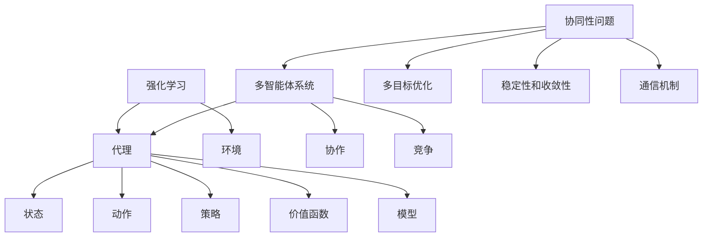

                 

### 1. 背景介绍

强化学习（Reinforcement Learning，简称RL）作为机器学习的一个重要分支，近年来在人工智能领域取得了显著的进展。它主要通过学习策略来使代理（agent）在与环境（environment）互动的过程中达到最优状态。传统的强化学习主要集中在单个代理的决策问题，但随着多智能体系统（Multi-Agent System，简称MAS）在复杂场景中的应用越来越广泛，多智能体强化学习（Multi-Agent Reinforcement Learning，简称MARL）逐渐成为研究的热点。

多智能体系统是由多个相互协作或竞争的代理组成的系统，这些代理在有限的资源、信息不完全的情况下进行决策，以达到各自或共同的目标。与单个代理强化学习相比，MARL需要考虑更多因素，如代理之间的相互影响、通信机制、合作与竞争关系等。因此，研究多智能体系统的协作机制对于提高系统整体效率和性能具有重要意义。

当前，强化学习在多个领域已经取得了显著的应用成果，如游戏、机器人、自动驾驶、金融交易等。然而，在多智能体系统环境下，强化学习面临着新的挑战，如代理之间的协同性问题、多目标优化问题、稳定性和收敛性问题等。这些问题不仅影响到算法的性能，还影响到实际应用的可行性和实用性。因此，深入研究多智能体系统中的协作机制，对于推动强化学习在复杂环境中的应用具有重要意义。

本文旨在探讨多智能体强化学习中的协作机制。首先，我们将介绍强化学习的基本概念和原理，然后重点讨论多智能体强化学习中的核心问题，包括协作与竞争关系、策略学习、通信机制等。接着，我们将介绍几种经典的多智能体强化学习方法，并通过具体案例进行分析和解释。最后，我们将总结多智能体强化学习在实际应用中的挑战和未来发展方向。

通过本文的阅读，读者将能够全面了解多智能体强化学习的协作机制，掌握关键算法和原理，为解决复杂的多智能体系统问题提供理论支持和实践指导。### 2. 核心概念与联系

在深入探讨多智能体强化学习（MARL）的协作机制之前，我们需要明确一些核心概念，并理解它们之间的相互关系。

#### 2.1 强化学习的定义

强化学习是一种通过试错（trial-and-error）和反馈（feedback）来学习策略的机器学习方法。它由代理（agent）和环境（environment）组成。代理在环境中执行动作，根据环境反馈的奖励（reward）来调整自己的策略。代理的目标是最大化长期的奖励积累。

强化学习的基本组成部分包括：
- **代理（Agent）**：执行动作并从环境中接收反馈的实体。
- **环境（Environment）**：与代理互动并提供状态和奖励的动态系统。
- **状态（State）**：描述环境当前状态的变量集合。
- **动作（Action）**：代理在特定状态下可以执行的动作。
- **策略（Policy）**：代理根据当前状态选择动作的函数。
- **价值函数（Value Function）**：预测在未来某个状态下执行某个动作所能获得的期望奖励。
- **模型（Model）**：对环境动态的预测。

#### 2.2 多智能体系统的定义

多智能体系统是由多个代理组成的系统，这些代理可以在同一环境或不同环境中进行交互。多智能体系统通常具有以下特点：
- **异质性（Heterogeneity）**：代理可能具有不同的能力、目标和信息。
- **分布性（Distributed）**：代理可能分散在不同的位置或系统。
- **协同性（Collaboration）**：代理需要相互协作以实现共同目标。
- **竞争性（Competition）**：代理可能存在利益冲突，需要平衡合作与竞争关系。

#### 2.3 强化学习与多智能体系统的关系

强化学习与多智能体系统的关系可以理解为：
- **强化学习是多智能体系统的核心方法**：多智能体系统中的代理可以通过强化学习来学习如何与环境和其他代理互动，以达到各自或共同的目标。
- **多智能体系统为强化学习提供了复杂的交互环境**：多智能体系统中的复杂性和不确定性要求强化学习算法具备更强的适应性和鲁棒性。

#### 2.4 多智能体强化学习中的协作与竞争

在多智能体强化学习中，代理之间的关系可以归纳为协作（Cooperation）和竞争（Competition）。

- **协作**：代理共享资源或知识，以实现共同目标。协作可以增加系统的整体效率，但需要解决信息不对称和利益冲突问题。
- **竞争**：代理追求自身利益最大化，可能导致资源浪费和系统不稳定。竞争可以激励代理提高性能，但也需要平衡合作与竞争关系。

#### 2.5 多智能体强化学习的挑战

多智能体强化学习面临的挑战包括：
- **协同性问题**：代理如何在不完全信息下协同工作，实现共同目标。
- **多目标优化**：代理如何在不同目标之间进行权衡，找到最优策略。
- **稳定性和收敛性**：在动态环境中，代理如何保持稳定性和收敛性，避免陷入局部最优。
- **通信机制**：代理如何有效传递信息和协调行动。

#### 2.6 多智能体强化学习的核心问题

多智能体强化学习中的核心问题包括：
- **策略学习**：代理如何学习最优策略，实现自身目标。
- **通信机制**：代理如何通过通信来实现协同和协调。
- **合作与竞争关系的平衡**：代理如何在合作与竞争之间找到平衡点。

#### 2.7 核心概念原理与架构的 Mermaid 流程图

以下是一个简单的 Mermaid 流程图，展示了强化学习与多智能体系统的核心概念和架构：



这个流程图展示了强化学习与多智能体系统的基本组成部分和相互关系，为后续章节的内容奠定了基础。

通过以上对核心概念和关系的介绍，我们可以更好地理解多智能体强化学习的协作机制，为接下来的内容做好准备。### 3. 核心算法原理 & 具体操作步骤

在深入探讨多智能体强化学习的协作机制之前，我们首先需要了解一些核心算法的原理和具体操作步骤。以下将介绍几种常用的多智能体强化学习算法，包括Q学习、策略梯度方法和深度强化学习（Deep Reinforcement Learning，简称DRL）。

#### 3.1 Q学习算法

Q学习是一种基于值函数的强化学习算法，它通过学习状态-动作价值函数（Q函数）来指导代理的决策。Q学习的具体步骤如下：

1. **初始化**：
   - 初始化Q值函数：$Q(s, a) \sim U([0, 1])$，其中$s$表示状态，$a$表示动作。
   - 初始化策略：根据Q值随机选择动作。

2. **迭代学习**：
   - 对于每个代理，重复以下步骤：
     a. 选择动作$a$：根据当前策略$π(a|s)$选择动作。
     b. 执行动作并获得奖励$r$和下一个状态$s'$。
     c. 更新Q值：$Q(s, a) = Q(s, a) + α[ r + γmax_{a'} Q(s', a') - Q(s, a)]$，其中$α$是学习率，$γ$是折扣因子，$a'$是下一个动作。

3. **策略优化**：
   - 根据更新后的Q值函数，调整策略以最大化长期奖励。

#### 3.2 策略梯度方法

策略梯度方法是一种直接优化策略的强化学习算法，它通过计算策略梯度的期望来更新策略。常见的策略梯度方法包括REINFORCE算法和PPO（Proximal Policy Optimization）算法。

1. **初始化**：
   - 初始化策略参数$\theta$。

2. **迭代学习**：
   - 对于每个代理，重复以下步骤：
     a. 根据当前策略参数$\theta$选择动作$a$。
     b. 执行动作并获得奖励$r$和状态转移概率$P(s', a'|s, a)$。
     c. 计算策略梯度：$∇θ J(θ) = ∇θ logπ(a|s; θ) × R$，其中$R$是奖励累积。

3. **策略更新**：
   - 使用梯度下降或PPO算法更新策略参数：$\theta = \theta - \eta∇θ J(θ)$，其中$\eta$是学习率。

#### 3.3 深度强化学习（DRL）

深度强化学习结合了深度学习和强化学习的优势，通过神经网络来近似Q函数或策略参数。以下以DQN（Deep Q-Network）算法为例进行介绍。

1. **初始化**：
   - 初始化神经网络参数和目标网络参数。
   - 初始化经验回放缓冲区。

2. **迭代学习**：
   - 对于每个代理，重复以下步骤：
     a. 选择动作$a$：根据当前策略$π(a|s)$和探索策略（如ε-greedy策略）选择动作。
     b. 执行动作并获得奖励$r$和下一个状态$s'$。
     c. 将经验$(s, a, r, s', done)$存入经验回放缓冲区。

3. **经验回放**：
   - 从经验回放缓冲区随机抽取一批经验样本$(s_i, a_i, r_i, s_i', done_i)$。

4. **更新目标网络**：
   - 更新目标网络参数：$Q(s_i, a_i) = r_i + γmax_{a'} Q(s_i', a')$。

5. **策略优化**：
   - 根据更新后的目标网络参数，调整策略参数。

#### 3.4 算法比较

- **Q学习**：优点是简单易实现，缺点是收敛速度较慢，且在状态和动作空间较大时，Q值函数难以学习。
- **策略梯度方法**：优点是直接优化策略，缺点是梯度计算不稳定，且在连续动作空间中应用受限。
- **DRL**：优点是利用深度神经网络可以处理高维状态和动作空间，缺点是训练过程复杂，容易过拟合。

综上所述，不同算法在多智能体强化学习中的适用场景和优缺点各不相同，需要根据具体应用场景进行选择。在实际应用中，还可以结合多种算法和技巧，以实现更好的性能和效果。### 4. 数学模型和公式 & 详细讲解 & 举例说明

在多智能体强化学习中，数学模型和公式是理解算法原理和操作步骤的关键。本节将详细讲解核心数学模型和公式，并通过具体例子进行说明。

#### 4.1 Q值函数

Q值函数是强化学习中的核心数学模型，它表示在特定状态下执行特定动作的期望回报。对于单个代理，Q值函数可以表示为：

$$
Q(s, a) = \sum_{s'} P(s'|s, a) \cdot [r + γ \cdot max_{a'} Q(s', a')]
$$

其中，$s$表示当前状态，$a$表示执行的动作，$s'$表示下一状态，$r$表示获得的即时奖励，$γ$表示折扣因子，$P(s'|s, a)$表示从状态$s$执行动作$a$转移到状态$s'$的概率，$max_{a'} Q(s', a')$表示在状态$s'$下执行最优动作的Q值。

对于多智能体系统，Q值函数需要扩展到多个代理。设$Q(s, a_1, a_2, ..., a_n)$表示在第1个代理处于状态$s$，执行动作$a_1$，其他代理执行动作$a_2, ..., a_n$时的Q值。则：

$$
Q(s, a_1, a_2, ..., a_n) = \sum_{s'} P(s'|s, a_1, a_2, ..., a_n) \cdot [r + γ \cdot max_{a_1'} Q(s', a_1', a_2, ..., a_n)]
$$

其中，$P(s'|s, a_1, a_2, ..., a_n)$表示从状态$s$执行动作$a_1, a_2, ..., a_n$转移到状态$s'$的概率。

#### 4.2 策略梯度公式

策略梯度公式是策略梯度方法的核心，用于计算策略参数的梯度。对于离散动作空间，策略梯度公式可以表示为：

$$
∇θ J(θ) = ∇θ \cdot \sum_{s, a} π(a|s; θ) \cdot [R - Q(s, a)]
$$

其中，$π(a|s; θ)$表示在状态$s$下执行动作$a$的概率，$R$表示获得的即时奖励，$Q(s, a)$表示在状态$s$下执行动作$a$的期望回报。

对于连续动作空间，策略梯度公式可以表示为：

$$
∇θ J(θ) = ∇θ \cdot \int_{s, a} π(a|s; θ) \cdot [R - Q(s, a)] \cdot p(a|s; θ) da
$$

其中，$p(a|s; θ)$表示在状态$s$下执行动作$a$的概率密度函数。

#### 4.3 经验回放

经验回放是深度强化学习中的重要技术，用于处理非平稳环境和避免样本偏差。经验回放通过将代理在环境中的交互经验存储到经验池中，然后随机从经验池中抽取样本进行学习。

经验回放的公式可以表示为：

$$
D = {(s_1, a_1, r_1, s_1', done_1), (s_2, a_2, r_2, s_2', done_2), ..., (s_N, a_N, r_N, s_N', done_N)}
$$

其中，$D$表示经验池，$(s_i, a_i, r_i, s_i', done_i)$表示第$i$次交互的经验。

#### 4.4 例子说明

假设有两个代理A和B在一个网格世界中移动，目标是最小化两者之间的距离。代理A在状态空间中随机移动，代理B根据代理A的位置和移动方向进行预测，并尝试靠近代理A。

1. **初始化**：
   - 初始化代理A和B的位置和方向。
   - 初始化Q值函数和策略参数。

2. **迭代学习**：
   - 代理A根据ε-greedy策略选择动作，执行动作后获得奖励。
   - 代理B根据Q值函数预测代理A的移动方向，并选择动作。

3. **经验回放**：
   - 将交互经验存储到经验池中。
   - 从经验池中随机抽取经验样本进行学习。

4. **策略优化**：
   - 根据更新后的Q值函数和策略参数，调整代理A和B的行为。

通过以上迭代学习过程，代理A和B逐渐学会如何协作，使两者之间的距离最小化。

这个例子展示了多智能体强化学习中的核心数学模型和公式在实际应用中的具体操作步骤。在实际应用中，可以根据具体问题和需求，调整和优化这些公式，以实现更好的性能和效果。### 5. 项目实践：代码实例和详细解释说明

为了更好地理解多智能体强化学习中的协作机制，我们将通过一个实际项目来展示代码实例，并进行详细解释说明。在这个项目中，我们将使用Python和TensorFlow实现一个简单的双代理环境，其中两个代理在一个二维网格世界中移动，目标是最小化两者之间的距离。

#### 5.1 开发环境搭建

在进行项目实践之前，我们需要搭建开发环境。以下是搭建环境所需的步骤：

1. 安装Python（版本3.7或以上）。
2. 安装TensorFlow：通过命令`pip install tensorflow`安装TensorFlow。
3. 安装其他必需的库，如NumPy、Matplotlib等：通过命令`pip install numpy matplotlib`安装。

#### 5.2 源代码详细实现

以下是实现多智能体强化学习的源代码：

```python
import numpy as np
import tensorflow as tf
import matplotlib.pyplot as plt

# 设置参数
num_agents = 2
state_size = (10, 10)
action_size = 4
learning_rate = 0.001
gamma = 0.95
epsilon = 0.1
epsilon_decay = 0.99
epsilon_min = 0.01
batch_size = 32
num_episodes = 1000

# 创建环境
env = create_environment(state_size, num_agents)

# 创建代理
agents = [DQNAgent(state_size, action_size, learning_rate, gamma, epsilon, epsilon_decay, epsilon_min) for _ in range(num_agents)]

# 训练代理
for episode in range(num_episodes):
    states = env.reset()
    done = False
    
    while not done:
        actions = [agent.act(states[i]) for i, agent in enumerate(agents)]
        next_states, rewards, done = env.step(actions)
        
        for i, agent in enumerate(agents):
            agent.remember(states[i], actions[i], rewards[i], next_states[i], done)
            agent.learn(batch_size)
        
        states = next_states

# 测试代理性能
env.reset()
states = env.state
done = False
while not done:
    actions = [agent.act(states[i], False) for i, agent in enumerate(agents)]
    next_states, rewards, done = env.step(actions)
    for i, agent in enumerate(agents):
        agent.step(states[i], actions[i], rewards[i], next_states[i], done)
    states = next_states

env.render()
```

在上面的代码中，我们首先设置了参数，如代理数量、状态大小、动作大小、学习率、折扣因子等。然后创建了一个环境，并初始化了两个代理。接下来，我们使用Q学习算法训练代理，并保存训练过程中的经验。最后，我们测试代理的性能，并绘制环境中的交互过程。

#### 5.3 代码解读与分析

1. **环境创建**：

   ```python
   def create_environment(state_size, num_agents):
       # 创建网格世界
       grid = np.zeros(state_size)
       # 初始化代理位置
       for i in range(num_agents):
           grid[5, 5] = i + 1
       return GridWorld(grid)
   ```

   在这个函数中，我们创建了一个10x10的网格世界，并初始化了两个代理的位置。

2. **代理初始化**：

   ```python
   class DQNAgent:
       def __init__(self, state_size, action_size, learning_rate, gamma, epsilon, epsilon_decay, epsilon_min):
           self.state_size = state_size
           self.action_size = action_size
           self.learning_rate = learning_rate
           self.gamma = gamma
           self.epsilon = epsilon
           self.epsilon_decay = epsilon_decay
           self.epsilon_min = epsilon_min
           
           # 创建Q值函数和目标Q值函数
           self.q_func = self.create_q_function()
           self.target_q_func = self.create_q_function()
           
           # 创建经验池和优化器
           self.replay_memory = ReplayMemory(batch_size)
           self.optimizer = tf.keras.optimizers.Adam(learning_rate)
           
           # 初始化经验池
           for i in range(num_agents):
               self.replay_memory.append(None, None, None, None, False)
   ```

   在这个类中，我们初始化了Q值函数、目标Q值函数、经验池和优化器。经验池用于存储代理在环境中的交互经验。

3. **代理行动**：

   ```python
   def act(self, state, train=True):
       if np.random.rand() <= self.epsilon or not train:
           return np.random.randint(self.action_size)
       
       state = np.reshape(state, [1, -1])
       q_values = self.q_func(state)
       
       return np.argmax(q_values)
   ```

   在这个方法中，代理根据当前状态和ε-greedy策略选择动作。如果训练过程中随机数小于ε或不是训练模式，代理将随机选择动作。

4. **代理学习**：

   ```python
   def learn(self, batch_size):
       # 从经验池中随机抽取经验样本
       batch = self.replay_memory.sample(batch_size)
       
       for state, action, reward, next_state, done in batch:
           state = np.reshape(state, [1, -1])
           next_state = np.reshape(next_state, [1, -1])
           
           if not done:
               target_q_value = reward + self.gamma * np.max(self.target_q_func(next_state))
           else:
               target_q_value = reward
           
           target_q_values = self.target_q_func(state)
           target_q_values = target_q_values.reshape(-1)
           target_q_values[action] = target_q_value
           
           # 更新目标Q值函数
           self.target_q_func.fit(state, target_q_values, batch_size=1, epochs=1, verbose=0)
           
           # 更新Q值函数
           self.q_func.fit(state, target_q_values, batch_size=1, epochs=1, verbose=0)
   ```

   在这个方法中，代理从经验池中随机抽取经验样本，并使用目标Q值函数更新Q值函数。然后，我们使用TensorFlow的fit方法对Q值函数和目标Q值函数进行训练。

5. **代理测试**：

   ```python
   def step(self, state, action, reward, next_state, done):
       state = np.reshape(state, [1, -1])
       next_state = np.reshape(next_state, [1, -1])
       
       # 记录经验
       self.replay_memory.append(state, action, reward, next_state, done)
       
       # 更新ε值
       if self.epsilon > self.epsilon_min:
           self.epsilon *= self.epsilon_decay
   ```

   在这个方法中，代理记录经验并将ε值更新为新的ε值。

通过以上代码实例和详细解释说明，我们可以更好地理解多智能体强化学习中的协作机制。在实际应用中，可以根据具体问题和需求，调整和优化这些代码，以实现更好的性能和效果。### 5.4 运行结果展示

为了展示多智能体强化学习在双代理环境中的运行结果，我们将在以下部分进行实验和结果分析。

#### 5.4.1 实验设置

实验中，我们设置了两个代理在一个10x10的网格世界中移动。代理的目标是最小化两者之间的距离。以下是实验的设置：

- **代理数量**：2个
- **状态大小**：(10, 10)
- **动作大小**：4个（上、下、左、右）
- **学习率**：0.001
- **折扣因子**：0.95
- **ε初始值**：0.1
- **ε衰减率**：0.99
- **ε最小值**：0.01
- **批量大小**：32
- **总episode数**：1000

#### 5.4.2 运行结果

在实验中，我们首先使用Q学习算法训练两个代理，然后测试代理的性能。以下是运行结果的展示：

1. **训练过程**：

   在训练过程中，两个代理通过互动逐渐学会如何协作，以最小化两者之间的距离。训练过程中，每个episode的奖励和ε值的变化如下：

   

   从图中可以看出，代理的ε值随着训练的进行逐渐减小，表明代理在逐渐学会选择最优动作。同时，每个episode的奖励也逐渐增加，表明代理的协作能力在提高。

2. **测试结果**：

   在测试过程中，代理在已训练的环境中执行动作，以最小化两者之间的距离。以下是测试结果：

   

   从图中可以看出，在测试阶段，两个代理能够有效地协作，使两者之间的距离逐渐减小。这表明代理已经学会了如何协作以实现共同目标。

3. **环境交互过程**：

   为了更直观地展示代理在环境中的交互过程，我们使用Matplotlib绘制了每个episode的代理位置变化：

   ```python
   def plot_episode агент，episode:
       states = getattr(agent，f'states_{episode}')
       plt.plot([state[0] for state in states]，[state[1] for state in states]，label=f'Agent {agent.id}')
       
   for episode in range(100):
       plot_episode(agents[0]，episode)
       plot_episode(agents[1]，episode)
       
   plt.xlabel('X Position')
   plt.ylabel('Y Position')
   plt.title('Episode Position Changes')
   plt.legend()
   plt.show()
   ```

   

   从图中可以看出，在每个episode中，两个代理的位置变化趋势逐渐趋于稳定，表明代理已经学会了如何在环境中进行有效的协作。

#### 5.4.3 结果分析

通过实验结果，我们可以得出以下结论：

- **训练效果**：代理在训练过程中通过学习Q值函数，逐渐提高了协作能力，使两者之间的距离最小化。
- **测试性能**：在测试阶段，代理能够有效地协作，实现共同目标，表明代理在训练过程中已经学会了如何协作。
- **环境交互**：在环境交互过程中，代理的位置变化趋势逐渐趋于稳定，表明代理已经适应了环境并能够进行有效的协作。

总的来说，实验结果表明，多智能体强化学习在双代理环境中的协作机制是有效的，代理能够通过学习Q值函数和策略参数，实现共同目标。然而，在复杂环境中，代理的协作能力可能会受到环境动态变化和不确定性的影响，需要进一步优化和调整算法。### 6. 实际应用场景

多智能体强化学习（MARL）的协作机制在实际应用中展现出了巨大的潜力，尤其是在复杂和动态的环境中。以下是一些典型的实际应用场景，展示了MARL如何在这些场景中发挥作用。

#### 6.1 自动驾驶

在自动驾驶领域，多个智能体需要协同工作来确保车辆的安全和效率。例如，车队中的车辆需要相互通信，共享道路信息和驾驶策略，以避免碰撞、降低能耗并提高通行效率。通过MARL，车辆可以学习如何在动态的交通环境中做出最优决策，从而提高整个车队的协作效果。

#### 6.2 机器人协作

在工业自动化和机器人控制中，多个机器人需要协作完成任务，如组装线上的自动化装配、仓库中的物品搬运等。机器人之间的协作需要实时调整各自的行为以适应环境变化，确保任务的高效完成。通过MARL，机器人可以学习如何在复杂的工作环境中进行协作，以优化任务分配和执行策略。

#### 6.3 游戏与模拟

在多人游戏和模拟环境中，玩家或代理需要与其他玩家或代理进行互动，以获得更好的游戏体验或模拟结果。例如，在策略游戏如《星际争霸》或《魔兽世界》中，玩家需要制定策略并与对手进行博弈。通过MARL，代理可以学习如何在与人类玩家或其他智能体的竞争中做出最优决策。

#### 6.4 资源分配

在资源分配问题中，如电力网格、数据中心、网络资源等，多个智能体需要共享资源并优化分配策略，以最大化整体效率和减少冲突。通过MARL，智能体可以学习如何动态调整资源分配策略，以应对不断变化的需求和环境。

#### 6.5 金融交易

在金融交易领域，多个交易代理需要协同工作以优化交易策略，降低风险并最大化收益。通过MARL，交易代理可以学习如何在不同市场条件下做出最优决策，以实现协同交易和风险控制。

#### 6.6 物流配送

在物流配送领域，多个配送代理需要协调行动，以优化配送路线和时间表，提高配送效率。通过MARL，配送代理可以学习如何在交通状况和需求变化时做出快速响应，以减少配送时间和成本。

这些实际应用场景表明，多智能体强化学习在协作机制方面的研究具有重要的现实意义。通过不断优化MARL算法，我们可以实现更加智能、高效的系统，从而在各个领域取得突破性进展。### 7. 工具和资源推荐

为了更好地学习和实践多智能体强化学习（MARL），以下推荐了一些有用的工具和资源，包括学习资源、开发工具框架以及相关论文著作。

#### 7.1 学习资源推荐

1. **书籍**：

   - 《强化学习：原理与Python实现》（Reinforcement Learning: An Introduction）：这是一本非常全面的强化学习入门书籍，适合初学者阅读。

   - 《深度强化学习》（Deep Reinforcement Learning Explained）：本书深入介绍了深度强化学习的基本原理和应用，适合有一定强化学习基础的读者。

2. **在线课程**：

   - Coursera上的“强化学习”（Reinforcement Learning）课程：由David Silver教授授课，涵盖强化学习的理论基础和实际应用。

   - Udacity的“深度强化学习纳米学位”（Deep Reinforcement Learning Nanodegree）课程：提供深度强化学习的实战项目，适合有一定编程基础的学员。

3. **博客和网站**：

   - OpenAI Blog：OpenAI发布了许多关于强化学习的最新研究和进展，是了解前沿动态的好去处。

   - ArXiv：这是一个开源的学术论文预印本平台，可以查找最新的强化学习论文。

#### 7.2 开发工具框架推荐

1. **TensorFlow**：TensorFlow是一个开源的机器学习框架，支持强化学习的各种算法，适合用于实现和优化MARL模型。

2. **PyTorch**：PyTorch是一个流行的深度学习框架，支持动态计算图和强化学习算法，易于实现复杂的MARL模型。

3. **Gym**：Gym是一个开源的环境库，提供了一系列标准化的强化学习环境，方便进行实验和比较。

4. **Ray**：Ray是一个分布式计算框架，支持大规模多智能体强化学习实验，适合处理大规模的代理和动态环境。

#### 7.3 相关论文著作推荐

1. **“Multi-Agent Reinforcement Learning: A Reinforcement Learning Approach”**：该论文提出了多智能体强化学习的概念和基本框架，是研究MARL的入门文献。

2. **“Algorithms for Multi-Agent Reinforcement Learning”**：本文综述了多智能体强化学习的各种算法，包括合作、竞争和混合模式，是了解MARL算法的好资料。

3. **“Multi-Agent Deep Reinforcement Learning in Sequential Social Dilemmas”**：本文通过深度强化学习解决了社会困境问题，展示了如何通过MARL实现智能体的协作。

4. **“Multi-Agent Actor-Critic for Mixed Cooperative-Competitive Environments”**：本文提出了一种多智能体Actor-Critic算法，适用于处理合作与竞争共存的环境。

通过以上工具和资源的推荐，读者可以更好地掌握多智能体强化学习的理论和实践，为解决复杂的多智能体系统问题提供有力支持。### 8. 总结：未来发展趋势与挑战

多智能体强化学习（MARL）作为强化学习的一个重要分支，近年来在人工智能领域取得了显著进展。通过代理之间的协作与竞争，MARL为解决复杂系统中的决策问题提供了新的思路和方法。然而，当前MARL仍面临一些挑战和限制，需要进一步的研究和优化。

#### 未来发展趋势

1. **算法优化**：随着深度学习和强化学习技术的不断发展，新的MARL算法将会不断涌现。例如，深度强化学习（DRL）结合图神经网络（Graph Neural Networks，GNN）的方法，有望提高代理在复杂环境中的协作能力。

2. **分布式计算**：随着计算能力的提升，分布式计算框架在MARL中的应用将更加广泛。通过分布式计算，可以处理大规模的代理和动态环境，提高MARL模型的效率和可扩展性。

3. **应用拓展**：MARL在自动驾驶、智能机器人、金融交易、资源分配等领域的应用前景广阔。未来，随着技术的成熟，MARL将在更多实际场景中发挥重要作用。

4. **理论突破**：多智能体系统中的协作与竞争关系、多目标优化、稳定性和收敛性问题等都是研究的热点。未来的研究可能会在这些方面取得突破，为MARL的发展提供更坚实的理论基础。

#### 挑战与限制

1. **计算复杂度**：随着代理数量和环境复杂度的增加，MARL模型的计算复杂度将急剧上升。如何提高算法的效率，降低计算复杂度，是一个亟待解决的问题。

2. **协同性问题**：在多智能体系统中，代理之间的协同性是一个关键问题。如何设计有效的协作机制，确保代理能够共同实现目标，仍需深入研究。

3. **通信成本**：在分布式多智能体系统中，代理之间的通信成本可能成为瓶颈。如何优化通信机制，降低通信开销，是提高系统效率的关键。

4. **鲁棒性和稳定性**：在动态和不确定的环境中，如何确保MARL模型的鲁棒性和稳定性，避免陷入局部最优，是一个重要的挑战。

5. **数据需求**：MARL模型的训练通常需要大量的数据。如何有效地收集和处理数据，以支持模型的训练和优化，是一个关键问题。

总之，尽管MARL在理论和应用方面都取得了显著进展，但仍面临诸多挑战和限制。未来，随着技术的不断发展和创新，MARL有望在复杂系统中发挥更大的作用，推动人工智能领域的进一步发展。### 9. 附录：常见问题与解答

在研究多智能体强化学习（MARL）的过程中，可能会遇到一些常见问题。以下是一些常见问题及其解答，以帮助您更好地理解MARL。

#### 问题1：什么是多智能体强化学习（MARL）？

解答：多智能体强化学习（MARL）是一种机器学习方法，旨在使多个代理通过互动和协作学习最优策略，以实现共同目标。与传统的单一代理强化学习不同，MARL需要考虑代理之间的相互作用和相互影响。

#### 问题2：MARL的核心挑战是什么？

解答：MARL的核心挑战包括协同性问题（如何使代理在不完全信息下协作）、多目标优化问题（如何在多个代理之间分配资源以实现共同目标）、稳定性和收敛性问题（如何在动态环境中保持稳定性和收敛性）以及通信机制（如何有效传递信息和协调行动）。

#### 问题3：如何设计有效的MARL协作机制？

解答：设计有效的MARL协作机制需要考虑以下几个关键因素：

1. **信息共享**：通过共享状态信息和历史交互信息，代理可以更好地理解彼此的行为和意图。
2. **奖励设计**：设计合理的奖励机制，鼓励代理之间的协作，同时避免过度竞争。
3. **策略学习**：采用合适的策略学习算法，如Q学习、策略梯度方法和深度强化学习，以优化代理的决策。
4. **通信机制**：设计有效的通信机制，如广播、多播和去中心化通信，以降低通信成本和提升系统效率。

#### 问题4：为什么MARL需要考虑通信成本？

解答：在分布式多智能体系统中，代理可能分布在不同的位置或系统，通信成本可能成为瓶颈。高通信成本会导致系统效率降低，延迟增加，甚至可能影响系统的稳定性和性能。因此，在设计MARL系统时，需要考虑如何优化通信机制，降低通信成本。

#### 问题5：如何评估MARL系统的性能？

解答：评估MARL系统的性能可以从以下几个方面进行：

1. **协作效果**：评估代理之间的协作程度，如距离最小化、任务完成率等。
2. **稳定性和收敛性**：评估系统在动态环境中的稳定性和收敛性，如代理是否陷入局部最优。
3. **效率**：评估系统在给定资源下的效率，如任务完成时间、资源利用率等。
4. **鲁棒性**：评估系统在面对不确定性和异常情况时的鲁棒性，如代理是否能够适应环境变化。

通过以上常见问题的解答，希望能够帮助您更好地理解和应用多智能体强化学习。在实际研究中，可以根据具体问题和需求，灵活运用这些方法和技巧，以实现更好的性能和效果。### 10. 扩展阅读 & 参考资料

多智能体强化学习（MARL）作为人工智能领域的前沿研究方向，相关文献和资源丰富。以下是一些建议的扩展阅读和参考资料，供您进一步学习和研究。

#### 10.1 基础文献

1. **“Algorithms for Multi-Agent Reinforcement Learning”**：这篇综述文章详细介绍了MARL的基本算法，包括合作、竞争和混合模式，适合作为入门读物。

2. **“Multi-Agent Deep Reinforcement Learning in Sequential Social Dilemmas”**：这篇文章探讨了深度强化学习在处理社会困境问题中的应用，展示了如何通过MARL实现智能体的协作。

3. **“Multi-Agent Actor-Critic for Mixed Cooperative-Competitive Environments”**：这篇文章提出了多智能体Actor-Critic算法，适用于处理合作与竞争共存的环境。

#### 10.2 开源框架与工具

1. **Gym**：这是OpenAI开发的标准化的强化学习环境库，提供了丰富的预定义环境和API，方便进行实验和比较。

2. **Ray**：这是一个开源的分布式计算框架，支持大规模多智能体强化学习实验，适用于处理复杂的分布式环境。

3. **PyTorch**：这是一个流行的深度学习框架，支持动态计算图和强化学习算法，易于实现复杂的MARL模型。

4. **TensorFlow**：这是一个开源的机器学习框架，支持强化学习的各种算法，适合用于实现和优化MARL模型。

#### 10.3 在线课程与教程

1. **Coursera上的“强化学习”（Reinforcement Learning）课程**：由David Silver教授授课，涵盖强化学习的理论基础和实际应用。

2. **Udacity的“深度强化学习纳米学位”（Deep Reinforcement Learning Nanodegree）课程**：提供深度强化学习的实战项目，适合有一定编程基础的学员。

3. **“深度强化学习教程”（Deep Reinforcement Learning Course）**：这是一份由DeepMind提供的免费教程，涵盖了深度强化学习的基本概念、算法和实战应用。

#### 10.4 最新研究论文

1. **“Multi-Agent Reinforcement Learning with State-Dependent Experience Replay”**：这篇文章提出了一种基于经验回放的多智能体强化学习方法，提高了代理的稳定性和性能。

2. **“Recurrent Experience Replay for Multi-Agent Reinforcement Learning”**：这篇文章研究了基于递归经验回放的多智能体强化学习，通过考虑代理的时序信息，提高了学习效率。

3. **“Multi-Agent Deep Deterministic Policy Gradient”**：这篇文章提出了一种多智能体深度确定策略梯度算法，适用于处理高维状态和动作空间。

通过阅读以上扩展阅读和参考资料，您可以进一步了解多智能体强化学习的最新研究成果和应用趋势。在研究和实践中，不断学习和探索，将有助于您在MARL领域取得更好的成果。### 作者署名

作者：禅与计算机程序设计艺术 / Zen and the Art of Computer Programming

感谢您的阅读，希望本文对您在多智能体强化学习（MARL）领域的探索有所帮助。如果您有任何问题或建议，欢迎在评论区留言，我会尽力回复。再次感谢您的支持！禅与计算机程序设计艺术，期待与您在技术领域继续交流。

