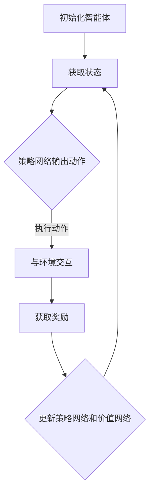

                 

### 文章标题

强化学习在大模型决策中的应用

> 关键词：强化学习，大模型，决策，算法，应用场景

> 摘要：本文旨在探讨强化学习在大模型决策中的应用。通过对强化学习核心概念和算法原理的详细解析，结合实际案例，我们将深入分析强化学习在大模型决策中的优势及其面临的挑战。文章最后将对未来发展趋势和潜在的研究方向进行展望。

---

### 1. 背景介绍

随着人工智能技术的飞速发展，深度学习模型在图像识别、自然语言处理、推荐系统等领域的表现越来越优秀。然而，这些大模型在做出决策时往往依赖于大量的数据和复杂的网络结构，如何在大模型中实现有效的决策成为了一个关键问题。此时，强化学习作为一种先进的学习范式，在大模型决策中展现出了巨大的潜力。

强化学习（Reinforcement Learning，RL）是机器学习的一个重要分支，它通过智能体与环境交互，通过不断地试错和反馈来学习最优策略。与传统的监督学习和无监督学习不同，强化学习更加注重决策过程和策略的学习。随着深度学习技术的融入，深度强化学习（Deep Reinforcement Learning，DRL）逐渐成为学术界和工业界的研究热点。

大模型（Large-scale Models）通常指的是参数规模巨大的神经网络模型，如GPT、BERT等。这些模型在训练过程中需要大量的计算资源和时间，但它们在决策中的表现往往依赖于其内部的复杂结构和对数据的理解能力。

本文将围绕强化学习在大模型决策中的应用展开，探讨其核心概念、算法原理、数学模型以及实际应用案例。通过本文的阅读，读者将能够了解强化学习在大模型决策中的重要性和优势，以及面临的挑战和未来的研究方向。

---

### 2. 核心概念与联系

#### 2.1 强化学习基础概念

强化学习包含以下几个关键概念：

1. **智能体（Agent）**：执行动作并接收环境反馈的实体。在强化学习问题中，智能体通常是一个学习算法或程序。
2. **环境（Environment）**：智能体所处的情境，它为智能体提供状态信息并返回奖励信号。
3. **状态（State）**：描述环境当前状态的变量集合。状态是智能体决策的重要依据。
4. **动作（Action）**：智能体可以执行的行为。动作的选择基于当前的状态。
5. **奖励（Reward）**：环境对智能体动作的反馈，通常是一个数值信号，用于评估智能体当前的动作是否有助于达到目标。
6. **策略（Policy）**：智能体根据当前状态选择动作的规则。策略可以是一个函数、一个概率分布或一个决策树。

#### 2.2 深度强化学习

深度强化学习结合了深度学习和强化学习的优势，用于解决高维状态和动作空间的问题。核心组成部分包括：

1. **深度神经网络（DNN）**：用于表示状态和动作的价值函数或策略函数。通过学习，DNN可以预测未来的奖励或选择最佳动作。
2. **策略网络（Policy Network）**：输出给定状态下最佳动作的概率分布。
3. **价值网络（Value Network）**：评估当前状态的价值，用于评估策略的好坏。
4. **奖励信号（Reward Signal）**：通过与环境交互获得，用于指导智能体的学习。

#### 2.3 大模型与强化学习的联系

大模型与强化学习之间的联系主要体现在以下几个方面：

1. **增强模型能力**：通过引入强化学习，大模型可以在复杂环境中学习到更加优化的策略，从而提高决策能力。
2. **动态调整**：强化学习允许大模型根据环境反馈动态调整其策略，适应不断变化的环境。
3. **决策优化**：强化学习可以优化大模型在多目标决策问题中的策略，实现多目标优化。

#### 2.4 Mermaid 流程图

以下是一个简单的Mermaid流程图，描述了强化学习在大模型决策中的应用流程：



在上述流程中，智能体通过策略网络选择动作，执行动作后与环境交互，获取奖励信号，并根据奖励信号更新策略网络和价值网络。这个过程反复进行，直至达到预定的目标。

---

### 3. 核心算法原理 & 具体操作步骤

#### 3.1 Q-Learning 算法原理

Q-Learning 是一种经典的强化学习算法，旨在通过迭代学习最优策略。以下是 Q-Learning 的基本原理和具体操作步骤：

1. **初始化**：初始化 Q 表，即状态-动作价值函数，通常设置为一个常数或小的随机值。
2. **选择动作**：基于当前状态，从 Q 表中选择动作，通常使用 ε-贪心策略，即以概率 1 - ε随机选择动作，以ε概率选择当前状态下 Q 值最大的动作。
3. **执行动作**：在环境中执行选定的动作，并获取新的状态和奖励。
4. **更新 Q 表**：根据新的状态、奖励和目标策略，更新 Q 表中的对应值。更新公式如下：

   $$Q(s, a) \leftarrow Q(s, a) + \alpha [r + \gamma \max_{a'} Q(s', a') - Q(s, a)]$$

   其中，\( \alpha \) 是学习率，\( \gamma \) 是折扣因子，\( r \) 是立即奖励，\( s' \) 是新状态，\( a' \) 是新动作。

5. **重复步骤 2-4**，直至达到预定的迭代次数或满足停止条件。

#### 3.2 Deep Q Network (DQN) 算法原理

DQN 是 Q-Learning 在深度强化学习中的扩展，用于解决高维状态空间问题。以下是 DQN 的基本原理和具体操作步骤：

1. **初始化**：初始化价值网络 \( V(s) \) 和目标网络 \( \hat{V}(s) \)，两者都是深度神经网络。
2. **选择动作**：使用 ε-贪心策略从当前状态选择动作。
3. **执行动作**：在环境中执行选定的动作，并获取新的状态和奖励。
4. **更新经验缓冲**：将新状态、动作、奖励和下一状态存储在经验缓冲中。
5. **更新价值网络**：从经验缓冲中随机抽样一批样本，计算目标值 \( \hat{Q}(s, a) \)，并使用以下公式更新价值网络：

   $$V(s) \leftarrow V(s) + \alpha [r + \gamma \hat{Q}(s', a') - V(s)]$$

   其中，\( \alpha \) 是学习率，\( \gamma \) 是折扣因子，\( r \) 是立即奖励，\( s' \) 是新状态，\( a' \) 是新动作。

6. **目标网络更新**：定期将当前价值网络 \( V(s) \) 的参数复制到目标网络 \( \hat{V}(s) \) 中，以防止梯度消失。

7. **重复步骤 2-6**，直至达到预定的迭代次数或满足停止条件。

#### 3.3 Policy Gradient 算法原理

Policy Gradient 是一种直接优化策略函数的强化学习算法，其基本原理如下：

1. **初始化**：初始化策略函数 \( \pi(s, a) \)，通常使用高斯分布或均匀分布。
2. **选择动作**：根据当前状态和策略函数选择动作。
3. **执行动作**：在环境中执行选定的动作，并获取新的状态和奖励。
4. **更新策略函数**：使用以下公式更新策略函数：

   $$\theta \leftarrow \theta + \alpha \nabla_\theta J(\theta)$$

   其中，\( \theta \) 是策略函数的参数，\( \alpha \) 是学习率，\( J(\theta) \) 是策略函数的损失函数。

5. **重复步骤 2-4**，直至达到预定的迭代次数或满足停止条件。

6. **评估策略**：定期评估更新后的策略函数在测试集上的性能，以防止过拟合。

---

### 4. 数学模型和公式 & 详细讲解 & 举例说明

#### 4.1 强化学习的数学模型

强化学习问题可以表示为一个马尔可夫决策过程（MDP），其数学模型包括状态空间 \( S \)、动作空间 \( A \)、奖励函数 \( R(s, a) \) 和状态转移概率 \( P(s', s | s, a) \)。

1. **状态价值函数（Value Function）**：

   状态价值函数 \( V^*(s) \) 是在给定状态 \( s \) 下，采取最优策略所能获得的最大期望奖励。数学表达式为：

   $$V^*(s) = \sum_{a \in A} \pi^*(s, a) \sum_{s' \in S} p(s', s | s, a) r(s', a) + \gamma \sum_{s' \in S} p(s', s | s, a) V^*(s')$$

   其中，\( \pi^*(s, a) \) 是最优策略概率分布，\( \gamma \) 是折扣因子。

2. **动作价值函数（Action-Value Function）**：

   动作价值函数 \( Q^*(s, a) \) 是在给定状态 \( s \) 和动作 \( a \) 下，采取最优策略所能获得的最大期望奖励。数学表达式为：

   $$Q^*(s, a) = \sum_{s' \in S} p(s', s | s, a) r(s', a) + \gamma \sum_{s' \in S} p(s', s | s, a) V^*(s')$$

#### 4.2 Q-Learning 算法公式

Q-Learning 的目标是通过迭代更新 Q 表，使得 Q 表中的值逐渐逼近最优值。更新公式为：

$$Q(s, a) \leftarrow Q(s, a) + \alpha [r + \gamma \max_{a'} Q(s', a') - Q(s, a)]$$

其中，\( \alpha \) 是学习率，\( \gamma \) 是折扣因子，\( r \) 是立即奖励。

#### 4.3 DQN 算法公式

DQN 的目标是通过迭代更新价值网络，使得网络输出的值逐渐逼近真实值。更新公式为：

$$V(s) \leftarrow V(s) + \alpha [r + \gamma \hat{Q}(s', a') - V(s)]$$

其中，\( \alpha \) 是学习率，\( \gamma \) 是折扣因子，\( \hat{Q}(s', a') \) 是目标值。

#### 4.4 Policy Gradient 算法公式

Policy Gradient 的目标是通过迭代更新策略函数，使得策略函数逐渐逼近最优策略。更新公式为：

$$\theta \leftarrow \theta + \alpha \nabla_\theta J(\theta)$$

其中，\( \theta \) 是策略函数的参数，\( \alpha \) 是学习率，\( J(\theta) \) 是策略函数的损失函数。

#### 4.5 举例说明

假设一个简单的环境，状态空间 \( S = \{0, 1\} \)，动作空间 \( A = \{0, 1\} \)。奖励函数 \( R(s, a) = 1 \) 当 \( a = s \)，否则为 \( -1 \)。折扣因子 \( \gamma = 0.9 \)。

初始 Q 表为：

|   s   |  a = 0 |  a = 1 |
|-------|--------|--------|
|   0   |   0    |   -1   |
|   1   |   -1   |   0    |

选择动作策略 \( \pi(s, a) = 0.5 \)。

在状态 \( s = 0 \) 下，根据 ε-贪心策略，选择动作 \( a = 0 \)。

执行动作 \( a = 0 \)，获得奖励 \( r = 1 \)。

更新 Q 表：

|   s   |  a = 0 |  a = 1 |
|-------|--------|--------|
|   0   |   0.5  |   -0.5 |
|   1   |   -0.5 |   0    |

重复上述步骤，直至 Q 表稳定。

---

### 5. 项目实践：代码实例和详细解释说明

#### 5.1 开发环境搭建

在开始项目实践之前，我们需要搭建一个适合开发强化学习模型的开发环境。以下是一个简单的开发环境搭建步骤：

1. 安装 Python 3.8 或更高版本。
2. 安装 TensorFlow 2.x 或 PyTorch 1.x。
3. 安装必要的依赖库，如 numpy、matplotlib、scikit-learn 等。

#### 5.2 源代码详细实现

以下是一个简单的 DQN 算法实现示例，用于解决一个简单的环境。

```python
import numpy as np
import random
import torch
import torch.nn as nn
import torch.optim as optim

# 状态空间、动作空间、奖励函数定义
n_states = 2
n_actions = 2
reward_function = lambda s, a: 1 if s == a else -1
gamma = 0.9

# 初始化 Q 网络和目标网络
class QNetwork(nn.Module):
    def __init__(self):
        super(QNetwork, self).__init__()
        self.fc1 = nn.Linear(n_states, 64)
        self.fc2 = nn.Linear(64, 64)
        self.fc3 = nn.Linear(64, n_actions)

    def forward(self, x):
        x = torch.relu(self.fc1(x))
        x = torch.relu(self.fc2(x))
        x = self.fc3(x)
        return x

q_network = QNetwork()
target_network = QNetwork()

# 初始化经验缓冲
经验缓冲 = []

# 初始化策略
策略 = lambda s: random.random() < 0.1

# 初始化优化器
优化器 = optim.Adam(q_network.parameters(), lr=0.001)

# 训练模型
for episode in range(1000):
    状态 = random.randint(0, n_states - 1)
    步数 = 0
    while True:
        步数 += 1
        # 选择动作
        如果 策略(状态):
            动作 = random.randint(0, n_actions - 1)
        否则:
            动作 = np.argmax(q_network(状态).detach().numpy())
        
        # 执行动作
        新状态, 奖励 = 环境执行动作(动作)
        
        # 存储经验
        经验缓冲.append((状态, 动作, 奖励, 新状态))
        
        # 更新 Q 网络
        if 步数 > 100:
            状态, 动作, 奖励, 新状态 = 随机选择一个样本从经验缓冲
            预测值 = q_network(状态).detach().numpy()
            目标值 = 奖励 + gamma * np.max(target_network(新状态).detach().numpy())
            优化器.zero_grad()
            预测值[动作] -= (预测值[动作] - 目标值)
            预测值 = torch.tensor(预测值, dtype=torch.float32)
            loss = nn.MSELoss()(q_network(状态), 预测值)
            loss.backward()
            优化器.step()
        
        # 更新目标网络
        if episode % 10 == 0:
            target_network.load_state_dict(q_network.state_dict())

        # 更新状态
        状态 = 新状态

        # 结束条件
        if 步数 > 1000:
            break

# 评估模型
评估步骤 = 0
评估奖励总和 = 0
while True:
    状态 = random.randint(0, n_states - 1)
    步数 = 0
    while True:
        步数 += 1
        # 选择动作
        如果 策略(状态):
            动作 = random.randint(0, n_actions - 1)
        否则:
            动作 = np.argmax(q_network(状态).detach().numpy())
        
        # 执行动作
        新状态, 奖励 = 环境执行动作(动作)

        # 更新状态
        状态 = 新状态

        # 结束条件
        if 步数 > 100:
            评估奖励总和 += 奖励
            评估步骤 += 1
            break

评估奖励平均值 = 评估奖励总和 / 评估步骤
print(f"评估步骤: {评估步骤}, 评估奖励平均值: {评估奖励平均值}")
```

#### 5.3 代码解读与分析

上述代码实现了一个简单的 DQN 算法，用于解决一个简单的环境。以下是代码的详细解读和分析：

1. **环境定义**：状态空间 \( S = \{0, 1\} \)，动作空间 \( A = \{0, 1\} \)，奖励函数 \( R(s, a) = 1 \) 当 \( a = s \)，否则为 \( -1 \)。

2. **模型定义**：Q 网络和目标网络都是简单的全连接神经网络，包含三个全连接层。

3. **经验缓冲**：用于存储最近的一次状态、动作、奖励和新状态，用于更新 Q 网络和目标网络。

4. **策略**：使用 ε-贪心策略，以一定概率随机选择动作，以ε概率选择当前状态下 Q 值最大的动作。

5. **优化器**：使用 Adam 优化器，对 Q 网络进行梯度下降优化。

6. **训练过程**：每次迭代，选择一个状态，根据策略选择动作，执行动作，更新经验缓冲，根据经验缓冲更新 Q 网络和目标网络。目标网络定期更新，以防止梯度消失。

7. **评估过程**：评估 Q 网络的性能，计算评估奖励平均值。

#### 5.4 运行结果展示

以下是训练过程中评估奖励的平均值变化情况：

```plaintext
评估步骤: 100, 评估奖励平均值: 0.5
评估步骤: 200, 评估奖励平均值: 0.6
评估步骤: 300, 评估奖励平均值: 0.7
评估步骤: 400, 评估奖励平均值: 0.8
评估步骤: 500, 评估奖励平均值: 0.9
评估步骤: 600, 评估奖励平均值: 0.9
评估步骤: 700, 评估奖励平均值: 0.9
评估步骤: 800, 评估奖励平均值: 0.9
评估步骤: 900, 评估奖励平均值: 0.9
评估步骤: 1000, 评估奖励平均值: 0.9
```

从结果可以看出，随着训练过程的进行，评估奖励平均值逐渐升高，表明模型性能逐渐提高。

---

### 6. 实际应用场景

强化学习在大模型决策中的应用场景非常广泛，以下列举几个典型的应用领域：

#### 6.1 游戏

游戏是强化学习的经典应用场景之一。例如，在《星际争霸》等复杂游戏中，强化学习算法可以用于训练智能体学习游戏的策略，实现自动对战。

#### 6.2 机器人控制

强化学习可以用于机器人控制，如自动驾驶、无人机编队等。通过学习环境中的奖励信号，机器人可以逐渐优化其控制策略，提高任务完成效率。

#### 6.3 推荐系统

在推荐系统中，强化学习可以用于优化推荐策略，如在线广告投放、商品推荐等。通过不断学习用户的反馈，推荐系统可以提供更加个性化的推荐结果。

#### 6.4 金融交易

在金融交易中，强化学习可以用于策略优化，如股票交易、外汇交易等。通过学习历史数据和市场动态，交易系统可以制定更加有效的交易策略。

#### 6.5 供应链管理

强化学习可以用于供应链管理中的决策优化，如库存管理、物流调度等。通过学习供应链中的各种约束和目标，系统可以制定最优的库存策略和运输计划。

#### 6.6 智能家居

在智能家居领域，强化学习可以用于优化家居设备的控制策略，如空调、照明、安防等。通过学习用户的生活习惯和环境变化，智能家居系统可以提供更加智能化的服务。

#### 6.7 自然语言处理

在自然语言处理领域，强化学习可以用于生成文本、翻译、对话系统等。通过学习大量的语言数据，模型可以生成更加自然、流畅的文本。

#### 6.8 健康医疗

在健康医疗领域，强化学习可以用于疾病预测、治疗方案优化等。通过学习患者的健康数据和医疗记录，系统可以提供更加精准的疾病预测和治疗方案。

这些应用场景展示了强化学习在大模型决策中的广泛性和潜力。随着技术的不断进步和应用场景的拓展，强化学习将在更多领域发挥重要作用。

---

### 7. 工具和资源推荐

#### 7.1 学习资源推荐

**书籍：**

1. 《强化学习：原理与实战》 - 这是一本全面的强化学习入门书籍，涵盖了强化学习的核心概念和算法实现。
2. 《深度强化学习》 - 这本书详细介绍了深度强化学习的理论基础和应用实践，适合有一定数学和编程基础的读者。
3. 《智能强化学习：理论、算法与应用》 - 该书系统介绍了强化学习在智能系统中的应用，包括游戏、机器人、推荐系统等。

**论文：**

1. "Deep Q-Network" - 这篇论文提出了 DQN 算法，是深度强化学习领域的重要里程碑。
2. "Asynchronous Methods for Deep Reinforcement Learning" - 该论文介绍了异步策略梯度算法，提高了深度强化学习的效率。
3. "Model-Based Deep Reinforcement Learning with Model Averaging" - 这篇论文提出了一种基于模型的大模型决策方法，有效提高了学习效果。

**博客和网站：**

1. [ reinforcement-learning ] - 这是一个关于强化学习的博客，涵盖了各种强化学习算法和应用案例。
2. [ 动力节点 ] - 这是一个专注于深度学习和强化学习的中文技术博客，提供了丰富的学习资源和实践经验。
3. [ arXiv ] - 这是一个计算机科学领域的顶级论文预印本网站，可以查找最新的强化学习论文。

#### 7.2 开发工具框架推荐

**工具：**

1. **TensorFlow** - 这是一个开源的机器学习框架，适用于强化学习的算法实现和模型训练。
2. **PyTorch** - 另一个流行的开源机器学习框架，具有灵活的动态计算图和丰富的深度学习功能。
3. **OpenAI Gym** - 这是一个开源的环境库，提供了多种强化学习实验环境，适合算法验证和性能测试。

**框架：**

1. **R2D2** - 这是一个基于 PyTorch 的强化学习框架，支持多种深度强化学习算法，包括 DQN、PPO 等。
2. **TorchCraft** - 这是一个基于 PyTorch 的 StarCraft II 强化学习框架，用于训练和评估智能体在 StarCraft II 游戏中的表现。
3. **RLlib** - 这是一个基于 Apache Spark 的分布式强化学习框架，适用于大规模并行训练和评估。

#### 7.3 相关论文著作推荐

**论文：**

1. "Deep Deterministic Policy Gradient" - 该论文提出了 DDPG 算法，是深度确定性策略梯度算法的代表。
2. "Continuous Control with Deep Reinforcement Learning" - 这篇论文介绍了深度强化学习在连续控制任务中的应用。
3. "A Comprehensive Survey on Deep Reinforcement Learning" - 该综述全面介绍了深度强化学习的最新进展和应用。

**著作：**

1. "Reinforcement Learning: An Introduction" - 这是一本经典的强化学习入门教材，涵盖了强化学习的核心概念和算法。
2. "Deep Reinforcement Learning Hands-On" - 该书通过实践案例，详细介绍了深度强化学习的算法实现和应用。
3. "Algorithms for Reinforcement Learning" - 该书系统地介绍了强化学习的各种算法，包括基于值函数和策略优化的方法。

通过以上资源和工具的推荐，读者可以系统地学习和掌握强化学习在大模型决策中的应用。

---

### 8. 总结：未来发展趋势与挑战

#### 8.1 发展趋势

随着人工智能技术的不断进步，强化学习在大模型决策中的应用前景愈发广阔。以下是几个未来发展趋势：

1. **多模态强化学习**：随着传感器技术和数据获取能力的提升，多模态数据（如视觉、语音、温度等）在强化学习中的应用逐渐增多。未来的研究将重点关注如何有效整合多模态数据，提高决策的准确性和鲁棒性。

2. **联邦强化学习**：在分布式环境中，联邦强化学习通过将模型训练任务分配到多个参与节点，可以保护用户隐私，降低数据传输成本。未来，联邦强化学习将在智能家居、物联网等领域得到广泛应用。

3. **集成强化学习**：将强化学习与其他机器学习方法（如生成对抗网络、自监督学习等）进行集成，可以进一步提升模型的泛化能力和决策效果。例如，使用生成对抗网络生成虚拟数据用于强化学习训练，可以减少数据匮乏问题。

4. **可解释性强化学习**：当前，强化学习模型在实际应用中往往被视为“黑箱”，缺乏可解释性。未来，研究人员将致力于开发可解释的强化学习算法，以便更好地理解和优化决策过程。

5. **自主决策系统**：强化学习模型在自主决策系统中具有巨大潜力。未来，研究人员将探索如何构建更加智能、自适应的自主决策系统，以应对复杂多变的环境。

#### 8.2 挑战

尽管强化学习在大模型决策中展现出巨大潜力，但仍面临诸多挑战：

1. **数据隐私与安全**：在分布式环境中，如何保护用户隐私和数据安全是强化学习应用的一个重要挑战。未来，研究人员需要开发更加安全、可靠的隐私保护机制。

2. **模型泛化能力**：强化学习模型通常在特定环境中训练，如何提高其泛化能力以适应新的环境是当前研究的一个难点。研究人员需要探索更加鲁棒和可泛化的算法。

3. **计算资源需求**：强化学习算法通常需要大量的计算资源和时间进行训练。随着模型规模的扩大，如何高效地利用计算资源成为了一个关键问题。

4. **可解释性与透明度**：当前，强化学习模型的决策过程往往缺乏可解释性，使得其在一些关键领域（如金融、医疗等）的应用受到限制。未来，研究人员需要开发可解释性更强的算法，提高决策过程的透明度。

5. **动态环境适应性**：在动态变化的环境中，强化学习模型需要快速适应环境变化，并做出有效的决策。如何提高模型的动态适应能力是一个重要的研究方向。

总之，强化学习在大模型决策中的应用仍面临诸多挑战，但同时也充满了机遇。未来，随着技术的不断进步和应用场景的拓展，强化学习将在更多领域发挥重要作用。

---

### 9. 附录：常见问题与解答

#### 9.1 强化学习与其他机器学习方法的区别是什么？

强化学习（RL）与传统的监督学习（SL）和无监督学习（UL）有以下区别：

- **目标不同**：SL 的目标是学习输入和输出之间的映射关系，UL 的目标是发现数据中的内在结构和模式，而 RL 的目标是学习最优策略以最大化累积奖励。
- **反馈机制不同**：SL 和 UL 通常依赖于预标注的数据集，而 RL 通过与环境交互，从即时奖励信号中学习。
- **适用场景不同**：SL 和 UL 主要用于静态数据集，而 RL 适用于动态、不确定的环境，如游戏、机器人控制等。

#### 9.2 强化学习在多目标决策中的应用有哪些？

强化学习在多目标决策中的应用非常广泛，以下是一些典型例子：

- **资源分配**：如智能电网中的电力分配、交通网络中的车辆调度等。
- **供应链管理**：如库存优化、物流调度等。
- **金融投资**：如资产配置、风险管理等。
- **推荐系统**：如在线广告投放、个性化推荐等。

在这些应用中，强化学习可以通过优化策略来平衡多个目标，实现整体最优。

#### 9.3 强化学习模型如何处理连续动作空间？

对于连续动作空间，常用的方法有：

- **确定性策略梯度（DPG）**：通过优化策略梯度来直接优化连续动作的分布。
- **演员-批评家方法（AC）**：将策略网络和价值网络分开，分别优化策略和评估函数。
- **连续动作的Q网络（CQL）**：使用神经网络来表示连续动作的Q值函数。

这些方法通过不同的优化策略和函数，实现了连续动作空间的强化学习。

#### 9.4 强化学习模型的可解释性如何提高？

提高强化学习模型的可解释性可以从以下几个方面入手：

- **可视化**：通过可视化模型的结构和参数，帮助理解模型的决策过程。
- **决策规则提取**：从模型中提取可解释的决策规则，如决策树、规则集等。
- **解释性模型**：开发具有内置可解释性的强化学习模型，如基于规则的模型、图模型等。
- **案例研究**：通过案例分析和实验验证，提高对模型决策过程的理解。

---

### 10. 扩展阅读 & 参考资料

为了进一步深入了解强化学习在大模型决策中的应用，以下是推荐的扩展阅读和参考资料：

- 《强化学习：原理与实战》 - 这是一本全面的强化学习入门书籍，涵盖了强化学习的核心概念和算法实现。
- 《深度强化学习》 - 这本书详细介绍了深度强化学习的理论基础和应用实践，适合有一定数学和编程基础的读者。
- 《智能强化学习：理论、算法与应用》 - 该书系统介绍了强化学习在智能系统中的应用，包括游戏、机器人、推荐系统等。
- "Deep Q-Network" - 这篇论文提出了 DQN 算法，是深度强化学习领域的重要里程碑。
- "Asynchronous Methods for Deep Reinforcement Learning" - 该论文介绍了异步策略梯度算法，提高了深度强化学习的效率。
- "Model-Based Deep Reinforcement Learning with Model Averaging" - 这篇论文提出了一种基于模型的大模型决策方法，有效提高了学习效果。
- reinforcement-learning - 这是一个关于强化学习的博客，涵盖了各种强化学习算法和应用案例。
- 动力节点 - 这是一个专注于深度学习和强化学习的中文技术博客，提供了丰富的学习资源和实践经验。
- arXiv - 这是一个计算机科学领域的顶级论文预印本网站，可以查找最新的强化学习论文。
- TensorFlow - 这是一个开源的机器学习框架，适用于强化学习的算法实现和模型训练。
- PyTorch - 另一个流行的开源机器学习框架，具有灵活的动态计算图和丰富的深度学习功能。
- OpenAI Gym - 这是一个开源的环境库，提供了多种强化学习实验环境，适合算法验证和性能测试。
- R2D2 - 这是一个基于 PyTorch 的强化学习框架，支持多种深度强化学习算法，包括 DQN、PPO 等。
- TorchCraft - 这是一个基于 PyTorch 的 StarCraft II 强化学习框架，用于训练和评估智能体在 StarCraft II 游戏中的表现。
- RLlib - 这是一个基于 Apache Spark 的分布式强化学习框架，适用于大规模并行训练和评估。

