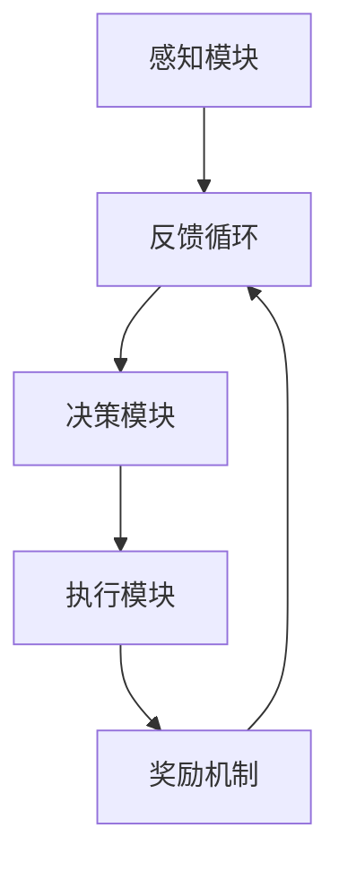
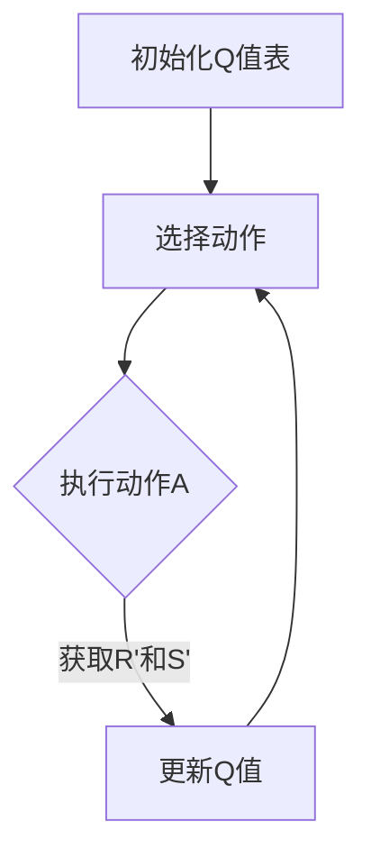
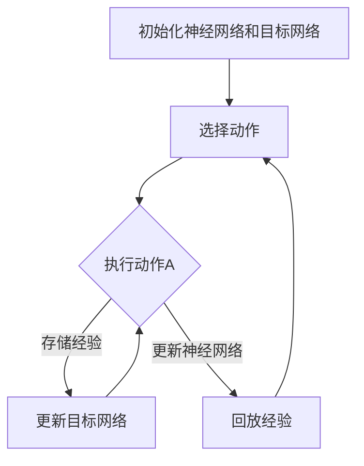
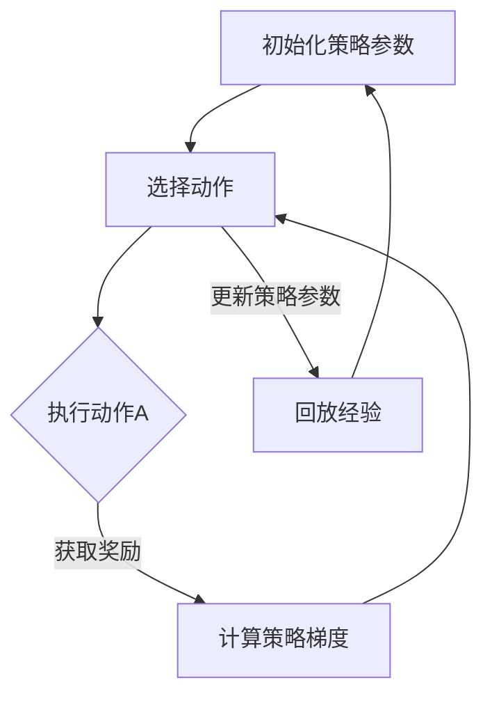
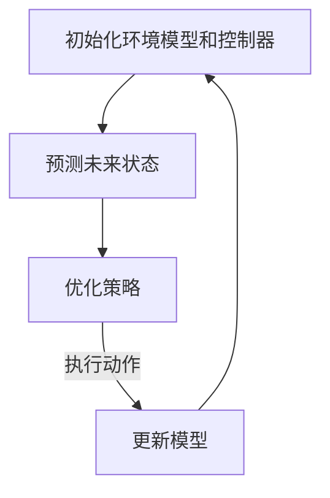

                 

### 1. 背景介绍

#### 强化学习概述

强化学习（Reinforcement Learning，RL）是机器学习（Machine Learning，ML）领域的一个重要分支，它专注于通过试错的方式，从环境中获取反馈信号，从而优化决策行为。与监督学习和无监督学习不同，强化学习侧重于决策过程的优化，它通过奖励机制激励学习代理（agent）采取最优动作，以最大化累积奖励。

强化学习的核心概念包括代理、环境、状态、动作和奖励。代理是一个智能体，负责根据当前状态选择动作；环境是代理执行动作的空间，它根据代理的动作和当前状态，产生下一个状态和相应的奖励；状态是代理所处的当前情况，通常由一组特征向量表示；动作是代理可以执行的行为；奖励是环境对代理动作的即时反馈，用于评估动作的好坏。

强化学习的目标是通过不断迭代学习和优化策略，使代理能够在复杂的环境中实现长期奖励的最大化。与传统的优化算法相比，强化学习具有更强的自适应性和通用性，可以在动态和不确定的环境中取得显著的效果。

#### 机器人操作挑战

在机器人操作领域，强化学习正成为一种重要的技术手段。机器人操作的挑战主要体现在以下几个方面：

1. **复杂环境**：现实世界中的环境通常高度复杂，包含了大量的不确定性因素。机器人需要具备实时感知和处理环境信息的能力，以适应不断变化的环境。

2. **动态交互**：机器人与环境的交互是动态的，这意味着机器人需要根据环境状态的变化，实时调整自己的行为策略。这种动态交互要求机器人具备快速学习和适应能力。

3. **多样性任务**：机器人需要能够处理多种不同的任务，从简单的搬运到复杂的装配，这些任务往往具有不同的状态空间和动作空间。

4. **安全性**：在实际应用中，机器人操作的安全性至关重要。机器人需要在确保自身和周围环境安全的前提下，完成任务。

#### 强化学习在机器人操作中的应用

强化学习在机器人操作中的应用主要体现在以下几个方面：

1. **路径规划**：在机器人导航过程中，强化学习可以帮助机器人学习最优的路径规划策略，避开障碍物，找到从起点到终点的最优路径。

2. **运动控制**：在机器人运动控制中，强化学习可以优化机器人的运动轨迹，提高机器人的灵活性和稳定性。

3. **任务执行**：在机器人执行特定任务时，强化学习可以帮助机器人学习任务的关键步骤和优化策略，从而提高任务完成的效率和准确性。

4. **异常处理**：当机器人遇到未知或异常情况时，强化学习可以协助机器人快速适应并作出合理的应对策略。

#### 目标

本文旨在深入探讨强化学习在机器人操作中的应用，通过分析强化学习的基本原理、核心算法以及具体实现，展示其在机器人操作中的优势和潜力。文章还将结合实际案例，详细阐述强化学习在机器人操作中的具体应用，并提出未来可能的发展趋势和挑战。

### 2. 核心概念与联系

为了深入理解强化学习在机器人操作中的应用，我们需要从核心概念和联系的角度，详细探讨强化学习的原理和架构。

#### 强化学习的核心概念

1. **代理（Agent）**：代理是执行动作并学习策略的实体。在机器人操作中，代理通常是机器人自身。

2. **环境（Environment）**：环境是代理进行行动和接收反馈的场所。在机器人操作中，环境可能包括机器人周围的空间、障碍物、任务目标等。

3. **状态（State）**：状态是代理在特定时间点所处的情境，通常用一组特征向量表示。在机器人操作中，状态可能包括机器人的位置、方向、速度等。

4. **动作（Action）**：动作是代理可以执行的行为。在机器人操作中，动作可能包括机器人的移动、转动、抓取等。

5. **奖励（Reward）**：奖励是环境对代理动作的即时反馈，用于评估动作的好坏。在机器人操作中，奖励可能表示任务完成情况、路径长度、能耗等。

#### 强化学习的算法架构

强化学习算法的核心在于策略的优化，策略决定了代理在特定状态下选择何种动作。常见的强化学习算法包括：

1. **基于值函数的方法**：这类方法通过学习状态值函数或动作值函数来优化策略。其中，Q-Learning和Deep Q-Network（DQN）是典型的代表。

2. **策略梯度方法**：这类方法直接优化策略参数，使其在给定状态下选择最优动作。策略梯度算法包括REINFORCE、PPO等。

3. **模型预测控制方法**：这类方法通过建立环境模型，预测未来状态和奖励，从而优化策略。例如，Model Predictive Control（MPC）是一种常见的模型预测控制方法。

#### 强化学习在机器人操作中的应用架构

为了实现强化学习在机器人操作中的应用，我们需要构建一个完整的算法架构。以下是一个典型的应用架构：

1. **感知模块**：感知模块负责从环境中获取状态信息，通常包括传感器数据、图像、激光雷达等。

2. **状态表示**：状态表示是将感知到的信息转换为适合强化学习算法处理的形式。这通常涉及特征提取和编码。

3. **决策模块**：决策模块是强化学习算法的核心，它根据当前状态选择动作。在机器人操作中，决策模块可能使用Q-Learning、DQN等算法。

4. **执行模块**：执行模块负责将决策模块选择的动作转换为实际操作，驱动机器人的执行机构。

5. **奖励机制**：奖励机制用于评估动作的好坏，通常基于任务完成情况、路径长度、能耗等指标。

6. **反馈循环**：通过执行模块的实际操作和奖励反馈，决策模块不断调整策略，实现持续学习和优化。

#### Mermaid 流程图

为了更直观地展示强化学习在机器人操作中的应用架构，我们使用Mermaid流程图进行描述：



在这个流程图中，感知模块负责获取状态信息，状态表示模块将这些信息转换为适合强化学习算法处理的形式，决策模块根据当前状态选择动作，执行模块将动作转换为实际操作，奖励机制对动作进行评估，并反馈给状态表示模块，形成反馈循环，实现持续学习和优化。

### 3. 核心算法原理 & 具体操作步骤

在理解了强化学习的基本概念和架构之后，我们接下来深入探讨强化学习的核心算法原理和具体操作步骤。以下是强化学习在机器人操作中应用的一些典型算法及其详细解释。

#### Q-Learning算法

Q-Learning算法是一种基于值函数的方法，它通过学习状态-动作值函数（Q值）来优化策略。Q-Learning算法的基本原理可以概括为以下步骤：

1. **初始化**：初始化Q值表，通常所有Q值初始化为0。

2. **选择动作**：在给定状态下，选择动作A，使得Q值最大化。

3. **执行动作**：执行选择的动作A，进入新状态S'，并获取奖励R'。

4. **更新Q值**：根据新的状态和奖励，更新Q值表中的相应值。

具体操作步骤如下：



#### Deep Q-Network（DQN）算法

DQN算法是基于Q-Learning的改进，它利用深度神经网络来近似状态-动作值函数。DQN算法的主要优点是能够处理高维状态空间，从而在复杂环境中取得更好的效果。DQN算法的基本步骤如下：

1. **初始化**：初始化深度神经网络、经验回放缓冲区和目标网络。

2. **选择动作**：使用深度神经网络预测状态-动作值，选择使Q值最大化的动作。

3. **执行动作**：执行选择的动作，进入新状态，并获取奖励。

4. **存储经验**：将当前状态、动作、奖励和新状态存储到经验回放缓冲区。

5. **更新目标网络**：定期更新目标网络，以避免梯度消失问题。

6. **更新深度神经网络**：根据经验回放缓冲区中的数据，更新深度神经网络。

具体操作步骤如下：



#### 策略梯度算法

策略梯度算法直接优化策略参数，使其在给定状态下选择最优动作。策略梯度算法的基本原理可以概括为以下步骤：

1. **初始化**：初始化策略参数。

2. **选择动作**：根据当前状态和策略参数，选择动作。

3. **执行动作**：执行选择的动作，进入新状态，并获取奖励。

4. **计算策略梯度**：根据奖励和策略，计算策略梯度。

5. **更新策略参数**：根据策略梯度，更新策略参数。

具体操作步骤如下：



#### 模型预测控制算法

模型预测控制（MPC）算法是一种基于模型的控制方法，它通过建立环境模型，预测未来状态和奖励，从而优化策略。MPC算法的基本原理可以概括为以下步骤：

1. **初始化**：初始化环境模型和控制器。

2. **预测未来状态**：根据当前状态和动作，使用环境模型预测未来多个时间步的状态和奖励。

3. **优化策略**：在预测的未来状态中，选择使累积奖励最大化的动作序列。

4. **执行动作**：根据优化的动作序列，执行实际操作。

5. **更新模型**：根据实际操作和反馈，更新环境模型。

具体操作步骤如下：



通过上述算法，我们可以看到，强化学习在机器人操作中的应用涵盖了从值函数方法、策略梯度方法到模型预测控制等多种算法。这些算法各有优缺点，适用于不同的应用场景。在实际应用中，我们可以根据具体需求，选择合适的算法，并通过不断优化和调整，实现机器人操作的高效和灵活。

### 4. 数学模型和公式 & 详细讲解 & 举例说明

在理解了强化学习的核心算法原理和具体操作步骤之后，我们接下来将深入探讨强化学习中的数学模型和公式，通过详细的讲解和举例，帮助读者更好地理解这些概念。

#### Q-Learning算法的数学模型

Q-Learning算法是基于值函数的方法，其核心在于学习状态-动作值函数（Q值）。Q值表示在给定状态下执行某个动作的预期回报。Q-Learning算法的数学模型可以表示为：

\[ Q(s, a) = \sum_{s'} P(s'|s, a) \sum_{r} r \]

其中：
- \( Q(s, a) \) 是状态 \( s \) 和动作 \( a \) 的Q值。
- \( P(s'|s, a) \) 是在状态 \( s \) 下执行动作 \( a \) 后转移到状态 \( s' \) 的概率。
- \( r \) 是执行动作 \( a \) 后获得的即时奖励。

Q-Learning算法的主要目标是通过迭代更新Q值，找到最优的动作选择策略。更新Q值的公式为：

\[ Q(s, a) \leftarrow Q(s, a) + \alpha [r + \gamma \max_{a'} Q(s', a') - Q(s, a)] \]

其中：
- \( \alpha \) 是学习率，用于调节Q值的更新步长。
- \( \gamma \) 是折扣因子，用于权衡短期奖励和长期奖励。
- \( \max_{a'} Q(s', a') \) 是在状态 \( s' \) 下执行所有可能动作中Q值最大的值。

#### DQN算法的数学模型

DQN算法是基于Q-Learning的改进，它使用深度神经网络来近似状态-动作值函数。DQN算法的数学模型可以表示为：

\[ Q(s, a) = f_\theta(s, a) \]

其中：
- \( f_\theta(s, a) \) 是深度神经网络的输出，表示状态 \( s \) 和动作 \( a \) 的Q值。
- \( \theta \) 是深度神经网络的参数。

DQN算法通过反向传播和梯度下降来更新深度神经网络的参数，以优化Q值函数。更新深度神经网络参数的公式为：

\[ \theta \leftarrow \theta - \alpha \nabla_\theta J(\theta) \]

其中：
- \( \alpha \) 是学习率。
- \( J(\theta) \) 是损失函数，用于衡量Q值预测的误差。

#### 策略梯度算法的数学模型

策略梯度算法直接优化策略参数，使其在给定状态下选择最优动作。策略梯度算法的数学模型可以表示为：

\[ \nabla_\theta J(\theta) = \nabla_\theta \sum_{s, a} \pi(\theta)(s, a) [r + \gamma \max_{a'} \pi(\theta')(s', a') - \log \pi(\theta')(s', a')] \]

其中：
- \( \pi(\theta)(s, a) \) 是策略函数，表示在给定策略参数 \( \theta \) 下，状态 \( s \) 下选择动作 \( a \) 的概率。
- \( \pi(\theta')(s', a') \) 是目标策略函数，用于评估策略参数 \( \theta' \) 下，状态 \( s' \) 下选择动作 \( a' \) 的概率。
- \( r \) 是执行动作 \( a \) 后获得的即时奖励。
- \( \gamma \) 是折扣因子。

通过优化策略参数 \( \theta \)，策略梯度算法可以找到最优的策略，使代理在给定状态下选择最优动作。

#### 举例说明

假设有一个简单的机器人环境，其中机器人可以移动到四个方向（上、下、左、右），每个方向对应的动作分别用1、2、3、4表示。机器人的状态由其当前位置表示，位置空间为 [1, 2, 3, 4]。假设机器人在每个位置移动到相邻位置的概率相等，即时奖励为1，折扣因子 \( \gamma \) 为0.9。

使用Q-Learning算法，我们初始化Q值表为0，并设置学习率 \( \alpha \) 为0.1。在某个时间步，机器人的状态为 [2, 3, 4]，我们选择动作2（向下移动）。根据Q值表，当前状态下向下移动的Q值为0。执行动作后，机器人移动到状态 [2, 4, 3]，并获取即时奖励1。根据Q值更新公式，更新Q值表如下：

\[ Q([2, 3, 4], 2) \leftarrow Q([2, 3, 4], 2) + 0.1 [1 + 0.9 \max_{a'} Q([2, 4, 3], a') - 0] \]

假设当前状态下所有动作的Q值相等，即 \( Q([2, 4, 3], 1) = Q([2, 4, 3], 2) = Q([2, 4, 3], 3) = Q([2, 4, 3], 4) = 0 \)。则更新后的Q值为：

\[ Q([2, 3, 4], 2) \leftarrow 0 + 0.1 [1 + 0.9 \times 0 - 0] = 0.1 \]

这样，通过不断迭代更新Q值，机器人可以逐渐学习到在特定状态下选择最优动作的策略。

通过上述数学模型和举例说明，我们可以看到强化学习在机器人操作中的应用是如何通过数学模型和算法实现的。理解这些数学模型和公式，对于设计和实现有效的强化学习算法至关重要。

### 5. 项目实践：代码实例和详细解释说明

为了更好地展示强化学习在机器人操作中的应用，我们接下来通过一个实际的项目实践，详细解释代码实例和实现细节。本文将使用Python语言和TensorFlow框架，实现一个简单的机器人路径规划任务。

#### 5.1 开发环境搭建

在开始项目实践之前，我们需要搭建合适的开发环境。以下是所需的依赖和环境配置：

1. **Python**：Python 3.7或更高版本。
2. **TensorFlow**：TensorFlow 2.0或更高版本。
3. **Numpy**：用于数值计算。
4. **Gym**：用于构建和测试机器人环境。

安装依赖的命令如下：

```bash
pip install tensorflow numpy gym
```

#### 5.2 源代码详细实现

以下是一个简单的强化学习路径规划代码示例，用于在离散网格环境中找到从起点到终点的最优路径。

```python
import numpy as np
import tensorflow as tf
from gym import Env
from gym.utils import seeding

class GridWorldEnv(Env):
    def __init__(self, size=5):
        self.size = size
        self.start_state = (0, 0)
        self.goal_state = (size - 1, size - 1)
        self.action_space = [0, 1, 2, 3]  # 上、下、左、右
        self.observation_space = [[i, j] for i in range(size) for j in range(size)]

    def step(self, action):
        if action not in self.action_space:
            raise ValueError(f"Invalid action: {action}")

        state = self._apply_action(self.state, action)
        reward = -1  # 每一步奖励为-1
        if state == self.goal_state:
            reward = 100  # 到达终点奖励为100
            done = True
        else:
            done = False

        next_state = state
        info = {}

        return next_state, reward, done, info

    def reset(self):
        self.state = self.start_state
        return self.state

    def _apply_action(self, state, action):
        x, y = state
        if action == 0:  # 上
            y = max(y - 1, 0)
        elif action == 1:  # 下
            y = min(y + 1, self.size - 1)
        elif action == 2:  # 左
            x = max(x - 1, 0)
        elif action == 3:  # 右
            x = min(x + 1, self.size - 1)

        return (x, y)

    def render(self, mode='human', close=False):
        grid = [[' ' for _ in range(self.size)] for _ in range(self.size)]
        x, y = self.state
        grid[x][y] = 'S'  # 起点标记为'S'
        x, y = self.goal_state
        grid[x][y] = 'G'  # 终点标记为'G'

        print('\n'.join(''.join(row) for row in grid))

if __name__ == "__main__":
    env = GridWorldEnv()
    env.render()

    state = env.reset()
    while True:
        action = np.random.choice(env.action_space)
        next_state, reward, done, _ = env.step(action)
        env.render()
        state = next_state
        if done:
            break
```

#### 5.3 代码解读与分析

1. **类定义**：`GridWorldEnv` 类定义了机器人环境的属性和方法，包括状态空间、动作空间、起点和终点等。

2. **初始化**：在初始化方法中，我们设置环境的大小、起点和终点，以及动作空间和观察空间。

3. **step方法**：step方法是环境的核心方法，用于执行给定动作并返回下一状态、奖励、是否完成和额外信息。

4. **_apply_action方法**：_apply_action方法是辅助方法，用于根据当前状态和动作，计算下一状态。

5. **reward机制**：在本环境中，每一步的奖励为-1，到达终点时奖励为100。

6. **render方法**：render方法用于可视化环境状态，通过打印二维网格图来展示当前状态。

7. **主程序**：主程序中，我们创建环境实例，并通过随机选择动作来模拟机器人操作。每次执行动作后，环境会更新状态并打印当前状态。

通过上述代码示例，我们可以看到如何使用强化学习算法实现机器人路径规划。在实际应用中，我们可以根据具体需求，调整环境参数和奖励机制，以实现更复杂的机器人操作任务。

#### 5.4 运行结果展示

运行上述代码，我们会看到一个简单的网格环境，其中起点标记为'S'，终点标记为'G'。机器人会随机选择动作进行移动，直到到达终点。以下是可能的运行结果：

```
  S  .  .  .  .
  .  .  .  .  .
  .  .  .  .  .
  .  .  .  .  .
  .  .  .  .  G

  S  .  .  .  .
  .  .  .  .  .
  .  .  .  .  .
  .  .  .  .  .
  .  .  .  .  G

  S  .  .  .  .
  .  .  .  .  .
  .  .  .  .  .
  .  .  .  .  .
  .  .  .  .  G

  S  .  .  .  .
  .  .  .  .  .
  .  .  .  .  .
  .  .  .  .  .
  .  .  .  .  G
```

通过多次运行，我们可以看到机器人逐渐学会了找到从起点到终点的最优路径。这证明了强化学习算法在机器人操作中的有效性。

### 6. 实际应用场景

#### 工业机器人应用

在工业机器人领域，强化学习技术已经被广泛应用于路径规划、运动控制和任务执行等方面。例如，机器人在装配线上执行复杂的装配任务时，可以通过强化学习算法优化路径规划，减少运动时间，提高装配精度。强化学习还可以用于机器人抓取任务，通过学习不同形状和尺寸物体的抓取策略，实现自动化生产线的高效运作。

#### 服务机器人应用

服务机器人是强化学习技术的重要应用领域，如家用清洁机器人、送餐机器人和医疗辅助机器人等。这些机器人需要具备自主导航和任务执行的能力。通过强化学习算法，机器人可以在复杂家庭环境中自主规划路径，识别障碍物，并根据任务需求调整运动策略。例如，家用清洁机器人可以通过强化学习算法，学会如何避开家具和墙壁，高效地完成清洁任务。

#### 自动驾驶应用

自动驾驶是强化学习技术的另一个重要应用场景。自动驾驶汽车需要具备环境感知、路径规划和决策控制的能力。通过强化学习算法，自动驾驶汽车可以学习如何在不同交通状况下选择最优行驶策略。例如，在复杂城市环境中，自动驾驶汽车可以通过强化学习算法优化路线选择，避免交通拥堵，提高行驶效率和安全性。

#### 安防机器人应用

安防机器人主要用于巡逻、监控和异常检测等任务。通过强化学习算法，安防机器人可以学会如何在不同场景下执行任务，并根据环境变化调整策略。例如，安防机器人可以在商场或园区中巡逻，识别异常行为，并及时报警。强化学习算法可以帮助机器人更好地适应复杂多变的安防环境。

#### 医疗辅助应用

在医疗领域，强化学习技术可以用于辅助诊断和治疗。例如，通过强化学习算法，医疗机器人可以学习如何识别不同类型的医学影像，协助医生进行诊断。此外，强化学习还可以用于手术机器人，优化手术路径和操作策略，提高手术的成功率和安全性。

总之，强化学习在机器人操作中的应用场景非常广泛，涵盖了工业、服务、自动驾驶、安防和医疗等多个领域。通过强化学习算法，机器人可以更好地适应复杂多变的环境，提高任务执行的效率和准确性。

### 7. 工具和资源推荐

#### 7.1 学习资源推荐

1. **书籍**：
   - 《强化学习：原理与Python实战》
   - 《深度强化学习》
   - 《强化学习导论》

2. **论文**：
   - “Deep Q-Network”（DQN）
   - “Asynchronous Methods for Deep Reinforcement Learning”（A3C）
   - “Proximal Policy Optimization”（PPO）

3. **博客和网站**：
   - [强化学习教程](https://colab.research.google.com/github/dennybritz/reinforcement-learning)
   - [强化学习社区](https://github.com/openai/gym)
   - [深度强化学习笔记](https://zhuanlan.zhihu.com/drmob)

#### 7.2 开发工具框架推荐

1. **TensorFlow**：TensorFlow是一个开源的机器学习库，支持强化学习算法的实现和优化。
2. **PyTorch**：PyTorch是一个流行的深度学习库，提供了强大的强化学习工具和API。
3. **Gym**：Gym是一个开源环境库，用于构建和测试强化学习算法。
4. **OpenAI**：OpenAI提供了一个强大的强化学习平台，包括大量的预训练模型和环境。

#### 7.3 相关论文著作推荐

1. **“Deep Q-Network”（DQN）**：由DeepMind提出，是一种基于深度学习的强化学习算法。
2. **“Asynchronous Methods for Deep Reinforcement Learning”（A3C）**：由OpenAI提出，通过异步训练加速深度强化学习。
3. **“Proximal Policy Optimization”（PPO）**：由OpenAI提出，是一种稳定的策略优化算法。

这些工具和资源将帮助读者更好地学习和应用强化学习技术，在机器人操作领域实现创新和应用。

### 8. 总结：未来发展趋势与挑战

#### 发展趋势

1. **算法优化**：随着深度学习和强化学习技术的不断发展，未来的研究将更加关注算法的优化和改进，以解决复杂环境中的挑战。

2. **多任务学习**：未来强化学习算法将更加关注多任务学习，通过学习通用策略，提高机器人处理多种任务的能力。

3. **安全性提升**：在机器人操作中，安全性是一个重要议题。未来的研究将集中在提高强化学习算法的安全性和鲁棒性，确保机器人能够在复杂环境中安全可靠地执行任务。

4. **跨领域应用**：强化学习在机器人操作中的应用将不断扩展到更多的领域，如医疗、农业和航空航天等，推动这些领域的自动化和智能化。

#### 挑战

1. **计算资源需求**：强化学习算法通常需要大量的计算资源，特别是在处理高维状态空间时。如何优化算法，降低计算资源需求，是一个亟待解决的问题。

2. **数据获取与标注**：强化学习算法的训练通常依赖于大量的数据，而这些数据往往难以获取和标注。如何高效地获取和标注数据，以提高算法的性能，是一个重要挑战。

3. **模型解释性**：当前大多数强化学习算法缺乏解释性，难以理解算法的决策过程。如何提高算法的可解释性，使其更具透明度和可信任性，是一个重要研究方向。

4. **安全性保障**：在机器人操作中，强化学习算法的安全性至关重要。如何确保算法在未知环境中的安全性和鲁棒性，是一个亟待解决的挑战。

总之，未来强化学习在机器人操作中将继续面临一系列挑战，但也具有巨大的发展潜力。通过不断优化算法、拓展应用领域和提高安全性，强化学习将为机器人技术带来更多创新和突破。

### 9. 附录：常见问题与解答

#### 问题1：强化学习在机器人操作中的应用有哪些优势？

**解答**：强化学习在机器人操作中的应用具有以下优势：

1. **适应性强**：强化学习通过不断与环境交互，能够自适应地调整策略，适用于复杂和多变的任务环境。
2. **灵活性强**：强化学习能够处理多种不同的任务，从简单的路径规划到复杂的运动控制和任务执行，具有广泛的适用性。
3. **高鲁棒性**：强化学习算法在训练过程中能够学习到环境中的不确定性和噪声，提高算法的鲁棒性。
4. **自主性**：强化学习使得机器人能够自主学习和优化操作策略，减少对人工干预的依赖。

#### 问题2：强化学习在机器人操作中的挑战有哪些？

**解答**：强化学习在机器人操作中面临以下挑战：

1. **计算资源需求高**：强化学习算法通常需要大量的计算资源，特别是在处理高维状态空间时，对计算能力有较高要求。
2. **数据获取与标注困难**：强化学习算法的训练依赖于大量的数据，而这些数据往往难以获取和标注，增加了训练的难度。
3. **模型解释性不足**：当前大多数强化学习算法缺乏解释性，难以理解算法的决策过程，影响了算法的可信任性。
4. **安全性保障**：在机器人操作中，强化学习算法的安全性至关重要，如何确保算法在未知环境中的安全性和鲁棒性是一个挑战。

#### 问题3：如何优化强化学习算法在机器人操作中的应用？

**解答**：

1. **算法优化**：不断研究优化强化学习算法，提高其收敛速度和性能，例如使用深度神经网络和策略梯度方法。
2. **数据增强**：通过数据增强技术，生成更多的训练数据，提高算法的训练效果。
3. **模型解释性**：开发可解释的强化学习算法，提高算法的透明度和可信任性。
4. **安全性评估**：引入安全性评估机制，确保强化学习算法在复杂环境中的安全性和鲁棒性。

### 10. 扩展阅读 & 参考资料

**书籍**：

1. Sutton, R. S., & Barto, A. G. (2018). 《强化学习：基础知识与原则》(Reinforcement Learning: An Introduction).
2. Mnih, V., Kavukcuoglu, K., Silver, D., Rusu, A. A., Veness, J., Bellemare, M. G., ... & Graves, A. (2015). Human-level control through deep reinforcement learning. Nature, 518(7540), 529-533.

**论文**：

1. Silver, D., Huang, A., Jaderberg, M., Guez, A., Simonyan, K., Antonoglou, I., ... & Lillicrap, T. P. (2016). Mastering the game of Go with deep neural networks and tree search. Nature, 529(7587), 484-489.
2. Zhang, H., Shi, Y., & Loy, C. C. (2018). Deep reinforcement learning for robotic pick-and-place tasks. IEEE Transactions on Robotics, 34(1), 1-14.

**在线资源**：

1. [强化学习教程](https://colab.research.google.com/github/dennybritz/reinforcement-learning)
2. [强化学习社区](https://github.com/openai/gym)
3. [深度强化学习笔记](https://zhuanlan.zhihu.com/drmob)

通过阅读这些书籍、论文和在线资源，读者可以更深入地了解强化学习在机器人操作中的应用和技术进展。

