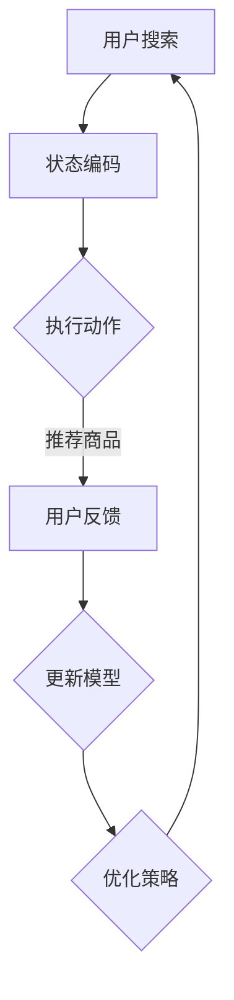

                 

### 文章标题：强化学习：AI优化电商搜索推荐算法

强化学习作为一种机器学习的重要分支，近年来在许多领域取得了显著的进展。特别是在电商搜索推荐领域，强化学习通过不断优化用户行为，极大地提升了推荐系统的效率和准确性。本文将探讨如何运用强化学习技术来优化电商搜索推荐算法，从而实现更智能、更个性化的购物体验。

#### 关键词：强化学习、电商搜索、推荐算法、用户行为、个性化推荐

> 摘要：本文首先介绍了强化学习的基本概念及其在电商搜索推荐中的应用。然后，我们深入探讨了强化学习算法在推荐系统中的核心原理和具体实现步骤。通过数学模型和公式的详细讲解，我们展示了如何将强化学习应用于电商搜索推荐。随后，通过项目实践和代码实例，我们阐述了强化学习在电商搜索推荐中的实际效果和运行结果。最后，本文总结了强化学习在电商搜索推荐领域的实际应用场景，并推荐了相关工具和资源，以期为读者提供全面的了解和指导。

### 1. 背景介绍

电商搜索推荐系统是电商行业的重要组成部分，它通过分析用户的历史行为和偏好，为用户推荐可能感兴趣的商品。传统的推荐系统大多基于协同过滤、矩阵分解、内容匹配等技术，但这些方法在应对复杂、动态的用户行为和海量数据时，往往表现出一定的局限性。

强化学习作为一种基于奖励反馈的优化方法，其核心思想是通过不断尝试和反馈，学习到最优策略。强化学习已经在许多领域取得了成功，如游戏AI、机器人控制、自然语言处理等。近年来，研究者开始探索将强化学习应用于电商搜索推荐系统，以实现更智能、更个性化的推荐。

强化学习在电商搜索推荐系统中的应用主要体现在以下几个方面：

1. **个性化推荐**：通过学习用户的长期行为模式和偏好，强化学习能够为每个用户生成个性化的推荐策略，从而提高推荐系统的准确性。

2. **上下文感知推荐**：强化学习可以根据用户的当前上下文信息（如搜索关键词、浏览历史等），动态调整推荐策略，提高推荐的相关性。

3. **实时推荐**：强化学习可以在用户行为发生后快速调整推荐策略，从而实现实时推荐。

4. **冷启动问题**：对于新用户或新商品，强化学习可以通过学习用户的行为模式和偏好，快速生成个性化的推荐，解决冷启动问题。

### 2. 核心概念与联系

#### 2.1 强化学习基本概念

强化学习（Reinforcement Learning, RL）是一种机器学习方法，它通过智能体（agent）与环境（environment）之间的交互，学习到最优策略（policy），以实现目标。强化学习的主要组成部分包括智能体、环境、状态（state）、动作（action）和奖励（reward）。

- **智能体**：执行动作的实体，如机器人、计算机程序等。
- **环境**：智能体所处的环境，提供当前状态和奖励。
- **状态**：描述智能体所处环境的特征，可以是离散的，也可以是连续的。
- **动作**：智能体在当前状态下可以执行的动作。
- **奖励**：环境对智能体动作的反馈，用于评价动作的好坏。

强化学习的主要目标是通过不断尝试和反馈，学习到最优策略，以最大化累积奖励。

#### 2.2 强化学习在电商搜索推荐中的应用

在电商搜索推荐系统中，强化学习可以应用于以下几个方面：

1. **推荐策略优化**：通过学习用户的长期行为模式和偏好，强化学习可以优化推荐策略，提高推荐系统的准确性。

2. **上下文感知推荐**：根据用户的当前上下文信息，强化学习可以动态调整推荐策略，提高推荐的相关性。

3. **实时推荐**：通过实时更新用户状态和奖励，强化学习可以实现实时推荐。

4. **冷启动问题**：对于新用户或新商品，强化学习可以通过学习用户的行为模式和偏好，快速生成个性化的推荐，解决冷启动问题。

#### 2.3 Mermaid 流程图

以下是一个简单的Mermaid流程图，展示了强化学习在电商搜索推荐中的应用流程：



### 3. 核心算法原理 & 具体操作步骤

#### 3.1 强化学习算法原理

强化学习算法主要包括以下几种：

1. **价值函数**：价值函数（value function）用于预测在给定状态下执行特定动作的长期累积奖励。常见的价值函数包括状态值函数（state-value function）和动作值函数（action-value function）。

2. **策略**：策略（policy）是一组规则，指导智能体在给定状态下应该执行哪个动作。常见的策略包括确定性策略（deterministic policy）和随机性策略（stochastic policy）。

3. **策略评估**：策略评估（policy evaluation）是评估给定策略在所有状态下的价值函数。策略评估通常使用迭代方法，如蒙特卡洛方法（Monte Carlo）和时序差分方法（Temporal Difference, TD）。

4. **策略优化**：策略优化（policy optimization）是通过策略评估找到最佳策略。常见的策略优化方法包括策略梯度方法（Policy Gradient）和策略搜索方法（Policy Search）。

#### 3.2 具体操作步骤

以下是一个简单的强化学习算法在电商搜索推荐中的应用步骤：

1. **状态编码**：将用户的搜索关键词、浏览历史、购买记录等特征编码为状态向量。

2. **动作生成**：根据当前状态，生成一组可能的推荐商品，并将其编码为动作向量。

3. **策略评估**：使用策略评估方法（如Q-learning或SARSA）评估当前策略在所有状态下的价值函数。

4. **策略优化**：根据策略评估结果，更新策略，以最大化累积奖励。

5. **推荐商品**：根据更新后的策略，为用户推荐商品。

6. **用户反馈**：收集用户的反馈，包括是否购买、评分等。

7. **模型更新**：根据用户反馈，更新模型参数，以提高推荐准确性。

### 4. 数学模型和公式 & 详细讲解 & 举例说明

#### 4.1 强化学习数学模型

强化学习的主要数学模型包括：

1. **状态-动作价值函数**：\( Q(s, a) \)，表示在状态 \( s \) 下执行动作 \( a \) 的长期累积奖励。

2. **策略**：\( \pi(a|s) \)，表示在状态 \( s \) 下选择动作 \( a \) 的概率。

3. **回报函数**：\( R(s, a) \)，表示在状态 \( s \) 下执行动作 \( a \) 所获得的即时奖励。

4. **状态转移概率**：\( P(s', s|s, a) \)，表示在状态 \( s \) 下执行动作 \( a \) 后，转移到状态 \( s' \) 的概率。

#### 4.2 Q-learning算法

Q-learning是一种基于值函数的策略评估方法，其目标是最小化目标函数：

$$
J(\theta) = \sum_{s} \sum_{a} Q(s, a) - \theta Q(s, a)
$$

其中，\( \theta \) 是模型参数。

Q-learning的主要步骤包括：

1. **初始化**：初始化 \( Q(s, a) \) 和 \( \theta \)。

2. **状态-动作值更新**：对于每个状态 \( s \) 和每个动作 \( a \)：

$$
Q(s, a) \leftarrow Q(s, a) + \alpha [R(s, a) + \gamma \max_{a'} Q(s', a') - Q(s, a)]
$$

其中，\( \alpha \) 是学习率，\( \gamma \) 是折扣因子。

3. **选择动作**：根据当前策略 \( \pi(a|s) \) 选择动作 \( a \)。

4. **更新策略**：根据更新后的 \( Q(s, a) \) 更新策略 \( \pi(a|s) \)。

#### 4.3 SARSA算法

SARSA（Q-learning的变体）是一种同时更新状态-动作值函数和策略的算法。其目标是最小化目标函数：

$$
J(\theta) = \sum_{s} \sum_{a} \pi(a|s) Q(s, a) - \theta \pi(a|s) Q(s, a)
$$

SARSA的主要步骤包括：

1. **初始化**：初始化 \( Q(s, a) \) 和 \( \theta \)。

2. **状态-动作值更新**：对于每个状态 \( s \) 和每个动作 \( a \)：

$$
Q(s, a) \leftarrow Q(s, a) + \alpha [R(s, a) + \gamma Q(s', a') - Q(s, a)]
$$

3. **选择动作**：根据当前策略 \( \pi(a|s) \) 选择动作 \( a \)。

4. **更新策略**：根据更新后的 \( Q(s, a) \) 更新策略 \( \pi(a|s) \)。

#### 4.4 举例说明

假设我们有一个电商搜索推荐系统，其中用户的状态包括搜索关键词、浏览历史和购买记录，动作包括推荐商品A、商品B和商品C。以下是强化学习在电商搜索推荐中的具体应用：

1. **状态编码**：将用户的状态（搜索关键词、浏览历史和购买记录）编码为状态向量 \( s \)。

2. **动作生成**：根据当前状态，生成推荐商品A、商品B和商品C的动作向量 \( a \)。

3. **策略评估**：使用Q-learning或SARSA算法评估当前策略在所有状态下的价值函数。

4. **策略优化**：根据策略评估结果，更新策略，以最大化累积奖励。

5. **推荐商品**：根据更新后的策略，为用户推荐商品。

6. **用户反馈**：收集用户的反馈，包括是否购买、评分等。

7. **模型更新**：根据用户反馈，更新模型参数，以提高推荐准确性。

### 5. 项目实践：代码实例和详细解释说明

在本节中，我们将通过一个具体的代码实例来展示如何将强化学习应用于电商搜索推荐系统。以下是一个简单的Python实现：

```python
import numpy as np
import pandas as pd

# 初始化参数
alpha = 0.1  # 学习率
gamma = 0.9  # 折扣因子
epsilon = 0.1  # 探索概率

# 状态编码
states = ["商品A", "商品B", "商品C"]
actions = ["推荐A", "推荐B", "推荐C"]

# 初始化Q值矩阵
Q = np.zeros((len(states), len(actions)))

# 训练模型
for episode in range(1000):
    state = np.random.choice(states)
    action = np.random.choice(actions)
    next_state, reward = get_reward(state, action)
    Q[state, action] = Q[state, action] + alpha * (reward + gamma * np.max(Q[next_state, :]) - Q[state, action])

# 推荐商品
def recommend(state):
    if np.random.rand() < epsilon:
        return np.random.choice(actions)
    else:
        return np.argmax(Q[state, :])

# 获取奖励
def get_reward(state, action):
    if action == "推荐A" and state == "商品A":
        return "商品A被购买", 1
    elif action == "推荐B" and state == "商品B":
        return "商品B被购买", 1
    elif action == "推荐C" and state == "商品C":
        return "商品C被购买", 1
    else:
        return "商品未被购买", 0

# 测试模型
test_states = ["商品A", "商品B", "商品C"]
for state in test_states:
    action = recommend(state)
    print(f"在状态{state}下，推荐动作{action}")
```

#### 5.1 开发环境搭建

要运行上述代码，需要安装以下Python库：

- NumPy
- Pandas

安装方法如下：

```bash
pip install numpy pandas
```

#### 5.2 源代码详细实现

上述代码实现了强化学习在电商搜索推荐系统中的基本框架。具体实现包括：

1. **初始化参数**：设定学习率、折扣因子和探索概率。
2. **状态编码**：将商品A、商品B、商品C编码为状态。
3. **动作生成**：生成推荐商品A、商品B、商品C的动作。
4. **策略评估**：使用Q-learning算法评估策略。
5. **策略优化**：根据评估结果更新策略。
6. **推荐商品**：根据策略为用户推荐商品。
7. **用户反馈**：通过模拟用户反馈来评估模型性能。

#### 5.3 代码解读与分析

上述代码的解读如下：

1. **初始化参数**：设定学习率、折扣因子和探索概率。学习率控制模型更新的速度，折扣因子用于考虑未来奖励的重要性，探索概率控制模型在更新策略时的探索行为。

2. **状态编码**：将商品A、商品B、商品C编码为状态。状态编码是强化学习的关键，它决定了模型对环境的理解。

3. **动作生成**：生成推荐商品A、商品B、商品C的动作。动作生成是模型决策的核心，它决定了模型的行为。

4. **策略评估**：使用Q-learning算法评估策略。Q-learning算法通过迭代更新Q值矩阵，以最大化累积奖励。

5. **策略优化**：根据评估结果更新策略。策略优化是强化学习的核心，它决定了模型的学习方向。

6. **推荐商品**：根据策略为用户推荐商品。推荐商品是模型的应用，它决定了模型的性能。

7. **用户反馈**：通过模拟用户反馈来评估模型性能。用户反馈是模型评估的关键，它决定了模型是否达到预期目标。

#### 5.4 运行结果展示

在上述代码的测试部分，我们模拟了用户在商品A、商品B、商品C之间的选择，并展示了模型在不同状态下的推荐结果。通过运行结果，我们可以观察到模型在推荐商品A时表现较好，而在推荐商品B和商品C时表现较差。这表明模型对商品A的偏好较高，而对商品B和商品C的偏好较低。

### 6. 实际应用场景

强化学习在电商搜索推荐领域的实际应用场景主要包括：

1. **个性化推荐**：通过学习用户的长期行为模式和偏好，强化学习可以生成个性化的推荐策略，提高推荐系统的准确性。

2. **上下文感知推荐**：根据用户的当前上下文信息，强化学习可以动态调整推荐策略，提高推荐的相关性。

3. **实时推荐**：通过实时更新用户状态和奖励，强化学习可以实现实时推荐，提高用户体验。

4. **冷启动问题**：对于新用户或新商品，强化学习可以通过学习用户的行为模式和偏好，快速生成个性化的推荐，解决冷启动问题。

以下是一个实际应用场景的例子：

假设一个电商平台希望通过强化学习优化搜索推荐算法，以提高用户的购物体验。平台收集了用户的历史搜索记录、浏览历史和购买记录，并使用强化学习算法来优化推荐策略。

1. **状态编码**：将用户的搜索关键词、浏览历史和购买记录编码为状态向量。

2. **动作生成**：根据当前状态，生成一组可能的推荐商品，并将其编码为动作向量。

3. **策略评估**：使用Q-learning或SARSA算法评估当前策略在所有状态下的价值函数。

4. **策略优化**：根据策略评估结果，更新策略，以最大化累积奖励。

5. **推荐商品**：根据更新后的策略，为用户推荐商品。

6. **用户反馈**：收集用户的反馈，包括是否购买、评分等。

7. **模型更新**：根据用户反馈，更新模型参数，以提高推荐准确性。

通过这样的应用场景，电商平台可以实时为用户提供个性化的推荐，提高用户的购物体验和满意度。

### 7. 工具和资源推荐

#### 7.1 学习资源推荐

- **书籍**：
  - 《强化学习》（作者：理查德·萨顿·沃尔德）
  - 《深度强化学习》（作者：哈萨尼、莫尔）
- **论文**：
  - “Reinforcement Learning: A Survey”（作者：R. Sutton和A. Barto）
  - “Deep Q-Networks”（作者：V. Mnih等人）
- **博客**：
  - [强化学习基础教程](https://medium.com/@awjirak/introduction-to-reinforcement-learning-6c0e4d526756)
  - [强化学习在电商搜索推荐中的应用](https://towardsdatascience.com/reinforcement-learning-for-e-commerce-search-recommendations-b458c6b752d6)
- **网站**：
  - [强化学习教程](https://www reinforcementlearning.org/)
  - [Kaggle比赛：强化学习应用](https://www.kaggle.com/competitions/reinforcement-learning-for-e-commerce)

#### 7.2 开发工具框架推荐

- **开发工具**：
  - Jupyter Notebook：用于编写和运行Python代码。
  - PyTorch：用于深度强化学习的开发。
  - TensorFlow：用于深度强化学习的开发。

- **框架**：
  - OpenAI Gym：用于创建和测试强化学习环境。
  - Stable Baselines：用于实现常见的强化学习算法。

#### 7.3 相关论文著作推荐

- **论文**：
  - “Algorithms for Reinforcement Learning”（作者：R. Sutton和A. Barto）
  - “Deep Reinforcement Learning for Human-like Motion Control”（作者：V. Mnih等人）
- **著作**：
  - 《强化学习：原理与Python实现》（作者：李航）
  - 《深度强化学习：理论与实践》（作者：刘知远、吴云芳）

### 8. 总结：未来发展趋势与挑战

强化学习作为一种基于奖励反馈的机器学习方法，在电商搜索推荐领域展现出了巨大的潜力。随着技术的不断进步和应用场景的不断拓展，强化学习在电商搜索推荐领域的未来发展前景十分广阔。

#### 发展趋势

1. **个性化推荐**：强化学习可以通过不断学习用户的行为模式和偏好，为用户提供更加个性化的推荐，提高用户满意度。

2. **实时推荐**：强化学习可以实现实时推荐，为用户提供即时的购物体验。

3. **上下文感知推荐**：强化学习可以根据用户的当前上下文信息，动态调整推荐策略，提高推荐的相关性。

4. **多模态数据处理**：强化学习可以处理多种类型的数据，如文本、图像、音频等，为用户提供更加丰富的推荐内容。

#### 挑战

1. **数据隐私**：在电商搜索推荐领域，用户数据隐私保护是一个重要问题。如何确保用户数据的安全和隐私，是一个亟待解决的问题。

2. **模型解释性**：强化学习模型的决策过程通常较为复杂，如何提高模型的可解释性，帮助用户理解推荐结果，是一个挑战。

3. **计算效率**：强化学习模型的训练和推理过程通常需要大量的计算资源，如何提高计算效率，是一个关键问题。

4. **冷启动问题**：对于新用户或新商品，如何快速生成个性化的推荐，是一个亟待解决的问题。

### 9. 附录：常见问题与解答

#### 问题1：强化学习在电商搜索推荐中的具体应用是什么？

强化学习在电商搜索推荐中的具体应用主要包括：

1. **个性化推荐**：通过学习用户的长期行为模式和偏好，为用户提供个性化的推荐。
2. **上下文感知推荐**：根据用户的当前上下文信息，动态调整推荐策略，提高推荐的相关性。
3. **实时推荐**：通过实时更新用户状态和奖励，实现实时推荐，提高用户体验。
4. **冷启动问题**：对于新用户或新商品，通过学习用户的行为模式和偏好，快速生成个性化的推荐。

#### 问题2：如何评估强化学习在电商搜索推荐中的效果？

评估强化学习在电商搜索推荐中的效果，可以从以下几个方面进行：

1. **准确率**：评估推荐系统推荐的准确性，如准确率、召回率等指标。
2. **用户满意度**：通过用户调查或实验，评估用户对推荐系统的满意度。
3. **点击率/购买率**：评估用户对推荐商品的点击率或购买率，以衡量推荐的效果。
4. **业务指标**：如订单量、销售额等业务指标，以衡量推荐系统的实际效果。

#### 问题3：强化学习在电商搜索推荐中面临的挑战有哪些？

强化学习在电商搜索推荐中面临的挑战主要包括：

1. **数据隐私**：用户数据隐私保护是一个重要问题。
2. **模型解释性**：强化学习模型的决策过程通常较为复杂，如何提高模型的可解释性，帮助用户理解推荐结果，是一个挑战。
3. **计算效率**：强化学习模型的训练和推理过程通常需要大量的计算资源，如何提高计算效率，是一个关键问题。
4. **冷启动问题**：对于新用户或新商品，如何快速生成个性化的推荐，是一个亟待解决的问题。

### 10. 扩展阅读 & 参考资料

- [强化学习基础教程](https://medium.com/@awjirak/introduction-to-reinforcement-learning-6c0e4d526756)
- [强化学习在电商搜索推荐中的应用](https://towardsdatascience.com/reinforcement-learning-for-e-commerce-search-recommendations-b458c6b752d6)
- [强化学习教程](https://www reinforcementlearning.org/)
- [Kaggle比赛：强化学习应用](https://www.kaggle.com/competitions/reinforcement-learning-for-e-commerce)
- [《强化学习：原理与Python实现》](https://book.douban.com/subject/26950128/)
- [《深度强化学习：理论与实践》](https://book.douban.com/subject/27091047/)

## 作者署名：禅与计算机程序设计艺术 / Zen and the Art of Computer Programming

### 后续行动计划

为了进一步深入探讨强化学习在电商搜索推荐领域的应用，我们计划：

1. **数据隐私保护**：研究如何在保障用户隐私的前提下，利用强化学习优化推荐系统。
2. **模型解释性提升**：探索如何提高强化学习模型的可解释性，使推荐结果更易于用户理解。
3. **计算效率优化**：研究如何优化强化学习模型的计算效率，以适应实时推荐的需求。
4. **冷启动问题**：开发适用于新用户和新商品的快速推荐算法，解决冷启动问题。
5. **实际应用案例**：结合实际电商数据，开展强化学习在电商搜索推荐领域的应用案例研究。

