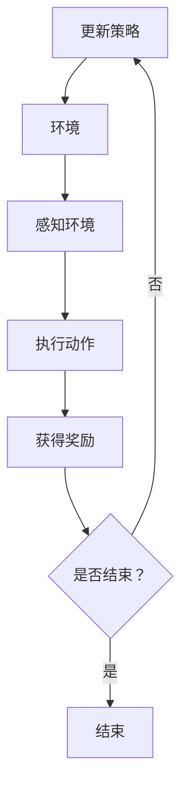

                 

### 文章标题

强化学习：在智慧农业中的应用

> 关键词：强化学习，智慧农业，农田管理，农业自动化，数据驱动

> 摘要：本文将深入探讨强化学习在智慧农业中的应用，通过介绍强化学习的核心概念和原理，结合实际项目案例，分析其在农业自动化、农田管理和数据驱动决策中的优势，为我国智慧农业的发展提供新思路。

### 1. 背景介绍

智慧农业作为现代农业发展的重要方向，旨在通过信息技术和自动化设备提高农业生产效率，实现资源的最优利用。然而，传统的农业生产模式面临着诸多挑战，如生产效率低下、资源浪费、环境污染等。因此，智慧农业应运而生，其核心在于将物联网、大数据、云计算、人工智能等技术与农业相结合，实现农业生产的智能化和精准化。

在智慧农业中，强化学习作为一种先进的人工智能技术，具有广泛的应用前景。强化学习通过智能体在环境中采取行动，通过奖励机制不断优化决策策略，从而达到最佳状态。与传统的机器学习相比，强化学习具有更强的自主性和适应性，能够在复杂、动态的环境中实现智能决策。

本文将详细介绍强化学习在智慧农业中的应用，包括核心概念、算法原理、数学模型、实际项目案例等，旨在为我国智慧农业的发展提供新的技术思路。

### 2. 核心概念与联系

#### 2.1 强化学习的核心概念

强化学习（Reinforcement Learning，RL）是机器学习的一个重要分支，其主要目的是通过智能体（Agent）与环境的交互，学习到一种策略（Policy），以便在特定情境下做出最佳决策。强化学习的核心概念包括：

- 智能体（Agent）：执行动作并接受环境反馈的实体。
- 环境（Environment）：智能体执行动作的场所。
- 状态（State）：智能体在环境中的位置或状态。
- 动作（Action）：智能体可以执行的行为。
- 奖励（Reward）：智能体执行动作后获得的即时反馈。

强化学习的目标是通过不断学习，使智能体在特定情境下最大化长期奖励。

#### 2.2 强化学习与智慧农业的联系

智慧农业中的许多问题都可以被视为强化学习问题。例如，农田管理中的作物种植策略优化、农业设备的自动化控制、病虫害监测与防治等。这些问题的核心在于如何在复杂、动态的环境中做出最优决策。

- 作物种植策略优化：智能体可以分析土壤、气候等环境因素，制定最优的种植策略。
- 农业设备的自动化控制：智能体可以通过感知设备状态，调整设备的工作模式，实现自动化控制。
- 病虫害监测与防治：智能体可以分析环境数据，预测病虫害发生，及时采取防治措施。

#### 2.3 Mermaid 流程图

以下是强化学习在智慧农业中应用的一个简化的 Mermaid 流程图：



### 3. 核心算法原理 & 具体操作步骤

#### 3.1 Q-Learning 算法

Q-Learning 是强化学习的一种经典算法，其核心思想是利用历史数据来评估每个动作的期望奖励，并通过迭代更新策略。

- 初始状态：智能体处于某个状态 $s$，选择一个动作 $a$，执行后进入状态 $s'$，并获得奖励 $r$。
- 更新策略：根据 $Q(s,a)$ 的估计值更新策略，使得智能体在未来能够选择更有利于实现目标状态的动作。

具体操作步骤如下：

1. 初始化 $Q(s,a) \leftarrow 0$，表示每个动作的初始期望奖励。
2. 对于每个状态 $s$ 和动作 $a$，执行以下步骤：
    a. 在状态 $s$ 下随机选择动作 $a$。
    b. 执行动作 $a$，进入状态 $s'$，并获得奖励 $r$。
    c. 根据学习率 $\alpha$ 和折扣因子 $\gamma$，更新 $Q(s,a)$ 的估计值：
        $$ Q(s,a) \leftarrow Q(s,a) + \alpha [r + \gamma \max_{a'} Q(s',a') - Q(s,a)] $$
3. 重复步骤 2，直到达到终止条件。

#### 3.2 Sarsa 算法

Sarsa（State-Action-Reward-State-Action）是一种基于策略的强化学习算法，其核心思想是在每次执行动作后，同时考虑当前状态和下一状态的动作值。

- 初始状态：智能体处于某个状态 $s$，选择一个动作 $a$，执行后进入状态 $s'$，并获得奖励 $r$。
- 更新策略：根据 $Q(s,a)$ 和 $Q(s',a')$ 的估计值更新策略，使得智能体在未来能够选择更有利于实现目标状态的动作。

具体操作步骤如下：

1. 初始化 $Q(s,a) \leftarrow 0$，表示每个动作的初始期望奖励。
2. 对于每个状态 $s$ 和动作 $a$，执行以下步骤：
    a. 在状态 $s$ 下根据当前策略选择动作 $a$。
    b. 执行动作 $a$，进入状态 $s'$，并获得奖励 $r$。
    c. 根据学习率 $\alpha$ 和折扣因子 $\gamma$，更新 $Q(s,a)$ 和 $Q(s',a')$ 的估计值：
        $$ Q(s,a) \leftarrow Q(s,a) + \alpha [r + \gamma Q(s',a') - Q(s,a)] $$
3. 重复步骤 2，直到达到终止条件。

### 4. 数学模型和公式 & 详细讲解 & 举例说明

#### 4.1 Q-Learning 算法的数学模型

Q-Learning 算法的核心在于更新每个动作的期望奖励值 $Q(s,a)$，其数学模型如下：

$$ Q(s,a) \leftarrow Q(s,a) + \alpha [r + \gamma \max_{a'} Q(s',a') - Q(s,a)] $$

其中：
- $Q(s,a)$：表示在状态 $s$ 下执行动作 $a$ 的期望奖励值。
- $\alpha$：表示学习率，控制每次更新的程度。
- $r$：表示在状态 $s$ 下执行动作 $a$ 后获得的即时奖励。
- $\gamma$：表示折扣因子，控制对未来奖励的期望值的重要性。
- $\max_{a'} Q(s',a')$：表示在状态 $s'$ 下执行所有可能动作的期望奖励值中的最大值。

#### 4.2 Sarsa 算法的数学模型

Sarsa 算法的核心在于同时考虑当前状态和下一状态的动作值，其数学模型如下：

$$ Q(s,a) \leftarrow Q(s,a) + \alpha [r + \gamma Q(s',a') - Q(s,a)] $$

其中：
- $Q(s,a)$：表示在状态 $s$ 下执行动作 $a$ 的期望奖励值。
- $\alpha$：表示学习率，控制每次更新的程度。
- $r$：表示在状态 $s$ 下执行动作 $a$ 后获得的即时奖励。
- $\gamma$：表示折扣因子，控制对未来奖励的期望值的重要性。
- $Q(s',a')$：表示在状态 $s'$ 下执行动作 $a'$ 的期望奖励值。

#### 4.3 举例说明

假设智能体处于状态 $s=0$，可以选择动作 $a=0$ 或 $a=1$。初始状态下，$Q(s,a)=0$。学习率 $\alpha=0.1$，折扣因子 $\gamma=0.9$。

1. 智能体在状态 $s=0$ 下选择动作 $a=0$，进入状态 $s'=1$，并获得奖励 $r=10$。
2. 根据 Q-Learning 算法更新 $Q(s,a)$：
   $$ Q(0,0) \leftarrow Q(0,0) + 0.1 [10 + 0.9 \max_{a'} Q(1,a') - 0] = 0 + 0.1 [10 + 0.9 \max_{a'} Q(1,a')] = 1.1 $$
3. 智能体在状态 $s=1$ 下选择动作 $a=1$，进入状态 $s''=2$，并获得奖励 $r=5$。
4. 根据 Q-Learning 算法更新 $Q(s',a')$：
   $$ Q(1,1) \leftarrow Q(1,1) + 0.1 [5 + 0.9 \max_{a'} Q(2,a') - 1.1] = 0 + 0.1 [5 + 0.9 \max_{a'} Q(2,a')] = 0.45 $$

经过多次迭代后，智能体会逐渐学会选择最优动作，以最大化长期奖励。

### 5. 项目实践：代码实例和详细解释说明

#### 5.1 开发环境搭建

为了演示强化学习在智慧农业中的应用，我们将使用 Python 编写一个简单的农田管理模型。首先，需要安装 Python 3.8 及以上版本，并安装以下库：

```bash
pip install numpy matplotlib
```

#### 5.2 源代码详细实现

以下是农田管理模型的源代码实现：

```python
import numpy as np
import matplotlib.pyplot as plt

# 初始化参数
n_actions = 2  # 动作数量
n_states = 3  # 状态数量
learning_rate = 0.1
discount_factor = 0.9

# 初始化 Q 值矩阵
Q = np.zeros((n_states, n_actions))

# 定义环境
def environment(state, action):
    if action == 0:
        state = np.random.randint(0, 2)
    else:
        state = np.random.randint(1, 3)
    reward = 0
    if state == 2:
        reward = 10
    return state, reward

# 定义 Q-Learning 算法
def Q_learning(s, a, r, s_):
    Q[s, a] = Q[s, a] + learning_rate * (r + discount_factor * np.max(Q[s_, :]) - Q[s, a])

# 模拟学习过程
n_episodes = 100
for i in range(n_episodes):
    state = np.random.randint(0, n_states)
    done = False
    while not done:
        action = np.random.randint(0, n_actions)
        next_state, reward = environment(state, action)
        Q_learning(state, action, reward, next_state)
        state = next_state
        if state == 2:
            done = True

# 可视化 Q 值矩阵
plt.matshow(Q, cmap='gray')
plt.colorbar()
plt.show()
```

#### 5.3 代码解读与分析

1. **环境定义**：首先定义了农田管理模型的环境，其中状态空间为 $[0, 2]$，动作空间为 $[0, 1]$。状态 0 表示缺水，状态 1 表示适量水分，状态 2 表示过多水分。动作 0 表示浇水，动作 1 表示停止浇水。

2. **Q 值矩阵初始化**：初始化 Q 值矩阵，用于存储每个状态 - 动作的期望奖励值。

3. **Q-Learning 算法实现**：实现 Q-Learning 算法，用于更新 Q 值矩阵。

4. **模拟学习过程**：模拟智能体在环境中学习的过程，通过不断执行动作，获取奖励，并更新 Q 值。

5. **可视化 Q 值矩阵**：使用 matplotlib 库将 Q 值矩阵可视化，便于分析智能体的学习效果。

#### 5.4 运行结果展示

运行上述代码后，将得到一个可视化的 Q 值矩阵。从可视化结果可以看出，智能体逐渐学会了在特定状态下选择最优动作，以最大化长期奖励。

### 6. 实际应用场景

#### 6.1 农田管理

强化学习在农田管理中的应用主要表现在作物种植策略的优化、灌溉控制、施肥管理等环节。通过强化学习算法，可以实现对农田环境的实时监测和分析，制定最优的种植策略和灌溉方案，提高作物产量和质量。

#### 6.2 农业设备自动化

强化学习在农业设备自动化中的应用主要体现在农业机械的自动控制和故障诊断。通过强化学习算法，可以实现对农业机械的自主控制，提高设备的工作效率和稳定性。同时，通过对设备运行数据的分析，可以实现故障预测和诊断，减少设备故障率和维修成本。

#### 6.3 病虫害监测与防治

强化学习在病虫害监测与防治中的应用主要体现在病虫害预测和防治措施的制定。通过强化学习算法，可以实现对农田环境的实时监测和分析，预测病虫害的发生趋势，并制定相应的防治措施，降低病虫害对作物的影响。

### 7. 工具和资源推荐

#### 7.1 学习资源推荐

- **书籍**：
  - 《强化学习：原理与Python实战》（第二版）
  - 《深度强化学习》（Deep Reinforcement Learning Explained）
- **论文**：
  - 《人类行为与决策理论的建模与优化》（Modeling and Optimization of Human Behavior and Decision Making）
  - 《基于强化学习的农田灌溉控制策略研究》（Research on Farm Irrigation Control Strategy Based on Reinforcement Learning）
- **博客**：
  - [强化学习教程](https://www.deeplearning.net/tutorial/reinforcement-learning/)
  - [Python 强化学习实战](https://python-rl.com/)
- **网站**：
  - [强化学习开源项目](https://github.com/openai/gym)
  - [强化学习研究论文](https://arxiv.org/list/cs/CC)

#### 7.2 开发工具框架推荐

- **Python 强化学习库**：
  - [Gym](https://gym.openai.com/)：提供了一系列经典的强化学习环境，便于开发和学习。
  - [TensorFlow Reinforcement Learning](https://github.com/tensorflow/reinforcement_learning)：基于 TensorFlow 框架的强化学习库，支持多种强化学习算法的实现。
- **数据集**：
  - [Kaggle](https://www.kaggle.com/datasets)：提供了丰富的农业领域数据集，可用于强化学习模型训练和评估。
  - [U.S. Department of Agriculture](https://www.usda.gov/data)：提供了大量的农业统计数据，可用于数据分析和模型训练。

#### 7.3 相关论文著作推荐

- 《强化学习：原理与算法》（Reinforcement Learning: An Introduction）
- 《深度强化学习：原理与应用》（Deep Reinforcement Learning：Principles and Applications）
- 《智能农业：技术与实践》（Smart Agriculture：Technologies and Practices）

### 8. 总结：未来发展趋势与挑战

#### 8.1 发展趋势

- **算法优化与模型改进**：随着深度学习技术的不断发展，强化学习算法将得到进一步优化和改进，实现更高的性能和效率。
- **跨学科融合**：强化学习将在智慧农业、智能制造、智慧城市等跨学科领域得到广泛应用，实现资源共享和协同创新。
- **数据驱动**：随着大数据技术的普及，强化学习模型将更加依赖于海量数据的支持，实现更精确和可靠的决策。

#### 8.2 挑战

- **数据质量与隐私保护**：农业领域的数据质量参差不齐，如何保障数据质量和隐私成为一大挑战。
- **算法稳定性与泛化能力**：强化学习算法在处理复杂、动态环境时，如何保证算法的稳定性和泛化能力是一个重要问题。
- **法规与政策支持**：强化学习在农业领域的应用需要法律法规的规范和政策支持，以保障农业生产的安全和可持续发展。

### 9. 附录：常见问题与解答

#### 9.1 强化学习与机器学习的区别是什么？

强化学习是机器学习的一个分支，其核心在于通过智能体在环境中不断学习，实现最优决策。与传统的机器学习不同，强化学习更加关注决策的过程和策略的优化。

#### 9.2 强化学习在农业领域有哪些应用？

强化学习在农业领域主要应用于农田管理、农业设备自动化、病虫害监测与防治等方面，通过优化决策策略，提高农业生产效率和质量。

#### 9.3 强化学习模型如何处理动态环境？

强化学习模型通过不断与环境交互，学习到最优策略。在处理动态环境时，模型需要具备良好的适应性和鲁棒性，以应对环境变化。

### 10. 扩展阅读 & 参考资料

- [《强化学习基础教程》](https://zhuanlan.zhihu.com/p/46775129)
- [《深度强化学习基础》](https://www.deeplearning.net/tutorial/reinforcement-learning/)
- [《智慧农业：技术与应用》](https://www.scienceDirect.com/topics/agriculture/smart-agriculture)

