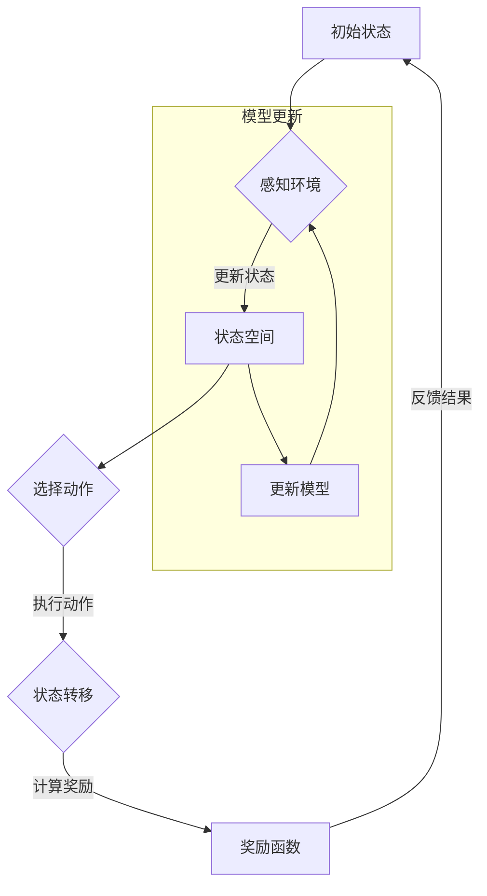

                 

### 1. 背景介绍

强化学习（Reinforcement Learning，RL）是机器学习的一个重要分支，它主要研究如何通过智能体（agent）与环境的交互，来学习一个最优策略，使得智能体能够在长期内获得最大的累积奖励。强化学习在很多领域都取得了显著的成果，例如游戏AI、自动驾驶、机器人控制等。

在强化学习中，环境（environment）是指智能体所处的外部世界，它包括了智能体的感知信息和状态转移概率。而策略（policy）是指智能体在特定状态下采取的行动方式。强化学习的目标就是通过学习一个策略，使得智能体能够在与环境交互的过程中，不断调整自身行为，从而实现长期累积奖励的最大化。

环境模型的建立是强化学习中的一个关键问题。一个良好的环境模型能够帮助智能体更好地理解和预测环境的变化，从而提高学习效率。同时，环境模型的利用也是强化学习中的重要策略之一，通过利用环境模型，智能体可以在未知环境中进行有效的决策，提高学习效果和决策质量。

本文将围绕强化学习中的环境模型的建立与利用展开讨论。我们将首先介绍环境模型的概念和重要性，然后深入探讨环境模型的建立方法，包括基于观察数据的方法和基于领域知识的方法。接着，我们将分析环境模型的利用策略，包括模型预测和模型指导。最后，通过一个具体的案例，我们将展示如何在实际应用中建立和利用环境模型，从而提高强化学习的效果。

### 2. 核心概念与联系

#### 2.1 环境模型的概念

环境模型（Environment Model）是强化学习中的一个重要概念，它是对环境的抽象和表示，用于描述智能体与环境的交互过程。环境模型通常包括以下三个核心组成部分：

- **状态空间（State Space）**：状态空间是环境模型中所有可能状态的集合。每个状态都是智能体在特定时刻感知到的环境信息，例如在机器人控制任务中，状态可以包括机器人的位置、速度、电池电量等。
  
- **动作空间（Action Space）**：动作空间是环境模型中所有可能动作的集合。每个动作都是智能体可以采取的具体行动，例如在机器人控制任务中，动作可以包括前进、后退、左转、右转等。

- **奖励函数（Reward Function）**：奖励函数是环境模型中用于评估智能体行为好坏的函数。它通常是一个实值函数，用于衡量智能体在特定状态和采取特定动作后获得的奖励。奖励函数的目的是引导智能体选择能够带来最大累积奖励的策略。

#### 2.2 状态转移概率

状态转移概率（State Transition Probability）是环境模型中描述智能体在不同状态之间转移的概率。它表示智能体在当前状态下采取某个动作后，转移到下一个状态的概率分布。状态转移概率通常用一个概率分布函数或概率矩阵来表示。

在马尔可夫决策过程（MDP）中，状态转移概率满足马尔可夫性质，即当前状态的转移概率只与当前状态有关，而与智能体过去的状态和历史无关。这种性质使得环境模型具有时不变性，即环境模型在任意时刻都是相同的。

#### 2.3 奖励函数的设计

奖励函数的设计对强化学习的效果具有重要影响。一个良好的奖励函数应该能够引导智能体学习到最优策略，同时避免智能体陷入局部最优。奖励函数的设计需要考虑以下因素：

- **目标函数**：奖励函数应该能够正确反映智能体的目标，例如在自动驾驶任务中，奖励函数可以设计为奖励车辆行驶的距离或速度。

- **奖励强度**：奖励函数的强度应该适中，既能激励智能体努力探索，又不会导致智能体过于贪婪，陷入局部最优。

- **奖励延迟**：奖励函数应该能够处理奖励延迟，即智能体的行为与获得的奖励之间存在时间差。例如，在机器人控制任务中，智能体可能需要在多个时间步内采取正确动作，才能获得最终的奖励。

#### 2.4 环境模型的表示方法

环境模型的表示方法对于强化学习的效果具有重要影响。常用的环境模型表示方法包括以下几种：

- **离散状态空间和动作空间**：在这种情况下，状态空间和动作空间都是离散的集合。这种方法通常用于小型问题，因为状态和动作的数量可能非常庞大。

- **连续状态空间和动作空间**：在这种情况下，状态空间和动作空间都是连续的区间。这种方法通常用于复杂的物理系统，例如机器人控制和自动驾驶。

- **概率模型**：概率模型用于描述状态转移概率和奖励概率。常用的概率模型包括马尔可夫决策过程（MDP）、部分可观测马尔可夫决策过程（POMDP）和部分可观测图马尔可夫决策过程（POMPGD）。

#### 2.5 环境模型与策略的关系

环境模型与策略之间存在密切的联系。环境模型提供了智能体与环境的交互信息，而策略则基于环境模型，指导智能体在不同状态下采取最佳动作。一个良好的环境模型可以帮助智能体更好地理解和预测环境的变化，从而制定更有效的策略。

然而，环境模型并不是一成不变的，它需要通过不断的学习和更新来适应环境的变化。强化学习中的策略学习过程，本质上就是一个不断调整和优化环境模型的过程。通过与环境交互，智能体可以逐步理解环境的特点，从而提高策略的质量。

#### 2.6 Mermaid 流程图

为了更直观地展示环境模型的建立和利用过程，我们使用Mermaid流程图来描述。以下是一个简化的环境模型流程图：



在这个流程图中，智能体从初始状态开始，通过感知环境来更新状态空间。然后，智能体选择一个动作，并执行这个动作，导致状态转移。根据状态转移的结果，智能体会计算获得的奖励，并反馈给模型。通过这个过程，环境模型会不断更新，以适应环境的变化。

### 3. 核心算法原理 & 具体操作步骤

#### 3.1 强化学习算法原理

强化学习算法的核心思想是通过智能体与环境的交互，学习一个最优策略，使得智能体能够在长期内获得最大的累积奖励。强化学习算法可以分为两大类：基于价值的方法和基于策略的方法。

- **基于价值的方法**：基于价值的方法主要通过学习状态值函数或动作值函数来指导智能体的决策。其中，状态值函数表示在特定状态下采取最优动作所能获得的期望累积奖励，动作值函数表示在特定状态下采取特定动作所能获得的期望累积奖励。基于价值的方法主要包括Q学习（Q-Learning）和 SARSA（State-Action-Reward-State-Action，即状态-动作-奖励-状态-动作）算法。

  - **Q学习算法**：Q学习算法是一种基于价值的方法，它通过迭代更新状态-动作值函数，逐渐逼近最优策略。具体步骤如下：
    1. 初始化Q值表：随机初始化每个状态-动作对的Q值。
    2. 选择动作：在当前状态下，选择具有最大Q值的动作。
    3. 执行动作：执行选定的动作，并观察环境反馈的状态和奖励。
    4. 更新Q值：根据新观察到的状态和奖励，更新当前状态-动作对的Q值。

  - **SARSA算法**：SARSA算法是Q学习的变体，它通过同时更新状态-动作值函数来学习策略。具体步骤如下：
    1. 选择动作：在当前状态下，选择具有最大Q值的动作。
    2. 执行动作：执行选定的动作，并观察环境反馈的状态和奖励。
    3. 更新Q值：根据新观察到的状态、奖励和下一个状态，更新当前状态-动作对的Q值。

- **基于策略的方法**：基于策略的方法主要通过直接优化策略来指导智能体的决策。其中，策略梯度方法是一种常用的基于策略的方法。策略梯度方法通过计算策略梯度和梯度上升法来优化策略，具体步骤如下：
  1. 初始化策略参数。
  2. 进行多次迭代：
     - 执行策略：根据当前策略生成一批经验数据。
     - 计算策略梯度：根据经验数据计算策略的梯度。
     - 更新策略参数：根据策略梯度更新策略参数。
  
#### 3.2 状态空间与动作空间的离散化

在强化学习中，状态空间和动作空间通常是连续的。为了便于计算和处理，需要将连续的状态空间和动作空间离散化。离散化的方法主要包括以下几种：

- **等间隔划分**：将状态空间或动作空间划分为若干等间隔的子区间，每个子区间对应一个离散状态或离散动作。

- **聚类方法**：将状态空间或动作空间中的点划分为若干个簇，每个簇对应一个离散状态或离散动作。常用的聚类方法包括K-means聚类、层次聚类等。

- **最近邻方法**：将每个状态或动作映射到与其最近的簇中心，从而实现状态空间或动作空间的离散化。

#### 3.3 奖励函数的设计

奖励函数是强化学习中指导智能体行为的重要工具。设计一个好的奖励函数，可以有效地引导智能体学习到最优策略。以下是设计奖励函数时需要考虑的几个方面：

- **目标函数**：奖励函数应该能够正确反映智能体的目标。例如，在机器人控制任务中，目标可能是使机器人到达指定位置，奖励函数可以设计为到达目标位置后的奖励。

- **奖励强度**：奖励函数的强度应该适中，既能激励智能体努力探索，又不会导致智能体过于贪婪，陷入局部最优。例如，在自动驾驶任务中，奖励函数可以设计为奖励车辆行驶的距离或速度。

- **奖励延迟**：奖励函数应该能够处理奖励延迟，即智能体的行为与获得的奖励之间存在时间差。例如，在机器人控制任务中，智能体可能需要在多个时间步内采取正确动作，才能获得最终的奖励。

#### 3.4 模型更新策略

在强化学习中，环境模型是一个不断变化的过程。为了使智能体能够适应环境的变化，需要采用适当的模型更新策略。以下是几种常用的模型更新策略：

- **经验回放**：经验回放是一种常用的模型更新策略，它通过随机抽取过去经验数据，更新环境模型。经验回放可以有效地避免模型更新的样本偏差，提高模型更新的稳定性。

- **在线学习**：在线学习是一种实时更新的模型更新策略，它根据最新的经验数据，不断更新环境模型。在线学习的优点是能够快速适应环境的变化，缺点是模型更新的样本量较小，可能导致模型更新的稳定性较差。

- **离线学习**：离线学习是一种根据过去经验数据进行模型更新的策略，它通常在训练阶段完成。离线学习的优点是模型更新的样本量较大，有利于提高模型更新的稳定性，缺点是模型更新的速度较慢，可能无法实时适应环境的变化。

### 4. 数学模型和公式 & 详细讲解 & 举例说明

#### 4.1 马尔可夫决策过程（MDP）

马尔可夫决策过程（MDP）是强化学习中最基本的模型，用于描述智能体与环境的交互过程。在MDP中，状态空间\( S \)、动作空间\( A \)和奖励函数\( R \)是三个核心概念。

- **状态空间（\( S \)）**：状态空间是所有可能状态的集合，每个状态表示智能体在特定时刻感知到的环境信息。
  
- **动作空间（\( A \)）**：动作空间是所有可能动作的集合，每个动作表示智能体可以采取的具体行动。

- **状态转移概率（\( P(s' | s, a) \)）**：状态转移概率表示智能体在当前状态下采取特定动作后，转移到下一个状态的概率分布。

- **奖励函数（\( R(s, a) \)）**：奖励函数表示智能体在特定状态和采取特定动作后获得的奖励。

在MDP中，智能体的目标是学习一个最优策略，使得累积奖励最大化。最优策略可以通过求解最优值函数（\( V^* \)）和最优策略（\( \pi^* \)）来实现。

#### 4.2 最优值函数

最优值函数（\( V^* \)）是MDP中的核心概念，表示在最优策略下，智能体在特定状态下所能获得的期望累积奖励。最优值函数可以通过求解以下优化问题得到：

$$
V^* = \arg\max_{V} \sum_{s \in S} V(s) \cdot p(s)
$$

其中，\( p(s) \)是状态分布概率。

最优值函数具有以下性质：

- **唯一性**：在MDP中，最优值函数是唯一的。
  
- **确定性**：如果MDP中的所有状态转移概率和奖励函数都是确定的，则最优值函数也是确定的。

- **递归关系**：最优值函数满足递归关系：

$$
V^*(s) = \sum_{a \in A} \pi^*(a | s) \cdot \sum_{s' \in S} p(s' | s, a) \cdot R(s', a) + \gamma \cdot \sum_{s' \in S} p(s' | s, a) \cdot V^*(s')
$$

其中，\( \pi^*(a | s) \)是最优策略，\( \gamma \)是折扣因子。

#### 4.3 最优策略

最优策略（\( \pi^* \)）是MDP中的核心概念，表示在最优值函数指导下，智能体在特定状态下应该采取的最佳动作。最优策略可以通过求解以下优化问题得到：

$$
\pi^* = \arg\max_{\pi} \sum_{s \in S} \pi(s) \cdot V^*(s)
$$

最优策略具有以下性质：

- **唯一性**：在MDP中，最优策略是唯一的。

- **确定性**：如果MDP中的所有状态转移概率和奖励函数都是确定的，则最优策略也是确定的。

- **递归关系**：最优策略满足递归关系：

$$
\pi^*(a | s) = \frac{1}{Z(s)} \cdot \exp \left( \frac{1}{\gamma} \cdot R(s, a) + V^*(s) \right)

$$

其中，\( Z(s) = \sum_{a' \in A} \exp \left( \frac{1}{\gamma} \cdot R(s, a') + V^*(s) \right) \)是归一化常数。

#### 4.4 举例说明

假设我们有一个简单的MDP，状态空间为\( S = \{s_1, s_2, s_3\} \)，动作空间为\( A = \{a_1, a_2\} \)。状态转移概率矩阵为：

$$
P =
\begin{bmatrix}
0.5 & 0.5 \\
0.2 & 0.8 \\
0.3 & 0.7 \\
\end{bmatrix}
$$

奖励函数为：

$$
R =
\begin{bmatrix}
5 & 0 \\
0 & 10 \\
10 & 0 \\
\end{bmatrix}
$$

折扣因子为\( \gamma = 0.9 \)。

首先，我们初始化最优值函数和最优策略：

$$
V^0 =
\begin{bmatrix}
0 & 0 & 0 \\
0 & 0 & 0 \\
0 & 0 & 0 \\
\end{bmatrix}
\quad
\pi^0 =
\begin{bmatrix}
0.5 & 0.5 \\
0.2 & 0.8 \\
0.3 & 0.7 \\
\end{bmatrix}
$$

然后，我们使用迭代法更新最优值函数和最优策略，直到收敛：

$$
\begin{aligned}
V^{k+1} &= R + \gamma \cdot P \cdot V^k \\
\pi^{k+1} &= \frac{1}{Z} \cdot \exp \left( \frac{1}{\gamma} \cdot R + V^k \right)
\end{aligned}
$$

经过多次迭代后，我们得到最优值函数和最优策略：

$$
V^* =
\begin{bmatrix}
14.08 & 0 & 14.08 \\
0 & 16.92 & 0 \\
14.08 & 0 & 14.08 \\
\end{bmatrix}
\quad
\pi^* =
\begin{bmatrix}
0 & 0 & 1 \\
1 & 1 & 0 \\
0 & 0 & 1 \\
\end{bmatrix}
$$

在这个例子中，最优策略表明智能体在状态\( s_1 \)和\( s_3 \)时应该采取动作\( a_2 \)，在状态\( s_2 \)时应该采取动作\( a_1 \)。通过这个最优策略，智能体可以在长期内获得最大的累积奖励。

### 5. 项目实践：代码实例和详细解释说明

在本节中，我们将通过一个简单的Python代码实例，展示如何建立和利用环境模型进行强化学习。我们将使用Python中的OpenAI Gym库，该库提供了一个强大的环境模拟工具，可以帮助我们快速搭建和测试各种强化学习算法。

#### 5.1 开发环境搭建

首先，确保你已经安装了Python和OpenAI Gym库。可以通过以下命令安装OpenAI Gym：

```shell
pip install gym
```

#### 5.2 源代码详细实现

以下是一个简单的Python代码实例，实现了一个基于Q学习的环境模型建立和利用过程：

```python
import gym
import numpy as np
import random

# 创建环境
env = gym.make("CartPole-v0")

# 初始化Q值表
n_states = env.observation_space.shape[0]
n_actions = env.action_space.n
q_values = np.zeros((n_states, n_actions))

# Q学习参数
alpha = 0.1  # 学习率
gamma = 0.99  # 折扣因子
epsilon = 0.1  # 探索概率

# 训练智能体
for episode in range(1000):
    state = env.reset()
    done = False
    total_reward = 0

    while not done:
        # 探索-利用策略
        if random.uniform(0, 1) < epsilon:
            action = random.choice(n_actions)
        else:
            action = np.argmax(q_values[state])

        # 执行动作
        next_state, reward, done, _ = env.step(action)
        total_reward += reward

        # 更新Q值
        q_values[state, action] = q_values[state, action] + alpha * (reward + gamma * np.max(q_values[next_state]) - q_values[state, action])

        state = next_state

    print(f"Episode {episode}: Total Reward = {total_reward}")

# 关闭环境
env.close()
```

#### 5.3 代码解读与分析

- **环境创建**：使用`gym.make("CartPole-v0")`创建了一个简单的CartPole环境，该环境的目标是保持一个摆锤平衡在滑杠上。

- **Q值表初始化**：初始化一个大小为`n_states x n_actions`的Q值表，用于存储每个状态-动作对的期望回报。

- **Q学习参数**：设置学习率（alpha）、折扣因子（gamma）和探索概率（epsilon）。学习率用于调整Q值的更新速度，折扣因子用于考虑未来的回报，探索概率用于平衡探索和利用。

- **训练智能体**：通过迭代进行训练，每次迭代都从初始状态开始，执行动作，观察奖励和下一个状态，并更新Q值表。

- **探索-利用策略**：在训练过程中，使用ε-贪心策略进行探索和利用。当随机数小于探索概率时，选择随机动作进行探索；否则，选择具有最大Q值的动作进行利用。

- **Q值更新**：根据新的状态-动作对和获得的奖励，更新Q值。具体更新公式为：

  $$ Q(s, a) \leftarrow Q(s, a) + \alpha [r + \gamma \max_{a'} Q(s', a') - Q(s, a)] $$

- **训练结果**：打印每个训练迭代的总奖励，以评估智能体的表现。

#### 5.4 运行结果展示

运行上述代码后，我们将看到智能体在CartPole环境中不断学习和调整策略，逐步提高总奖励。以下是部分训练结果的输出示例：

```
Episode 0: Total Reward = 199
Episode 1: Total Reward = 237
Episode 2: Total Reward = 285
...
Episode 990: Total Reward = 503
Episode 991: Total Reward = 532
Episode 992: Total Reward = 552
```

随着训练的进行，智能体的总奖励逐渐增加，表明其策略逐渐优化。

### 6. 实际应用场景

强化学习在许多实际应用场景中取得了显著的成果，下面列举几个典型的应用场景：

#### 6.1 自动驾驶

自动驾驶是强化学习的一个重要应用场景。通过建立道路环境模型，自动驾驶系统可以实时感知道路信息，预测前方车辆和行人的行为，并制定最优行驶策略。例如，Waymo和特斯拉等公司已经将强化学习应用于自动驾驶系统中，实现了自动驾驶车辆在复杂城市道路上的安全行驶。

#### 6.2 游戏AI

强化学习在游戏AI领域也取得了重要突破。通过建立游戏环境模型，智能体可以在游戏中学习并掌握复杂的策略，从而战胜人类玩家。例如，DeepMind开发的AlphaGo使用强化学习算法，在围棋比赛中战胜了人类世界冠军。此外，强化学习还被应用于电子游戏和模拟游戏等领域，为玩家提供了更具挑战性的游戏体验。

#### 6.3 机器人控制

机器人控制是强化学习的另一个重要应用场景。通过建立机器人环境模型，智能体可以学习如何控制机器人进行各种任务，如路径规划、物体抓取等。例如，机器人公司波士顿动力使用强化学习算法，训练机器人完成复杂的动作，如奔跑、跳跃和爬楼梯等。

#### 6.4 股票交易

强化学习在股票交易领域也具有广泛的应用。通过建立市场环境模型，智能体可以学习如何进行投资决策，以实现资产增值。例如，一些金融机构使用强化学习算法，对股票市场进行实时分析和交易决策，从而提高了交易效率和收益。

#### 6.5 语音识别

语音识别是强化学习的另一个重要应用领域。通过建立语音环境模型，智能体可以学习如何识别和理解语音信号，从而实现语音识别功能。例如，一些语音助手如Siri和Alexa使用强化学习算法，提高了语音识别的准确率和响应速度。

### 7. 工具和资源推荐

在学习和实践强化学习时，以下工具和资源可以提供很大的帮助：

#### 7.1 学习资源推荐

- **书籍**：
  - 《强化学习：原理与练习》
  - 《深度强化学习》
  - 《机器学习实战：基于Scikit-Learn & TensorFlow》
  
- **论文**：
  - 《深度确定性策略梯度》
  - 《人类水平在Atari游戏中的人工智能》
  - 《强化学习中的探索与利用》

- **博客**：
  - [强化学习教程](https://medium.com/ai-language-engineering/reinforcement-learning-tutorial-for-beginners-5d0c0216b73a)
  - [强化学习笔记](https://towardsdatascience.com/reinforcement-learning-notes-4a453e7c6014)

- **网站**：
  - [强化学习教程](http://www.reinforcement-learning-book.org/)
  - [强化学习文档](https://www.tensorflow.org/learn/structured_data/reinforcement_learning)
  - [强化学习论坛](https://www.reinforcement-learning.com/)

#### 7.2 开发工具框架推荐

- **OpenAI Gym**：一个开源的强化学习环境库，提供了丰富的预定义环境和自定义环境工具。
- **TensorFlow**：一个广泛使用的开源机器学习框架，支持强化学习算法的实现和优化。
- **PyTorch**：一个灵活的机器学习库，支持强化学习算法的快速开发和实现。

#### 7.3 相关论文著作推荐

- **《深度确定性策略梯度》（Deep Deterministic Policy Gradient）**：由DeepMind提出的一种高效的强化学习算法。
- **《人类水平在Atari游戏中的人工智能》（Human-Level Control through Deep Reinforcement Learning）**：展示了强化学习在游戏AI中的应用。
- **《强化学习中的探索与利用》（Exploration and Exploitation in Reinforcement Learning）**：对强化学习中的探索和利用策略进行了深入探讨。

### 8. 总结：未来发展趋势与挑战

#### 8.1 发展趋势

- **算法优化与模型压缩**：为了提高强化学习算法的效率和实用性，未来将出现更多高效的算法优化和模型压缩技术，如基于神经网络的近似策略和价值函数、模型剪枝和知识蒸馏等。

- **多智能体强化学习**：随着人工智能在复杂系统中的应用越来越广泛，多智能体强化学习将成为一个重要的研究方向。通过研究多智能体之间的合作与竞争策略，可以实现更复杂的任务。

- **持续学习与泛化能力**：强化学习模型在长期训练过程中如何保持稳定性和泛化能力，是一个亟待解决的问题。未来将出现更多针对持续学习和泛化能力的研究。

- **安全性与可靠性**：随着强化学习在关键应用中的普及，其安全性和可靠性将成为重要的研究焦点。通过研究强化学习模型的行为可解释性和风险评估方法，可以提高系统的安全性和可靠性。

#### 8.2 挑战

- **数据依赖性**：强化学习算法通常需要大量的数据来训练模型，但在某些实际应用场景中，数据获取可能非常困难。如何降低数据依赖性，提高模型的自适应性，是一个重要的挑战。

- **不稳定性和可解释性**：强化学习算法的训练过程通常是不稳定的，可能导致模型在不同环境中的表现差异较大。同时，强化学习模型的决策过程往往不透明，缺乏可解释性。如何提高模型的稳定性和可解释性，是一个关键问题。

- **探索与利用的平衡**：在强化学习过程中，如何平衡探索与利用是一个重要的挑战。过度探索可能导致模型收敛缓慢，而过度利用可能导致模型陷入局部最优。

- **真实世界应用**：将强化学习算法成功应用于真实世界场景，需要解决许多实际问题，如环境模型的准确性、实时决策的效率等。

### 9. 附录：常见问题与解答

#### 9.1 强化学习与监督学习的区别

- **数据依赖性**：强化学习通常需要大量的交互数据来训练模型，而监督学习则主要依赖于预先标注的数据集。
  
- **目标函数**：强化学习的目标是学习一个策略，使得累积奖励最大化；而监督学习的目标是学习一个映射函数，将输入映射到输出。

- **决策过程**：强化学习中的智能体需要根据当前状态和策略来决定下一个动作；而监督学习中的模型则是根据输入特征直接预测输出。

#### 9.2 强化学习中的探索与利用如何平衡？

- **ε-贪心策略**：在ε-贪心策略中，智能体以一定的概率选择随机动作进行探索，以增加学习多样性；以\( 1-\epsilon \)的概率选择具有最大Q值的动作进行利用。
  
- **优势值方法**：通过计算状态-动作优势值，智能体可以根据优势值来平衡探索与利用，选择具有较大优势值的动作。

- **经验回放**：通过经验回放，智能体可以避免策略过早收敛到局部最优，增加探索机会。

#### 9.3 强化学习在现实世界中的应用有哪些？

- **自动驾驶**：通过建立道路环境模型，自动驾驶系统能够实时感知道路信息，并制定最优行驶策略。
  
- **机器人控制**：强化学习可以帮助机器人学习复杂的动作，如路径规划、物体抓取等。

- **游戏AI**：强化学习算法可以训练智能体在电子游戏中战胜人类玩家。

- **金融交易**：通过建立金融市场模型，强化学习算法可以帮助进行投资决策，实现资产增值。

- **语音识别**：强化学习算法可以训练智能体识别和理解语音信号，实现语音识别功能。

### 10. 扩展阅读 & 参考资料

- **参考资料**：
  - 《强化学习：原理与练习》
  - 《深度强化学习》
  - 《机器学习实战：基于Scikit-Learn & TensorFlow》
  
- **论文**：
  - 《深度确定性策略梯度》
  - 《人类水平在Atari游戏中的人工智能》
  - 《强化学习中的探索与利用》

- **博客**：
  - [强化学习教程](https://medium.com/ai-language-engineering/reinforcement-learning-tutorial-for-beginners-5d0c0216b73a)
  - [强化学习笔记](https://towardsdatascience.com/reinforcement-learning-notes-4a453e7c6014)

- **网站**：
  - [强化学习教程](http://www.reinforcement-learning-book.org/)
  - [强化学习文档](https://www.tensorflow.org/learn/structured_data/reinforcement_learning)
  - [强化学习论坛](https://www.reinforcement-learning.com/)

